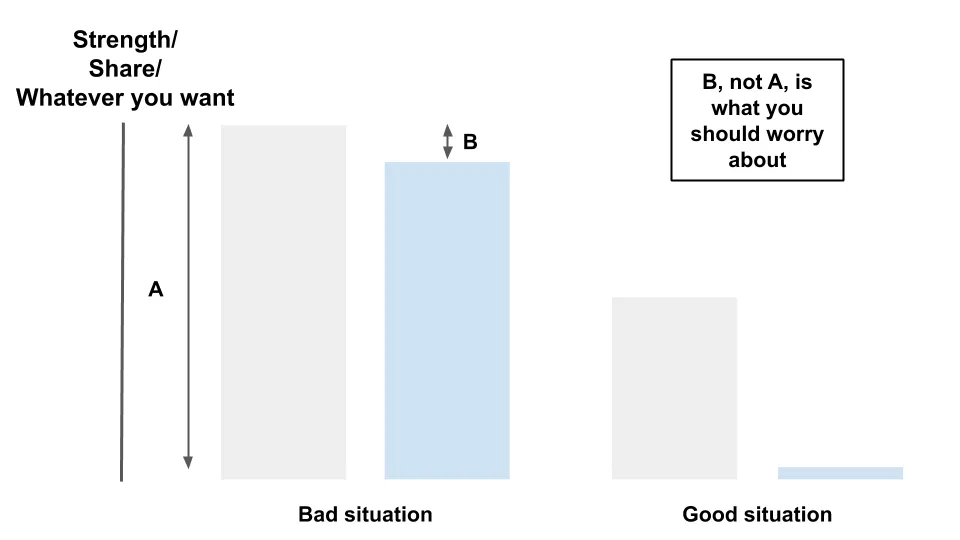

## Points à retenir

1. L’investissement concerne la performance relative\, pas absolue
2. La compétition technologique repose sur la force relative\, pas absolue
3. La société repose sur le statut relatif\, pas absolu

## 1\. Ne pariez pas sur le gagnant le plus probable

Imaginez que vous êtes analyste en investissement [^1]\.

Les analystes d’investissement font des recherches sur les entreprises et décident quelles actions acheter ou vendre\. Vous avez fait votre travail sur [Tencent](https://en.wikipedia.org/wiki/Tencent 'tencent')\, une entreprise chinoise d’internet\, concluant que les tendances commerciales\, de gestion et macro sont toutes positives\. Jeux vidéo et divertissement en ligne [will continue increasing in importance](https://www.statista.com/outlook/203/117/video-games/china 'stat')\, [the executive team is experienced](https://chinachannel.co/a-deep-dive-into-tencents-restructuring-the-struggle-to-master-b2b/ 'tencent')\, et la croissance démographique fournit un vent favorable [for at least ten years.](https://ourworldindata.org/future-population-growth 'population')

Vous modélissez tout cela dans Excel\. Écrivez un mémo d’investissement simple de 5 pages\. Préparez 50 pages de graphiques complexes de poche arrière au cas où [^2]\.

Convaincu de ton intelligence et de ta diligence\, tu présentes à ton patron Tencent\. Tu synchronises parfaitement ta réunion\, un peu après qu’il soit au bureau\, mais avant qu’il ne soit occupé à chercher des maisons de vacances d’été\.

Au début\, ça semble bien se passer\. Votre patron connaît Tencent\, ayant joué au golf avec le beau\-frère du COO de Tencent\. Il est d’accord avec tous vos points sur le business\, la gestion et la macro\. Super\.

À la fin de votre présentation\, vous vous sentez bien et attendez\-vous à ce que votre patron initie un petit poste chez Tencent\. À la place\, il se rassoit dans sa chaise\, rouvre ses onglets sur les maisons de vacances et vous dit que vous avez complètement raté le sujet\. Pas terriblement\.

Qu’est\-ce qui a mal tourné \?

**Là où tu as fait une erreur\, c’est de ne pas prendre en compte le consensus du marché\.** C’est une erreur que font la plupart des investisseurs particuliers\, et parfois aussi les professionnels\.

**Investir est un jeu de parents\, pas d’absolus\.** C’est la performance de l’action _par rapport aux attentes_ Cela détermine si vous obtenez des rendements supérieurs à la moyenne ou non\.

Toutes ces recherches que vous avez faites n’ont pas d’importance si elles sont largement connues\. Par définition\, cela est déjà intégré sur le marché\. Ce que vous devez montrer\, c’est [what the market is missing, and why that misperception will correct itself.](https://medium.com/graham-and-doddsville/pitch-the-perfect-investment-1a4e8d0c077b 'market') Si vous n’avez pas d’avantage [^3]\, ton argument est inutile\.

C’est pourquoi les entreprises qui affichent de bons chiffres pour leurs résultats peuvent encore voir le cours de leur action baisser\.

C’est pourquoi on peut obtenir des rendements inférieurs à la moyenne en achetant une excellente entreprise dont le prix est parfait\, et pourquoi on peut obtenir des rendements supérieurs à la moyenne en achetant une entreprise médiocre qui a été laissée pour morte\.

Et c’est pourquoi il faut connaître illégalement les bénéfices de l’entreprise à l’avance [doesn't mean you'll make money 100% of the time.](https://www.sec.gov/litigation/complaints/2019/comp-pr2019-1.pdf 'SEC') [^4]

En investissement\, [you want to bet on the mispriced horse, not the horse most likely to win.](https://www.oaktreecapital.com/docs/default-source/memos/you-bet.pdf 'bet')

**Cela s’applique aussi bien au niveau micro aux pitchings individuels des actions\, qu’au niveau macro aux performances des sociétés d’investissement\.** La compétence absolue n’a pas d’importance\. C’est la compétence du fonds _par rapport à la concurrence_ cela détermine si elle peut obtenir des rendements supérieurs à la moyenne\.

C’est pourquoi des informations comme le téléchargement de carte bancaire\, le téléchargement d’applications ou les données satellites ne sont plus un facteur de surperformance\, mais des enjeux de tableau\.

[It's why luck is playing a bigger role, since the dispersion in skill has been reduced.](https://research-doc.credit-suisse.com/docView?language=ENG&format=PDF&source_id=em&document_id=805456950&serialid=LsvBuE4wt3XNGE0V%2B3ec251NK9soTQqcMVQ9q2QuF2I%3D 'CS')

Et c’est pourquoi [the overall outperformance (alpha) for hedge funds has stagnated,](http://finance.darden.virginia.edu/wp-content/uploads/2019/08/Hedge-Fund-Alpha_09.29.2019.pdf 'alpha') À mesure que de plus en plus d’investisseurs connaissent les meilleures pratiques et cadres de travail\.

En investissement\, tout est relatif\.

## 2\. Votre parent de la tech a huit ans

Imaginez que vous êtes dans une entreprise technologique vendant des widgets en ligne\.

Vous avez trouvé un canal publicitaire qui vous coûte 1 \$ pour acquérir un client\, et chaque client vous rapporte 10 \$ en valeur à vie [^5]\.

Ça semble être une super affaire\, alors tu commences à y consacrer ton budget marketing\. Ça marche\, et tu commences à chercher des maisons de vacances d’été à acheter avec un profit supplémentaire\.

Sauf que vous commencez à réaliser que le nombre de clients que vous obtenez continue de diminuer\, ce qui implique que votre coût d’acquisition client \(CAC\) continue d’augmenter\. Au bout d’un moment\, vous atteignez à peine le seuil de rentabilité avec les clients\. Les rêves de vacances d’été anéantis\.

Qu’est\-ce qui a mal tourné \?

**Là où tu as fait une erreur\, c’est de ne pas considérer l’équilibre du marché\.** Peu importe l’efficacité de vos dépenses marketing\, si vos concurrents étaient plus efficaces que vous\.

Ils dépenseront plus que vous\, acquiertront plus de clients\, feront plus de profit\, et recommenceront\. Ce faisant\, ils imposeront une efficacité des prix sur le marché et sur vous\. Vous optimisiez pour les maxima locaux \; tous les autres résolvaient pour les maxima mondiaux\.

C’est pourquoi connaître vos concurrents est essentiel à la survie de l’entreprise\. Si vous êtes satisfait de votre CAC hors ligne en tant qu’entreprise majoritairement hors ligne\, vous feriez mieux d’espérer que quelqu’un ne le soit pas [dropship your product](https://www.theatlantic.com/technology/archive/2018/01/the-strange-brands-in-your-instagram-feed/550136/ 'dropship') et augmenter votre CAC\. Si vous êtes satisfait de votre CAC en ligne comme une entreprise principalement en ligne\, vous feriez mieux d’espérer que quelqu’un ne le soit pas [open a retail store](https://www.businessinsider.com/online-direct-to-consumer-brands-with-retail-stores-locations-2018-2#allbirds-3 'DTC') et te fermer\.

C’est pourquoi les parts de marché relatives sont plus importantes que les parts de marché absolues\. La différence d’efficacité des dépenses\, et non l’efficacité des dépenses seule\, est ce qui s’accumule dans le temps pour obtenir des rendements supérieurs à la moyenne\.

Et c’est pourquoi [word of mouth and customer loyalty is important](https://medium.com/@gavin_baker/scale-and-loyalty-are-more-important-online-than-offline-which-drives-much-of-the-winner-take-992345be93a9 'loyalty')\, puisqu’il permet de différer temporairement les effets des comparaisons relatives\. Lorsque le CAC est à un plancher de 0 \$\, ce n’est plus le facteur limitant [^6]\.

Cela ne concerne pas seulement l’acquisition de clients\, mais tous les aspects de l’entreprise\, des talents que vous embauchez à la qualité du produit que vous fabriquez\. Connaître leurs forces seules sans savoir comment elles se comparent aux autres n’a pas de sens\.

Autrefois\, lorsque l’information\, les personnes et les produits circulaient plus lentement\, ce problème était moindre\. Les clients vous comparaient aux alternatives physiquement les plus proches et en restaient là\. Aujourd’hui\, le parent concerné est partout et partout\. Vous êtes en concurrence avec [8 year old toy reviewers](https://canoe.com/business/money-news/highest-paid-youtube-star-is-an-eight-year-old-boy 'toy') et [engineers outsourcing their own jobs to China so they can surf reddit.](https://www.npr.org/sections/thetwo-way/2013/01/16/169528579/outsourced-employee-sends-own-job-to-china-surfs-web 'reddit') L’effet de la technologie a réduit l’importance de la proximité physique\.

C’est le [Red Queen hypothesis](https://en.wikipedia.org/wiki/Red_Queen_hypothesis 'Queen') Avec des entreprises qui doivent constamment trouver un avantage\, et la course qui s’accélère chaque année\. Les découvertes sont partagées et consommées au fil du temps\, érosant constamment votre avantage\. Une fois que vous n’avez plus d’avantage\, vous obtenez des rendements moyens\.

En tech\, tout est relatif\.

## 3\. Relativement parlant\, le milliardaire n’est pas riche

Imagine que tu essaies juste de vivre ta vie\.

Non\, attends\, tu n’as pas à imaginer\, c’est nous tous\.

Tu as lu les livres d’auto\-assistance\, tu es allé à cette retraite zen\, et tu as regardé ce TED talk\. Ils te disent tous de te concentrer sur ton amélioration et d’être moins obsédé par la comparaison avec les autres\.

Même Google donne 1\,8 milliard de résultats pour « ne pas se comparer aux autres » contre 0\,4 milliard pour « comment se comparer aux autres »\. Et les meilleurs résultats pour ce dernier sont tous des articles expliquant comment faire _Stop_ comparer\.

Et c’est vrai\. Tu devrais te concentrer sur ton amélioration et essayer de [be 1% better every day.](https://heleo.com/get-1-better-every-day/19161/ '1%')

Mais tu sais déjà où je veux en venir\.

Il y a une différence entre ce que les gens disent et ce qu’ils font réellement\. Tu peux te juger sur un standard absolu\, mais tout le monde te juge sur un standard relatif\. En fonction de leurs attentes envers toi\, ou par rapport à quelqu’un d’autre\.

La société est une grande [sorting algorithm.](https://en.wikipedia.org/wiki/Sorting_algorithm 'sort') [^7]

C’est pourquoi nous aimons soutenir les outsiders\, l’histoire du redressement ou les outsiders\. Nous récompensons ceux qui performent mieux que prévu\, et nous nous soucions moins de ceux qui performent comme prévu\, même s’ils ont été excellents tout au long\. Il y a même toute une parabole biblique à ce sujet\, [the prodigal son.](https://en.wikipedia.org/wiki/Parable_of_the_Prodigal_Son 'prodigal') [^8]

C’est pourquoi nous nous obsédons sur des indicateurs quantifiables qui peuvent démontrer notre statut relatif les uns par rapport aux autres\. Abonnés\, likes\, partages\. Tant que cela peut montrer où nous nous situons en comparaison\, nous le désirerons toujours\. [^9]

Et c’est pourquoi le PDG de Goldman Sachs et milliardaire Llyod Blankfein [doesn't feel rich, since he's comparing himself against his multi-billionaire friends.](https://markets.businessinsider.com/news/stocks/goldman-sachs-ex-ceo-lloyd-blankfein-might-vote-trump-sanders-2020-2-1028927812 'CEO')

Que devriez\-vous faire alors \?

Sous\-prometteur et sur\-performant semble être une méthode populaire\. Les gens font des sacs de sable et ancrent les autres à des performances inférieures parce que ça marche [^10]\.

Choisir votre propre groupe de concurrents pour vous comparer pourrait être une autre façon\. Si vous n’êtes pas satisfait de votre pair\, il y a un milliard de personnes avec qui échanger\.

Et tu devrais quand même chercher à te mesurer selon ton propre score\, et t’améliorer pour le plaisir\. Sache juste que ce n’est pas comme ça que les autres te mesurent\.

Dans la vie\, tout est relatif\.

## Autres

1. [Jukebox is an AI that makes music. Check out a re-rendition of Ella Fitzgerald](https://openai.com/blog/jukebox/ 'Juke')
2. [Higher reputation sellers are less likely to take advantange of shortages in supply by price gouging](http://leixu.org/xu_price_gouging.pdf 'price')
3. ["The SEC is basically saying 'spring loading' is legal insider trading."](https://nongaap.substack.com/p/profiting-from-corp-governance-dark-bef 'Mike')
4. ["Lying somewhere between a club and a loosely defined set of friends, the Small Group is a repeated theme in the lives of the successful"](https://jmulholland.com/small-group/ 'small')
5. ["Turns out, even patients who appear \[to be\] in a coma can have more cognitive function than can be observed with standard clinical methods"](https://aeon.co/essays/to-say-what-consciousness-is-science-explores-where-it-isnt? 'coma')

[^1]: Certains d’entre vous le sont probablement\. Je parle ici des analystes du côté acheteur\, pas des analystes du côté vendeur \(qui font des recherches mais n’investissent pas pour la société\) ou des analystes de la banque d’investissement \(contrairement au nom\, n’investissent pas du tout\)\.

[^2]: Un mémo d’investissement est un compte rendu de l’action que vous proposez\, couramment utilisé dans le secteur de l’investissement pour résumer votre idée\.

[^3]: Un cadre pour l’avantage de l’investissement est [the information, analysis, or time horizon framework that John Huber uses](http://sabercapitalmgt.com/what-is-your-edge/ 'Huber')

[^4]: De [page 34 of the pdf](https://www.sec.gov/litigation/complaints/2019/comp-pr2019-1.pdf 'pdf')\. Voir [this paper](https://pdfs.semanticscholar.org/a537/e9c2776ca4b50c059ada99a94110359ec3c9.pdf 'Chloe') par Chloe Xie\, cela montre en outre le faible \(mauvais\) rapport signal\/bruit sur ces échanges

[^5]: Pour le dire simplement\, [every customer pays you $10 for every $1 you're spending on them](https://blog.hubspot.com/service/how-to-calculate-customer-lifetime-value 'LTV')

[^6]: Je suppose qu’il peut y avoir un CAC négatif\, où quelqu’un d’autre vous paie pour acquérir des utilisateurs payants\, dans une situation à trois partis\. Je ne l’ai pas beaucoup vu\, mais dites\-moi si c’est une particularité du secteur dans lequel vous travaillez\.

[^7]: Un algorithme de tri est un programme qui place les éléments dans l’ordre souhaité\, une partie fondamentale de la programmation

[^8]: Un père a deux fils\, un bon et un mauvais\. Le mauvais quitte la maison pour s’amuser\, perd tout son argent après de nombreuses années\, et revient honteux\. À la surprise des deux fils\, le père accueille le mauvais à la maison avec une fête\. Le père dit que le mauvais fils a été perdu et qu’il est maintenant retrouvé\, et que cela mérite d’être célébré\. Le bon fils prend tout l’argent et part à Paris\, ce qui fait réaliser au père qu’il n’aurait pas dû dire cela\. Je me trompe peut\-être sur la morale de l’histoire\.

[^9]: Les utilisateurs de Reddit inventent des histoires pour gagner des « points de karma » alors que tout est inventé et que les points n’ont pas d’importance\. Même les rejetés de la société comme [hikikomoris](https://en.wikipedia.org/wiki/Hikikomori 'hiki') désirera toujours un certain statut\, comme commenter en ligne quelle série animée est supérieure et reflète le goût du spectateur

[^10]: [There is a study that disputes this advice, claiming it has no significant impact](https://www.inc.com/jessica-stillman/underpromise-and-overdeliver-is-terrible-advice.html 'study')
