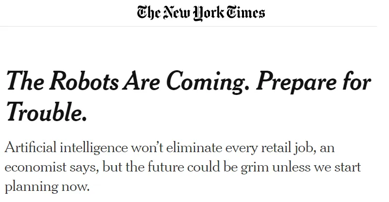
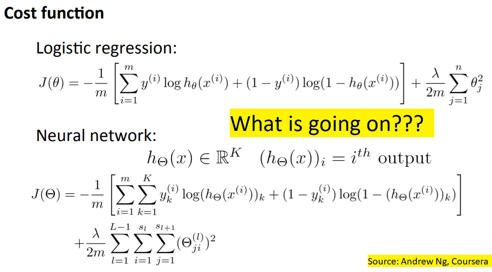

## À retenir

L’apprentissage automatique est moins effrayant que vous ne le pensez\, et plus courant que vous ne le pensez\.

## Magie de l’apprentissage automatique

Nous entendons parler tout le temps d’apprentissage automatique \(ML\)\, d’apprentissage profond ou d’intelligence artificielle aujourd’hui [^1]\.

D’après les intérêts de recherche \:

À des mentions dans les livres \:

Aux gros titres des journaux sur des robots qui prennent le contrôle de nos emplois \:

L’intérêt pour le ML est croissant\, et il semble qu’un jour sur deux\, une nouvelle startup récolte 100 millions de dollars grâce à leur nouvelle technologie ML\.

Cependant\, la plupart des gens sont intimidés par le ML\, l’assimilant à une magie que seules les startups de pointe font\. Cela n’aide pas que les calculs puissent être intimidants \:

Aujourd’hui\, je veux vous aider à mieux comprendre le ML\, en regardant d’abord une entreprise utilisant le ML\, puis en passant en revue les bases du fonctionnement d’un réseau de neurones\. Mon objectif à la fin de tout ceci est que vous ayez moins peur chaque fois que quelqu’un utilise le terme « ML » comme s’il était trop cool pour l’école\.

## Étude de cas en apprentissage automatique

Imaginez que je vienne vous voir pour trouver un investissement dans une entreprise utilisant le ML\. Voici le pitch \:

« La société M utilise ML et [optical character recognition (OCR)](https://en.wikipedia.org/wiki/Optical_character_recognition 'OCR') pour comparer les données d’entrée à des centaines de millions d’enregistrements en une fraction de seconde\. Elle a déjà des partenariats avec Amazon\, le gouvernement américain et Fedex\. La société M a déjà augmenté sa capacité à permettre \>100 milliards de transactions par an\, et a étendu sa couverture à l’ensemble des États\-Unis\. »

Ça a l’air excitant\, non \? J’ai choisi certains langages\, mais ce n’est pas si loin de l’être [actual press releases by other companies:](https://www.eu-startups.com/2020/01/anyline_raises_over_10_million_and_zooms_to_us/ 'eu')

« Anyline\, une startup leader en reconnaissance optique de caractères \(OCR\) utilisant l’IA pour la reconnaissance de texte\, a levé 10\,7 millions d’euros en financement de série A\. La start\-up autrichienne\, qui travaille déjà avec de grands noms comme Toyota\, IBM\, Canon\, l’ONU et PepsiCo\, utilisera ces fonds pour ouvrir son premier bureau américain à Boston »

Mais revenons à l’entreprise M\. La partie OCR fait référence à ce qu’ils regardent une image et reconnaissent ce qu’elle dit via le ML\. On dirait qu’ils le font efficacement\, avec précision et à grande échelle\. Leurs partenariats semblent aussi respectables\. Vous pensez probablement qu’ils sont une licorne prometteuse menée par des diplômés de Stanford qui ont commencé à coder en couches\.

Investiriez\-vous \?

Si vous avez dit oui\, vous avez simplement investi dans le [United States Postal Service](https://www.enterpriseai.news/solution_content/hpe/governmentacademia/machine-learning-applications-for-the-modern-enterprise/ 'USPS')\.

Non\, vraiment\, la poste utilise le ML depuis longtemps\. [They started trialing it in 1997, and by 2014 were already mostly recognising addresses via ML algorithms.](https://www.buffalo.edu/content/dam/www/research/pdf/Postal-Automation-Highlights_20160516.pdf 'ML') Ce n’est pas tout à fait le stéréotype de la startup que tu imaginais\.

Mon but ici n’est pas de critiquer Anyline ou des startups similaires\. Je suis sûr qu’ils résolvent des problèmes difficiles et ne sont pas du pur battage médiatique [^2]\. Au contraire\, je veux que tu réalises que **Le ML est utilisé dans des scénarios à l’air banal\, et cela fait déjà un certain temps\.** La prochaine fois que quelqu’un te propose ML\, garde ça en tête\.

## Intuition de l’apprentissage automatique

Maintenant que nous savons où l’apprentissage automatique est utilisé\, voyons comment le ML peut fonctionner\. Je vais utiliser un [neural network](http://news.mit.edu/2017/explained-neural-networks-deep-learning-0414 'NN') pour cela\, il existe cependant de nombreuses autres façons de faire tourner ML\.

Les réseaux de neurones sont modélisés d’après les neurones du cerveau\, il sera donc utile de comprendre comment fonctionne cette connexion\. Voici à quoi ressemble un neurone \:

Tant que nous sommes encore [aren't quite sure how the brain works, a leading theory is that the neurons can take inputs, do some computation, and then send outputs.](https://www.quantamagazine.org/neural-dendrites-reveal-their-computational-power-20200114/ 'neural') [^3] Une façon simplifiée de représenter deux neurones interagissant pourrait être la suivante\. Imaginez que le cercle est le corps principal\, et que cette droite est l’axone qui se connecte aux autres neurones \:

Et si vous aviez trois paires de neurones\, cela pourrait ressembler à ceci \:

Et si les neurones pouvaient interagir entre eux\, cela pourrait ressembler à ceci [^4]\:

Gardons cette image à l’esprit\, alors que nous réfléchissons à la façon dont cela pourrait se rapporter aux ordinateurs et au ML\.

Prenons une équation mathématique simple\, comme 2 x 3 \= 6\. Fixons « 2 » comme données d’entrée\, « x 3 » comme fonction que nous voulons exécuter\, et « 6 » comme données de sortie\. Cela nous donne quelque chose comme ceci \:

Et si vous aviez plus d’une donnée d’entrée \? Vous pourriez faire \(2 \+ 5\) x 3 \= 21\. Cela nous donne quelque chose comme ceci \:

Et encore une fois\, nous pouvons combiner plusieurs fonctions interagissant sur plusieurs entrées\, ainsi \:

Vous pouvez voir que cela ressemble au diagramme d’interaction neuronale ci\-dessus\, d’où le nom « réseau de neurones »\.

Allons encore plus loin\. Imaginez que vous aviez des valeurs dans A\, B et C\, comme avant\. Cette fois\, les valeurs représentent [pixel values.](https://homepages.inf.ed.ac.uk/rbf/HIPR2/value.htm#:~:text=For%20a%20grayscale%20images%2C%20the,is%20taken%20to%20be%20white. 'pixel') Dans ce cas\, il s’agit de 3 pixels\.

Vous pouvez également faire une sorte de fonction mathématique sur ces points de données\, et obtenir des résultats en X\, Y\, Z\. Nous allons ignorer exactement quelle fonction mathématique nous utilisons pour l’instant [^5]\, mais il ne retourne que 0 ou 1 à partir des points de données\. Non seulement cela\, mais il ne nous donnera qu’un seul « 1 »\, le reste étant « 0 »\. Les sorties ici représentent l’alphabet prédit\, si un « 1 » est retourné dans ce cercle\.

Voici \:

Dans cet exemple\, on peut voir qu’un « 1 » a été retourné pour la sortie initialement notée X\. « 0 » a été retourné pour les autres sorties\. Cela nous indique que X est la valeur prédite\, basée sur les entrées des 3 pixels \(0\, 100\, 255\) que nous lui avons donnés\.

Vous pouvez imaginer étendre un tel cadre à toutes les lettres de l’alphabet\, et pour autant de pixels d’entrée que nécessaire\. L’intuition est similaire\, juste que plus d’étapes sont impliquées\. Par exemple\, si vous vouliez prédire l’une des 26 lettres à partir d’une image de 1000 pixels\, il vous faudrait 1000 entrées à gauche et 26 sorties à droite\. Parmi les sorties\, une seule aurait « 1 »\, et les autres seraient « 0 »\.

Vous n’êtes pas limité à seulement deux couches d’entrée et de sortie\. Vous pouvez aussi inclure plus de « couches cachées » qui prennent l’entrée par la gauche\, puis retournent une sortie à la droite\. Tant que vous configurez vos fonctions de façon à ce qu’elles retournent « 1 » et « 0 » à la dernière couche\, vous êtes bon\. Il peut y avoir n’importe quel nombre de couches cachées\, et chaque couche peut avoir n’importe quel nombre d’éléments\, sans avoir besoin d’être identique à l’entrée ou à la sortie\.

Et c’est tout \! Vous avez vu comment un processus peut convertir des entrées de données \(comme les valeurs de pixels des images\) en sorties \(alphabets et adresses\)\. Vous comprenez maintenant comment fonctionnent la plupart des réseaux de neurones\. De nombreuses implémentations de ML utilisent des réseaux de neurones\, ce qui signifie que vous connaissez désormais aussi le concept sous\-jacent qui motive ces entreprises de ML\.

Bien sûr\, la configuration elle\-même est plus complexe et demande beaucoup plus de temps et d’expertise [^6]\. J’ai sauté toutes les mathématiques\, statistiques et programmation qui rendent le ML plus difficile à mettre en œuvre dans la vie réelle\. Cependant\, j’espère que l’intuition que vous avez maintenant vous intimidera moins chaque fois que quelqu’un utilisera « ML » comme mot à la mode à l’avenir\.

[^1]: J’utiliserai l’apprentissage automatique \(ML\)\, l’apprentissage profond \(DL\) ou l’intelligence artificielle \(IA\) de manière interchangeable tout au long du post\, mais techniquement ce sont des choses différentes\, [some being a subset of the other.](https://towardsdatascience.com/clearing-the-confusion-ai-vs-machine-learning-vs-deep-learning-differences-fce69b21d5eb 'ML') Pour les besoins du post\, cela n’a pas vraiment d’importance\.

[^2]: Eh bien\, certains sont probablement des arnaqués complets

[^3]: Je ne suis pas scientifique\, corrigez\-moi si je me trompe\.

[^4]: J’ai montré toutes les entrées d’un seul neurone sous une seule couleur et une seule taille pour faciliter la compréhension\, surtout lors de la traduction en mathématiques du réseau de neurones\. On peut penser aux regroupements d’autres façons\, comme toutes les sorties d’un même neurone sous forme d’une seule couleur\.

[^5]: Ce qui se passe ici\, c’est qu’une première fonction est effectuée des paramètres multipliés par les entrées\, puis une [logistics function](https://en.wikipedia.org/wiki/Logistic_function 'log') appliqué pour limiter la sortie par plage de 0 à 1\. L’idée est d’entraîner les données à répétition sur l’ensemble de données d’entraînement de sorte que la première fonction des paramètres donne une faible erreur de prédiction lorsqu’elle est comparée à un ensemble de données de validation\.

[^6]: Par exemple\, comment savoir quelle fonction utiliser \? Comment configure\-t\-on cela dans un programme \? Comment vérifiez\-vous que les prédictions sont exactes \? J’ai simplifié la plupart des aspects techniques\, mais si vous souhaitez en apprendre davantage\, [Andrew Ng's coursera is a good place to start](https://www.coursera.org/learn/machine-learning 'coursera')\. Avertissement \: c’est beaucoup plus complexe et difficile\.
