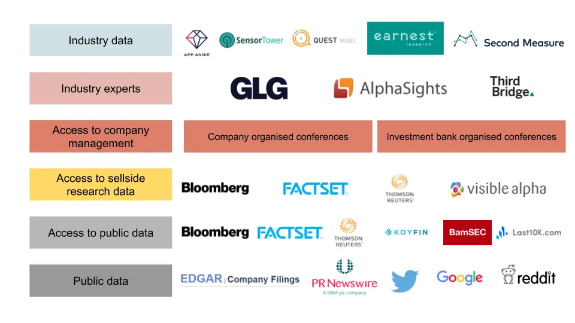

## À retenir

Il est peu probable que vous ayez un avantage informationnel en tant qu’investisseur particulier\, par rapport à un professionnel \; vous devriez trouver un avantage ailleurs

## Utilisation des données en investissement

La semaine dernière\, nous avons examiné [how companies use machine learning to take data, process it, and come to a conclusion.](/writing/ml 'ML')

Cette semaine\, nous allons examiner un processus plus humain\. Nous allons expliquer comment les analystes d’une société d’investissement obtiennent des données\, les analysent et formulent une thèse d’investissement\. Avec les investisseurs [spending >$30bn on data](https://www.ft.com/content/222855de-4fbf-11e9-9c76-bf4a0ce37d49 'spend')\, où va tout cet argent \?

Je vais faire ça selon une méthode typique [long/short fundamental hedge fund](https://en.wikipedia.org/wiki/Long/short_equity 'LS') point de vue\, plutôt qu’une entreprise quantitative [^1]\. Pour plus de commodité\, je vais aussi en discuter du point de vue d’une entreprise américaine\, bien que le processus général ci\-dessous s’applique à l’international\.

Mon objectif est que vous\, en tant qu’investisseur particulier\, compreniez mieux l’avantage dont disposent les professionnels\, et ce que cela implique sur ce que vous pouvez avoir [^2]\.

### Données publiques

Sociétés cotées en bourse [have to file financial statements regularly with the SEC.](https://www.sec.gov/edgar.shtml 'SEC') Ces informations sont publiques sur les pages relations investisseurs de l’entreprise et [SEC Edgar](https://www.sec.gov/edgar/searchedgar/companysearch.html 'Edgar') pour que tu puisses fouiller\.

Les entreprises organisent également des appels de résultats réguliers pour chaque annonce majeure de résultats\, auxquels tout le monde peut s’inscrire [^3]\. Les transcriptions des appels peuvent parfois être consultées également sur les pages relations investisseurs\, ou sur des sites comme [Seeking Alpha.](https://seekingalpha.com/earnings/earnings-call-transcripts 'SA') Cependant\, ils peuvent être plus difficiles à retrouver que les états financiers\.

Les entreprises diffusent généralement des informations via [PR newswire](https://prnewswire.mediaroom.com/about-pr-newswire 'PR') tout en les publiant également sur leur propre site web\. Ces nouvelles peuvent être les documents financiers mentionnés ci\-dessus\, ou des événements spéciaux tels que des acquisitions et des changements de direction\. Les nouvelles sont diffusées via un fil de presse de presse vers d’autres sites d’information\.

En plus des données publiques mentionnées ci\-dessus\, un analyste passerait du temps à explorer Twitter\, à googler ou à lire reddit\. Ils compilent toutes ces sources primaires pour se faire une opinion sur l’investissement dans l’entreprise\.

C’est une partie du processus de recherche en investissement\, la découverte et l’utilisation d’informations publiques que tout le monde peut faire également\. À partir de ce qui précède\, vous disposez déjà de suffisamment de données pour construire un modèle financier d’entreprise\, analyser des tendances et formuler une thèse d’investissement\. En fait\, beaucoup d’investisseurs particuliers ne dépassent jamais cette partie\, et réussissent tout de même pour eux\-mêmes\. Comme je l’ai déjà mentionné\, il existe de nombreuses façons de réussir en investissement\.

### Accès aux données publiques

Alors si c’est tout ce qu’il faut\, pourquoi tant d’autres entreprises existent\-elles pour fournir des informations aux investisseurs \? Comment Bloomberg fabrique\-t\-il [$20k a year from a single subscription?](https://www.vox.com/2020-presidential-election/2019/12/11/21005008/michael-bloomberg-terminal-net-worth-2020 'Bloomberg')

Eh bien\, il s’avère que \:

1. Obtenir des données directement auprès de SEC Edgar est un énorme casse\-tête
2. Les gens veulent toujours plus de données\, car ils croient que plus de données est mieux
3. Il existe beaucoup d’autres données non publiques que vous pouvez acheter

Dans cette section\, je vais aborder le premier point\, celui de l’expérience utilisateur\.

Disons que vous vouliez examiner rapidement le chiffre d’affaires d’une entreprise sur le long terme\. Si vous le faisiez de manière traditionnelle sur Edgar\, vous devrez chercher l’entreprise\, ce qui aboutirait à une page comme celle\-ci \:

Il faudrait alors chercher chaque dossier souhaité\, tous les télécharger\, puis copier les données dans un tableau [^4]\. Après avoir nettoyé les données et ajouté des lignes pour faire les calculs année sur année\, vous obtiendriez enfin les tendances souhaitées\.

C’était beaucoup de travail pour très peu de bénéfices\, c’est pourquoi des entreprises comme Bloomberg\, FactSet\, Thomson existent\. Elles collectent des données financières et les rendent facilement accessibles sur la plateforme\.

Tout ce travail que vous avez fait pour trouver les revenus d’une seule entreprise \? FactSet le propose pour toutes les sociétés cotées \:

Bien sûr\, les données stockées ne sont pas toujours parfaites [^5]\. Cependant\, pour toutes les fois où vous avez besoin de quelque chose de rapide à consulter\, les plateformes qui ont déjà fait tout le travail dans un format facile à assimiler sont inestimables\. Vous n’avez pas besoin de passer des heures à extraire des données lorsqu’elles sont disponibles en quelques frappes clavier\. Ce facteur de commodité est une des raisons pour lesquelles les plateformes peuvent facturer une base d’abonnés fixe [^6]\, bien que des perturbateurs comme [Koyfin](https://www.koyfin.com/ 'koy') essaient de les sous\-estimer\.

Il existe aussi des entreprises comme BamSEC et Last10K\, qui facilitent la recherche des dépôts\. Par exemple\, BamSEC catégorise différents types de dépôts\, affiche les titres des dépôts et vous permet de retrouver rapidement les éditions précédentes des dépôts\. Ces entreprises n’ont pas autant de fonctionnalités que les plateformes ci\-dessus\, mais permettent tout de même de gagner du temps à un analyste\.

### Accès aux données de recherche côté vendeur

Nous avons parlé de l’expérience utilisateur\, discutons maintenant des points concernant l’obtention de plus de données et le paiement pour cela\.

En plus de fournir des données financières agrégées sur les entreprises\, les plateformes Bloomberg\, etc\.\, fournissent également des estimations de recherche côté vendeur\.

Pour rappel\, ces chercheurs sont des personnes de banques d’investissement qui publient des rapports sur l’entreprise\. Ce sont généralement ces personnes mentionnées lorsque les informations disent « un analyste a rétrogradé une entreprise à une vente » ou « les banques relèvent l’objectif de prix d’une entreprise »\. La recherche côté vente propose ses propres modèles financiers avec des estimations pour les futurs chiffres financiers de l’entreprise\, soi\-disant en utilisant ce modèle pour atteindre un objectif de prix [^7]\.

Beaucoup d’investisseurs aiment voir ces chiffres du côté vendeur\, afin de se faire une idée du consensus du marché\. Par exemple\, si la moyenne des estimations du côté vendeur pour le chiffre d’affaires de l’année prochaine est de 100 \$\, mais que vous pensez qu’elle sera de 1000 dollars\, vous allez soit passer un très bon moment\, soit un très mauvais moment\.

Si vous êtes un investisseur professionnel\, vous pouvez toujours envoyer un mail aux banques pour obtenir leurs recherches [^8]\. Si tu le voulais vraiment\, tu pourrais compiler tous ces PDF et Excel ensemble\, et faire les benchmarks toi\-même\.

Évidemment\, personne ne veut vraiment faire ça [^9]\, donc les chercheurs fournissent ces données aux plateformes\, qui les montrent ensuite à la communauté des investisseurs\. Si vous voulez un résumé rapide de l’état du consensus côté vente\, cela est également disponible en quelques frappes au clavier\.

### Accès à la direction de l’entreprise

De nombreux investisseurs évaluent les entreprises en fonction de la qualité de leurs équipes de direction\. Pour faciliter cela\, les entreprises et la recherche côté vendeur organisent régulièrement des conférences pour investisseurs\. L’objectif est que la direction rencontre les investisseurs\, explique la stratégie de l’entreprise aux nouveaux investisseurs en remplaçant tous ceux licenciés\, et réponde aux questions\.

Les investisseurs peuvent mettre à jour leurs modèles financiers ou leur avis sur l’entreprise en se basant sur ces réunions avec la direction\. Par exemple\, si une équipe de direction a donné une mauvaise réponse à votre question\, vous pourriez être intéressé par une vente à découvert sur l’action\.

« Attends\, ça ressemble à du délit d’initié »

Non\, ce n’est pas le cas\. Penseriez\-vous que la conférence annuelle des actionnaires de Buffett\, [attracting 40k people yearly](https://www.investopedia.com/articles/investing/121715/how-attend-berkshire-hathaways-annual-meeting.asp 'Buffett')\, est\-ce que le délit d’initié \? Sinon\, qu’est\-ce qui différencie les conférences ci\-dessus \? Ce n’est pas parce que vous n’êtes pas invité à une fête que c’est illégal\. Il existe des règles régissant ce que la direction peut dire\, mais cette pratique dure depuis longtemps\.

### Experts du secteur

Les investisseurs souhaitent également discuter avec les employés des secteurs qu’ils étudient\. Par exemple\, si j’essaie de comprendre comment pourraient être les revenus publicitaires Facebook\, je voudrais parler à de grands acheteurs de publicités Facebook\. S’ils sont plus optimistes quant au produit\, cela pourrait être un signal positif\.

[Expert network firms like GLG, AlphaSights, Third Bridge](https://www.forbes.com/sites/jonyounger/2020/02/12/the-global-expert-network-business-is-growing-fast-meet-inex-one/#435336b2f257 'GLG') existent pour aider les investisseurs à trouver ce genre de personnes\. Ces entreprises sont rémunérées pour mettre en relation les investisseurs avec des experts du secteur \; les consultants sont également rémunérés pour leur temps\. Vous seriez surpris de voir combien d’anciens cadres de direction font ce genre de travail pendant leur temps libre\.

« Attends\, ça ressemble à du délit d’initié »

Non\, ce n’est pas le cas\. Si vous vouliez investir dans une entreprise de santé\, penseriez\-vous que demander à vos amis médecins à propos de cette entreprise est un délit d’initié \? Sinon\, pourquoi ce qui précède serait\-il différent \? Ce n’est pas parce que vous ne pouvez pas vous permettre l’intermédiaire que c’est illégal [^10]\.

### Données sectorielles

Enfin\, les investisseurs utilisent aussi des « données alternatives » pour mieux prédire les résultats des entreprises\. Par exemple\, si vous vous intéressez à la performance d’une application mobile\, vous pourriez être intéressé par les statistiques de téléchargement de l’application pour cette entreprise\. Si vous êtes intéressé par la vente en ligne\, vous pourriez être intéressé par les données de cartes de crédit d’un secteur\. Si vous souhaitez surveiller le poids des camions afin d’estimer si une entreprise effectuait plus de ventes \(camions plus lourds\)\, il existe une entreprise pour cela [^11]\.

Il y a un [large market of sellers for such data](https://alternativedata.org/data-providers/ 'mkt')\. Des entreprises telles qu’AppAnnie\, SensorTower\, QuestMobile sont bien connues pour fournir des données d’applications\. Des entreprises comme Earnest Research\, Second Measure\, sont également connues pour fournir des données de cartes de crédit\.

« Attends\, ça ressemble à du délit d’initié »

Sortir et compter les clients dans un magasin serait\-il illégal \?

### Ce que cela signifie pour l’investisseur particulier\.

Nous avons passé en revue à la fois les données publiques et privées qu’un investisseur fondamental typique pourrait utiliser\. Qu’est\-ce que cela signifie pour vous en tant qu’investisseur particulier \?

Si vous pensez que votre avantage d’investissement était d’avoir plus d’informations sur l’entreprise que d’autres personnes\, vous devez croire de manière crédible que votre processus de recherche était plus exhaustif que ce qui précède\. Alternativement\, que votre processus de recherche était suffisamment différent et utilisait des sources différentes qu’un professionnel typique\.

Voyons quelques exemples\.

Si vous pensez que votre avance était un article de journal citant l’enthousiasme de la direction à propos d’un nouveau produit\, il faudrait démontrer que la direction n’en discutait pas déjà avec des investisseurs depuis longtemps\.

Si vous pensez que votre avantage résidait dans les données de téléchargement de l’application que vous avez vues sur Twitter\, il faudrait soutenir que les investisseurs n’avaient pas déjà accès à ces données avant vous\.

Si vous pensez que votre avantage était ce parent expert du secteur\, il faudrait que vous soutiez qu’ils connaissent le secteur mieux que les personnes à qui les pros parlent\.

Pour être clair\, tous les scénarios ci\-dessus pourraient être vrais\. Peut\-être que la direction a simplement changé d’avis récemment\, que les investisseurs ont vu mais ne se sont pas souciés des données de l’application\, ou que les experts du secteur n’étaient finalement pas si experts\.

Mon point ici n’est pas de dire que c’est impossible\, mais que vous devez être conscient de la concurrence et de ce que cela implique sur l’avantage dont vous avez besoin\.

Par exemple\, si vous trouvez une petite entreprise qui dispose d’un jeu de données utile\, mais qui ne vend pas encore à des investisseurs\, cela pourrait être une source d’avantage\.

Si vous engagez des gens pour faire du travail manuel de base en [counting store traffic and taking pictures of receipts](https://www.qsrmagazine.com/fast-food/luckin-coffee-faces-fraud-allegations-anonymous-report 'luckin') Au lieu de se fier aux données de carte de crédit\, cela pourrait être une source d’avantage\.

Si vous faisiez des visites anonymes dans les usines de l’entreprise pour voir à quel point elles étaient occupées\, cela pourrait être une source d’avantage\.

Ce que vous devez faire\, c’est trouver les choses qu’un professionnel normal serait réticent à faire\. Dans un monde où les pros ont accès à plus de ressources que vous\, il faut chercher des avantages dans les domaines moins souhaitables\. Regardez le graphique ci\-dessous et repérez les lacunes\.

[^1]: Je n’ai pas d’expérience dans un cabinet quantitatif\, donc je ne peux pas en parler personnellement\. Je connais les quants [pay for order flow though,](https://www.institutionalinvestor.com/article/b1m2p1cv68bx56/Twitter-Freaked-Out-Over-Robinhood-Selling-Its-Trade-Flow-But-the-App-and-Others-Have-Been-Doing-It-for-Years 'order') Et cela est probablement inclus dans le chiffre de 30 milliards de dollars\. Par ailleurs\, notez qu’une société d’investissement comme un fonds spéculatif est différente d’une banque d’investissement \; la plupart des analystes d’investissement exercent des métiers très différents de ceux des banquiers d’investissement\. [Sellside equity research is the role most similar to a hedge fund analyst, but researchers don't actually invest money.](/writing/time 'Sellside')

[^2]: Ici\, l’avantage fait référence à l’avantage relatif que vous avez sur la concurrence\. Nous en avons discuté [why this was important in investing last month.](/writing/relative_billionaire 'edge') Un grand merci à Barak Paz de m’avoir encouragé à écrire sur la base d’une conversation que nous avons eue\.

[^3]: Mais en général\, pas de questions\. Certaines entreprises rares laissent le public poser des questions \; la plupart du temps\, les questions proviennent de la recherche côté vendeur \(pas des analystes d’investissement côté acheteur\)

[^4]: C’est encore pire si vous extrayez des données de 8K plutôt que de 10Q\/K\. Remarquez qu’il n’y a pas de titres parce que la SEC aime vous voir souffrir\.

[^5]: Une grande partie de la banque d’investissement consiste en fait à télécharger les données puis à effectuer les ajustements nécessaires pour « refléter fidèlement » l’entreprise\. On fait ici référence correctement à ce que votre patron souhaite montrer\.

[^6]: Ce n’est pas la seule raison\, cependant\. Bloomberg a un sens de la communauté\, il y a une situation de signalisation de statut\, et débloquer la messagerie directe est utile\. Byrne Hobart entre dans les détails à ce sujet [here](https://marker.medium.com/why-its-hard-to-kill-the-bloomberg-terminal-61073482e496 'Byrne')

[^7]: Qu’ils aient un objectif de prix en tête puis ajustent les chiffres pour s’ajuster\, ou l’inverse\, je vous laisse décider\. Notez que cette critique peut s’appliquer à la fois aux investisseurs côté vendeur et côté acheteur

[^8]: Les investisseurs particuliers sont généralement malchanceux ici\. Il faut généralement être client de la banque et effectuer des transactions via elle pour qu’ils s’en soucient\. Cela entre dans le modèle économique de la recherche côté vende\, qui est hors champ aujourd’hui\.

[^9]: À moins que vous ne soyez un banquier d’investissement à qui votre patron le demande\, auquel cas vous passez des jours à taper manuellement des chiffres à partir d’un ensemble limité de PDF parce que votre banque est limitée à d’autres recherches bancaires\. Et ensuite\, vous devez ajuster manuellement les estimations parce que certains chiffres du côté vendeur sont obsolètes ou utilisent des hypothèses erronées\. Oui\, cela arrive tout le temps\. Oui\, c’est surtout une perte de temps\. Un travail glamour\, la banque\.

[^10]: Cela pourrait cependant devenir plus flou\. Black Edge\, un livre sur le supposé délit d’initié chez SAC\, aborde ici le potentiel d’abus\. Ces discussions sont toutes censées être surveillées par la conformité\. Il y a eu des occasions où l’investisseur noue une « amitié » avec l’expert du secteur\, puis commence à demander des informations matérielles non publiques\.

[^11]: Je ne trouve pas l’entreprise sur le coup\, même si je sais que j’en ai lu quelque part\. Je pense qu’ils utilisaient les données des caméras pour imager les camions et voir à quelle distance ils étaient de la route\. Plus c’était proche\, plus c’était lourd\, ce qui impliquait plus de ventes\.
