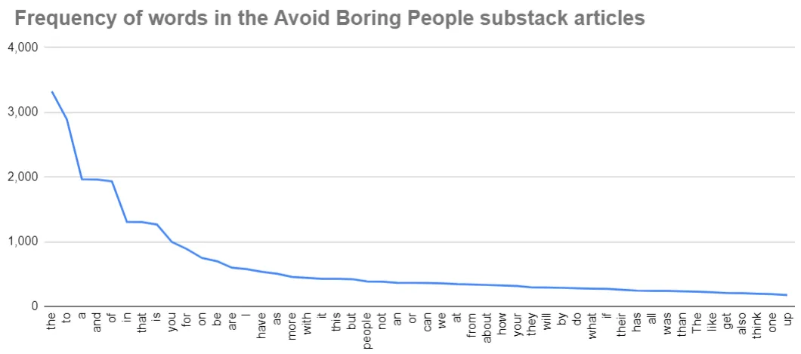
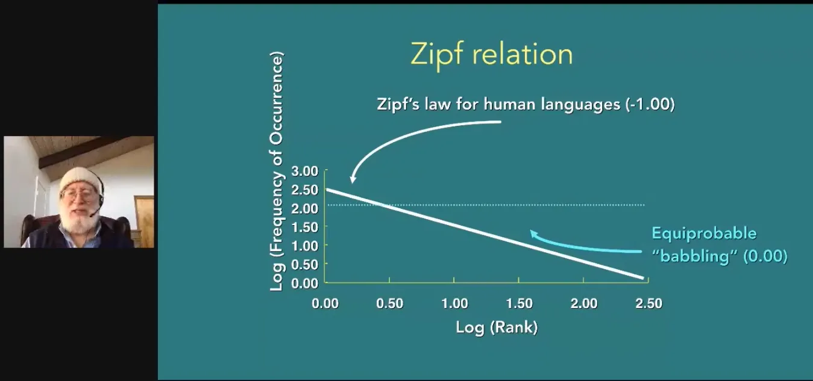

## À retenir

La loi de Zipf et l’entropie informationnelle de Shannon peuvent nous aider à trouver la vie extraterrestre

## Comment pouvons\-nous trouver de la vie extraterrestre \?

Nous en avons parlé [how machine learning companies use data to recognise text](/writing/ml 'ML') et comment [investors use data to pick companies.](/writing/data 'invest')

Cette semaine\, parlons de la façon dont les scientifiques utilisent les données pour rechercher des extraterrestres\. Certains contenus ci\-dessous s’inspireront [Laurance Doyle's talk with the Long Now group.](http://longnow.org/seminars/02020/apr/29/interspecies-communication-and-search-extraterrestrial-intelligence/ 'Long')

### Formuler le problème

L’Institut de recherche d’intelligence extraterrestre \(SETI\) est le plus célèbre des instituts de recherche à la recherche de vie extraterrestre\. Sa mission est de ["to explore, understand and explain the origin and nature of life in the universe and the evolution of intelligence."](https://www.seti.org/about-us/mission 'mission')

Comment peut\-on même s’y prendre pour définir un problème comme celui\-là \?

Eh bien\, si nous essayons de trouver de la vie extraterrestre\, elle doit exister sur une planète ailleurs\. Nous savons donc que chercher des planètes est un point de départ potentiel\.

D’après la science élémentaire\, nous savons aussi que les planètes se forment autour des étoiles\. Nous savons donc que chercher des étoiles capables de soutenir des planètes est aussi un point pertinent\.

Nous savons que la plupart des planètes ont des environnements hostiles\. Limitons donc cette liste uniquement aux planètes que nous pensons capables de soutenir la vie [^1]\.

Parmi ces planètes\, toutes n’auront pas réellement de vie apparaissante\, alors prenons la proportion qui en a réellement\.

Nous pourrions penser que nous sommes bons ici\, et que nous avons assez de fonctionnalités pour commencer à chercher\. Il reste cependant quelques fonctionnalités que nous pouvons ajouter pour affiner notre précision de recherche\.

Quand nous regardons des planètes\, nous voulons trouver un signal provenant de la planète\, car cela sera une preuve bien plus forte que la planète possède de la vie\. Imaginez que vous regardiez une maison plutôt qu’une maison où quelqu’un joue de la musique\. Il est beaucoup plus facile de conclure qu’il y a un être vivant dans le second scénario\.

Alors\, réduisons la liste des planètes où la vie apparaît réellement à celles où apparaissent des espèces « intelligentes »\.

Et parmi ces « espèces intelligentes »\, ne prenons que celles qui finissent par développer la technologie des communications\.

Enfin\, même si l’espèce développait des communications\, si elle n’est plus vivante pour envoyer ces communications\, nous ne les recevrions jamais\. Nous devons donc aussi prendre en compte la durée de vie de ces civilisations\.

C’était beaucoup\. Mais maintenant\, nous avons tous les facteurs majeurs nécessaires pour cadrer notre problème\, et chercher le nombre de civilisations extraterrestres intelligentes capables d’envoyer des signaux\.

En mettant tout cela ensemble\, ce que nous avons fait\, c’est trouver le [Drake equation](https://en.wikipedia.org/wiki/Drake_equation#:~:text=The%20Drake%20equation%20is%20a%20statement%20that%20stimulates%20intellectual%20curiosity,a%20part%20of%20that%20universe. 'Drake')\, une méthode célèbre d’estimation de la vie intelligente [^2]\. Remarquez comment tous les points que nous venons d’aborder sont multipliés ensemble pour deviner combien d’extraterrestres intelligents existent \:

### Réduction du champ d’action

Cela fait beaucoup de variables\, alors concentrons\-nous aujourd’hui sur une partie de cette équation \: la fraction des espèces « intelligentes »\.

Nous devons trouver un moyen de distinguer les signaux « intelligents » des signaux « non intelligents »\. Par exemple\, je voudrais différencier entre chanter au micro et chanter au micro [audio feedback](https://en.wikipedia.org/wiki/Audio_feedback 'audio')\.

Ce serait utile d’avoir des exemples de communication extraterrestre\, ou de savoir ce que nous cherchons\. Nous n’avons évidemment pas la première option [^3]\, mais il existe des moyens pour nous de réduire davantage la seconde option\. Ce que nous voulons trouver\, ce sont les caractéristiques qu’un signal intelligent pourrait posséder par rapport au bruit aléatoire\.

Une façon de le faire est de regarder la vie intelligente non humaine tout autour de nous\. [We use Antarctica as a proxy for Mars,](https://www.cnn.com/2015/12/09/health/white-mars-antarctica-concordia/index.html 'Mars') et peuvent également utiliser les animaux comme substitut du langage extraterrestre\.

Si nous avions des règles que nous pensons que les communications intelligentes doivent suivre\, nous pourrions tester ces règles contre les communications animales\, et voir leur efficacité\. Cela nous permettra de savoir si nous devons élargir ou restreindre nos critères de recherche\.

Il s’avère qu’il existe deux règles majeures en théorie du langage \: la loi de Zipf et l’entropie de la théorie de l’information de Shannon\. Examinons chacune à son tour\.

### La loi de Zipf sur la fréquence des mots

Ce que propose la loi de Zipf\, c’est que pour chaque langue\, la fréquence d’apparition d’un mot est inversement proportionnelle au rang du mot\, si l’on classe tous les mots selon la fréquence d’occurrence\. Par exemple\, si « the » est le mot le plus courant\, il a le rang \#1\. Si « I » est le deuxième mot le plus courant\, il a le rang \#2\. Le mot du rang \#1\, « the »\, apparaîtra deux fois plus souvent dans la langue que le mot du rang \#2\, « I »\. Il apparaîtra trois fois plus dans la langue que le mot du rang \#3\, et ainsi de suite\.

Avec une telle loi\, nous pouvons la tester sur des textes d’exemple issus de cette langue\. Par exemple\, quelqu’un a tracé la fréquence des mots dans Roméo et Juliette \:

Ne me contentant pas de dépendre d’un inconnu venu d’internet\, j’ai analysé mes propres articles de newsletter\. Avec un peu de code python simple [^4]\, j’ai extrait le texte de tous mes posts substack\, extrait les 50 premiers mots que j’ai utilisés\, et les ai graphiqués selon leur fréquence\. La relation n’est pas parfaite\, mais elle est assez proche de ce que prédit la loi de Zipf\. Comme vous pouvez l’imaginer\, « the »\, « to »\, « a »\, « and »\, « of » apparaissent tous fréquemment\.

Super\, donc maintenant nous avons une seule loi\. Nous pouvons la tester sur des animaux comme les dauphins et les baleines\, et voir si elle tient toujours\. [Researchers did that,](https://www.seti.org/animal-communications-information-theory-and-search-extraterrestrial-intelligence-seti#:~:text=We%20also%20found%20that%20bottlenose,Zipf's%20Law%20distribution%20of%20signals.&text=In%20other%20words%2C%20baby%20bottlenose,start%20to%20whistle%20like%20adults. 'dolphin') et j’ai découvert qu’ils en avaient \! [^5] En d’autres termes\, il est probable que la loi de Zipf s’applique aussi aux langues extraterrestres\. En l’appliquant aux signaux venant de l’espace\, nous pouvons filtrer une partie du bruit\.

### La théorie de l’information de Shannon sur la prédiction du prochain mot

Théorie de l’information de Shannon [^6] propose que connaître les mots avant un autre mot vous donnera un indice sur ce que ce mot est\. Autrement dit\, les mots dans une phrase dépendront de chacun\. Par exemple\, vous comprenez probablement très bien la phrase précédente\, même si j’ai omis le dernier mot « autre »\.

Sachant qu’il y a un lien entre les mots\, [we can also derive a way to score the language based on those relationships.](https://langev.com/pdf/plotkin00languageEvolution.pdf 'shannon') Je fais un geste\-partout sur les mathématiques ici parce que je ne les comprends pas moi\-même\, mais la principale conclusion que nous pouvons comprendre est que les langues ont un score\.

En traçant ces scores\, nous pouvons voir dans quelle plage se situent la plupart des langues\. Nous pouvons faire le même processus qu’auparavant\, en notant les dauphins et les baleines\, et en observant comment leurs langues fonctionnent aussi \:

Comme vous pouvez le voir\, la plupart des langues se situent dans une fourchette\. Si nous appliquons le même système de notation aux signaux\, nous pouvons aussi filtrer celles qui sont peu susceptibles d’être des langues\.

### Trouver des extraterrestres n’est pas si différent de l’apprentissage automatique

Nous avons commencé avec un objectif large \: vouloir trouver des extraterrestres\.

Nous avons ensuite présenté le problème et proposé les différents éléments qui pourraient être utiles à examiner\.

Nous avons réduit la cible à une seule partie du problème et cherché des moyens d’augmenter la précision de notre recherche\. Nous avons établi deux critères principaux issus des langues humaines\, puis les avons recoupés avec d’autres langues non humaines\. À l’avenir\, nous pouvons utiliser une approche similaire pour affiner les signaux que nous souhaitons étudier davantage\.

Au cas où vous pensiez que tout cela était hypothétique\, l’approche ci\-dessus est la suivante [exactly what one team at SETI is using to analyse signals.](https://www.seti.org/animal-communications-information-theory-and-search-extraterrestrial-intelligence-seti#:~:text=We%20also%20found%20that%20bottlenose,Zipf's%20Law%20distribution%20of%20signals.&text=In%20other%20words%2C%20baby%20bottlenose,start%20to%20whistle%20like%20adults. 'SETI')

Comme vous pouvez le voir\, le processus lui\-même peut être similaire à celui d’autres problèmes d’analyse de données\. D’abord\, vous commencez par un objectif\. Ensuite\, vous définissez ce dont vous pourriez avoir besoin\. Ensuite\, vous élaborez un algorithme\. Enfin\, vous le testez pour voir s’il tient la route\. La résolution de problèmes dans un domaine n’est pas si différente de celle dans un autre\.

[^1]: Définir ce qui est habitable ou non [is difficult of course,](https://en.wikipedia.org/wiki/Circumstellar_habitable_zone 'zone') puisque ce qui fonctionne pour nous ne fonctionnera peut\-être pas pour la vie extraterrestre\. Certaines personnes pourraient croire à la vie à base de silicium plutôt qu’à celle à base de carbone \(ce que nous sommes\)\, cependant [there are difficulties with that assumption](https://astronomy.stackexchange.com/questions/20858/why-do-aliens-have-to-be-carbon-based-lifeforms 'carbon')

[^2]: Notez que « l’utilité de l’équation de Drake ne réside pas dans la résolution\, mais plutôt dans la contemplation de tous les divers concepts que les scientifiques doivent intégrer lorsqu’ils considèrent la question de la vie ailleurs\, et qui donne à la question de la vie ailleurs une base pour une analyse scientifique »

[^3]: À moins que tu ne saches quelque chose que je ne sais pas\, auquel cas je suis intéressé d’en savoir plus\.\.\.

[^4]: Par simple\, j’entends que ça a pris \< 30 minutes pour écrire\, puis 3 heures pour dépanner\. Le code est [here](https://github.com/leonlinsx/ABP-code/blob/master/Python-projects/File%20extractor.py 'git') Si tu veux l’adapter à tes propres besoins\.

[^5]: Ils l’ont également testée contre les babillages de bébés\, humains et dauphins\. Ils constatent qu’aucun de ces cas ne suit la loi de Zipf\.

[^6]: Oui\, c’est bien _le_ [Claude Shannon, the guy who essentially taught us how to create electronic communications](https://www.itsoc.org/about/shannon 'Shannon')
