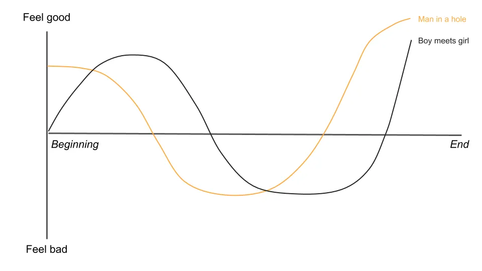
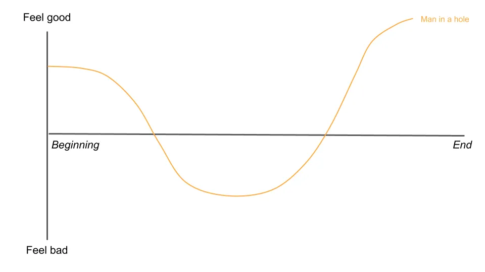

## À retenir

Aucune conclusion cette fois\, ça gâchera l’histoire\.

---

Commençons par une histoire à propos d’histoires\.

[Bestselling author Kurt Vonnegut](https://en.wikipedia.org/wiki/Kurt_Vonnegut 'Kurt') est connu pour Abattoir\-Cinq\, Le Berceau du Chat et de nombreuses autres œuvres\. Dans son autobiographie\, [he claimed that this was his greatest contribution to culture:](https://books.google.com/books?id=Zd_9o3uyoVsC&pg=PA285&dq=vonnegut+shape+story+thesis&hl=en&sa=X&ei=tasCU8yjEML-oQSXloKIBQ#v=onepage&q=vonnegut%20shape%20story%20thesis&f=false 'book')

Alors\, _Les histoires ont des formes\,_ dit\-il\.

Qu’est\-ce que ça veut dire \? Kurt explique [^1]\:

Imaginez que vous aviez un graphique\, avec la bonne et la mauvaise fortune d’un côté\, et de l’autre côté montrant l’évolution de l’histoire du début à la fin\.

On pourrait tracer n’importe quelle histoire sur ce graphique pour en voir la forme\. Et si on trace toutes les histoires du monde\, quelques motifs communs apparaîtraient\.

Par exemple\, dans [The Godfather,](https://en.wikipedia.org/wiki/The_Godfather 'Godfather') Michael commence heureux\, mais la famille a des ennuis et il est contraint de quitter le pays\. Il finit par revenir\, reprend le contrôle et élimine la plupart de ses adversaires\, devenant le parrain de la mafia de la ville\.

Nous allons tracer cela sur le graphique et appeler cela une histoire du type « homme dans un trou »\. L’homme s’en sort bien\, tombe dans un trou\, puis sort et va mieux qu’avant\.

En revanche\, dans [About Time,](<https://en.wikipedia.org/wiki/About_Time_(2013_film)> 'About Time') [^2] Les personnages principaux tombent amoureux\, se perdent\, puis se retrouvent après une série d’événements\.

On appellera cela une histoire du type « garçon rencontre fille »\. Comme vous pouvez l’imaginer\, c’est typique de nombreux films d’amour\.

Et dans une histoire telle que [The Metamorphosis,](https://en.wikipedia.org/wiki/The_Metamorphosis 'Kafka') Les choses ne font qu’empirer pour notre protagoniste alors qu’il se transforme en insecte et meurt\. Ce serait une « tragédie »\.

En plus des formes ci\-dessus\, Kurt pensa à quelques autres qui pourraient fonctionner\. Une histoire « de la misère à la richesse » pourrait impliquer une montée régulière\, un ["icarus" story](https://en.wikipedia.org/wiki/Icarus 'icarus') Cela peut impliquer une montée puis une descente\, et un ["oedipus" story](https://en.wikipedia.org/wiki/Oedipus 'oedipus') Cela peut impliquer une chute\, une ascension\, puis une chute à nouveau\.

En s’appuyant sur cette idée\, [a team of researchers from Vermont and Adelaide used machine learning to classify 1,327 famous stories](https://arxiv.org/pdf/1606.07772.pdf 'paper') sur [Project Gutenberg](https://www.gutenberg.org/ 'proj')\. Ils ont constaté que la majorité des histoires pouvaient effectivement être regroupées en quelques types majeurs\. Voir la note de bas de page pour plus de détails sur leur méthodologie [^3]\.

Ils ont remplacé « garçon rencontre fille » par « cendrillon » ici\, mais cela montre essentiellement que Vonnegut avait raison [^4]\. _Les histoires ont des formes\, et il y en a quelques classiques\._

En quoi est\-ce pertinent \? Vous êtes venu ici pour des conseils boursiers et des propos de démonstration sur les startups [^5]\, c’est quoi toutes ces notes sur les récits \?

Je vais faire le lien sous peu\, et pour l’instant\, gardons simplement ces formes d’histoire en tête\.

---

### Les crosses ont des formes

Le mois dernier\, nous avons discuté d’une des raisons pour lesquelles votre argumentaire d’investissement est mauvais \: [you aren't accounting for consensus.](/writing/relative_billionaire 'pitch')

Ce mois\-ci\, discutons d’une autre raison courante qui peut être encore plus frustrante\.

Considérez cette entreprise au 30 avril 2018 \:

La société X est une entreprise internet\, qui gagne principalement de l’argent grâce à ses abonnements aux applications grâce à son monopole dans une catégorie grand public en expansion\. Elle compte 7 millions d’abonnés au total\, dont 3 millions sont abonnés à son application principale\. Son chiffre d’affaires augmente de \~30 \% d’une année sur l’autre\. Les marges EBITDA \(un type de mesure de bénéfices\) sont de 40 \%\. Le cours de l’action est à un niveau historiquement élevé\, ayant plus que doublé au cours de l’année écoulée [^6]\.

Ça a l’air plutôt bien\, ça vaut peut\-être le coup de faire des recherches pour voir si tu veux l’avoir\.

Considérez également la même entreprise au 1er mai 2018 \:

L’entreprise X est une entreprise internet\, qui tire principalement de l’argent grâce à ses abonnements aux applications grâce à son monopole dans une catégorie grand public en expansion\. Elle compte 7 millions d’abonnés au total\, dont 3 millions sont abonnés à son application principale\. Son chiffre d’affaires augmente de \~30 \% d’une année sur l’autre\. Les marges EBITDA \(un type de mesure de bénéfices\) sont de 40 \%\. Le cours de l’action est à un niveau historiquement élevé\, ayant plus que doublé au cours de l’année écoulée\. _[Facebook just announced they're planning to enter the category](https://techcrunch.com/2018/05/01/facebook-dating/ 'FB')_

Les fondamentaux de l’entreprise n’ont pas changé\, mais cette baisse de prix de 22 \% en une journée en est clairement visible _quelque chose_ a\. C’est\, bien sûr\, le _Histoire_ que les investisseurs parlent de l’action\.

**Car qu’est\-ce qu’une proposition\, sinon une histoire sur l’action \?**

Le 30 avril\, le lancer consensuel [^7] c’était que l’entreprise avait connu une croissance rapide avec une forte marge sans concurrence\. Les investisseurs continuaient d’acheter les actions\, et le prix ne cessait de monter\.

Le 1er mai\, l’histoire a pris un tourne\-à\-chemin\. On pouvait soit dire que Facebook allait écraser cette entreprise\, et qu’il fallait en vendre autant que possible\. Ou bien dire que la peur était exagérée\, que le bilan non essentiel de Facebook en matière de produits est mauvais\, et qu’il faut en acheter autant que possible\.

Ça te dit quelque chose \?

Dans ce cas\, l’entreprise était Match\.com\, la société mère de Tinder\, et elle allait doubler à nouveau en cours d’action environ un an après cette baisse\. Le garçon rencontre fille a fonctionné\.

Le 1er mai\, les deux versions étaient également valables\, et vous aviez des investisseurs avisés prenant part et après cette transaction\. Il est important de noter que le cours de l’action a réagi avant même qu’un véritable changement n’ait lieu dans les affaires de Match\. L’histoire avait atteint un carrefour\, et les investisseurs choisissaient désormais des camps différents\. Ceux qui pensaient que ce serait comme « Icare » ont perdu\, et ceux qui pensaient le contraire ont gagné\. À mesure que les histoires changent\, les prix des actions changent aussi\.

**Qu’est\-ce que cela signifie pour votre argumentaire d’investissement \?** Cela implique que raconter des histoires est la clé d’une bonne présentation\. Plus vous pouvez raconter une histoire\, plus elle aura de chances de faire avancer\. Aussi bien auprès de votre patron qu’avec d’autres investisseurs\. C’est agaçant\, mais la « meilleure idée » est très souvent la « meilleure histoire »\.

**Pourquoi est\-ce important que votre idée prenne de l’ampleur \?** N’oubliez pas qu’investir ne consiste pas seulement à avoir raison\, mais aussi à faire comprendre aux autres que vous avez raison\. Vous ne gagnez pas d’argent en restant sur une excellente entreprise si le prix ne bouge pas [^8]\. On gagne de l’argent en étant contre le consensus et en ayant raison\, mais si on ne peut pas rallier les autres à soi\, on sera toujours contre le consensus et on a tort\. La bourse peut être une machine à voter à court terme et une peseuse à long terme\, mais si vous ne diffusez pas votre histoire\, votre machine est cassée [^9]\.

**Sur quoi devriez\-vous vous concentrer \?** Si votre avenir d’investissement est à court terme\, vous chercherez probablement des points d’inflexion dans l’arc narratif \; aussi appelés catalyseurs\. Par exemple\, vous voudrez avoir un argument crédible pour expliquer pourquoi une action est actuellement dans un trou\, et pourquoi elle semble pouvoir en sortir\. Si votre horizon temporel est à plus long terme\, peut\-être que vous serez plus intéressé par des histoires du type « de la misère à la richesse »\.

Bien sûr\, les histoires peuvent aller dans les deux sens\. J’ai montré un exemple d’action qui s’est rétablie\, et j’aurais facilement pu en choisir une qui allait dans l’autre sens\. Les gens racontaient de belles histoires sur Enron\, Tilray\, Luckin et d’autres\, avant qu’ils ne s’effondrent tous\. Toute la narration du monde ne peut pas magiquement générer des revenus \(même si cela a généré beaucoup d’argent pour ceux qui quittent leur poste à temps\)\.

Je ne dis pas non plus qu’il suffit d’ajuster les cours des actions aux courbes pour gagner de l’argent [^10]\. Ce que je veux dire\, c’est que la perception des actions suit un arc narratif\, et cela se voit souvent dans le prix\. Savoir quelle histoire vous essayez de raconter améliorera votre présentation\.

Nous savons depuis un moment que les fondamentaux ne sont pas les seuls à influencer les cours des actions \; voyez [Shiller's work on a history of stock forecasting theory.](https://pubs.aeaweb.org/doi/pdfplus/10.1257/089533003321164967 'shiller') La capacité à raconter une bonne histoire est essentielle pour faire passer des idées d’investissement\. Pourquoi pensez\-vous que tant d’investisseurs parlent publiquement de leurs idées \? Plus vous convaincrez les autres de votre histoire\, plus vous aurez de chances de gagner de l’argent en tant qu’investisseur\.

Les investisseurs se racontent des histoires et misent sur ce qu’ils espèrent être vrai\.

### Les startups ont des formes

La narration compte aussi dans la tech\. C’est comme ça [startups raised millions with just a pitch deck,](https://www.businessinsider.com/pitch-decks-that-helped-hot-startups-raise-millions-2019-4 'pitch') ni comment [Masa raised $45bn in an hour from the Saudis](https://youtu.be/Sa2_VBu0d7k?t=92 'masa')\. Dans le premier\, les startups expliquaient aux capital\-risques comment elles pouvaient atteindre un milliard de dollars\. Dans le second\, Masa a convaincu Mohammed ben Salmane qu’il pouvait atteindre 1 milliard de dollars\. Leur parcours joue sans aucun doute un rôle\, mais le tableau qu’ils dressent dans l’esprit des investisseurs a été essentiel pour obtenir des financements\.

Personne ne veut soutenir un perdant\, donc c’est à la startup de raconter son histoire de manière à la mettre en valeur\. Ils essaient de se positionner comme un « de la misère à la richesse »\, tandis que les investisseurs essaient de déterminer s’ils sont un « icare »\. Quand un capital\-risque rejette une entreprise\, il dit implicitement qu’il trouve l’histoire trop ennuyeuse\. Évitez les histoires ennuyeuses\.

Cela implique aussi que **Les startups sont incitées à raconter l’histoire la plus passionnante sur elles\-mêmes\.** Ce faisant\, la plupart exagèrent la vérité autant que possible\. Ils préfèrent largement vous vendre le chapitre final plutôt que le début\. Les investisseurs expérimentés le savent\, même si le public en est probablement moins conscient\. Que cela devienne une fraude ou non reste une ligne fine\.

Imaginons ce scénario \:

> Votre entreprise est arrivée trop tôt à une tendance\, et vous vous êtes endetté en essayant de l’épargner\. Vous recevez un appel d’un étudiant qui vous dit que votre produit est excellent\. Tellement génial qu’il écrit un programme pour cela qui vous rapportera beaucoup d’argent\. Vous êtes intéressé et acceptez de rencontrer le gamin pour une démonstration\.

> De l’autre côté de cet appel\, un étudiant nerveux raccroche\, réalisant qu’il est proche d’obtenir son premier contrat\. Le seul problème \? Il n’a même pas une copie de ton produit\, encore moins un programme fonctionnel pour celui\-ci\.

Fraude\, ou pensée optimiste \? Peut\-être pensez\-vous éviter de faire affaire avec ce gamin pour toujours\. Si c’était le cas\, [you just missed out on Bill Gates, and the forming of Microsoft.](http://www.computinghistory.org.uk/det/5946/Bill-Gates-and-Paul-Allen-sign-a-licensing-agreement-with-MITS/ 'MITS') Parfois\, une histoire qui n’est pas entièrement vraie _Pourtant_ peut devenir la vérité\.

Imaginons un autre scénario \:

> Vous rencontrez un jeune fondateur\, qui vous présente une solution révolutionnaire en matière de santé\. Les prototypes qu’on vous présente ne sont pas très aboutis\, mais ils sont confiants de pouvoir finir un jour un produit fini prêt à être utilisé à grande échelle\.

> Le fondateur obtient de plus en plus de publicité\, apparaît sur plusieurs couvertures de magazines et signe de gros contrats avec des pharmacies\. Le conseil d’administration semble aussi composé de personnes célèbres\, même si vous ne comprenez pas pourquoi si peu d’entre elles ont de l’expérience dans la santé\.

La startup dans ce cas\, bien sûr\, est [Theranos](https://www.businessinsider.com/theranos-former-board-members-henry-kissinger-george-shultz-james-mattis-2019-3 'Theranos')\, qui allait tomber dans le feu comme l’une des plus grandes fraudes de la décennie\. Holmes avait une histoire tellement fantastique que tout le monde voulait l’écouter \; les investisseurs rapportent avoir été « captivés » par son pitch\. Si la leçon que vous avez tirée du scénario Microsoft était « croyez à toutes les histoires passionnantes »\, vous comprenez pourquoi cela posera problème\. Parfois\, des histoires qui ne sont pas encore vraies resteront à jamais des contes de fées\.

**Cette frontière entre fraude et pensée optimiste peut être mince\.** Steve Jobs était célèbre pour sa [reality distortion field](https://en.wikipedia.org/wiki/Reality_distortion_field 'rdf')\, ou la capacité de convaincre quiconque que quelque chose était possible\. Je suis sûr que Holmes croyait à l’époque qu’elle pouvait accomplir l’impossible\, un peu comme tant d’autres fondateurs de startups\. Nous les jugeons aujourd’hui sur leurs résultats\, mais on peut facilement imaginer un scénario où le retour de Steve chez Apple n’aurait tout simplement pas fonctionné\.

Ou considérez d’autres échecs de démarrage où un rebondissement aurait pu donner une fin différente\. [WeWork, Pets.com, Moviepass etc](https://f3fundit.com/11-of-top-startup-failures-in-history/ 'startup') Tous avaient de grandes histoires mais sont tombés en disgrâce\. WeWork pourrait mieux s’il n’avait pas grandi si vite\, Pets\.com a un successeur spirituel en Chewy\, et MoviePass aurait peut\-être fonctionné avec plus de financement [^11]\. Jusqu’à la fin\, je suis sûr que tous les membres de la compagnie espéraient qu’un regain d’intérêt de leur arc narratif était imminent\.

**Au\-delà des investisseurs\, l’histoire de votre startup compte aussi pour les employés\, les clients et la concurrence\.**

Les parts propres sont un enjeu dans votre histoire\. Puisque les employés des startups sont généralement moins payés en espèces et plus en stock\, ils parient que votre histoire sera bonne\. La partie difficile du recrutement des talents est de les convaincre qu’il y a assez de potentiel dans l’entreprise pour sacrifier des alternatives meilleures et plus sûres [^12]\.

Les clients consultent votre histoire avant de décider d’acheter\. Ils réfléchissent à ce que votre produit pourrait leur apporter\, que ce soit gagner du temps\, réduire l’effort\, monter en grade\, ou plus encore\. Comme évoqué précédemment\, personne n’aime miser sur un perdant\.

Votre concurrence regarde aussi l’histoire que vous racontez et fait des plans en fonction de ce que vous semblez faire\. Si vous grandissez plus vite qu’eux\, ils essaieront de comprendre pourquoi\. Si vous faites pire\, ils profiteront de cette occasion pour présenter leur propre histoire à votre public cible\.

L’importance des histoires pour les startups est bien connue\. Au\-delà de l’attraction des investisseurs\, cela compte aussi pour toute autre personne avec qui la startup interagit\. [As Bill Gurley from Benchmark put it:](http://abovethecrowd.com/1999/10/18/the-rising-importance-of-the-great-art-of-storytelling/ 'Bill')

> Dans l’environnement commercial Internet unique d’aujourd’hui\, l’art du récit prend une importance croissante\. En raison des phénomènes « effet réseau » et « retour croissant »\, beaucoup de gens pensent que les premiers arrivants \(ou du moins les entreprises les premières à atteindre une échelle significative\) prendront très probablement la part du lion du marché Internet\.

Les entreprises nous racontent leurs histoires et travaillent à les rendre vraies\.

### Forme de toi

Nous avons commencé par une histoire sur des histoires\.

Finissons par une histoire sur le soi\.

Il était une fois une personne qui quitta sa maison pour explorer le monde\. Elle connut des hauts et des bas\, et à son point le plus bas\, souffrit d’une douleur inimaginable\. Mais elle surmonta cela\, et grandissait pour devenir meilleure qu’avant\.

Ça te dit quelque chose \?

Mais quelle histoire est\-ce \?

Ça pourrait être [the story of Jesus, from Christianity](https://www.learnreligions.com/the-resurrection-story-700218 'Jesus')\.

Ça pourrait être [the story of the Buddha, from Buddhism](https://tricycle.org/magazine/who-was-buddha-2/ 'Buddha')\.

Et ça pourrait même être ton histoire\.

**Nous sommes tous protagonistes dans nos propres arcs narratifs\,** Essayant continuellement d’ajuster nos histoires vers le haut et vers la droite\. Par une combinaison de chance\, de compétence et d’efforts\, certains d’entre nous peuvent déjà avoir l’impression d’y être\. D’autres peuvent avoir l’impression d’être coincés dans une tragédie implacable\. C’est à nous de créer notre propre histoire\, et nous vivons avec les conséquences de nos choix\. La vie est injuste\, mais il y a encore des choses que nous pouvons faire de notre propre chef\.

Parce que nous sommes nos propres auteurs\, cela signifie aussi que nous ne connaissons pas l’arc narratif complet des autres\. Nous pouvons les voir profiter de la vie\, sans savoir combien de malheurs ils ont dû traverser\. Nous pouvons les voir vivre la misère\, sans savoir à quel point ils ont essayé de l’empêcher\. Nous comparerons où ils en sont par rapport à où nous avons été passés\, et nous sentirons frustrés que notre expérience moyenne ne soit pas aussi bonne que leur point fort\.

Le monde entier est une scène\, mais nous ne sommes pas des acteurs\, nous sommes le réalisateur\. Nous décidons seuls combien d’efforts nous voulons fournir pour construire notre récit\. Se dire que vous réussirez ne signifie pas forcément que vous réussirez\, mais croire que votre arc narratif est destiné à la tragédie est un bon moyen de s’assurer qu’il en deviendra une\.

[As Neil Gaiman put it:](https://www.youtube.com/watch?v=Xn2n7N7Q2vw 'Neil')

> Les gens racontent des histoires et c’est une énorme part de ce qui fait de nous des êtres humains\. Nous ferons énormément pour les histoires\, et endurons beaucoup pour les histoires\. Et les histoires\, à leur tour\, nous aident à endurer et à donner un sens à nos vies\.

Tu peux me raconter une histoire\, et c’est à toi de la rendre vraie\.

## Autres

1. [How SaaS securitisation could look like](http://conordurkin.com/some-thoughts-on-saas-abs/ 'SaaS')
2. [Does Commodification Corrupt? Lessons from Paintings and Prostitutes](https://scholarship.shu.edu/cgi/viewcontent.cgi?article=1732&context=shlr 'corrupt')
3. [Spatial is allowing AR/VR users to attend meetings with desktop users](https://www.wired.com/story/spatial-vr-ar-collaborative-spaces/ 'Spatial')
4. ['The argument that Apple should change its practices developed to price as it does, distribute as it does or design as it does because it was too successful or is “unfair” is getting the causality wrong.'](http://www.asymco.com/2020/06/20/subscribe-again/ 'subscribe')
5. [Weddell seals make tardis sounds.](https://www.youtube.com/watch?v=megeZ8zhKJ0&feature=youtu.be 'weddell') H\/t \@rosetazetta\. Il y a aussi un [2 hour version](https://www.youtube.com/watch?v=4dbSA4dTICc 'seal') que j’ai peut\-être ou non terminé d’écouter en écrivant ceci\.

[^1]: Tant dans son autobiographie que dans ses conférences [here](https://youtu.be/GOGru_4z1Vc 'Kurt')

[^2]: Je ne cesserai pas de promouvoir ce film \; c’est l’un de mes préférés

[^3]: L’article complet est [here](https://arxiv.org/pdf/1606.07772.pdf 'paper')\. Ces méthodes étaient l’analyse des composantes principales \/ décomposition des valeurs singulières\, le clustering hiérarchique et le clustering avec apprentissage automatique non supervisé\. Ils ont d’abord appliqué l’analyse de sentiment pour obtenir la valeur émotionnelle à travers les histoires\. Je ne sais pas exactement comment ils ont utilisé SVD\, et il semble qu’ils aient appliqué la réduction des dimensions\, puis extrait les principales caractéristiques d’une matrice de similarité\, trouvant les principaux types d’histoires capables d’expliquer la majorité des variances\. Le regroupement hiérarchique semble être un dendrogramme standard pour regrouper les types d’histoires\. L’apprentissage automatique non supervisé utilisait la carte auto\-organisante de Kohonen\, qui semble être un algorithme pour regrouper des groupes\, faisant quelque chose comme K signifie\.

[^4]: Techniquement\, Vonnegut sépare garçon rencontre fille de Cendrillon\, car Cendrillon a une montée plus progressive et une chute marquée avant de se relever\. Ils me ressemblent suffisamment pour les regrouper\. Vonnegut propose aussi une ligne plate unique pour des histoires comme Hamlet où « rien ne se passe »\. Je ne suis pas d’accord avec cette forme\, et je l’ai laissée de côté pour simplifier\. Pour une autre approche des types d’histoires\, [Christopher Booker discusses seven basic plots](https://en.wikipedia.org/wiki/The_Seven_Basic_Plots)

[^5]: Merci de ne pas venir ici pour des conseils boursiers ou des propos de démonstrations de startups\, vous serez déçus que je ne fasse pas les premiers et que je ne fasse que rarement les seconds\.

[^6]: 8 000 \$ pour l’entreprise [here](https://d18rn0p25nwr6d.cloudfront.net/CIK-0001575189/63f15bf6-7324-446e-b762-fb1ac98ccf14.pdf 'MTCH')\, même si tu vas gâcher la surprise\.

[^7]: Ignorons ce que disaient les shorts pour simplifier \: la performance du prix implique que les gens étaient haussiers\.

[^8]: Oui\, je sais que les dividendes existent\, [they're less important in driving returns](https://media-publications.bcg.com/pdf/VCR/2006-VCR-Spotlight-on-Growth.pdf)

[^9]: Je n’ai jamais vraiment compris ce que signifiait une machine à voter \; je pense qu’elle fait simplement référence à une machine qui tient un décompte des votes et qui change donc tout le temps\.

[^10]: Les personnes qui font de l’analyse technique pour gagner leur vie ne seraient pas d’accord là\-dessus\.

[^11]: Ce ne sont que des hypothèses\, et il n’y a pas vraiment moyen d’en tirer une conclusion\. Est\-il irréaliste d’attendre que Moviepass obtienne une grande base d’abonnés tout en mettant le feu à l’argent \? Je veux dire\, tout dépend vraiment du montant d’argent qu’ils pourraient brûler\, non \? Et si Softbank lui avait donné de l’argent au lieu de WeWork \?

[^12]: Certaines personnes pourraient ne pas être d’accord pour dire que les entreprises traditionnelles sont plus sûres que les startups\. On peut avancer que travailler dans la tech vous offre une sécurité pour votre carrière mais pas pour votre emploi\. Je dirais que pour la plupart des gens\, se faire licencier reste pénible et peut être financièrement très dommageable\.
