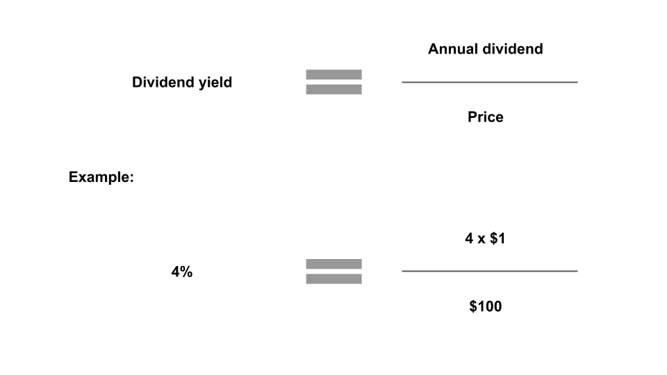
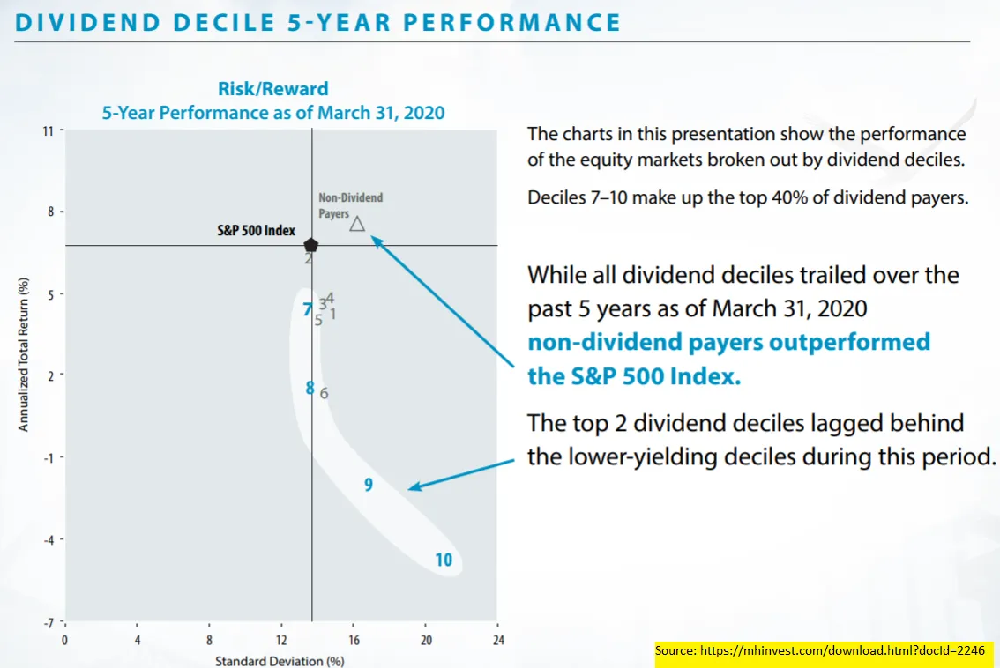

## À retenir

Investir pour des dividendes comporte plus de nuances qu’il n’y paraît au premier abord\.

## Rendement des dividendes

Dans [footnote 8 of last week's post](/writing/stories 'footnote') J’ai fait une remarque en passant sur le fait que les dividendes comptaient moins que le rendement du capital parce que je ne voulais pas passer plus de temps à creuser sur le sujet\.

Aujourd’hui\, plongeons vraiment dans les dividendes\.

Nous ferons un aperçu des dividendes\, puis discuterons des inconvénients\, et terminerons par des liens vers d’autres recherches qui compliquent l’histoire\.

Comme toujours\, rien de tout cela n’est un conseil d’investissement [^1]\.

### Que faire de tout cet argent liquide

Supposons que vous soyez une société cotée en bourse qui réalise un bénéfice [^2]\. Vous avez payé vos fournisseurs\, vos employés\, et vous vous êtes payé vous\-même\. Vous avez encore plus d’argent liquide restant\, alors que pouvez\-vous en faire \?

Premièrement\, tu ne pourrais rien faire\. Laisse\-le traîner dans une banque quelque part [^3]\.

Deuxièmement\, tu pourrais réinvestir dans l’entreprise\. Cette machine que tu voulais pour ta chaîne de production \? Ce logiciel pour ton équipe RH \? [That Gulfstream G650 to get high?](https://www.wsj.com/articles/this-is-not-the-way-everybody-behaves-how-adam-neumanns-over-the-top-style-built-wework-11568823827 'WSJ') Peut\-être est\-ce le moment de les acheter\.

Troisièmement\, vous pourriez racheter d’autres entreprises\. Peut\-être y a\-t\-il un concurrent plus petit que vous pouvez acquérir à moindre coût et obtenir toutes ces « synergies » dont vos amis bancaires vous parlent pour augmenter votre part de marché [^4]\.

Quatrièmement\, vous pourriez racheter une partie de vos actions\. Cela augmente la participation que vous détenez dans votre entreprise\, ce qui signifie que vous obtenez plus de potentiel de croissance si l’entreprise réussit\. Les rachats sont hors du cadre de cet article\, vous pouvez lire une première opinion \(biaisée\) à leur sujet par Cliff Asness [here.](https://images.aqr.com/-/media/AQR/Documents/Journal-Articles/Buyback-Derangement-Syndrome.pdf 'Cliff')

Cinquièmement\, vous pourriez verser un dividende aux investisseurs\. Pour chaque action que possèdent les investisseurs\, vous leur donnez de l’argent liquide chaque trimestre\.

J’ai simplifié\, comme toujours\, et les actions ci\-dessus sont les principales actions que les entreprises font avec leur argent\. Un graphique de CS nous montre comment la combinaison de ces actions a évolué au fil du temps \:

Aujourd’hui\, nous allons nous concentrer sur la cinquième action\, le paiement des dividendes\. Je vais passer sur la question de l’irrélevance théorique des structures de capital [^5]\, mais vous pouvez lire un rappel sur Modigliani Miller [here.](https://pubs.aeaweb.org/doi/pdfplus/10.1257/jep.2.4.99 'MM')

### Évaluation des dividendes

À première vue\, un dividende vous semble bien en tant qu’investisseur\. Récupérer un peu d’argent sur vos actions semble agréable\. Voyons comment nous pourrions l’évaluer\.

Si je vous disais qu’un dividende d’entreprise était de 5 \$\, est\-ce que ce serait bien ou mauvais \? Ça semble beaucoup d’argent\, mais on ne sait pas vraiment à moins de le comparer au prix\.

Si vous aviez acheté l’action pour 5 \$ et qu’elle vous rendait 5 \$\, ce serait élevé\. Vous avez effectivement été remboursé sur votre investissement immédiatement\.

Si vous aviez acheté l’action pour 10 000 \$ et qu’elle vous rendait 5 \$\, ce serait probablement insignifiant\.

Donc on sait que **Le prix compte\, comme pour tout ce qui concerne l’investissement\.** Pour intégrer cela\, nous pouvons calculer un rendement de dividende\, qui est simplement le montant du dividende divisé par le prix\. En comparant les rendements des dividendes les uns aux autres\, nous pouvons déterminer quelles actions ont des dividendes « élevés » et lesquels ont des dividendes « faibles »\.

Petite parenthèse\, par convention\, nous accepterions une somme de dividende de 12 mois\. La plupart des entreprises versent des dividendes trimestriels\, donc si une société verse 1 \$ par trimestre\, son dividende annuel est de 4 \$\. Nous ignorerons aussi les impôts [^6]\.

Au\-delà de nous permettre d’évaluer les rendements de dividendes entre les actions versant des dividendes\, ce rendement nous permet aussi de comparer entre autres titres\. Le rendement est comme le rendement attendu\, après tout\. Nous pourrions donc comparer un rendement de dividende de 4 \% à une obligation qui paie 1 \%\, et dire que tout le reste est égal par rapport à un revenu plus élevé\.

C’est ce que nous voyons ici [Vanguard report](https://personal.vanguard.com/pdf/ISGADOS.pdf 'Van')\, le graphique ci\-dessous montrant que **Les rendements du dividende ont été supérieurs à ceux des obligations au cours des 10\+ dernières années\.**

À y repenser\, cela semble encore mieux maintenant\. Une période prolongée où vous recevez plus de liquidités que les obligations \? Devrait\-on tous simplement trouver les actions au rendement de dividende le plus élevé et toutes les acheter \? Quel est le piège \?

### Rendement total\, pas seulement le rendement des dividendes

La première est simple\, et que nous avons déjà en partie abordée \: la question du prix\. Un rendement de dividende élevé pourrait provenir du fait que l’entreprise verse beaucoup en espèces\, ce qui entraîne un montant de dividende relativement élevé sur un prix relativement faible\. Ou cela pourrait aussi venir d’une forte baisse du prix de l’action\, ce qui entraîne ce même montant de dividende relativement élevé sur un prix relativement faible\.

Dans l’exemple ci\-dessous\, vous auriez été bien plus satisfait du rendement de 1 \% de division plutôt que de 50 \%\, à cause des circonstances qui y ont mené\. En raison de la baisse de prix dans le second cas\, vous avez en réalité perdu beaucoup plus d’argent que ce que vous avez gagné grâce à l\'« augmentation » du rendement du dividende\.

On ne peut même pas être sûr que le rendement élevé durera non plus\, puisque ce montant de dividende n’est pas garanti pour l’avenir\. Il est vrai que les entreprises n’aiment pas réduire leur dividende\, car elles craignent que les actionnaires se débarrassent de leurs actions\. [However, that also menas that a company can cut its dividend when things are so bad they have no choice.](https://www.cnbc.com/2018/12/07/ge-makes-it-official-lowers-dividend-to-a-penny.html 'GE')

Cela signifie que nous devons **Considérons un facteur supplémentaire au\-delà du rendement du dividende\, celui de la variation de prix\.** En combinant ce rendement du capital \(variation de prix\) avec le rendement du dividende\, nous obtiendrons un chiffre de rendement total plus proche de la mesure de performance souhaitée\. Cela semble évident maintenant que nous l’avons mentionné\, mais vous verrez fréquemment de nombreuses brochures d’investissement promouvant des actions à dividendes élevés\, sans prendre en compte la composante rendement du capital\.

Que se passe\-t\-il lorsque nous considérons le rendement du capital \? Examinons les composantes du rendement total\, mais d’abord faites une estimation de ce à quoi cela pourrait ressembler\. Nous pourrions penser que pour les actions à rendement à dividende élevé\, la majeure partie du rendement provient du dividende\. Pour les actions à faible \(ou nul\) rendement\, la majeure partie du rendement provient de la variation de prix\.

Étonnamment\, ce n’est pas ce que nous trouvons\. Dans ce même sens [Vanguard report](https://personal.vanguard.com/pdf/ISGADOS.pdf 'Van')\, les auteurs ont classé les actions en 4 catégories du rendement du dividende élevé au plus bas\. Ils ont ensuite comparé le rendement des dividendes par rapport au prix\. Nous voyons que **Le rendement du capital a davantage contribué au rendement total\,** Même en incluant les actions à dividendes élevés\.

Encore plus intéressant\, un [Miller Howard report](https://mhinvest.com/download.html?docId=2246 'Miller') Cela montre que lorsque vous divisez les actions à dividendes en 10 groupes\, la plupart d’entre elles sont en fait **Sous\-performance** l’indice S\&P au cours des dix dernières années\. Pire encore\, c’est que le segment supérieur avec les rendements de dividendes les plus élevés est celui qui sous\-performe le plus\. Cela implique une stratégie d’investissement complètement opposée à celle à laquelle nous avions pensé auparavant\.

### Facteurs corrélés

Le second hic est moins évident\, et c’est celui d’autres facteurs corrélés à des rendements élevés des dividendes\.

Imaginons que nous avions sélectionné les 100 principales actions en fonction de leur rendement élevé en dividendes\. Si nous découvrions que toutes ces actions avaient autre chose en commun\, disons [Emma Watson being on the board of directors](https://www.mugglenet.com/2020/06/emma-watson-joins-kerings-board-of-directors-to-advocate-for-sustainable-fashion/ 'Emma')\, peut\-être que ce n’est pas le rendement du dividende qui compte vraiment\, mais la célébrité d’Emma qui affecte mystérieusement les rendements totaux\.

Il existe en effet certains facteurs courants utilisés pour classer les actions\. Cela inclut une certaine mesure du rapport qualité\-prix\, la taille de l’entreprise et la dynamique des prix\. Par exemple\, vous pourriez vouloir regrouper toutes les petites entreprises et constater que les petites entreprises surperforment les grandes\. Si vous trouvez des preuves suffisamment solides à ce sujet\, vous pourriez vouloir créer un portefeuille composé uniquement de petites entreprises\.

Je vais passer outre l’explication de la création de ces facteurs \; vous pouvez en lire plus à ce sujet dans [Fama and French's five factor model here.](https://www.sciencedirect.com/science/article/abs/pii/S0304405X14002323 'model') L’important à noter est que nous avons d’autres caractéristiques qui décrivent une action\, au\-delà du simple rendement du dividende\.

Le [Vanguard report](https://personal.vanguard.com/pdf/ISGADOS.pdf 'Van') Distingué entre deux types d’actions à dividendes\, 1\) un rendement élevé du dividende\, et 2\) une forte croissance du dividende\. Ils ont ensuite comparé la corrélation de ces groupes avec certains des facteurs communs que nous avons mentionnés plus haut [^7]\.

Il s’avère que beaucoup de ces caractéristiques sont corrélées\, que ce soit le groupe 1 ou le groupe 2\. Autrement dit\, si vous ignoriez le facteur dividende et ne considériez que ces autres facteurs\, vous feriez beaucoup pour obtenir le retour des actions à dividendes\.

[Meb Faber went ahead to do just that,](https://www.cambriainvestments.com/wp-content/uploads/2017/10/DTAX-10.23.17.pdf 'Meb') en créant des portefeuilles composites capables de reproduire les profils des actions à dividendes\, sans en être réellement des actions à dividendes\. Cela signifie qu’il a trouvé des actions qui offraient le même rendement que les actions à dividendes\, mais qui ne versaient pas réellement de dividende\. Ses résultats montrent que **Les rendements de ces portefeuilles dépassent ceux du portefeuille de dividendes\.** Comparez la colonne boîte noire avec le reste à droite \:

Et ces résultats se sont confirmés lorsqu’il a comparé après déclarations fiscales \:

## Conclusion et complications

En résumé\,

1. Le prix et le rendement total d’une action comptent clairement\, plus que le simple rendement du dividende
2. Nous sommes capables de dupliquer les facteurs positifs des actions à dividendes en créant un portefeuille alternatif excluant intentionnellement les actions à dividendes\. Cela performe encore mieux que le portefeuille à dividendes

Comme pour tout investissement\, il existe certaines complications\. Certains chercheurs estiment que la période des études est importante\. En menant l’étude sur une période bien supérieure à 10 ans\, l’importance des dividendes par rapport aux rendements augmente\. D’autres soutiennent que les entreprises ont peu d’actions productives à entreprendre avec leur trésorerie\, et que le retour aux actionnaires profite aux actionnaires qui peuvent désormais choisir où réaffecter leurs dividendes\. Et certains affirment que la croissance des dividendes est un indicateur d’une entreprise saine\.

Cependant\, ceux que j’ai vus n’ont pas encore réfuté la recherche de portefeuille alternatif de Meb\, ce qui explique pourquoi je suis encore moins enthousiaste à propos de l’investissement en dividendes en général\. Si vous pouvez créer un portefeuille avec un meilleur rendement et un avantage après impôt\, cela semble être une meilleure offre\.

Je vous laisse explorer les liens ci\-dessous et voir si vous les trouvez convaincants \:

1. [Is dividend investing dangerous?](https://blog.thinknewfound.com/2016/12/dividend-investing-dangerous/ 'Divd')
2. [Surprise! Higher Dividends = Higher Earnings Growth](https://www.researchaffiliates.com/documents/FAJ_Jan_Feb_2003_Surprise_Higher_Dividends_Higher_Earnings_Growth.pdf 'Divd')
3. [Dividends and the three dwarfs](https://www.researchaffiliates.com/content/dam/ra/documents/FAJ_Mar_Apr_2003_Dividends_and_the_Three_Dwarfs.pdf 'Divd')

[^1]: Je n’ai jamais donné et ne donnerai jamais de conseils d’investissement\. Ne me poursuivez pas\, je n’ai pas d’argent\.

[^2]: Un événement étonnamment moins fréquent qu’on ne pourrait le croire ces jours\-ci\.\.\.

[^3]: Ce n’est pas aussi simple en réalité\, et les entreprises ont des départements de trésorerie qui gèrent la quantité de liquidités liquides qu’elles ont en disposition\, par rapport aux autres instruments monétaires qui rapportent un certain rendement\. Personne n’a vraiment des milliards de billets papier qui traînent\, ni même dans des comptes courants d’ailleurs\.

[^4]: Les synergies sont généralement considérées comme des synergies de revenus ou de coûts\. Les synergies de revenus proviennent de la capacité à vendre plus de choses et les synergies de coût en licenciant des gens\.

[^5]: Sous certaines hypothèses\, la façon dont une entreprise est financée n’a pas d’importance\. Si c’est le cas\, alors les politiques d’allocation du capital sont essentiellement les mêmes\.

[^6]: Le traitement fiscal des dividendes peut varier selon votre situation\. En général\, votre rendement net d’un dividende est réduit car vous devez payer un impôt important sur ce revenu\.

[^7]: Pour une autre division\, regardez [this other source doing a similar analysis](https://www.indexologyblog.com/2020/05/15/why-did-dividend-indices-underperform-during-the-coronavirus-sell-off/ 'div')
