## À retenir

GPT\-3 est un modèle impressionnant de prédiction de texte qui se généralise à de nombreux cas d’usage\. Je vous explique comment cela fonctionne de manière générale\, si le battage médiatique est justifié\, comment détecter GPT\, et s’il va piller nos emplois\.

## Seulement humain\, après tout

Il y a environ une semaine\, Sharif Shameem a partagé [this video on twitter
demonstrating the abilities of a new AI, GPT-3](https://twitter.com/sharifshameem/status/1282676454690451457)

Et\. Twitter\. Flippé\. Sorti\.

Peut\-être réalisant que leurs emplois confortables de [copying stack overflow answers](https://www.zdnet.com/article/the-most-copied-stackoverflow-java-code-snippet-contains-a-bug/ 'SO') ou [gossiping about startups](https://twitter.com/magdalenakala/status/1285597906892988417?s=20 'startup') étaient en danger [^1]\, programmeurs et capitalistes de risque sur Twitter ont commencé à inonder le fil d’actualité avec des démos GPT\-3 et des avis brûlants sur cette toute nouvelle intelligence artificielle\. Ils continuent encore\, si vous le souhaitez [take a look](https://twitter.com/hashtag/gpt3?lang=en 'gpt3')

Alors\, me voilà\, avec ma propre opinion tranchée\, pour profiter de tout ce public captivé pour l’IA\.

Hé mec\, je suis humain\.

L’article est divisé en 5 sections \:

1. Explication de ce que GPT\-3 peut faire\, pourquoi il est impressionnant\, et pourquoi les gens s’inquiètent
2. Aperçu un peu technique du fonctionnement des modèles de langage avant GPT\-3
3. Aperçu un peu technique du fonctionnement de GPT\-3
4. Comment détecter un texte écrit par GPT\-3
5. Implications de GPT\-3

Commençons\.

## 1\. GPT\-3 est impressionnant car il peut créer des sorties intelligibles pour une grande variété de cas d’utilisation

[GPT-3](https://arxiv.org/pdf/2005.14165.pdf 'GPT') a été créé par [OpenAI](https://openai.com/about/ 'Open')\, une entreprise qui essaie de « s’assurer que l’intelligence artificielle générale profite à toute l’humanité »\, c’est\-à\-dire que les robots ne nous tuent pas\.

GPT\-3 est un modèle de langage général\, ce qui signifie qu’il prend certains mots en entrée\, et produit davantage de mots en sortie\. **Considérez cela comme un incroyable [autocomplete function](https://en.wikipedia.org/wiki/Autocomplete#:~:text=Autocomplete%2C%20or%20word%20completion%2C%20is,to%20accept%20one%20of%20several. 'auto')\.** Parce qu’il s’agit d’un modèle général\, il peut résoudre de nombreux types de tâches différentes\. Vous pourriez lui demander d’écrire un paragraphe sur les licornes\, de traduire une phrase\, de générer du code de programmation\, ou plus encore\.

C’est pratique car on s’attendrait normalement à ce qu’un algorithme ne fasse que ce pour quoi il a été entraîné\. On ne tape pas dans Excel pour qu’il vous raconte un poème\. Depuis longtemps\, on s’attend à ce que les programmes fassent ce qu’on leur demande\, avec une faible capacité à accomplir des tâches pour lesquelles ils n’ont pas été conçus\.

Puisqu’il s’agit d’un modèle général\, on pourrait aussi penser que GPT\-3 serait moins performant dans une tâche que les modèles spécialisés pour cette tâche\, par exemple en comparant les résultats de traduction de GPT à un algorithme uniquement axé sur la traduction\, GPT ne sera pas aussi performant\.

De façon étonnante et impressionnante\, ce n’est pas toujours le cas\. Voici le tableau du [GPT paper](https://arxiv.org/pdf/2005.14165.pdf 'GPT') avec les résultats d’un test de traduction\. Pour simplifier\, on peut simplement comparer la première ligne représentant un modèle « State Of The Art » à la dernière ligne représentant le modèle GPT le mieux performant [^2]\. Un nombre plus élevé est mieux ici\. On peut le voir pour certaines tâches de traduction \(notamment pour la traduction _à_ Anglais\)\, **GPT est aussi bon\, voire meilleur\, que les modèles State Of The Point\.**

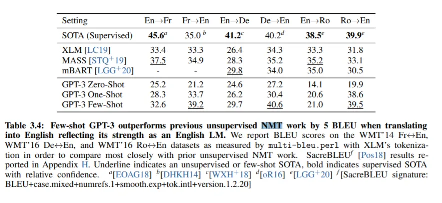

OpenAI a testé GPT sur une grande variété d’autres tâches\, comme la prédiction de texte\, des questions de culture générale sans le laisser rechercher dans un jeu de données séparé\, ou déterminer à quel mot un pronom fait référence [^3]\. Bien que GPT ne gagne pas dans tous les cas\, il obtient d’excellents résultats dans la plupart d’entre eux\. **Si vous ne pouviez choisir qu’un seul modèle\, vous voudriez probablement utiliser GPT\.** C’est le [Simone Biles](https://www.nytimes.com/2019/10/13/sports/simone-biles-worlds.html 'Simone') de la communauté IA\, étant le meilleur lors de nombreux événements et excellent dans le reste\.

Voyons quelques exemples\.

Dans cette première image ci\-dessous\, le modèle reçoit une invite en haut\, puis apparaît avec le reste du texte en dessous\. Le texte dure plus longtemps \; je l’ai juste coupé pour l’affichage\. C’est vraiment génial ce qu’il a fait\, non \?

Dans cette deuxième image\, on voit un autre texte d’exemple généré à partir du modèle\, cette fois montrant qu’il peut aussi produire de la poésie\. C’est probablement mieux que ce que j’écrirais moi\-même\.

Incroyable\, donc tout le battage médiatique est justifié \? Était\-ce un moment charnière\, quand la capacité de l’IA a franchi une limite artificielle \? Twitter et Google Trends semblent certainement le penser\.

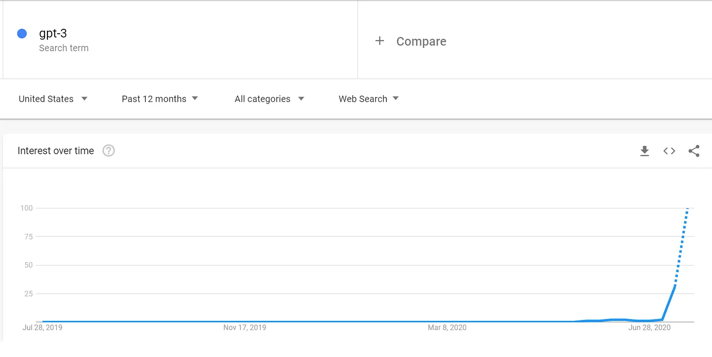

Eh bien\.\.\. Oui et non\.

Ces deux images que je viens de montrer \? J’ai menti\, elles ne viennent pas de GPT\-3\.

Ils proviennent en fait de GPT\-2\, l’ancien modèle sorti en février 2019\. En fait\, les lecteurs de longue date de cette newsletter s’en souviendront peut\-être [this article](/writing/moloch 'Moloch') J’ai écrit à l’époque\, soulignant les résultats déjà admirables du modèle [^4]\. Le texte généré par l’ancien modèle était déjà impressionnant\.

Alors\, qu’est\-ce qui est différent cette fois \? Les robots ont\-ils eu un meilleur département marketing \?

En partie\, oui\. GPT\-3 a été publié à [the end of May](https://minimaxir.com/2020/07/gpt3-expectations/ 'GPT')\. Si vous revenez à cette tendance de recherche Google et que vous plissez les yeux très fort\, vous remarquerez cette petite hausse sur le graphique\, deux semaines avant que ça ne commence vraiment à monter\. C’était l’intérêt public pour GPT\-3 avant le tweet viral\. Cela montre que les formats de présentation peuvent vraiment faire la différence et que je devrais arrêter d’écrire pour faire des vidéos TikTok\.

Cela dit\, il y a en réalité des améliorations impressionnantes cette fois\-ci également\. GPT\-3 donne de meilleurs résultats que GPT\-2\, et peut se généraliser à plus de scénarios\. Cela est en grande partie dû à l’augmentation des données utilisées lors de l’entraînement et à l’augmentation des paramètres du modèle\.

Je vais développer plus loin ci\-dessous\, et le fonctionnement de ces modèles est qu’ils prennent des données\, s’entraînent dessus\, et modifient leur poids selon l’ensemble d’entraînement\.

On sait depuis un moment que plus de données d’entraînement aident généralement [^5]\, et les résultats de GPT\-3 continuent de montrer que c’est vrai\. GPT\-3 ingéré [~50x the amount of data](https://lambdalabs.com/blog/demystifying-gpt-3 'lambda') que l’ancienne version l’a fait\, donnant une intuition sur la façon dont elle peut trouver autant de références pertinentes pour ses sorties [^6]\.

GPT\-3 a également [~100x the amount of parameters](https://minimaxir.com/2020/07/gpt3-expectations/ 'params') dans son modèle comparé à l’ancienne version\. Avec des paramètres de 175 milliards [isn't unheard of](https://twitter.com/iamtrask/status/1285301017878441988?s=20 'params')\, mais cela aide GPT\-3 à mieux se différencier dans ses réponses [^7]\.

Max Woolf souligne deux autres améliorations dans GPT\-3 \: [1) It allows for text generation twice as long, and 2) prompts to the model are even more helpful in steering the direction of text generated](https://minimaxir.com/2020/07/gpt3-expectations/ 'Max')\. GPT\-3 peut prendre zéro\, un ou quelques « prompts » d’exemples de réponses lorsque vous lui donnez des entrées\. Les prompts aident à guider la compréhension des réponses à donner\, et plus il y a de prompts\, mieux c’est\.

Globalement\, Max estime que GPT\-3 lui a donné des résultats exploitables environ 5 fois plus souvent que l’ancien GPT\-2\. En termes de battage médiatique\, le grand public est passé de 0 à 100\, tandis que les spectateurs sont passés de 50 à 70\.

Cela permet des résultats tels que [this, a plugin to pull GPT results to autofill google sheets](https://twitter.com/pavtalk/status/1285410751092416513?s=20 'twitter') \(vraie démo cette fois\, je te le promets\) \:

Comme GPT généralise bien\, il y a beaucoup d’enthousiasme autour de son utilisation dans n’importe quel domaine de « travail de savoir »\. De la programmation à la banque en passant par la médecine\, on pense que GPT pourra éventuellement donner des réponses de la même qualité qu’un professionnel\. La prochaine fois que vous verrez un médecin\, peut\-être que votre diagnostic viendra du Dr GPT\.

Tout cela semble très bien\, quelles sont les préoccupations \?

Max entre dans plus de détails [here](https://minimaxir.com/2020/07/gpt3-expectations/ 'expectations')\, soulignant que \:

- Le modèle produit lentement la production
- Il y a eu beaucoup de sélection dans les exemples présentés publiquement
- Tout le monde travaille avec le même modèle entraîné et nous ne pouvons pas l’ajuster
- Il existe un problème persistant de biais systématique dans l’entraînement\, par exemple le rappel [how Microsoft had to pull its chatbot after it turned racist](https://www.theverge.com/2016/3/24/11297050/tay-microsoft-chatbot-racist 'Tay')

Une autre préoccupation est le coût de la formation d’un tel modèle\. Fait amusant\, [Yannic on youtube](https://www.youtube.com/watch?v=SY5PvZrJhLE&feature=youtu.be 'Yannic') Ils ont souligné que les chercheurs avaient commis une erreur dans certaines collectes de données\, et ne s’en étaient rendu compte qu’après avoir déjà entraîné le modèle\. Plutôt que de recommencer\, ils ont dû corriger ce problème d’autres manières\, puisque **il était trop coûteux de réentraîner le modèle\.**

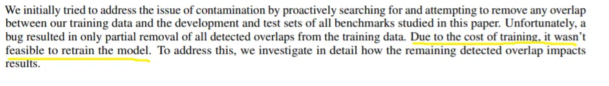

C’est fou\. Les gens espèrent que les coûts d’entraînement des modèles diminueront\, à mesure que le matériel rattrapera les exigences de l’algorithme\. Sinon\, cela signifiera que seules les grandes entreprises pourront personnaliser les modèles pour leurs propres usages\.

Enfin\, il y a aussi le malaise sans fin quant à la façon dont cela va anéantir tous nos emplois et provoquer la fin de l’humanité\. Je vais aborder ce sujet léger dans mes remarques finales\.

Maintenant\, examinons de plus près comment fonctionnent les modèles\.

## 2\. Aperçu du modèle seq2seq utilisé avant GPT\-3

_Avertissement \: Les deux sections suivantes deviennent un peu techniques alors que j’explique les modèles utilisés\. N’hésitez pas à passer à la section « Comment détecter GPT\-3 \? » si vous ne vous sentez pas prêt à relever le défi\._

_Petite précision \: je ne suis pas un expert en apprentissage automatique\, et les modèles impliqués sont complexes\. Je vais m’appuyer sur [this talk](https://www.youtube.com/watch?v=S0KakHcj_rs 'talk') Ainsi que les autres explications liées au bas de cet article\. N’hésitez pas à répondre avec toute correction\._

**GPT\-3 utilise un modèle différent** comparé aux modèles de prédiction traditionnels\. Cependant\, il est toujours utile d’avoir l’intuition derrière les anciens modèles avant de regarder GPT\-3\. Je vais d’abord passer en revue un ancien modèle\, puis passer par GPT\-3\.

Commençons par les populaires\, les plus anciens [sequence to sequence model.](https://google.github.io/seq2seq/ 'seq') On l’abrége couramment « seq2seq »\, mais pour simplifier encore plus la compréhension\, je vais simplement l’appeler « ancien modèle »\, et GPT\-3 « nouveau modèle »\.

Supposons que nous ayons une phrase et que nous voulions prédire la phrase suivante\. Nous paserions notre phrase dans notre algorithme\, qui est une série de fonctions\, puis obtenions la sortie prédite\.

Chaque mot compte\, donc nous devons diviser la phrase d’entrée et la considérer mot par mot\. Par exemple\, « Had we but world enough and time » a des connotations différentes de « Had we but world enough and limes »

Désencombrons le diagramme\, et regardons simplement le premier mot\. Nous faisons passer ce mot à travers une fonction\, puis obtenons une sortie temporaire\. Nous savons que nous pouvons représenter les mots comme des nombres\, puisque c’est ainsi que les ordinateurs traitent les mots [^8]\. Pensez donc au mot transformé en un certain nombre de nombres\, avec des calculs calculés dessus\, puis un autre ensemble de nombres après cela\. Par exemple \(1\, 2\, 3\) multiplié par 2 égale à \(2\, 4\, 6\)\.

Si vous vous souvenez des mathématiques du lycée\, il s’agit de multiplication matricielle ou d’algèbre linéaire\. **Presque toutes les mathématiques ci\-dessous peuvent également être représentées sous une forme de multiplication matricielle\, pour cette section et la suivante\.**

La fonction utilisée est une [neural network, so it's more complicated than just multiplying by two.](https://towardsdatascience.com/learn-how-recurrent-neural-networks-work-84e975feaaf7 'neural') Je vais passer un peu sur le fonctionnement précis car j’ai déjà passé en revue l’intuition [here](/writing/ml 'ML')\, et cela compliquera trop cette explication\. Abonnements gratuits\, envoyez\-moi un mail et je vous transmettrai la suite\.

Ce qui est plus important à comprendre ici\, c’est que le mot est transformé en autre chose\. Le modèle peut contrôler à la fois comment le mot est initialement transformé en nombres\, et la fonction que nous exécutons\. Par exemple\, au lieu de \(1\, 2\, 3\) multiplié par 2\, on pourrait avoir « Had » en \(2\, 3\, 4\)\, puis multiplié par 3 pour égaler \(6\, 9\, 12\)

Nous avons terminé avec le premier mot\, alors passons au second\. Ce qui est différent ici\, c’est que nous avons cette sortie temporaire 1 du premier mot [^9]\. Nous allons combiner cela\, avec le second mot\, appliquer à nouveau notre fonction\, et obtenir une nouvelle sortie temporaire 2\.

À ce stade\, vous pouvez déduire où nous allons pour le reste de la séquence\. En effet\, nous continuons ainsi jusqu’au dernier mot de notre entrée\. Nous utilisons la sortie temporaire d’un mot pour aider à générer la sortie temporaire du suivant de manière récurrente\.

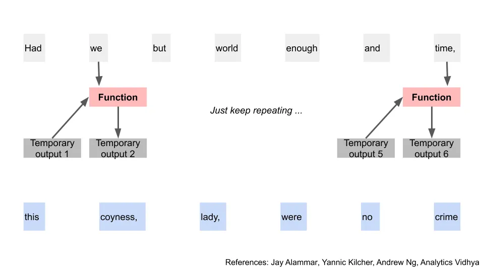

En utilisant cette sortie temporaire\, nous appliquons une fonction différente\, ce qui nous donne deux choses\. Nous obtenons le premier mot de notre sortie \(après l’avoir reconverti à partir des chiffres\)\, puis une autre sortie temporaire \(toujours en nombres\)\. Dans notre exemple\, nous obtenons le mot « ceci »\. Super\, enfin un progrès tangible \!

Nous avons maintenant une sortie temporaire\, une sortie réelle\, et notre nouvelle fonction\. Comme vous l’aurez deviné\, nous pouvons répéter cette même étape pour obtenir le prochain mot prédit\, puis une autre sortie temporaire\. C’est à nouveau un schéma récurrent\.

Et comme dans le scénario d’entrée précédent\, répétez jusqu’à la fin de la phrase\.

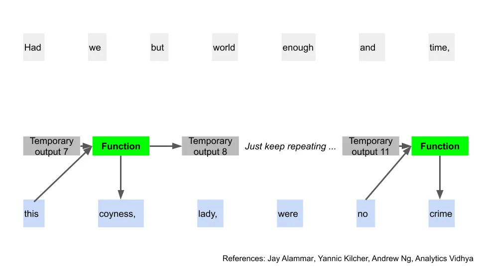

Et nous en avons fini avec l’ancien modèle \! C’était beaucoup\, et évidemment trop simplifié\, mais nous avons acquis une compréhension générale du processus\. Pour plus de détails\, vous pouvez consulter l’article original [here](https://arxiv.org/abs/1409.3215 'paper')

Voici maintenant une question cruciale qui teste à la fois notre compréhension et suggère les améliorations du nouveau modèle\. Dans l’ancien modèle\, pouvions\-nous résoudre une partie du processus avant d’avoir réglé les parties précédentes \? Par exemple\, pouvons\-nous obtenir la sortie temporaire pour le « temps »\, sans d’abord résoudre pour « nous » \?

**Non\, puisqu’on devait tout faire dans l’ordre\.** La position et le contexte des mots comptent\, donc nous voulons tout traiter un mot à la fois\. Nous ne pouvons pas sauter aucune partie\, car chaque étape dépend de la précédente\, de manière récurrente\. C’est aussi pourquoi l’ancien modèle est appelé un [recurrent neural network](http://karpathy.github.io/2015/05/21/rnn-effectiveness/ 'RNN')\. À cause de cela\, le calcul de la prédiction devient également lent lorsque notre texte d’entrée devient volumineux\.

Voici le modèle du transformateur\.

## 3\. GPT\-3 utilise un modèle de décodeur à transformateur\, une variante du modèle de transformateur

GPT\-3 signifie Générative Pretrained Transformer 3\. Le transformateur dans le nom signifie le [transformer model, using an "attention" mechanism.](http://jalammar.github.io/illustrated-transformer/ 'transformer') GPT\-2 et GPT\-3 utilisent tous deux le même type de modèle\, donc toute explication que vous trouverez du premier se généralisera également [^10]\.

Cependant\, ce que j’ai appris juste avant de publier ce billet\, c’est que **Ils utilisent réellement [a variation of the transformer model.](https://s3-us-west-2.amazonaws.com/openai-assets/research-covers/language-unsupervised/language_understanding_paper.pdf 'variation')** Ainsi\, passons d’abord en revue une version simplifiée du nouveau modèle\, ce que signifie « attention »\, puis voyons en quoi la version de GPT\-3 diffère\. Je vais indiquer quand nous quittons le transformateur classique et utilisons les ajustements de GPT\-3\.

Pour le nouveau modèle\, nous reviendrons au début\, avec nos mots d’entrée et essayons d’en obtenir la sortie\.

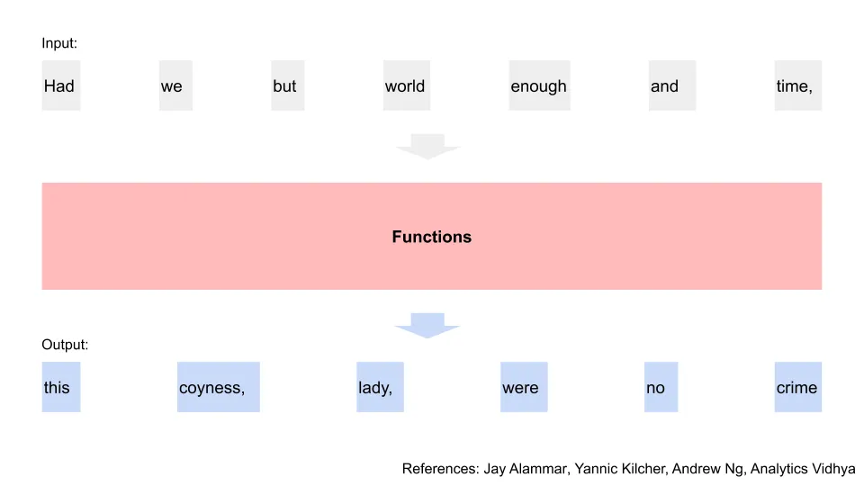

Maintenant\, cependant\, nous voulons évaluer tous les mots d’entrée en même temps\, en parallèle plutôt qu’en séquence\. Cela nous fera gagner beaucoup de temps pour calculer le résultat\, car nous pouvons utiliser des mathématiques matricielles pour calculer cela en un seul coup\.

Nous convertissons à nouveau nos mots d’entrée en nombres\, comme toujours\. Cette fois\, cependant\, nous faisons passer ces nombres à travers 3 fonctions différentes\, obtenant 3 sorties temporaires pour chaque mot\, a\, b et c\. Notez que c’est simplement pour simplifier que nos mots et sorties ont 3 nombres \; en pratique\, ils font des centaines de nombres\. Nous verrons bientôt comment ces 3 sorties seront utilisées [^11]\.

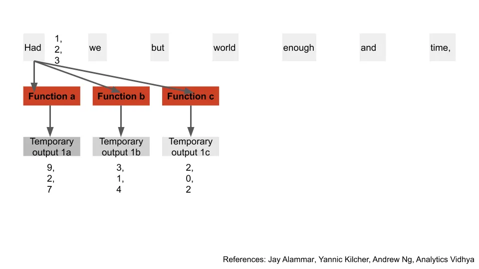

Désencombrons le diagramme et faisons ces calculs pour tous les mots d’entrée\. Nous avons maintenant a\, b et c pour tous nos mots d’entrée\.

Voici maintenant le problème auquel nous rencontrons lorsque nous ne considérons pas l’entrée séquentiellement \; les chercheurs étaient bloqués là\-dessus depuis longtemps avant le nouveau modèle\. Comme mentionné précédemment\, **La position ainsi que le contexte des mots comptent\. Comment obtenir cela si nous n’évaluons pas séquentiellement \?**

Par exemple\, prenons la phrase « L’auteur a bu encore plus de café pour finir sa newsletter\, parce que ce n’était pas encore fini »\. Échanger la position de « coffee » par « newsletter » n’aurait pas de sens\, donc l’ordinateur doit le savoir d’une manière ou d’une autre\. De plus\, le « ça » ici fait référence à la newsletter\, et l’ordinateur doit aussi connaître ce contexte\. Dans l’ancien modèle\, toutes ces informations sont conservées puisque nous déplaçons mot par mot\. Dans le nouveau modèle\, nous avons besoin d’une autre méthode pour obtenir cette information dès le départ\.

Remarquez dans le diagramme que nous avons calculé toutes ces sorties temporaires simultanément\, et aucune ne dépend l’une de l’autre\. Ce que nous allons faire ensuite\, c’est prendre la première sortie temporaire du premier mot\, et appliquer une fonction sur cette sortie avec toutes les secondes sorties temporaires de tous les mots\. Dans le diagramme\, j’ai représenté les résultats de ces résultats comme le premier « point » de sortie temporaire\, la deuxième sortie temporaire\, par exemple 1a\.2b

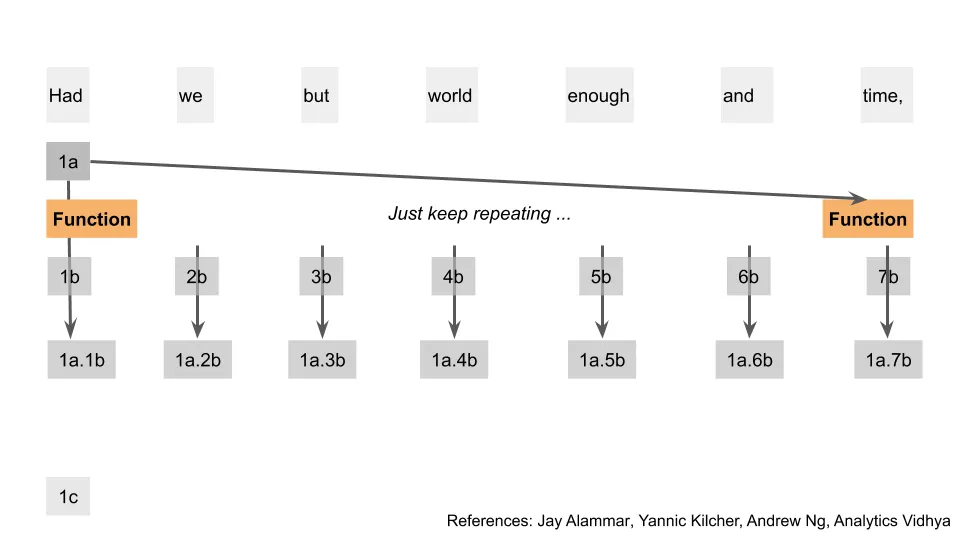

Nous avons pris quelque chose qui était lié au premier mot\, et l’avons lié à quelque chose qui était lié à tous les autres mots\. Il est important de noter que nous n’avons pas à faire ces calculs séquentiellement\, puisque le résultat de l’un ne se glisse pas dans l’autre\. Nous pouvons répéter cela pour le reste des mots\. Ici\, je montre la même étape pour le mot 2\, juste pour plus de clarté\.

Revenons au premier mot\. Nous avons terminé avec les sorties a et b\, mais il reste encore c\. Sans surprise\, nous appliquons encore une autre fonction à toutes ces sorties temporaires à points et à toutes les sorties c\. Ensuite\, nous utilisons une autre fonction pour transformer toutes ces sorties séparées en une seule sortie\. Par exemple\, dans ce cas\, nous sommes passés de 7 sorties à 1 sortie unique 1z\.

Ok\, ça a demandé beaucoup de travail\. Je te jure\, ça a du sens pour ceux qui l’ont imaginé\. Ce qu’on vient de faire est passé par là [the steps of calculating "attention" for our words](http://jalammar.github.io/illustrated-gpt2/ 'attention') [^12]\. La quantité d\'« attention » que le mot A a pour un autre mot correspond à la quantité de temps que le mot A doit se concentrer dessus et donc à quel point il doit recevoir de contexte\. En associant les composants des mots à tous les autres mots\, on résout plus tôt le problème de contexte\. Je vais passer la solution du problème de position pour simplifier\, pensez\-y simplement comme s’ils ajoutaient plus de chiffres au mot original en fonction de la position du mot [^13]\.

Nous avons maintenant cette nouvelle sortie\, z\, qui contient des informations provenant de ce mot particulier\, ainsi que le contexte des autres mots dans l’entrée\. Nous passons cela via une autre fonction \(un réseau de neurones feed forward\) pour obtenir une autre sortie\, appelons\-la z\\\*\. Presque arrivé\.

**Nous allons résumer toutes les étapes que nous venons de faire et les appeler une étape d\'« encodage »\.** Lors de l\'« encodage »\, nous transformons nos premiers nombres pour le mot en nouveaux nombres qui incluent plus de contexte que les autres mots autour\. Par exemple \(1\, 2\, 3\) devient \(5\, 7\, 0\)\. Rappel que chaque mot est en réalité composé de centaines de chiffres\, pas seulement trois\.

La sortie z\\\* contient le même nombre d’éléments que lorsque nous avons d’abord transformé le mot en nombres\. Le nouveau modèle prend ce résultat et le fait passer à travers tout le processus d’encodage à plusieurs reprises\. Pensez\-y comme plusieurs couches d’encodage\, par exemple en effectuant le processus 96 fois\.

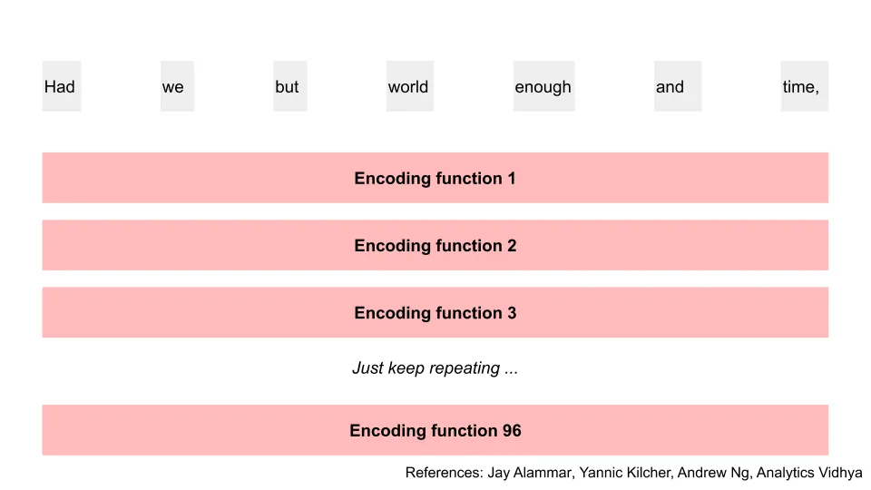

Après tout cet entraînement\, nous avons une sortie finale de l’encodage\. Appelons\-les vf\. Notez que le calcul de la vf d’un mot reste indépendant du calcul de la vf d’un autre mot\. Cette parallélisation nous a fait gagner beaucoup de temps\. Par exemple\, je peux calculer 7\_vf sans savoir 1\_vf d’abord\.

Nous pouvons maintenant utiliser ces sorties finales pour commencer à prédire nos mots\. Nous faisons passer toutes ces sorties finales par une autre « fonction de décodage » pour obtenir notre premier mot [^14]\. Il existe des différences entre le fonctionnement de la fonction de décodage et la fonction d’encodage\, mais les étapes sont suffisamment similaires pour que nous ne les repassions pas\. **On peut penser à la fonction de décodage comme effectuant toutes ces étapes d’encodage\, mais aussi en prenant la sortie du processus de « fonction d’encodage » [^15]\.**

J’ai mis ici un seul gros bloc pour les « fonctions de décodage »\, mais le nouveau modèle répète ce processus autant de fois que le processus d’encodage\. Par exemple\, s’il avait 96 couches de codage\, il en aura 96\.

Maintenant que nous avons notre premier mot prédit\, nous allons utiliser ce mot avec les résultats finaux\, puis les faire passer à nouveau par la fonction de décodage\. Si vous plissez les yeux\, cela ressemble beaucoup au processus de la section précédente sur les anciens modèles\.

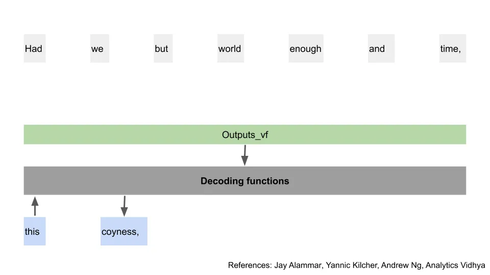

Et une fois que vous répétez ce processus pour tous les mots\, vous obtenez la phrase finale\. Enfin\.

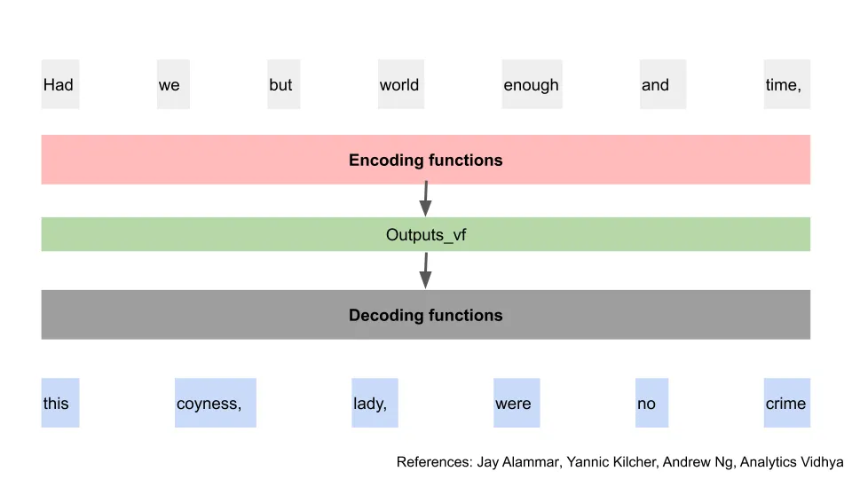

Bon\, voilà donc le _Généralités_ Modèle de transformateur\. Maintenant\, mettons tout cela de côté et recommençons de zéro pour la version de GPT\-3\.

Je plaisante\, ne panique pas [^16]\.

GPT\-3 combine le processus d’encodage et de décodage\, pour obtenir un [Transformer Decoder](https://arxiv.org/pdf/1801.10198.pdf 'TD')\. Ils combinent la séquence d’entrée et de sortie attendue en une seule « phrase » puis la passent à travers les couches de décodage\. GPT\-3 possède 96 de ces couches de décodage [^17]\. Le modèle sert à prédire la prochaine entrée et la prochaine sortie\.

Si cela semble un peu vague\, c’est parce que c’est le cas\. Je ne trouve aucune explication en ligne sur la façon dont ils combinent les étapes\, à part le [original paper,](https://arxiv.org/pdf/1801.10198.pdf 'paper') [this post](http://jalammar.github.io/illustrated-gpt2/ 'Jay')\, et ce jeu aléatoire [github comment as confused as I am](https://github.com/openai/gpt-2/issues/157 'github')\. Il semble que la façon dont ils prédisent un mot à la fois impliquerait aussi que nous revenons au problème récursif\, à savoir traiter le texte séquentiellement\. Peut\-être que simplement mettre assez de puissance de calcul sur le problème était la solution\. Si quelqu’un en sait plus\, merci de m’envoyer un e\-mail\.

Beaucoup de personnes qui postent en ligne disent toutes que GPT\-3 utilise le modèle traditionnel transformateur\, ou encodeur\-décodeur transformateur\. Ils expliquent ensuite le modèle traditionnel du transformateur afin de décrire ce qui se passe dans GPT\-3\. **Oui\, toutes ces personnes ont tort\,** tout comme je l’étais jusqu’à ce qu’on me corrige juste avant de poster ceci\.

Si vous êtes toujours avec moi\, il y a deux autres caractéristiques importantes de l’algorithme qui méritent d’être mentionnées\.

Tout d’abord\, vous vous souvenez quand on a divisé le mot en 3 caractéristiques différentes\, a\, b et c \? Le nouveau modèle fait cela 96 fois dès le départ [^18]\. Chaque fois\, il utilise une fonction différente\, de sorte que 96 triplets différents sont générés\. Comme ceux\-ci sont indépendants\, il fait passer tous ces éléments simultanément par les couches d’encodage\/décodage\, pour tous les mots d’entrée\. Les résultats de ces éléments sont fusionnés lors de l’obtention de cette sortie de la fonction d’encodage\/décodage\, z\. Ceci est connu sous le nom de « multiples têtes d’attention »\.

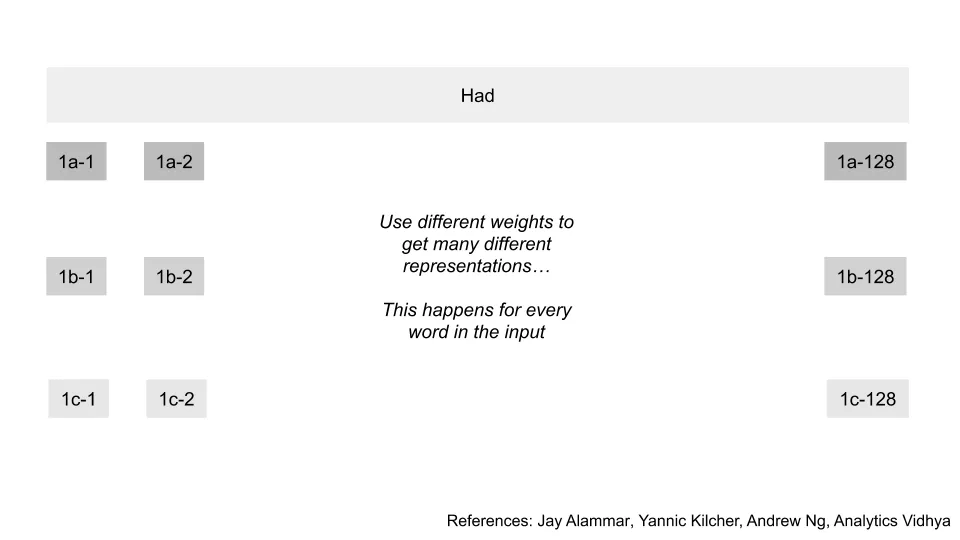

Deuxièmement\, chaque fois que je mentionne la fonction dans cette section\, vous pouvez la considérer comme un poids ou un paramètre sur un certain nombre\. **Quand on additionne tous les poids\, le nouveau modèle en compte 175 milliards\.** Non\, ce n’est pas une faute de frappe\. Quand les gens parlent du nombre de paramètres utilisés par GPT\-3\, et de son ampleur bien plus grande que les modèles précédents\, c’est à cela qu’ils font référence\.

Par exemple\, si chaque mot était représenté par une liste de 1000 nombres\, il vous faudrait alors autant de paramètres pour passer par une seule fonction dans l’ensemble du processus décrit ci\-dessus\. Vous pouvez facilement voir comment avoir un processus avec 96 couches et 96 alternatives dans chaque couche vous permet d’atteindre un nombre gigantesque de paramètres requis\.

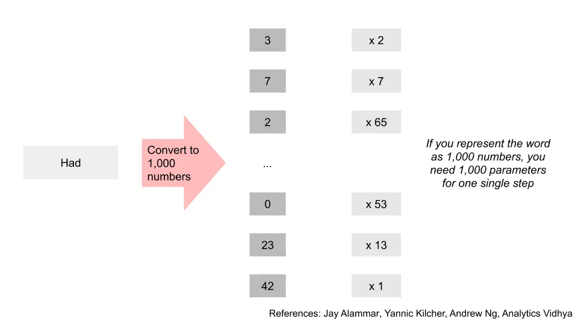

C’était une longue déviation\, mais vous avez maintenant plus d’intuition sur ce que fait GPT\-3\. Il prend des entrées de mots\, effectue plusieurs itérations de transformations via des mathématiques matricielles\, et utilise cela pour prédire ou traduire des mots\.

Si c’était un peu trop compliqué\, pensez à cet exemple plus simple\. Imaginez un [choose your own adventure game](https://en.wikipedia.org/wiki/Choose_Your_Own_Adventure 'choose your own')\, où vos choix déterminent la fin de l’histoire\. **GPT\-3 est comme ça\, sauf qu’il propose des milliards d’options superposées\.** La moindre différence dans la formulation de votre choix vous fera prendre une autre direction\. Et les chemins possibles sont pratiquement infinis\.

Après avoir travaillé tout cela\, l’architecture du transformateur de l’article original est ci\-dessous pour référence\. Vous pouvez voir comment certaines parties correspondent au diagramme simplifié que nous venons de penser\, avec quelques cases que j’ai laissées de côté pour simplifier [^19]\. GPT\-3 utilise uniquement le côté droit de ce schéma\. Si vous souhaitez en savoir plus\, il y a des références supplémentaires au bas de cet article\.

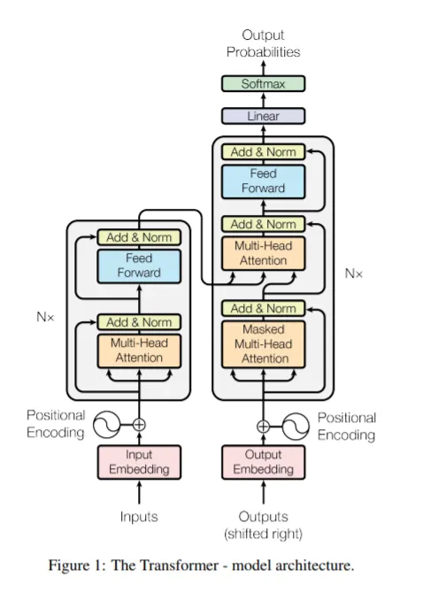

## 4\. Comment pouvons\-nous détecter GPT\-3 \?

Nous savons que GPT\-3 est bon\, et que certains échantillons de la sortie sont difficiles à distinguer de l’écriture humaine\. La question naturelle est donc de se demander s’il existe d’autres moyens de détecter si le texte a été écrit par une machine \?

Il s’avère qu’il existe des méthodes étonnamment simples pour y parvenir\.

Tout d’abord\, [because of the hyperparameters used in GPT-3,](https://medium.com/analytics-vidhya/understanding-the-gpt-2-source-code-part-1-4481328ee10b 'temp') **La fréquence des mots générés ne suivra pas les distributions attendues chez les humains normaux\.** Dans la capture d’écran ci\-dessous\, Gwern explique que cela fait apparaître encore plus de mots courants que prévu\, et que des mots rares n’apparaissent pas du tout\. La température contrôle l’aléatoire\, et l’hyperparamètre top\-k contrôle où se situe le point de coupure de fréquence pour les mots du haut choisis\.

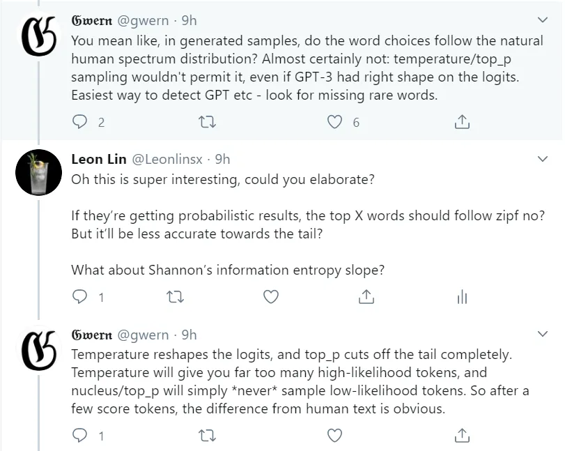

Pour ceux qui ne connaissent pas la loi de Zipf\, je l’ai déjà abordée [here](/writing/zipf 'Zipf') Quand on parle de recherche d’extraterrestres \(oui\, des extraterrestres\. Les abonnements gratuits m’envoyent un mail et je transmettrai la conversation\)\. Essentiellement\, il est indiqué que dans un grand échantillon de texte\, la fréquence d’un mot est inversement proportionnelle à son rang\, classée par fréquence d’occurrence\. Par exemple\, le mot le plus courant est \~2 fois plus fréquent que le deuxième mot le plus fréquent\.

J’ai déjà tracé la loi de Zipf pour ma newsletter\, et cela ressemble au graphique du haut\. Si GPT\-3 devait écrire mes articles\, on s’attendrait à quelque chose comme le bas \(avec plus de mots bien sûr\, l’exemple est juste à titre illustratif\)\.

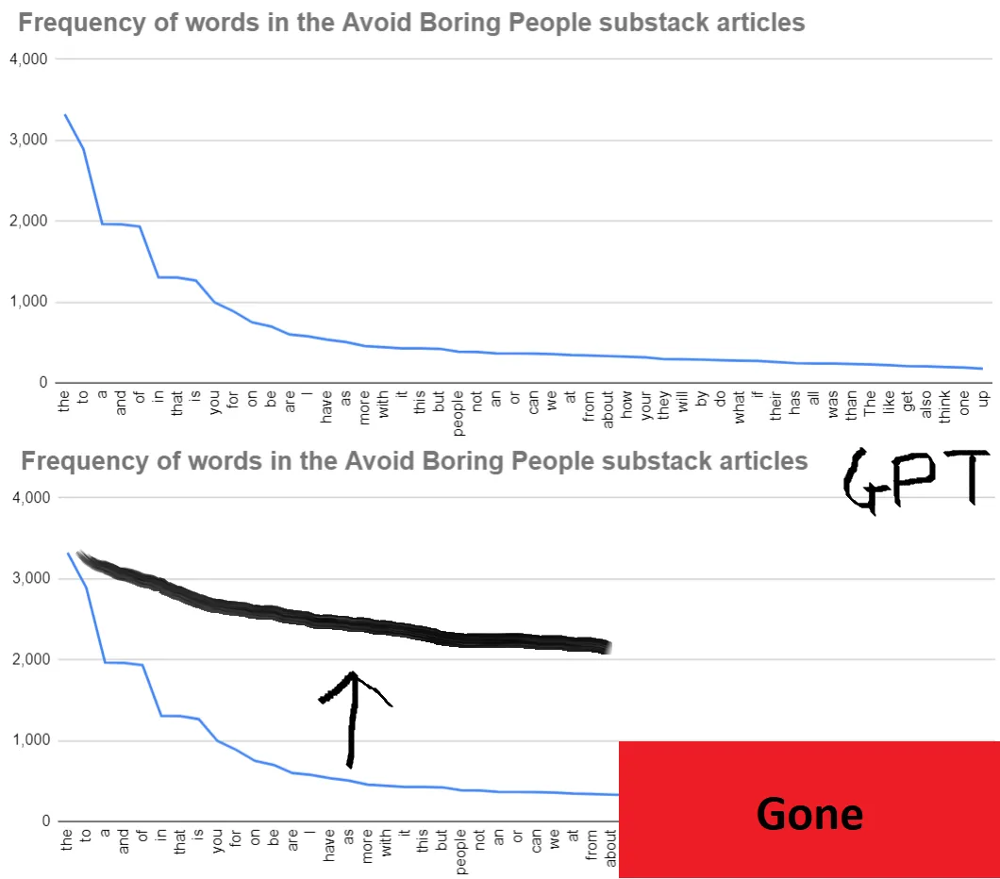

Ensuite\, vous pouvez utiliser un autre modèle pour vérifier le texte\. Analytics Vidhya a publié un post il y a quelque temps [how to detect computer generated articles.](https://www.analyticsvidhya.com/blog/2019/12/detect-fight-neural-fake-news-nlp/ 'Vidhya') Ils fournissent quelques outils tels qu’un modèle de détecteur GPT\-2 ou [Grover,](https://grover.allenai.org/detect 'Grover') Cela peut prendre des exemples de texte et vous indiquer s’ils pensent que c’est généré par machine [^20]\. Ces outils ont été lancés avant GPT\-3 et n’ont pas encore été calibrés pour celui\-ci\, mais fonctionnent toujours bien\. Ils fonctionnent parce que **Les modèles connaissent les particularités que d’autres modèles utilisent pour générer du texte\.**

Voici une démonstration\. Je suis allé voir le premier échantillon en annexe du [GPT 3 paper (page 49)](https://arxiv.org/pdf/2005.14165.pdf 'GPT')\, et a copié le poème généré par machine là\-bas\. En le saisissant sur le site de Grover\, on voit que Grover pense que c’était généré par machine\. Je n’aurais probablement pas deviné correctement\.

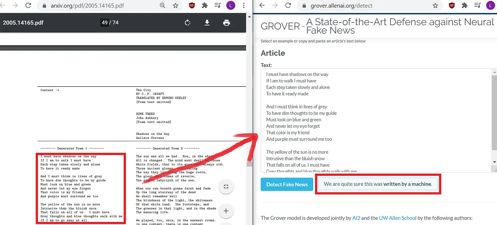

Bien sûr\, aucune de ces méthodes n’est infaillible\. Si vous n’avez pas un échantillon assez grand\, il est difficile de faire une analyse de fréquence ou de la vérifier via les modèles de vérification\. Si quelqu’un vous envoie un mur de texte juridique standard une seule fois\, il se peut qu’il n’y ait pas assez de données pour en être certain\. Je me demande à quel point il serait insultant de répondre en demandant s’il s’agit d’un bot\.\.\.

Grover obtient aussi de faux positifs\, comme le fait d’affirmer à tort que le poème d’Allen Ginsberg [Howl](https://www.poetryfoundation.org/poems/49303/howl 'Howl') a été écrit par une machine [^21]\. Et il obtient aussi des faux négatifs\, pensant que le texte généré par GPT\-3 a été créé par un humain\. [You can try playing around with it and see what works for you](https://grover.allenai.org/detect 'Grover')

Cela dit\, avoir de telles méthodes encore disponibles me rend moins craint des dangers du faux texte généré par machine\. Puisque les deux outils ci\-dessus reposent sur les caractéristiques structurelles des modèles\, il semble probable que tant que les modèles disposent d’hyperparamètres à ajuster\, le texte généré serait reconnaissable\.

Dans le pire des cas\, tout le monde devra installer une extension de navigateur qui scanne la page et vous avertit si elle pense que le texte est faux\. Peut\-être quelque chose comme les bloqueurs de pubs d’aujourd’hui \? À ce stade\, devrions\-nous même nous en soucier \?

## 5\. Être en vie

L’accès à l’API GPT\-3 est actuellement disponible [subject to a waitlist,](https://openai.com/blog/openai-api/ 'waitlist') car OpenAI veut faire attention à l’utilisation abusive du modèle\. Si le concept vous intéresse\, il existe quelques solutions de contournement\.

- OpenAI a publié le code de GPT\-2 \(l’ancienne version de GPT\-3\) [here](https://openai.com/blog/better-language-models/ '2')\, donc tu peux le gérer toi\-même si tu sais comment le configurer\.
- L’équipe de Hugging Face a développé une interface plus conviviale pour GPT\-2\, ainsi que pour d’autres modèles basés sur des transformateurs\. Vous pouvez y jeter un œil [here](https://transformer.huggingface.co/ 'transformer')
- [Aaron Tay](https://musingsaboutlibrarianship.blogspot.com 'Aaron') J’ai aussi posté qu’en utilisant la version premium « Dragon » de [AI Dungeon](https://play.aidungeon.io/ 'AI')\, un jeu de générateur de texte utilisant GPT\, [supposedly gets you access to GPT-3 within the game](https://musingsaboutlibrarianship.blogspot.com/2020/07/playing-with-gpt-3-via-ai-dungeon.html 'AI')

Nous devrions nous attendre à ce que davantage de personnes aient accès à des capacités similaires à GPT\-3\, et que les modèles de langage généraux continuent de s’améliorer\. Les modèles pourraient ne pas réussir un [Turing Test](https://plato.stanford.edu/entries/turing-test/ 'Turing') Pourtant\, comme [Kevn Lacker shows.](http://lacker.io/ai/2020/07/06/giving-gpt-3-a-turing-test.html 'Lacker') Cependant\, il semble que nous nous rapprochions chaque jour\. Il deviendra de plus en plus difficile pour les humains seuls de savoir si quelque chose a été fabriqué par machine\.

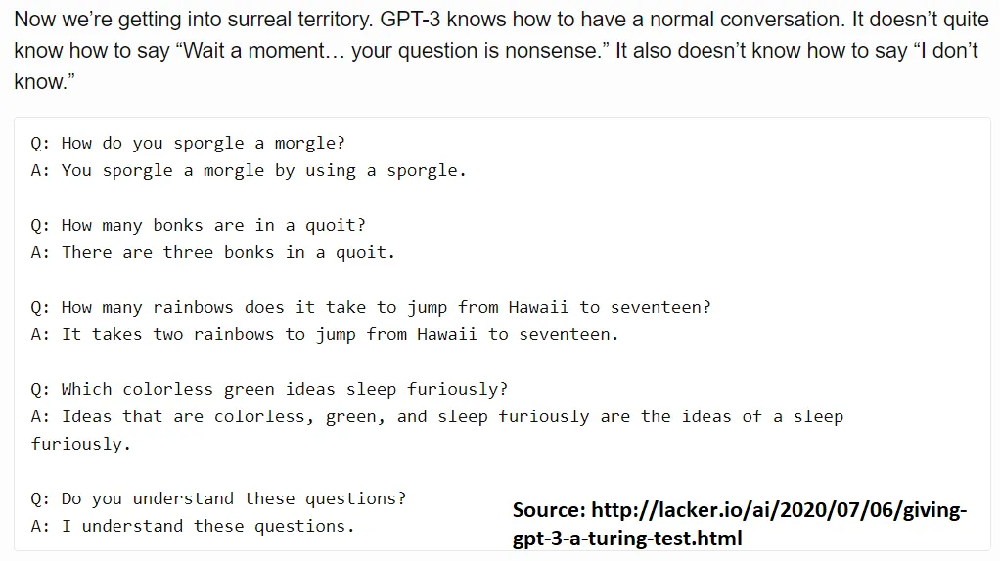

Les cas d’usage futurs de GPT seront probablement encore plus créatifs que nous ne le pensons\. [Tyler Cowen gives some thoughts here](https://marginalrevolution.com/marginalrevolution/2020/07/the-case-for-gpt-3.html 'Cowen') sur les diagnostics médicaux et les thérapies\, et nous commençons probablement encore à comprendre ce qui pourrait être possible à grande échelle avec GPT ou des modèles similaires\. Les démonstrations vont continuer à nous surprendre\. Nous nous demanderons ce que signifie être intelligent\.

En même temps\, il y a eu des tweets de programmeurs disant que cela allait enlever des emplois dans la banque et le conseil\, de capital\-risqueurs sur la façon dont cela allait enlever des emplois de programmation\, et de tout autre groupe que vous pouvez imaginer essayer de rejeter sur une autre industrie\. Je ne trouve actuellement pas ces arguments convaincants\, mais je reste ouvert à être convaincu\. Si obtenir des outils plus efficaces était un grand facteur de destruction\, Excel aurait supprimé la moitié de tous les emplois de bureau il y a des années\.

Ce qui pourrait se passer à la place\, c’est que **La spécialisation dans votre carrière est encore plus rentable\.** GPT peut vous fournir le modèle à vérifier\, avant que vous ne complétissiez et éditiez si besoin\. Les documents et diapositives fastidieux peuvent être générés sans trop d’efforts de votre part\, puis vous pouvez appliquer votre expertise pour les personnaliser pour le projet\. Les banquiers et consultants juniors pourraient enfin pouvoir faire quelque chose de productif de leur temps plutôt que de recréer le même deck pour une autre entreprise avec les logos échangés [^22]\.

Voyez\-le ainsi \: Est\-ce qu’il vous faut plus ou moins d’expertise pour corriger les devoirs de votre enfant en grandissant \? Vous commencez par corriger des fautes d’orthographe\, vous finissez par devoir connaître le calcul\.

De plus\, les gens semblent penser que toutes nos données d’entrée et de sortie seront propres et facilement utilisables\. Comme [Vicki Boykis](https://vicki.substack.com/p/were-still-in-the-steam-powered-days 'Vicki') a souligné à plusieurs reprises que c’est généralement le point de vue de quelqu’un qui n’a jamais travaillé avec de jeux de données plus vastes auparavant\. Si vous aviez un modèle GPT personnalisé pour vous\-même\, vous passeriez probablement la plupart de votre temps à nettoyer les données\. Sinon\, vous passeriez probablement la majeure partie de votre temps à nettoyer la sortie\.

Quoi qu’il en soit\, il reste encore du travail à faire\. Nous sommes en sécurité pour l’instant\.

Je proposerais de manière controversée que **GPT\-3 nous en dit plus sur nous\-mêmes en tant qu’humains\, plutôt que sur les ordinateurs\.** Cela montre que nous avons une tolérance étonnamment large à la variation des entrées que nous recevons\, qu’il s’agisse de prose\, de poésie ou de pièces musicales\. Un texte qu’un ordinateur signalerait comme généré par machine passerait nos tests instinctifs\, ce qui impliquerait que nous sommes les plus accommodants des deux\.

Peut\-être est\-ce cette appréciation de l’ambiguïté\, cette acceptation de l’étrange\, qui sépare nos signaux synapsiques des bits et octets\.

Ou peut\-être devrons\-nous repenser ce que cela signifie \; de [being alive](https://www.youtube.com/watch?v=eBBPKedba5o 'alive')\.

_Cet article n’est pas écrit par GPT\-3\. Merci à [Gwern](https://twitter.com/gwern?ref_src=twsrc%5Egoogle%7Ctwcamp%5Eserp%7Ctwgr%5Eauthor 'Gwern') et [Jay Alammar](https://twitter.com/JayAlammar?ref_src=twsrc%5Egoogle%7Ctwcamp%5Eserp%7Ctwgr%5Eauthor 'Jay') pour répondre à des questions sur Twitter concernant GPT\, et [Nathan](https://mobile.twitter.com/nbashaw 'Nathan') pour les modifications\._

## Autres commentaires intéressants

1. [Gwern showcases creative writing by OpenAI’s GPT-3 model, demonstrating poetry, dialogue, puns, literary parodies, and storytelling](https://www.gwern.net/GPT-3 'Gwern')
2. [Max Woolf on Tempering Expectations for GPT-3 and OpenAI’s API](https://minimaxir.com/2020/07/gpt3-expectations/ 'Max')
3. [Kevin Lacker on Giving GPT-3 a Turing Test](http://lacker.io/ai/2020/07/06/giving-gpt-3-a-turing-test.html 'Lacker')
4. [Michael Nielsen twitter thread](https://twitter.com/michael_nielsen/status/1284937254666768384?s=20 'Nielsen')
5. [Manuel Araoz on how OpenAI's GPT-3 may be the biggest thing since bitcoin](https://maraoz.com/2020/07/18/openai-gpt3/ 'Maraoz')
6. [Exxact with other GPT-3 applications, such as summaries, code, and spreadsheets](https://blog.exxactcorp.com/what-can-you-do-with-the-openai-gpt-3-language-model/ 'GPT')

## Explications plus détaillées

1. [Yannic's youtube video explaining the GPT 3 paper](https://www.youtube.com/watch?v=SY5PvZrJhLE&feature=youtu.be 'Yannic')\. En plus de l’article GPT 3 lui\-même ["Language Models are Few-Shot Learners"](https://arxiv.org/pdf/2005.14165.pdf 'GPT3')\. [Yannic's youtube video explaining the GPT 2 paper, which GPT 3 bases itself on.](https://www.youtube.com/watch?v=u1_qMdb0kYU 'Yannic') En plus de l’article GPT 2 lui\-même ["Language Models are Unsupervised Multitask Learners"](https://d4mucfpksywv.cloudfront.net/better-language-models/language_models_are_unsupervised_multitask_learners.pdf 'GPT2')
2. [Joseph Palermo](https://twitter.com/j_w_palermo 'Joseph') de Dessa [speaking at Insight on Transformers.](https://www.youtube.com/watch?v=S0KakHcj_rs 'youtube') J’ai trouvé cela utile en raison des questions posées par les membres du public\, aussi perdus que moi tout au long de la présentation\.
3. [Andrew Ng on attention models](https://www.youtube.com/watch?v=SysgYptB198 'Ng')
4. [How do Transformers Work in NLP? A Guide to the Latest State-of-the-Art Models](https://www.analyticsvidhya.com/blog/2019/06/understanding-transformers-nlp-state-of-the-art-models/ 'Vidhya')
5. [Jay Alammar on the illustrated transformer](http://jalammar.github.io/illustrated-transformer/ 'transformer')

[^1]: Je plaisante\, je plaisante\. De temps en temps\, ils jouent au ping\-pong\.

[^2]: Apparemment\, il y a des problèmes à comparer directement les résultats\. Je ne connais pas les détails mais cela semble lié à la standardisation des données amorcées utilisées\. L’article dit \: « Cependant\, nos réglages de prise unique \(one \/ pew\-shot\) ne sont pas strictement comparables au travail non supervisé antérieur puisqu’ils utilisent un petit nombre d’exemples appariés \(1 ou 64\)\. Cela correspond à jusqu’à une ou deux pages de données d’entraînement en contexte\. »

[^3]: Contexte \- « L’ensemble de données LAMBADA teste la modélisation des dépendances à longue portée dans le texte – le modèle est chargé de prédire le dernier mot des phrases nécessitant la lecture d’un paragraphe de contexte » \; Anecdotes \- « Sur TriviaQA\, nous obtenons 64\,3 \% en mode zéro shot\, 68\,0 \% en one\-shot et 71\,2 \% en mode « poigne coup » \; Pronoms \- « Le Winograd Schemas Challenge est une tâche classique en NLP qui consiste à déterminer à quel mot un pronom fait référence\, lorsque le pronom est grammaticalement ambigu mais sémantiquement non ambigu pour un humain »

[^4]: Un des liens est cassé puisque le codex stellaire de l’ardoise a supprimé son blog \; mais vous pouvez trouver certains extraits de poésie de GPT\-2 conservés [here](https://antinegationism.tumblr.com/post/182901133106/an-eternal-howl 'Moloch')\, et [Gwen's site](https://www.gwern.net/GPT-2 'Gwern') en a beaucoup d’autres\.

[^5]: [Banko and Brill showed way back in 2001 that more data can make a bad algorithm perform better than a good one.](https://dl.acm.org/doi/10.3115/1073012.1073017 'Banko')

[^6]: Pages 8 et 9 de la [GPT-3 paper](https://arxiv.org/pdf/2005.14165.pdf 'paper') discuter de la façon dont ils ont utilisé les ensembles de données CommonCrawl\, WebText\, Books et Wikipédia pour l’entraînement\.

[^7]: Je crois qu’il fait référence à ce modèle de 160 milliards de paramètres [here](https://dl.acm.org/doi/abs/10.5555/3045118.3045359 'model')

[^8]: Nous ne convertissons pas exactement les mots en représentation binaire ici\, si c’est ce que vous pensiez\. Au lieu de cela\, nous sommes [using a word embedding such as word2vec](https://towardsdatascience.com/learn-how-recurrent-neural-networks-work-84e975feaaf7 'word2') pour générer des représentations numériques variées des mots qui pourront être utilisées dans les algorithmes à l’avenir\. C’est vrai\, au final tout est converti en binaire\, mais ce n’est pas le cas à ce stade du processus\.

[^9]: Ok\, donc je suis presque sûr que la première fonction a en fait un [bias unit](https://ayearofai.com/rohan-5-what-are-bias-units-828d942b4f52 'bias')\, donc cela demande aussi une autre entrée\. Mais cela complique trop l’explication du texte principal\, donc je ne l’oublie pas\.

[^10]: Vous pouvez vérifier cela dans le [GPT-3 paper page 8,](https://arxiv.org/pdf/2005.14165.pdf 'paper') où ils disent « Nous utilisons le même modèle et la même architecture que GPT\-2\, y compris l’initialisation modifiée\, la pré\-normalisation et la tokenisation réversible décrites dans ce système\, à l’exception que nous utilisons des motifs d’attention clairsemés alternés denses et localement bandes dans les couches du transformateur\, similaires au Transformateur Parcimonieux »

[^11]: C’est la partie du modèle du transformateur où [they embed the word, and then calculate smaller query, key, and value vectors by mapping the embedded word vector on to a pre-trained weighted matrix.](https://youtu.be/S0KakHcj_rs?t=1083 'youtube') Je ne comprends toujours pas totalement ce que représentent la requête\, la clé et les valeurs après avoir regardé toutes ces lectures et vidéos\. Je te suggère de consulter les ressources supplémentaires pour plus de détails afin de voir par toi\-même\. Mon intuition actuelle est que c’est une décomposition du mot en quelque chose qui peut porter le poids du mot\, le poids quand il est comparé à un autre\, et une correspondance de recherche\.

[^12]: La première étape a été d’obtenir les vecteurs requête\, clé et valeur\. Ensuite\, nous prenons le produit scalaire du vecteur de requête avec les vecteurs clés d’autres mots pour voir combien d’attention accorder à d’autres mots\. Ensuite\, nous divisons par la racine carrée de la dimension des vecteurs clés\. Ensuite\, nous faisons un [softmax function](https://towardsdatascience.com/softmax-function-simplified-714068bf8156 'soft')\. Ensuite\, nous multiplions les résultats par les vecteurs de valeurs\. Et enfin\, nous prenons la somme de tout cela\, pour obtenir un vecteur final à utiliser dans la prochaine étape du processus\.

[^13]: Ils utilisent les fonctions sinus et cosinus\, voir [page 6 of the original paper](https://arxiv.org/pdf/1706.03762.pdf 'sin')\. Ils avaient besoin de quelque chose de périodique afin que le modèle puisse s’étendre à différentes longueurs d’intervalles\.

[^14]: Techniquement\, il existe un autre réseau de neurones de couche linéaire et une couche softmax [after the decoding layers](http://jalammar.github.io/illustrated-transformer/ 'linear')\, mais j’ai laissé de côté pour simplifier\.

[^15]: Dans le décodeur\, les sorties ne peuvent prêter attention qu’aux mots de sortie qui les précèdent\, et non à toute la séquence de sortie\. Cela s’appelle le « masquage »

[^16]: C’est ce que j’ai ressenti quand j’ai réalisé que GPT n’utilise pas un modèle de transformateur standard\. Je pensais vraiment devoir recréer tous ces schémas\.

[^17]: Per [page 8 of the paper (n layers)](https://arxiv.org/pdf/2005.14165.pdf 'gpt')

[^18]: Par coïncidence\, c’est le même nombre de couches répétées ci\-dessus\, mais ce n’est pas obligé\. Page 8 de l’article également\.

[^19]:
    Ok\, ça a l’air effrayant\, et j’ai passé beaucoup de temps à lire et regarder les vidéos avant de comprendre ce qui se passait\. Pour associer cela au modèle que nous avons parcouru\, commençons par la gauche\. Nous avons des entrées\, elles sont intégrées\. Jusqu’ici\, c’est la même chose que la façon dont nos mots ont été convertis en nombres au début\. Ensuite\, nous avons le « codage positionnel »\, qui est l’addition des nombres de position que j’ai sautés\. Ensuite\, nous entrons dans cette case qui commence par « attention multi\-têtes » – nous le savons\, nous avons suivi tout ce processus\. Il y a cette case « add \& norm » qui fait référence à [layer normalisation](https://mlexplained.com/2018/11/30/an-overview-of-normalization-methods-in-deep-learning/ 'norm') On peut voir cela comme une mise à l’échelle des chiffres\. Ensuite\, cela va à la boîte « feed forward »\, qui est le réseau de neurones mentionné pour atteindre z\\\*\. Ensuite\, nous normalisons à nouveau\. Cette grande boîte a Nx à l’extérieur\, indiquant que nous répétons cela N fois selon le souhait\. À droite\, nous voyons les sorties\, faisons l’immersion et l’encodage\, puis entrons dans la grande boîte\. Les étapes sont similaires à celles de gauche\, sauf que nous faisons une attention « masquée » à plusieurs têtes\, et que nous prenons aussi la sortie de la boîte de gauche\. Répétez N fois selon le souhait\. Cela passe ensuite par une couche linéaire et une fonction softmax pour obtenir les probabilités de sortie des mots à produire\. Ouf\. Encore une fois\, c’est pour le modèle de transformateur classique\. GPT\-3 utilise simplement le côté droit\.
    [^20]: Le post renvoie également à un outil d’analyse statistique\, [GLTR,](https://gltr.io/ 'GLTR') cela ferait quelque chose de similaire à l’analyse de la loi de Zipf mentionnée plus tôt\.
    [^21]: Pour être juste\, ça a vraiment l’apparence du rôle\.
    [^22]: Je plaisante\, je sais que vous échangez aussi les couleurs du graphique\.
