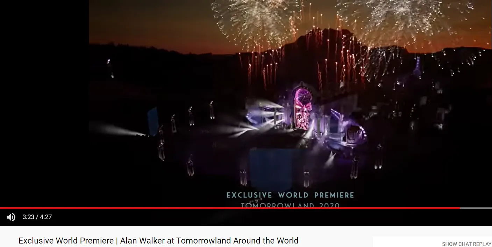
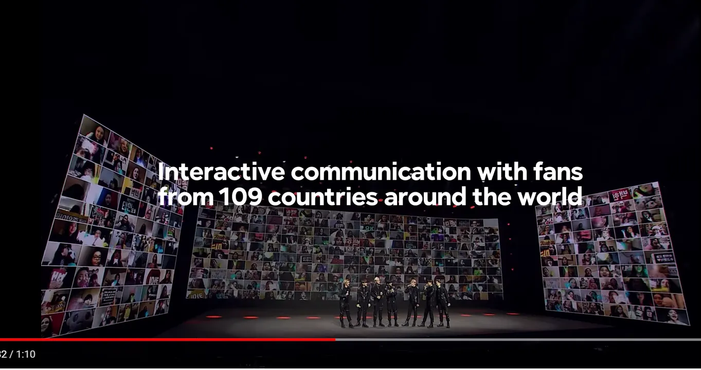

## Points à retenir

1. Les événements et groupes virtuels devraient viser à construire une communauté en augmentant les opportunités d’interaction\. Si vous n’êtes pas dans une communauté ou n’en créez pas une\, vous passez probablement à côté de quelque chose\.
2. Les newsletters sont en tendance grâce au coût\, à la commodité et au contrôle\. Je partage un modèle financier avec lequel vous pouvez vous amuser pour cadrer l’économie de l’entreprise
3. Les individus prennent de plus en plus d’importance pour l’investissement sur le marché privé\, à la fois en tant que capitalistes individuels et en tant que petits contrôles dans les syndicats

---

Je voyageais à Toronto pour le travail\.

Il y avait un restaurant que j’aimais visiter\, avec une excellente nourriture\, des boissons et un personnel excellent [^1]\. J’espérais à moitié devenir un habitué là\-bas\, goûter chaque plat du menu et échanger des conversations cocktail avec les barmans\.

Plus maintenant\.

J’organisais des soirées cocktails\.

J’invitais des invités chez moi pendant que je serais des boissons\. Parfois\, nous faisions même des cours de cocktail\. C’était devenu une activité durable et récurrente où je pouvais retrouver de vieux amis ou en faire de nouveaux\.

Plus maintenant\.

J’organisais des dîners de groupe mensuels\.

Nous choisissions un restaurant à Manhattan\, réservions un rendez\-vous des semaines à l’avance\, puis partagerions nourriture et histoires\. Les dîners de groupe sont super \; cela signifie plus de repas à goûter\.

[No more no more no more.](https://youtu.be/a8HoZlhenZ4?t=141 'Dr Who')

J’ai eu de la chance cette année\, tout bien considéré\. Je suis toujours en vie\, toujours en bonne santé\, j’ai toujours un travail\. Pas de pertes majeures\.

Et pourtant\, il y a ce sentiment de mauvais pressentiment _quelque chose_ a disparu\.

Je ne pense pas que ce soit le seul non plus\. Je vois de plus en plus de posts de gens qui se sentent apathiques ces derniers temps\. Ce pote de la salle à qui tu n’as jamais parlé mais qui vient toujours en même temps que toi\, le barman que tu pensais te draguer mais qui est juste amical\, ou l’ami avec qui tu es prêt à parler une fois par trimestre mais pas plus que ça \; il s’avère qu’ils ont tous contribué\, d’une certaine manière\, au sentiment de communauté que tu ressentais dans ta ville\.

Cela a disparu pour l’instant\, et les gens ont réagi différemment\. Certains cherchent une communauté via des voies virtuelles\, d’autres essaient de s’en passer\. Il n’a jamais été aussi facile de trouver d’autres personnes\, ni aussi d’être seul\.

Aujourd’hui\, je veux explorer ce thème\, **de la communauté et de l’individualité\,** sous plusieurs angles différents\. Nous examinerons d’abord les événements et groupes qui se sont adaptés à la communauté individuelle en quête\. Ensuite\, nous examinerons l’essor de l’individu dans les médias\, en particulier le secteur des newsletters\. Nous terminerons par un aperçu de l’individu en investissement\, en particulier des capital\-risqueurs individuels [^2]\.

### 1\. Les événements et groupes virtuels doivent viser à construire des communautés

Les événements et groupes virtuels ne sont pas nouveaux\. Cet article est de _2009_ Explique comment \:

> L’économie en difficulté\, qui a contraint de nombreuses entreprises à réduire leurs budgets de voyage\, ainsi qu’une attention accrue portée à l\'« écologie » — se sont réunies pour faire des salons virtuels une entreprise réaliste pour le secteur des conférences\.

Et la plupart d’entre nous connaissent bien [MSN messenger, ](https://www.hulldailymail.co.uk/news/hull-east-yorkshire-news/msn-messenger-logged-back-in-3393323 'msn') [online forums](https://www.makeuseof.com/tag/how-we-talk-online-a-history-of-online-forums-from-cavemen-days-to-the-present/ 'forum')\, et les réseaux sociaux aujourd’hui\, qui sont tous des moyens par lesquels les gens se sont trouvés en ligne\.

Bien que les idées principales ne soient pas nouvelles\, les progrès technologiques et les changements des normes sociales ont conduit à une meilleure exécution des concepts\. Voyons d’abord comment les événements se sont adaptés\, puis examinons les groupes\.

#### Événements virtuels en tant qu’activités interactives

Si vous êtes comme moi\, vos journées actuelles sont probablement un mélange de télétravail\, de dormir à la maison\, et de trouver quelque chose pour vous divertir à la maison sans revoir les 7 saisons de Buffy contre les vampires [^3]\.

J’ai assisté\, fait du bénévolat et animé de nombreux événements virtuels ces derniers mois\. La plupart ont été banals\, quelques\-uns ont été exceptionnels\. Voici mes moments forts \:

Beaucoup d’organisateurs d’événements semblent penser qu’il suffit de convertir toutes vos sessions d’événement en appel Zoom\. Envoyez par email un lien d’invitation au calendrier\, passez quelques minutes à « pouvez\-vous m’accorder des pouvoirs d’hôte pour que je puisse partager mon écran »\, et faire parler l’intervenant comme s’il s’agissait d’un événement en personne\. Cela fonctionne bien\, mais je trouve que c’est le strict minimum de ce à quoi nous pouvons nous attendre en 2020\.

Un élément simple et à grande valeur ajoutée aux événements est de **permettre des séances de questions\-réponses avec le public\.** C’est un moyen pratique d’augmenter l’interaction pendant votre événement et de le rendre plus efficace\. Cela signifie aussi qu’il y a une vraie différence entre assister à l’événement en direct et regarder une rediffusion\. La plupart des organisateurs l’ont déjà compris\, même si le temps alloué aux questions\-réponses peut encore être assez court\. Je recommanderais qu’environ la moitié du temps de votre intervention soit consacrée aux questions\-réponses\, surtout si le but est de créer une relation avec le public [^4]\.

Une autre valeur ajoutée est \: **incluez les documents présentés\.** Vous pouvez faire cela avant ou après la session\, selon que vous souhaitez avoir l’élément de surprise\. Beaucoup d’événements auxquels j’ai assisté m’envoient simplement des liens de rediffusion de la vidéo\. C’est bien\, et nous pouvons faire mieux\. Si je veux citer votre expertise plus tard\, il est plus pratique de lier vers du contenu statique plutôt que dynamique\, car cela prend plus de temps pour analyser le contenu vidéo\. Comme c’est essentiellement gratuit et facile à faire\, économisez du temps à votre audience en envoyant aussi les diapositives\.

Les autres idées que j’ai vues sont plus situationnelles\.

Si vous avez un petit groupe et souhaitez faciliter la connexion en tête\-à\-tête\, j’ai constaté [Icebreaker](https://icebreaker.video/ 'Icebreaker') Parfait pour ce cas\. Icebreaker rassemble tout le monde dans une salle principale\, avant de diviser les gens au hasard en discussions 1x1\. Les 1x1 ont aussi des consignes guidées\, au cas où les gens ne sauraient pas de quoi parler\. Après 5 minutes\, les discussions se terminent automatiquement et tout le monde est renvoyé dans la salle principale\. Vous pouvez répéter cela autant de fois que vous voulez\.

Si vous avez un grand groupe et que vous souhaitez toujours que les gens interagissent seuls\, vous voudrez peut\-être suivre ce que le [2020 Nebula Awards](https://events.sfwa.org/ 'SFWA') L’a fait\. Les Nebulas sont [one of the most prestigious Sci Fi awards,](https://en.wikipedia.org/wiki/Nebula_Award 'Nebula') Et cette année\, toute leur conférence a été organisée en ligne\. Ils ont organisé un nombre énorme de salles de groupes Zoom de différentes tailles\, à partir d’un seul lien\. Ils ont ensuite donné à chaque participant des pouvoirs de co\-animateur afin que les participants puissent se déplacer dans les salles de groupe et rejoindre ce qu’ils jugeaient intéressant\. En plus d’avoir une salle principale pour les conférenciers\, ils avaient des salles aléatoires comme un bar avec un barman enseignant des recettes\, une salle d’écriture\, et un live de chiots\. Ci\-dessous\, vous pouvez me voir dans une salle de discussion avec un célèbre auteur de science\-fiction [Lois Bujold](https://en.wikipedia.org/wiki/Lois_McMaster_Bujold 'Lois') \(J’ai ignoré les autres personnes pour garder ma vie privée\)\.

Une idée plus expérimentale sur laquelle j’ai eu des sentiments mitigés était [Online Town](https://theonline.town/ 'Online')\, que le [Long Now Foundation](https://longnow.org/seminars/ 'Long') Essayé après l’un de leurs séminaires\. Dans Online Town\, vous êtes représenté par un avatar à l’écran\, et vous pouvez vous déplacer dans une pièce comme dans la vraie vie\. Les conversations que vous pouvez écouter sont basées sur la proximité\, simulant davantage la réalité\. J’ai trouvé l’idée intéressante\, et elle nécessite une formation utilisateur bien plus élevée\, pour une expérience plus unique\.

Jusqu’à présent\, nous avons couvert des événements liés au « travail »\, mais les artistes se sont aussi adaptés virtuellement\.

Par exemple\, j’ai regardé un [Ellie Goulding live virtual concert recently.](https://inews.co.uk/culture/music/ellie-goulding-live-review-victoria-and-albert-museum-london-brightest-blue-613122 'Ellie') Elle le tint à la [Victoria and Albert Museum](https://www.vam.ac.uk/ 'VAM') à Londres\, en présentant un spectacle fantastique qui circulait dans le musée\. La qualité de production était impressionnante\, et le film a reçu d’excellents retours sur les réseaux sociaux\.

Un autre exemple est [Tomorrowland](https://www.tomorrowland.com/global/ 'TMR')\, le festival de DJ de premier plan\. Ils ont également élevé la qualité de la production\, [creating visual experiences](https://www.youtube.com/watch?v=BinQqIX3aig 'alan') que les spectateurs pouvaient apprécier en écoutant leurs DJs jouer leur set en live\. Je n’y suis pas allé\, mais une personne qui y est allée a dit qu’elle avait apprécié\.

Cependant\, je pense que nous pouvons faire encore mieux\. Le concert d’Ellie était excellent\, et Tomorrowland semble amusant\, mais les deux manquaient d’engagement auprès des fans [^5]\. Si vous organisez un événement en direct\, vous devriez en profiter au maximum\. Les expériences numériques simplifient la communication\, et je le recommanderais **Les événements de divertissement devraient viser l’interaction\, tout comme les événements « professionnels » mentionnés plus haut\.** Si tout ce que ton événement live a pour sa qualité\, c’est une grande qualité de production\, autant regarder la rediffusion à mon rythme\.

KT Tunstall en a été l’exemple dans [her live session with the Royal Albert Hall](https://www.youtube.com/watch?v=T_FHtCvpTOI 'KT')\. On peut voir la qualité de production inférieure comparée aux deux exemples ci\-dessus\, mais ce qui a vraiment fait la différence\, c’est le chat en direct\. Il a permis aux fans d’interagir à la fois entre eux et avec elle\, offrant une session intime et spéciale\. Le streaming en direct est devenu\.\.\. grand public\.

Si vous ne pensez pas que c’est durable à grande échelle\, alors jetez un œil à [what KPop groups such as Super Junior are doing.](https://www.youtube.com/watch?v=3H_MiOghwJw&fbclid=IwAR3nFY0s2ccu6tXA4dig9_e37jvNC3QGxCNOL9WE9E-DyJeRMrWtoMAQUIo 'Kpop') \(merci à Gabriel Tan\) Ils ont réimaginé l’expérience du concert\, et prévoient spécifiquement l’interaction des fans pendant le concert\. Il est tellement plus facile de faire sentir les fans spéciaux maintenant\, et les artistes devraient en tirer des leçons\. J’ai de plus en plus l’impression que les entreprises asiatiques sont à l’avant\-garde dans l’innovation sur les expériences consommateur\, et cela ressemble à une autre étude de cas pour les entreprises occidentales [^6]\.

Qu’est\-ce que cela signifie pour le marché des événements en présentiel \? [Rafat Ali of Skift believes that this is a watershed moment for the industry](https://skift.com/2020/08/26/the-event-industry-is-being-confronted-by-its-napster-moment/ 'Skift')\, tout comme Napster pour la musique\. Il pense que 10 \% des voyages d’affaires pourraient quitter définitivement le marché\, et estime également que les événements virtuels rapportent environ un quart des revenus des événements en présentiel\, donc le marché devra s’adapter à la nouvelle économie\.

Je suis moins pessimiste sur les événements en présentiel\, et je pense qu’ils reviendront une fois le covid passé\. La plupart des conférences d’affaires ont généralement été moins axées sur l’efficacité que sur le réseautage et le fait de retirer des vacances payées à son patron\. Cependant\, je vois les événements adopter un modèle hybride\, qui pourrait même être incrémental par rapport à leurs marges\. Vendez l’expérience en présentiel comme un luxe\, et l’expérience virtuelle comme un substitut économique\. Cela implique que savoir organiser de bons événements virtuels restera important pour l’avenir\.

En résumé\, les événements virtuels devraient viser plus d’interactions pour construire une communauté\. C’est encore plus facile à faire maintenant\, et cela aboutira à un public encore plus fanatique\.

#### Communautés virtuelles en tant que clubs sélectionnés

La construction de communauté a également pris de l’importance\, tant pour les particuliers que pour les entreprises\. Pour l’individu\, le réseautage a toujours été pertinent\, et les groupes virtuels en sont une extension\. Pour les entreprises\, une communauté engagée implique des clients fidèles\, réduisant les coûts de désabonnement et d’acquisition de clients \(CAC\) \; la version entreprise du [1,000 true fans for creators.](https://kk.org/thetechnium/1000-true-fans/ '1000')

Au niveau individuel\, le problème des communautés est **une question de sélectivité\.** Trop sélectif\, et vous n’avez pas assez de rencontres aléatoires\. Pas sélectif\, et vous trouvez tout sans importance\. Être membre d’une communauté est une forme de [signalling,](<https://en.wikipedia.org/wiki/Signalling_(economics)> 'signal') Et la force ou la faiblesse de ce signal dépend de la qualité de ton club\.

Par exemple\, vos contacts MSN étaient un groupe trop sélectif\, alors que les groupes Facebook ne le sont pas assez\. Les écoles de commerce reposent sur la valeur de marque impliquée par la sélectivité\. La modération légère de Reddit entraîne une certaine sélectivité\. En moyenne\, vous obtenez plus de valeur professionnelle de votre réseau scolaire comparé à votre groupe proche du brunch du dimanche\, ou plus d’information des fils Reddit comparé à votre [180,000 member Facebook group about genuinely stoked goats](https://www.facebook.com/genuinelystokedgoats/ 'goat') Tu ne te souviens même pas d’avoir rejoint [^7]\.

Nous voyons les communautés sélectionnées gagner en popularité dans le but de résoudre ce problème\. L’objectif de ces communautés est de trouver le point optimal sur la courbe pour équilibrer valeur et sélectivité\. Elles ont généralement une forme de processus d’admission pour sélectionner leurs membres\. Quand elles travaillent\, il y a une boucle de rétroaction où avoir des membres exceptionnels suscite plus d’intérêt pour la communauté\, ce qui entraîne plus de membres de qualité\. Surtout lorsque les communautés sont petites\, il y a une incitation pour que tout le monde fasse fonctionner les choses\, afin que vous puissiez être fier de votre adhésion\.

Voici quelques exemples de telles communautés \:

- [Renaissance Collective](https://www.renaissancecollective.co/for-smart-generalists 'Renco') qui est une communauté d’opérateurs qui sont des « généralistes intelligents »
- [On Deck](https://www.beondeck.com/ 'On Deck') c’est\-à\-dire « là où les meilleurs talents vont explorer la suite »
- [The Progress Studies slack group](https://patrickcollison.com/progress 'Progress') pour les personnes intéressées par « la science du progrès »
- [Soho House](https://www.sohohouse.com/about 'Soho') dont les membres sont des « personnes partageant les mêmes idées et avec une âme créative »
- [The Interintellect](https://www.interintellect.com/ 'inter') qui est « construire une nouvelle manière d’être un intellectuel prolifique et prospère au XXIe siècle »

Au niveau de l’entreprise\, **Construire une communauté\, c’est un peu comme posséder son audience\,** Un sujet auquel nous reviendrons plus tard lors de la discussion des newsletters et des médias\. Il est généralement plus coûteux d’acquérir un nouveau client que de vendre à un client existant\, donc construire une base de fans plus fidèle influence directement la croissance de l’entreprise\. [Gavin Baker elaborates on loyalty here](https://medium.com/@gavin_baker/scale-and-loyalty-are-more-important-online-than-offline-which-drives-much-of-the-winner-take-992345be93a9 'Loyalty')\, et la principale leçon est que l’évitement des coûts d’acquisition de clients grâce à la fidélité donne à votre entreprise un avantage concurrentiel\.

Un secteur qui comprend bien cela est le marché du jeu vidéo\. Regardez comment les entreprises derrière Minecraft\, Fortnite ou Roblox ont sécurisé leurs clients cibles\. [Minecraft has 126mm monthly active users](https://www.theverge.com/2020/5/18/21262045/minecraft-sales-monthly-players-statistics-youtube 'Minecraft')\. [Fortnite is still breaking attendance records for its in game concerts](https://www.gamesradar.com/how-many-people-play-fortnite/ 'Fortnite')\. [Roblox makes >$1bn in rev and is played by half of all children in the US](https://www.thegamer.com/roblox-played-by-most-american-kids/ 'Roblox')\. Dans beaucoup de ces jeux\, les gens s’y rendent parce que leurs amis y sont\. Ce sont les nouveaux MSN de 2020 [^8]\.

En dehors de la valeur et de la sélectivité\, le dernier facteur auquel je penserais pour les groupes virtuels est **Potentiel de croissance\.** La croissance se fait généralement au détriment de la sélectivité \; à mesure que le groupe grandit\, la valeur ajoutée par le membre suivant est en moyenne plus faible\.

Il existe des solutions à cela\, comme faire des promotions de groupes de temps en temps\. C’est le modèle que les universités\, les accélérateurs de startups ou les communautés de cours en ligne adoptent\. Une autre option est d’avoir un nombre fixe de places\, et d’admettre de nouveaux joueurs seulement une fois qu’un autre part\. Pour les groupes censés être intemporels\, comme RenCo ou The Interintellect\, il sera intéressant de voir comment ils gèrent la croissance par rapport à d’autres facteurs concurrents\.

En résumé\, les groupes ont toujours été et seront puissants\, même si leur organisation change avec le temps\. Si vous ne construisez pas déjà ou ne faites pas partie d’une communauté\, il vaut la peine d’explorer ce qui existe\. Si vous souhaitez construire une communauté et ne savez pas par où commencer\, [there's also a community for that.](https://www.community.club/ 'club')

De plus\, pour mettre là où je me mets la parole\, j’envisage de créer une communauté pour Éviter les gens ennuyés – j’enverrai un sondage le mois prochain\, mais en attendant\, faites\-moi savoir si cela vous intéresse en répondant à cet email\.

### 2\. Les newsletters peuvent être des petites entreprises durables et lucratives\, mais difficiles à développer

Dans le monde du contenu\, les individus choisissent l’opportunité d’influencer et de gagner leurs revenus par eux\-mêmes\. En devenant indépendants\, ils renoncent à une certaine stabilité et au soutien de la plateforme\, en échange d’une récompense et d’une responsabilité accrues\. Je souhaite me concentrer aujourd’hui sur l’industrie des newsletters par email gérées par des particuliers\, même si cette tendance n’est pas unique – YouTube\, Twitch\, TikTok\, Tencent Video\, OnlyFans sont tous des exemples de réussite individuelle aujourd’hui par [unbundling the value of their personal content.](https://hbr.org/2014/06/how-to-succeed-in-business-by-bundling-and-unbundling 'bundle')

Voyons \:

- Qu’est\-ce qui alimente la tendance à la création de newsletters
- Quel pourrait être le modèle économique et l’économie pour une newsletter à grande échelle
- À quoi pourrait ressembler l’avenir des médias

#### Des newsletters axées sur le coût\, la commodité et le contrôle

Li Jin a écrit sur l’économie de la passion [here](https://li-jin.co/2019/10/22/the-passion-economy-and-the-future-of-work/ 'Li Jin')\, proposant que \:

> Alors qu’auparavant\, les plus grandes places de marché du travail en ligne aplatissaient l’individualité des employés\, les nouvelles plateformes permettent à chacun de monétiser des compétences uniques\. Le travail à petits boulots ne disparaîtra pas — mais il existe désormais davantage de façons de tirer parti de la créativité\. Les utilisateurs peuvent désormais construire des audiences à grande échelle et transformer leurs passions en moyens de subsistance\, que ce soit en jouant aux jeux vidéo ou en produisant du contenu vidéo\. Cela a d’énormes implications pour l’entrepreneuriat et ce que nous considérerons comme un « emploi » à l’avenir\.

Tous les modèles économiques peuvent être simplifiés comme suit \:

1. Trouver des gens
2. Vends\-leur des trucs [^9]

Quand il est coûteux pour une seule entreprise de faire l’un ou l’autre\, des entreprises viennent combler le vide\. Appelez ces agrégateurs\, plateformes\, intermédiaires\, groupeurs\, distributeurs\, peu importe\. Ce qu’ils font\, c’est reconnaître qu’il faut répartir un coût fixe important sur une large clientèle\.

**Internet a considérablement réduit le coût de ces deux tâches\,** Et il semble probable qu’il continue à le faire\. Il est possible pour quelqu’un de trouver des clients et de traiter ses commandes tout en maintenant une base de coûts fixe faible\. Abaisser la barrière à l’entrée de façon tautologique signifie que vous obtenez plus d’entrants\. Un levier accru pour tous\.

En prenant les newsletters comme exemple\, il est plus facile d’attirer des lecteurs aujourd’hui qu’il y a 20 ans\. Je reçois des emails aléatoires de lecteurs de personnes dans des lieux et des situations de vie que je n’aurais jamais imaginés \(continuez à les envoyer \!\)\, encore moins à commencer à cibler mes efforts marketing\. Et quand je veux envoyer un numéro de newsletter\, je paie aussi des frais bien plus bas que si tout était imprimé\.

En plus d’une diminution des coûts\, un **Augmentation de la commodité** a aussi favorisé la tendance des newsletters\. Je peux me tromper\, mais j’ai l’impression que l’essor des newsletters a commencé à s’accélérer après [substack announced their funding round.](https://techcrunch.com/2019/07/16/substack-series-a/ 'substack') Ce que Substack a fait\, c’est rendre le démarrage beaucoup plus facile\, comme je l’ai expliqué dans un [older post](/writing/substack 'substack')\. En se préoccupant moins de ce qu’un [cname record](https://support.dnsimple.com/articles/differences-a-cname-records/ 'cname') Et au lieu de pouvoir commencer à écrire immédiatement\, Substack a incité beaucoup de gens à l’essayer\.

Une autre chose importante que permettent les newsletters est **Contrôle accru de votre audience**\; [a direct relationship with readers.](https://www.protocol.com/substack-ceo-newsletter-obsession 'substack') Pour l’instant\, l’email est toujours dans cette zone idéale où les gens ouvrent et vérifient ce qu’ils reçoivent\. Comparez cela au courrier postal\, où la moitié du temps je reçois une publicité pour vendre l’appartement que je loue\, ou sur n’importe quelle plateforme de contenu basée sur des fils d’actualité\, où la moitié du temps je vois quelque chose censé être populaire mais qui ne m’intéresse pas\. Posséder une audience vous donne votre propre communauté à protéger\.

Un point nuancé à ce qui précède\. J’ai dit que le coût d’acquisition d’une audience était faible\, et que la commodité d’envoyer une newsletter était élevée\. Cependant\, il n’est pas pratique d’acquérir une audience\. Construire une base de lectorat demande du travail\, [unless you're Bella Thorne and trying to scam sex workers.](https://reddit.com/r/ChoosingBeggars/comments/ikotvd/can_celebs_be_choosing_beggars_edited_for_sub/ 'Bella') Certains créateurs passent plus de la moitié de leur temps à promouvoir leur travail plutôt qu’à créer du contenu réellement\. Cette friction accrue – vous devez obtenir un lecteur\, et un lecteur doit vous envoyer son email – est ce qui renforce réellement le sentiment de relation\. Je me suis inscrit à ce projet\, donc il faut que ce soit bon et je devrais le lire\. Puisque vous avez d’avance vos coûts d’acquisition client \(et vos efforts\)\, vendre à ce groupe devient beaucoup plus facile à long terme\.

#### Les newsletters individuelles à grande échelle semblent probablement être des entreprises à 300 000 \$

Divisons le monde du contenu en 3 types principaux\, puisque je ne me souviens pas de plus de 3 choses à la fois \:

1. Pour divertir
2. Éduquer
3. Susciter l’émotion

Si vous êtes rédacteur de newsletters\, vous visez votre propre mélange unique des trois\. L’endroit où vous vous retrouvez influence votre prix\. [Byrne Hobart has written about newsletter pricing before](https://diff.substack.com/p/whats-next-for-the-diff 'Diff')\, et tout se résume à \: **Est\-ce quelque chose que vous pouvez et voudriez dépenser sur une carte d’entreprise \?**

Si la newsletter peut m’apprendre à être meilleur dans mon travail et à gagner plus [^10]\, tu peux augmenter les prix\. Si c’est plus pour le divertissement personnel ou l’émotion\, c’est plus difficile\. Je pourrais essayer\, mais c’est presque impossible pour moi de te faire ressentir la même chose après avoir lu mes écrits vs [after watching Arrival.](https://www.reddit.com/r/movies/comments/8z720w/movies_that_destroy_you_emotionally/ 'Arrival')

Quel est un plafond raisonnable à ce qu’une newsletter peut rapporter \? [This post by Andreas Stegmann](https://medium.com/hyperlinked/ben-thompsons-stratechery-should-be-crossing-3-million-in-profits-this-year-c146433f0458 'andreas') estime que Ben Thompson de [Stratechery](https://stratechery.com/ 'Strat') Ça rapporte environ 3 mm \$ par an\. Faute de meilleures informations\, je vais utiliser cela comme limite supérieure de ce que font les meilleures newsletters de la catégorie [^11]\.

Ça semble beaucoup\, mais réfléchissez\-y encore\. Être parmi les meilleurs au monde ne vous fait que vous mettre dans la fourchette du million de dollars\. [Compare this to being the best in the world at a sport](https://www.forbes.com/athletes/#2c6842d155ae 'Forbes')\, où les meilleurs athlètes gagnent \~100 millions de dollars par an\. Ou être les meilleurs au monde pour gérer une entreprise\, où vos gains se comptent en milliards\. Si vous voulez le plus grand potentiel possible\, écrire une newsletter n’est pas la bonne voie\.

Cependant\, si vous êtes d’accord pour gérer une petite entreprise\, la rédaction de newsletters peut être une option fiable\. **J’ai créé un modèle financier de newsletter sur 5 ans [here](https://docs.google.com/spreadsheets/d/1QS2lKHhDDCe5vwHiJPd7QpDjQRxJ3mHl4VgCq6e8Q6M/edit?usp=sharing 'model')** Que vous pouvez expérimenter pour voir à quoi pourrait ressembler l’économie\. Si c’est le cas\, merci de faire une copie\, et ne tentez pas de modifier l’original\. H\/t à [Jacob Donnelly](https://www.amediaoperator.com/ 'Jacob') et [Josh Constine](https://constine.substack.com/ 'Josh') pour des contributions sur le modèle\.

Le modèle est très sensible aux hypothèses\, qui sont listées dans la fiche et je vais brièvement aborder dans cette note de bas de page [^12]\. Il suppose actuellement un modèle économique d’abonnement plus publicités\, mais vous pouvez changer cela\. Cela implique qu’obtenir une valorisation de 300 000 \$ en 5 ans est difficile mais raisonnable\, ce qui pourrait être un objectif pour les créateurs de newsletters\.

Bien sûr\, il y aura des créateurs exceptionnels qui gagnent \> 100 000 \$ par an\, mais cela nécessite des hypothèses plus agressives dans le modèle que vous pouvez ajuster\. 100 000 \$ par an correspond [1000 true fans](https://kk.org/thetechnium/1000-true-fans/ '1000') Payer 100 \$ par an\, avec des taux de conversion 5\-10 \% gratuits à payants\, signifie qu’il faut environ 10 à 20 000 abonnés gratuits\. C’est faisable mais difficile\.

#### Les newsletters n’offrent peut\-être pas beaucoup d’options de sortie

Un fil de discussion Reddit récent en a parlé [how huge a star Michael Jackson was, and how we don't see celebrities like that anymore](https://www.reddit.com/r/todayilearned/comments/ikuuhu/til_michael_jacksons_super_bowl_half_time_show/ 'MJ')\. La déflation des coûts d’Internet a fragmenté le monde du contenu\, permettant un nombre inimaginable de nouveaux créateurs\. Il y a moins de concentration et plus de diversification\. Et ensuite \?

Une prédiction facile est celle de l’industrie de soutien pour tout ce contenu\. Pour les newsletters\, consultez [paid courses](https://www.journalism.cuny.edu/centers/tow-knight-center-entrepreneurial-journalism/entrepreneurial-journalism-creators-program/ 'paid')\, [support groups](https://www.indiehackers.com/group/newsletter-crew 'support')\, et plus de personnes conseillant comment commencer\.

Une autre prédiction simple est celle de créateurs individuels qui regroupent des groupes\. Pour les newsletters\, [Nathan Baschez and Dan Shipper put together the Everything Substack bundle](https://everything.substack.com/ 'Everything')\, et il est économiquement logique que d’autres suivent le mouvement\. Vous ne pouvez pas seulement regrouper des newsletters\, mais aussi d’autres types de médias comme les podcasts ou le conseil\.

Je pense aussi que beaucoup de créateurs construiront une communauté\, comme je l’ai mentionné dans la section 1\. Ce sera plus difficile pour les newsletters\, car le taux de chute de l’email vers un autre service comme Slack est énorme\. Ils devront aussi faire face aux mêmes problèmes de croissance vs qualité et devront déterminer leurs priorités\.

Je ne suis pas sûr des opportunités de sortie pour les newsletters\. Entrer en bourse est hors de portée pour la plupart\, voire tous\, compte tenu de leur taille\. Cela implique des acquisitions et un regroupement plus important est la voie à suivre\. Cependant\, conserver l’auteur est un défi\, et la majeure partie de la valeur appartient probablement à l’auteur\. Compte tenu du risque\, les multiples de transactions sont probablement faibles [^13]\. Si vous recherchez de l’option\, une grande sortie est moins susceptible d’être un paiement rémunéré\, comparé au conseil ou à d’autres opportunités qui résultent de votre écriture\.

### 3\. L’essor de l’individu dans l’investissement

[Nikhil Basu Trivedi did a post about solo capitalists recently.](https://nbt.substack.com/p/the-rise-of-the-solo-capitalists 'NBT') Étant donné que [SEC news about relaxing accredited investor rules](https://www.sec.gov/news/press-release/2020-191 'SEC')\, je voulais brièvement revenir sur l’importance croissante des individus dans l’investissement\.

Nikhil souligne \:

> Les investisseurs providentiels sont depuis longtemps des membres très importants de l’écosystème de la collecte de fonds\. Mais ces dernières années\, on observe une augmentation du nombre d’investisseurs non seulement aux premiers stades des entreprises\, mais aussi en Série A et au\-delà\. Ces personnes n’investissent pas seulement leur propre capital\, elles lèvent des fonds dédiés\, ne participent pas seulement aux côtés de sociétés de capital\-risque et sont souvent en concurrence avec les investisseurs\, et voient des fondateurs qui choisissent de travailler avec eux plutôt qu’avec les capital\-risqueurs

Puisque l’individu peut prendre des décisions plus rapides\, et qu’il est potentiellement plus flexible et ciblé qu’une société de capital\-risque\, il y a une opportunité d’offrir un capital moins cher ou plus pratique aux fondateurs\. Étant donné à quel point le capital est bon marché aujourd’hui et que tout le monde sauf moi semble gagner des énormés\, il n’est pas surprenant que de plus en plus de personnes veuillent plus de levier dans ce domaine\.

Une société de capital\-risque est aussi un paquet\. Si vous êtes fondateur et que vous choisissez d’en travailler à cause de l’expérience ou du réseau d’une personne célèbre là\-bas\, vous êtes probablement indifférent à obtenir votre capital directement de cette personne ou auprès de la société de capital\-risque [^14]\. À un moment donné\, cette personne pourrait réaliser qu’elle peut en gagner davantage en dégroupant sa propre valeur de l’entreprise et en la proposant comme un produit distinct\. Le lancement de [rolling funds by angellist](https://angel.co/blog/rolling-venture-fund-launch 'rolling') cela leur facilite encore la tâche de se lancer par eux\-mêmes\.

Le cas négatif est que nous avons déjà vu cela se produire sur les marchés publics\, et de nombreux investisseurs célèbres qui ont tenté de le faire par eux\-mêmes ont échoué\. [Bill Gross leaving PIMCO for Janus](https://en.wikipedia.org/wiki/Bill_H._Gross 'Janus') est un exemple\, et il y en a probablement autant [Tiger Cubs](https://en.wikipedia.org/wiki/Tiger_Management 'Tiger') qui se sont transformés en family offices en tant que Tiger Cubs cherchant à lever un nouveau fonds\. Comme pour tout\, le levier fonctionne dans les deux sens\, et on obtient un risque élevé avec un gain espéré attendu élevé\.

Je me demande aussi si le modèle du capitaliste solo peut évoluer\. Ce sont des investisseurs sur les marchés privés\, généralement du côté de la Série A plus ancienne\. Supposons qu’un capitaliste solo ait beaucoup de succès et obtienne dix fois le capital qu’il possède actuellement\. Que fait\-il avec cela \? Passe\-t\-il vers des entreprises de stade avancée \? S’il ne le fait pas\, dans combien d’entreprises peuvent\-ils déployer du capital étant donné qu’une seule d’entre elles gère tout \?

En passant des riches à l’investissement de personnes riches à ceux qui cherchent à devenir riches en investissant\, les nouvelles règles de la SEC devraient permettre un grand nombre d’investisseurs providentiels à petits chèques\. [Charles Rubenfeld pointed out that the Series 65 qualifies you to angel invest](https://twitter.com/Crubenfeld/status/1298666723806257161?s=20 'angel')\, et peut être prise même si vous n’avez pas d’institution financière sponsor\. Étant donné que l’investissement providentiel est à moitié un signalement de statut\, l’assouplissement des règles a probablement conduit à l’essor de nombreux syndicats d’anges et à des capitaux encore moins chers pour les fondateurs\.

Je soutiens la détente\, venant de l’état d’esprit que les gens sont libres de perdre leur argent comme ils veulent\. Il peut y avoir à la fois des avantages sociaux et financiers à investir dans des entreprises en phase de démarrage\. Plus d’accès est donc probablement une bonne chose\. Tant que tous les investisseurs connaissent les risques et que suffisamment d’informations sont divulguées\, je suis pour que les gens aient plus d’options pour placer leur argent\.

## Autres

1. [Math and physics guide to animation](http://acko.net/blog/animate-your-way-to-glory/ 'Acko')\, l’une de mes meilleures lectures cette année
2. [Reining in the Banking as a Service Euphoria](https://medium.com/@nikilkonduru/reining-in-the-baas-euphoria-1cc90469bcc4 'Baas')
3. [Revenue breakdown of big tech companies](https://www.visualcapitalist.com/how-big-tech-makes-their-billions-2020/ 'Tech')\. Merci à Jing Yong de m’avoir fait découvrir le site Visual Capitalist
4. ["It’s impossible to delete and control all of \[your data,\] logs are a liability, and they’re growing exponentially.](https://vicki.substack.com/p/the-data-lake-overfloweth 'vicki')
5. [Introduction to knot theory using rational tangles](https://www.mathteacherscircle.org/assets/session-materials/JTantonRationalTangles.pdf 'Knot')\. Les maths requises ne sont pas difficiles\, mais il faut du travail pour comprendre les concepts\.

[^1]: [Aloette](https://aloetterestaurant.com/ 'Aloette') pour les curieux\.

[^2]: Pour être clair\, je ne soutiens pas que le Covid _causé_ Ces tendances\. Cela a peut\-être accéléré certains\, sans effet sur d’autres\. J’essaie plutôt d’explorer le thème général de la communauté sous différentes interprétations

[^3]: Ayant vu ce film pour la première fois\, je suis surpris de voir combien de ses excellents épisodes tiennent encore la route\. Aussi\, la relation Spike\/Buffy est vraiment inquiétante dans les deux sens\, mec\.

[^4]: Avoir des questions\-réponses signifie que vous devrez être plus efficace en modération\, ce qui n’est pas si grave la plupart du temps\.

[^5]: C’était la principale raison pour laquelle je n’ai pas pris de billet pour Tomorrowland\, car je ne voyais pas personnellement la valeur ajoutée\.

[^6]: Par exemple\, le pourboire ou l’abonnement à des streamers en direct a constitué un grand marché pour les streamers chinois\, et a ensuite décollé pour les streamers occidentaux

[^7]: Notez que je ne dis pas que vos amitiés personnelles n’ont aucune valeur \; ceci est plutôt d’un point de vue « professionnel »\.

[^8]: Je n’ai pas encore lu ni l’un ni l’autre\, mais il existe un article détaillé de Matthew Ball sur le jeu vidéo [here](https://www.matthewball.vc/all/digitalthemeparkplatforms 'ball') et un Jon Lai [here](https://a16z.com/2020/09/01/tabletop-games-go-digital/ 'Jon')

[^9]: Idéalement avec un profit\, même si vendre des choses à moins de leur valeur semble être la mode de nos jours\. On compense avec le volume\, je suppose\.\.\.

[^10]: J’ai pensé à mettre « gagner » comme quatrième facteur\, mais je vais le regrouper dans la catégorie plus large de l’éducation pour conserver la Trinité E complète\.

[^11]: H\/t [Lenny Rachitsky](https://www.lennyrachitsky.com/ 'Lenny') pour l’article\. On pourrait soutenir qu’il existe de nombreuses entreprises qui sont équivalentes à des newsletters et qui gagnent bien plus que cela\. Par exemple\, si vous considérez la recherche sur les actions comme une newsletter coûteuse\, la taille du marché est importante\. Je me limite à des newsletters plus individuelles pour la plupart de mes analyses\, pour simplifier\.

[^12]: Le plus gros problème du modèle est qu’il ne dure que 5 ans\, puis qu’il prend une valeur terminale après cela\. Si vous avez déjà fait de la modélisation financière\, vous savez que ce n’est pas une bonne idée\, car le taux de croissance de l’année 5 et terminal seront très différents\. Le problème suivant est l’hypothèse de valeur terminale\. Le multiple d’évaluation implicite que j’obtiens en supposant des taux de croissance terminale raisonnables et un coût des capitaux propres est beaucoup trop élevé\, compte tenu de multiples d’acquisition réels de 3 à 5 fois l’EBITDA\. Le modèle propose deux cas que vous pouvez basculer \: l’un qui suppose que vous monétisez immédiatement et que vous subissez une baisse de croissance\, et l’autre où vous monétissez après avoir pris de l’avance\. N’hésitez pas à vérifier le modèle et à me faire savoir si vous évenez des erreurs

[^13]: Merci à Nathan d’avoir abordé ce sujet dans un [Highlighter call](https://blog.highlighter.com/ 'highlighter')

[^14]: C’est une grande généralisation\, et bien sûr il existe de nombreux autres avantages qu’une société de capital\-risque peut offrir par rapport à un individu\.
