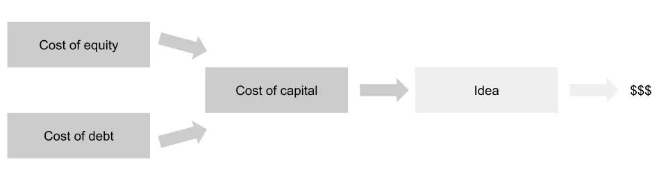

## À retenir

La réduction du coût du capital implique désormais un transfert de richesse des épargnants vers les emprunteurs\, et qu’il est optimal pour une personne de prendre plus de risques aujourd’hui qu’auparavant\.

## Implications du faible coût du capital

Je veux jeter un œil à **Coût du capital** Aujourd’hui\. Je me demandais quelles seraient les implications de notre environnement actuel à faible coût\, en plus [Michael Pettis](https://carnegieendowment.org/chinafinancialmarkets/82610 'Pettis') J’ai récemment écrit un bon article sur les taux d’intérêt versus la croissance\, alors examinons ce sujet de plus près\. Je n’aurai pas toutes les réponses non plus\, donc les commentaires sont les bienvenus\, répondez directement ou dans la boîte de commentaires du post\.

Pour ceux qui ne savent pas quel est le coût du capital\, ne vous inquiétez pas\. Je vais fournir une brève explication du concept\, avant de faire les points suivants \:

1. Le coût du capital est aujourd’hui inférieur à celui qu’il y avait auparavant
2. En conséquence\, il y a un transfert de richesse des épargnants vers les emprunteurs
3. Cela implique également qu’il faut prendre plus de risques

### Le coût du capital est le coût combiné du financement de votre idée

Imaginez que vous aviez une idée\. Cela pourrait être une nouvelle idée d’entreprise\, un plan d’expansion\, ou même un investissement auquel vous pensiez\. Tout ce qui compte\, c’est que cela nécessite de l’argent \(du capital\)\, et qu’il vous semble vous rapporter plus d’argent que ce que vous avez mis\.

Comment obtenir cet argent \? Il existe deux principales sources de capital \: la dette et les capitaux propres [^1]\.

Lorsque vous recevez de l’argent liquide en échange de dettes\, vous acceptez de rembourser une partie de la dette au fil du temps\. Nous pouvons calculer un coût de cela\, en fonction du taux final de rendement\. Par exemple\, si vous avez payé 10 \$ sur 100 \$\, cela représente un coût de 10 \% [^2]\.

Quand vous recevez de l’argent liquide en échange de capitaux propres\, vous n’êtes pas obligé de rembourser en espèces\, mais vous renoncez à la propriété\. Le montant que vous cédez dépend du rendement attendu des investisseurs\. Nous pouvons calculer un coût implicite de cela\. Par exemple\, si un investisseur a versé de l’argent en espérant un rendement de 20 \%\, cela représente un coût de 20 \% [^3]\.

Les coûts combinés de ces deux principales sources de capital se combinent pour vous donner votre coût du capital\. C’est le coût moyen que vous encourrez en essayant cette idée\. Par exemple\, si votre coût du capital est de 5 \%\, vous « perdez » 5 \% chaque année\.

Il en découle aussi que vous souhaitez gagner plus que votre coût du capital\. Si vous perdez 5 \% par an\, vous devez gagner plus de 5 \% pour obtenir un rendement positif\. Si votre entreprise rapporte 1 \% par an alors qu’elle coûte 5 \%\, vous perdez de l’argent au fil du temps\.

C’était une explication simplifiée\, mais elle devrait fournir suffisamment d’intuition pour le reste de l’article\. Si vous souhaitez en savoir plus\, le roi de l’évaluation\, le professeur Damodaran de NYU\, [has a paper explaining this in detail](http://people.stern.nyu.edu/adamodar/pdfiles/papers/costofcapital.pdf 'Cost')\, qui inclut des graphiques comme ceux ci\-dessous qui étendent rigoureusement le cadre que nous avons évoqué ci\-dessus\.

Autrement dit \: nous voulons faire de l’argent\. Nous avons besoin d’argent\. Cet argent a un coût\, qui est le coût du capital\.

### 1\. Le coût du capital est actuellement plus bas

Tout d’abord\, établissons l’argument qu’il est moins coûteux d’obtenir de l’argent aujourd’hui qu’auparavant\. Pour ce faire\, nous allons examiner quelques graphiques sur le temps des taux\.

Voici les 10 dernières années du rendement TIPS à 10 ans\, [pulled from the Fed](https://fred.stlouisfed.org/series/DFII10 'Fed') [^4]\. Pour ceux qui ne connaissent pas les TIPS\, ce sont un [inflation linked, "safe" type of debt](https://www.investopedia.com/terms/t/tips.asp 'tips')\. Comme nous pouvons le constater\, les rendements sont actuellement négatifs\, ayant une tendance à la baisse au fil du temps\.

Voici les 10 dernières années du coût hypothécaire à taux fixe sur 30 ans\, [also pulled from the Fed](https://fred.stlouisfed.org/graph/?g=NUh 'Fed') [^5]\. On peut voir que le coût de l’emprunt pour une maison a également baissé\.

Et si vous pensez que je trie en ne regardant que les 10 ans\, revenons aux 54 dernières années et regardons le taux des bons du Trésor à 10 ans\. Vous pouvez déjà voir la hausse des taux [Volcker killed inflation](https://en.wikipedia.org/wiki/Paul_Volcker 'Volcker')\, et la tendance baissière continue depuis\.

À ce stade\, je pense que nous avons montré le coût de **Dette** a diminué\. Qu’en est\-il du coût des actions \?

J’ai eu plus de mal à trouver le coût moyen des capitaux propres\, mais nous savons que le coût des capitaux propres est lié au coût de la dette\, ainsi qu’à un rendement supplémentaire pour le risque associé aux capitaux propres [^6]\. Nous avons montré que le coût de la dette a diminué\, donc si nous pouvons trouver la tendance du rendement additionnel \(la prime de risque des actions\)\, nous comprendrons mieux cette évolution\.

[Damodaran has a table in pg 142 of this report](https://poseidon01.ssrn.com/delivery.php?ID=425124115112025116020118020011112064052051040011030092064114074119081098025103109118097012061055040113125093125106096026106103051022049037045010068078022028103006044010102031118000094024104112069074071073106074113116005029084117013074087122064008&EXT=pdf 'Damodaran') montrant une légère augmentation de la prime de risque au fil du temps\. Pour une version plus visuelle\, [KPMG has the numbers below.](https://assets.kpmg/content/dam/kpmg/nl/pdf/2020/services/equitiy-market-risk-premium-research-summary-march-2020.pdf 'KPMG') Elles ne s’attachent pas exactement\, mais elles sont relativement cohérentes\.

Il y a eu une légère augmentation ces derniers mois\, mais les primes globales de risque des actions n’ont pas autant augmenté que le coût de la dette a diminué\. Cela implique qu’au total\, le coût de **Équité** est soit resté stable\, soit a décliné\.

D’après ce qui précède\, nous avons montré que le coût du capital a diminué\. Cela implique que lever des fonds maintenant\, que ce soit par dette ou par actions\, est moins cher qu’auparavant\.

### 2\. Une baisse du coût du capital implique des transferts de patrimoine des épargnants vers les emprunteurs

Introduisons une complication\. Nous avons dit plus haut qu’une entreprise devrait viser à croître au\-delà de ses coûts\. Des gens ont étendu ce concept aux pays\, affirmant que la dette est durable lorsque le taux de croissance du PIB \(rendement\) est supérieur au taux d’intérêt \(coût du capital\)\. Pour ce faire\, ils citent souvent les travaux du célèbre économiste Thomas Piketty\, [Capital in the Twenty-First Century](https://en.wikipedia.org/wiki/Capital_in_the_Twenty-First_Century 'Capital')\.

[Michael Pettis argues here](https://carnegieendowment.org/chinafinancialmarkets/82610 'int') que l’extension du cadre aux pays n’a pas de sens\. Au lieu de ça \:

> Au niveau macroéconomique\, la relation entre les taux d’intérêt et le PIB révèle bien plus les transferts de revenus et la répartition des revenus au sein d’une économie que la viabilité globale de la dette de cette économie\. À cet égard\, les conditions fonctionnent très différemment pour les pays que pour les individus ou les entreprises

Décomposons ce qu’il veut dire\, puisque ce n’est pas immédiatement évident\. Pettis dit qu’une implication du fait que les coûts soient inférieurs à la croissance est que **L’économie déplace l’argent des personnes qui fournissent du capital vers celles qui l’empruntent\.**

Si vous aviez de l’argent et que vous le prêtiez\, vous le prêtiez au coût du marché\. Si vous l’avez investi dans l’économie globale\, vous obtenez une croissance du marché\. Si ce coût est inférieur à la croissance moyenne \(taux de rendement\)\, vous avez obtenu un actif à rendement inférieur comparé à celui à rendement plus élevé auparavant\. Inversement\, si le coût est supérieur au taux de croissance\.

Cela a des implications différentes sur la croissance future ainsi que sur les inégalités de richesse\. Les riches épargnent davantage\, donc des coûts réduits entraînent un transfert de richesse des riches vers les pauvres\. Cela est compensé par une spéculation accrue sur les actifs\, qui déplace la richesse dans l’autre sens\. L’effet net de cela dépend de la taille relative de chacun\. Pettis ne fait pas ce point\, mais **Je crois que la partie spéculative a largement compensé le premier effet\, et c’est une cause de l’augmentation des inégalités de richesse\.**

### 3\. Une baisse du coût du capital implique qu’une prise de risques accrue devrait avoir lieu

C’est là que je deviens plus spéculatif\. Un coût du capital par rapport à la croissance réduit implique aussi que **La tolérance au risque de chacun devrait augmenter\.** Si le coût d’opportunité est plus faible\, le niveau optimal de risque à prendre est plus élevé\. Par exemple\, si cela vous coûtait 5 \% par an d’emprunter de l’argent pour votre entreprise\, et que maintenant cela vous coûte 1 \%\, vous devriez emprunter davantage et créer plus d’entreprises\.

Les données réelles sont plus bruyantes\. Le [Fed data on business applications](https://fred.stlouisfed.org/series/BUSAPPSAUS 'Biz') Cela semble valider mon hypothèse [^7]\, mais j’ai aussi lu [that the quality of businesses has declined](https://www.census.gov/newsroom/blogs/research-matters/2018/02/bfs.html 'decline')\. Basé sur la [inflation of valuations for private companies trying to raise money](https://news.crunchbase.com/news/its-not-just-you-seed-rounds-are-actually-getting-bigger/ 'inflatoin')\, je pense toujours que plus de gens prennent des risques à moindre coût\, mais dites\-moi si vous n’êtes pas d’accord\.

Une tolérance accrue au risque implique également **Plus de spéculations sur des actifs investissables\.** Je pense que c’est une des raisons pour lesquelles nous avons continué à voir le prix des actions publiques augmenter\, alors que les gens recherchent le rendement et font monter davantage le marché boursier\.

Puisque tous les actifs sont liés\, cette tendance ne se limite pas non plus aux actions publiques\. Toutes les classes d’actifs devraient voir les prix augmenter et les rendements baisser\, à mesure que les coûts diminuent\. Nous devrions voir davantage de fonds providentiels\, d’investissements en capital\-risque ou de rachats en capital\-investissement\. Les actualités semblent le confirmer\.

Ça a l’air super\, après tout le monde aime que les choses montent\. Je peux penser à au moins deux réserves\, et j’essaie encore d’en trouver davantage\.

La première est qu’une tolérance accrue au risque s’accompagne du compromis de **Encore de la fraude\.** Si tout le monde peut lever des fonds\, les risques d’arnaques devraient augmenter\. Quand les gens voient qu’il y a peu d’inconvénients et de bons potentiels\, le choix optimal est d’en faire plus\. Il y aura plus de gens qui essaient de profiter de cette situation et de tromper les autres\. Je pense que c’est pour cela que nous voyons plus d’entreprises frauduleuses comme Luckin Coffee\, Nikola\, ou peu importe ce que Kodak fait ce mois\-ci\.

La deuxième est que j’ai entendu dire que la baisse du coût du capital est **répartie de manière inégale entre les secteurs\.** Apparemment\, les prêts pour petites entreprises restent chers\. Je ne suis pas expert ici\, et les données initiales que j’ai consultées [here](https://cdcloans.com/lender/504-rate-history/ 'rate') Cela semble indiquer le contraire\, mais je peux voir cela comme un phénomène plausible\. Par exemple\, j’ai toujours été agacé que les taux de prêts personnels restent positifs\, comparés aux taux globalement négatifs en moyenne [^8]\.

La conclusion générale à retenir\, c’est que chaque individu devrait désormais **Augmenter leur tolérance au risque et participer à des activités plus risquées**\, car leur coût de base a diminué\. Que cela signifie plus d’investissements dans des actions publiques\, des classes d’actifs alternatifs ou dans la nouvelle entreprise de votre ami\, cela vous appartient à décider\. Comme toujours\, ceci n’est pas un conseil d’investissement\, et je suis intéressé par des contre\-arguments à ce qui précède\.

[^1]: Il existe de nombreuses variantes de titres de dette\, de capitaux propres et hybrides comme les convertibles \(partiellement dette\, partie capitaux propres\)\. Pour faciliter la discussion\, limitons\-nous aux deux

[^2]: Je ne vais pas parler des rendements vs taux d’intérêt pour simplifier\, lisez [here](https://www.fidelity.com/learning-center/investment-products/fixed-income-bonds/bond-prices-rates-yields 'fidelity') Pour commencer\, pour en apprendre davantage\.

[^3]: Qu’ils obtiennent ce rendement est une autre histoire\. N’oubliez pas que nous traitons ici uniquement des attentes\, pas des rendements réels\. Pour rendre l’exemple plus concret\, imaginez si l’investisseur avait un obstacle plus élevé au coût du rendement des actions\, disons à 100 \%\. S’il voulait toujours investir en vous\, il devrait soit exiger une valorisation plus basse\, afin d’obtenir un multiple de sortie par rapport à l’entrée plus élevé\. Soit il exige plus de propriété pour le même montant de liquidités\.

[^4]: Board of Governors of the Federal Reserve System \(US\)\, titre indexé sur l’inflation à 10 ans\, Constant Maturity \\\[DFII10\\\]\, consulté auprès de FRED\, Federal Reserve Bank of St\. Louis \; https://fred.stlouisfed.org/series/DFII10\, 14 septembre 2020\.

[^5]: Freddie Mac\, Moyenne des hypothèques à taux fixe sur 30 ans aux États\-Unis \\\[MORTGAGE30US\\\]\, consulté auprès de FRED\, Banque fédérale de réserve de St\. Louis \; https://fred.stlouisfed.org/series/MORTGAGE30US\, 14 septembre 2020\.

[^6]: Plus précisément\, [the risk free rate plus beta times the equity risk premium](http://pages.stern.nyu.edu/~igiddy/articles/wacc_tutorial.pdf 'ERP')

[^7]: Bureau du recensement des États\-Unis\, Demandes d’affaires pour les États\-Unis — \[BUSAPPSAUS\]\, consulté auprès de FRED\, Federal Reserve Bank of St\. Louis \; https://fred.stlouisfed.org/series/BUSAPPSAUS\, 14 septembre 2020\.

[^8]: Je comprends pourquoi c’est le cas\, il faut ajuster le risque individuel bla bla\. Je suis toujours agacé car je veux de l’argent gratuit\.
