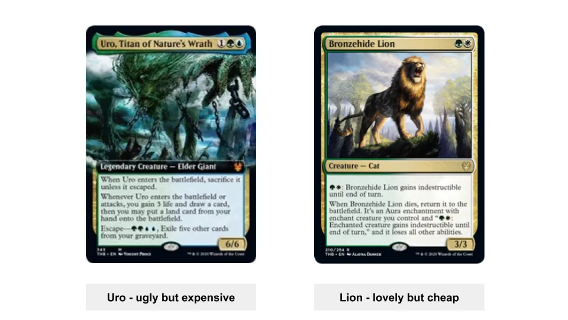
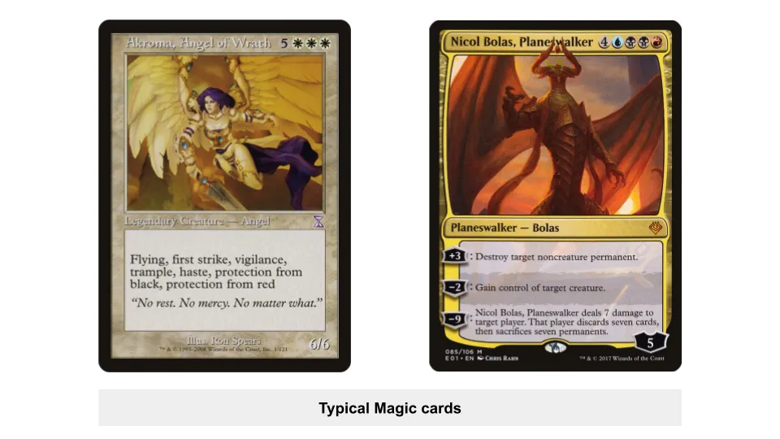
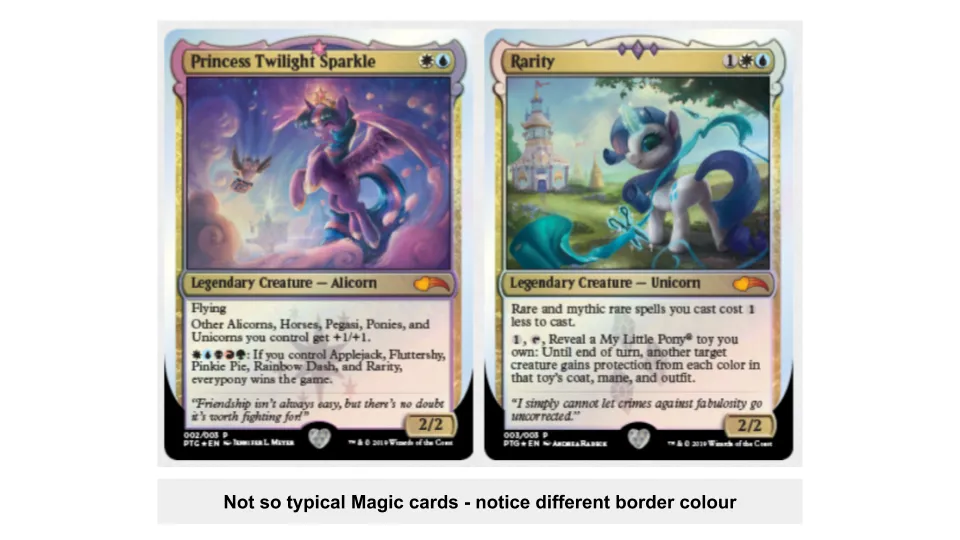
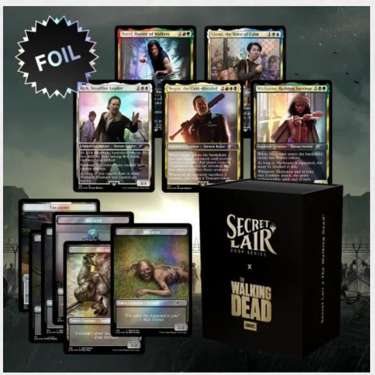
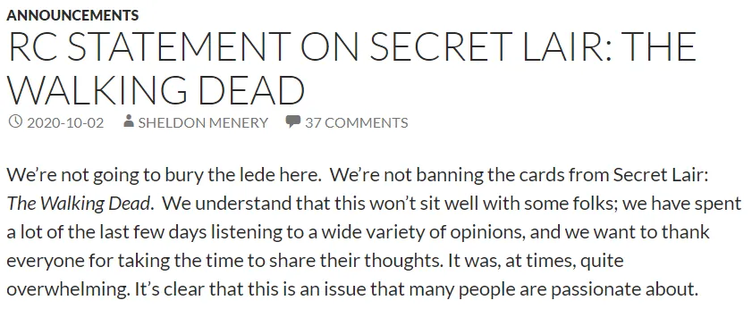
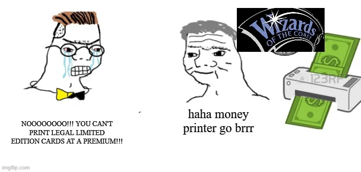

## À retenir

Magic \: The Gathering est une entreprise lucrative de jeux de cartes qui a fait face à une controverse auto\-infligée à cause d’une monétisation trop agressive

## Cartes\, Commandant\, Carton crack

Combien peut coûter le carton \?

Si c’est la carte [Black Lotus](https://mtg.gamepedia.com/Black_Lotus 'black') Du jeu de cartes à collectionner [Magic: The Gathering,](https://en.wikipedia.org/wiki/Magic:_The_Gathering 'MTG') Tu pourrais en acheter un pour 27 000 \$\.

Et cela pourrait même être une affaire\, compte tenu d’un exemplaire vendu à un prix [$166,000 at auction](https://www.ebay.com/itm/1993-Magic-The-Gathering-MTG-Alpha-Black-Lotus-R-A-BGS-9-5-GEM-MINT-PWCC-/143136537077?_trksid=p2047675.m43663.l10137&nordt=true&rt=nc&orig_cvip=true 'ebay') [^1]\. Ça fait 166 000 \$ pour un morceau de carton de la taille d’une carte à jouer\.

Il y a longtemps\, dans une autre vie\, je jouais beaucoup à Magic\, le jeu de cartes à collectionner parfois sans ironie appelé « Cardboard Crack » en raison de son caractère addictif [^2]\. Je n’ai pas suivi la scène depuis une décennie\, mais une controverse récente a éveillé ma curiosité\.

Associé au récent article de Byrne Hobart sur l’importance de [games vs metagames](https://diff.substack.com/p/the-gamerarbitrageur-to-generalist? 'Diff') [^3]\, peut\-être que je suis destiné à écrire à ce sujet ce mois\-ci\. Aujourd’hui\, nous allons revoir \:

1. Introduction à la magie et contexte des plaintes de la communauté
2. Qu’est\-ce que le métajeu et sa pertinence dans Magic
3. La controverse actuelle dans « Commander »\, un métajeu populaire de Magic

Jetons un œil aux cartes\, [Commander,](https://magic.wizards.com/en/content/commander-format 'Commander') et [cardboard crack.](https://cardboard-crack.com/ 'crack')

## 1\. Introduction à la magie

Pour comprendre la controverse\, il nous faut plus de contexte\. Magic est un jeu de cartes à collectionner [^4]\, où les joueurs forment un jeu de cartes et s’affrontent en duel\. Les cartes ont des effets\, et le but est de réduire à zéro les points de votre adversaire [^5]\. Vous jouez à tour de rôle avec des cartes\, les jouez\, et activez leurs effets pour atteindre cet objectif [^6]\.

Les cartes sont publiées sur le **Marché principal** par [Wizards](https://magic.wizards.com/en 'Wizards')\, une filiale de sociétés cotées en bourse [Hasbro](https://investor.hasbro.com/investor-relations 'Hasbro')\. Les Wizards conçoivent\, impriment et vendent régulièrement de nouvelles cartes dans un « set »\. La plupart des cartes sont vendues via les magasins locaux sous forme de « boosters packs »\. Ces packs contiennent des cartes aléatoires du nouveau set\, ce qui signifie que vous ne savez pas ce que vous obtenez avant de les ouvrir [^7]\.

Par exemple\, vous pourriez acheter un pack en espérant obtenir une carte rare ["Uro, Titan of Nature's Wrath"](https://scryfall.com/card/thb/229/uro-titan-of-natures-wrath 'Uro') et à la place ["Bronzehide Lion."](https://gatherer.wizards.com/Pages/Card/Details.aspx?multiverseid=476461 'Lion')

Comme beaucoup de gens préfèrent acheter une carte sans compter sur la chance\, il y a aussi un **marché secondaire\.** Les traders achètent des cartes et les revendent avec une marge de majoration\. Avec le temps\, cela s’est même développé en quelque chose [stock market for the cards](https://www.mtgstocks.com/news 'MTG')\, avec son propre club de spéculateurs\. Comme mentionné précédemment\, certaines de ces cartes peuvent être extrêmement coûteuses\.

Notamment\, Wizards ne vend généralement pas de cartes individuelles\, pour éviter de donner l’impression [predatory.](https://mtg.gamepedia.com/Predator 'predator') Ils pourraient manipuler le marché s’ils le voulaient\, puisqu’ils n’ont qu’à imprimer plus de papier\. Ils ne le font normalement pas\, par crainte que cela ne fasse s’effondrer la communauté\. Par exemple\, imaginez les plaintes si Wizards vendait directement une bonne carte pour 500 \$\. Gardez cela en tête \; nous y reviendrons\.

**La demande pour ces cartes vient des joueurs qui veulent les utiliser** dans leurs decks\. Il existe à la fois une scène compétitive officielle avec des prix en argent\, et une scène décontractée où les joueurs jouent juste pour le plaisir\. La popularité des cartes en compétition est un facteur déterminant pour l’utilisation en jeu casual\. Par exemple\, si Uro devenait populaire en compétition et était connue comme une carte puissante\, plus de gens voudraient peut\-être l’utiliser dans leurs decks [^8]\. Comme sur la plupart des marchés\, cela fait grimper le prix de la carte\.

**Une autre raison pour laquelle une carte peut augmenter de prix est liée à l’offre** \(quel [shock](https://gatherer.wizards.com/pages/card/details.aspx?name=Shock 'shock')\)\. J’ai mentionné que les Wizards impriment régulièrement des cartes dans un ensemble\. Les ensembles sont imprimés pendant une certaine durée\, avant qu’un autre ensemble ne prenne le relais\. Cela crée une rareté pour une carte qui peut être dans un ensemble et ne jamais réapparaître\.

Par exemple\, une carte peut être en Alpha défini\, puis pas en Beta [^9]\. La carte Black Lotus d’avant est l’une de ces cartes qui était [printed early on but never again,](https://mtg.gamepedia.com/Reserved_List 'mtg') ce qui entraîne un prix élevé sur le marché secondaire\.

De la même manière que le sport de la « course » propose différents « épreuves » telles que le 100 m\, 200 m ou 400 m\, **le jeu de la magie a aussi [different formats](https://mtg.gamepedia.com/DCI#Tournament_formats 'format')** décidée par les Wizards\. Nous n’avons pas besoin de connaître les détails\, juste qu’une grande différence est le type de cartes que vous pouvez utiliser\. Cela dépend généralement de leur récente sortie\, et de leur « bannissement » ou non\.

Par exemple\, vous pouvez jouer avec les 8 jeux les plus récents et un paquet de 60 cartes dans un format\, et toutes cartes possibles dans un paquet de 100 dans un autre\. Comme cela affecte la compatibilité des jeux\, les joueurs joueront des decks du même format les uns contre les autres\. Il est considéré comme peu pratique de jouer le deck d’un autre format sans en informer votre adversaire\, et les tournois officiels indiquent le format attendu\. Cela détermine le **Métajeu** Pour ce format\, un concept que nous explorerons bientôt\.

La scène décontractée s’est également développée **les formats « favoris des fans »\, le plus populaire étant « Commander »\.** Encore une fois\, les détails de Commander n’ont pas d’importance\, pensez\-y simplement comme un ensemble de règles « méta » que les gens choisissent de suivre lorsqu’ils construisent leurs decks et jouent les uns contre les autres [^10]\. Tout comme ton père a peut\-être mis en place des règles maison dans Monopoly disant que le joueur le plus âgé peut utiliser l’argent de la banque\, la communauté des joueurs a décidé de règles à suivre pour un format\.

Les règles des commandants sont régies par une communauté ["rules committee,"](https://mtgcommander.net/index.php/faq/ 'RC') qui est censée être indépendante de Wizards\. Le comité prend en compte les retours des joueurs lorsqu’il décide quelles cartes autoriser dans Commander\, pour chaque nouveau set imprimé\. Ce sont généralement les cartes plus récentes qui posent problème\, puisque les anciennes cartes existent par définition depuis plus longtemps pour que les joueurs puissent jouer\, et toute interaction qui pourrait briser le jeu aurait dû être découverte\.

Le comité n’applique pas les règles\, car ce serait impossible pour les parties occasionnelles\, mais cela sert de règle standard que les joueurs suivent\. Par exemple\, il pourrait être dit que « Uro » est interdit\. Si vous jouiez une partie de Commandant contre un inconnu et utilisiez Uro\, elle ne voudrait probablement pas continuer\. Cependant\, vous pourriez aussi simplement accepter de jouer avec toutes les cartes que vous voulez\, Uro inclus\.

Nous savons maintenant ce qu’est Magic \: un jeu de cartes à collectionner où de nouvelles cartes sont régulièrement imprimées\, les prix des cartes sont fixés par le marché\, et différentes restrictions de format donnent lieu à différents métajeux\. Développons ce dernier concept\.

## 2\. Magie du métajeu

Imagine que tu es Wizards et que tu crées une carte\. Il y a un [balance](https://gatherer.wizards.com/Pages/Card/Details.aspx?multiverseid=413544 'balance') Que tu dois frapper si tu veux que la carte soit jouée et désirable\. Si tu rends les effets trop faibles\, personne ne la voudra\. Si tu la rends trop forte\, tout le monde l’utilisera\.

Pour un exemple extrême\, imaginez que vous créiez une carte qui dise « Si vous piochez cette carte\, vous gagnez la partie\. » Tout le monde y jouerait\, mais les jeux ne seraient plus amusants\.

Ainsi\, il faut créer de nouvelles cartes qui sont cool\, mais pas au point de « casser » le format dans lequel elles sont jouées\. Si vous commencez à remarquer des cartes qui apparaissent dans chaque deck\, c’est un signe que vous avez peut\-être été trop loin [^11]\.

Les decks et cartes optimaux forment le « métajeu » des formats Magic\. Si vous jouez en compétition\, vous voulez les cartes qui vous donnent les meilleures chances de gagner\. Les joueurs découvrent cela par la théorie et l’expérimentation\. Vous ne pouvez pas seulement savoir quelles cartes sont bonnes\, mais lesquelles sont bonnes **pour le format dans lequel vous jouez [^12]\.**

Dans un méta équilibré\, il y aura quelques decks qui sont « meilleurs » que les autres\, mais aucun deck dominant uniquement\. Par exemple\, ton deck écureuil peut battre mon deck gobelins\, mais se faire battre en moyenne par un deck fée\.

Dans un méta déséquilibré\, il n’y aura qu’un seul deck qui est « meilleur » que tout le reste\. Par exemple\, votre deck élémentaire pourrait avoir des chances favorables face à n’importe quel autre deck\. Quand cela arrive\, c’est rationnel pour [everyone to start playing that deck if they want to win.](https://magic.gg/news/2020-season-grand-finals-metagame-breakdown 'mtg') Comme vous pouvez l’imaginer\, **Ça devient vite ennuyeux\.**

Dans ce cas\, une solution consiste à interdire les cartes « trop puissantes »\. Comme mentionné précédemment\, pour les formats officiels\, Wizards indiquera quelles cartes ne peuvent plus être utilisées\. Pour le format non officiel « Commandant »\, le comité des règles de la communauté choisira les cartes\. **Les bannissements sont un moyen d’équilibrer\.**

C’est là que commence la controverse actuelle\.

## 3\. L’amitié\, c’est de la magie

La plupart du temps\, les nouvelles cartes imprimées font partie d’un multivers Magic plus large\, étant Magic IP et créées à l’origine pour Magic\. Magic est principalement basé sur la fantasy\, ce qui a conduit à des cartes comme les anges et les dragons \:

Plus récemment [^13]\, Wizards a développé davantage de partenariats externes\. Cela implique généralement la création d’une carte personnalisée basée sur d’autres propriétés intellectuelles\. Par exemple\, [a My Little Pony series](https://magic.wizards.com/en/articles/archive/news/magic-extra-life-2019-10-03 'pony') Pour collecter des fonds à des fins caritatives \:

Ou un [Godzilla themed series as alternate art for some cards:](https://articles.starcitygames.com/news/all-19-godzilla-series-monster-cards-revealed/ 'zilla')

Maintenant\, mettez\-vous à la place du Comité des Règles du Commandant\. Quand ces cartes seront publiées\, devriez\-vous les autoriser dans ce format \?

En dehors des arguments esthétiques [^14]\, la raison pour laquelle on ne peut pas facilement dire oui\, c’est que ces cartes spéciales ont souvent **des effets spéciaux qui peuvent déséquilibrer le jeu\.** Par exemple\, que [Princess Twilight Sparkle](https://shop.tcgplayer.com/magic/ponies-the-galloping/princess-twilight-sparkle 'pony') La capacité le rendrait [one powerful pony.](https://www.reddit.com/r/CompetitiveEDH/comments/dczkyh/twilight_sparkles_metarending_magic/ 'pony')

Historiquement\, Wizards évitait l’ambiguïté en faisant quelques choses \:

1. Rendre des cartes spéciales « amusantes » bordées en argent\. En émettant une règle générale interdisant que les cartes à bordure argentées étaient interdites pour le jeu « normal »\, les sorciers pouvaient imprimer ce qu’ils voulaient sans affecter le métajeu
2. Faire en sorte que les cartes spéciales aient le même effet que les cartes bordées de noir et « légales »\, mais avec des illustrations alternatives\. Puisque ces cartes sont imprimées dans des ensembles normaux et équilibrées pour le jeu\, cela ne devrait pas avoir d’effet significatif sur le métajeu

**Voici la controverse\.** Wizards vient de sortir un [limited edition set of new cards in partnership with TV show The Walking Dead.](https://secretlair.wizards.com/us/product/612738/secret-lair-x-the-walking-dead 'dead') Ces cartes uniques ne sont disponibles que pendant un certain temps avant que Wizards ne cesse de les imprimer\. Il est important de noter qu’elles sont bordées de noir \(« légales »\)\, mais ne sont disponibles nulle part ailleurs qu’en achetant ce coffret\. Comme on pouvait s’y attendre\, le coffret est vendu à un prix élevé\.

**Ces cartes doivent\-elles être légales \?** Le site officiel de Wizards indique \:

> REMARQUE \: Ce sont des cartes toutes neuves\, pas des réimpressions ni une partie d’un ensemble principal\. Par conséquent\, elles ne sont pas légales en Standard\, mais elles sont parfaites pour Commander \!

Pour clarifier ce qui précède\, Wizards dénonce explicitement le format « Commander » casual\, conçoit des cartes spécifiquement pour celui\-ci\, et les vend directement à un prix premium dans une édition limitée\.

On comprend pourquoi cela a été le cas [made many players upset, ](https://twitter.com/wizards_magic/status/1312987380115148805?s=20 'twitter') [calling for the cards to be banned immediately.](https://www.reddit.com/r/magicTCG/comments/j1glk8/petition_for_the_commander_rules_committee_to_ban/ 'ban')

Attends\, tu dis\, je pensais que le _Comité des règles_ décider quelles cartes étaient autorisées ou non \? En effet\, certains joueurs espéraient que le Comité agirait de manière indépendante et déclarerait les cartes criminelles dans Commander\.

[Unfortunately not.](https://mtgcommander.net/index.php/2020/10/02/rc-statement-on-secret-lair-the-walking-dead/ 'dead')

Vous avez probablement une idée des incitations contradictoires ici\. Examinons de plus près le [main complaints first](https://twitter.com/ghirapurigears/status/1313145100319494145?s=20 'twitter') [^15]\:

**1\. Disponibilité des cartes\.** Les cartes ne seront jamais réimprimées à cause de problèmes de licence\, contrairement à d’autres cartes qui pourraient être réimprimées dans de futures collections\. Cela limite artificiellement l’offre et les personnes pouvant obtenir les cartes\.

**2\. Ventes ouvertement prédatrices\.** Les cartes ne sont pas « légales » dans les formats officiels\, seulement dans le format Commander occasionnel\. Si vous voulez utiliser les cartes\, vous devrez les acheter à un prix élevé\, en raison de la quantité limitée\.

**3\. Craindre que ce soit le début d’une tendance\.** Les gens acceptent les boosters\, car ils savent que Wizards doit gagner de l’argent\. Cependant\, que se passerait\-il si Wizards commençait à vendre des cartes directement à des prix élevés \? S’ils vendaient une carte « puissante » à 500 \$ sans jamais l’interdire\, les joueurs devraient acheter la carte pour rester compétitifs\. Le métajeu serait ruiné\.

Et maintenant\, regardons la justification de Wizard \:

Ah attendez\, mauvaise image \:

Oui\, je n’ai rien trouvé\, c’est une façon assez flagrante de faire de l’argent\. Quand on considère l’objectif de Hasbro \(la maison mère de Wizards\) [doubling Wizards revenue over the next five years,](https://investor.hasbro.com/static-files/88b2a83b-2368-463a-9489-6cf31dc209ac 'wizards') Pas étonnant que l’équipe de Wizards soit incitée à explorer des moyens de vendre plus de cartes à un prix plus élevé [^16]\. Plus grand volume\, prix plus élevés\, multiplicité de valorisation plus élevée\. Si les gens sont prêts à payer 100 \$ au prix du marché pour une carte\, pourquoi ne pas simplement imprimer les cartes et les vendre directement au lieu de les faire dans des boosters \?

Les sorciers auraient pu 1\) rendre les cartes bordées argentées et « illégales »\, ou même 2\) faire des versions artistiques alternatives d’autres cartes « légales »\. Ils n’ont pas fait 1\) parce que les cartes à bordure argentée se vendent moins que les cartes à bordure noire\, et n’ont pas fait 2\) pour une raison magique que je ne comprends pas\, mais probablement de l’argent

Pour aggraver les choses\, les cartes ciblent le format Commandant\, car il est devenu l’un des\, sinon le [most popular format.](https://www.dicebreaker.com/categories/trading-card-game/how-to/magic-the-gathering-popular-formats 'mtg') Un facteur important qui a contribué à la popularité de Commander \? Wizards a brisé le métajeu pour les formats « officiels »\, en imprimant des cartes trop déséquilibrées\, rendant les jeux ennuyeux\.

Je n’envie pas la position du comité des règles ici\. Ils auraient pu interdire les cartes\, mais ce serait flagrant [betrayal](https://gatherer.wizards.com/pages/card/Details.aspx?multiverseid=3633 'betrayal') de Wizards\. Dans le pire des cas\, Wizards aurait pu les annuler et reprendre le contrôle de Commander\, en faisant un format « officiel » plutôt qu’un format de fans [^17]\.

Les joueurs n’ont pas pris cela sans rien faire\, [complaining vocally on public threads,](https://www.reddit.com/r/magicTCG/comments/j204ww/has_anyone_completely_lost_confidence_in_wotc_and/g73xmqe/?context=1 'complain') [listing demands to be met before they return to the game](https://www.reddit.com/r/magicTCG/comments/j67brt/for_those_who_are_choosing_to_no_longer_spend/ 'game')\, et même [creating a new format, "Captain."](https://twitter.com/PlayCaptainMTG/status/1313164508068810752?s=20 'captain') Il reste à voir si l’un de ces éléments aura réellement un impact sur l’imprimeur de billets qu’est Magic [^18]\.

Il s’avère que [selling paper is hard work.](https://www.youtube.com/watch?v=1QQBB3cwNM0 'prices') La controverse met en lumière quelques éléments applicables de manière plus générale \:

1. Les utilisateurs comprendront si vous monétisez\, mais s’énerveront si vous êtes trop agressif\. Réfléchissez [a rake too far](http://abovethecrowd.com/2013/04/18/a-rake-too-far-optimal-platformpricing-strategy/ 'rake')
2. La réponse à une erreur peut être plus importante que d’essayer de l’éviter\. Pensez à de véritables excuses versus des paroles de façade
3. Les groupes gérés par la communauté liés à une organisation officielle seront contraints de se soumettre à l’organisation\. Réfléchissez à la responsabilité versus l’autorité et à qui détient réellement quoi

Peut\-être que la vraie magie\, ce sont tous les amis que nous nous sommes faits en chemin\.

## Autres ressources pour en savoir plus

1. Kendra Smith a écrit un excellent article avec plus d’histoire sur MTG expliquant pourquoi cela est controversé [here](https://www.coolstuffinc.com/a/kendrasmith-09302020-the-problem-with-the-walking-dead-secret-lair 'kendra')
2. \@ghirapurigears a tweeté un fil avec plus de détails sur les plaintes [here](https://twitter.com/ghirapurigears/status/1313145100319494145?s=20 'twitter')
3. Le YouTubeur Mitch donne une bonne réfutation d’autres arguments avancés par Wizards [here](https://www.youtube.com/watch?v=degV1Masii8 'commander')

[^1]: Je simplifie pour le texte principal\, mais l’état des cartes est une des raisons possibles de cette disparité de prix\. Les cartes à collectionner sont évaluées selon leur état et leur niveau d\'« utilisation » par des services tels que [Beckett Grading Services](https://www.cardboardconnection.com/collectopedia/card-grading-companies/beckett-grading-services-bgs#:~:text=Fees%20for%20BGS%20and%20BVG,card%20for%20especially%20large%20batches. 'beckett')\. La Lotus à 166 000 \$ était en état quasi parfait et issue d’un tirage précoce\.

[^2]: Il existe même une bande dessinée en ligne nommée d’après cette expression [here](https://cardboard-crack.com/ 'crack')\. Aussi\, pour être clair\, je n’ai jamais été très bon en Magie\. J’ai trouvé le Draft Limité plus amusant après quelques années\, car même à ce moment\-là\, les decks Construits étaient chers pour moi\.

[^3]: « Le jeu est limité\, et le métajeu ne l’est pas\, mais si tu n’es pas très bon au jeu de base\, la connaissance du méta est pratiquement inutile\. »

[^4]: C’est en fait le _Première_ Jeu de cartes à collectionner\, création du format\. L’original\, pourrait\-on dire\.

[^5]: C’est évidemment une explication simplifiée\, et vous pouvez en savoir plus sur les règles [here](https://magic.wizards.com/en/game-info/gameplay/rules-and-formats/rules 'rules')\. Il existe différents types de cartes\, certaines temporaires et d’autres permanentes\. Toutes n’affectent pas directement les points de vie de votre adversaire\. Dès 2005\, il y en avait au moins [28 ways to win a game of Magic](https://magic.wizards.com/en/articles/archive/arcana/let-me-count-ways-2005-08-15 'MTG')

[^6]: Sauf si vous jouez contre un deck œufs\, auquel cas vous regardez simplement votre adversaire faire tout pendant des heures et autant [walk away while they're playing](https://www.reddit.com/r/spikes/comments/1ai0my/modern_lets_talk_about_eggs/ 'eggs')

[^7]: Wizards vend aussi beaucoup de decks préfabriqués\, mais je l’ai laissé de côté dans le texte principal pour simplifier\. Aussi\, je peux me tromper\, et je ne pense pas qu’acheter des decks juste pour obtenir une carte soit une chose qui existe depuis le désastre du deck Jitte \/ Rats\, même si la promo de Nexus of Fate posait aussi problème\. Je ne suis plus Magic depuis des lustres cependant\.

[^8]: Un exemple concret dans ce cas\. Uro l’a depuis [been banned](https://gamerant.com/magic-the-gathering-uro-ban/ 'ban') pour être trop puissant\. Banni de quoi exactement \? Il est logique d’interdire une carte des compétitions\, mais comment empêcher quelqu’un de les jouer en format casual \? C’est une question liée à la controverse\, alors lisez la suite\.

[^9]: Alpha et Beta sont de vrais ensembles dans Magic\, mais cette fois\, c’est un faux exemple\. Je pense que toutes les cartes en Alpha ont aussi été imprimées en Beta\, et [some new cards were actually added in Beta](https://mtg.gamepedia.com/Beta 'beta')

[^10]: Parmi les changements\, on peut jouer contre plusieurs joueurs\, avoir plus de cartes dans son deck\, restreindre les cartes à un certain type\, et avoir une carte spéciale – votre « Commandant »\. Commander était aussi connu sous le nom d’Elder Dragon Highlander\, en raison de ses origines où les gens jouaient avec certaines cartes dragon comme commandants\.

[^11]: Wizards a publiquement affirmé suivre un [FIRE philosophy](https://magic.wizards.com/en/articles/archive/card-preview/fire-it-2019-06-21 'mtg') \- Ils veulent que Magic soit amusant\, accueillant\, rejouable\, excitant\.

[^12]: Si vous vous souvenez\, c’est similaire à la [relative vs absolute skill](/writing/relative_billionaire 'relative') point dont j’ai parlé il y a quelque temps\. Peu importe si ton deck est bon en absolu\, mais la façon dont il se compare aux decks typiques que tu es susceptible d’affronter en compétition\, le « méta »

[^13]: Ce n’est en fait pas la première fois que Wizards fait des licences externes\, ayant créé des décors comme Les Mille et Une Nuits ou Les Trois Royaumes qui sont basés précisément sur leur nom\. Je laisse cela de côté dans le texte principal pour simplifier\.

[^14]: En tenant compte de cela [alters](https://magicalter.com/ 'alter') sont une chose et [harmless offering](http://www.mtgmintcard.com/articles/writers/freyalise/holistic-wisdom-10-cutest-cards-ever 'harm') est une carte légale\, je ne trouve pas que la plainte selon laquelle différentes propriétés intellectuelles ruineront le jeu soit aussi forte que les arguments que je détaillerai plus tard\. Cela compte quand même pour un groupe de joueurs bruyants\.

[^15]: Il y a eu beaucoup de plaintes\, et je veux me concentrer sur celles qui semblaient être des arguments plus solides et sur lesquels plus de gens ont exprimé leur opinion\.

[^16]: Merci au fil Reddit [here](https://www.reddit.com/r/magicTCG/comments/j6rwjc/hasbro_goal_double_wotc_revenue_will_this_destroy/ 'reddit')

[^17]: Comme mentionné précédemment\, rien n’empêche les joueurs de simplement ignorer le comité des règles et d’interdire les cartes entre amis\. Le tollé est en partie dû au fait que les joueurs ont réalisé que le comité des règles agit contre leurs intérêts\, et qu’ils ignorent aussi les problèmes clés en les évitant dans leur annonce\. Tout le monde sait que c’est une tentative ciblée de faire de l’argent

[^18]: Pour être clair\, je ne recommande pas aux gens de vendre à découvert Hasbro\, ou quoi que ce soit de ce genre\. Je n’ai pas assez d’expertise pour prédire ici\, et je dirais qu’il y a probablement 80 \% de chances que Magic survive à cela et continue de croître\, s’étendant à plusieurs propriétés intellectuelles populaires\. Beaucoup de riches prêts à payer pour du papier\.
