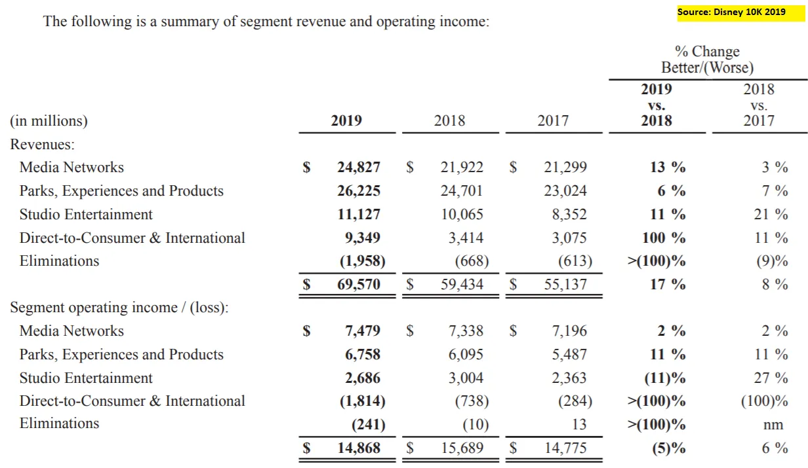

## À retenir

Third Point soutient que Disney devrait cesser de verser ses dividendes et investir dans le streaming \; Semper Augustus n’est pas d’accord\.

## Activisme à Disneyland

Le fonds d’investissement activiste Third Point a récemment publié un [letter to Disney,](https://www.valuewalk.com/2020/10/third-point-walt-disney-company/ 'disney') suggérant que l’entreprise change sa stratégie commerciale [^1]\. Cela a conduit à [a rebuttal by another investment firm](https://valueinvestingworld.substack.com/p/chris-bloomstrans-letter-to-the-walt 'Semper')\, Semper Augustus \(merci à Joe Koster\)\. Il est moins courant que les sociétés d’investissement avancent des contre\-arguments contre un militant\, alors examinons les deux camps [^2]\.

Pour poser le décor\, passons brièvement en revue l’activisme et les affaires de Disney\, pour ceux qui ne connaissent pas l’un ou l’autre\.

### Aperçu de l’activisme

Des fonds d’activistes comme Third Point [usually take a small stake in a company, before publicly agitating for company management to take actions which the activists believe will increase company value](https://en.wikipedia.org/wiki/Activist_shareholder 'activism')\. Ces actions peuvent inclure le paiement d’un dividende\, la vente de mauvaises unités commerciales ou le remplacement de la direction de l’entreprise\. La valeur de l’entreprise ici est généralement définie par une hausse du cours de l’action\. L’activisme a gagné en popularité au cours de la dernière décennie \; quand j’étais dans la banque\, j’ai même travaillé à défendre une entreprise contre une bataille de procuration militante \(ce qui s’est très mal passé\, mais c’est une autre histoire\)\.

Parmi les fonds et investisseurs célèbres figurent Carl Icahn\, Pershing Square de Bill Ackman et Greenlight Capital de David Einhorn\. Puisque les militants veulent être écoutés\, ils sont généralement plus en vue que d’autres fonds spéculatifs\. Cela les aide quand ils font la une des médias et qu’ils sont incités à chercher de la publicité\.

Le succès d’un investisseur activiste ressemble à ceci \: acheter des actions d’une entreprise\, dire à l’entreprise quoi faire\, l’entreprise le fait\, le cours de l’action monte\, tout le monde est satisfait\, l’activiste vend des actions et fait des profits\. La plupart des activistes sont des détenteurs à court terme\, bien qu’il y ait des exceptions\.

L’échec peut être l’échec de n’importe quelle partie de cette étape\. Par exemple\, une entreprise pourrait ne pas vous écouter\. Et même si elle le faisait\, peut\-être que le cours de l’action ne bouge pas\.

Maintenant que nous avons une compréhension approximative de l’activisme\, regardons Disney\.

### Aperçu de Disney

Je n’ai jamais couvert Disney quand j’investissais à long ou court \; un collègue l’a fait\. Alors\, jetons un œil à [the financials](https://thewaltdisneycompany.com/app/uploads/2020/01/2019-Annual-Report.pdf 'ar') Et apprenons ensemble comment l’entreprise est gérée\. Je vais consulter leur rapport annuel 2019 pour simplifier\, donc tout l’impact du covid n’est pas encore inclus\. Nous y reviendrons\.

Disney rapporte quatre segments majeurs \: réseaux médiatiques\, parcs\, divertissement en studio et Direct\-to\-Consumer \(DTC\)

Mes premières réflexions à ce sujet sont \:

- Le chiffre d’affaires des réseaux médias augmente à deux chiffres\, mais la croissance du bénéfice d’exploitation n’est que de 2 \%\, ce qui suggère un désendettement
- Parks\, quant à lui\, fait croître de 6 \% de revenu mais obtient un levier d’exploitation pour augmenter le chiffre d’affaires de 11 \%
- Le studio a augmenté le volume de régime mais a diminué les revenus d’exploitation \; c’est inattendu
- DTC a augmenté de \>100 \% sur le retour\, et sa perte d’exploitation a également augmenté de \> 100 \% [^3]\. C’est rare de voir une grande entreprise croître aussi vite\, peut\-être qu’ils s’en sortent très bien \? Disney\+ a\-t\-il eu autant de succès \?

Si l’on regarde les marges opérationnelles de ces segments\, elles sont assez similaires\, avec 20\-30 \%\. Cela m’a surpris\, j’aurais pensé qu’il y aurait un segment à marge élevée « subventionnant » un segment à faible marge\, par exemple ma première hypothèse aurait été que les parcs ont une faible marge\.

Si les profils de marge sont effectivement similaires\, la direction devrait être indifférente à investir dans l’un d’eux \; préférant peut\-être les médias en raison de la marge légèrement supérieure [^4]\.

Disney utilise 17 pages de son rapport annuel pour décrire son activité [^5]\, donc je vais les résumer pour éviter que vous ne partiez tous avant même de commencer\.

- Les médias incluent les chaînes câblées nationales et les chaînes de télévision telles que Disney et ESPN [^6]\. Les revenus proviennent des frais d’affiliation que les gens leur versent pour leur contenu \(programmation\) et la publicité sur leurs propres réseaux
- Les parcs incluent des parcs à thème comme Disneyland et la licence de leur propriété intellectuelle pour les produits grand public\. Le Rev provient de la vente de billets et des redevances de licence\. Il y a une mention intéressante du fait que \>75 \% des dépenses d’investissement de Disney ont été consacrées aux activités des parcs\, ce que je garderai en tête
- Le studio comprend des films tels que Fox\, Marvel\, Lucasfilm\. Rev provient des frais de licence des films pour les salles
- DTC inclut les services de streaming Disney\+\, et ils y incluent aussi la télévision internationale\. Rev provient des frais publicitaires sur la télévision internationale et des abonnements pour le streaming

Relire cette section répond aussi à quelques questions que j’avais \:

Il y avait un **acquisition en 2019\,** ce qui a entraîné un « extra » de rev pour les segments Media et DTC\. Cela explique pourquoi la croissance DTC a été si élevée\, ainsi que l’accélération de la rev Média\. Maintenant je m’en souviens [Disney bought 21st Century Fox.](https://www.vox.com/culture/2019/3/20/18273477/disney-fox-merger-deal-details-marvel-x-men 'Fox')

Si j’étais dans la banque\, j’aurais passé des heures à essayer de faire des comptes financiers pro forma pour ajuster cela et obtenir une croissance « normalisée »\, en voyant les deux entreprises séparément\.

Je ne travaille plus dans la banque et ~~je n’en ai pas envie~~ Je vais laisser cela comme un exercice pour le lecteur\, alors passons à autre chose\. Mais cela implique aussi que le taux de croissance des médias est plus faible que ce que je pensais\. Je ne serais pas surpris s’il ressemblait davantage au taux de croissance de 2018 de \~3 \%\.

Je pensais aussi au départ que DTC montrait du succès avec Disney\+\, mais ce n’est pas le cas\. J’ai aussi réalisé que Disney\+ est sorti en novembre\, donc cela ne contribue pas aux revenus\, puisque l’exercice financier de Disney se termine en septembre\.

**Les parcs ont aussi une marge plus élevée que je ne le pensais** Parce qu’ils regroupent la rev de licence IP dans ce segment\. Je suppose que c’est pour éviter d’afficher un segment à faible marge\, ce qui est un comportement typique pour beaucoup d’entreprises\, mais je n’ai pas de contexte ici\.

Voici donc mes réflexions révisées \:

- Les médias \(toute la version télé\) sont grands mais à la croissance lente
- Les parcs sont grands mais à croissance lente\, et nécessitent beaucoup d’investissements en capital
- Le studio est plus petit mais en forte croissance\, j’imagine à cause de la popularité des films Marvel
- DTC est plus petit et je ne peux pas vraiment dire le taux de croissance\, mais je suppose qu’il est rapide aussi puisque Disney\+ est nouveau

Une énorme complication est l’impact du Covid sur l’entreprise\. [For the first nine months of its fiscal year:](https://thewaltdisneycompany.com/the-walt-disney-company-reports-third-quarter-and-nine-months-earnings-for-fiscal-2020/ 'dis')

- Les médias ont légèrement baissé trimestre sur trimestre \(qoq\)\, mais en hausse depuis le début de l’année \(depuis le début de l’année\)
- Les parcs sont morts\, en baisse de 85 \% de qualité et 29 \% depuis l’année
- Studio a également disparu\, en baisse de 55 \% de qoq et étonnamment en hausse de 3 \% depuis l’année
- Les chiffres DTC ne sont pas comparables à cause de l’acquisition\, mais je suppose que le taux de croissance reste rapide

J’ai mis les finances de Disney dans un modèle simple [here](https://docs.google.com/spreadsheets/d/1h6yW8z2AcCCm-vn6bEkk0g5_nN-bzLge1lkok94PFaI/edit?usp=sharing 'goog') au cas où certains d’entre vous voudraient jouer avec les chiffres\. Notez que les hypothèses sont juste des chiffres fictifs et non des vérifications\.

Voyons maintenant ce que disent les investisseurs\.

### Les arguments de Third Point et les contre\-arguments de Semper Augustus

Mon plan initial était de présenter les arguments et contre\-arguments pour les deux investisseurs\. Il s’avère qu’il n’y a en réalité qu’un seul point principal [^8]\, alors allons droit au but\, en sautant les habituels discours d’ouverture des deux cabinets sur la façon dont leur cabinet et Disney sont tous géniaux\.

[Third Point:](https://www.valuewalk.com/2020/10/third-point-walt-disney-company/ 'third')

> nous pensons que la société devrait suspendre définitivement son dividende annuel de 3 milliards de dollars et réorienter entièrement ce capital vers la production de contenu et l’acquisition des activités DTC de The Walt Disney Company\, centrées autour de Disney\+\.

J’ai cherché sur Google et j’ai réalisé [Disney suspended their dividend](https://www.barrons.com/articles/disney-suspends-first-half-dividend-amid-covid-19-disruption-51588715645 'divd') à cause du Covid\. La suggestion de Third Point est intéressante\, car ils disent vouloir que Disney donne moins d’argent aux actionnaires \(comme eux\-mêmes\)\, et que les réinvestisse dans le segment DTC en forte croissance que nous avons vu plus tôt\. **Normalement\, on verrait des militants dire le contraire\.**

Le troisième point précise \:

> Ces dollars incrémentaux généreraient\, selon notre analyse\, des rendements multiples du rendement actuel du dividende de l’action en attirant des abonnés à haute valeur à vie \(« LTV »\) vers votre plateforme DTC\.

Ils soutiennent que la valeur totale d’un abonné au streaming est élevée\, et que Disney devrait donc investir davantage dans le contenu pour **Obtenez plus d’abonnés** c’est\-à\-dire qu’un dollar retourné à un investisseur sous forme de dividende vaut moins que si Disney utilisait ce dollar pour créer du contenu et obtenir plus d’abonnés

> Au\-delà de l’arrivée d’abonnés supplémentaires sur la plateforme\, une vitesse accrue de production de contenu dédié apportera plusieurs avantages en cadena répartis sur votre base existante\, notamment un engagement accru\, une baisse du churn et un pouvoir de tarification accru\. Pour mettre cela en perspective\, améliorer le churn de Disney\+ au taux de rotation domestique de \~2 \%\, leader du secteur de Netflix\, doublerait plus que doubler le LTV brut des abonnés\.

Tactique courante consistant à comparer une entreprise à un exemple « best in class »\, en disant que si l’entreprise peut performer aussi bien que l’exemple\, [dreams come true](https://disneyparks.disney.go.com/in/#:~:text=Disney%20Parks%20%7C%20Where%20Dreams%20Come%20True 'dis')\. Dans ce cas\, ils disent que plus d’abonnés resteront abonnés\, regarderont plus de séries\, et Disney pourra leur facturer un supplément\.

> Tout aussi important\, accélérer de manière significative les dépenses en contenu DTC élargira encore la fracture entre The Walt Disney Company et ses homologues des médias traditionnels – WarnerMedia\, Discovery\, ViacomCBS\, NBCUniversal de Comcast et Fox – aucun d’eux n’ayant les capacités financières pour mettre en œuvre un plan aussi audacieux

Je n’ai pas assez de contexte ici\, car je ne sais pas combien ces pairs dépensent\. Je trouve surprenant qu’aucun d’eux n’ait assez d’argent pour la programmation\.

> Nous avons observé de nombreux précédents de transitions réussies de modèles économiques non linéaires qui ont bien porté leurs fruits pour les actionnaires\. Parmi ces transformations d’activité\, Adobe et Microsoft se distinguent comme des exemples particulièrement pertinents \\\[\.\.\.\\\] De plus\, les actions ont été récompensées par des multiples nettement plus élevés\, reflétant la qualité supérieure de leurs nouvelles sources de revenus récurrentes par abonnement

Et ils incluent un graphique montrant l’augmentation multiple\. Un multiple est une façon d’évaluer une entreprise\, montrant combien les gens sont prêts à payer pour votre action\. Plus c’est généralement élevé\, mieux c’est [^9]\.

> Enfin\, nous pensons que Disney devrait maintenir son focus sur la transition vers une source de revenus DTC basée sur les abonnements et éviter la tentation de maximiser les profits à court terme grâce à des stratégies de tarification transactionnelle VOD\.

Il est aussi intéressant qu’ils ne demandent pas à Disney de monétiser agressivement \(en faisant payer les consommateurs pour chaque film [^10]\)\, et à la place\, rendre l’abonnement aussi bon rapport qualité\-prix\.

Ma première pensée est **C’est une question d’activiste inhabituelle et intéressante\.** Plutôt que de vouloir un rendement à court terme en demandant plus de dividendes\, Third Point demande l’inverse\. Ils ne veulent même pas que l’entreprise pousse la monétisation et semblent préférer attendre un pivot à plus long terme dans le modèle économique\.

[Now what does Semper have to say:](https://valueinvestingworld.substack.com/p/chris-bloomstrans-letter-to-the-walt 'semper')

> Je conteste cependant la recommandation de « suspendre définitivement le dividende annuel de 3 milliards de dollars de Disney et réorienter entièrement le capital vers la production de contenu et l’acquisition des activités DTC de Disney\, centrées autour de Disney\+\. » Cette lettre ne suggère cependant pas non plus de réintroduire le dividende au taux précédent\, mais plutôt de profiter de ce moment pour évaluer toutes les flèches d’allocation du capital disponibles dans votre carquois\.

Donc ils disent de ne pas accepter tout de suite la suggestion de Third Point\, **mais il faut envisager toutes les alternatives\.** Quelles pourraient être ces idées \?

> Retirer une partie de la dette désormais lourde prise pour financer l’acquisition de Twenty First Century Fox

> Faites des acquisitions complémentaires

> Rachat d’actions ordinaires sur le marché ouvert

> Augmenter les dépenses de contenu\, de capital\, de recherche et développement ou de publicité dans les parcs ou dans les studios et les entreprises médiatiques\.

Ce sont des options assez classiques d’allocation de capital\. En fait\, les trois premières sont des choses que je m’attendrais normalement à ce qu’un militant demande\, et avant de lire la lettre de Third Point\, je pensais qu’ils allaient dire quelque chose comme ça\. Voici une image rapide pour vous rafraîchir la mémoire sur l’allocation du capital\, de Michael Mauboussin \:

Revenons à Semper \:

> Il semble que l’industrie du divertissement soit dans une course aux armements nucléaires avec la compréhension que celui qui produit le plus de contenu gagne\. Cela ne me semble pas être la manière Disney\.

Semper préfère que Disney se concentre sur la qualité plutôt que sur la quantité\.

> Oui\, si le nombre d’abonnés augmente plus vite que prévu à court terme\, le prix de l’action sera probablement récompensé à court terme\. Sur une explosion suffisante de l’action\, nous parierions Third Point et ce genre de spéculateurs à court terme\, définissant le succès comme une expansion du multiple cours\/bénéfices\, seront éliminés\.

C’est une critique courante des militants \: ils ne sont que des détenteurs à court terme\. Je suis généralement d’accord pour dire que les activistes sont en moyenne à court terme\, bien que j’aie vu des preuves contraires [^11]\.

### Je penche pour Third Point ici

Avec la grande réserve que je ne parle pas de Disney et que je ne l’ai jamais fait\, je penche pour Third Point ici\. Ce qui est surprenant\, car je trouve normalement la plupart des arguments militants faibles\. Quelques raisons \:

- Je ne suis pas un grand fan des dividendes \; voyez [here](/writing/dividend 'divd') pourquoi
- Le streaming de contenu devrait être une tendance de forte croissance pour les X prochaines années \(5 \? 10 \? 20 \?\)\, donc dépenser davantage ici est probablement un retour fort
- Je suis d’accord pour dire qu’il n’est pas clair combien représente ce rendement\, et que les calculs des abonnés de Third Point sont tous inventés\, mais je pense que ce sera un rendement supérieur au dividende
- Facturer plus cher pour les films en pay\-per\-view me semble aussi stupide quand on essaie de construire une activité de streaming\. Tu te souviens de ce dont je viens d’écrire [Magic and overcharging](/writing/mtg 'Magic')
- L’argument de Semper se résume à \: Attendez\, voyons tout ce que nous pouvons faire ici\. Ce qui est\, eh bien\.\.\. vrai \? Je veux dire\, on ne peut pas contester ça\, juste que ce n’est pas vraiment solide\. Je suis sûr que Disney examinerait toutes ses options avant de décider de réinvestir son dividende\, donc ce n’est pas un argument impactant pour moi
- Je ne connais pas la structure complète de la dette de Disney\, mais les 10K montrent que leurs taux actuels ne sont pas vraiment mauvais \(voir image ci\-dessous\)\. Je ne sais pas si rembourser agressivement la dette a vraiment du sens
- Surtout dans notre environnement actuel de taux bas\, si Disney avait besoin de liquidités pour financer une acquisition ou un rachat d’actions\, je suppose qu’il leur est facile d’emprunter à bas prix

Encore une précision\, ceci n’est pas un conseil d’investissement et que je connais moins bien le secteur\, mais c’est mon opinion actuelle\. Comme mentionné\, vous pouvez faire une copie du modèle financier que j’ai élaboré [here](https://docs.google.com/spreadsheets/d/1h6yW8z2AcCCm-vn6bEkk0g5_nN-bzLge1lkok94PFaI/edit#gid=0 'goog') pour jouer avec les chiffres\. Les hypothèses que j’y ai faites sont des chiffres factices\, donc s’il vous plaît\, ne vous y attachez pas [^12]\.

N’hésitez pas à répondre pour me dire ce que vous en pensez \!

[^1]: J’ai mis un lien vers un site tiers pour le texte de la lettre\, et vous pouvez aussi le trouver [here](https://thirdpointlimited.com/portfolio-updates 'third') sur le site officiel de Third Point si ça vous intéresse\. Ce lien ne semble pas être permanent pour la lettre\, d’où le lien tiers\.

[^2]: Mais ce n’est pas inédit\. Bill Ackman contre Carl Icahn sur Herbalife en est un exemple célèbre\.

[^3]: Le 100 \% dans le tableau représente une croissance de \> 100 \%\, similaire au \>\(100\) \% représentant une baisse de plus de 100 \%

[^4]: C’est une vision simpliste\, car il pourrait y avoir d’autres coûts non pris en compte dans le résultat d’exploitation rapporté ici\. Le traitement fiscal des entreprises ou les frais d’intérêts peuvent être différents\, pour ne donner que des exemples\.

[^5]: C’est la première partie de sa [annual report](https://thewaltdisneycompany.com/app/uploads/2020/01/2019-Annual-Report.pdf 'ar')\, si vous souhaitez y jeter un œil de plus près

[^6]: Je pense que les gens savent qu’ESPN est la principale source de revenus pour Disney d’après d’autres chiffres rendus publics\, mais je ne vais pas creuser davantage sauf si c’est nécessaire\.

[^7]: Disney a acquis Twenty First Century Fox \(TFCF\)\, ce qui leur a également donné une participation dans Hulu\. « Le 20 mars 2019\, la Société a acquis le capital en circulation de TFCF\, une société mondiale diversifiée des médias et du divertissement\. » et « Le prix d’achat de l’acquisition s’est élevé à 69\,5 milliards de dollars\, dont 35\,7 milliards de dollars en espèces et 33\,8 milliards en actions Disney\. » et « Dans le cadre de l’acquisition de TFCF\, la Société a acquis les 30 \% de participation de TFCF dans Hulu\, portant ainsi notre participation à 60 \%\. En conséquence\, la Société a commencé à consolider Hulu » à partir de la page pdf 98 des 10 000 \$ 2019\.

[^8]: L’argument principal du Troisième Point commence dans le troisième paragraphe\, et je ne suis pas sûr que ce soit intentionnel pour _Troisième_ Point\.

[^9]: Encore une fois\, point de vue simpliste\. Si je voulais creuser davantage\, j’irais vérifier les multiples affichés pour ces entreprises\, comment ils sont calculés et comment ils ont évolué au fil du temps\. Il ne fait aucun doute que MSFT et ADBE ont bien réussi leur pivot et ont été récompensés pour cela\. En même temps\, 2010 semble être peu après la crise de 2009\, donc les multiples ont probablement baissé\. Les multiples en 2020 sont probablement aussi plus élevés que la normale\. Donc une partie de cette expansion multiple vient de la transition du modèle économique\, une autre partie d’une comparaison entre un point élevé et un seuil bas\.

[^10]: Disney a essayé cela avec Mulan et\, en cherchant des séries sur Google\, les gens pensent que ça ne s’est pas bien passé\.

[^11]: Généralement présenté par les activistes eux\-mêmes\, qui montrent un tableau du type « Oh\, j’ai détenu untel pendant 10 ans » et ensuite l’action s’avère être Amazon ou quelque chose dont tout le monde voudrait être détenteur à long terme\. Pour être clair\, je ne dis pas que ce sont des activistes _Je ne peux pas_ Soyez des détenteurs à long terme\, simplement que le modèle économique incite naturellement à agir à court terme\.

[^12]: Pour être clair\, si je devais réellement modéliser Disney\, il faudrait entrer dans beaucoup plus de détails\, comme estimer le nombre d’abonnés et construire chaque segment d’activité à partir de la base\. Le modèle est simplifié avec des hypothèses factices \; l’objectif est de permettre aux gens d’avoir un aperçu rapide de l’entreprise et des pilotes
