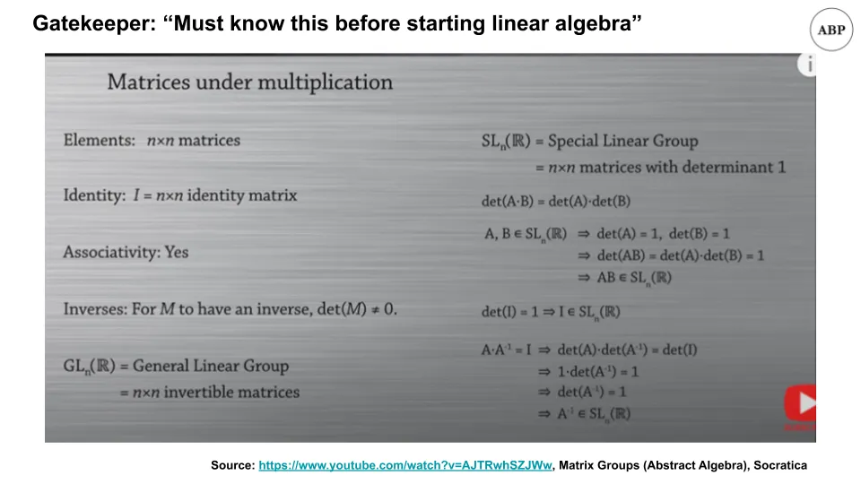

## Points à retenir

1. Le gatekeeping est généralement fait pour préserver le statut individuel plutôt que le statut de groupe\, et doit être évité
2. Les spirales du coût du capital et d’illiquidité sont liées dans une boucle de rétroaction

## 1\. Contrôle d’accès pour le statut de groupe vs individuel

Vous avez déjà vu ça\.

Un débutant\, passionné et motivé\, viendra chercher des conseils pour débuter dans une matière\.

Et une multitude d’experts le feront [emerge from the depths](https://youtu.be/Y2fwe0rnHak?t=118 'balrog') de leur dire que c’est impossible\, qu’ils devraient revenir en arrière et passer des années à apprendre les prérequis\, et qu’ils devraient avoir honte d’avoir posé la question en premier lieu\. _« Quel culot de certaines personnes qui pensent pouvoir éviter de payer leur dette\. »_

Certains « experts » trouvent même des raisons de se plaindre quand d’autres lancent des cours pour aider les débutants à faire exactement cela\.

Nous sommes confrontés à des filtres de surveillance tout le temps\, et c’est surtout pour préserver le statut\. Il existe des formes valides de surveillance\, et j’y reviendrai dans un instant\. Mais c’est presque toujours fait pour exclure les gens et être méchant\. Assez drôle\, les gardiens ne semblent jamais réaliser qu’ils peuvent aussi être exclus\.

Par exemple\, on pourrait dire que vous ne pouvez pas commencer l’apprentissage automatique à moins d’apprendre le calcul\, les statistiques et l’algèbre linéaire\, comme le commentateur ci\-dessus\.

Et on pourrait aussi dire qu’on ne peut pas commencer l’algèbre linéaire à moins d’apprendre la théorie des groupes\, comment [matrices are a ring](https://www.youtube.com/watch?v=_RTHvweHlhE 'ring')\, et [when to work with linear groups or not](https://www.youtube.com/watch?v=AJTRwhSZJWw 'group') [^1]

Et vous pourriez encore faire un gatekeeping en disant que ce qui précède dépend de [set theory](https://plato.stanford.edu/entries/set-theory/ 'set')\, [Peano axioms](https://en.wikipedia.org/wiki/Peano_axioms 'Peano')\, et [philosophy](https://plato.stanford.edu/entries/philosophy-mathematics/ 'philo')\. Je me demande combien de temps le commentateur a passé ses études de premier cycle pendant ses études\.

Si on voulait\, on pouvait garder n’importe quoi\.

**Nous n’irions nulle part puisque nous ne commencerions jamais\.**

Il existe des formes valides de gatekeeping\. Si vous excluez quelqu’un parce qu’il serait nuisible à la communauté\, c’est raisonnable\. Par exemple\, si vous constituez un groupe de joueurs vidéo et que vous recevez une demande d’adhésion de quelqu’un qui veut interdire des jeux vidéo\, il est probablement insensé de l’accepter\.

Mais le plus souvent\, le gatekeeping est une tentative des individus du « groupe d’entrée » de préserver leur statut\, comme s’ils perdaient quelque chose à mesure que les gens savent ce qu’ils savent\. Cela vient d’un sentiment d’insécurité \; de personnes qui craignent que les autres réalisent que ce qu’ils font peut aussi être fait par d’autres\. Comme je l’ai écrit le mois dernier\, c’est comme courtiser la loterie\, et c’est probablement une mauvaise idée\. Par exemple\, les peintres impressionnistes étaient tous gardés à leur arrivée\, mais regardez leur influence sur l’art aujourd’hui [^2]\.

Notez que les gardiens n’ont pas totalement tort\. **En fait\, leurs suggestions ont souvent du sens\.** Par exemple\, il serait extrêmement utile de connaître l’algèbre linéaire tout en étudiant l’apprentissage automatique\. Et si vous voulez devenir un expert\, il faut maîtriser toutes les mathématiques requises [^3]\. Mais empêcher artificiellement les gens de commencer une matière n’aide personne\. Une meilleure réponse aurait été « Oui\, voici des cours plus simples pour commencer\, revenez et revenez sur les fondamentaux ensuite\. » Activez plutôt que désactivez\.

Si vous avez eu un biais en faveur du gatekeeping\, je vous encourage à réfléchir à savoir si vous aidez la communauté ou vous aidez vous\-même [^4]\. Si vous vous êtes choisi de lire cette newsletter\, vous pouvez faire mieux\.

Les champs sont suffisamment grands pour que plus il y a de personnes qui les poursuivent\, mieux c’est\. Ce n’est rarement\, voire jamais\, un jeu à somme nulle\, et plutôt un [infinite game](https://fs.blog/2020/02/finite-and-infinite-games-two-ways-to-play-the-game-of-life/ 'infinite')\. En étant ouverts d’esprit et en acceptant les débutants\, nous pouvons faire grandir tout le gâteau et en avoir plus pour nous\-mêmes\. C’est ainsi que nous pouvons faire progresser en tant qu’individus \; ainsi nous avons le beurre et l’argent du beurre\.

Ouvrez plus de portes\, et [be kind.](https://www.youtube.com/watch?v=xnouj9Yz-Gs&feature=youtu.be&t=23 'who')

## 2\. Spirales de liquidité

Vous avez déjà vu cela auparavant\.

Un marché fonctionne bien\, faisant ce qu’il fait \: équilibrer le marché et faire correspondre acheteurs et vendeurs\. Quand soudainement un choc survient\, le marché se fige et devient « illiquide »\.

Par exemple\, [how flour was in short supply a while back](https://www.theatlantic.com/health/archive/2020/05/why-theres-no-flour-during-coronavirus/611527/ 'flour') [^5]\.

Ou comment la crise de 2008 a provoqué des ruées sur les institutions bancaires\, en menant certaines à la faillite\.

Et rappelez\-vous plus tôt cette année\, lorsque nous avons discuté que la liquidité était la cause des crises\, et non le capital\.

Aujourd’hui\, nous allons regarder les points forts de l’article ["Market Liquidity and Funding Liquidity"](https://www.nber.org/system/files/working_papers/w12939/w12939.pdf 'Markus') par Markus Brunnermeier et Lasse Pedersen\. L’article est long et principalement mathématique [^6]\, mais nous pouvons encore revoir les conclusions\.

Markus et Lasse examinent ce qui cause ces spirales d’illiquidité\, en découvrant que le coût du capital [^7] Fonctionne dans une boucle de rétroaction avec la liquidité\. Plus difficile d’obtenir des fonds\, plus faible liquidité\, plus grande volatilité\.

Ils examinent d’abord les exigences de marge [^8]\, et observer comment elles évoluent en réponse aux crises\. Comme prévu\, les marges \(qui jouent ici le rôle des coûts\) deviennent moins liquides lorsqu’il y a plus d’incertitude\, et deviennent plus liquides lorsqu’il y a moins d’incertitude\.

Une autre façon de réduire la liquidité est de diminuer le capital des participants \:

> Il est important de noter que toute sélection d’équilibre a la propriété que de petites pertes des spéculateurs peuvent entraîner une chute discontinue de la liquidité du marché\. Cette « sécheresse soudaine » ou fragilité de la liquidité du marché s’explique par le fait qu’avec des niveaux élevés de capital spéculateur\, les marchés doivent être en équilibre liquide et\, si le capital des spéculateurs est suffisamment réduit\, le marché doit finalement basculer vers un équilibre à faible liquidité\/marge élevée

Ce qui peut entraîner des spirales d’illiquidité de deux manières \:

> Premièrement\, une « spirale de marges » apparaît si les marges augmentent dans l’illiquidité du marché parce qu’une réduction de la richesse des spéculateurs diminue la liquidité du marché\, ce qui entraîne des marges plus élevées\, un resserrement des contraintes de financement des spéculateurs\, etc\.

> Deuxièmement\, une « spirale de pertes » apparaît si les spéculateurs détiennent une forte position initiale négativement corrélée au choc de la demande des clients

La première semble évidente \; la seconde signifie que si vous êtes un vendeur forcé\, le prix va beaucoup baisser et vous devrez vendre davantage\.

Cela les conduit à des conclusions tant pour les investisseurs que pour les banques centrales \:

Pour les investisseurs\, ils soulignent l’importance d’avoir une marge de sécurité\, ce qui semble évident \:

> Enfin\, le risque seul que la contrainte de financement devienne contraignante limite la fourniture par les spéculateurs de liquidité sur le marché\. Notre analyse montre que la politique optimale de gestion des risques \(de financement\) des spéculateurs est de maintenir un « tampon de sécurité »\.

Plus intéressant encore\, c’est ce qu’ils concluent sur les banques centrales et la politique monétaire\.

> Les banques centrales peuvent aider à atténuer les problèmes de liquidité des marchés en contrôlant la liquidité des financements\. Si une banque centrale est meilleure que les financiers typiques des spéculateurs pour distinguer les chocs de liquidité des chocs fondamentaux\, alors la banque centrale peut transmettre ces informations et inciter les investisseurs à assouplir leurs besoins en financement

> Les banques centrales peuvent également améliorer la liquidité des marchés en améliorant les conditions de financement des spéculateurs lors d’une crise de liquidité\, ou simplement en déclarant l’intention de fournir un financement supplémentaire en période de crise

**C’est ce que vous voyez sur les marchés actuels\.** Notez qu’il y a trois actions distinctes qu’une banque centrale peut entreprendre ici \: 1\) transmettre des informations\, 2\) fournir des financements\, 3\) simplement _disons_ ils peuvent fournir des financements \; ils n’auront peut\-être même pas besoin de le faire au final\. Dans la crise actuelle\, [markets recovered after (3), even though the actual funding provided was small.](https://www.ft.com/content/a1fba7cd-5329-46e6-82a8-57149e409f6c 'fed')

Même la Fed a compris qu’il ne devait pas être le gardien de dernier recours\.

## Autres

1. [A brief history of graphics (youtube video)](https://www.youtube.com/watch?v=QyjyWUrHsFc&list=WL&index=8 'gfx')
2. ["Colour blindness is an inaccurate term"](https://commandcenter.blogspot.com/2020/09/color-blindness-is-inaccurate-term.html 'colour')\. En tant que personne daltonienne\, c’était intéressant à lire\, surtout qu’il y avait de nouvelles informations
3. ["The long tail turns out toe be a major cause of the economic challenges of building AI businesses"](https://a16z.com/2020/08/12/taming-the-tail-adventures-in-improving-ai-economics/ 'a16z')
4. [Intro to abstract algebra and group theory by Socratica (youtube series)](https://www.youtube.com/watch?v=IP7nW_hKB7I 'aa')\. Recommandé\, adapté aux débutants\.
5. ["Fusion reactor very likely to work"](https://futurism.com/mit-researchers-fusion-reactor-very-likely-work 'fusion')

[^1]: N’ayant pas entendu parler de la théorie des groupes avant cette année\, je dirais que c’est la chose la plus fascinante que j’aie apprise de toute l’année\. Cela m’a vraiment aidé à comprendre pourquoi nous définissons les « choses » et les « opérations » de l’algèbre de cette façon\. Pourquoi la multiplication matricielle n’est\-elle pas commutative\, par exemple \?

[^2]: Les impressionnistes ont d’abord reçu leur nom [from critics ridiculing them for their "unfinished" artwork that were mere "impressions"](https://smarthistory.org/how-the-impressionists-got-their-name/ 'art')

[^3]: Pour être clair – je suis d’accord que pour devenir bon en apprentissage automatique\, il faut être bon en calcul\, statistiques\, algèbre linéaire\, etc\. Le commentateur a raison à ce sujet\. Je ne suis pas d’accord pour dire qu’on devrait garder les portes pendant des années parce qu’ils n’ont pas tout appris

[^4]: J’ai sauté les discussions sur les questions de sécurité\, par exemple toi _devrait_ empêche quelqu’un de faire du free solo s’il n’a jamais grimpé auparavant\. Je fais confiance au lecteur pour avoir du bon sens ici \; j’espère que ce n’est pas trop demander

[^5]: Vous remarquerez que je n’ai pas utilisé de papier toilette comme exemple\. C’est parce que j’ai une opinion tranchée contre un article populaire sur le médium TP qui est devenu viral il y a quelque temps\, que je considère comme étant en grande partie inexact\. Je prévois d’écrire à ce sujet et de ce genre d’articles du type « voici une explication contre\-intuitive » qui ne sont pas contre\-intuitifs mais simplement faux \; je n’ai pas encore eu le temps de le faire\.

[^6]: Aussi\, pour être totalement transparent\, je ne comprends pas tout à fait les calculs de l’article\. En particulier\, il y a une conclusion biaisée du spéculateur sur le rendement que je ne comprends pas tout à fait\.

[^7]: Pour les lecteurs qui ne savent pas ce que signifie le coût du capital\, considérez\-le comme le coût du financement\. J’en ai parlé plus auparavant [here](/writing/capital 'sub')

[^8]: « Lorsqu’un trader — par exemple un courtier\, un fonds spéculatif ou une banque d’investissement — achète un titre\, il peut utiliser ce titre comme garantie et emprunter contre lui\, mais il ne peut pas emprunter l’intégralité du prix\. La différence entre le prix du titre et la valeur de la garantie\, notée marge\, doit être financée avec le capital propre du trader »
