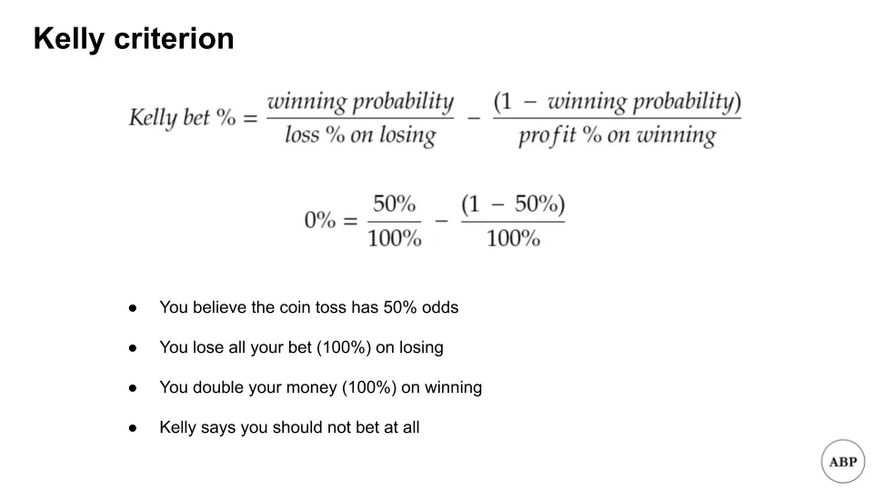
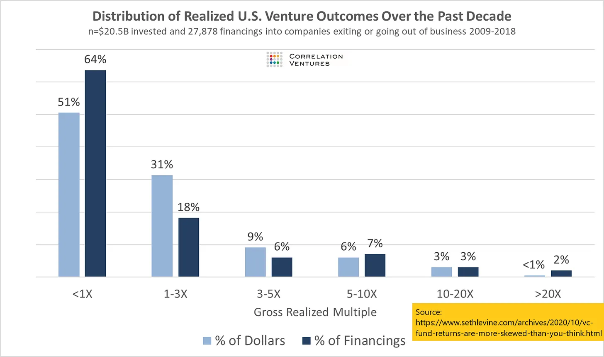
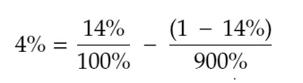
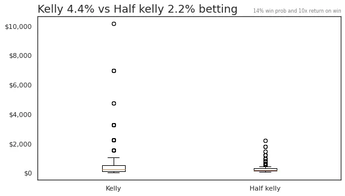
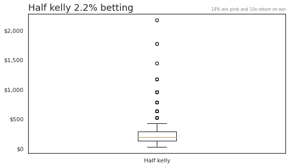
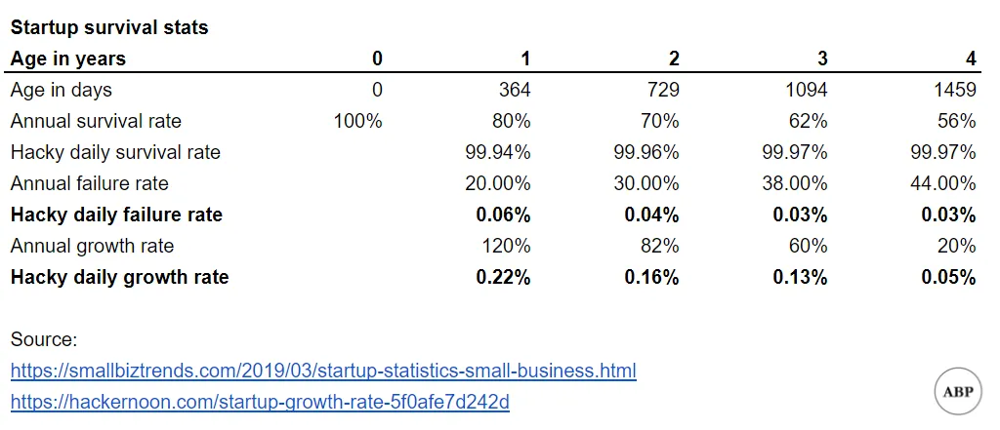

## Points à retenir

1. Le critère de Kelly est une manière mathématique de dimensionner votre portfolio\, mais faites attention à vos hypothèses
2. HASH\.ai facilite les simulations basées sur des agents \; J’essaie de modéliser les taux d’échec au démarrage

## 1\. Critère de Kelly pour la taille du portefeuille

Sarah est une investisseur\-ange en herbe\. Ses amis Nicholas\, Alyson et Chase ont une idée d’entreprise magique impliquant l’extermination des nuisibles\, et Sarah pense que cela va être un énorme succès\.

Sarah s’apprêtait à investir trois économies de toute une vie dans cette entreprise\, quand son autre groupe d’amis [^1] Seth\, Marc\, Emma et Amber lui proposent une idée tout aussi excitante impliquant des lapins\.

Sarah réalise qu’elle a plusieurs choix et qu’elle ne sait pas quoi faire\. Elle va consulter son ami plus âgé Anthony\, qui observe de près le secteur de l’investissement\. Anthony dit qu’elle est sur la bonne voie – l’allocation du portefeuille et les gains risque\/rendement sont la clé pour devenir une investisseuse prospère\. Il ajoute aussi qu’elle pourrait vouloir lire à propos de la [Kelly criterion,](https://www.princeton.edu/~wbialek/rome/refs/kelly_56.pdf 'Kelly') Une formule pour la taille des paris\.

La formule Kelly a été développée par John Kelly chez Bell Labs\. Elle prend quelques entrées et vous renvoie le **Le pourcentage optimal de votre capital pour parier sur quelque chose\,** En supposant que vous souhaitiez maximiser les rendements à long terme\. J’ai publié une dérivation simplifiée dans l’annexe\, et vous pouvez aussi la trouver [here](https://blogs.cfainstitute.org/investor/2018/06/14/the-kelly-criterion-you-dont-know-the-half-of-it/ 'derive') ou dans l’article original\.

Je sais que les maths font peur\, alors illustrons avec un exemple\. Vous voulez savoir combien miser sur un pile ou face\, où vous doublez votre argent ou perdez votre mise\. Si vous entrez les chiffres \:

Oui\, tu as bien lu\. Kelly dit qu’il faut éviter de prendre quoi que ce soit de risque\. Pourquoi \?

Puisque vous n’avez pas d’avantage et que le risque\/récompense est bien évalué\, la meilleure option est de ne pas parier\.

Maintenant\, imaginez plutôt que le même tirage à pile ou face vous rapporte 11x le rendement \(1000 \%\) sur votre mise\, tout le reste restant identique\. Si vous saisissez les chiffres \:

Kelly dit que vous devriez miser 45 \% de votre capital total\. Remarquez que même avec de telles cotes attractives\, vous ne misez pas tout votre argent [^2]\. Vous pouvez aussi constater que dans les jeux où vous pouvez perdre tous vos paris\, vous ne jouez jamais tout à moins de croire avoir 100 \% de chances de gagner\.

[Michael Mauboussin and Ed Thorp elaborate on the attractive features of the Kelly system:](http://www.capatcolumbia.com/MM%20LMCM%20reports/Size%20Matters.pdf 'Michael')

1. Le risque de ruine est « faible »\. Parce que le système Kelly repose sur des paris proportionnels\, perdre tout son capital est théoriquement impossible\, même s’il y aura quand même des pics de volatilité
2. Le système Kelly est très susceptible de faire croître une capitale plus rapidement que d’autres systèmes
3. Vous avez tendance à atteindre un niveau de gains spécifié en un temps moyen le plus court possible

Comment cela peut\-il nous aider du côté de l’investissement providentiel \? Nous devrons faire des hypothèses très simplifiantes [^3]\, mais Kelly peut nous aider à nous donner une idée du montant à allouer par investissement\.

Nous savons que Kelly prend trois mesures d’entrée \: notre croyance sur la probabilité de gagner\, le pourcentage de perte et le pourcentage de profit\. [Correlation Ventures and Seth Levine](https://www.sethlevine.com/archives/2020/10/vc-fund-returns-are-more-skewed-than-you-think.html 'Seth') J’ai un joli graphique ci\-dessous montrant les rendements des capital\-risqueurs au fil du temps\, et je vais m’en servir comme base pour mes hypothèses\.

Pour simplifier\, je vais simplement considérer tout ce qui rapporte 10 fois plus \(900 \%\) ou plus comme une victoire\, et tout le reste comme une perte\. D’après le graphique\, cela signifie que nous gagnons environ 5 \% du temps\. Je simplifierai encore en supposant que nous perdons 100 \% de notre mise en cas de perte\, et que nous gagnons ce bénéfice de 900 \% sur une victoire\. Sous ces hypothèses initiales\, nous obtenons \:

Eh bien\. Ce n’est pas bon\. Sous nos hypothèses actuelles\, Kelly dit que l’investissement en capital\-risque est une mauvaise affaire\. Quand j’ai vu cela pour la première fois\, j’ai fait un double regard\, puis je me suis demandé comment j’allais finir d’écrire ce numéro de newsletter [^4]\. La réponse à laquelle j’en suis venu\, c’est de tricher\. Beaucoup\.

Au lieu du taux de gain de 5 \%\, supposons que les investisseurs providentiels entrent dans un investissement en ayant la foi qu’ils sont au\-dessus de la moyenne\, et que leurs investissements rapporteront au moins leur argent\. Ils croient que leur probabilité de gain est supérieure au taux de base\. On ne parie pas sur quelque chose à moins de croire avoir un avantage face aux cotes\.

En d’autres termes\, nous ignorerons toute cette partie \<1x sur le graphique\, et supposerons que notre univers n’est que le reste\. Ce taux de victoire de 5 \% grimpe à environ 14 \% [^5]\. Nous garderons tout le reste constant\. Sous ces nouvelles hypothèses\, nous obtenons \:

Ce qui est au moins quelque chose avec lequel nous pouvons travailler\. Supportez les suppositions pour l’instant et nous y reviendrons plus tard\.

Pour voir à quoi pourraient ressembler nos rendements\, supposons aussi que nous réalisions 100 de ces investissements consécutifs\. Nous allons effectuer 1 000 simulations de ce à quoi pourrait ressembler un tel portefeuille\, c’est\-à\-dire imaginer 1 000 univers où nous investissons dans 100 entreprises selon les hypothèses ci\-dessus\. [I'm using this Colab file here if you want to follow along](https://colab.research.google.com/drive/1YeMnl2QOQdCAGGxCDr2pfDk_HFgCh02D?usp=sharing 'Colab')

Sans surprise\, notre jeu truqué nous montre que nous faisons beaucoup d’argent \:

Quelques points à noter cependant\. Regardez les énormes baisses \(toutes les baisses\) qui se produisent\. Beaucoup de portefeuilles perdent plus de la moitié de leur argent à la fin\. Les rendements subissent d’énormes pics de volatilité\.

Aussi\, on a couru _mille_ simulations\. Bien que les gros rendements se distinguent sur le graphique\, il n’y en a vraiment pas beaucoup\. La majorité des cas sont tous compressés près du bas\.

Pour réduire le risque\, beaucoup de personnes adoptent souvent une approche « Kelly fractionnaire »\, où elles misent un pourcentage plus faible de la taille recommandée par Kelly\. Nous ferons cela ici également\, en simulant des scénarios où nous ne misons que la moitié de ce qui est recommandé \(2 \%\)\.

Examinons de plus près la répartition des rendements pour ces deux cas\. C’est difficile à voir\, mais les boîtes graphiques montrent les fourchettes typiques du 25e percentile\, médiane\, 75e percentile des rendements\. Nous avons commencé à 100 \$ \:

Si l’on ignore les cas aberrants\, on peut voir que le 25e au 75e percentile des rendements pour toutes les simulations est dans une fourchette beaucoup plus petite\.

Et si l’on zoome sur l’approche « plus sûre »\, Half Kelly\, on voit que la plupart du temps\, on obtient moins de 5x retours\.

**La leçon à retenir\, c’est que si vous investissez comme providentie\, vous avez besoin d’une forte conviction\, vous voudrez probablement faire de nombreux investissements\, et n’investir que de petits pourcentages de votre capital à la fois\.** Même dans ce cas\, la probabilité d’un retour mythique de 100x reste faible\. Gardez à l’esprit que cela fait partie de la stratégie de pari optimale\, et nous avons déjà truqué le jeu de plusieurs manières \:

- Nous avons retiré une grande partie des perdants
- Nous avons supposé un résultat binomial
- Nous avons supposé des gains et pertes fixes
- Nous avons supposé que les paris se faisaient les uns après les autres
- Nous pensions pouvoir faire beaucoup de paris

Rien de tout cela ne correspond à la réalité \; ce qui précède est une grande simplification\. Cela dit\, **nous pouvons au moins utiliser Kelly pour réduire le risque de ruine\.**

Si vous voulez creuser davantage\, il y a un article de Vassili Nekrasov [here](https://papers.ssrn.com/sol3/papers.cfm?abstract_id=2259133 'paper') Celui\-ci a un bien meilleur modèle\, mais les calculs me dépassent\. Le fichier Python Colab est [here](https://colab.research.google.com/drive/1YeMnl2QOQdCAGGxCDr2pfDk_HFgCh02D?usp=sharing 'colab') Si vous voulez jouer avec les hypothèses de simulation de base [^6]\.

### Pour en savoir plus sur le critère de Kelly \:

1. [The Kelly Criterion: Multiple Investment Opportunities by Christian Aichinger](https://greek0.net/blog/2018/04/17/kelly_criterion2/)
2. [The Kelly Criterion: You Don’t Know the Half of It by Alon Bochman](https://blogs.cfainstitute.org/investor/2018/06/14/the-kelly-criterion-you-dont-know-the-half-of-it/)
3. [Python Risk Management: Kelly Criterion by Lester Leong](https://towardsdatascience.com/python-risk-management-kelly-criterion-526e8fb6d6fd)
4. [Practical Implementation of the Kelly Criterion by Andrea Carta and Claudio Conversano](https://www.frontiersin.org/articles/10.3389/fams.2020.577050/full)
5. [What AngelList Data Says About Power-Law Returns In Venture Capital by AngelList](https://angel.co/blog/what-angellist-data-says-about-power-law-returns-in-venture-capital)

## 2\. Utilisation de HASH\.ai pour simuler les taux de survie de l’entreprise

Nous passerons d’un modèle rempli d’hypothèses à un autre modèle rempli d’hypothèses\. J’ai récemment entendu parler de cette entreprise [HASH.ai](https://hash.ai/ 'hash')\, qui permet de « construire des simulations multi\-agents en quelques minutes »\. Par là\, ils entendent créer plusieurs objets pouvant interagir entre eux\, puis voir ce qui se passe\. Vous pouvez en savoir plus sur la modélisation basée sur les agents [here](https://hash.ai/blog/what-is-agent-based-modeling 'hash')

Je voulais expérimenter avec l’outil [^7]\, simulant certaines des hypothèses que nous avons faites dans les sections précédentes\. Certaines raisons pour lesquelles investir en capital\-risque est difficile sont que de nombreuses entreprises échouent\, ou ne croissent pas assez vite par rapport aux attentes\. Modélisons certaines entreprises qui croissent dans une économie\.

Encore une fois\, je vais faire des hypothèses simplifiantes \:

- Nous connaissons les taux moyens de survie des entreprises chaque année\. J’abuse de la probabilité pour supposer un taux de survie quotidien
- Sur cette base\, j’en déduis aussi un taux d’échec quotidien
- Nous connaissons aussi les taux moyens de croissance du chiffre d’affaires de l’entreprise sur une base annuelle\. De là\, j’en déduis un taux de croissance quotidien un peu défaillant

J’ai tout mis dans un projet HASH\.ai\, en modifiant un de leurs modèles\. Ça a demandé pas mal de bricolage puisque beaucoup de fichiers sont en Javascript et\.\.\. Je ne connais pas Javascript\. Mais je pense que j’ai réussi à faire fonctionner en grande partie au final [^8]\.

Le modèle simule les entreprises comme des boîtes vertes\, grandissant en hauteur chaque jour\, la hauteur représentant la taille de l’entreprise\. À tout moment\, il y a un risque que l’entreprise échoue\, représentée par la boîte qui brûle en flammes [^9]\. Nous pouvons voir combien d’entreprises survivent sur de longues périodes\. Voici un exemple \:

Sous les hypothèses actuelles\, il y avait beaucoup plus de survivants que je ne l’imaginais\, même s’il a fallu longtemps avant de voir des entreprises 100x\. On pourrait probablement revenir en arrière et ajuster les hypothèses\.

HASH\.ai permet aussi de tracer les statistiques dans le temps\. Mon modèle actuel montre un état stable entre survivants et échecs\.

Encore une fois\, c’était juste pour le plaisir\, et la plupart des hypothèses doivent être ajustées\. Le modèle final est [here](https://core.hash.ai/@leonlinsx/wildfires-regrowth-3/main 'model') Si vous voulez expérimenter\. Je serais intéressé de voir quelqu’un créer un modèle de croissance plus sophistiqué pour les startups\.

## Autres

1. [Unit economics of vending machines](https://thehustle.co/the-economics-of-vending-machines/ 'econs')
2. [Online game networking explained](https://www.pcgamer.com/netcode-explained/ 'netcode')
3. [What we can learn from War and Peace and a napkin about risk.](https://refractor.substack.com/p/the-story-range? 'refractor')
4. [American PhDs are failing at start-ups](https://marginalrevolution.com/marginalrevolution/2020/12/american-ph-ds-are-failing-at-start-ups.html 'phd')
5. [This isn't Sparta](https://acoup.blog/2019/08/16/collections-this-isnt-sparta-part-i-spartan-school/ 'sparta')

## Annexe

[^1]: Sarah cartonne au niveau des amis

[^2]: Il y a aussi le fait sans rapport que si jamais vous voyez de telles cotes attrayantes\, vous êtes probablement en train de vous faire arnaquer

[^3]: Je tiens à réaffirmer à quel point nous simplifions ici\. D’une part\, l’illiquidité des investissements providentiels est un énorme problème puisque vous n’avez pas une nature de mise répétée et continue que nous utilisons plus tard dans les simulations\. Aussi\, petite parenthèse \: j’aurais facilement pu me tromper dans les calculs\, corrigez\-moi si vous voyez des erreurs\.

[^4]: Planifiez à l’avance\, disent\-ils\.\.\.

[^5]: 5 \% divisé par \(100 \% moins 64 \%\)

[^6]: Vous remarquerez que de petits ajustements de la probabilité de gain à partir de l’endroit où elle se trouve actuellement modifient considérablement le pourcentage de mise suggéré et les retours prédites

[^7]: Accent sur le jeu\. Mon modèle final est vraiment bancal\.

[^8]: Vous remarquerez des références aux arbres\, aux incendies et plus encore dans le code\, qui est hérité du modèle original simulant des incendies de forêt\.

[^9]: Je pense que c’était intentionnel \; je n’arrivais pas à changer beaucoup de fonctionnalités\.
