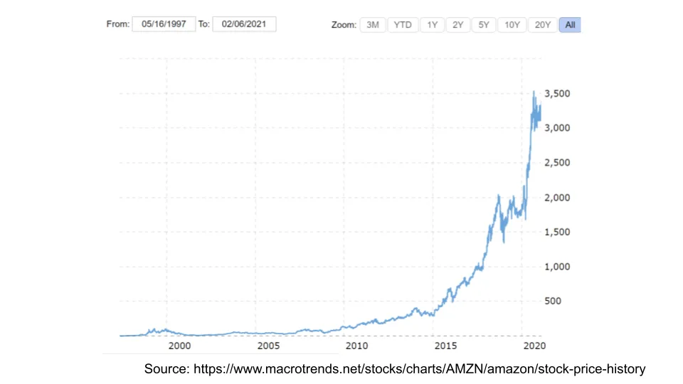

## À retenir

L’avantage comportemental dans l’investissement vient de la capacité à faire des choses impopulaires\. Tout le monde aime jouer\, l’essentiel est d’évaluer son risque de manière appropriée\.

## Aspect comportemental et pourquoi c’est difficile

John Huber aime partager l\'« avantage » dans lequel on peut investir [three main sources:](https://sabercapitalmgt.com/what-is-your-edge/ 'edge')

1. Avantage informationnel \- vous avez plus ou de meilleures informations
2. Avantage analytique \- votre analyse de ces informations est meilleure
3. Avantage comportemental \- votre état d’esprit et vos actions

Je crois que les avantages en matière d’information et d’analyse continuent de diminuer\, et ne sont déjà pas très importants\, même pour les pros\. Rappelez\-vous que c’est le [relative difference](/writing/relative_billionaire 'relative') C’est ce qui compte\, pas le niveau absolu\. Si vous utilisez des données satellites et que votre concurrent en utilise aussi\, vous n’avez pas d’avantage informationnel\. Si votre processus de diligence détaillé est le même que celui d’un autre [Tiger cub](https://en.wikipedia.org/wiki/Tiger_Management 'Tiger') Parce que vos supérieurs travaillaient ensemble auparavant\, vous n’avez pas un avantage analytique\.

Je crois aussi que l’avantage comportemental ne diminue pas\, et continuera à être un facteur de différenciation pour les retours financiers\. La vitesse de transfert d’informations a changé\, les méthodes analytiques sont bien connues\, mais les humains se comportent toujours de la même façon\.

Quelques exemples d’avantage comportemental \:

**À court terme vs à long terme\.** Si tu avais mis 100 \$ dans le S\&P 500 en 1990\, tu aurais dix fois ton argent cette année\. Ça semble être un gros chiffre\.

En moyenne\, vous auriez gagné \~8 \% par an\. Cela semble être un petit chiffre\.

Cette différence de « ressenti » là\-bas explique pourquoi les gens peuvent gagner le grand chiffre\. La capitalisation prend du temps à faire son travail \; on est payé pour la patience\.

**Risque contre ruine\.** Quand on pense à investir sur le long terme\, peu importe combien vous gagnez si vous le perdez tout\. Un gain de 10 000 \% suivi d’une chute de 100 \% reste un résultat horrible\. Éviter le risque de ruine\, et « rester dans le jeu »\, c’est la seule chose qui compte\. Ne me croyez pas\, voici Howard Marks et Charlie Munger \:

> « Ainsi\, plutôt que de simplement chercher des profits potentiels\, nous accordons la plus haute priorité à la prévention des pertes\. Nous sommes convaincus que\, surtout dans les marchés opportunistes où nous travaillons\, « si nous évitons les perdants\, les gagnants se débrouilleront d’eux\-mêmes\. » \- Howard Marks

> « C’est remarquable à quel point des gens comme nous ont tiré un avantage à long terme en essayant d’être systématiquement pas stupides\, au lieu d’essayer d’être très intelligents\. » \- Charlie Munger

**Ne rien faire contre faire quelque chose\.** Les gestionnaires de fonds professionnels sont incités à refaire leur portefeuille\, puisqu’ils ont eux\-mêmes des clients à satisfaire\. Imaginez la réunion suivante \:

> Client \- « Alors\, quoi de neuf dans le portfolio \? »

> Investisseur \- « Rien\, on est toujours dans la librairie dont on a parlé\. »

> Client \- « Ce n’était pas la même action que l’année dernière \? »

> Investisseur \- « Oui\, et le même qu’il y a quatre ans\. En fait\, nous n’avons rien fait\. »

> Client \- « Alors pour quoi je te paie \? »

C’est pourquoi nous voyons des actions comme Amazon \> 100 fois au cours de notre vie\, et que nous ne voyons pas les gestionnaires actifs faire de même\. Si tout le monde _a_ Pour effectuer des échanges afin de garder leur emploi\, ne rien faire peut en fait vous donner un avantage\.

**Ennuyeux vs excitant\.** Pourquoi les comportements ci\-dessus sont\-ils difficiles \? Parce qu’ils le sont _ennuyeux_\. Nous aimons l’activité et détestons rester immobiles\. Il est difficile de se vanter lors d’un cocktail que ses gains sont petits\, lents et simples\. Tout comme ["sin stocks" need to have higher expected excess returns](https://www.aqr.com/Insights/Perspectives/Virtue-is-its-Own-Reward-Or-One-Mans-Ceiling-is-Another-Mans-Floor 'asness')\, les comportements « d’ennui » en stock vous donnent aussi un avantage\.

Après avoir suggéré tout ce qui précède\, est\-ce que je m’attends à ce que quelqu’un suive \? Devrait\-on simplement acheter le S\&P et aller dormir \?

Non\, pas vraiment\. Seigneur\, rends\-moi chaste – mais pas encore\. C’est un excellent plan\, mais trop difficile à suivre pour la plupart des gens\. Gardant à l’esprit que ce n’est pas un conseil d’investissement\, ajoutons un petit ajustement au portefeuille \:

Une des principales raisons pour lesquelles les gens ne suivent pas un tel plan est que **Nous aimons tous le jeu\.** Nous verrons des opportunités qui semblent trop belles pour être vraies \(indice \: elles le sont\)\, et nous sommes tentés de nous joindre à nous\. Je fais ça tout le temps\, malgré tout ce qui précède\.

Sachant que c’est le cas\, **Avoir un faible pourcentage du portefeuille dédié aux paris sauvages** Cela semble être un compromis raisonnable pour notre propre comportement faillible\. Plutôt que de résister à la tentation pour toujours \(ce qui est peu probable\)\, une meilleure approche est d’anticiper les défis comportementaux susceptibles de survenir\.

Beaucoup de connaissances financières courantes sont de bons conseils \(diversifier\, investir à bas coût\, etc\.\)\, mais nous oublions souvent que les gens veulent un moyen de jouer\. Cela finit par se retourner contre vous lorsque les gens ne peuvent plus résister et prennent trop de risques dans un moment de faiblesse\. Cela n’aide pas que vous ayez investi dans un fonds indiciel pendant 10 ans avant de le retirer pour vendre une action avec un risque de baisse illimité\.

À la place\, disons que vous mettez de côté 5 \% de votre capital pour investir [Fyre festival time shares](https://en.wikipedia.org/wiki/Fyre_Festival 'fyre') et le dernier système pump and dump\. Vous pourrez satisfaire à la fois l’envie de jouer quand elle se présente\, mais jamais risquer votre gagne\-pain\. C’est une approche un peu similaire à la [Kelly criterion](/writing/kelly 'kelly') dont nous avons déjà parlé\.

Si vous perdez tous les 5 \%\, c’est dommage\, mais vous avez plafonné votre part de baisse et devez encore réduire le risque si vous voulez parier à nouveau\. Et si vous êtes tombé sur le prochain Amazon\, c’est fantastique\.

**Le meilleur plan d’investissement est celui auquel vous pouvez réellement vous tenir\.** Ce n’est peut\-être pas la solution financièrement optimale\, mais c’est une solution axée sur le comportement qui pourrait vous aider à satisfaire votre envie de jeu\.
