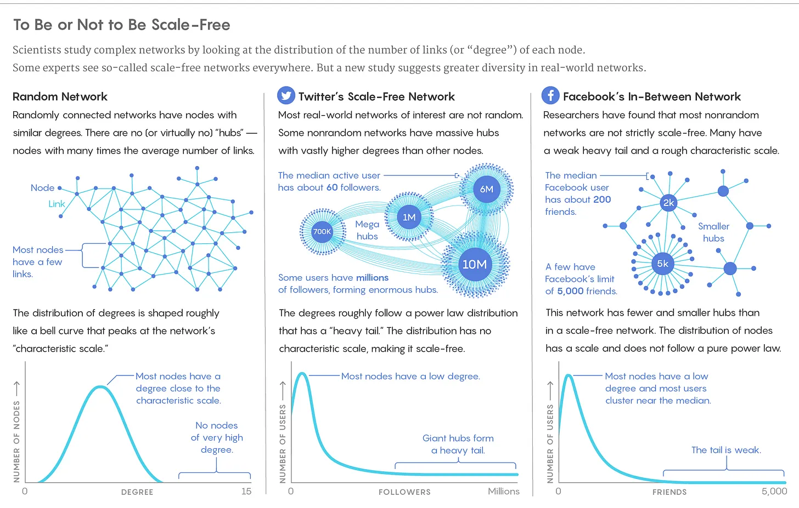

## Points à retenir

Certaines compétences dans la vie ont une variabilité nettement plus grande que d’autres\, ce qui est utile à savoir quand on décide combien d’efforts fournir plus en marge\.

## Plafonds de compétence dans la vie

J’ai beaucoup joué à des jeux de rôle \(RPG\) sur PC quand j’étais plus jeune [^1]\. Dans les RPG\, vous contrôlez un personnage qui gagne en force au fil du temps au fur et à mesure que vous accomplissez des quêtes\. Parmi les plus populaires\, on trouve [Final Fantasy, World of Warcraft, or Guild Wars](https://vgsales.fandom.com/wiki/Best_selling_RPG_games 'rpg') [^2]\.

Il existe un style de jeu courant appelé [min-maxing](https://tvtropes.org/pmwiki/pmwiki.php/Main/MinMaxing 'min')\, où les joueurs personnalisent leurs personnages pour obtenir des performances maximales au coût minimum\. Vous lirez toutes sortes de guides sur la manière « optimale » de jouer\, comme la meilleure [pokemon team](https://gamefaqs.gamespot.com/gameboy/198314-pokemon-yellow-version-special-pikachu-edition/faqs 'pokemon') ou [the right time to level up your Diablo skills](https://gamefaqs.gamespot.com/pc/238750-diablo-ii-includes-expansion-set/faqs/18357 'diablo') [^3]\. J’ai peut\-être passé plus de temps à lire des guides qu’à jouer à des jeux vidéo\.

Comment appliquerions\-nous cela au monde réel \? Si vous vouliez maximiser la vie\, quels domaines valent la peine d’y consacrer du temps\, et lesquels ne le valent pas \?

Il existe de nombreuses façons de définir le problème \:

- Maximisez votre bonheur\, d’une manière ou d’une autre [utilitarianism](https://en.wikipedia.org/wiki/Utilitarianism 'utility')
- Maximiser l’impact sur les autres\, sous une forme ou une autre [effective altruism](https://www.effectivealtruism.org/ 'ea') pour maximiser l’aide à un coût minimal
- Maximisez certaines compétences qui offrent un rapport récompense\/effort élevé

Je veux explorer cette dernière option aujourd’hui\.

Il existe un concept populaire dans la tech de [the 10x engineer](https://www.7pace.com/blog/10x-engineers '10')\, soit de la satire\, soit des affaires sérieuses selon à qui vous parlez\. Un ingénieur 10 fois\, selon les légendes\, est quelqu’un de dix fois meilleur que ses pairs\.

Qu’il s’agisse de mythe ou de réalité\, je veux utiliser ce cadre pour notre problème de maximisation\. Cherchons des endroits où nous pouvons être dix fois meilleurs que la moyenne\, voire 1 000 fois meilleurs\. Si le meilleur performant est bien meilleur\, il y a plus de marge de progression\, et probablement un ratio récompense\/effort plus élevé\.

Pour simplifier\, nous allons d’abord exclure les domaines mesurés de manière plus subjective\. Ma cousine peut penser que ma newsletter est dix fois meilleure que d’autres\, mais j’ai d’une certaine façon l’impression qu’elle est biaisée\. Nous laisserons des domaines larges comme l’art\, les performances\, la nourriture pour que quelqu’un d’autre puisse l’analyser [^4]\.

Nous commencerons par le domaine du sport physique\. Usain Bolt est l’homme le plus rapide du monde\, et il est figurativement dix fois meilleur que nous tous\. Cependant\, si l’on traduit réellement sa vitesse par rapport à celle de l’humain moyen\, il finit par être seulement \~2 fois plus rapide\. Cela demande beaucoup plus de travail acharné et de chance pour devenir aussi bon qu’il est\, et il est largement récompensé pour cela\, mais la différence objective n’est pas si grande\, ce qui implique que le rendement marginal de l’effort est faible\.

Le record du saut en hauteur de 2\,45 m a été établi par [Javier Sotomayor](https://www.topendsports.com/sport/athletics/record-high-jump.htm 'jump')\. Je n’ai pas de chiffre pour la personne moyenne\, mais je viens d’essayer de sauter sur mon lit\, et je vais utiliser 1m comme estimation prudente\. Toujours pas 10x\.

Le record du monde du soulevé de terre est détenu par [Hafthor Bjornsson](https://www.espn.com/video/clip/_/id/29126803 'hafthor')\, plus connue sous le nom de la Montagne de Game of Thrones\, qui soulevait 1 104 livres\. Cela semble \(et c’est\) beaucoup\, mais c’est seulement \~3 fois plus lourd qu’un homme entraîné moyen\.

Adieu [faster, higher, stronger](https://en.wikipedia.org/wiki/Olympic_symbols#:~:text=The%20Olympic%20motto%20is%20the,who%20was%20an%20athletics%20enthusiast. 'wiki')\.

Juste pour le plaisir\, je voulais voir si nous pouvions trouver des expériences qui nous apportent dix fois plus de bonheur\, d’une manière biologique ou chimique\.

Il est difficile de mesurer objectivement le bonheur\, et je vais utiliser [dopamine](https://www.healthline.com/health/dopamine-effects#definition 'dope') comme mon indicateur objectif\. La dopamine est une substance chimique associée au plaisir \; plus il y a de dopamine libérée\, plus le plaisir ressent est [^5]\.

J’ai essayé de chercher des événements provoquant des pics élevés de dopamine\, que je supposais être induits par la drogue\. Il était difficile de trouver le potentiel de plaisir des narcotiques sur les humains en ligne\, comme si les gens ne voulaient pas que vous preniez de la drogue ou autre\. Ce que j’ai finalement trouvé\, c’est une étude sur des rats sur [heroin](https://onlinelibrary.wiley.com/doi/abs/10.1002/syn.890210207 'heroin')\, montrant une augmentation de 4 fois la dopamine lorsqu’il est dopé [^6]\. C’est élevé\, mais plus bas que ce à quoi je m’attendais et ce n’est toujours pas le 10x que nous voulons [^7]\.

Nous devons finalement quitter nos domaines de physique\, chimie et biologie\, pour aller vers des domaines plus abstraits [^8]\.

Quelqu’un peut\-il être dix fois plus influent qu’une autre personne \?

J’ai regardé les ventes de livres\, les abonnés Twitter et Instagram comme moyen de quantifier l’influence\. Ce sont des mesures imparfaites\, mais elles devraient donner une idée de l’échelle\.

Harry Potter et la Pierre philosophale s’est vendu en 120 mm\, contre une moyenne de \~250 exemplaires vendus par l’auteur\.

Obama compte 129 millions d’abonnés sur Twitter\, contre \~1 000 pour un utilisateur moyen de Twitter\.

Ronaldo compte 264 millions d’abonnés sur Instagram\, contre un nombre moyen d’abonnés d’utilisateurs Instagram de \~200\.

C’est clairement plus de 10 fois\, même en sous\-estimant beaucoup\. J’ai tracé ces nouvelles zones par rapport aux zones physiques\, en utilisant une échelle logarithmique pour tenir compte des énormes différences de magnitude \; chaque ligne représente une augmentation de 10 fois\. Voir les notes de bas de page pour les sources [^9]\.

Nous avons trouvé des voies où nos efforts peuvent évoluer\, et les rendements marginaux décroissants ne diminuent pas aussi rapidement\. Le plafond est beaucoup plus élevé dans une telle zone\, et nous avons une plus grande probabilité de différenciation par rapport à la moyenne\.

Les personnes désireuses de devenir influenceuses réalisent implicitement \:

1. Il est pratiquement possible d’être radicalement différent de la moyenne\. En se rappelant ce dont nous avons parlé [relative differences, not absolutes, mattering more](/writing/relative_billionaire 'relative')\, c’est une façon de signaler visiblement un statut élevé aux autres\.
2. Bien que la probabilité soit faible\, le gain lorsque vous avez « réussi » est bien plus élevé que le coût\. C’est un pari\, mais qui n’aime pas jouer \? Pas étonnant que nous soyons tous accros\.

J’ai aussi tracé la richesse de la personne la plus riche par rapport à la richesse moyenne des ménages\, et c’est une différence similaire de 100 000 fois\. Les récompenses financières sont aussi des choses qui n’ont pas de plafond\.

Beaucoup de ces domaines « évolutifs » ont été favorisés par la technologie\. La technologie a abstrait la couche physique de l’effort de beaucoup de choses\, transformant ce qui était autrefois des coûts variables en coûts fixes\. En aplanissant la croissance des coûts\, la technologie a permis la croissance de la récompense\.

Dans un passé lointain\, si vous vouliez diffuser une nouvelle idée\, vous étiez limité par le nombre d’endroits que vous pouviez visiter\. Avec l’invention de [the printing press](https://www.history.com/news/printing-press-renaissance)\, la vie est devenue plus facile\, mais vous avez quand même supporté des coûts pour chaque pièce physique imprimée\, limitant votre portée\. Maintenant\, vous pouvez envoyer des idées gratuitement\, à n’importe qui\, instantanément\. Il est bien plus facile d’obtenir une croissance effrénée qu’avant\.

Distribution plus rapide\, croissance plus élevée\, résultats plus solides\.

Certains d’entre vous pourraient relier cela aux lois de puissance\, et au fait que les réseaux peuvent comporter des parties bien plus importantes que d’autres\. [There's some debate over whether power laws exist in real life](https://www.quantamagazine.org/scant-evidence-of-power-laws-found-in-real-world-networks-20180215/ 'real')\, mais c’est bien le même concept – il existe des systèmes où les personnes\, les choses ou les parties sont bien plus significatives [^10]\.

Pour être clair\, je ne dis pas que la vie n’a qu’à maximiser son influence ou sa richesse\. Cependant\, connaître la limite supérieure potentielle d’un domaine aide à déterminer combien d’efforts vous voudrez fournir et où vous devez s’arrêter\. Être dix fois meilleur implique généralement de s’éloigner du physique pour passer à la technologie\.

## Autres

1. [The first 10 years of Stripe payment APIs](https://stripe.com/blog/payment-api-design 'api')
2. [How to read economics papers: randomised controlled trials](https://www.youtube.com/watch?v=s-_3s3OMeqs&feature=emb_title 'rct')
3. [Learn your attachment style to become a better parent](https://aeon.co/essays/learn-your-own-attachment-style-to-become-a-better-parent 'attachment')
4. [Introducing 'Food Grammar,' the unspoken rules of every cuisine](https://www.atlasobscura.com/articles/do-italians-eat-spaghetti-and-meatballs 'food')
5. [Salastina’s Happy Hour brings you live musical performance every Tuesday](https://www.salastina.org/concerts 'salastina')\; inclut une prochaine session du compositeur Disney Alan Menken\, l’une des rares [EGOT](https://en.wikipedia.org/wiki/List_of_people_who_have_won_Academy,_Emmy,_Grammy,_and_Tony_Awards 'EGOT') Vainqueurs dans le monde

[^1]: Étonnamment\, ce post était _non_ Inspiré par le [Diablo 2 remaster news](https://diablo2.blizzard.com/en-us/ 'd2')\; Je réfléchis à ce concept depuis un moment\.

[^2]: Je regroupe ici plusieurs styles de RPG pour la commodité\, oui je sais que WoW est un MMORPG et c’est un type de jeu tellement différent que tu n’arrives même pas à croire que je les ai mis dans le même panier\, maintenant sors de ma pelouse\.

[^3]: Il y avait quelques raisons de le faire dans D2\, [given the skill tree](http://classic.battle.net/diablo2exp/skills/skillplanning.shtml 'd2')\; Je pense que les points de rupture ont aussi pu être une raison\.

[^4]: J’ai l’impression d’avoir vu de l’art\, vu des performances\, et mangé des aliments 10 fois meilleurs que la moyenne\, mais nous devons limiter notre champ d’action ici et j’ai un article à écrire\.

[^5]: C’est une simplification\, comme toujours\. [Research](https://www.ncbi.nlm.nih.gov/pmc/articles/PMC5820768/ 'paper') a fini par croire que la dopamine joue un rôle à la fois dans la motivation et la démotivation\. « Ces données\, ainsi que d’autres rapports\, soutiennent une vision nettement plus nuancée de la fonction des neurones dopaminergiques\, où la libération accumbale de dopamine est modulée différemment par des stimuli affectifs positifs et négatifs pour favoriser des comportements adaptatifs\. »

[^6]: J’ai aussi trouvé une étude sur les rats sur [coke](https://www.pnas.org/content/102/29/10023 'rat') mais je ne peux pas interpréter les résultats\. Je crois que les chiffres que je veux sont dans la figure 4\, si quelqu’un veut bien regarder\.

[^7]: J’avais cette idée en tête que les médicaments provoquaient une augmentation de plaisir de 100 fois\, mais je ne trouve ni le chiffre ni la source nulle part\. Aussi\, je compte juste le pic ici\, plutôt que de traiter un événement dix fois plus long comme étant dix fois meilleur\.

[^8]: On pourrait dire que la croissance biologique des générations suit une échelle de 10 fois ou plus\. Par exemple\, les descendants d’une personne pourraient se compter par millions\. Je me limite ici à des événements uniques au cours de la vie\.

[^9]:
    [Sprints](https://trackspikes.co.uk/average-sprinting-speed/ 'sprint')\, [high jump](https://www.topendsports.com/sport/athletics/record-high-jump.htm 'jump')\, soulevé de terre [here](https://www.espn.com/olympics/weightlifting/story/_/id/29126863/hafthor-bjornsson-breaks-world-record-501-kilogram-deadlift 'lift') et [here](https://strengthlevel.com/strength-standards/deadlift/lb 'lift')\, ventes de livres [here](https://nonfictionauthorsassociation.com/how-many-books-can-you-expect-to-sell-the-truth-about-book-sales-and-the-keys-to-generating-income-from-publishing/ 'book') et [here](https://en.wikipedia.org/wiki/List_of_best-selling_books#List_of_best-selling_regularly_updated_books 'book')\, twitter [here](https://kickfactory.com/blog/average-twitter-followers-updated-2016/ 'tw') et [here](https://en.wikipedia.org/wiki/List_of_most-followed_Twitter_accounts 'tw') \(J’ai arrondi le nombre d’abonnés selon la date de l’article\)\, Instagram [here](https://www.hashtagsforlikes.co/blog/instagram-followers-how-many-does-the-average-person-have/ 'insta') et [here](https://en.wikipedia.org/wiki/List_of_most-followed_Instagram_accounts 'insta')\, richesse [here](https://www.marketwatch.com/story/whats-your-net-worth-and-how-do-you-compare-to-others-2018-09-24 'wealth') et [here](https://en.wikipedia.org/wiki/List_of_Americans_by_net_worth 'wealth')\. Je voulais aussi faire des comptes TikTok mais je n’ai pas trouvé de bonne source de données\.
    [^10]: Que vous soyez une loi de puissance\, une normale logarithmique ou une autre distribution\, il existe certains points de données beaucoup plus importants que les autres\, et c’est le point principal que j’essaie de faire\.
