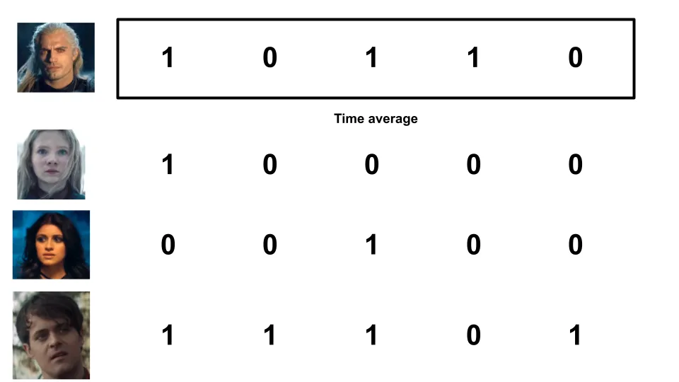

## À retenir

Savoir si un processus est ergodique ou non est essentiel pour savoir combien de risques prendre\. L’investissement et la richesse sont des processus non ergodiques\, ce qui implique que nos premières réflexions sur les valeurs attendues sont très erronées\.

---

J’en ai entendu parler [ergodicity](https://en.wikipedia.org/wiki/Ergodic_process 'wiki') avant\, mais je n’ai pas vraiment compris avant de la regarder [this video](https://www.youtube.com/watch?v=VCb2AMN87cg 'youtube') par Ergodicity TV\. C’est un concept important mais cela semble plus connu en physique qu’en finance\. Je veux essayer de l’expliquer avec mes propres mots ci\-dessous\.

Nous connaissons différents types de « moyennes » \- moyenne\, médiane\, mode [^1]\. Concentrons\-nous sur la moyenne pour aujourd’hui\, et prenons\-la comme la valeur attendue d’un événement aléatoire [^2]\. **La façon dont nous définissons la valeur attendue peut nous donner des résultats radicalement différents\, changeant notre état d’esprit quant à l’attractivité des paris et sur le montant à miser\.**

**L’ergodicité signifie que la moyenne de l’ensemble est la même que la moyenne temporelle\.** Quelque chose qui n’est pas ergodique signifie l’inverse\, que la moyenne d’ensemble n’est pas la moyenne temporelle\.

Oui\, je ne suis pas sûr de ce que signifient ensemble et temps ici [^3] De toute façon\, regardons donc un exemple de lancer une pièce\.

Supposons qu’un type au hasard lance une pièce 5 fois\, obtenant face et pile un peu plus\. Nous pouvons calculer la moyenne de temps pour cette simulation en obtenant le nombre moyen de faces pour une personne sur une période donnée\. Il y a 3 faces sur 5 lancers\, donc ça fait 0\,6 face \(3 divisé par 5\)\.

Supposons que quelques personnes de plus lancent des pièces\. Nous obtenons quelque chose comme ci\-dessous\, où je représente face comme 1 et pile comme 0 pour plus de commodité \:

Il existe deux types de moyennes que nous pouvons utiliser ici\. La première est la moyenne temporelle d’avant\, où l’on obtient le **Moyenne sur une certaine période pour une personne\.**

La seconde est la moyenne d’ensemble\, où l’on obtient le **Moyenne sur une période pour plusieurs personnes\.**

La grande question à laquelle l’ergodicité tente de répondre est la suivante \: **Doit\-on s’attendre à ce que ces deux moyennes restent les mêmes à long terme \?**

Si nous réfléchissons un moment\, nous pourrons raisonner que nous devrions le faire\, dans cet exemple\. Un tirage à pile ou face est aléatoire et ne dépend pas du résultat précédent\. La moyenne d’ensemble est la même que la moyenne temporelle à long terme\. Avec suffisamment de lancers au sort\, on s’attendrait à ce que ces moyennes soient de 0\,5 [^4] \.

C’était beaucoup de mots pour montrer quelque chose que vous croyiez probablement déjà\, alors pourquoi est\-ce que je pense que c’est si important \?

Poursuivons sur l’exemple \: les gens parient sur le pile ou face\. Tout le monde commence avec 1 \$\, reçoit 50 \% de bénéfice s’il gagne\, et paie 40 \% de sa mise s’il perd\. Par exemple \:

Plutôt que de se limiter au tirage à pile ou face eux\-mêmes\, pensons à la richesse que chaque personne possédra\. Si nous tracons ces points\, **Doit\-on s’attendre à ce que la moyenne temporelle de la richesse d’une personne soit la même que la moyenne d’ensemble de la richesse de chacun à long terme \?**

Ou autrement dit \: **Voudriez\-vous prendre un pari pareil** Si on le propose à plusieurs reprises \?

La valeur attendue d’un tel pari est de 50 \% fois 1\,50 \$\, plus 50 \% multiplié par 0\,60 \$\, pour obtenir 1\,05 \$\. Avec une valeur attendue positive\, il semble que nous devrions continuer à parier\. Simulons quelques lances de pièce pour voir ce qui se passe\.

J’ai codé une simulation de pile ou face dans ce projet [jupyter notebook](https://colab.research.google.com/drive/1KI_PPhtXVQDfVGRFbi4pl0ZIhL2Y4x2X?usp=sharing 'colab') [^5] \. En exécutant le scénario ci\-dessus pour une personne qui fait 100 piles ou faces\, on remarque que sa richesse augmente jusqu’à 4 \$\, avant de tomber essentiellement à 0 \$\.

Hmm\, peut\-être qu’on a un scénario malchanceux\. Répétons cela avec 100 personnes à la place\, en faisant toujours 100 lancers de pièce\. Je calculerai aussi la richesse moyenne \(moyenne d’ensemble\) à chaque lancer de pièce et la représenterai avec une ligne rouge pointillée [^6] \.

Les deux graphiques ci\-dessous sont identiques en termes de données \; Je rescale simplement avec un axe logarithmique pour une meilleure visualisation\.

Quelque chose d’étrange se passe\. On voit un outsider chanceux qui a atteint 1 000 \$ de richesse\, et on constate aussi que la richesse moyenne \(ligne rouge pointillée\) continue d’augmenter\. Cependant\, remarquez que **La majorité de ces personnes ont perdu de l’argent \!** Dans cette simulation\, 94 des 100 personnes ayant joué ont fini avec moins que 1 \$ au départ\.

Si vous n’êtes pas convaincu\, le carnet contient un exemple avec mille personnes \; n’hésitez pas non plus à ajuster les paramètres\.

Ce que nous observons\, c’est que même si la valeur espérée est positive et que la moyenne de l’ensemble augmente\, la moyenne temporelle pour une seule personne diminue généralement\. **La moyenne de l’ensemble du « système » augmente\, mais cela ne signifie pas que la moyenne d’une seule unité augmente\.** Les grands cas aberrants faussent la moyenne\, mais la majorité des gens perdent\.

Cela mérite d’être répété\. **Même lorsque la valeur attendue d’un tel pari était positive\, 94 personnes sur 100 ayant joué à un tel jeu perdent la majeure partie de leur argent\.** Ces résultats se produisent dans le même système\, mais vous donnent l’avis inverse sur la question de savoir si vous voulez jouer\.

La richesse dans ce scénario est non ergodique\, puisque la richesse future dépend de la richesse du passé \(dépendance du chemin\)\. La moyenne d’ensemble n’est pas égale à la moyenne temporelle\.

**La richesse en général est aussi non ergodique**\, puisque le rendement de votre portefeuille d’investissement demain dépend de la taille et de l’allocation actuelles du portefeuille aujourd’hui\.

Concrètement\, cela signifie pour l’investissement \:

1. **Faites attention à la façon dont vous appliquez les valeurs attendues\,** Puisque vous voulez savoir si c’est la moyenne de l’ensemble du système\, ou ce à quoi un individu comme vous devrait s’attendre en moyenne\. Si vous avez des probabilités en tête\, modélisez\-les et voyez ce que cela implique

2. **Ce qui peut sembler attirant au premier abord est souvent terrible\,** car un petit nombre de valeurs aberrantes faussent la moyenne à la hausse [^7]\.

3. **Si vous n’aimez pas les cotes que vous voyez\, essayez de changer le jeu\.** Le post précédent\, j’ai fait sur [the Kelly Criterion](/writing/kelly 'kelly') Il s’agit de dimensionner votre mise\, ce qui influencera combien vous gagnez ou perdez\.

En résumé\, l’ergodicité concerne la question de savoir si la moyenne à long terme sur de nombreuses simulations est la même que la moyenne sur une simulation\. Quand les choses ne sont pas ergodiques\, et que beaucoup de choses dans la vie ne le sont\, il faut être extrêmement prudent quant au niveau de risque que l’on prend\.

## Pour aller plus loin

1. [Ergodicity](https://squidarth.com/math/2018/11/28/ergodicity.html 'squid')
2. [What are we weighting for?](https://researchers.one/articles/20.04.00012 'paper')
3. [The ergodicity problem in economics](https://www.nature.com/articles/s41567-019-0732-0 'paper')

Merci à [Tyler Richards](http://www.tylerjrichards.com/)\, et les membres du Recurse Center Vaibhav Sagar\, Sidharth Shanker\, SengMing Tan\, Alex Yeh pour leur avis à ce sujet\.

[^1]: [In case you need a refresher](https://www.purplemath.com/modules/meanmode.htm)\, la moyenne est la moyenne où l’on additionne tous les nombres et on divise par le nombre de nombres\, la médiane est le nombre du milieu\, et le mode est le nombre le plus courant

[^2]: Peut\-être que je le suis [conflating mean and expected value here](https://stats.stackexchange.com/questions/30365/why-is-expectation-the-same-as-the-arithmetic-mean 'stats')\, mais je pense qu’on peut simplifier pour cette explication

[^3]: Hmm

[^4]: 50 \% de chances d’avoir face et 50 \% de chances d’avoir pile par définition

[^5]: Quelqu’un devrait vraiment vérifier mon code\. Je pense aussi qu’il y a une façon plus élégante de le coder en moins de lignes\.

[^6]: Ce n’est pas en fait la moyenne théorique de l’ensemble\, qui serait 1\,05 à la puissance du nombre de lancers de pièce et augmenterait de façon linéaire\. Ici\, je fais simplement la moyenne des résultats réels\, c’est pourquoi la ligne n’augmente pas continuellement \(elle augmente de façon monotone\)

[^7]: La richesse a un plancher à 0 \$ mais pas de plafond\, donc la moyenne est aussi illimitée je pense
