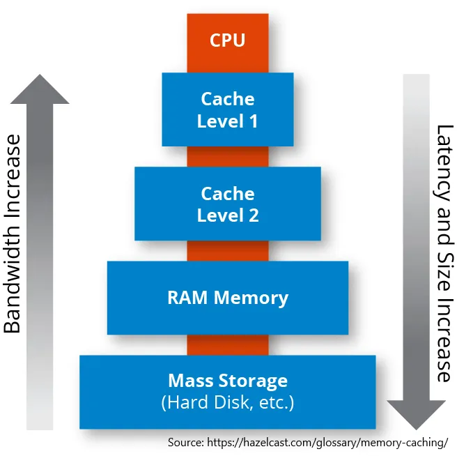

## À retenir

Un algorithme est un processus défini à suivre pour obtenir un résultat souhaité\. Une grande partie de notre vie est décidée par des algorithmes\. Savoir quels algorithmes suivre peut aboutir à une prise de décision plus efficace et efficiente\.

## Algorithmes dans la vie

J’ai récemment relu [Algorithms to Live By](https://algorithmstoliveby.com/ 'algo')\, un livre de Brian Christian et Tom Griffiths sur la façon dont les algorithmes peuvent nous aider à être plus efficaces dans nos vies\. Ayant commencé la programmation l’année dernière\, j’en ai tiré davantage cette fois\-ci\.

Un algorithme est un processus\, et vous pouvez le voir comme des instructions à suivre pour accomplir une tâche\. Par exemple\, apprendre à additionner des nombres est un algorithme simple [^1]\.

Des instructions plus complexes peuvent calculer des résultats pour d’autres problèmes de la vie\. Les taux d’intérêt\, le classement dans les recherches web ou les fils d’actualité des réseaux sociaux sont tous basés sur les résultats des algorithmes\. Le livre passe en revue de nombreux algorithmes de ce type et les relie à des problèmes que vous pourriez rencontrer personnellement\.

Il est trop difficile d’expliquer chaque algorithme qu’ils mentionnent [^2]\, donc à la place\, je fais de courts points forts de certains\, et je me concentre généralement sur les points qualitatifs\, pas quantitatifs\.

De plus\, la plupart des algorithmes reposent sur certaines hypothèses \; plutôt que de les spécifier à chaque fois\, prenez cela comme acquis lors de la lecture\. J’ajouterai certaines hypothèses dans les notes de bas de page pour ceux qui sont intéressés\.

Parmi les problèmes abordés\, on trouve \:

- Quand arrêter les entretiens pour avoir une chance maximale d’obtenir le meilleur résultat
- Quand faut\-il arrêter d’explorer de nouvelles options pour profiter de celles que vous connaissez déjà
- Comment planifier vos tâches en fonction de votre objectif

Regardons notre premier algorithme\, sur le moment où il faut arrêter de travailler sur un problème\.

## Arrêt optimal

Si vous évaluez les options \(candidats à un emploi\, offres de logement\, places de parking\, etc\.\)\, il y a un compromis entre le temps passé à choisir et la probabilité de choisir la « meilleure »\. C’est ce qu’on appelle le [secretary problem](https://en.wikipedia.org/wiki/Secretary_problem 'prob') \- Supposons que vous embauchiez une secrétaire\, combien d’entretiens devriez\-vous faire pour avoir les meilleures chances de trouver la meilleure \?

Dans ce cas\, il y a un pourcentage précis à utiliser\. Vous devriez attendre d’avoir vu 37 \% du vivier de candidats\, puis prendre le meilleur candidat suivant que vous voyez [^3]\. Par exemple\, si vous avez eu 100 candidats\, attendez d’avoir vu les 37 premiers\, puis choisissez le prochain candidat qui est meilleur que tous ceux que vous avez vus jusqu’à présent\.

C’est le point mathématiquement optimal avec la plus grande chance de choisir la meilleure personne pour le poste\. Si vous arrêtez trop tôt\, vous risquez de manquer quelqu’un lors de l’entretien plus tard\. Si vous arrêtez trop tard\, vous perdez du temps [^4]\.

## Exploit exploré

Similaire à la situation d’arrêt optimal\, il y a un compromis entre la collecte d’informations \(explorer\) et le plaisir \(exploiter\)\. Supposons que vous soyez dans un casino et que vous vouliez décider sur quelles machines jouer\. Vous voulez maximiser vos gains\, mais vous ne connaissez pas les chances exactes pour les machines \(si vous le connaissiez\, vous joueriez la meilleure\)\.

Dans ce cas\, il y a un chiffre\, appelé le [Gittins Index](https://www.cs.cornell.edu/courses/cs6840/2017sp/lecnotes/6840sp17R_Kleinberg.pdf 'gittins')\, qui vous donne la machine optimale à jouer [^5]\. Si vous connaissez le nombre de victoires\, de défaites et la valeur que vous accordez aux gains futurs\, vous pouvez calculer des valeurs précises pour chaque choix\. Quelques propriétés intéressantes \:

- Si vous jouez la machine optimale et que vous gagnez à nouveau\, il est logique de continuer à jouer sur cette machine
- Si vous jouez sur la machine optimale et que vous perdez une fois\, il peut quand même être logique de continuer à jouer sur cette machine
- Une machine totalement inconnue peut être préférable à des machines connues pour gagner souvent\, et cette machine inconnue devient plus précieuse plus on valorise les gains futurs

Quelques autres implications connexes \:

- L’exploration a un impact plus important plus jeune dans la vie \; que les bébés mettent tout dans leur bouche a du sens de leur point de vue
- L’exploitation a un impact plus important plus tard dans la vie \; d’où la réduction de leur réseau social par les personnes âgées et la préférence pour retourner dans des restaurants favoris

## Tri

Le livre donnait quelques exemples d’algorithmes de tri\, couramment utilisés en programmation\. Par exemple\, retourner les résultats de recherche nécessite de trier les plus pertinents pour vous\.

Je vais remettre pour un autre jour une discussion plus détaillée sur le tri des algorithmes\, car ils demandent de la compréhension [time complexity](https://www.bigocheatsheet.com/ 'time')\. Voici quelques enseignements qualitatifs \:

- Certaines méthodes de tri peuvent être nettement plus efficaces que d’autres \(\>10 fois plus rapides\)
- Certains scénarios ne nécessitent pas seulement l’efficacité du tri\. Par exemple\, organiser un calendrier de matchs de saison sportive nécessite également de prendre en compte à quel point la saison sera excitante\. Vous pouvez optimiser l’efficacité du tri\, mais la saison paraîtra moins palpitante
- Plus un tri est efficace\, plus il peut être fragile face aux erreurs accidentelles\. Par exemple\, la « meilleure » équipe pourrait accidentellement être éliminée lors d’un tournoi à élimination directe \(essentiellement un algorithme de tri\) comme la Coupe du Monde [^6]\.

## Mise en cache et mémoire

L’idée d’avoir un cache est d’avoir 1\) une petite section mémoire rapide \(stockage\)\, et 2\) une grande section mémoire lente\. Nous alternerons ensuite entre les deux selon notre intention\. Cela nous permet d’obtenir à la fois une certaine vitesse et une certaine taille pour l’activité souhaitée\.

Par exemple\, vous pourriez avoir vos vêtements préférés dans votre armoire\, et ceux inutilisés dans le grenier\. Vous auriez un accès rapide aux articles que vous utilisez le plus\, mais vous auriez quand même de la place pour ce vilain pull de Noël si vous le souhaitez\. Le caching peut sembler compliqué\, mais vous réaliserez que nous le faisons naturellement pendant la majeure partie de notre vie quotidienne\.

Comment décidez\-vous quels objets doivent être placés dans la section rapide\, et lesquels dans la section ralenti \? Vous pouvez mettre des objets aléatoires\, le plus récent\, le plus gros\, etc\.

Dans ce cas\, garder les articles les plus récents dans la section petite et rapide est le choix optimal\, en raison de ce qu’on appelle [temporal locality](https://www.geeksforgeeks.org/difference-between-spatial-locality-and-temporal-locality/ 'temp')\. Vous aurez plus de chances d’avoir besoin de quelque chose que vous avez utilisé récemment\. Par exemple\, Google Drive met en surbrillance vos fichiers fréquemment utilisés pour un accès rapide\.

## Programmation

La plupart d’entre nous doivent décider comment prioriser les tâches de notre liste de tâches\. Cela nécessite généralement de faire un compromis entre la réactivité \(la rapidité de votre réponse\) et le débit \(ce que vous pouvez accomplir\)\.

Un point clé concernant la planification et la priorisation est de définir votre métrique d’objectif\, car cela détermine quel algorithme vous souhaitez utiliser [^7]\. Maximiser la réactivité se fait au détriment de ce que vous pouvez accomplir \:

Si vous voulez minimiser le retard maximal de tous vos projets [^8]\, le [Earliest Due Date](https://en.wikipedia.org/wiki/Single-machine_scheduling 'EDT') L’algorithme vous dit de commencer par le projet à échéance\.

Si vous voulez minimiser le temps total d’achèvement\, le [Shortest Processing Time](https://en.wikipedia.org/wiki/Single-machine_scheduling 'spt') L’algorithme vous dit de simplement faire la tâche la plus rapide en premier\.

Si vos tâches ne sont pas égales en importance\, alors attribuer un poids à chaque tâche et calculer le ratio de poids sur le temps requis vous aidera à décider quelle tâche effectuer \; choisissez le projet avec le plus de poids dans le temps\.

Concrètement\, cela signifie qu’il vaut probablement la peine d’avoir une discussion avec votre manager sur la façon dont l’équipe perçoit ce compromis\, et sur la méthode qu’il préférerait que vous adoptiez\.

Il y a un autre concept important en planification \: l’idée de [context switching](https://blog.doist.com/context-switching/ 'switch') \- chaque fois que vous devez passer d’une tâche à l’autre\. Le changement de contexte est une perte de temps car ce n’est pas un vrai travail\, mais cela prend du temps et des efforts de votre part\.

Par exemple\, si vous écriviez un e\-mail et que vous êtes interrompu par un message Slack\, il vous faut du temps pour répondre au message Slack\, puis vous rappeler ce que vous vouliez faire pour l’e\-mail\.

Au pire\, le changement de contexte devient thrash\, quand vous n’obtenez rien de productif parce que vous êtes trop occupé à ne changer que de style\. Voici \:

- Dire non aux tâches\, même si les auteurs reconnaissent que nous sommes souvent incapables de le faire
- Travailler de façon plus bête et plus inefficace\. Plutôt que de penser à la meilleure façon de mener vos tâches\, commencez simplement quelque chose et terminez\-le

## Règle bayéise et distributions

Expliquer la règle de Bayes prendrait probablement un article à part entière\, alors prenons\-la comme une règle qui vous aide à prédire la probabilité qu’un événement se produise [^9]\. Ce que les auteurs veulent souligner\, c’est que cela dépend de la distribution d’où proviennent vos événements\. Il y a trois distributions principales à considérer \:

- Loi de la puissance \: plus quelque chose dure longtemps\, plus nous nous attendons à ce que cela continue longtemps\. Par exemple\, si une entreprise croît depuis longtemps\, nous nous attendrions à ce qu’elle continue de croître
- Normal \: les premiers événements sont surprenants\, les événements tardifs sont attendus\. Par exemple\, nous serions surpris par des personnes qui meurent tôt dans la vie\, et non par celles qui meurent tard\.
- Erlang \: les événements ne sont jamais plus ni moins surprenants\. Par exemple\, une distribution sans mémoire d’une roulette ou [the coin flips we discussed last week](/writing/ergodicity 'sub')

## Théorie des jeux

La plupart d’entre nous ont probablement déjà entendu parler de la théorie des jeux\, qui est une façon de penser quelle est la stratégie optimale lors d’une partie de jeu\. Quelques points forts \:

- Si vous jouez trop au\-dessus de votre adversaire\, vous allez penser qu’il a des informations qu’il n’a pas réellement\, et il ne pourra pas penser ce que vous voulez qu’il pense\. Autrement dit\, vous ne voulez pas obtenir _aussi_ Intelligent avec vos stratégies
- Chaque partie à deux joueurs en a au moins un [Nash Equilibrium,](https://en.wikipedia.org/wiki/Nash_equilibrium 'nash') où les deux joueurs choisissent la stratégie optimale pour eux\-mêmes
- Cependant\, trouver l’équilibre de Nash est un problème insoluble\, ce qui signifie qu’il y a des limites à la praticité de la théorie des jeux
- L’équilibre peut aussi ne pas être le meilleur résultat pour tous les joueurs\. [It may be optimal for an individual to compete, but optimal for the group to cooperate.](https://en.wikipedia.org/wiki/Prisoner%27s_dilemma#:~:text=The%20prisoner's%20dilemma%20is%20a,working%20at%20RAND%20in%201950. 'wiki') Nous pouvons quantifier cela comme le « prix de l’anarchie »\, qui mesure l’écart entre coopération et concurrence\.
- Il existe aussi un concept contre\-intuitif connu sous le nom de [mechanism design](https://en.wikipedia.org/wiki/Mechanism_design 'mech')\, ce qui montre que _Aggravation_ Chaque résultat peut en fait améliorer la situation de tout le monde\, en déplaçant l’équilibre

Outre les algorithmes mentionnés ci\-dessus\, les auteurs passent également par \:

- Quand vous pourriez trop ajuster votre processus de décision et ce que vous pouvez faire à ce sujet
- Que faire lorsque les problèmes du monde réel ne sont pas aussi agréables que la théorie et pourquoi il faut assouplir les contraintes
- Comment penser les réseaux d’information et le fonctionnement d’Internet

Dans l’ensemble\, j’ai trouvé que le livre valait la peine d’être lu pour avoir un aperçu des façons intéressantes dont les algorithmes apparaissent dans la vie\. Je l’ai mieux compris _après_ J’apprends un peu d’informatique\, donc garde ça en tête\. J’aurais aussi aimé qu’ils incluent des exemples plus pratiques [^10]\, car appliquer ces résultats à la vie peut être difficile lorsqu’il faut partir de différentes hypothèses\.

[^1]: Assez facile à enseigner aux enfants\, en leur disant de mémoriser des sommes et quand porter un chiffre\, mais étonnamment pas évident lorsqu’on essaie de les implémenter sur ordinateur\, voyez [full adder logic gate](https://www.electronics-tutorials.ws/combination/comb_7.html 'full')

[^2]: On pourrait dire qu’au moment où j’expliquerai tout\, autant l’avoir fait [written the entire book](https://en.wikipedia.org/wiki/P_versus_NP_problem 'p np')

[^3]: [The percentage is 1 divided by e, euler's number.](https://projecteuclid.org/journals/statistical-science/volume-4/issue-3/Who-Solved-the-Secretary-Problem/10.1214/ss/1177012493.full 'problem') La probabilité ne change pas à mesure que le nombre de candidats augmente\, mais elle évolue selon les informations que vous recevez

[^4]: Le problème du secrétaire de base suppose que vous ne pouvez pas revenir vers un candidat que vous avez refusé\, mais il existe des variations qui ressemblent un peu plus à la réalité\.

[^5]: Ce problème est insoluble si les probabilités d’un gain sur une machine changent au fil du temps \; ce qui signifie essentiellement qu’il est insoluble\. Certains problèmes sont insolubles\. Dans ces cas\, assouplir certaines contraintes et accepter des solutions « suffisamment proches » nous aide significativement à structurer le problème\.

[^6]: Ou March Madness\, pour les Américains

[^7]: Seuls 9 \% de tous les problèmes de planification peuvent être résolus efficacement\.

[^8]: C’est\-à\-dire\, prends tous tes projets en retard\, puis le maximum de ceux\-ci\. C’est la métrique que tu veux minimiser\.

[^9]: Voir [here](https://betterexplained.com/articles/an-intuitive-and-short-explanation-of-bayes-theorem/ 'bayes') pour un article qui explique Bayes\. Bayes est peu intuitif \(du moins pour moi\)\, ce qui signifie aussi qu’il est bon de le savoir

[^10]: Pour être juste\, il y a pas mal d’informations dans les notes de bas de page qui développent davantage
