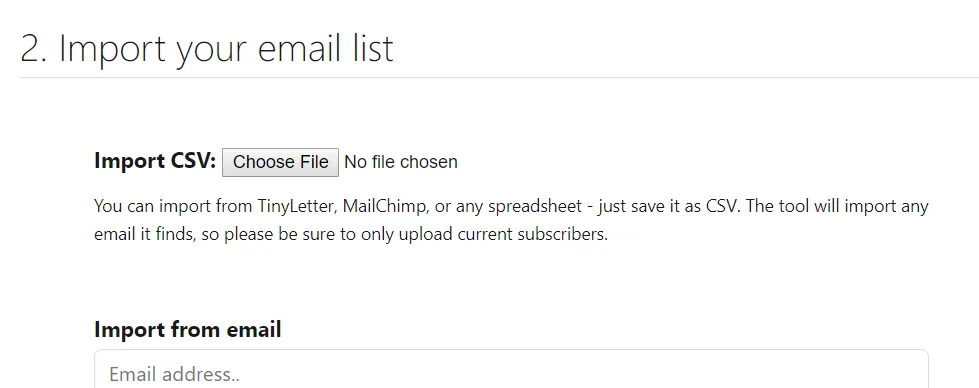
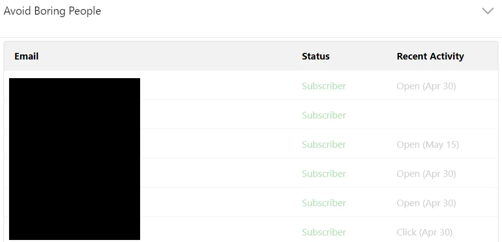
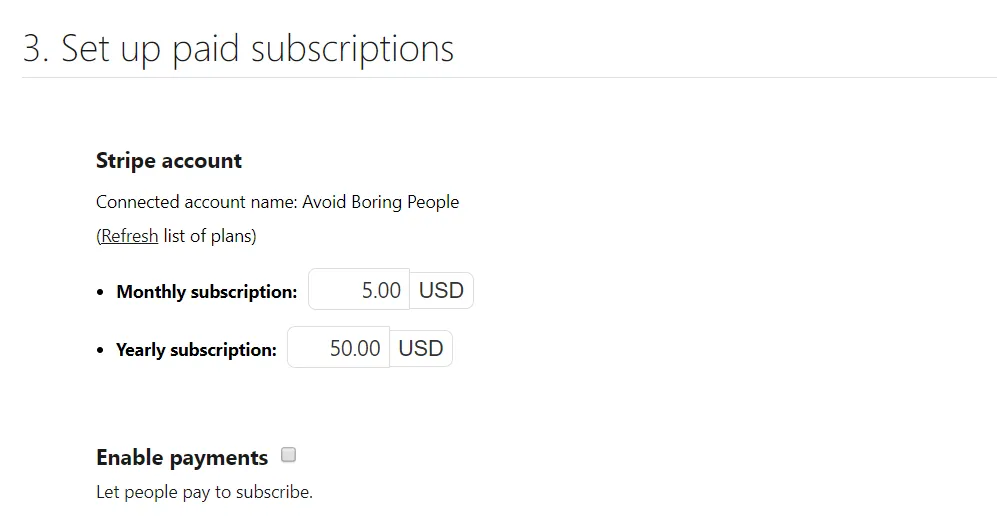
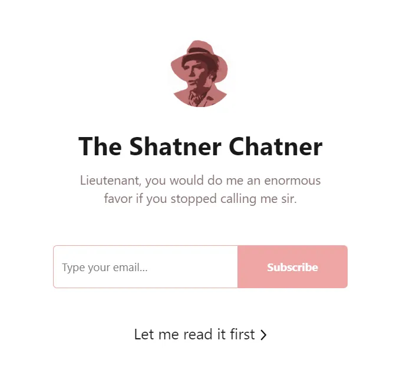
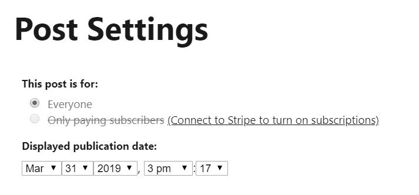
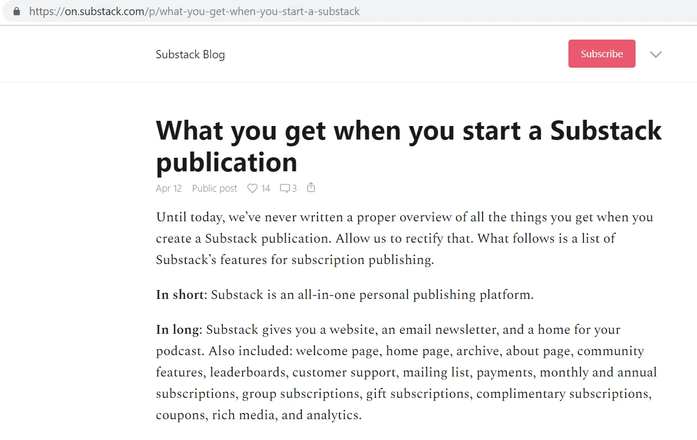

私は [previously described](/writing/write 'why write') 私が公開ブログを始めた理由です。このウェブサイトに加えて、最近は私のブログを公開するためにSubstackにも登録しました。 [monthly newsletters](https://avoidboringpeople.substack.com/ 'substack')\.Substackを使う前は、配信リストに直接メールを送っていました。

この投稿では、以下について説明します\:

1. 私がプライベートメールからSubstackに移行した理由
2. Substackのその他の利点
3. 製品の改善点
4. 他にも、もっとありえない提案があります

## 以下の利点のためにSubstackに移った

1. メールリストを管理するより簡単に、毎回メールをコピー\&ペーストする代わりに、購読者を含めるのを忘れたり削除したりするリスクを減らせます。

   > Substackを通じてメーリングリストを作成し、いつでも持ち運べます。すでにメーリングリストを持っている場合は、設定からボタン一つでインポートできます。

   

   リストをインポートした後、各個別の購読者のステータスや最近の活動を確認できます

   

   さらに、各加入者をクリックして詳細を確認したり、購読タイプを編集したりできます

   

2. 興味のない読者が購読解除をしやすく、直接メールを送るよりも気まずさが少ない方法です [^1]\.

   

   テキストが少し隠されているよりも、もっと分かりやすいものにしてほしいです。はい、実際に人々が購読解除しやすくしたいと思っています。人々はスパムを嫌いますし、望まない人に送るのは避けたいです。もし可能なら、購読解除オプションをニュースレターの最初に直接移動させたいです。ただ、私がそう感じている少数派かもしれないと理解しています。

3. よりプロフェッショナルな見た目のニュースレターで、リッチメディアコンテンツの組み込みも容易です。

   > YouTubeやVimeoの動画、Spotifyのトラック、ツイートを投稿に埋め込むのは簡単です。関連するURLをコピー\&ペーストするだけで、埋め込みは魔法のように現れます。画像やGIFをドラッグ\&ドロップすることも可能です。

   

   Gmailやこのウェブサイトにメディアを追加するよりずっと簡単です。GIF作成 [LICEcap](https://www.cockos.com/licecap/ 'LICEcap') ちなみに。

4. クリック率などの読者ベースの分析です。機能が増えていくにつれて改善されると思います。

   

5. 最終的には収益化の可能性 [^2]\.ビジネスモデルもシンプルで、Substackは加入者に課金を始めると10\%の手数料を取ります。Substackでは月額および年額の料金設定も可能です。支払いはStripeで処理されるため、まだアカウントを持っていなければそこでアカウントを作成する必要があります。

   > StripeアカウントをSubstackに接続したら、私たちは確実かつ安全に支払いを管理します。

   

## 他に好きなものは以下の通りです

1. カスタマーサポートは、あなたが自分で管理の問題に対処しなくて済むようにするためです。

   > クレジットカードやログイン、その他何か問題が発生した場合、私たちはあなたの代わりに問題を解決します。 support@substack.com\.

   まだ使ったことはありませんが、いつか必要になった時のために持っておくと便利です。

2. Substackの「About」や「ご購読ありがとう」ページには、サービスを素早く設定できるように調整できるコンテンツがあらかじめ用意されており、白紙のフォームでさらに多くのコンテンツを一から作らなければならないわけではありません。これはセットアップの手間を減らす小さな工夫だと思いました。

3. また、最も人気のあるコンテンツを宣伝するリーダーボードもあり、ランキングを上げられれば良循環が生まれる可能性があります。Substackはこれが発見に役立つと主張していますが、この投稿の後半で提案があります。

   > リーダーボードは読者が素晴らしい出版物を見つけるのを助け、出版社が新しい読者を見つけるのにも役立ちます。

   

   また、トップ出版社の短いプロフィールもあります [^3]\.

   

4. ニュースレターのウェルカムページは読者に購読を促しますが、問題を強制するわけではなく、それが理にかなっています。サンプルを読まずに購読したくありません。

   

5. 出版社として登録した後、創業者はFAQで質問が解決できない場合に備えて連絡先も提供してくれます。まだメールは試していないので、実際に返信があるかはわかりません。

   

6. より企業向けのユーザー層を狙う場合は、グループサブスクリプション機能もあります。

   > もし組織や企業、その他の機関が会員のために複数のサブスクリプションを購入したいと思うなら、グループサブスクリプションを販売することができます。

## 以下の点も改善できると思いました

1. メールリスト全体を無料購読者として簡単にアップロードする方法はなく、フォームでは一度に1通しかアップロードできませんでした。私は読者のメールをアップロードした後、すべての読者の購読設定を手動で切り替えなければなりませんでした [^4]\.これはさらに厄介で、複数のリーダーの設定を同時に切り替えられず、それぞれ個別に変更しなければならなかったのです。複数の購読者を同時に編集できる機能があればよかったのにと思います。

   

2. 古い投稿のアップロードも大変でした。編集レイアウトの日付と時刻設定がより奥にあったため、投稿をアップロードし、さらに個別に希望の日付に遡って更新するのに時間がかかりました。投稿は数件だけでしたが、長い出版歴を持つ人が古いコンテンツを正しい日付で載せるとは想像できません。

   > 最後に、他のサイトのアーカイブから投稿をインポートした場合、正しい順序で公開され、正しい公開日と関連付けられるように遡って日付を設定できます。投稿を公開した後、その投稿の設定\(公開ボタンのすぐ左\)に入り、希望の日付を選択してください

   

3. アカウント作成とログインに最初は問題がありました。なぜ「メールログインリンク」がデフォルトなのか分からず、メールでリンクをリクエストすると同じログインページとプロンプトに誘導されるループが発生しました。混乱しました。

   

4. ホームページにはブログへのリンクがあり、サービスの詳細が掲載されています。しかし、一度ブログに進むと、ブラウザの戻るボタンを押さずに直感的にSubstackのホームページに戻る方法はありません。ドロップダウンメニューでは戻ることができず、本文にも戻るボタンはありません。

   

5. 投稿URLを編集する方法はなさそうです。以下の例では、「近日公開」の仮投稿を編集していましたが、投稿タイトルを変更してもURLを修正できませんでした。

   

6. 「開く」と「クリック」を定義する簡単なマウスオーバーテキストも役立ちます。常識的に考えれば考えるものに近いと思いますが、ここで明確にできると助かります。

## そして、以下の追加の提案があります

1. 前述の通り、リーダーボードがあるのは良いことですが、新しいコンテンツの発見はできません。急速に購読者が増えている「トレンド」コンテンツのコラムを追加できるかもしれません。あるいはSubstackチームがキュレーションした、あまり知られていない出版社の定期的なローテーションを掲載するコラムも\?はい、私は小規模な出版社なので明らかに偏っています。

2. 私は好きでした [this page](https://on.substack.com/p/what-you-get-when-you-start-a-substack 'substack features') Substackで得られるすべての機能について説明していますが、もっと見つけやすくする必要があります。

3. 登録後に出版社と共有されるGoogleドキュメントがあり、役立つ情報が載っています。これは独立したウェブページとして機能し、人々が参照できるようにすべきです。例えば、すでにそのリンクを失ってしまいました。

4. パスワードリセットリンクは新しいパスワードを一度だけ入力する必要がありました。誤ったリセットを減らすために、新しいパスワードの確認や再入力が必要になるはずです。

5. リンク注釈を簡単に作成する方法はありますか\?

6. カスタムドメインの追加を再考するのでしょうか、それとも技術面が大変でしょうか\?また、より高度なカスタマイズが不足しているのも意図的だと思います。

Substackは、比較的簡単に設定でき、プロフェッショナルに見え、購読者数の分析に役立つ無料のニュースレターサービスを提供しています。私は自分のために使うのが気に入っています [monthly newsletters](https://avoidboringpeople.substack.com/ 'substack') 今のところ、シンプルなメールからは大きな進歩です。メインサイトではカスタムドメインや別ページレイアウト、フォーマットなどカスタマイズ性が高いため、Github Pagesを使い続けるつもりです。しかし、Substackには楽しめる点もたくさんあります。

[^1]: とはいえ、今のところ唯一の配信停止は、友人が配信を解除する前に解除したいと言ったことだけなので、これが意図した通りに機能しているかはわかりません\.\.\.

[^2]: これは成功しても失敗しても時代遅れになる言葉の一つです

[^3]: ただ、もしそのリストに含まれていなければ、どうやって手に入れればいいのか分かりません

[^4]: 上記の加入者プロフィールページを通じて
