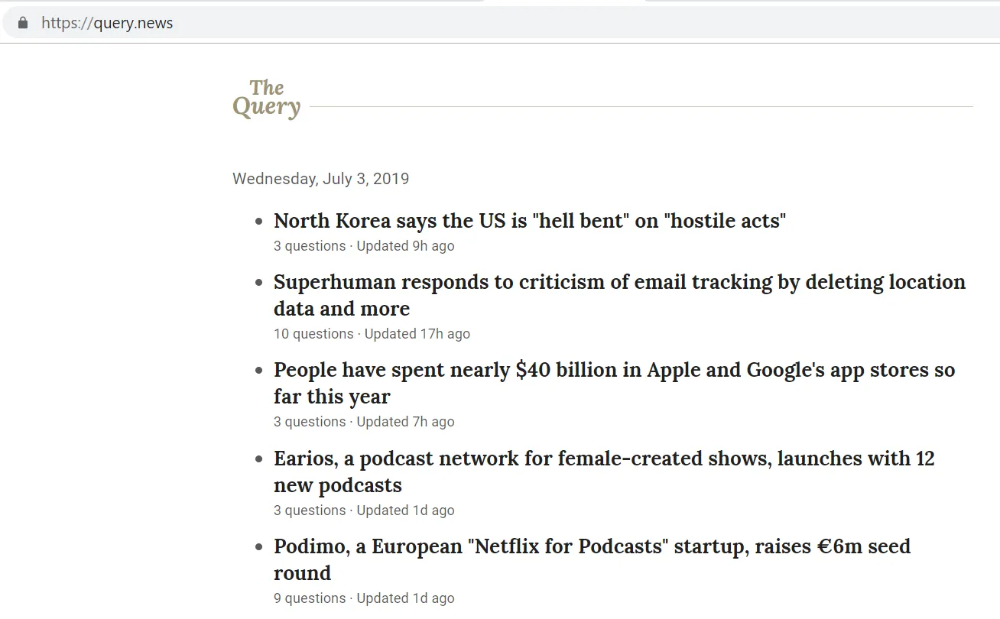

友人が最近新しいプロジェクト、[Query News](https://query.news/ 'Query')を立ち上げました。これはプロジェクトの内容と私の提案のウォークスルーです。

## ウォークスルー

クエリは何を目指しているのでしょうか?[本人の言葉に基づく:](https://query.news/s/we-launched-kinda)

> これをタイムリーなニュースのためにQuoraと表現するのは正確でしょうか?

> ほぼその通りです!ただ、何を目指しているのかははっきりしません。しかし、間違いなくQuoraは良い出発点です。Quoraで一番慎重になっているのは、回答が競合するモデルと、回答を共同で作成するというモデルの違いです。ここでもっと協力を促す方が理にかなっているかもしれません。とはいえ、どうなるかはこれから見てみましょう!

ですので、現時点ではニュースイベントが発生した際にQ&A形式で行う予定です。人々がトピックについて質問を投稿し、誰か(誰?)が答えます。

ランディングページはシンプルで、質問を時系列順に並べ、直近の日が先です。質問がその日の中でどのように並べ替えられているのかはよくわかりません。質問が投稿された時点で順番は固定されていると思います。更新のタイミングは順番に影響しないようです。このサイトはモバイルでもよく動作します。

個別のトピックをクリックすると、より詳細なQ&Aページに移動します。各Q&Aページには独自のURLがあります。ページにはニューストピックの簡単な要約、出典の引用、質問の目次、そして質問自体が掲載されています。

質問をするための複数のプロンプトがあり、質問欄に入力するだけで簡単です。私の知る限り、質問に対する即時のモデレーションはなく、質問はすぐにページに投稿されます。このサイトは質問を簡単にしてくれます。

例えば、以下の質問を投稿したとき、ページが更新されると質問リストの一番下に表示され、投稿後に自動的に更新されました。

現時点では直接質問に答えられるようには見えませんが、「アップデートを提案」するとコメントを編集者に送ることができます:

現在のトピックや質問のリストは[こちら](https://query.news/「クエリ」)でご自身でご覧いただけます。コメントしたいものがあればご確認ください。これは面白いアイデアですね!ほとんどのニュースは一方的で、大衆にメッセージを発信しようとしています。オンラインのコメント欄はたいていひどいものです。サイトの中心に議論を置くことで、より生産的なユースケースにつながることを期待しています。もし何かを読んで「じゃあXはどうなの?」と思ったことがあるなら、Queryは役立つでしょう。

大規模になるとどのような形になるでしょうか?トピック分野ごとに別々のセクションを設け、認証済みアカウントが新しい記事を投稿し、興味のある読者からの質問を受け取り、その質問に答える形で行うことができます。クエリ_the site_を活用し、さまざまなトピックのリアルタイム情報を提供し、実際に掘り下げて物語の展開を調査できるようになります。

質問や提案に移ります!

## 質問1. これはQuora、[Hacker News](https://news.ycombinator.com/ 'HN')、または[Reddit](https://www.reddit.com/)とどう違うのか?
   - Quoraよりも協力的な意図があるように見えるので、複数の編集者が質問に答えられる機能を作るのだろうと推測しています
   - もしそうなら、スレッド式の会話は許可されず、すべてを質問ごとに一つの回答にまとめるのではないかと思います。これはHacker NewsやRedditとは違います
   - もしかすると、これをQuora X Wikiのように、起こった時のニュースを伝えるのもいいかもしれませんね?
2. これをどうスケールさせるのか?
   - 質問(および回答機能が実装されれば)のモデレーションは手動編集が必要で、すべてのウェブサイトに[スティーブン・プルイット](https://www.cbsnews.com/news/meet-the-man-behind-a-third-of-whats-on-wikipedia/「スティーブン」)があるわけではありません。一部のスパムは自動的に削除される可能性がありますが、手動のモデレーション要素は含まれる可能性が高いです
   - 誰が質問に答えるか、そして誰がその分野に十分な専門知識を持っているかはどうやって決めるのか?
3. すべての関係者に対するインセンティブは何か?
   - 創業者たちにとって、[彼らは実験をして、人々がニュースを別の形式で読む需要があるかどうかを見たいと思っていると思います](https://query.news/s/we-launched-kinda/q/what-are-your-short-term-goals-for-the-query#q-52「STの目標」)
   - 質問者にとっては、専門家が答えたトピックについて(理想的には通常のニュースよりも偏りの少ない情報)を得るため
   - 最終的な回答者のために、評判を築くため?好意?地位向上?
4. もし他の人にも質問に答えられる場合、人々は時間をかけてアカウントを作成しなければならないのでしょうか?
   - 質問は自由に流れる匿名でもいいかもしれませんが、承認されたアカウントが回答を編集できるかもしれません。
   - 回答に対して一つの統一された「クエリニュース」の声を提示する意図があるのか、それとも複数の視点を提示することか?

5. 画像機能はありますか?

6. 回答の質も調整する必要があるか?
   - QuoraやRedditのようなアップボート/ダウンボートシステムがサイトの目的を損なうのかはわかりません

## 提案

1. フロントページに[Query Self-rereferenceal Q&A page](https://query.news/s/we-launched-kinda/ 'Query Q&A')をピン留めする。初めてホームページにたどり着いた人は、そのサイトが何について書かれているのかよく分かりません。「About」タブを一番上に置くと、サイトが何をしようとしているのか理解しやすくなりますし、Q&Aページへの簡単なリンクでも良いでしょう。

   

2. 「フォロー」オプションが具体的に何をするのかを明確にすること。メールを入力すると、そのニューストピックのすべての質問に登録されるのか、Queryのすべての質問に登録されるのか、それともトピックに関する質問が一つだけなのか分かりません

   

   「フォロー」をクリックした後でも、参加すると何が起こるのか分かりません:

   

3. 質問にタグ付けしたり検索機能を備えたりすることは、この分野が成長する際に役立つか、場合によっては必要になることになりそうです

4. 個別の質問には個別の共有ボタンがあるのに、メインニューストピック自体にはボタンがないのですか?

5. これは今後の計画にあると思いますが、最終的には人々が自分自身でニューストピックを投稿できるようにするのは論理的な次のステップのように思えます。

6. これをRSSフィードで配信する方法はありますか?最近ニュースレター形式に変わったようです。