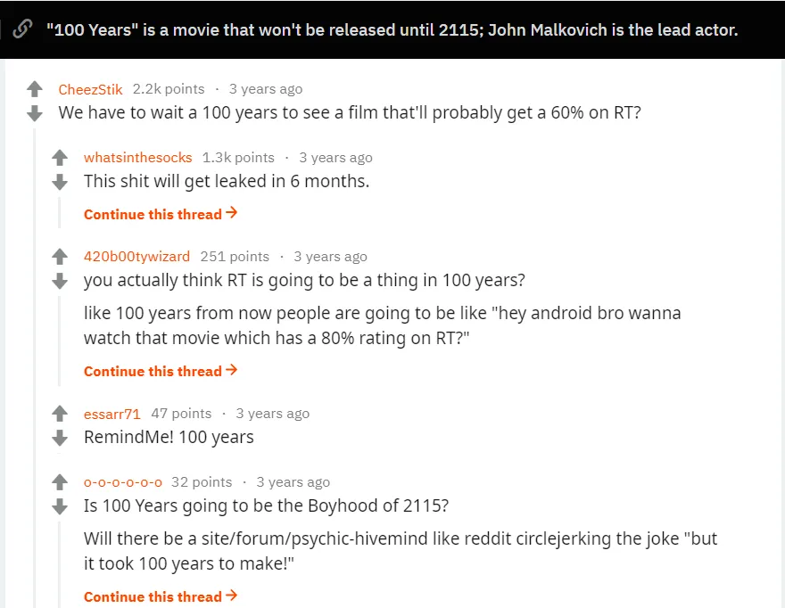

時間に関わるものに魅了されています。実験から、 [memory and time are linked](/writing/time_illusion 'time illusions')、 から [organisations that aim to last 10,000 years](http://longnow.org/ 'long now')人々が時間の進行を理解し、時間とどのように関わっているかを見るのは考えさせられます。 [Time travel with a machine](https://en.wikipedia.org/wiki/Time_travel_in_fiction 'wiki') H・G・ウェルズの『タイムマシン』物語で広めたものであり、 [some cultures have old stories about time dilation](http://www.openculture.com/2018/02/whats-the-origin-of-time-travel-fiction.html 'origin?')、私たちはしばらくの間、時間の神秘的な性質について考えていたことを示しています。

だからこそ、私は興味を持ちました。 [this reddit post](https://www.reddit.com/r/movies/comments/4ke64j/100_years_is_a_movie_that_wont_be_released_until/ 'reddit') それが私に [100 years](<https://en.wikipedia.org/wiki/100_Years_(film)> 'wiki')ジョン・マルコヴィッチとロバート・ロドリゲスによる2115年の公開を予定していた映画です。それは2015年にチームが宣伝キャンペーンの一環として金庫に封印してから100年後のことです [Louis XIII Cognac](<https://en.wikipedia.org/wiki/Louis_XIII_(cognac)> 'wiki')、100年ものものの霊を使う。この作品は広告の一部でありながら、素晴らしいアイデアだ。自分の作品が100年後も意味を持つと自信を持って言える人はどれだけいるだろうか\?マルコヴィッチとロドリゲスは、映画のクオリティに関わらず、人工的にその仕組みを作り上げた。そして私は面白い物語が大好きだ。

しかし、一般の意見はそれほど肯定的ではありませんでした。

「映画はきっとダメだろう」「自慰的な広告だ」「100年後に観客に評価してもらうのは自己中心的だ」といったコメントが寄せられました。

これらの中には本当に当てはまるものもあるかもしれません\!この映画が良いものになるかどうかは全くわかりません。間違いなく広告です\[\^1\]。それは _は_ 100年後に人々がそれを気にかけることを期待するのは自己中心的です\[\^2\]。

でも自分に問いかけてみてください。もし2115年のプレミアに招待されたら\(もしあなたがその年まで生きていると仮定して\)、あなたは行きますか\?

その質問への答えは、この壮大な作品の意味を理解している人と、理解していない人を分けるものだと思います。映画が良いかどうかは関係なく、広告であることも関係なく、そしてこの冒険全体が自己中心的であることは問題ではありません。 _それがポイントです_\.チームが100年後に存在感を保てるという事実は驚くべきことです。彼らはおそらくとっくに亡くなっているでしょう。

以下はチームや他の方々からの感想です\:

> [Rodriguez told Indiewire last year that he had never done anything like this: “I was intrigued by the whole concept of working on a film that would be locked away for a hundred years. They even gave me silver tickets for my descendants to be at the premiere in Cognac in 2115. How cool is that? What John and I wanted it to be was a work of timeless art that can be enjoyed in 100 years. I’m very proud of it even if only my great grandkids and hopefully my clone will be around to watch.”](https://www.indiewire.com/2016/05/john-malkovich-robert-rodriguezs-film-100-years-will-be-displayed-at-cannes-before-2115-release-291273/ 'indiewire')

> [“When this idea was proposed to me, I just thought it was a very clever and fascinating concept to do something which essentially certainly I will never see,” he says. “But I like that. The truth is if you act in a play you never see it. I’ve certainly acted in a lot of movies I’ve never seen and a number of them I wouldn’t particularly be tempted to.”](https://people.com/celebrity/john-malkovich-explains-why-he-made-a-movie-no-one-will-see/ 'people.com')

> [In terms of time, "100 Years" looks to be the most ambitious film in history since last year's "Boyhood," which chronicled the life of a young man from age 6 to age 18. The film was shot over a 12-year period by director Richard Linklater, whose brilliant concept for such a simple story made waves among film fanatics.](https://www.theodysseyonline.com/100-years-the-movie-you-will-never-see 'theodyssey')

もしこの実験が失敗したら\?もし金庫が消えたり、フィルムが時間とともに劣化したり、人々が完全に忘れてしまったら\?それでも、このプロジェクトは興味深いものになるだろう。失敗の原因が何か、そしてそれをどう防げたのか知りたい。今日でも1900年代の映画が残っている中で、未来に何か根本的な変化があって、100年前の歴史の感覚を失うようなものはないだろうか\?似たようなものだ。 [other long dated experiments,](https://en.wikipedia.org/wiki/As_Slow_as_Possible 'ASAP') 長く残る作品を作ろうとする試みは称賛に値します。

この映画が万人向けではないことは理解しています。場合によってはコミカルに悪いかもしれません。しかし、これをギミック広告だと考える立場は本質を見失っています。マルコビッチ、ロドリゲス、そしてチームは特別なものを作り上げました。公開時に生きていられたらいいなと思っていますが、どちらにせよプレミアに来てくれる方々のことを楽しみにしています。

\[\^1\]自慰行為かどうかは、あなたにお任せします。
\[\^2\]でも、映画制作はみんな自己中心的ではないでしょうか\?あるいは、注目を集めようとするあらゆる創作活動、例えば執筆などもそうです。
