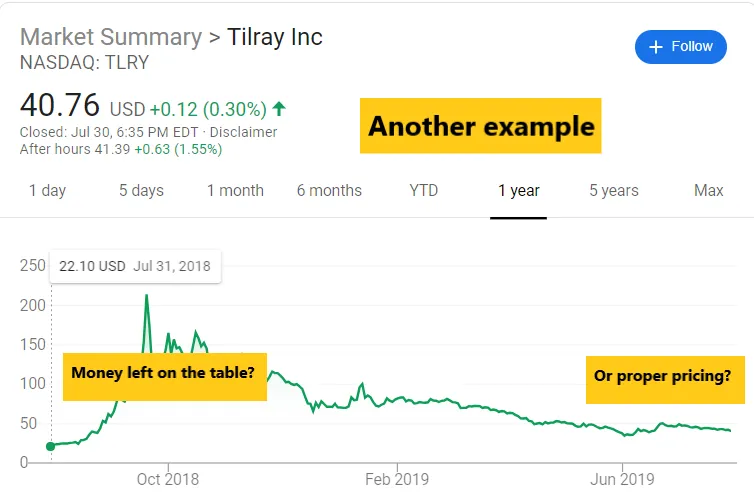

## IPOの舞台裏では何が起こっているのか?

人々はIPOの話をよく耳にしますが、裏で何が起きているかはあまり知らないことが多いです。A16Zは最近[A16Z』https://a16z.com/2019/07/09/ipo-process-prices-behind-scenes-companies/投稿を書いていて、私の経験を少し共有しています。念のため言っておきますが、これらは投資アドバイスではありません。決して。

> 『S1』はまた、企業と市場での役割を位置づけるマーケティング文書としても機能します。なぜなら、待機期間中は公の宣伝を避け、会社を代表して何を言えてよいかについて厳格なルールを守らなければならないからです。しかし、この期間中は非公開で、会社のストーリーや財務情報を投資家に事前に提案します。

「愚かな」個人投資家は、株価が好調だと聞いてIPOに参入します。「賢い」個人投資家はS1でデリジェンスを行い、独自の財務モデルを考え、参加すべきかどうかを決めます。

ほとんどの個人投資家は、S1では重要な公開情報がすべて示されているはずで、見落としがないように公平な競争環境があると考えています。**これは一度も事実ではありません。** プロの投資家は、IPO前であってもtime__all経営陣と会っています。これらの会議から重要な非公開情報を得ることはありませんが、役に立たなければ経営陣の会議に時間を無駄にすることは誰もありません。

> 注文帳を手にしたアンダーライター(銀行)は、株式を機関投資家に割り当てます。この一環として、彼らと会社は、株式をあまりにも早く売却する実績のある投資家へのIPO配分を最小限に抑えたいと考えています。必ずしも成功するとは限りませんが、それで問題ありません。なぜなら、一部の売却は「市場」を作る助けになるからです。

投資銀行には資本市場チームがあり、会社と協力して、関心のある投資家に最初にどれだけの株を配るかを決めています。投資家はIPO価格40ドルで10株を要求できますが、IPO価格が45ドルに達すると5株だけを要求できます。投資家はしばしば予想以上の株を求め、その結果、募集が「オーバースクライブ」になってしまいます。**ほとんどの募集はオーバースクライブされています**ですので、ニュースでそれを報じるなら無視してください。

このブックビルディングの目的は、会社がどの価格でIPOすべきか、どれだけの「実質的」需要があるか、そして誰に渡すかを決めることです。通常のIPOは通常、80%を機関投資家に、20%以上をその他の顧客に割り当てると思います(**ウィニー**、もし間違っていたら訂正してください)。重要なのは、あなたも私もIPO価格で買うのではなく、株価が取引開始時の価格(通常はそれより高く)でしか買えないことです。

> 人々はしばしばIPOが会社全体を上場することを意味すると考えがちです。なぜなら、これらの企業は四半期ごとに帳簿を開き、決算を報告する必要があるからです。しかし実際には、売却される会社の比率は通常10%〜15%に過ぎません。このような供給の限られた状況は、特に需要が非常に多い場合、短期間で大きな影響を与えることがあります。

私の知る限り、IPOで会社の100%を譲渡した会社はありません。可能性はあると思いますが、それは奇妙でおそらく赤信号です。価格は通常、初日の「ポップ」(https://clutejournals.com/index.php/JBER/article/view/2412「IPOポップ」)を設定し、会社を支持した株主への報酬として、また会社の従業員に良い雰囲気を与えるために設定されています。

[IPOプロセスの批判者](https://markets.businessinsider.com/news/stocks/slacks-direct-listing-bill-gurley-says-startups-call-morgan-stanley-2019-6-1028298641「ビル」)はこの「ポップ」が利益をテーブルに置くと考えているが、それは事実だが、**ほとんどの従業員は(非合理的に)株のIPOを手に入れて増え続けることを望んでいる**。> では、「ポップ」の後、IPOの成功をどう評価すればよいのでしょうか?Beyond Meatは本日100ドル以上で取引されています。それはつまり、会社が資金をテーブルに置いていたということですか?計算すると、同社はIPOから約2億4,000万ドルを調達しました。しかし、もし株価が最初の取引価格(46ドル)で設定されていたら、ほぼ倍の金額を調達できたかもしれませんし、終値の価格で価格設定されていたらさらに多くの資金を調達できたかもしれません。とはいえ、人々はその価格でそれほど多く投資しなかったかもしれません。

さらに「テーブル上のお金」問題(http://www.underpricing.de/Downloads/Louhgran_Why%20Dont%20Issuers.pdf「調査」)を説明すると、BYNDは25ドルで価格を付けており、これは機関投資家(あなたや私ではない)が25ドルで買ったことを意味します。取引が始まったとき、誰か(今はあなたか私かもしれません)が46ドルで注文し、その株主が46ドルで売る意思があったため、その注文が成立したのです。

もし需要が46ドルなら、BYNDは46ドルで価格設定して投資家からもっと現金を得るべきだったと主張する人もいます。ビル・ガーリーは、すべての需要と供給をマッチさせるために直接上場を使うべきだと主張します。

まだお金は残っていると思いますが、別の選択肢を考えてみてください。例えば、BYNDが最初から100ドルで価格を付けているとしましょう。それなら何も残っていませんが、IPO後に価格が下落する可能性がはるかに高まります。もし下落しても、価格の勢いがさらに下落しているのかもしれません。現在のBYNDの取引価格のうち、どれだけがモメンタムによるものかはわかっていませんし、逆の可能性もあるように思えます。一般の人々は、FB、GOOG、UberのIPOを「ポップ」がないために失敗だと今でも考えています。一般の人々のことを気にする人がいるかもしれませんが、社内の従業員の士気にも影響が出ます。**私の言いたいのは、現在、企業が正確に価格を決めるインセンティブが減っているし、そもそも正しい価格が何かは誰にも分からないということです。**