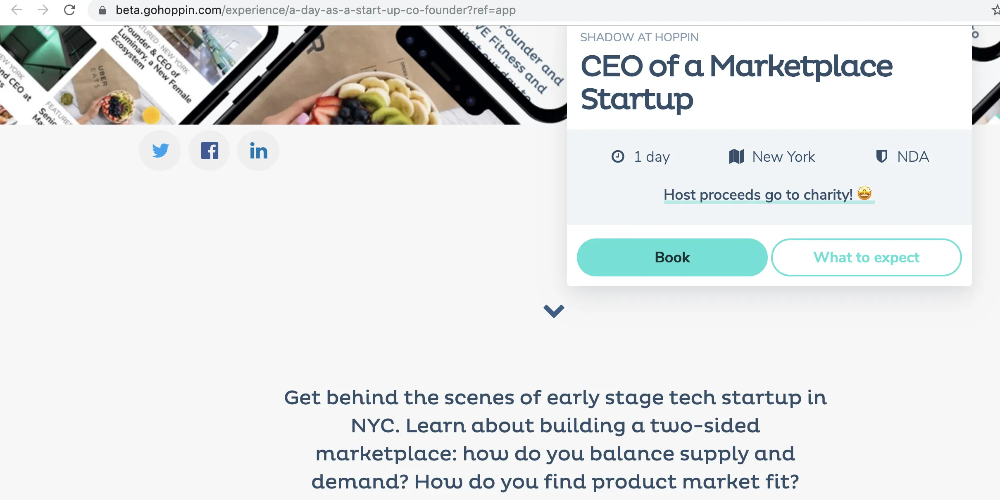
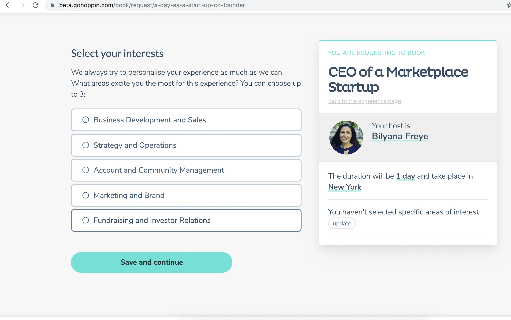
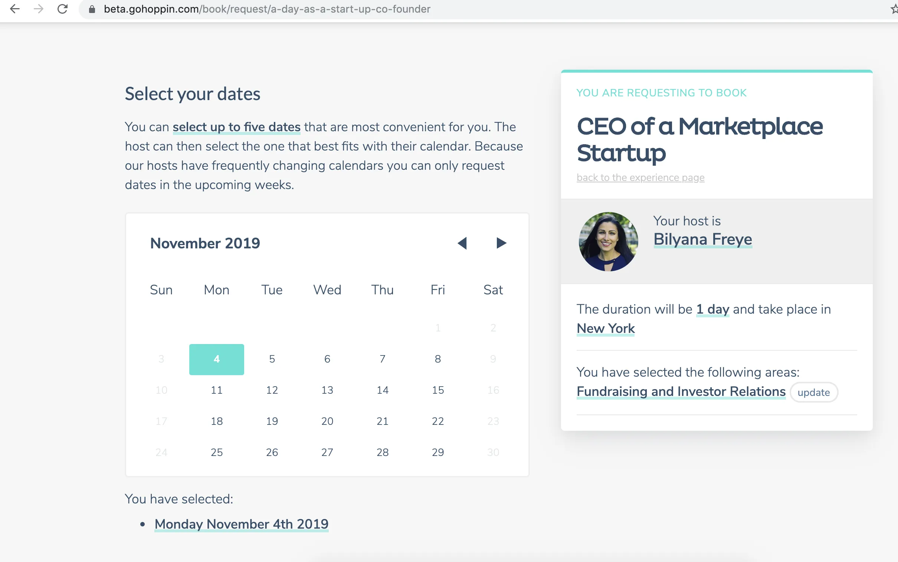

私は最近、ジョブシャドウイングマーケットプレイス[Hoppin](https://gohoppin.com/「Hoppin」)の[Bilyana Freye](https://twitter.com/bilyanafreye?lang=en「Billy」)のジョブシャドウイングをしました。以下は私の体験の初期的な感想です。

完全な開示:私の会社はこの活動を専門的成長学習予算の一環として支払っていました[^1]

新しい仕事を探している人がよく言われるアドバイスの一つは、まずリサーチをすることです。現在、インターンをしたり、同じ役割に就いている人に聞いたりする方法があります。インターンシップは時間の負担が多く、必ずしも現実的とは限りませんが、現社員と話すだけでは、実際にインターンシップで体験するほど豊かな情報が得られません。これがホッピンが埋めようとしているギャップです。

ホッピンはジョブシャドウイングマーケットプレイスであり、1日シャドウイングしたい人と、1日だけ別の人をホストしてくれる人をつなげようとしています。理想的には、両者がこの恩恵を受けられます。シャドウアーは本物の「一日の生活」を体験し、役割をよりよく理解でき、ホストは自分の役割に対する新しい視点や新入社員を得ることができます。人々が興味を持つ理由は理解できますし、これからどうやってビジネスを成し遂げるかがホッピンにとって解決すべき重要な課題です。

まずは予約の流れを説明し、その後私自身の経験を述べ、最後に会社についての感想やフィードバックをお伝えします。結論としては、素晴らしい体験であり、以下に述べる注意点を除いて、一度チェックする価値があると思いました。

## ブッキングフロー

このサイトには、興味のある分野で体験を閲覧できる検索機能があります。下の例は、私が「マーケットプレイス」の検索結果の最後まで来たときのことです。あのコーギーを見てください。

興味のある経験を選ぶと、その人物とその経験のプロフィールが表示されます。この例[^2]では、ロールド上部に役割、期間、所在地などの簡単な情報が表示され、さらに詳細が下に表示されます。

予約をクリックした後、ホストが自分のアカウントを作成する際に提供したあらかじめ入力されたリストから興味を選択できます。

次に、自分に合った日付を選びます:

その後、意図について自由に回答することもできます。余談ですが、もしかすると「興味を選択」セクションと組み合わせてみるのもいいかもしれません。目的は似ているようですね

次のステップは、連絡先情報やリンクしたい他のソーシャルメディアプロフィールを入力することです。ここでは、便利さのために、私がすでにプロフィールに入力した情報を取得しています。

ホッピンはB2Bへの転換を目指しているので、次のステップとしてクーポン申請をしています。数週間前に最初に予約した時にはなかったのですが。クーポンを適用すると、次に説明している流れとは少し違う流れになると思います。おそらく確認ページに直接行くのでしょう?

最後のステップは支払いの詳細です。価格設定がまだ進んでいるため、数字は黒塗りにしました。個人的には体験ページで価格を最初に見たいですが、なぜ流れに入っているのか理解できます

予約後に確認メールが届き、領収書も届く[^3]。その後、当週にリマインダーメールが届き、当日には体験を共有するよう促すメールプロンプトが届きます。それに加えて、ホスト(創業者のビリヤナ)から私の予定が書かれたメールも届きました。これが、何を期待すべきかという不安を和らげるのに役立ち[^4]ました。また、彼女が私の興味に合った体験を明確に手配してくれたのも素晴らしいと思いました。ホッピンチームはホストが報酬を受け取っているので、まずホストから連絡を取るつもりだと言っていました。今後はホストに対してそれをもっと明確にするつもりです。

## ジョブシャドウイングの経験

私は朝、カフェでビリヤナと自己紹介の会話をしました。私たちは[^5]お互いの経歴について話し、彼女は会社の簡単な概要を説明し、その直後の投資家会議でより詳しく話せるだろうと述べました。

ホッピンは現在資金調達中なので、その直後に潜在的な投資家と会いました。投資家は自身の経歴を話し、企画を聞き、以下の質問をしました:

- 企業戦略と長期ビジョン
- 資金調達ラウンドと条件
- 現在の燃焼速度とチーム規模
- 現在の指標
- 計画中のパートナーシップ
- 供給と需要の懸念と、ゲート要因は何であったか
- 雇用主の引き抜き問題の管理
- ホストとシャドーアのクロスオーバー
- 典型的なシャドウイングの一日の構成

これらはすべて、投資家として興味を持ちたであろう考え深めの質問だと感じました。

その投資家ミーティングの後、私たちはBilyanaの共同創業者であるLuuk Derksen(https://gohoppin.com/about「Luuk」)と合流し、彼らが提携していたアクセラレーターと会いました。Hoppinチームは主に資金調達や投資家との関係管理について助言を求めていました。特に私が強く意見を持っていたトピックの一つは、投資家の更新頻度です。私のパブリックマーケット投資の経験では、企業が定期的な更新をやめたり指標を引き出したりするのは、通常は悪い兆候です。物事が悪化すると話をやめるものですが、まさにその時に話す必要があるのです。多くの場合、民間投資家は企業の問題を早期に知っていれば助けられたかもしれませんが、事態が崩壊した時にのみ介入されていました。[Cartaは合理的な投資家向けアップデート形式を持っています。](https://carta.com/blog/how-to-write-an-investor-update/「Carta」)これを読んでいる創業者の皆さん、ぜひ引き続き投資家の最新情報をお届けください。

昼食はHoppinが支払いましたが、その後クリエイティブエージェンシーと会い、Hoppinがそのサービスからどのように恩恵を受けられるかについて話しました。エージェンシーはポジショニング、ビジネスデザイン、デジタルブランディングを支援するためにできることについて話し合いました。また、マーケティングメッセージ、会社のアイデンティティ、売却成立の際の問題点についても話し合いました。会議は両者がフォローアップ項目で合意して締めくくられました。個人的には、この段階でエージェンシーと仕事をするのは時期尚早かもしれないと思いましたが、もちろん創業者の判断に委ねてビジネスを運営するつもりです。

その後、彼らの事業開発責任者である[Addi](https://www.linkedin.com/in/addisonbolin/「Addi」)と少し会いました。彼女は営業ファネルについて説明し、ツールを使って見込み客を開拓し、フォローアップする方法を説明してくれました。Addiはエンゲージメント率を高めるための戦術を説明し、例えばスタートアップと企業の目標が異なるため、その人に合わせてコピーをカスタマイズするというシンプルな例を挙げました。Addiは仕事外でも複数のイベントに参加し、Hoppinに会い、提案を行っています。

その後、現在の投資家とキャッチアップコールを行い、内容は以下の通りです:

- 達成したマイルストーン
- 直面した課題
- 資金調達
- 投資家がより専門的に支援できること
- 次の資金調達のために会社がどのような姿を取るべきか
- 会社の拡大方法の可能性

私は公開市場側の経験と非公開プロセスの知識から、この会議はかなり標準的なものだと感じました。ホッピンチームは勝敗について率直に話し、今後数週間の進め方について良いアドバイスをもら[^6]ました。当初はダウンタウンでジャーナリストと一度だけミーティングする予定でしたが、延期されたため、私は自由な時間ができました。その時間を、ビリヤナとのQ&Aセッションを行い、その後ルウクと一緒に商品を説明して埋めました。プロダクトセッションでは以下の内容について話しました:

- プラットフォームの構築方法
- 直面した技術課題
- 顧客の期待と、それが今どのように高まっているか
- 大きな優先事項
- 長期戦略

小さなタスクにも取り組む予定でしたが、上記の2回のセッションが予想より時間がかかったため、それをカットせざるを得ませんでした。通常、シャドーヤーに何かをしてもらってエンゲージメントを高めることが期待されていると聞いています。ホッピンチームにはもう一人フルタイムのメンバー(アビ?)がいて、残念ながらあまり一緒に過ごす時間はありませんでしたが、それは予想通りでした。結局のところ、私はチームではなく特定の一人の人をシャドウしていたのですから。

最後に予定されていた報告会で締めくくりましたが、私のコメントのせいで元の終了時間を過ぎてしまいました。皆にとって長く忙しい一日でした。ホッピンチームがシャドウイングのためにさらに長く滞在してくださったことに感謝します!

## 感想- 戦略
  - 採用担当者によく言われるアドバイスは、その役割[^7]にいる、または以前にいる人とできるだけ多く話すことです。ジョブシャドウイングはさらに一歩進んで、興味のある役割についてさらに深い洞察を与えてくれます。それは素晴らしいと思いますし、例えば同じ人と月に一度の長期シャドウイング期間も可能かもしれません。
  - HoppinはB2Cを立ち上げ、B2Bへ転換し、「仕事界のABNB」としての地位を確立しています。メリットとしては、より大きな契約、高い定着率、ブランド化が挙げられます。デメリットとしては、営業サイクルの長引き、インセンティブの整合性の難しさ、集中リスクがあります。すべての移行と同様に、これも難しいでしょう。しかし、SaaS製品で定期的な収益を確保したいと思うのは理にかなっています。
  - 特にインセンティブの整合に関しては、製品市場適合性をまだ取得している段階にあるようです(下記参照)
  - また、現在全く異なる仕事を楽しみでシャドウイングしている人たち[^8]代替案も考えており、これがシャドウアーが現在このプラットフォームを利用している主な理由のようでした
  - 近い将来的には、マッチング、スケジューリング、フィードバックを完全に自動化することを目的としています
  - 長期的なビジョンは、学びと成長のためのプラットフォームとなることです。ジョブシャドウイングは、プラットフォーム上で提供される多くの製品の一つに過ぎません。従業員は自分に合わせた学習・開発計画を持つことができます。これは興味深いですね。私は人事分野に詳しくありませんが、断片的に感じられるので、これも難しいかもしれません。
  - どのくらいの規模に拡大できる?わからないけど、新しい経験で、彼ら独自の市場を作っているかもしれない。それはワクワクするね
- インセンティブアライメント
  - 個人的には、すべての側面が概ねインセンティブに一致しているビジネスが好きで、ここに潜在的な問題があると感じています。従業員が他の仕事を探している可能性があるため、雇用主にサービスの利点を納得させるのは難しいかもしれません。もしチームが従業員満足度などのROIを証明できれば、売却プロセスに役立つかもしれません
  - つまり、チームはすべてのステークホルダーが満足できるよう、価値付加価値を簡潔に伝える方法をまだ模索中だと思います
  - ホストとシャドーアの両方がお互いから学べる方が、一方の方法だけではなく、むしろ良い体験になるでしょう。例えば、ホストが経験豊富な高校生のホストであれば、あまり役に立たないでしょう
  - プラットフォーム上のトップホストには追加のインセンティブはありますか?トップホストは予約の大半を得ていると思いますし、すぐに疲れてしまうのも想像できます。
  - シャドウアーが本業とは全く異なる経験を積む意図があるのか、それとも職場に持ち帰れる補完的な経験を得ることなのか?
- 価格設定
  - ホッピンは方針転換を踏まえ、価格設定にまだ取り組んでいます。現時点では、ビジネスアカウントのオンボーディングが容易になるため、体験ごとの価格設定をより標準化する案が考えられています。
  - 参考までに言うと、価格が高すぎて個人としては予約しなかったと思います。経費で申告できるので、試してみたかったので予約しました
  - テイク率も高そうだったけど、そこも改善されると思う
  - 価格設定の難しい問題は、ホストにとって価値があるくらいの価格設定が必要であり、シャドウアーが躊躇するほど高くはない点です。
- マーケットプレイスの流動性
  - ほとんどのマーケットプレイスは供給制約があり、ホッピンも同じだと思います。十分な量と多様性のホストを確保できれば、サービスの需要も十分になると信じています[^9]
  - 人気のある人たちがどれくらいの頻度でホストを務めているのか、それがどれほど持続可能か、そして彼らの定着率はどのくらいなのか気になります
  - 彼らのB2Bパートナーシップは、私の会社のように供給を拡大できる
- 他の投資家フレームワークを用いた評価
  - [ビル・ガーリーの枠組み](http://abovethecrowd.com/2012/11/13/all-markets-are-not-created-equal-10-factors-to-consider-when-evaluating-digital-marketplaces/ "Gurley")に基づく- 新しい経験と現状維持 - そうです
    - 経済的優位と現状維持の違い - いいえ?
    - 技術が付加価値をもたらす機会 - はい、集約において
    - 断片化が多い - そう思います
    - サプライヤー登録の摩擦 - 簡単ではありませんでしたが、ホッピンによると、企業向けによりテンプレート化されているとのことです
    - 市場機会の規模 - わかりません
    - 市場を拡大する - そうみたいだね
    - 頻度 - 低いように見える
    - 支払いの流れ - ない?
    - ネットワーク効果だ。そう、ただし局所的だ
  - [ジョシュ・ブラインリンガーのフレームワーク](https://acrowdedspace.com/post/73232464154/the-ingredients-for-a-successful-marketplace「ジョシュ」)に基づく
    - 繰り返し使われる - そうでもない?
    - 不規則な使用- はい
    - 標準化された作業 - いいえ
    - ほとんど信用は必要ありません - そうですか?
    - 非一夫一婦制の関係 - はい
- 資金調達
  - 明らかな理由で詳細は言いません。会社はまだ初期段階で、さらなる資金調達を目指しているので、B2B営業構築に精通した投資家に連絡を取る価値があるかもしれません。

## より細かいフィードバック

1. 最初に予約をしていたとき、内部承認を得るために支払いページで止めていました。その後、予約確認を求めるフォローアップメールが届き、それは良かったです。しかし、そのリンクでは日付確認など、入力した他の項目を編集することはできませんでした
2. 予約後はウィンドウ自体を閉じるしかなく、予約やプロフィール、ホームページに戻ることはありませんでした。これはシャドーイングを促す手段になったり、体験を説明した記事へのリンクを貼る手段になるかもしれません
3. ホストとシャドウアーの両方の登録プロセスが私が望むよりも長く感じましたが、それはあくまで私の体験談です。
4. 最初にログインしてプロフィールを作成しましたが、サイトに戻ったときにリンクが見つかりませんでした。どうやら再登録しかできないようでした。

ホッピンのチームは上記の問題を認識していると言っていました。

## 結論

マーケットプレイス企業で働く人と一日を過ごす経験がとても楽しく、個人的に興味のある多くの活動があったことでさらに良くなりました。小売消費者としては価格が高いと思いますが、B2Bの人事リソースとしては理にかなっています。もしホッピンがその方向転換を成功させ、マーケットプレイスの供給側を拡大できれば、2年後の彼らの動きは注目されるでしょう。

[^1]:それと、ホッピンが昼食とコーヒーを奢ってくれた。それが私の客観性に影響を与えるかどうかは君に任せるよ...

[^2]:実際の予約時にスクリーンショットを撮り忘れていたので、これはほとんど再現です

[^3]:予約時にレシートを受け取っていなかったのでバグだったかもしれません。ホッピンから調査中だと言われました。

[^4]:機密保持のために議題の詳細は編集しました

[^5]:彼女の経歴については[こちら](https://www.swaay.com/how-this-co-founder-is-building-the-airbnb-for-work 'swaay')についてもっと読むことができます。そしてもちろん、私についても[こちら](https://leonlins.com/about 'me')についてももっと読むことができます。

[^6]:投資家はビジネスの運営方法についてあまり細かくこだわらなかったのも、私の意見では良い投資家の証です。予約フローの一部をどこに組み合わせるべきかアドバイスをくれる人とは違います。

[^7]:例えばa16zは[Lunchclub](https://techcrunch.com/2019/09/18/lunchclub-raises-4m-from-a16z-for-its-ai-warm-intro-service/「lunch」)に投資しました

[^8]: これらはまだ構築中なので機密保持のため言及しません

[^9]:価格設定を正しく設定することが条件で、それはB2Bの方向転換の実現次第です。