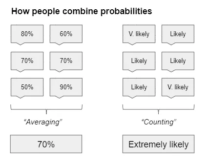

## テイクアウェイ

1. ビデオゲームは次の文化現象であり、バーチャルリアリティがその革命を牽引する
2. 投資ポートフォリオのリバランスタイミングは、リターンに大きな差をもたらす可能性があります
3. 確率の記述が苦手で、組み合わせるのはさらに苦手です

### ビデオゲームがスポーツスターを殺した

11月21日、人気ゲーム会社[Valve](https://store.steampowered.com/「Steam」)が新作ゲーム[Half-Life Alyx](https://half-life.com/en/alyx「Alyx」)を発表しました。AlyxはHalf-Lifeシリーズの続編で、史上最高のゲームの一つと広く評価されています。最後のアップデートは12年前にリリースされました。以下にAlyxの2分間のトレーラーをご覧いただけます。これはVR_inプレイすることを想定していることを覚えておいてください!_

  <iframe src="https://www.youtube.com/embed/O2W0N3uKXmo" title="Alyx Trailer" frameborder="0" allowfullscreen style="position:absolute;top:0;left:0;width:100%;height:100%;"></iframe>

<a href="https://www.youtube.com/watch?v=O2W0N3uKXmo" target="_blank" rel="noopener">Watch YouTube</a>

なぜこれが重要なのでしょうか?あなたはテクノロジーや金融、時折の自己卑下的なジョークを読むために購読しています。半分はおそらく動画をクリックしなかったでしょう。_Whoゲームに興味があるのですか?_

なぜあなたが関心を持つべきかを説明します。私はビデオゲームとeスポーツ(楽しみのためにビデオゲームを見る)が次の文化現象だと信じています。最新のアベンジャーズ映画を観ていなければ会話から疎外感を感じるのと同じように、最新のゲーム[^1]をプレイしたり観たりしていないことで疎外感を感じる日が近いでしょう。また、ARやVRが、携帯電話やPC、テレビのように、私たちの娯楽の次の形態になると信じています。AlyxがVRを主流に押し上げる触媒になることを願っていますが、市場はまだ時期尚早かもしれないことも認識しています。

馬鹿げているように聞こえますよね?結局のところ、『アベンジャーズ:エンドゲーム』だけで30億ドルの興行収入を記録した映画であり、石を[^2]投げるたびに面白くないアベンジャーズのミームにぶつかるし、[マーベル映画のスピンオフはウサギのように繁殖している](https://time.com/5167535/upcoming-marvel-movies/「今後のマーベル映画リスト」)。ビデオゲームは_How大きさになり得るのか?_

さて、

ゲームは映画より大きいですが、それでも成長が速いです。[世界のスポーツ産業]が5000億ドルの規模(https://www.businesswire.com/news/home/20190514005472/en/Sports---614-Billion-Global-Market-Opportunities「スポーツ」)を考えると、スポーツと同じ規模になるまでにゲームが成長する余地は十分にあります。

それを実現するには、親のクレジットカードでフォートナイトを遊ぶ子どもたち以上の拡大が必要です。[最大のeスポーツトーナメントはすでにスーパーボウルとほぼ同じ視聴者数を持っています](https://marginalrevolution.com/marginalrevolution/2018/08/esports-update.html「MR」)が、小規模な大会はまだ比較できません。新しいゲームは大人や高齢者まで楽しめる包括的な体験であってほしいでしょう。おばあちゃん_Wouldビデオゲームをしたことはありますか?_

さて[^3]:

ゲームに強気なのは私だけではありません。有名なベンチャーキャピタル会社A16Zはゲームへの関心を高めており、[彼らが信じるいくつかのトレンドについて](https://a16z.com/2019/10/16/trends-revolutionizing-games/「a16z」について書いています[^4])

>ゲームズは次のソーシャルネットワークです

> クロスプラットフォームプレイが新たな標準となるにつれて、マルチプレイヤーゲームは従来の世代よりもはるかに速く、規模も大きく成長するでしょう

> 次の大きな映画フランチャイズ、テーマパーク、玩具ラインはおそらくゲームから生まれるでしょう。

私がこれが実現すると確信している理由は少なくとも三つあります。

1. 人口統計。ゲーマーの子どもたちはゲーマーの親に成長しています。彼らの子どもたち自身もゲーマーになる可能性が非常に高く、マルチプレイヤーゲームを一時停止できない理由を説明する必要がなくなるでしょう。

2. 包摂性と交流の促進。誰でもビデオゲームがプレイでき、[サウジの王子でさえ](https://www.dailydot.com/parsec/saudi-arabian-prince-on-steam/「サウジ」です)。チームの勝利を見ているのを目の当たりにして、同じ部屋で自分でそのゲームをプレイすることもできます。VRがついに普及すれば、複雑な操作を気にする必要すらなくなります。なぜなら、インタラクションが直感的になるからです。3. コミュニティへの渇望。誰もが何かに所属したいと願っています。ゲームは、より大きな部族の一員として認識するためのほぼ無限の選択肢を提供します。より多くのゲームが自分たちが社会的体験を提供していることに気づくにつれて、開発者はフォートナイトのゲーム内コンサート(https://www.theverge.com/2019/2/21/18234980/fortnite-marshmello-concert-viewer-numbers「フォートナイト」)のようなコミュニティ機能を取り入れ始めるでしょう[^5]

これからゲームの経済モデルがどう変わるのか気になります。ゲーム内のバーチャルアイテムを現金で販売するのは[それほど古いものではありません](『WoW』https://www.eurogamer.net/articles/USD25-wow-horse-makes-millions)、つまりゲーム内の収益化はまだ未熟であり、将来的に収益化モデルの進化が期待されることを意味します。eスポーツについては、元ゲーム会社のエグゼクティブであるミッチ・ラスキー[^6]、[現在のeスポーツの構造はライブスポーツとは異なります](https://www.quora.com/What-is-your-view-on-the-future-of-eSports-in-comparison-to-other-major-US-sports「ミッチ」)と指摘しています。eスポーツゲームはパブリッシャーと直接結びついており、パブリッシャーはeスポーツをよりマーケティングツールと見なしています。eスポーツチームは収益を上げていますが、ゲーム全体の収益に占める割合はごくわずかです。これは、スタジアムチケットやテレビ契約収入を得るライブスポーツと対照的で、チームや選手がより大きなシェアを得ています。

もしかしたら、何千時間もビデオゲームをプレイしたことが無駄ではなかったと自分に言い聞かせようとしているのかもしれません。でも[^7]はそうは思わず、ビデオゲームとVRは今後も続くと思います。90%の確率で、ビデオゲームをプレイすることが例外ではなく標準になると予測し、VRがこの変化を可能にするプラットフォームになると50%の確率で予測しています。もし仲間外れにされたくないなら、VR体験を体験してみて、次に子どもたちに自分がアーリーアダプターだったと自慢できると思います。

### タイミング、運、そして運のタイミング

分散ポートフォリオを持つ投資家は通常、定期的にポートフォリオのリバランスを行い、理想的なポートフォリオ比率に戻すために投資を調整します。例えば、理想のポートフォリオが株式60%、債券40%の場合、年に一度その比率を確認し、必要に応じて売買して株式60%、債券40%に戻すこともできます。

このリバランスを行うタイミングは重要でしょうか?[この研究はコーリー・ホフスタインによる](https://blog.thinknewfound.com/2019/11/the-dumb-timing-luck-of-smart-beta/『Newfound Research』)は重要だと主張しています。彼らは「タイミングの運」を、例えば6月ではなく6月をリバランス日を選ぶことによるパフォーマンスの差として定義し測定します。その後、さまざまな投資戦略、投資数、リバランスの頻度を含むポートフォリオを構築します。簡潔にするために詳細は省略[^8]。

彼らは以下の通りを見つけました:

> ターンオーバー率の高い戦略はタイミングの運が良い。

> リバランスを頻繁に行う戦略はタイミング運が低いです。

> 制約の少ない宇宙の戦略はタイミング運が高くなります。

つまり、ターンオーバーが高く、リバランスの頻度が低く、制約が少ないほど、リバランスタイミングが最終リターンに与える影響は大きくなります。下の矢印は、同じportfolio_リターン_of最もパフォーマンスが良いバリエーションと最も悪いバリエーションの差を表しています。

また、異なる投資戦略間でのデルタを示す要約表も提示しています。以下の内容を理解するために言うと、「エンハンスト・バリュー」ポートフォリオの1ドルが4.45ドルから5.45ドルにリターンできた可能性があり、その1ドルの差はリバランス後の運によるものです。

彼らは次のように締めくくっています。

> 比較的集中したポートフォリオ(100銘柄)で、半年ごとのリバランス頻度(多くの指数定義で共通)の場合、年間タイミングの運は1%から4%の範囲で、これは年間パフォーマンス分散の95%信頼区間が約+/-1.5%から+/-12.5%に相当します。

> タイミングの運の大きさは、二つの戦略間で意味のある相対的なパフォーマンス結論を導き出す能力に疑問を投げかけます。

文脈を説明すると、[株式の名目リターンは年間約10%](https://mebfaber.com/2018/11/14/episode-129-mebs-take-on-return-expectations-portfolio-construction-and-practical-market-approaches/「Meb」)です。もしあなたのポートフォリオのリターン[^9]が似ていると仮定すると、10%のうち最大4ポイントはリバランス日のタイミングによるものかもしれません。個人投資家向けの提案の一つはポートフォリオを分割することですが、これはかなり手間がかかるように思えます。

>、モメンタムポートフォリオは四半期ごとにリバランスされるべきだと考えており、資本を異なる3か月間のリバランス期間(例:1月-4月-7月-10月、2月-5月-8月-11月、3月-6月-9月-12月)に分割することを提案しました。この解決策は「トランチング」または「オーバーラッピング・ポートフォリオ」と呼ばれます。

あるいは、前述の条件を逆にすることでタイミングの運を減らすこともできます。ターンオーバーが少なかったり、リバランスが頻繁になったり、ポートフォリオの集中度が低くなったりすると、そのタイミングが期待されるリターンスプレッドへの影響を下げます。

### 可能性はどれくらいありそうか

もし私が言うなら:

- 専門家によると、私はジャミーラ・ジャミルの専属バーテンダーになるために仕事を辞めた可能性が高い[^10]
- もう一人の専門家も、それは可能性が高いと言っています

これが起こる可能性は「高い」と思いますか、それとも「非常に高い」と思いますか?

もし:

- 最初の専門家は、上記のことが起こる確率は80%だと言っています
- 2人目の専門家は70%の確率だと言っています

今これが起こる確率はどのくらいだと思いますか?そしてそれは「可能性が高い」と言えますか?「非常に可能性が高いですか?」

[この論文はセリア・ガーティグとロバート・ミスラフスキーによる](https://papers.ssrn.com/sol3/papers.cfm?abstract_id=3454796「論文」)は、人々が複数の情報源からの確率予測をどのように組み合わせ、上記のような実験を行うかを論じています。このニュースレターをしばらく読んでいるなら、私たちの判断や確率の組み合わせが一貫していないのは驚くことではない[^11]。

私たちは皆、言葉の確率と数値的な確率をそれぞれ異なる方法で扱います。組織や個人によって「起こりうる」可能性についての考え方は異なります:

IPCCの気候変動に関する政府間パネル(IPCC)の報告で「起こりそう」とされる事象>は、発生確率が66%から100%でなければなりません。一方、DNI(米国国家情報長官)の報告書で「起こりそう」とされる事象は、55%から80%の確率でなければなりません。

もちろん、友人に「可能性が高い」の定義をアンケートしても、[答えがあまりにも多様で役に立たないでしょう](https://link.springer.com/article/10.3758/BF03327890「世論調査」)

論文は次のように提案しています:

>一般的に、数値的な確率は正確ですが方向性がなく、口頭の確率は方向性はありますが正確さは欠けます

ここでの方向性は、肯定的または否定的な意味合いを意味します。例えば、「起こりそうな出来事」と聞くことで、「80%」の予測よりも文脈と確信が得られます。

数値的確率と言語的確率の違いを確立した後、著者らは人々がこれらの確率をどのように組み合わせているかを研究します。

>予測を組み合わせる際に「平均化」または「カウント」戦略を用いる参加者を指します。

>「平均化」とは、参加者がアドバイザーの予測を加重平均し、自分の予測をアドバイザーの予測の間に挟む組み合わせ戦略を指します

>「カウント」とは、参加者が各アドバイザーの予測をポジティブなシグナルと解釈し、その方向に自らの予測を調整する組み合わせ戦略を指します

例えば、60%から80%の複数の予測を受け取った場合、「平均化」戦略は70%近くを達成し、「カウント」戦略は多くの予測があなたの見解を[^12]確認しているため80%以上に到達します。複数の予測が「起こりそう」とほとんどが示されていた場合、「平均化」戦略は「可能性が高い」と結論づけますが、「カウント」戦略は多くの人が「可能性が高い」と言ったため「非常に可能性が高い」と考えます

研究者たちは、数値的確率と言語的確率を異なる方法で組み合わせていることを発見しました。

>、人々は複数の数値予測を平均化しますが、複数の口頭確率予測を「カウント」し、その結果、各アドバイザーの予測よりも極端な予測が出されます言い換えれば、上記の例では平均を70%にしますが、数値的な予測を口頭の予測に変換すると、予測の数を「カウント」し、平均化するのではなく「非常にありそう」に到達します。研究者たちはまた、これが行動に影響を与え、予測の提示方法によって消費者が商品を購入するよう促すことも示しています。

ただし、「カウント」か「平均」かは、専門家が似た情報を持っているか異なるかによります。同じ情報に基づいている場合は、「平均化」が独特な誤差を打ち消すのに効果的です。そうでなければ、「カウント」はベイズ戦略の近似であり、個人的な予測を改善する効果があります。

## その他

1. [明らかなキャリアミス(あまり明白でないかもしれません)](https://www.calnewport.com/blog/2019/11/11/the-obvious-way-to-improve-your-career-that-might-not-be-so-obvious/「カル」)

   > 明らかなキャリアミス#1:あなたは主に一般的なアドバイスを求めている

   > 明らかなキャリアミス#2:表面だけを真似し、原因を真似しない

   > 明らかなキャリアミス#3:たとえ目的地を指ささなくても、簡単なルートを計画してしまうこと

2. [WSJがGoogleの検索アルゴリズムを調査した際の誤り](https://searchengineland.com/misquoted-and-misunderstood-why-we-the-search-community-dont-believe-the-wsj-about-google-search-325241「SEL」)
3. [デーティング市場はどう変わった?](https://gallery.mailchimp.com/2506bda6ca9a8b7ce8b3c54b4/files/1a8cc94c-6198-4f3d-b27d-8a6060ed6c5d/Tyro_Dating_Market_Thesis_Final_For_Twitter_Pub_v2.pdf『タイロ』)

   

   > 上記のチャートでは「バーやレストランで会った」という数字が急増していることに注目してください。データサイエンスでは、こうした報告者を「嘘つき」と呼ぶ専門用語があります。

4. 【ピラミッドの築き方】(https://analog-antiquarian.net/2019/08/30/chapter-16-how-to-build-a-pyramid/「ピラミッド」)
5. [数学オリンピアード問題の説明](https://aeon.co/videos/can-you-solve-this-slippery-maths-puzzle-that-doubles-as-a-morality-tale「aeon」)

[^1]:すでに25億人のビデオゲーマーがいますが、ゆるく定義されています。[Statistaによると](https://www.statista.com/statistics/748044/number-video-gamers-world/「統計」)たとえその数字を大幅に減らして統計的手法が不十分だったとしても、依然として大きいでしょう。ゲーマーは私たちの中に住んでいます。私はゲームとeスポーツを同義で呼んでいますが、技術的にはeスポーツは全体のビデオゲーム全体のごく一部に過ぎません。定義に十分な曖昧さがあり、eスポーツが成長すればその区別は無意味になると思います。

[^2]:へへ。

[^3]:私はポケモンGOに対して~~合理的な~~非常に正当な強い嫌悪感を持っていますが、私が知る限り他のどのゲームよりも高齢者から~~中毒~~熱狂的なゲーマーへと単独で変えたことは認めます

[^4]:私は彼らのすべての傾向、特に一度きりのヒットポイント(ゲームは依然として一度きりのヒットが期待されている)やオーガニックな発見ポイント(広告チャネルの切り替えに過ぎません)に同意するわけではありませんが、そのコメントはまた別の記事にお伝えします。

[^5]:VRルームで遊びたいすべてのゲームをつなげ、あるゲームのステータスが別のゲームに引き継がれるような、Ready Player Oneのようなメタゲームプラットフォームができることを期待しています。

[^6]:出典:[ブレイク・ロビンズ](https://twitter.com/blakeir/status/1110954210747650052?s=20「ブレイク」)

[^7]:自分自身を説得したことであって、時間の無駄ではありません。確かに無駄な時間でした。

[^8]: 詳細は論文で確認できますが、簡単にまとめると、2000年から2019年までのS&P 500の保有比率に基づいて4つの異なるポートフォリオを作成しました。1) バリュー:利益利回りでソート。2) モメンタム:過去12〜1か月のリターンでソート。3) 低ボラティリティ:実現12か月のボラティリティでソート。4) 品質:ROE、発生主義比率、レバレッジ比率の平均順位スコアでソートします。これら4つのポートフォリオそれぞれで、1) 保有数:50、100、150、200、250、300、350、400、2) リバランス頻度:四半期ごと、半年ごと、年間で。

[^9]:もちろん大きな前提ですが、単純化のために妥当な考えです。10%以上のリターンを期待していると主張することもできますが、他の人も同じで、実際にリスクが大きくならないと実際に得られるとは思えません。[^10]:素晴らしい番組『The Good Place』(https://www.nbc.com/the-good-place『Good』)での最近の役柄や、健康擁護活動で知られています。もちろんこれはあくまで仮定の話です。もしあなたがジャミーラなら別ですが、その場合は私を雇_please、ありがとうございますlikely._

[^11]:このニュースレターの副題は「人間は何をするにも苦手だ」かもしれませんが、それは大げさに聞こえます。

[^12]:もちろん、予測の分布や重み付けによりますが、説明しやすくするために簡略化しています。