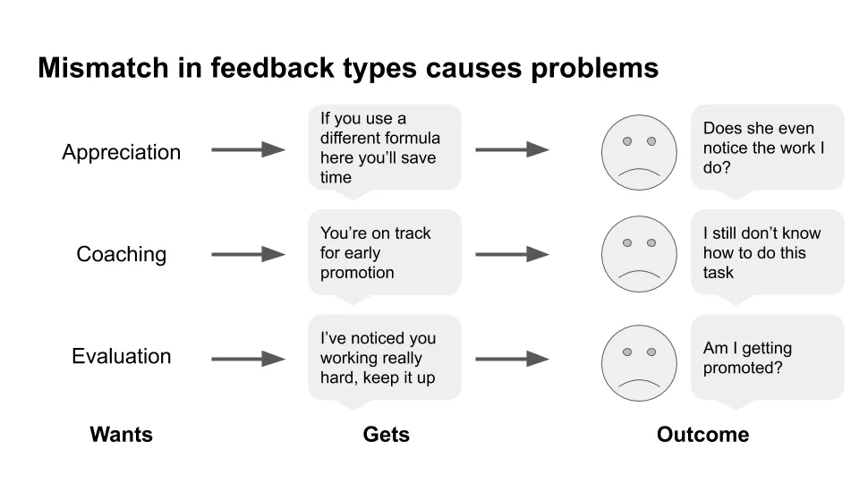

## テイクアウェイ

- フィードバックでトリガーされることが多いですし、それが不利になることもあります
- 主なフィードバックの種類を知ることで会話がより生産的になります
- 会話中に必ず誤解が生じ、その瞬間にそれを認識する必要がある
- フィードバックに備えるには、準備に努力を積む必要があります
- 自分たちにもっと優しくしなきゃ
- フィードバックを受けた後に行動を起こすことが鍵となります

休暇中にダグラス・ストーンとシーラ・ヒーンによる『フィードバックに感謝する』(https://www.npr.org/books/titles/441536239/thanks-for-the-feedback-the-science-and-art-of-receiving-feedback-well-even-when「ありがとう」)を読み、過去1年で読んだ中でも良い本の一つだと思いました。この本は、フィードバックの会話をより生産的にする方法について、フィードバックの種類やよくある問題点を説明することで述べています。

以下に本の要約と私自身の考えをいくつか加えました。注:多くのポイントは本からの直接引用です。

### 私たちはしばしばフィードバックに反応し、それが不利な結果になることがあります

- フィードバックを聞いたときに反応を引き起こす3つの異なるフィードバックトリガーがあります
  - **真実のトリガー**はフィードバックの内容によって引き起こされます。それは役に立たなかったり、単に間違っていると感じられます
  - **関係のトリガー**は、私たちがその人をどう見ているかや、どのように扱われているかに基づいてフィードバックをくれる人によって引き起こされます
  - **アイデンティティのトリガー**は、自分のアイデンティティに対して脅威を感じる何かによって引き起こされます
  - これはすべて合理的です。私たちのトリガー反応は、理不尽だから障害になるのではなく、会話に参加するのを妨げるからです。
  - フィードバックを受け取る能力が上達することは、そのフィードバックを絶対的な真実として受け止める必要はない

_LL:私はこれまで、トリガーされたときにフィードバックを受け入れたことがありません。それが自分にとって不利な結果でした。その人が嫌いだからといって、そのフィードバックが不正確だというわけではありません。なぜこうなるのかを自覚し、それを見つけることが、より良くなれる第一歩ですmyself._

### 主なフィードバックの種類を知ることで、会話はより生産的になります

- フィードバックには3つの異なる種類があります
  - 感謝と感謝
  - より良い方法で課題をこなすための指導
  - 自分の立ち位置の評価[^1]
  - 3つすべて必要だけど、欲しいものとは違うタイプが出ることが多い

_LL:私は職場でコーチングや評価を受ける方が圧倒的に好きですが、もちろん全員に当てはまるわけではありません。これが、なぜ人々が過小評価されたり誤解されたりしていると感じるのか、多くの理由を説明しています。これは、[Five Love Languages](https://www.5lovelanguages.com/「Five」のフレームワーク)を思い出させます。私は感謝ではなく、コーチングや評価を求め始めていますwork._

- フィードバックはしばしばラベルの形で届きます。例えば、「もっと自信を持つべきだ」
  - これにより、意図されたことと聞こえたことの違いが生じます。例えば、知らないと自信を持って言うことと、知らないのに知っているかのように見せかけること
  - この差を減らすために、フィードバックがどこにあるかを把握しましょう
  - 1.データと解釈に基づいて
    - 1) データと2) その解釈の違いを問う
  - 2.フィードバックがどこに向かっているのか、彼らが何を期待しているのか
    - コーチングを受ける際は、アドバイスを明確にする
    - 評価を受ける際、その結果を明確にすること
  - フィードバックのどこが正しいのかを問う

_LL:フィードバックがあるときはいつも例を求めるのが好きで、今後は解釈部分も明確に再確認するつもりです。効果的な会議を手配するのと同じように、フィードバックの会話後に期待が一致していることを確認するのも大切ですkey._

### 誤解は会話の中で必ず起こり、その瞬間に起こることに気づく必要があります- 私たちの自己認識と他者が私たちをどう見ているかの間にギャップがある[^2]これはどのように影響を受けますか
  - 私たちはその場で自分の感情を軽視しますが、それは他人が私たちをどう見たり考えたりするかです。例えば、ある提案に怒ったら、それを一度きりのことだと思い、他の人はそれを代表的なものだと考えます。
  - 私たちは状況に物事を帰属させるが、他人はそれを自分の性格に帰している
  - 私たちは自分の意図で自分を判断するが、他者は結果で私たちを判断する

_LL:これは行動金融や[カーネマンの研究](https://en.wikipedia.org/wiki/Thinking,_Fast_and_Slow『思考』)について読んだことがある人には馴染みのある話でしょう。単純な結論としては、私たちは常にすべて、特に何かについて間違っているourselves._

- フィードバックを受けた人がトリガーされて話題を切り替える「スイッチトラッキング」が起こりうること
  - 潜在的なポジティブな影響として、他のトピックも重要になる可能性があることです
  - 悪影響は二つのテーマが絡み合うことであり、私たちが二つのテーマがあることに気づかないことでさらに悪化します
  - 同時に2つのトピックが進行していることに気づいたら、それを明確に指摘し、今後の方向性を提案します。例えば、「関連しているが別々のトピックが2つ見えるので、それぞれを個別に完全に議論しましょう」

_LL:これが存在するとは知りませんでしたが、言及されてみてとても納得できました。過去の会話でその例をたくさん見てきました。改めて、それを明確に指摘することが解決策であることを覚えておいてください。それは不快かもしれませんが、より効果的なsituation._

- フィードバックをより大きな視点から見る
  - 君と僕の違いが問題を引き起こしているのか?
  - 役割の違いが問題を引き起こしているのか?
  - プロセスや方針、あるいは他の何かが問題を引き起こしているのか?

_LL:あなたとあなたの敵対者はどちらも有能かもしれませんが、インセンティブの構造が原因で仕事関係が悪くなっているかもしれませんorganisation._

### フィードバックに備えるには、準備のために努力が必要です

- フィードバックへの反応は三つの要素に依存します:
  - 幸福度と満足度の基準状態(例:幸福度の基準が高い人は、低い基準値の人よりもポジティブフィードバックに対してより肯定的反応を示します)
  - フィードバックを受けたときにベースラインからどれだけ離れているか(例:スイングが多いほど負のフィードバックに対する感度が高い)
  - 基準値に戻るまでの時間

- フィードバックに対してよりよく備えるためのいくつかの方法があります:
  - 事前に何が原因か考えて、自分の状態を確認し、発症するときはペースを落とす
  - その場の感情と、自分自身について語っている物語、そして実際のフィードバックを分けて考えること
  - フィードバックを内容に含め、何についてでないのかを理解する
  - 他人の視点、未来の視点、あるいはよりユーモラスな視点に変える
  - 他人が自分をどう見るかはコントロールできないことを受け入れること[^3]
- 私たちは受け取るフィードバックをコントロールできませんが、以下のように受け取り方を改善することができます:
  - 単純なラベルから離れ、複雑さを受け入れることへの移行
  - 固定マインドセットから成長マインドセットへの移行

_LL:フィードバックをくれる人の善意を前提に、[^4]は本当に私たちの改善を助けたいと思っているはずです。そうでなければ、何を変えるべきかを教えてくれる時間は取れません。そして、私たちはそのために変わることができますbetter._

### もっと自分に優しくしなきゃ

- 私たちは自分自身について三つのことを受け入れなければなりません。
  - 間違いを犯す
  - 我々には複雑な意図がある
  - 私たちも問題に加担しました

- 自分の責任は認めるべきですが、すべての責任を否定したり全ての責任を負ったりして極端に行かないで

_LL:私は以前にもどちらの極端な立場にいたことがあります。責任転嫁を避けたり、過度に自己否定したりしました。どちらも生産的ではなく、あなたを平等に見せてしまうworse._

- 最初のスコアやフィードバックをどれだけうまく受け止めたかに応じて、2つ目のスコアを自分に与えましょう_LL:このセカンドスコアの概念が好きです。これは、何回倒れるかではなく何回立ち上がるかという古い決まり文句に関連しています。しかし、決まり文句だからといって悪いとは限りません。今後は失敗についてもっと書くと思いますが、それは学びの中心です。つまり、悪いフィードバックを受けることになり、どう対処するかを学ぶ必要があるということですit._

- 境界線を持ち、フィードバックを断ることは健全な関係にとって非常に重要です。これには以下が含まれます:
  - ありがとうと言って「いいえ」と言う、例えば「嬉しい」と言う、受け取らないかもしれません
  - 今はダメだと言う、例えば今は敏感すぎる
  - どんなフィードバックも拒否すること

_LL:これは私にとって初めてですが、重要なことです。誰かからフィードバックを受けるのは圧倒されるかもしれませんし、時間をかけてもらうことがあります。もし相手が本当にあなたの最善を考えてくれているなら、距離が必要だと理解してくれるはずです。誰かが自分の視点を受け入れさせようと強制すると、その人には自分の意図があるのがよく分かりますmind._

### フィードバックの後に行動を起こすことが鍵です

- フィードバック会話は3つの部分で構成されています:
  - オープン:会話の目的は何か、フィードバックの種類は何か、最終的なものか?
  - 本文:聞くこと、主張すること、会話のプロセスを管理すること、問題解決
    - 聞くこと:明確な質問をし、相手の気持ちを認める
    - 主張:対立せずに立ち向かうこと[^5]
    - 管理:議論を観察し、どこで問題が発生しているかを診断し、明確に介入して修正する
    - 問題解決:さて、このフィードバックに対してどう対処すべきでしょうか?
  - 閉じる:現状と次に何をすべきかを明確にする

- 行動を起こすいくつかの方法:
  - 『私がやっていることで、自分の邪魔になることは何ですか?』と聞いてみてください。
  - 『あなたにとって何か変わると思うことは何ですか?』と聞いてみてください。
  - 小規模でリスクの低い実験を試みる
  - 人を受け入れ、助けを求めることが親密さを育む場所です
- Jカーブを理解する:習慣を変えるたびに、良くなる前に悪化する可能性が高いです。さらに重要なのは、良くなる前に気分が悪くなるということです

_LL: [waitbutwhy](https://waitbutwhy.com/2018/04/picking-career.html「wait」)も以前、新しいことを学ぶのが難しいと書いています。なぜなら、その最初の変化は痛みを伴い、報われないからです。最初のピークを乗り越えるまで、しばらくは辛いものになるでしょう。私は学習を連続した曲線(JかS、好きな形)と考えています。つまり、上達するためには常に不快で苦しい状況にし続ける必要があるということです。_

- 変われないなら、他者への影響を減らす努力をしましょう
  - それが彼らにどう影響するかを尋ねる
  - 変わらないあなたに対処できるように指導する
  - チームで問題解決を試みる

_LL:自分自身についてどうしても変えられないこともある。毎晩のディナーで大量のバターを塗るのを止められないよね(https://www.thecitycook.com/articles/2015-10-12-bordier-butter「バター」だ)。著者たちはそれを許していると思っているけど、それでも他人への悪影響を減らす必要があることに注意しておいてください。無理に言わないでくださいdick._

- 組織の文脈で、フィードバックを提供するのに役立ついくつかのポイントを挙げます。
  - 利益だけでなくトレードオフの説明
  - 評価、指導、評価を別々に行う
  - 組織内での学習促進

LL: まだ深く調べていませんが、著者たちがより効果的にフィードバックを与える方法についても書いていることを期待しています。学習文化を推進する企業の例は稀で、Stripeはその例外の一つで、それが評価の高い理由かもしれません。

**全体的に、この本は素晴らしく、時間をかける価値があると思いました。** 文章は明瞭で、閲覧しやすい要約セクションもあります。読むのも早いので、特に年次レビューの時期に近づいているので、ぜひ読んでみてほしいです。

[^1]:すべてのコーチングには評価も含まれており、誤解されることがあります。評価は他の種類のフィードバックをかき消してしまうことがあります[^2]:著者たちは、**私の思考や感情**と**私の意図**、**私の行動**、**他者への影響**、**他者たちの私についての物語**との間にギャップマップがあると語っています。

[^3]:彼らの言うことをすべてそのまま受け入れないでください。彼らの意見を全体の一つの入力として受け取ってください

[^4]:これまでにも意地悪なフィードバックや、ただの復讐心を持つフィードバックを送った人はいただいたと思います。難しいでしょうが、最善の方法は無視することのように思えます。

[^5]:フィードバックを受け取る文脈で自己主張について語るのは逆説的に思えますが、フィードバックは一方通行の活動ではありません。あなたの視点がなければ、与える人は自分の言っていることが有用か、正しいか、あなたの考えと一致しているかに気づかなくなります