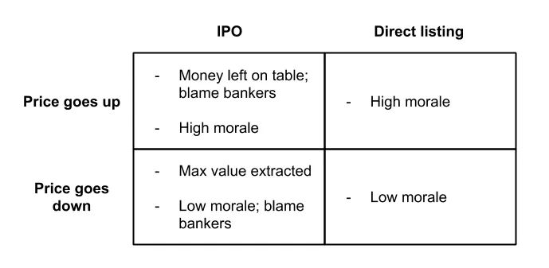

## テイクアウェイ

直接リスティングを行うかどうかは、企業の種類によります

## IPOと直接上場の比較

[アスワス・ダモダラン](https://twitter.com/AswathDamodaran?ref_src=twsrc%5Egoogle%7Ctwcamp%5Eserp%7Ctwgr%5Eauthor「アスワス」)、[^1]最高のファイナンス教授の一人で、[以前IPOと直接上場について書いた](http://aswathdamodaran.blogspot.com/2019/10/disrupting-ipo-process-challenging.html?「アスワス」)。以下でハイライトを振り返ります。銀行業界の元同僚は異論を出しても構いません。直接上場に馴染みがない方は、[a16zに入門書があります。](https://a16z.com/2019/07/02/direct-listings/「a16z」)

>、直接上場で最大の違いは、公開日には新規資金を調達できないことです。これは聞こえるほど大きな問題ではありません。なぜなら、会社は上場前の投資ラウンドで資金調達を行ったり、その後数か月で二次公開を行うことができるからです

新規資本を調達できないという問題は、現在も事実であり、[SECが許可提案を却下した後](「CNBC」https://www.cnbc.com/2019/12/06/nyse-proposal-to-allow-fundraising-in-direct-listings-rejected-by-sec.html)。アスワスが指摘するように、これは決定的な問題ではありません。なぜなら、企業は上場の前後に資金を調達できるからです。

アスワスは、IPOを運営する銀行と、銀行の関与が少ない直接上場を行う銀行の賛否両論を次のように述べています[^2]:

> **タイミング:** 銀行は自分たちの経験と人間関係がIPOの最適なタイミングを判断できると主張しています

>ダモダランは、2019年末のように勢いが急激に変わった場合、市場のタイミングを誰も正確に把握できないと主張しています

私はこの点ではダモダラン側の方に傾いています。銀行側の弁護をすると、投資家と話す仲介者として、投資家の感情に関するフィードバックは定期的に受けています。ただし、実際に株価を決めてみるまでは確実に言えません。

> **目論見書の専門知識:** 銀行は、その経験が提出書類の作成に役立つと主張しています

> ダモダランは、ほとんどの目論見書、特にリスクおよび事業のセクションが似ていると主張しています。

ダモダランさんの意見には同意しますが、彼が示唆したように、その多くは法的な理由によるものです。目論見書のリスクセクションは、重要なことを伝えるよりも法的な保護のため[^3]。会社のセクション作成に多くの時間を費やした元同僚を知っていますが、ここで大きな価値を加えるのは難しいです(すみません皆さん)、特に上場する会社が元銀行員が多い場合はなおさらです。

> **IPOの価格設定:** 銀行は、前回の公開価格と予定された公開価格の間のギャップを埋め、適切な比較対象企業のセットを見つけ、適切な評価倍数を選び、投資家の懸念を特定できると主張しています。

>ダモダランは、銀行が価格設定をうまく行っていないと主張しており、これはWeWorkのIPOに見られる例です。これは、銀行が間違った比較株や倍数を選んでいるか、間違った投資家と話しているか、価格設定過程で偏っているためであり、後者が最も可能性が高いからです。

比較可能な企業のセットや複数を間違えて選ぶことはあまり問題になりません。比較組合は投資家の間で事前に社会化されているため、通常は広く合意[^4]。一般的な倍率(EV/Rev、EV/EBITDA、P/E)はごくわずかなので、倍率の種類も広く理解されています。

ただし、銀行が価格設定の過程で偏っているという点には同意しますし、その傾向が強いインセンティブもあります。[マット・レビンが以前に書いているように(https://www.bloomberg.com/opinion/articles/2019-09-09/we-might-not-be-working"マット")、銀行は会社に採用されるために売り込みをしているので、価格レンジが高ければ高いほど良いのです。**CEOに1億ドルの価値があると伝えると、採用されやすくなります。** 彼らが採用されてその価格を満たす必要がある時こそ、期待値を管理し始めます。

会社にとって適切な価格設定は難しい問題であり、その点については後ほど触れます。

> **マーケティング:** 銀行は投資家の顧客層にリーチし、発行会社の投資家基盤を拡大できると主張します

>ダモダランは、a) 一部の企業は銀行自身よりもよく知られていること、b) 投資家は銀行の提案に対してより懐疑的になっていると主張しています一つ目は主観的な話です。SlackやSpotifyは自分たちをマーケティングできますが、[SiTimeはおそらくできない](https://www.globenewswire.com/news-release/2019/11/21/1950494/0/en/SiTime-Corporation-Announces-Pricing-of-Initial-Public-Offering.html「SiTime」)。あまり知られていないなら、銀行にマーケティングしてもらうのは良い考えかもしれません。銀行は投資家とコネクションがありますが、あなたにはつながりません。

[中央値のIPO発行額は~1億ドル](https://www.statista.com/statistics/251149/median-deal-size-of-ipos-in-the-united-states/「Statista」)、そして[IPOは会社の約20%を売却する](https://corpgov.law.harvard.edu/2017/05/25/2017-ipo-report/「ハーバード」)を踏まえると、ほとんどのIPOはあなたがすでに知っているような有名企業ではないと推測できます。[最近のIPOリスト](https://www.nyse.com/ipo-center/recent-ipo「NYSE」)を見て、どれだけ知っているか確認できます。**ほとんどの企業は銀行が市場に出て投資家にアプローチすることで恩恵を受けるでしょう。**

2つ目のポイントは無関係に思えます。プロの投資家(バイサイド)であれば、そもそも株式調査(売り側)の推薦に基づいて意思決定をしているわけではありません(売り手側の皆さん、すみません)。個人投資家であれば、その情報は得られません。

> **アンダーライティング保証:** 銀行は価格リスクを受け入れ、あなたの株が一定の価格で売れることを保証できると主張します

>ダモダランは、IPOが企業の価格を安く設定しているなら、価格を下げることは役に立たないと主張しています

引受保証は歴史的により重要でしたが、現在はあまり重要ではありません。価格の問題に戻ります。

> **アフターマーケット価格サポート:** 銀行は株価が取引開始直後に価格を安定させることができると主張しています

>ダモダランは、これは大企業のIPOにとっては困難または不可能だと主張しています

**大規模IPOでは価格安定化が難しいという点には同意します。** しかし、上記の中央値IPO発行規模の文脈を踏まえると、多くの企業にとっては価値があると思います。銀行が価格を安定させる方法は、割り当てた株式を多数売却し、会社に対してショートポジションを取ることです。銀行は会社またはオープンマーケットから株式を取得してショートポジションをカバーし、オープン[^5]前に価格を支えます。

適切な価格は何でしょうか?これは複雑な問題です。IPOの一般的な特徴は、株式がプロの投資家に10ドルで事前販売され、IPO後はプレミアム(例えば20ドル)で公開市場で取引を開始することです。この[IPOポップ](https://pitchbook.com/news/articles/understanding-the-ipo-markets-pop-culture「IPO」)は、ビル・ガーリー(https://markets.businessinsider.com/news/stocks/slacks-direct-listing-bill-gurley-says-startups-call-morgan-stanley-2019-6-1028298641「ビル」)などのVCから批判されており、この非効率性は、IPOプロセス中に株式を取得したプライベート投資家(ビルなどのVC)から公開投資家への資金移転だと[^6]指摘されています。

価格設定に非効率があるのは同意しますが、多くの企業は価格を過小評価して株価を下げるよりも、株価が上がる方を好みます。**もし銀行家が価格を過小評価したと責めるなら、彼らが過大評価し、会社に最大の利益をもたらしたことを称賛すべきです。私はそれをしている人を見かけません、理解できますが。

企業は士気向上のために非効率を犠牲にする気があるようです。確かに、開場で20ドルを買って株価が横ばいになることもできましたが、10ドルから20ドルへの上昇は(非合理的に)人々をより幸せにします。また、もし20ドルで始業して3か月後に10ドルまで下がったらどうでしょうか?その時の適切な価格は何だったのでしょうか?

ダモダランは、なぜIPO現状が維持されてきたのか、**惰性、銀行関係への悪影響への恐れ、そして企業が責任を押し付ける必要があるという理由を挙げて締めくくっています。** 私もこれには同意します。最終的にはあなたの会社によります。直接上場は定義上、より価格効率が高いです。大手で有名なら、直接上場できる可能性が高く、そもそもメールニュースレターのアドバイスは受けるべきではありません。小規模でそうでない場合は、銀行家の助けや投資家とのつながりが必要でしょう。私は3年後もIPOが上場の大多数を占めると80%の自信を持っています。

## その他1. [Gmailやあなたのスマホのキーボードのようなテキスト予測アルゴリズムを使ってチェスをプレイできるでしょうか?](https://slatestarcodex.com/2020/01/06/a-very-unlikely-chess-game/「スレート」)
2. [職場での自己開示の弱点は、ステータスによっては助けになるか妨げになるか](https://faculty.wharton.upenn.edu/wp-content/uploads/2019/10/when_sharing_hurts.pdf 'Wharton')ツイートの要約は[こちら](https://twitter.com/leon_lin_s/status/1221891694964113409?s=20 'twitter')をご覧ください
3. [中国のテック企業が中国の旧正月に制作したゲームの例](https://a16z.com/2020/01/24/tech-and-chinese-new-year/ 'a16z')
4. [レストランがPRで成功やベストオブリストに勝つ方法](https://ny.eater.com/2020/1/13/21009796/restaurant-publicists-pr-agencies-nyc『Eater』)
5. [複雑で美的に美しい迷路の設計方法](http://www.cgl.uwaterloo.ca/csk/projects/mazes/「迷路」)

[^1]:金融だけでなく、実際に教育したいという気持ちも考えています。どれだけの教授が、お金を払わずに無料でオンラインで本を手に入れろと言うでしょうか?

[^2]:正直に言うと、私はかつてIBのカバレッジアナリストをしており、IPOにも携わっていました。また、投資銀行は投資とは無関係です。ご存知かもしれませんが。

[^3]:企業は法的責任を減らすために、あらゆるリスクを目論見書に投入するインセンティブを持っています。だからこそ、「私たちは一度も利益を出したことがなく、今後も利益を出せないかもしれない」といった表現がよく見かけるのです

[^4]:こんな感じです:投資家が銀行に「どの比較を考えているの?」と尋ねると、銀行は「このセット、この別のグループ、そしてこのグループも」と答え、投資家は「ああ、そのグループも含めて興味深いけど、他は合っているね。他の投資家はどう思っている?」と答え、銀行は「ああ、彼らはそれを○○に対しても相当金している」と答えます。

[^5]:これはグリーンシューオプションとして知られており、最初に導入した会社の名前にちなんで

[^6]:ビルがここで偏っている理由がわかるでしょう