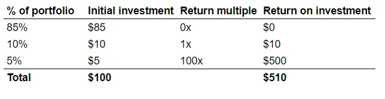

## テイクアウト

『Secrets of Sand Hill Road』は金融業界の人でも読み応えがあり、すでにVCにいる人にはあまりおすすめできません。

## サンドヒルロードの秘密 書籍概要

休暇中に『Secrets of Sand Hill Road』(https://a16z.com/book/secrets-of-sand-hill-road/「a16z」)を読み、VCや業界のインセンティブ付けについての良い入門書だと思いました。業界外でエンジェル投資、公開市場、投資銀行の経験しかありませんが、それでも今まで知らなかったことをいくつか学びました。**業界にいるなら新しい情報はあまりないかもしれませんが、ターゲット層ではないでしょう。以下は本のハイライトです:

マークとベンがa16zを築こうと決めた「何かもっと」>、創設プロダクトCEOが世界クラスのCEOになるための展望を高める人々や機関のネットワークでした

資本が商品化しうることを認識し、他の手段で差別化する必要がある。

> ほとんどのVCにとって、\[returns\]の分布は次のような形になります:

>投資の50%が「損壊」とされており、これは投資の一部または全部を失うという非常に丁寧な言い方です

>投資の20〜30%は「シングル」または「ダブル」です。全てのお金を失ったわけではありませんが、投資した数倍のリターンを得たのです

投資の10〜20%>私たちのホームランであり、VCは自分の10倍から100倍のリターンを期待しています

スコットは以前にも公に言及しています(https://www.quora.com/What-are-some-common-misconceptions-that-non-industry-people-have-about-venture-capital/answer/Scott-Kupor「スコット」)が、VCの[ベースレート](https://plus.credit-suisse.com/rpc4/ravDocView?docid=gIamqy「ベースレート」)が何かを思い出させるのにはいつも役立ちます。私は以前にもこのテーマについて書いています(/writing/moloch 'Xi')

念のために言うと、上記よりもリターンの分配を保守的に考えても、100倍のリターンは成功をもたらします:

> 創業チームをどのように評価しますか?もちろんVCによってやり方は異なりますが、共通して調査する分野がいくつかあります。

> なぜこの問題群に対してこの創設者を支持するのではなく、問題をより有機的に理解する他の人が現れるかを待つべきなのでしょうか?

> 明日、私たちの店に入ってくるかもしれない市場のニーズに応えるための、より適したチームを考えられるでしょうか?

> 創設者のリーダーシップ能力

> アイデアは独占的なものではなく、スタートアップ企業の成功や失敗を決定する可能性も低いです。最終的には実行が重要であり、実行はチームメンバーが明確に表現されたビジョンに向けて協力して働くことから生まれます。

最後の点は繰り返す価値があります。[マーク・アンドリーセンがこの講演で](https://www.youtube.com/watch?v=UnU5Dikdr2U「マーク・トーク」で指摘したように、多くのアイデアには歴史的な前例がありますが、何らかの理由でうまくいきませんでした。**アイデアを考えるのは簡単だが、良いアイデアを得るのは難しく、さらに努力するためにそれをハッキングする。**

> 怠慢の罪は行為の罪よりも重い

VCリターンについて前述のべき乗則のダイナミクスを考えれば、これは驚くべきことではありません。個々の企業におけるVCの持分は十分に小さいため、分散を目指すべきです。

> 創業者として、VCがあなたの会社に投資を提案している具体的なファンドについて尋ねるべきです \...[...\] ファンドサイクルの後半に投資が起こるほど、VCが次の資金調達ラウンドのために十分な準備金を確保できない可能性が高くなります

**ファンドサイクルが遅いほど、あなたの前の企業のフォローオンに資金が確保されている可能性が高くなり、チャンスを得られる可能性は低くなります。**

>多くのGPはファンドの資本の1%を拠出し、多くの場合2〜5%を拠出します

業界のベンチマークを知っておくと役立ちます

> GPがパススルー事業体に投資すると、LPに潜在的な税リスクが生じる可能性があります。Cコープへの投資はそのような問題を引き起こしません。したがって、ほとんどのGPSはパススルーへの投資をできるだけ避けます。

私はいつも会社構造の税務処理の違いを調べなければなりません。これはCコープとして構造化すべき重要な理由を思い出させてくれます> \[15パーセント]は、スタートアップにおける初期従業員の選択肢プールの標準的な規模である傾向があります

繰り返しますが、業界のベンチマークを知ることは役立ちます。オプションプールの詳細やオプションの評価方法については、[Fred Wilson here](https://avc.com/2011/05/sizing-option-pools-in-connection-with-financings/ 'AVC')または[Matt Cooper](https://medium.com/swlh/a-no-b-s-guide-to-startup-stock-option-grants-526a8bc33c2b 'Matt')をご覧ください

>、あなたのビジネスの市場機会が十分に大きく、7年から10年の間に利益を上げ、高成長、数億ドル規模の収益を生み出すことができると自分に納得させることができるはずです

先ほど述べたべき乗則リターンを求めることを考えると、すべての企業がベンチャーキャピタルの恩恵を受けるわけではありません。**だからといって悪いビジネスというわけではありませんが、VCには適していないだけです。**

負債が少ない企業もあれば、負債が多い企業もあります。それはどちらかが本質的に優れているということでしょうか?より多くの負債を負うことで資本コストを下げるかもしれませんが、それがあなたのビジネスに適さなければ問題に陥ることになります。最終的には適切な資本_for you_を取ることが大切です。

>多くの起業家は事業の初期段階で12か月から24か月ごとに新たな資金調達を行います

[カルタ](https://carta.com/blog/getting-funded-how-long-does-it-actually-take/「カルタ」)と[クランチベース](https://news.crunchbase.com/news/the-time-between-vc-rounds-is-shrinking/「クランチベース」)も比較的似た時代を示しています。

> a16zで起業家が犯しがちな大きなミスの一つは、攻撃的な評価額で資金調達が少すぎることです。これはまさに避けるべきことです。これにより高水準評価額が確立されますが、次のラウンドの評価額を安全に引き上げるために必要な財務的資源が不足しています。

**だからこそ、ニュースで積極的な初期段階評価が発表されるたびに私は懐疑的になります。もっと背景がなければ、それが創業者にとって良いことだったのか悪いことだったのか判断が難しいです。多くの場合、本当に知ることができるのは何年も経ってから、あるいはそれ以降です。最近の決定的な例はWeWorkです。

>、VCに提案していて、彼女があなたの市場へのアプローチ計画はすべて間違っていて、今まで提案した方法とは違うやり方をすべきだと言った場合、間違った反応はすぐに計画を放棄することです

シリーズAの資金調達時によく見られる事実パターン>、起業家がこれらのコンバーチブルノートのシリーズを通じて予想以上に多くの株式を売却していることに驚くことです。

**私は価格付きラウンドを好むが、それは現在の市場状況ではない**[Fred Wilson](https://avc.com/2017/03/convertible-and-safe-notes/「AVC」)が書いているように。価格付きラウンドは創業者にとってキャップテーブルを明確にしますが、先送りにするのは簡単で、そのため曖昧さが蔓延しています。妥協案としては、SAFEや他のコンバージョンを行ってもキャップテーブルを明確にすることですが、なぜか創業者を含めて多くの人がそれをしたがらないようです。

> では、VCは初期段階のスタートアップを実際にどのように評価しているのでしょうか?

>、5年から10年後にその会社がファンドにとって意味のあるリターンドライバー、つまり勝者となるにはどのような姿をとるべきでしょうか?

>それが起こるには、ビジネス上でうまくいくものは何でしょうか?彼らが目指す市場規模は、売上1億ドルの企業を支えるほど大きいのでしょうか?会社が失敗する可能性のある要因は何でしょうか?意思決定ツリー上のこれらのノードの成功か失敗の確率をどう評価すればいいのでしょうか?

会社の初期段階では、財務面は通常あまり重要ではありません。**しかし、10倍から100倍のリターンを達成できる話ができないなら、投資の候補者として魅力的とは言えないでしょう**

>1倍以上の清算優先権は、入社評価が低い投資家(および従業員)と、初めて会社に入社する投資家と、はるかに高い評価額で入社する投資家との関心をより密接に一致させる方法となり得ます>「非参業」とは、VCが二重に取り合えないことを意味します。代わりに、彼女は選択権があります。清算優先権を最初から外すか、優先株を普通株に転換するかです。[...\]「参加」はその逆の形で、VCはまず清算優先権(元の投資を回収)を得るだけでなく、その後株を普通株に転換し、残りの収益も参加できます

すべての段階で、参加優先企業がいる取引の割合を知りたいです。

>、すべての取引にはメリットとデメリットがあり、通常、決定的な正解はありません。決断の一部は、会社の将来に対する自信、目標達成に今どれだけの資金が必要か、そして自分により多くの利益をもたらすためにどれだけのリスクを取る覚悟があるかによって決まります

先ほど述べた「プラトニックな理想」資本構造は存在せず、正しいものだけだという点に似ています_for you_

取締役>優先株に対して受託者義務を負うことはありません。むしろ、裁判所は長らく優先権は純粋に契約的な性質を持つと述べてきました

今まで気づいていなかった

> 注意義務の訴訟に敗れたら、それは決して楽しいことではありませんが、少なくとも最終的な損害に対して個人的責任を負うことはないでしょう。忠誠義務違反についてはそうではありません

これも気づいていませんでした。これは投資家や創業者の法的責任に関する話です。

> ダウンラウンドを行わなければ、会社は前進を続けるかもしれませんが、次の資金調達ラウンドを調達する際に新たな課題に直面する可能性が高いです。そして、勢いを取り戻し始めたばかりの企業にとって、再びリセットしなければならないほど有害なものはありません

痛いことを先延ばしにする(ラウンドの価格を曖昧にしない)が、たいていは後々**より大きな問題*を招く傾向に気づいてください。

> a16zにとって、投資後のリソースチームへの投資は、他の非常に成功し競争力のあるベンチャー企業と競争するための一つの方法です。

この付加価値がVCコミュニティ内で広がり始めており、[First RoundのTalent Network](https://firstround.com/talent/「First Round」)から[NFXのコンテンツライブラリ](https://www.nfx.com/「NFX」)に至るまでです。**これはa16zが設立された「Network of People」のアイデアと一巡しています。

> まず、多くの伝統的なベンチャーキャピタル企業は、スタートアップの初期段階で資金提供できるだけでなく、そのライフサイクル全体を通じて成長資本の源となるためにファンド規模を拡大しています。

> 第二に、企業がより長く非公開化を選択したことで、より非伝統的な成長資本の源泉が資金調達市場に参入しています。公開ミューチュアルファンド、ヘッジファンド、ソブリンウェルスファンド、ファミリーオフィスなどの戦略的資本源は、これまでスタートアップが上場するのを待ってから成長資本を投資してきましたが、これらのプレーヤーのほとんどが現在、後期段階のスタートアップに直接投資する決断を下しています

例としては、[Coatue](https://www.businessinsider.com/coatue-management-early-stage-venture-capital-fund-2019-8「Coatue」)や[Tiger Global](https://techcrunch.com/2018/10/22/looks-like-tiger-global-management-just-closed-the-second-biggest-venture-fund-this-year/「トラ」)のような伝統的に基本的な長短トラの子が、現在は発達した私用腕を持ち、公的な腕よりもさらに成功している可能性があります。