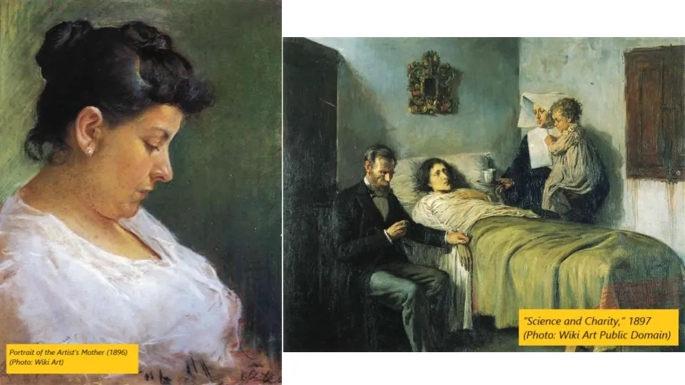
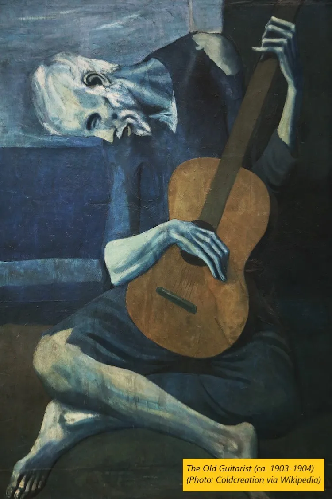
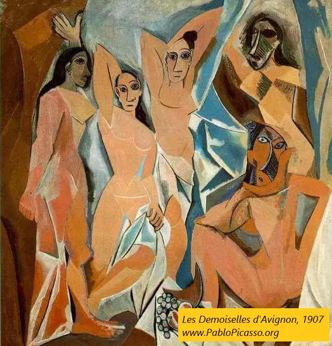
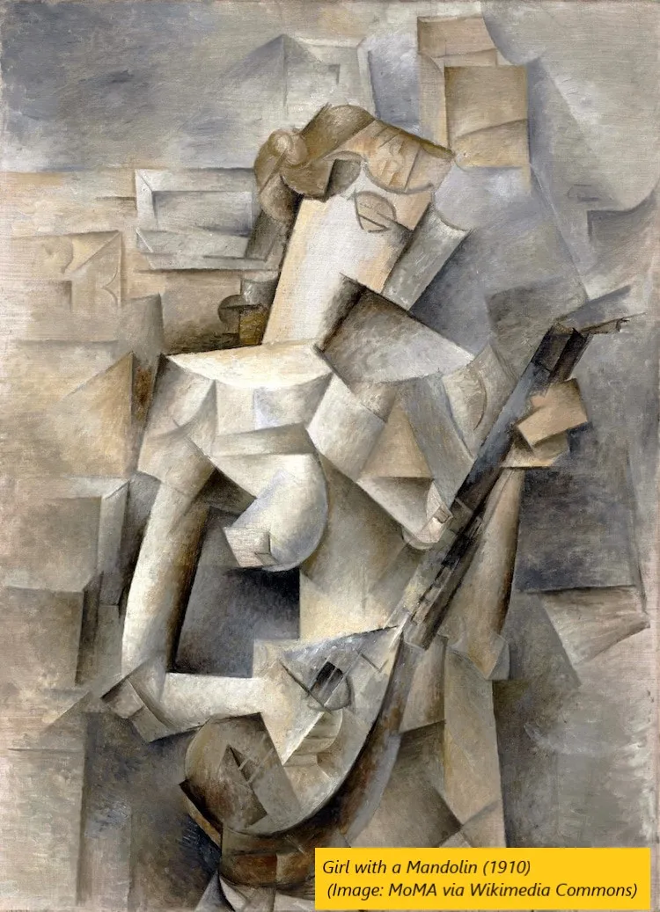
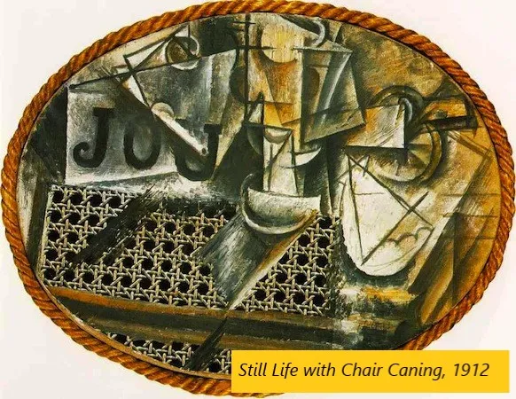
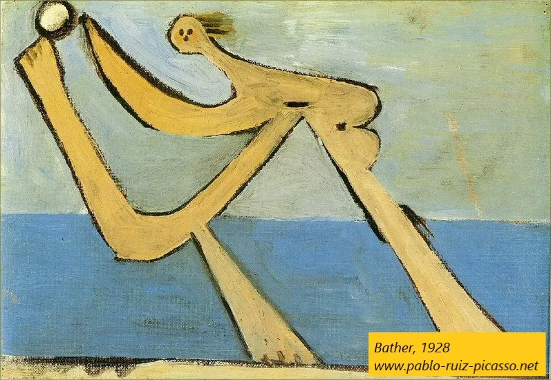

## テイクアウト

ピカソを理解するには、彼の文脈、思考の進展、現状への挑戦を知る必要があります

## ピカソの時代

ゲティ美術館は最近、有名な美術作品を再現するよう一般公開に挑戦し(https://blogs.getty.edu/iris/getty-artworks-recreated-with-household-items-by-creative-geniuses-the-world-over/「ゲッティ」)、Reddit[^1]でこのような面白い記事が生まれました

左の元の画像のスタイルは独特で、多くの人はピカソの作品だと推測するでしょう。たとえ見たことがなくても(私も見ていませんでした)。[その通りです](https://www.wikiart.org/en/pablo-picasso/woman-with-bird-1970『鳥と共にいる女性』)

もちろん、投稿とともに「なぜこれが芸術なのか」「子供でも描ける、ひどい」「エリートのための脱税」といった定番のコメントが寄せられました。これらは多くの現代美術作品に共通しています。これらの質問のいくつかは妥当であり、芸術の一部は確かに[マネーロンダリング](https://www.natlawreview.com/article/art-and-money-laundering「お金」)や[脱税詐欺](https://newrepublic.com/article/147192/modern-art-serves-rich「税」)[^2]かもしれませんが、なぜピカソが崇拝されているのかを詳しく見てみましょう。私は美術の専門家ではなく、この投稿を書きながら学びながら学んでいることを念頭に置いてください。話を逸すために、ピカソだけについて話しますが、[ジョルジュ・ブラック](https://cubismsite.com/georges-braque-cubism/「ブラック」)もこの時代の重要な人物であり影響力のある人物です。

## 初期の頃

ほとんどの芸術は文脈とともに理解するのが最善なので、まずはピカソの背景から始めましょう。[ピカソは1881年に芸術家の両親のもとに生まれました。](https://mymodernmet.com/pablo-picasso-periods/『メット』)当時、芸術における写実主義がまだ人気の時代でした。これには、下記の「画家の母の肖像画」や「科学と慈善」のような傑作も含まれており、明らかに才能ある人物によって描かれました。これらの作品は、ある時点の場面を捉えるために描かれており、まるで特定の視点からそれを見つめているかのように感じられます。質感や色彩の生き生きとした細部、奥行きの錯覚や立体的な外観、そして影の投影によって光の出ている方向がわかる様子に注目してください。まるで一つの角度から写真を撮ったかのようです。

「科学と慈善」では、シーツのしわが前と後方の部分を示唆しているのに注目してください。枕の陰影は、頭がへこみを作っていると錯覚させます。男性の毛先の筆致が、子供の巻き毛に異なる質感を与えています。

ピカソは上記の絵を見て、すべてがあまりにも難しすぎると判断し、その後の人生を[タイガーペアレンティング](https://www.apadivisions.org/division-7/publications/newsletters/developmental/2013/07/tiger-parenting「トラ」)に反抗し、意味不明な奇妙な絵を制作し続けたのではないかと思うかもしれません。私が家を買う余裕を諦めたように、ピカソも美しい絵を諦めたのかもしれません。なぜなら、彼には耐えられなかったからでしょう。

また、上記の絵画も実はピカソの作品で、[^3]は間違っています。しかも、それらは彼が20歳未満の頃に描かれました。明らかにピカソは絵を描くことができ、古典の巨匠たちに劣らず上手く描いていました。次に誰かがピカソに才能がないと言ったら、[彼の初期の作品](https://mymodernmet.com/picasso-early-work/「初期」)を教えてみてください。

さて、上の2人の後に描かれた別のピカソの作品を見てみましょう。

違いは何でしょうか?まず、色が変わっていて、色覚異常の私でも違いがわかるほどです。それが大きなムードの変化をもたらし、絵全体が暗く、悲しく、痛みを感じさせます。画像も以前よりリアルさが薄れ、細部も減っていますが、それでもギターを持った人間だと認識できます。

何が変わらなかったのでしょうか?私たちは依然として一つの視点からシーンを見ており、絵の中の被写体の一つの視点だけを見ています。深みは減りましたが、いくつかのものが他のものの前に置かれているのが見えます。まるで一つの角度から写真を撮って、悪いフィルターをかけたかのようです。[ケリー・リッチマン-アブドゥは、スタイルの変化は友人の自殺によるうつ病が原因だと考えている;](https://mymodernmet.com/pablo-picasso-periods/『メット』)彼女の知識に任せます。ピカソは今、リアリズムから離れ、単にイメージを複製する以上の芸術の何かを探求しています。

## キュビスム

1907年、ピカソはスキャンダラスなセザンヌやアフリカ美術に触発された作品『アヴィニョンの娘たち』を描いた。(https://www.pablopicasso.org/avignon.jsp#prettyPhoto『アヴィニョン』)この作品はバルセロナの売春宿で娼婦を描き、キュビスムの始まりとなり、芸術における最も影響力のある運動の一つであり、現実を表現する新しい方法となった。(https://www.tate.org.uk/art/art-terms/c/cubism『テート』)

一体何が起きているのでしょうか?ピカソは明らかに、もはや写実主義を追求していません。また、多くの映像が2D的で平面的に感じられ、もはや三次元空間の錯覚を与えることにこだわっていません。

さらに興味深いのは右下の顔です。アフリカのアートにインスパイアされていますが、明らかに何か奇妙なものもあります。顔の要素が予想通りに並んでおらず、影もずれていて、まるで複数の視点からその人物を見つめながら、それらすべてを平らな面に置こうとしているかのようです。まさにピカソが目指しているのはそれです。

最初にリアルなドローイングについて話したのを覚えていますか?質感や色彩は生き生きとし、イメージには深みがあり、すべてが一つの視点から見られていると感じていました。ピカソはそれらすべてをひっくり返し、抽象的で平面的、複数の視点から見ることができるものを作り上げました。

>ピカソは「頭とは目、鼻、口の問題であり、好きなように配置できる」と述べました。

上記の「マンドリンを持つ少女」のような作品は一つの視点ではありません。代わりに、ある場所から見える鼻を描き、数メートル左に移動してその場所から見える目を描くと想像してください。そして、その人の上に移動して上から見た唇を描きます。すると、奇妙な要素の混ざり合い、影があちこちに投げかけられ、何も意味が通らない状態になります(MoMaのこのビデオで示されているように)(Momahttps://www.youtube.com/watch?v=rGZYfSzvPvs)。

これを典型的な写実的な絵画と対比すれば、キュビスムがなぜこれほど斬新で突飛だったのかがわかります。[カラー写真が盛り上がっていたことを考えると](https://www.history.com/news/8-crucial-innovations-in-the-invention-of-photography「写真」)、なぜ画家たちが写真ではできないものを探したかったのか想像できます。もし現実を完璧に表現する道具があるなら、芸術の意味は何でしょうか?ピカソや彼の仲間たちは、芸術には単なる場面の再現以上のものがあるというメッセージを送ろうとしています。

## コラージュ

ほぼ同時期に、ピカソとジョルジュ・ブラック(https://cubismsite.com/georges-braque-cubism/「ブラク」)もコラージュの普及を始めました。(https://cubismsite.com/picasso-collage/「コラージュ」)これは複数のメディアを使った最初期の芸術の一つであり、絵の具だけでなく他のオブジェクトもキャンバスに貼り付けられています。複数の視点を持つ過程で、彼は意味を模索して一貫した全体を作りたいという気持ちにつながっているのがわかります。(https://www.artsy.net/article/matthew-the-birth-of-collage-and-mixed-media「アート的」)

「Still Life with Chair Caning」では、ピカソが絵の端に実際のロープを置き、その上には椅子の杖(左下の茶色い素材)のプリントがあり、その上に奇妙な場面を描いています。彼は少なくとも三種類のものをコラージュで作っています。

なぜこれが変なのでしょうか?それまでは、みんなただ絵を描いていただけです。もし椅子の杖を叩くイメージが欲しければ、自分で描くはずです。もしプリントをキャンバスに貼るだけなら、あなたのアートの意味は何でしょうか?そして、その上にロープをフレームにして、豪華なフレームとは対照的に、ピカソは芸術の現状を否定しています。彼が上部に何を描こうとしていたのかは少し見えにくく、[このビデオ](https://www.khanacademy.org/humanities/art-1010/cubism-early-abstraction/cubism/v/picasso-still-life-with-chair-caning「ビデオ」)がよく示してくれます。よく見ると左上にパイプ、中央にグラス、右側にナイフ、果物、ナプキンがあります。これらはすべて複数のビューに分割されており、「カフェのテーブルを一度にいろんな角度から見たらどうなるだろう?」と考えさせられます。

## シュルレアリスムとその他

その後、ピカソは複数の視点から離れ、抽象的な意味で物事を描くように描く。彼はあらゆる場所から断片を取り出し、異なる方法で組み合わせ、オブジェクトを構成する要素を遊びます。[彼は最初の画像で見たシュールで無意識的、夢のようなスタイルに向かって進んでいます。](https://focusonpicasso.com/product-category/surrealism-period/「シュール」)[^4]現実への執着はほとんどありません。

>「私は物を自分の目で描くのではなく、自分の考えたままに描く」

それ以降、ピカソは死去するまで、さまざまなスタイルを混ぜながら、実験を続けながら芸術を創作し続けました。(https://en.wikipedia.org/wiki/Pablo_Picasso#Later_works_to_final_years:_1949%E2%80%931973『ピカソ』)推定では[生涯で>13,000点の絵画を描き、さらに数万点の版画や挿絵を除いています。](https://www.picassomio.com/art-articles/picasso-how-many-artworks-did-picasso-create-in-his-life-time.html『トータル』)生前に酷評された作品もありましたが、後に他の美術運動の先駆者と見なされることになりました。

## 結びの思い

この短い歴史の中で私たちは何を学んだのでしょうか?

1. ピカソは才能ある画家であり、ルールを破り始めたときには何をしているのか分かっていた
2. 彼の進展の論理や、なぜ彼の作品がそのように進化したのかをたどることができます
3. 彼は膨大な量の作品を生み出し、絶えず様々なことに挑戦し続けました。今日では、彼は最悪ではなく最高の作品で知られています

ピカソは、芸術が美学を超えて魅力を持つことを示しました。絵画が美しいとは思わないかもしれません(私はそうではありません)が、それが問題ではありません。そうすることで、彼は芸術を新たな境界へと押し広げました。

これは今、重要なことなのでしょうか?彼が異なる視点を混ぜたり、複数のメディアを使ったり、コラージュを作ったりしたかどうか、誰が気にするでしょうか?ピカソは何かに影響を与えましたか?

判断はあなたに任せます。

[^1]: [出典はこちら](https://www.reddit.com/r/pics/comments/fvx8ko/recreation_of_pablo_picassos_painting_a_woman/ 『Reddit』)Redditはオンラインフォーラムです。ご存じない方のために説明してください。

[^2]:ロスコ、君を見てるよ。まあ、いいけど、僕は好きじゃないだけ。芸術は主観的なものだ、そういう話。

[^3]:少なくともピカソの件ではね。住宅面については未定です。

[^4]:ピカソをシュルレアリスムとは分類しない人もいます。ここでコメントするには十分な知識がありません。絵はシュールに見えます