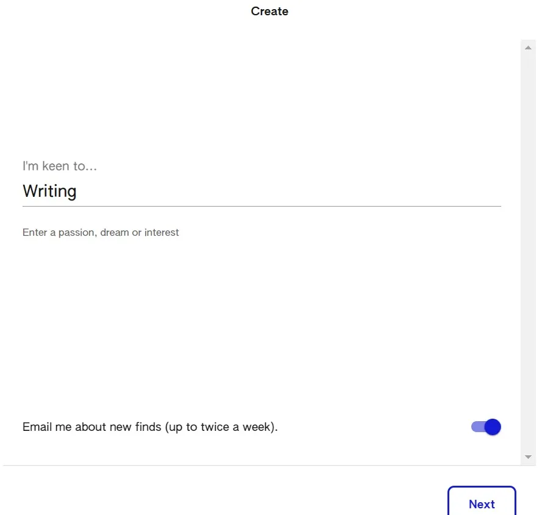
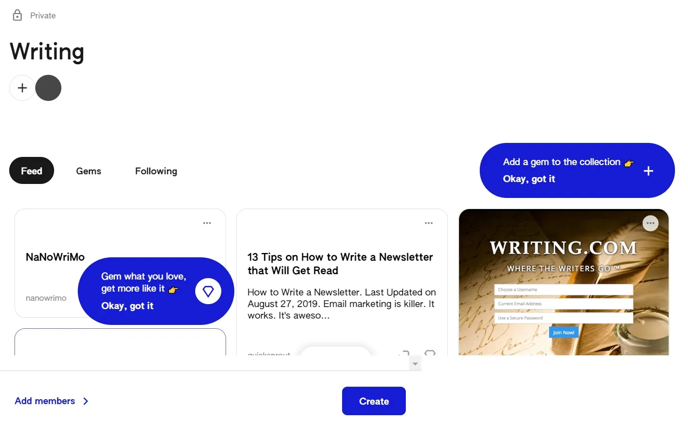
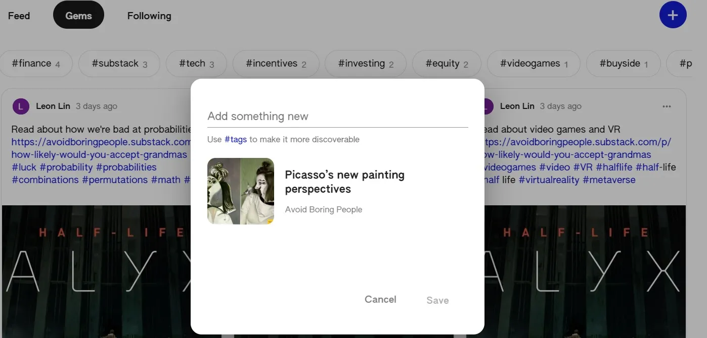
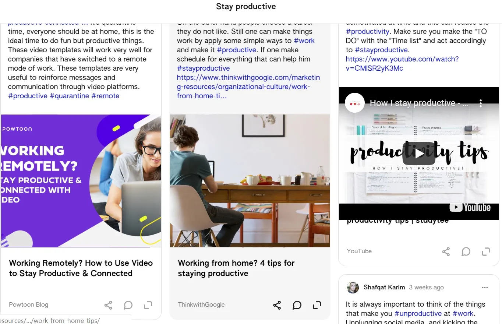
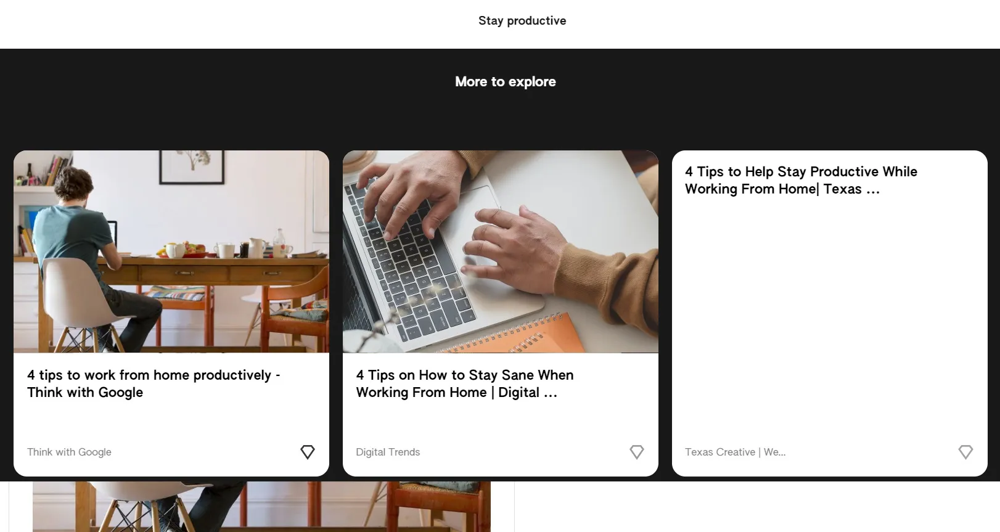

## テイクアウト

KeenはGoogleの新製品で、あなたの興味を追跡することを目的としていますが、よりソーシャルなのかアイデア重視なのかはわかりません

## 鋭い攻略

私は[Area 120、Googleの実験的製品ワークショップ](https://area120.google.com/ '120')[^1]の新製品、[Keen](https://staykeen.com/ 'Keen')のベータ版を試すよう招待されました。Keenは「興味を広げる手助け」を目的としており、「興味に集中し続け、推薦を受け、良いアイデアをキュレーションする」ことを目的としています。

製品について詳しく見てみましょう。

### サインアップとユーザーフロー

Googleアカウントを持っていてブラウザにすでにログインしていれば、サインアッププロセスはシンプルです。Googleアカウントを持たない人向けのオプションは見当たりませんでしたし、ベータ版終了後に変わると思います。

登録後の最初の表示はタイル画面で、左側に大きなプラス記号があります。他のタイルは、私が興味を持ちそうな様々なトピックのようです。もしGoogleがあなたやあなたのデータを監視していないという議論があるなら、これがその理由かもしれません。なぜなら、最初の提案はどれも私の興味に近かったからです。おそらく、平均的なアメリカ人が興味を持つものに基づいて事前に入力されているのかもしれません。

プラス記号と他のカードの間で何をすべきか分からなかったので、プラス記号をクリックしました。

これで「作成」オプションがあり、やりたいことを入力できました。だからこそ名前のついたのだと思います。ニュースレターを宣伝する機会を常に探していたので、「執筆」と入力[^2]。

また、下部に「新しい発見についてメールを送る」というオプションもありました。普段は新しいサービスでもこれ以上メールは欲しくないのですが、メールの提案がどんな感じか見たくてチェックボックスを開けておきました。この記事を書いている時点ではまだメールは届いていません。何か重要な点があれば投稿を更新します。

次のステップには「検索結果を出すか、結果を出したい質問をリストアップする」というテキストボックスが表示されました。できるだけ多くの検索を出す方が、1つのフレーズだけにするよりも良いのか分からず、検索クエリを1つだけ入力しました。長いフレーズリストを入れるよりもターゲットを絞った結果が得られると思っていましたが、確かではありません。

このリストにメンバーを追加することもできます(キーン?)。メンバーはキーンにジェムを追加できます。友達がいないので、隔離中のほとんどの人と同じように、そのままにしておきました。

これがこのタイル/カード/キーン[^3]作成の最後のステップでした。最終的にPinterestを少し思い出させる画面にたどり着きました。ナビゲーションメニューには「フィード」「ジェム」「フォロー」の3つのアイテムがありました。その下にはメニューで選んだページとアイテムがありました。下のスクリーンショットではまだ「フィード」にいるのがわかります。

サイトは今、私にコレクションにジェムを追加するよう促し、好きなものもジェムに入れるように促しました。最初のホームページで複数のコレクションを見かけ、自分たちでコレクションを作ることができました。コレクション内には複数のジェムが表示される別のページがあり、私たちもジェムを作成できます。

では、宝石を作りましょう。もう一度プラスマークをクリックすると、ポップアップが表示され、「新しいものを追加してください」と促されました。この時点でUIが一行に見えて迷い、リンク、画像、本文、それとも他の何かを追加すべきか迷いました。大量のテキストを入力するとスクロールが始まりますが、右側に視覚的なスクロールバーはありません。これはデザイン上の理由だと思います。テキストボックスは最大4行までで、モバイルでもデスクトップでもスクロールします。これはポストプレビューのために下に十分な余白を残すためだと思います。結局、他の人のコレクションを見てからこの投稿に戻ってきましたが、あまり良いユーザーフローとは言えません。他の人がやっていることを参考に、タイトル、記事リンク、そして[^4]のハッシュタグをたくさん入れました。改行を入れてみましたが、ジェムが公開されたときには表示されませんでした。

ポップアップでは少し遅れた後にリンクのプレビューが表示されます。そのプレビューは編集できず、ボックス内のテキストをすべて削除しても消えません。ただし、さらにテキストを入力し始めない限りは。

保存をクリックするとジェムが作成され、ナビゲーションメニューの「ジェム」オプションをクリックすると見つけられました。おそらく作成したジェムはすべて表示されていると思います。これは「フィード」と比較すると、キーンがチェックするべきジェムを指すでしょう。「フォロー」オプションは、このコレクションにさらに検索や質問を追加するオプションです。

これがサインアップからコレクション作成までの流れですので、ブラウジングの仕組みも見てみましょう。

### 他のコレクションの閲覧

自分のものでない宝石やコレクションを閲覧するには、ホームページに戻る必要があります。そこから「コミュニティを探索」や「アイデアをパブリックキーンに追加」にスクロールできます。キーンはランダムなカードリストを表示し、右上のサイコロを振るとリストを更新できるようです。最初はフレーズを検索できず、運に任せなければならないのが不思議に思いましたが、上までスクロールすると検索ボタンがあることに気づきました。

繰り返し投稿が続いたため、閲覧できる公開コレクションは限られているようでした。しかし、自分の公開コレクションはリストに載っていなかったので、その前提は間違っているのかもしれません。何度かロールして「女の子の写真のポーズの撮り方」や「ベビーシャワーの計画」といった結果が出たので、金融やテクノロジー関連のものを探すのを諦め、「生産的に保つ」という公開コレクションをクリックしてしまいました。

コレクションには、YouTubeのリンクやウェブサイトを混ぜてアップロードした他の寄稿者グループからの宝石が展示されていました。各ジェムカードでは、共有、コメント、開封のオプションがあります。カードの上部をクリックしても何も起こりませんが、下部の写真やタイトルの一部をクリックすると、添付されたリンクが開きます。

共有すると、コピーまたはメールやWhatsAppで送信できるリンクが表示されました。

開くと新しいページに行き、カードの拡大版が表示されましたが、コレクションでカードを見るのとあまり変わりませんでした。重要なのは、それでもリンクされた記事全体を開くわけではなく、リンクをクリックして別のタブを開くための追加ステップが必要だということです。つまり、ジェムは小さなプレビューを提供するだけで、開く機能は現時点であまり追加作業をしていないようで、実際の記事を読むにはKeenのサイトを切り替える必要があります。

コメントすると、開くページと同じページに行き、カードの下部にアンカーされてコメントを入力できるようになっていました。機能を試すためにカードにコメントを投稿しました。コメントは投稿後に編集または削除できます。

カードを開くと、キーンが「まだ探索すべきもの」とハイライトするスペースがあります。これらは同じコレクションの宝石のように見えましたが、確信は持てませんでした。これらの宝石を「開く」ことができず、クリックするとジェムを「開く」ページではなく、直接リンクに行けました。

閲覧に関しては以上です。開いたジェムページから他のコレクションを探索したい場合、通常左上にあるキーンのロゴはなく、矢印が表示されて宝石コレクションに戻るため、直接戻れません。そこからホームページに戻って、さらにコレクションを探すためにサイコロを振ることができます。

### キーンについての感想Keenを試してみた上で、まだベータ段階で実験的な段階であることを踏まえ、いくつかの初期の感想を以下にまとめます。

1. Keenの意図的なコンテンツクリエイターは誰ですか?コレクションやジェムを追加するとき、Keen自体には自分のコンテンツを作るスペースがないので、リンクをスパムするだけなのでしょうか?もしこれがスケールアップされた製品になると仮定すると、コンテンツクリエイターがリンクを投稿し続ける動機は何でしょうか?

   フォロワー数のためだと思います。いいねや再生数がないので。なので、アイデア以外は別のPinterestのように思えます。私自身もコンテンツクリエイターとして、視聴率が時間をかける価値があると信じる限り、より多くのサイトにコンテンツを追加してリーチを広げる可能性はあります。Keenの規模はまだ達していないかもしれませんが、おそらく不当なケースかもしれません。

   しかし、すべてのリンクが私をKeenから離れてしまうことを考えると、私はユーザーと直接関係を築きたいです。例えば、私のニュースレターをKeenで閲覧するよりもメールで読んでもらいたいです。これは、あなたがKeen外で私をフォローしていると、私がKeenに留める動機がなく、むしろ私のものではない他のコンテンツを見つけるため、むしろインセンティブを失うかもしれません。

2. Keenの意図されたコンテンツ消費者は誰か?

   ランダムコレクション機能はTikTokやStumble Upon、Instagramのようなものです。自分のGoogle検索履歴や、すでにアップロードしたコレクションや宝石とは関係がないように思えます。一般ユーザーは退屈して娯楽を求めている人なのでしょうか?大規模であれば、サイコロを振るたびに探索できる興味深いカテゴリは十分にあると思います。「自分の好きなものとは関係ないけれど、ランダムに隣接して面白いコンテンツ」を探している少数の人たちのようです。

   Keenは「自分の興味に集中し続け、推薦を得て、良いアイデアをキュレーションする」ためのものです。興味のあるものだけをコレクションにして、そのコレクション内のフィードを使ってランダムな検索結果を返すなら、時々関連するリンクが見つかるかもしれません。結果がどのようにランク付けされて返ってくるのか分からないので、特に毎回Keenのページから跳ね返されるので、時間をかけて閲覧する価値があるかはわかりません。

   Keenにはコメント機能がありますが、他のソーシャル機能が不足しているように感じ、ユーザープロフィールにもクリックできませんでした。この用途はソーシャル製品というよりアイデアのためだと思わせます。

3. これをどうやって収益化するのか?

   Googleの場合は、おそらく一度もないでしょう。もし収益化されるなら、おそらくディスプレイ広告の形で、スポンサー付きのコレクションやスポンサー付きの宝石のような形で現れると思います。

4. この企業はどのように成長し、クリエイターや消費者を獲得するのか?

   クリエイターはKeenを宣伝する動機が低いです。なぜなら、選択肢があれば直接自分のコンテンツを宣伝したいからです。例えば、私がTwitterに投稿した場合、Keenよりも私の個人サイトに誘導したいと思います。

   消費者は、十分な質の高いコンテンツが見られれば、Keenを新しいコンテンツ発見の手段として宣伝することに興味を持つかもしれません。おそらくその中にはクリエイターになる者もいるでしょう。

   つまり、成長のゲート要因は、消費者の規模が十分に大きくなる前に、プラットフォーム上で十分なクリエイターを獲得しることになるということです。もし私がGoogleなら、他のサイトのクリエイターをターゲットにし、Keen [^5]に投稿したことで特典を与えるでしょう。そして、フォロー数、コレクション数、ジェム数でクリエイターのリーダーボードをハイライトし、トップクリエイターを報酬する機能があれば、それも面白いかもしれません。

5. コストはどのように増加するのか?

   長期的には、ユーザーがクリエイターを引き寄せ、さらにユーザーがユーザーを引きつけるフライホイールを形成し、顧客獲得コストを低くすることだと思います。短期的には、従業員の固定費や、広告やソーシャルアウトリーチを通じて新規クリエイターやユーザーを獲得しる際の高い変動費がかかる可能性があります。6. なぜ私のコレクションやジェムのホームページフィードがないのですか?

   興味ごとに別々のフィードを作るつもりだったようで、スケールアップすると面倒です。コレクションやジェムの見た目もカスタマイズできません。

7. なぜキーンにジェムを追加せずにジェムを加えられないのか?

   言い換えれば、キーンを作って保管する必要はないのでしょうか?もし10の異なる興味があったら、ジェムを追加するために10つのキーンを見つける必要がありますか?ジェムにもタグを付けているので、複雑に感じます。

   全体的に見て、KeenはPinterestとStumbleuponを融合させた、より視覚的でスキップ感のあるバージョンを思い起こさせます。現在のインセンティブの整合性を踏まえた利用ケースや製品の成長はまだはっきりしませんが、時間が経てばわかるでしょう。ほとんどのソーシャル製品と同様に、ベータ版から成功を予測するのは難しいです。

[^1]:聞こえるほど排他的ではありません。ただ、配布している人と一緒にSlackグループに参加しただけです。正直に言うと、ベータテスターにギフトカードを渡す話もありました。

[^2]:こういうものを定期的に書いているって知ってた?[Avoid Boring People?](https://avoidboringpeople.substack.com/『ABP』)

[^3]:間違っているかもしれませんが、この時点で「keen」というフレーズはまだ製品に登場していなかったと思います。メンバーを追加するをクリックしない限りです

[^4]:以下のスクリーンショットは、すでにいくつかのジェムを作成した後に撮ったものです。最初の試みでは、管理者か他人のアカウントを使っていたアカウントサインインの問題でエラーが発生しました

[^5]:あるいはベータテストをして、そのリンクを送るのもいいですね。うーん。