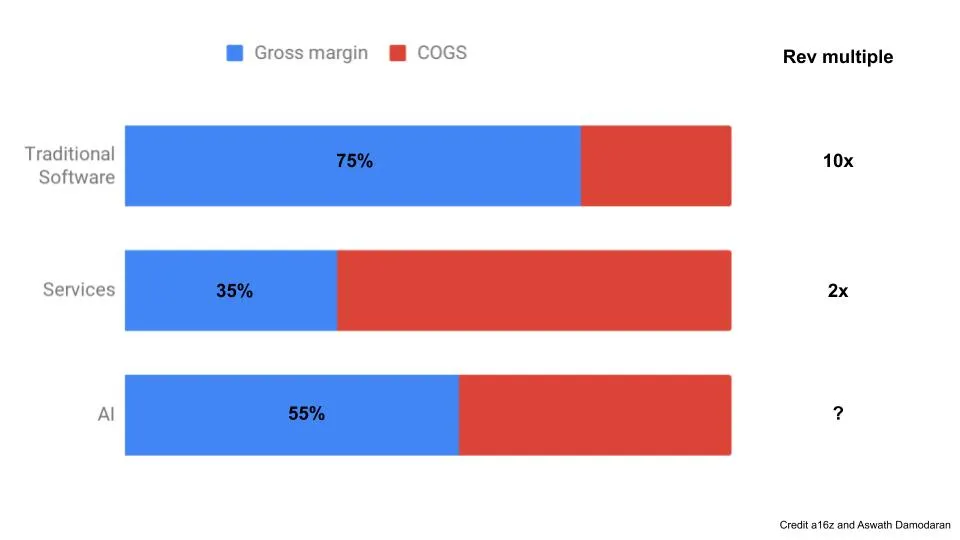

## 要点

1. AI企業はソフトウェア企業というよりサービス業に近いように見え、低い評価で取引されるべきだと示唆しています
2. チャーリー・マンガーが投資している唯一の人物は、投資とは賢くなることではなく、オーナーのように考えることだと言っています
3. 意思決定におけるトレードオフをよりよく理解しようと努めてください

## サービスとしてのAIビジネス

私は以前、機械学習(ML)や人工知能(AI)について書いたことがあります [^1].スコット・ロックリンはMLスタートアップが直面する問題について詳しく解説します [here](https://scottlocklin.wordpress.com/2020/02/21/andreessen-horowitz-craps-on-ai-startups-from-a-great-height/ 'Scott') [^2]主に関連するA16Zの投稿への返信です [here.](https://a16z.com/2020/02/16/the-new-business-of-ai-and-how-its-different-from-traditional-software/ 'a16z')

彼の主な主張は以下の通りです。

1. MLは限界利得のために多くのコストがかかります

2. 機械学習のスタートアップには一般的に堀や意味のある特別な手段がありません

3. MLスタートアップは主にサービス業で、ソフトウェア事業ではありません

これらはコンセンサスというより否定的な見解が多いので、なぜ彼がそう考えるのか見てみましょう。私はスコットとマーティン・カサド、マット・ボーンスタインによるa16zの投稿の両方から引用します。

### 費用

> これらのクラウド運用と計算の力を合わせると、AI企業がクラウドリソースに費やす収益の25%以上に寄与しています。極端なケースでは、特に複雑なタスクに取り組むスタートアップが、訓練済みの機械学習モデルを実行するよりも手動のデータ処理の方が安価であることが実際にわかっています。- a16z

> 「クラウド」のくだらない料金体系は、データ量や計算能力の高い人から最大限の血液を引き出すために設計されている。- スコット

リビジョンの25%がクラウド運用に使われているのですか? [^3] かなり?その数字を文脈に合わせるために、Salesforceという最高水準のソフトウェア会社の総原価(COGS)を見てみましょう。 [Their 8K](https://s23.q4cdn.com/574569502/files/doc_financials/2020/q4/CRM-Q4-FY20-Earnings-Press-Release-w-financials.pdf '8K') 総売上高は25%であり、これはSalesforceがそのカテゴリーに分類するその他のコストをすべて含んでいます [^4]、単なるクラウドコストではなく。Salesforceと同じ利益率を得るためには、AI企業はクラウドコスト以外の売上高を一切持たない必要があります。

> 逸話的なデータによると、多くの企業は収益の最大10〜15%を手動データクリーニングとデータ精度維持のプロセスに費やしており、通常はコアエンジニアリングリソースは含まれていません。また、継続的な開発作業は通常のバグ修正や機能追加を超えていることを示しています。A16Z

実はAI企業は他にもCOGを持っており、最大15%を手動データ処理に費やしています。主流メディアは機械学習からの予測に焦点を当てています。 [but data scientists spend more of their time on data collection and cleaning.](/writing/time 'ABP') それは消えない、つまり **ほとんどのAI企業は、ソフトウェア企業よりも即座に15%の収益性が低いです。** これは他の売上高(COG)を除いても含めていないため、最終的な総利益率はさらに低いことを意味します。

ソフトウェア企業への投資の魅力は、限界費用が低いため、増分収益の多くが利益に転換される点にあります。AI企業はその売上高(COGS)を下げるか、規模の利益を期待して同等の魅力を持つ必要があります。それはあり得るでしょうか?

> GPUチップの計算能力は決して急速に成長しているわけではありません - スコット

AIは必要とします [graphics processing units (GPUs) to do the computing.](https://www.nvidia.com/en-us/deep-learning-ai/solutions/ 'GPU') しかし、必要なリソースは計算能力の増加に比べて飛躍的に増加しています。ムーアの法則はAI計算の面では適用されていません。上記の25%の売上高が近いうちに大幅に減少するとは期待できません。

> 入力値の範囲が非常に広いため、新規顧客の展開ごとにこれまでに見たことのないデータ(a16z)が生成される可能性が高いです

> 多くの人は、ML志向のプロセスは単純なアプリケーションのようにスケールすることはほとんどないことに気づいていません - スコット

Microsoft Officeの販売と、企業にコンサルティングを提供するものを比較してみてください。前者の場合は、これまで販売しているOfficeのコピーを他のすべての企業に提供できます。後者は、そのクライアント向けにカスタマイズされた新しい資料を作成する必要があります [^5]つまり、収益を増やす際には常に追加コストが発生するということです。

もしAIが後者のケースに近いなら、残りの15%(および他のCOGS)も下がるとは期待できないでしょう。 [That low margin still takes a lot of work to get. ](https://avc.com/2020/04/not-all-gross-margin-is-the-same/ 'AVC') **AI企業は収益性が低いだけでなく、その利益率もしばらく続くと予想されます**

### 堀

そのコスト増加は価値があるのでしょうか?a16zもスコットもそうは思っていないようです:

> AIの世界では、技術的な差別化はより難しいです。\[...\]データはAIシステムの中核ですが、多くの場合、顧客が所有したり、パブリックドメインに存在したり、時間とともに商品化していきます。- A16Z

> ビジネスの観点からは、ナイーブベイズや線形モデルのような単純なものが、最新のギガワット級ニューラルネットの大問題と同じくらい顧客の問題を解決できるかもしれないと知っています。\[...\] 社内のアドホックデータサイエンスソリューションにプレミアムを払う人は、それが本当にゲームチェンジャーとなる結果を出すものではありません。- スコット

もし企業の製品が大きく優れていなければ、差別化するために営業とマーケティングに進めなければなりません。 **これは一般的なソフトウェア会社と比べてさらに高いコストを意味します。** すでに営業中心です。機械学習に関する話題が正当なのか、それとも企業の存続を正当化するために使われているのか疑問に思わせます。

ただ、「ゲームチェンジ」の基準がどこなのかははっきりしません。私の読者の一人が、ヴィッキー・ボイキスの投稿後に返信してくれました。彼は10〜15%の精度向上を有意に考えているとほのめかしていました [^6].会社によると思います。

もし製品自体が商品であれば、市場全体は大きいのかもしれません。

> 多くの企業は、AIモデルの最小実行可能なタスクが予想よりも狭いことに気づいています。- A16z

> しかし、VCの支援に必要なホッケースティックや、それを実現させるために必要な博士号取得者の大軍は、限られた市場を持つ限られたドメインとはあまり相性が良くありません。- スコット

機械学習をどんな問題にも投げかければ、その問題や似たような問題に魔法のように効果が出ると一般的に思われています。残念ながら、現時点では多くの問題がAIを投入しても改善される見込みはなさそうです。私たちは望んでいました [Her](<https://en.wikipedia.org/wiki/Her_(film)> 'Her')代わりにTinderが来た。

AIのユースケースが限られている場合、AI製品を販売できる総市場は思っていたよりもずっと小さくなります。VCを考慮してください [size of market as a key factor for investment,](https://bettereveryday.vc/how-to-prove-your-market-is-big-enough-to-vcs-d04059d93380 'size') これは将来的にAI企業が成長を示す必要があるときに問題になるように思えます。

### サービス業とソフトウェア業の対

> 今日のほとんどのAIシステムは、伝統的な意味でのソフトウェアとは少し違う。そのため、AIビジネスはソフトウェアビジネスとまったく同じではない。継続的な人的支援と材料的変動費を伴う。私たちが望むほど簡単にスケールできるとは限らないことが多い。そして「一度作って何度も売る」ソフトウェアモデルにとって不可欠な強力な防御性は、無料で得られるものではないようだ。- A16z

> サービス会社はソフトウェア企業ほど評価されていません。VCはソフトウェアビジネスが大好きです。問題解決のために最初から一生懸命働き、永遠にお金を刷り続けるのです。だからこそ、10〜20倍の収益評価を得ています。サービス会社?なぜサービス会社に投資するのですか?彼らの成長は本質的に労働コストや複雑な市場問題に制約されています。- スコット

企業はしばしば収益、EBITDA、純利益などの財務指標の倍数に基づいて評価されます。ソフトウェア企業は、上記の理由からサービス会社よりも高い倍数で評価されることが多いです。 [Higher gross margins matter, as described by Two Sigma](https://twosigmaventures.com/blog/article/why-gross-margins-matter/ 'Two')

a16zもスコットも、 **AI企業はサービス会社に似ているため、ソフトウェア会社よりも低い評価倍数を得るべきです。** たとえサービスが得ている2倍の収益よりも高い倍数を得られると思っても、AI企業は従来のソフトウェア企業が得ている10倍の収益を得るべきではありませんし、これらのAI企業は以前に資金調達を行ったものです。

これは、高評価で資金調達を行ったAI企業にとっては問題となるでしょう。なぜなら、より多くの人が上記の問題に気づき、次のラウンドを融資するのが難しくなっているからです。私は、60%の確率で、後期段階のAI企業の非公開ラウンドでは予想よりも低い評価が始まると予想しています。

## リー・ルーによるバリュー投資の実践

ウォーレン・バフェットのパートナー、チャーリー・マンガーは外部の人物に資金を渡して運営させました [only once in his life.](https://qz.com/work/1551328/the-only-person-besides-warren-buffett-who-charlie-munger-trusts-with-his-money/ 'Munger') その外部者は [Li Lu of Himalaya Capital.](http://himalayacapital.com/ 'Himalaya')

1998年に設立されたヒマラヤは、アジア企業に焦点を当てたバリュー投資会社であり、特に中国を中心にしています。その投資スタイルの典型として、彼らは長期的に質の高い企業を所有し、時間とともに複利的に成長する企業を保有しているように見えます [^7]. [They've historically taken a 0% management fee, and 25% carry after a 6% return hurdle.](https://www8.gsb.columbia.edu/valueinvesting/sites/valueinvesting/files/files/Graham%20%26%20Doddsville%20-%20Issue%2018%20-%20Spring%202013_0.pdf 'Graham') これは投資業界では珍しく、年間リターンの獲得に自信を持っていることを示しています [^8].

李露は中国に特化しているため、他の著名な投資家に比べてインタビュー回数は少ないです。最近のロングリバーのグラハム [translated a 9,000 word speech outlining Li Lu's investment philosophy,](https://www.longriverinv.com/blog/the-practice-of-value-investing-by-li-lu 'Longriver') 以下にまとめます [^9].

李璐はバリュー投資の4つの基本概念、投資と投機の違い、能力の輪、投資家の気質、そして一般の人が富を増やすためにできることについて論じました。これらの多くは彼の4つの概念に分類できることがわかりました。

1. 株式は企業の一部所有権を表します

2. 市場は指針であり、それを受け入れるか拒否するかはあなた次第です

3. 投資は確率と安全圏に関するものです

4. 能力の輪を作り、その中に留まること

### リー・ルー:株式は一部の所有権を表しています

株式を買うという考え方は、バフェットのバリュー投資スタイルの支持者の間で一般的です。リー・ルーは株を数字としてではなく、責任として捉えています。これは、センチメントや価格触媒に依存するロング/ショートヘッジファンドや、何で取引されるかわからないクオンツファンドとは対照的です [^10].

> もはや人々は東インド会社の将来の結果を推測しようとしていたのではなく、単に株を売買する他の人々の行動を推測しようとしていただけだった。

李璐は株式市場の歴史について語ります。株式市場はもともと企業が成長資金を調達するために創設されました。その後、人間のギャンブルの性質を利用し、単なる会社の将来への賭けではなく、他人が会社の未来をどう思うかに賭けるものとなりました。これは [Keynesian beauty contest](https://en.wikipedia.org/wiki/Keynesian_beauty_contest 'contest') コンセプト。

> これが投資と投機の最大の違いです。結局、すべての投機の純結果はゼロです。もちろん、少し長く勝つ人もいます。そして、一攫千金のチャンスもなく騙される人もいます。しかし十分な時間が経てば、すべての投機はゼロサムの結果で終わります。したがって、短期的な行動に注目している投機家は経済成長や企業の利益に全く影響を与えません。

彼は投資と投機を区別し、企業のパフォーマンスを予測する人を前者のカテゴリーに、他者の反応を予測する人を投機家と分けています。投資家は企業のファンダメンタルズと長期的な見方を重視し、投機家はセンチメントと短期的な見方を重視します。彼の見解では、現在の投資ファンドの多くは投機家に分類されます。

私は投機家の影響について李璐の意見に反対し、投機家は企業の行動に影響を与える可能性があると考えています。それはアクティビスト投資やより定期的な投資家会議を通じてです。私たちは、株主の圧力に直接由来する企業の意思決定を日常的に目にします。例えば [fire CEOs,](https://www.nytimes.com/2020/01/10/business/boeing-dennis-muilenburg-severance.html 'CEO') [divest businesses,](https://faculty.wharton.upenn.edu/wp-content/uploads/2005/11/Activist-Impelled.pdf 'Divest') または [sell the company.](https://corpgov.law.harvard.edu/2019/10/11/recent-trends-in-shareholder-activism/ 'Sell')

しかし、それでも彼の全体的な主張は損なわれません。 **彼が定義する「推測」はゼロサムです。** 企業の基本的な成長とは関係のない問題で企業でアウトパフォームした場合、その取引の相手はパフォーマンスが悪いことになります。もしあなたが市場よりリターンが良ければ、他の誰かは悪い日を過ごしているということです。

### 李璐:市場は指針です

> とはいえ、ほとんどの場合は無視しても大丈夫です。しかし、ミスター・マーケットが非常に興奮したり落ち込んだりすると、彼を使って売買することができます。

彼は次のように語ります。 [the popular anecdote of Mr Market,](https://fs.blog/2013/11/mr-market/ 'Market') これは、株式市場が常に価格を叫び続けるものと見なされることを浮き彫りにしています。いつ買うか売るかはあなた次第で、ほとんどの場合は市場価格を無視した方が良いでしょう。急ぐ必要はありません。活動こそが敵です。

> 学校でバリュー投資について聞くと、実践に移すことは大したことではないと思います。しかし、仕事に取りかかると、すべての取引の向こう側には本物の人々がいることに気づきます。彼らはあらゆる面であなたより優れており、グラハムのミスター・マーケットとは全く似ていません。だからしばらくして、上司に絶えず叱られ続けた後、ミスター・マーケットやこれらの人たちが皆自分より優れていると感じるでしょう。疑念が湧き始めます。

バリュー投資は実際にはずっと難しいです。なぜなら、取引回数が少なくなるからです。自分が規律正しい人間だと言うのと、友人が一日で1万ドルも稼いだと聞いてロビンフッドのオプションを買うのを嫌うのはまた別の話です [r/wallstreetbets.](https://www.dailydot.com/debug/wall-street-bets-reddit-jartek/ 'Reddit') 周りの人が皆急速にお金を稼いでいる中で、あまり刺激的でない戦略を続けるのはほぼ不可能です。

これは、前述の所有者の考え方を採用することでより簡単にできます。もし家を買うときと同じ態度で株を買えば、購入時により慎重で冷静に考えられるでしょう。

### 李璐:確率と安全圏

> 投資で最も重要なのは未来を予測することですが、未来は本質的に予測不可能です。したがって、投資は確率と安全圏に関わるものです。

投資は確率に基づくという考え方は、スタイルに関わらず多くの専門家が同意するでしょう。最高の投資家でさえヒット率は50〜60%の範囲であり、つまり彼らは多く間違っています [^11].単一の銘柄に100%投資するのではなく、各銘柄のポートフォリオに投資し、それぞれの企業の成功確率に基づいてポジションを調整する考え方をしています。

安全圏の概念はそれほど普遍的ではなく、バリュー投資家により典型的です。これは、投資するたびに予期せぬ下落があった場合に十分な余裕を保つ価格で行うべきだという考え方です。投資で十分な安全利益率が見つかれば、検討する価値があります。十分な安全利益率が得られなければ、投資すべきではありません。

### 李璐:能力の輪

リー・ルーは、バフェットの話を聞いて投資を始めた経緯を長い話に語ります [^12].彼はバフェットの著作をもっと読み、企業を調べ、できる限り現地を訪れた。たとえ警備員と話すことしかできなかったとしても。その過程で、彼は能力の輪を築くための4つの教訓を発見した。

> 最初の教訓は、株式は企業の部分的な所有権を意味するということでした

> 第二のポイントは、オーナーの視点から物事を見始めると、ビジネスの理解がまったく変わるということです

> アナリストが当社に入社すると、まず最初にいくつかの企業を調査に送り出します。彼らに、初めて会った叔父が亡くなり、ビジネスを遺したと仮定してもらいます。どうすればいいのでしょうか?突然この資産を相続しても、それが何なのか全く分かりません。取締役会を招集し、議論に参加しなければなりません。これが彼らが調査を行う際に使うべきメンタルモデルです。

バフェットによって広まった「能力の輪」という考え方は、業界や問題について深い理解を深めるべきだというものです。また、自分の知識の限界がどこにあるのかを理解し、無理をしすぎないようにすべきです。

この最初の二つの教訓は、株式を部分所有と捉えるという先述の点に似ています。会社の持分がどれほど大きくても、李璐は自分自身を完全な所有者として捉えるべきだと言っています。その考え方が、会社についてできるだけ多く知りたいという気持ちを強くし、会社の将来にとって良い決定と悪い決定を理解する動機付けになります。一つの名前に多くの時間を費やすと、調査できる企業の数が自然と限られ、それがあなたの能力の範囲を狭めてしまいます。

> 第三のポイントは、知識は確かに累積的ですが、常に知的な誠実さを保たなければならないということです

これも重要だが難しいことには同意します。最後に些細な問題で考えを変えたのはいつですか?

> 最後に、情熱を指針にすべきです。他人の意見を気にしないでください。彼らはあなたとは関係ありません。自分の能力の範囲は狭いと受け入れ、他のことは気にしなくていいのです。お金を稼ぐことはどれだけ知っているかに依存しません。知っていることが正しいか間違っているかにかかっています。知っていることが正しければ、お金を失うことはありません。

これは、多くの他の投資ファンドが実際には運用しているのとは対照的で、通常は投資アナリストに時間をかけて株や業界のカバー範囲を広げてもらいたいのです。ファンドのリミテッドパートナー(投資のために資本を提供してくれる人たち)に、ポートフォリオの変更はしていないと伝えるのは難しいですし、すでに入っている銘柄も気に入っていると言えるのは難しいです。それを長く続ければ、なぜ何もしないでお金を払っているのか不思議に思うでしょう。したがって、多くのファンドにとっては名前の出入りを積極的に行うインセンティブがあり、知っている名前のセットが多ければ多いほど良いのです。これは一部の場所ではうまくいきますが、李璐のスタイルではありません。

### リー・ルー:バリュー投資に関する結論

> この職業は特に賢いことも、高いIQや最高の学歴も要求しません

李璐は、成功する投資家を成し遂げる資質を説明しています。

1. その人は自立していて、他人の評価を気にしないことが条件です

2. その人は客観的で、常に学ぶ意欲がなければなりません

3. 素晴らしい機会が訪れたとき、その人は極めて忍耐強く、そして極めて決断力を持つ必要があります

4. その人はビジネスの仕組みに興味を持っている必要があります

上記のバリュー投資の核心的な概念を念頭に置くと、これらの投資家特性は理にかなっています。典型的なロング/ショートファンドなら、(3)についてはあまり気にしません。典型的なクオンツファンドなら(4)にはあまり関心がありません。

> 投資家にとって最大のタブーは、ニュートンのように市場に誘惑されること、つまり市場の最も熱いピークで買い、最も落ち込んでいるときに売ることです。投機に参加せず、自分が理解しているものに厳密に投資すれば、損はしません。

> 最も重要で良いのは、複利に十分な時間を持つことです。一般の人への提案は、自分が理解できることだけをし、それ以外のことは避けることです。

長期的なバウアー投資家としての経歴を考えれば、長期的に複利でゆっくりと資産を増やすことを推奨するのは驚くことではありません。しかし、誰もがそれを忍耐強く行うわけではありません。

バリュー投資はお金を稼ぐ一つの方法であり、他にも長期間成功してきた多くの方法があります。 [Renaisssance seems to print money,](https://en.wikipedia.org/wiki/Renaissance_Technologies 'Ren') 例えば、彼らは上記のバリュー投資とは全く関係のない行動をとっています。もしバリュー投資を続けるなら、リー・ルーの実績がそれを物語っています。オーナーとして考え、単なるトレードを避け、自分が得意なことを知りましょう。

## トレードオフ

[Efficiency vs Resilience.](https://en.wikipedia.org/wiki/O-ring_theory_of_economic_development 'O ring')

[Optionality vs Certainty.](https://nesslabs.com/optionality-fallacy 'Option')

週末に予定通りにニュースレター投稿を書くことと、半分酔った状態で『ピーキー・ブラインダーズ』を一気見して平日遅くまで起きているのとの違い [^13].

人生では、常にトレードオフに直面します。

**もし誰かが「トレードオフはない」と言ったら、それは単純か何かを売り込もうとしているだけです。** いずれにせよ、避けたほうがいいでしょう。

効率的に運営されている会社は冗長性がありません。それがコストを節約できますが、問題が起きるまでは。しかし、すべてのものにバックアップを用意することもできません。なぜなら、それは非常に高額になるからです。

選択肢を残しておくということは、柔軟性があるということです。それは、これまですべての選択肢を持って生きてきて、決して妥協しないと気づくまではうまくいきます。しかし、バックアッププランなしで道を選ぶべきではありません。

私たちが下すすべての重要な決断において、私たちは以下のことをすべきです:

1. 明示的および暗黙的なトレードオフを学び、

2. どちらを選ぶかのプロセスを改善します

最初の方法では、例えば [decision journal,](https://fs.blog/2014/02/decision-journal/ 'FS') 役に立つこともある。行動も同様だ [premortems](/writing/premortem 'pre').シナリオをじっくり考える行為は、漠然としか気づいていない懸念を浮き彫りにすることが多いです。

もう一つの方法は、特に似たような状況で同じような決断をした人からアドバイスを得ることです。彼らは自分の懸念や後悔を指摘してくれるでしょう。ただし、そのようなアドバイスは非常に多様で、有用なものから有害なものまでさまざまです。ある人にとってリスクがあるものが、別の人には安全かもしれません。

2つ目については、どのフレームワークを使うかはあなた次第です。私が話すことができます [optimal stopping theory](https://www.americanscientist.org/article/knowing-when-to-stop 'optimal'), [game theory](https://plato.stanford.edu/entries/game-theory/ 'game')シナリオプランニングも可能ですが、ほとんどの人は自分に合う方法を見つけます。枠組みと記録があれば問題ないはずです。

ステップ1とステップ2の両方で改善すれば、より良い意思決定が可能になります。

短期的にはステップ1の改善が容易だと考えるので、効果を維持しつつプロセスをより速く加速できるように取り組んでいます。ステップ2の改善はより難しく、長期的なプロジェクトとして意思決定を追跡・評価していく予定です。これら両方のステップを改善するプロセスは、自分が何を大切にしているのかをよりよく理解することにもつながります。

私たちは常にトレードオフに直面しますが、それを考えたくありません。残念ながら、それを忘れても消えるわけではありません。重要な決断の過程で何を諦めるかを明確に示すことで、将来の後悔を減らす助けになります。

## その他

1. [A tale of two talebs.](https://medium.com/@allenfarrington/a-tale-of-two-talebs-1775dff3302b 'Taleb') ナッシム・タレブを好きでも嫌いでも、強くおすすめします。
2. 「低所得世帯が最もCovid-19の影響を受けるでしょう。彼らは収入の大部分を消費する傾向があるため、所得への打撃はGDPに占める消費シェアを減少させます。」 [Michael Pettis twitter thread on how imbalances in the economy will be resolved.](https://twitter.com/michaelxpettis/status/1253217553083707393 'Pettis')
3. ["While Microsoft made $100M it shrunk the \[encyclopedia\] market by over $600M. For every dollar of revenue Microsoft made, it took away six dollars of revenue from their competitors."](https://redeye.firstround.com/2006/04/shrink_a_market.html 'MSFT') クレジット [Brett Bivens](https://venturedesktop.substack.com/ 'Brett')
4. 「Long Betsは、未来についてより責任ある予測を促進するために、02002年に設立されました。」このグループは、ウォーレン・バフェット対ヘッジファンドの賭けを行ったのと同じグループです。 [This post looks at predictions for 2020](https://medium.com/the-long-now-foundation/our-long-bets-and-predictions-about-02020-736cf08efcd6 '2020')
5. ["Can the teardrops that fall after reading bad science writing generate renewable electricity? Yes, they can."](https://eighteenthelephant.com/2020/02/12/can-the-teardrops-that-fall-after-reading-bad-science-writing-generate-renewable-electricity-yes-they-can/ 'teardrops')

[^1]: 人々はこう言うでしょう [machine learning is a subset of AI](https://towardsdatascience.com/clearing-the-confusion-ai-vs-machine-learning-vs-deep-learning-differences-fce69b21d5eb 'ML')、ここでは便宜上両用語を同義で使います。原則は両領域で成り立っているように思えます。スコットはそれらを分けて考えます。「機械学習の意図は、機械が提供されたデータを使って自ら学習し、正確な予測を行えるようにすることです。」

[^2]: クレジット [Daniel McCarthy on twitter](https://twitter.com/d_mccar/status/1237738926086987777?s=20 'Daniel')

[^3]: ここでのクラウド運用には、AIモデルのトレーニング、モデル推論、データ転送が含まれます

[^4]: PDFはFY20 Q4 8Kの6ページです。また、便宜のために私はホールコルコのCOGSを取っており、これは収益性の低いプロフェッショナルサービス事業も含まれます。サブスクリプションだけでCOGSを計算すると、総利益率は80%になります。

[^5]: あるいは、デッキ内の会社名やロゴを見つけて置き換えるだけでもいいでしょう。私が判断する資格はありません。

[^6]: これは、テクノロジーとビジネスのバランスを取るための長い返信の一部であり、今後もその投稿に値します。彼の結論は、3つのアプローチから選ぶべきだということでした。1) 合意された指標の改善を示しれば、テクノロジーがビジネスを主導できる 2) 最初はあまり魅力的でないが時間をかけて身だしなみを作る 3) Googleの20%ルールのように実験できる特定の空間を作る

[^7]: 「私たちはベンジャミン・グラハム、ウォーレン・バフェット、チャールズ・マンガーのバリュー投資の原則を受け入れており、現在は主にアジアの上場企業、特に中国に注力しています。私たちは、実質的な『経済の堀』を持ち、大きな成長可能性を持ち、信頼できる人々が運営する高品質な企業の長期オーナーとして、優れたリターンを達成することを目指しています。当社の保有資産の一部は創業20年前に遡ります。」

[^8]: ほとんどの投資会社は、投資した資産に対して管理費を支払い、その後、その資産からのリターンに対してパフォーマンス報酬を課します。典型的な手数料構成は「2 and 20」で、管理手数料が2%、パフォーマンス手数料が20%です。もし1000ドルを投資して1200ドルに増加した場合、管理手数料を期末価値から差し引くと、管理費は24ドル(2% _ $1200)、パフォーマンス手数料は40ドル(20% _ ($1200 - $1000))となります。これを、リターンの最初の6%以降のみパフォーマンス報酬を支払うリー・ルーのフィーモデルと比較してください。ここでは管理費はなく、パフォーマンスフィーは$47(25% _ - ($1200 - $1000 - (6% _ $200)))となります。多くの投資会社が運用資産の成長に伴う固定管理手数料で生計を立てているのは公然の秘密です。李露のモデルは、彼が高いリターンを生み出せると信じればより有益であり、成績が悪ければあまり有益ではありません。

[^9]: 同じスピーチだと思います [previously translated on gurufocus,](https://www.gurufocus.com/news/997607/notes-from-li-lus-latest-speech-at-peking-university 'guru') そしてグラハムのバージョンの方がより包括的に思えます。翻訳を(非常に)簡単に確認しましたが正確そうですが、もちろんその作品を完全に保証することはできません。原文は [here](https://xueqiu.com/6026781624/137223946 'original')

[^10]: ロング/ショートヘッジファンドは、一部の企業をロング(買い)し、他の企業をショート(売却)することでヘッジする人気のある投資ファンドのスタイルです。クオンタリティ・ファンドも、主にアルゴリズムを使って投資判断を下す人気のスタイルです。はい、おそらく彼らはMLを使っているでしょう...

[^11]: この統計の出典は見つかりませんが、最高の投資家でも50〜60%の確率で正解することは知られています。彼らは適切な賭け金の規模を決め、勝者を大切にすることで勝ちます

[^12]: 「昔の私の株式市場は基本的に悪人だらけだという理解でした。しかし、ミスター・フリーランチ(バフェット)は彼らとは全く違いました。彼はとても賢く、彼の言うことは賢く洞察に満ちていました。彼の原則を聞いた瞬間に理解できました。そして彼がしていることは、私にもできることだと感じました。」奇妙なことに、バフェットについては一切言及されていません [this 1998 profile of Li Lu](https://observer.com/1998/05/tiananmen-square-to-wall-street-li-lu-hits-the-new-york-jackpot/amp/ 'Li Lu')だから、もしかするとこの話はマーケティングなのかもしれませんね?

[^13]: 著者は、これらは仮定的で抽象的な例であることを強調したいと思います。
