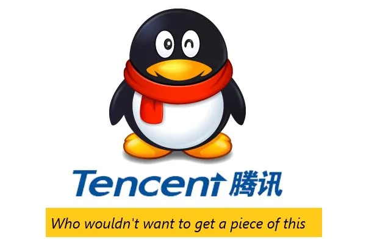
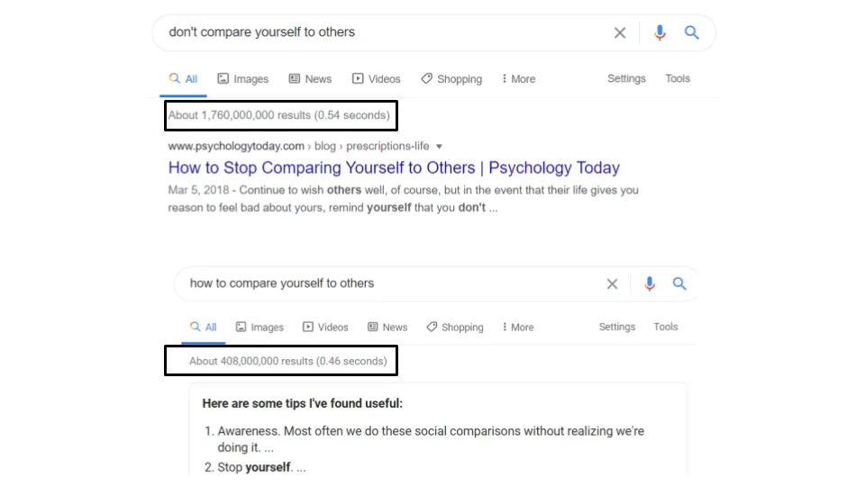

## 要点

1. 投資は絶対的なパフォーマンスではなく相対的なものです
2. 技術競争は絶対的な強さではなく相対的なものです
3. 社会は絶対的な地位ではなく相対的なものなのです

## 1\. 最も勝ちやすい相手に賭けないこと

あなたが投資アナリストだと想像してください [^1]\.

投資アナリストは企業を調査し、どの株を買うか売るかを決めます。あなたは自分の仕事をしてきたのです [Tencent](https://en.wikipedia.org/wiki/Tencent 'tencent')中国のインターネット企業であり、ビジネス、経営、マクロトレンドはすべて良好だと結論づけています。ゲームとオンラインエンターテインメント [will continue increasing in importance](https://www.statista.com/outlook/203/117/video-games/china 'stat')\, [the executive team is experienced](https://chinachannel.co/a-deep-dive-into-tencents-restructuring-the-struggle-to-master-b2b/ 'tencent')人口増加が追い風となります [for at least ten years.](https://ourworldindata.org/future-population-growth 'population')

それらをすべてExcelでモデル化します。簡単な5ページの投資メモを書きましょう。念のため、50ページの複雑なチャートを用意してください [^2]\.

自分の才能と勤勉さに確信し、上司にテンセントを勧めます。彼がオフィスに入った少し後、夏の別荘を探している前に、完璧なタイミングで会議をします。

最初はうまくいっているようです。あなたの上司はテンセントのCOOの義兄とゴルフをしたことがあり、テンセントを知っています。ビジネス、経営、マクロに関してあなたの意見にすべて同意しています。素晴らしい。

プレゼンが終わる頃、あなたは気分が良くなり、上司がテンセントで小さなポジションを始めるだろうと予想していた。しかし彼は椅子にもたれかかり、別荘のタブを再び開き、あなたが全く本質を見誤っていると言った。あまり良くない。

何がうまくいかなかったのか\?

**あなたが間違えたのは、市場のコンセンサスを考慮しなかったことです。** これは多くの個人投資家が犯す間違いであり、時にはプロフェッショナルも同様です。

**投資は絶対的なものではなく、親戚のゲームです。** それは株の性能です _期待値に対して_ それが平均以上のリターンを出すかどうかを決めます。

あなたが行った調査が広く知られていても意味がありません。定義上、それはすでに市場に反映されています。あなたが示すべきことは [what the market is missing, and why that misperception will correct itself.](https://medium.com/graham-and-doddsville/pitch-the-perfect-investment-1a4e8d0c077b 'market') もしあなたに優位性がなければ [^3]、君の提案は無意味だ。

だからこそ、良い決算報告を出した企業でも株価が下がる可能性があるのです。

だからこそ、価格が完璧に合った素晴らしい会社を平均以下に買えたり、放置されたようなひどい会社を買っても平均以上のリターンが得られる理由です。

だからこそ、会社の収益を事前に違法に知っているのです [doesn't mean you'll make money 100% of the time.](https://www.sec.gov/litigation/complaints/2019/comp-pr2019-1.pdf 'SEC') [^4]

投資において、 [you want to bet on the mispriced horse, not the horse most likely to win.](https://www.oaktreecapital.com/docs/default-source/memos/you-bet.pdf 'bet')

**これは、個々の株式のピッチにミクロレベルで、また投資会社の業績にマクロレベルでも当てはまります。** 絶対的な技術は関係ない。ファンドの技術だ _競争相手と比べて_ それが平均以上のリターンを出せるかどうかを決めます。

だからクレジットカード、アプリのダウンロード、衛星データなどの情報はもはやパフォーマンスの上回りの要因ではなく、テーブルステークとなっています。

[It's why luck is playing a bigger role, since the dispersion in skill has been reduced.](https://research-doc.credit-suisse.com/docView?language=ENG&format=PDF&source_id=em&document_id=805456950&serialid=LsvBuE4wt3XNGE0V%2B3ec251NK9soTQqcMVQ9q2QuF2I%3D 'CS')

そしてそれが理由です [the overall outperformance (alpha) for hedge funds has stagnated,](http://finance.darden.virginia.edu/wp-content/uploads/2019/08/Hedge-Fund-Alpha_09.29.2019.pdf 'alpha') より多くの投資家がベストプラクティスやフレームワークを知るようになるでしょう。

投資においてはすべてが相対的です。

## 2\. あなたのテック親戚は8歳の子どもです

あなたがオンラインウィジェットを販売しているテック企業にいると想像してみてください。

顧客獲得に1ドルかかる広告チャネルを見つけ、顧客一人あたり10ドルの生涯価値が与えられます [^5]\.

お得に思えたので、マーケティング予算を使い始めます。うまくいき、追加の利益で夏の別荘を探し始めます。

しかし、顧客数が減り続けていることに気づき、顧客獲得コスト\(CAC\)が上昇し続けていることに気づきます。しばらくすると、顧客数はかろうじてトントンになってしまうのです。夏休みの夢は打ち砕かれました。

何がうまくいかなかったのか\?

**あなたが間違えたのは、市場の均衡を考慮しなかったことです。** 競合他社があなたより効率的であれば、マーケティング費がどれほど効率的でも意味がありません。

彼らはあなたより多く支出し、より多くの顧客を獲得し、より多くの利益を上げ、そしてそれを繰り返すでしょう。その過程で、彼らは市場とあなたに価格効率を強制します。あなたは局所的な最大値に最適化していました。他のすべての人はグローバルな最大値に求めていました。

だからこそ、競合他社が誰であるかを知ることがビジネスの存続に不可欠です。もしオフラインのCACがほぼオフラインのビジネスであることに満足しているなら、誰かがそうでないことを願うしかありません [dropship your product](https://www.theatlantic.com/technology/archive/2018/01/the-strange-brands-in-your-instagram-feed/550136/ 'dropship') そしてCACを上げましょう。もしオンラインCACがほとんどオンラインビジネスであることに満足しているなら、誰かがそうでないことを願うしかありません [open a retail store](https://www.businessinsider.com/online-direct-to-consumer-brands-with-retail-stores-locations-2018-2#allbirds-3 'DTC') そしてあなたを閉鎖する。

だからこそ、相対的な市場シェアが絶対的なリターンよりも重要なのです。支出効率の違いこそが、支出効率だけでなく、時間とともに平均以上のリターンをもたらすために複利的に働く要因です。

そしてそれが理由です [word of mouth and customer loyalty is important](https://medium.com/@gavin_baker/scale-and-loyalty-are-more-important-online-than-offline-which-drives-much-of-the-winner-take-992345be93a9 'loyalty')、相対比較の影響を一時的に先送りできるためです。CACが0ドルの下限にあると、もはや制限要因ではありません [^6]\.

これは顧客獲得だけでなく、採用する人材から製品品質に至るまで、会社のあらゆる部分に当てはまります。彼らの強みだけを知っていて、他の人と比べてどうか分からないのは意味がありません。

かつては、情報や人、商品の移動が遅かった頃は、この問題は少なかった。顧客は物理的に最も近い代替手段と比較して終わりにしていた。しかし今では、関連する親戚はあらゆる場所、あらゆるものに存在している。あなたは競争相手となっている [8 year old toy reviewers](https://canoe.com/business/money-news/highest-paid-youtube-star-is-an-eight-year-old-boy 'toy') および [engineers outsourcing their own jobs to China so they can surf reddit.](https://www.npr.org/sections/thetwo-way/2013/01/16/169528579/outsourced-employee-sends-own-job-to-china-surfs-web 'reddit') テクノロジーの影響で、物理的な近接性の重要性が減少しました。

それは [Red Queen hypothesis](https://en.wikipedia.org/wiki/Red_Queen_hypothesis 'Queen') 企業は常に優位性を見つけなければならず、競争は年々速くなっています。発見は時間とともに共有され商品化され、優位性が徐々に失われていきます。優位性がなくなると、平均的なリターンを得られます。

テック業界ではすべてが相対的です。

## 3\. 相対的に言えば、億万長者は裕福ではありません

ただ自分の人生を送ろうとしているだけだと想像してみてください。

いや、想像しなくてもいい、それは私たち全員のことだ。

自己啓発書を読み、禅のリトリートに参加し、TEDトークも見ました。どれも自分を高めることに集中し、他人と比べることに執着しなさいと言っています。

Googleでも「他人と自分を比較しない」で18億件、「他人と自分を比較する方法」では4億件の結果が出ています。そして後者の上位検索結果はすべて「どうやって比較するか」の記事ばかりです _やめて_ 比較している。

それは本当です。自分を高めることに集中し、努力すべきです [be 1% better every day.](https://heleo.com/get-1-better-every-day/19161/ '1%')

でも、もう私が何を言いたいか分かってるでしょう。

人の言うことと実際に行動することには違いがあります。あなたは絶対的な基準で自分を評価できますが、他の人は相対的な基準であなたを評価します。それは彼らのあなたに対する期待に対して、あるいは他の誰かに対して相対的に。

社会は一つの大きなものだ [sorting algorithm.](https://en.wikipedia.org/wiki/Sorting_algorithm 'sort') [^7]

だからこそ、私たちはアンダードッグや逆転の物語、あるいは大穴の可能性を応援するのが好きなのです。期待以上のパフォーマンスをした人には報い、期待通りのパフォーマンスをする人にはあまり関心がありません。たとえその人がずっと素晴らしかったとしても。それについては聖書のたとえ話まであります。 [the prodigal son.](https://en.wikipedia.org/wiki/Parable_of_the_Prodigal_Son 'prodigal') [^8]

だからこそ、私たちはお互いの相対的な地位を示す定量的な指標にこだわります。フォロワー、いいね、シェア。それが自分の順位を示せるものであれば、私たちは常にそれを望み続けるでしょう。 [^9]

そして、ゴールドマン・サックスのCEOで億万長者のリオド・ブランクファインがいる理由でもあります [doesn't feel rich, since he's comparing himself against his multi-billionaire friends.](https://markets.businessinsider.com/news/stocks/goldman-sachs-ex-ceo-lloyd-blankfein-might-vote-trump-sanders-2020-2-1028927812 'CEO')

ではどうすればいいのでしょうか\?

約束を足りず、過剰に提供するのがよくあるやり方のようです。人々は期待を緩め、他者を低いパフォーマンスに縛り付けます。なぜならそれが効果的だからです [^10]\.

自分だけの競合相手を選んで比較するのも一つの方法かもしれません。もし同年代の仲間に満足できなければ、交換できる人は山ほどいます。

そして、自分のスコアカードで自分を測ることを目指すべきで、それ自体が上達することです。ただし、他人があなたを測っているのはそうではないということを知っておいてください。

人生は相対的だ。

## その他

1. [Jukebox is an AI that makes music. Check out a re-rendition of Ella Fitzgerald](https://openai.com/blog/jukebox/ 'Juke')
2. [Higher reputation sellers are less likely to take advantange of shortages in supply by price gouging](http://leixu.org/xu_price_gouging.pdf 'price')
3. ["The SEC is basically saying 'spring loading' is legal insider trading."](https://nongaap.substack.com/p/profiting-from-corp-governance-dark-bef 'Mike')
4. ["Lying somewhere between a club and a loosely defined set of friends, the Small Group is a repeated theme in the lives of the successful"](https://jmulholland.com/small-group/ 'small')
5. ["Turns out, even patients who appear \[to be\] in a coma can have more cognitive function than can be observed with standard clinical methods"](https://aeon.co/essays/to-say-what-consciousness-is-science-explores-where-it-isnt? 'coma')

[^1]: おそらくそうな方もいるでしょう。ここで言っているのはバイサイドアナリストのことであり、セルサイド\(企業のために調査するが投資しない人\)や投資銀行のアナリスト\(名前に反して、全く投資しない人\)ではありません

[^2]: 投資メモとは、あなたが売り込む銘柄についてのまとめ文であり、投資業界ではあなたのアイデアを要約するためによく使われます。

[^3]: 投資の優位性の枠組みの一つは [the information, analysis, or time horizon framework that John Huber uses](http://sabercapitalmgt.com/what-is-your-edge/ 'Huber')

[^4]: そこから [page 34 of the pdf](https://www.sec.gov/litigation/complaints/2019/comp-pr2019-1.pdf 'pdf')\.参照 [this paper](https://pdfs.semanticscholar.org/a537/e9c2776ca4b50c059ada99a94110359ec3c9.pdf 'Chloe') クロエ・シーによる記事は、これらの取引における低い\(悪い\)信号対雑音比を示しています

[^5]: 簡単に言えば、 [every customer pays you $10 for every $1 you're spending on them](https://blog.hubspot.com/service/how-to-calculate-customer-lifetime-value 'LTV')

[^6]: 例えば、誰かから支払いを受けて有料ユーザーを獲得してもらうという、三者間の状況ではネガティブCACもあるかもしれません。あまり見かけませんが、もし業界特有のものなら教えてください。

[^7]: ソートアルゴリズムとは、アイテムを望む順序に並べるプログラムであり、プログラミングの基本的な部分です

[^8]: 父親には良い息子と悪い息子が二人います。悪い息子は遊びに家を出て、何年も経って全財産を失い、恥ずかしさで戻ってきます。二人の息子が驚いたことに、父親は悪い息子をパーティーで迎え入れます。父親は悪い息子が行方不明で今見つかったと言い、それは祝う価値があると言います。良い息子はすべてのお金を持ち去りパリに引っ越し、父親はあんなことを言うべきではなかったと気づきます。物語の教訓を間違えているかもしれません。

[^9]: Redditのユーザーは「カルマポイント」を稼ぐために話を作り上げますが、実際は作り話でポイントは重要ではありません。社会的に見捨てられた人たちでさえ、 [hikikomoris](https://en.wikipedia.org/wiki/Hikikomori 'hiki') どのアニメシリーズが優れていて視聴者の趣味が良いかをオンラインでコメントするなど、ある程度の地位を望むこともあります

[^10]: [There is a study that disputes this advice, claiming it has no significant impact](https://www.inc.com/jessica-stillman/underpromise-and-overdeliver-is-terrible-advice.html 'study')
