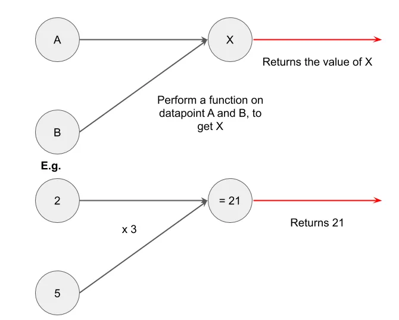
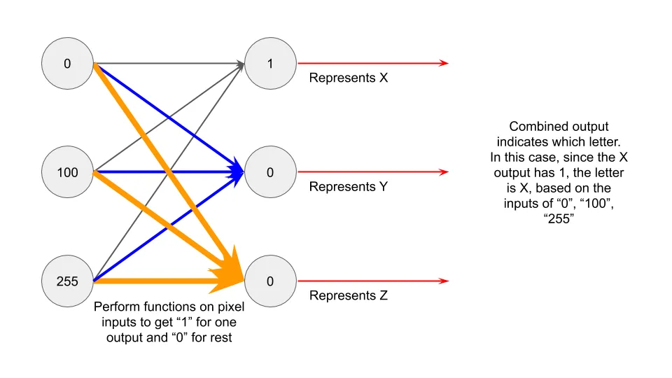

## テイクアウト

機械学習は思っているほど怖くなく、むしろ一般的です。

## 機械学習の魔法

今では機械学習(ML)、ディープラーニング、人工知能の話をよく耳に[^1]。

検索興味から:

書籍で言及されるもの:

ロボットが私たちの仕事を奪うという新聞の見出しへ:

機械学習への関心が高まっており、最近のように新しいML技術で1億ドルを調達するスタートアップがほぼ毎日のように起こっています。

しかし、多くの人はMLに圧倒されており、最先端のスタートアップだけが持つ魔法のようなものだと考えています。数学が圧倒されることもあるのも助けにはなりません:

今日は、まずMLを使っている企業を見てから、ニューラルネットの基本的な仕組みを順に理解して、MLの直感を深めてもらいたいと思います。最後に私の目標は、「ML」という言葉をまるで学校にいるかのように使うときに、少しでも怖くなってもらうことです。

## 機械学習のケーススタディ

もし私がMLを使っている企業への投資を求めてあなたのところに来たと想像してみてください。こちらがその提案です:

「M社はMLと[光学文字認識(OCR)](https://en.wikipedia.org/wiki/Optical_character_recognition『OCR』)を用いて、数億件の記録と入力データを数秒以内に照合しています。すでにAmazon、米国政府、Fedexと提携しています。M社は年間>1000億件の取引を可能にする規模を拡大し、全米にカバー範囲を拡大しています。」

ワクワクする話ですよね?いくつかの言葉は選り好みしましたが、[他社の実際のプレスリリースとあまり変わらないようです:](https://www.eu-startups.com/2020/01/anyline_raises_over_10_million_and_zooms_to_us/ 'eu')

「Anylineは、AIを活用した光学文字認識(OCR)分野の主要スタートアップで、シリーズA資金で1,070万ユーロを調達しました。すでにトヨタ、IBM、キヤノン、国連、ペプシコなどの大手企業と協力しているオーストリアのスタートアップは、この資金を使ってボストンに米国初のオフィスを開設します」

さて、話を会社Mに戻します。OCRというのは、画像を見てMLで何が書かれているかを認識するという意味です。彼らはそれを効率的かつ正確かつ大規模に行っているように見えます。彼らのパートナーシップも尊敬されるように見えます。おそらく、彼らはおむつをしている間にコーディングを始めたスタンフォード大学卒業生が率いる有望なユニコーンだと思うでしょう。

投資しますか?

もし「はい」と答えたら、それは単に[アメリカ合衆国郵便公社](https://www.enterpriseai.news/solution_content/hpe/governmentacademia/machine-learning-applications-for-the-modern-enterprise/「USPS」)に投資したことになります。

いいえ、本当に、郵便局は長い間MLを使っています。[1997年に試験的に始め、2014年にはすでにMLアルゴリズムで住所を認識するようになりました。](https://www.buffalo.edu/content/dam/www/research/pdf/Postal-Automation-Highlights_20160516.pdf「ML」)あなたが想像していたスタートアップのステレオタイプとは少し違います。

ここで言いたいのは、Anylineやそれに類するスタートアップをけなすつもりはありません。彼らは難しい問題を解決しているだけで、単なる宣伝[^2]ではないはずです。むしろ、機械学習は一見日常的に聞こえる状況で使われており、ずっと前からそうなっていることを気づいてほしいのです。** 次に誰かが機械学習について提案するときは、そのことを念頭に置いてください。

## 機械学習の直感

MLがどこで使われているかがわかったので、MLがどのように機能するかを見ていきましょう。ここでは[ニューラルネットワーク](http://news.mit.edu/2017/explained-neural-networks-deep-learning-0414 'NN')を使いますが、MLを動かす方法は他にもたくさんあります。

ニューラルネットワークは脳のニューロンをモデルにしているため、そのつながりがどのように機能しているのか理解しておくと役立ちます。ニューロンは以下の通りです:

脳の仕組みはまだ完全には分かっていませんが、有力な理論としてはニューロンが入力を受け取り、計算を行い、その後出力を送ることができるというものです。(https://www.quantamagazine.org/neural-dendrites-reveal-their-computational-power-20200114/「ニューラル」) [^3] 2つのニューロンが相互作用するを簡単に表現する方法はこう考えられます。円が主体で、その線が他のニューロンとつながる軸索だと想像してください:

もし3対のニューロンがあったら、こう見えるかもしれません:

もしニューロン同士が相互作用できれば、次の[^4]のようになるでしょう:

このイメージを念頭に置き、これがコンピュータや機械学習とどう関係するか考えてみましょう。

簡単な数学式を用意しましょう。例えば 2 × 3 = 6 です。入力データとして「2」、実行したい関数として「x 3」、出力データとして「6」を設定します。これにより、次のようなものが得られます:

もし入力データが複数あったらどうでしょうか?(2 + 5) x 3 = 21 といえます。これで次のようなものが得られます:

そして再び、複数の入力に作用する複数の関数を組み合わせることができます。例えば:

これは上記のニューロン相互作用図と同じように見えるので、「ニューラルネットワーク」という名前が付けられたのです。

もう一歩進めてみましょう。前と同じようにA、B、Cの数値があると想像してください。今回は、その値が[ピクセルの数値]を表しています。(「ピクセル」https://homepages.inf.ed.ac.uk/rbf/HIPR2/value.htm#:~:text=For%20a%20grayscale%20images%2C%20the,is%20taken%20to%20be%20white.)この場合、3ピクセルのものを見ています。

同様に、これらのデータ点に対して何らかの数学関数を使えば、X、Y、Zの出力が得られます。今はどの数学関数を使うかは今[^5]無視しますが、データポイントからは0か1しか返されません。それだけでなく、1は1つだけで、他は「0」となります。ここでの出力は、その円に「1」が返された場合に予測されたアルファベットを表します。

これは次のようになります:

この例では、元々Xと表された出力に対して「1」が返され、他の出力には「0」が返されたことがわかります。これにより、Xは3ピクセル(0, 100, 255)からの入力に基づく予測値であることがわかります。

アルファベットのすべての文字に、必要なだけ入力ピクセル数に対してこの枠組みを拡張することを想像できます。直感は似ていますが、より多くのステップが関わっています。例えば、1000ピクセルの画像に基づいて26文字のどれかを予測したい場合、左側に1000の入力、右側に26の出力が必要です。そのうち1文字だけが「1」で、残りは「0」になります。

入力と出力のレイヤーが2層だけに限定されるわけではありません。また、左側から入力を受け取り、右側に出力を返す「隠れレイヤー」を増やすこともできます。関数を最後のレイヤーで「1」と「0」を返すように設定すれば問題ありません。隠れレイヤーはいくつでも構いませんし、各レイヤーは入力や出力と同じ要素である必要はありません。

以上です!プロセスがデータ入力(画像のピクセル値など)を出力(アルファベットやアドレス)に変換する方法を見たことがあるでしょう。これでほとんどのニューラルネットワークの仕組みが理解できたのです。多くのML実装はニューラルネットワークを利用しているため、これらのML企業を動かす根本的なコンセプトも理解したのです。

もちろん、実際のセットアップはもっと複雑で、はるかに多くの時間と専門知識が必要です[^6]。実生活で機械学習を実装するのが難しい数学や統計、プログラミングは省いています。しかし、今の直感が、将来誰かが「ML」という流行語を使うときに少しでも怖がらせにくくしてくれることを願っています。

[^1]:投稿全体では機械学習(ML)、ディープラーニング(DL)、人工知能(AI)を同義で使いますが、技術的には別物であり、[一部はもう一方の一部です。](https://towardsdatascience.com/clearing-the-confusion-ai-vs-machine-learning-vs-deep-learning-differences-fce69b21d5eb「ML」)ただし、投稿の都合上はあまり重要ではありません。

[^2]:まあ、中には完全な詐欺もあるでしょう

[^3]:私は科学者ではありません。間違っていたら訂正してください。

[^4]:理解しやすくするために、あるニューロンへのすべての入力を一色一つの大きさで示しています。特にそれをニューラルネットワークの数学に変換する際のことです。ただし、グループ分けを別の見方で考えることもできます。例えば、あるニューロンのすべての出力を一つの色として考えることもできます。[^5]:ここで起きているのは、パラメータに入力を掛けた最初の関数を実行し、その後、[log関数](https://en.wikipedia.org/wiki/Logistic_function「log」)を適用して出力の範囲を0から1に制限するというものです。このアイデアは、トレーニングデータセット上でデータを繰り返し訓練し、パラメータの最初の関数が検証データセットに対して低い予測誤差を得ることです。

[^6]:例えば、どの関数を使うべきかどうやって判断しますか?プログラム内でこれをどうやって設定するのですか?予測が正確かどうかはどうやって確認しますか?ほとんどの技術的な部分は簡略化しましたが、もっと知りたい方は[Andrew NgのCourseraが良い出発点です](https://www.coursera.org/learn/machine-learning「coursera」です)。ただし、より複雑で難しいことを警告します。