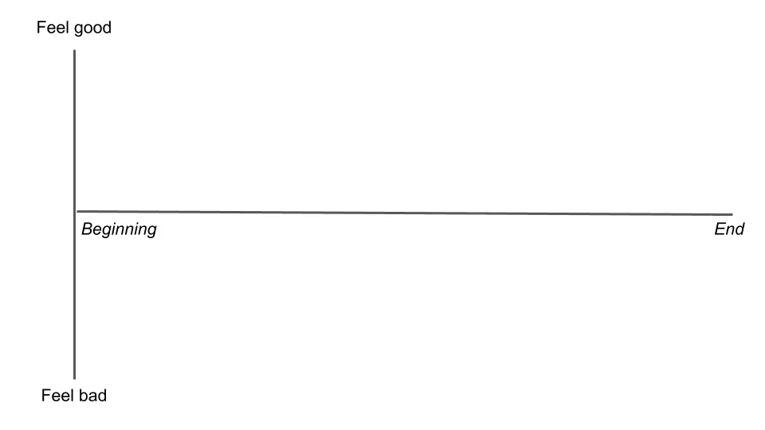
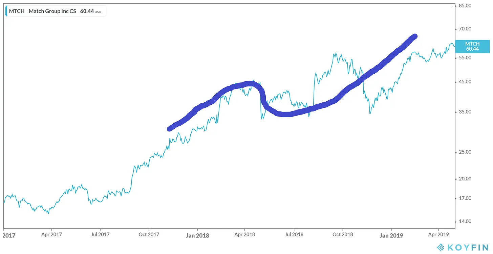

## テイクアウト

今回はテアポイントはなし、物語がネタバレになるから。

---

まずは物語についての物語から始めましょう。

[ベストセラー作家カート・ヴォネガット](https://en.wikipedia.org/wiki/Kurt_Vonnegut「カート」)は『スローターハウス・ファイブ』『キャッツ・クレイドル』など多くの作品で知られています。自伝の中で、[彼はこれが文化への最大の貢献だと主張しています:](https://books.google.com/books?id=Zd_9o3uyoVsC&pg=PA285&dq=vonnegut+shape+story+thesis&hl=en&sa=X&ei=tasCU8yjEML-oQSXloKIBQ#v=onepage&q=vonnegut%20shape%20story%20thesis&f=false「本」)

だから、_stories形があるんだ、と彼は言う。

それはどういう意味でしょうか?カートは[^1]説明します:

グラフがあり、片面に幸運と悪い幸運が描かれ、もう片面が物語の始まりから終わりまでの進行を示していると想像してください。

このグラフ上のどんな物語でもプロットしてその形を見ることができます。そして世界中のすべての物語をプロットすると、いくつかの共通パターンが浮かび上がるでしょう。

例えば、『ゴッドファーザー』(https://en.wikipedia.org/wiki/The_Godfather『ゴッドファーザー』)では、マイケルは最初は幸せに見えますが、家族がトラブルに巻き込まれ、彼は国を離れざるを得なくなります。最終的に彼は戻り、支配を取り戻し、ほとんどの反対勢力を殺して、街のマフィアの名付け親となります。

これをグラフにプロットして、「穴の中の男」タイプの物語と呼びます。人はうまくやっていて、穴に落ちてから抜け出し、以前よりも良くなります。

一方、『アバウト・タイム』(<https://en.wikipedia.org/wiki/About_Time_(2013_film)>『アバウト・タイム』)では、[^2]の主人公たちが恋に落ち、互いに失い、一連の出来事の後に再び出会う物語が描かれています。

これを「男の子と女の子が出会う」タイプの物語と呼びましょう。想像できるように、これは多くの恋愛映画に共通する典型的なことです。

そして『変身』(https://en.wikipedia.org/wiki/The_Metamorphosis『カフカ』)のような物語では、主人公が虫に変身して死んでいくにつれて状況はどんどん悪化していきます。これは「悲劇」と言えるでしょう。

上記の形に加えて、カートは他にもいくつか効果的かもしれないものを思いつきました。「貧困から富裕へ」の物語は着実な上昇を描き、「イカロス」の物語(https://en.wikipedia.org/wiki/Icarus「イカロス」)は上昇と衰退、そして「オイディプス」https://en.wikipedia.org/wiki/Oedipus「オイディプス」の物語は、落ちぶれ、昇華し、再び落ちぶれるというものかもしれません。

この考えを基に、[バーモント州とアデレードの研究者チームが[Project Gutenberg](https://www.gutenberg.org/ 『proj』)で機械学習を用いて1,327の有名な物語(https://arxiv.org/pdf/1606.07772.pdf「論文」)を分類しました。彼らは、ほとんどの物語が確かにいくつかの主要なタイプに分類できることを発見しました。彼らの方法論の詳細については脚注をご覧ください[^3]。

ここでは「少年と少女の出会い」を「シンデレラ」に置き換えましたが、基本的にはヴォネガットの言うことが正しかった[^4]を示しています。_Stories形があり、いくつかの標準的な形がありますshapes._

これはどう関係があるのでしょうか?株のアドバイスやスタートアップのトラッシュトーク[^5]を求めてここに来たのに、なぜ物語に関する多くのメモがあるのですか?

すぐにリンクを作りますので、今はその物語の形を念頭に置いてみましょう。

---

### 株には形がある

先月、あなたの投資提案がひどい理由の一つについて話しました:[合意を考慮していない](/writing/relative_billionaire "pitch")

今月は、さらにフラストレーションが溜まるもう一つの一般的な理由について話しましょう。

2018年4月30日時点のこの会社を考えてみましょう:

X社はインターネット企業で、主にアプリサブスクリプションで収益を上げており、拡大する消費者カテゴリーでの独占を得ています。総加入者数は700万人で、そのうち300万人はメインアプリの加入者です。売上高は前年比で~30%増加しています。EBITDA(利益指標の一種)の利益率は40%です。株価は過去最高水準に達し、過去1年で2倍以上に上昇[^6]。

かなり良さそうなので、所有したいかどうかさらに調べてみる価値はあるかもしれません。

また、2018年5月1日時点で同じ会社も考慮してください:X社はインターネット企業で、主にアプリサブスクリプションで収益を上げており、拡大する消費者カテゴリーでの独占を得ています。総加入者数は700万人で、そのうち300万人はメインアプリの加入者です。収益は前年比で~30%増加しています。EBITDA(収益指標の一種)の利益率は40%です。株価は過去1年で過去2倍以上に上昇し、過去最高水準に達しています。_[Facebookがこのカテゴリーへの参入を発表した](https://techcrunch.com/2018/05/01/facebook-dating/ 'FB')_

会社のファンダメンタルは変わっていませんが、1日以内に22%の価格下落は明らかに何かが変わったことを示しています。もちろん、それが投資家がこの株について語っている物語です。

**売り込みとは株の物語にすぎないだろうか?**

4月30日、コンセンサス[^7]は、同社が競争相手がいない中で高マージンで急速に成長しているというものでした。投資家たちは株を買い続け、価格は上昇し続けました。

5月1日、物語は分かれ道に差し掛かりました。Facebookがこの会社を打ち負かすだろうと言い、できるだけ多く売るべきだと言うこともできた。あるいは、その恐怖は誇張されている、Facebookの非コア製品記録は悪い、できるだけ多く買うべきだと言うこともできる。

聞き覚えがありますか?

今回の会社は Match.com で、Tinderの親会社で、その下落から約1年後に株価が再び倍増しました。『ボーイ・ミーツ・ガール』はうまくいきました。

5月1日、両方の話は同じくらい妥当で、賢い投資家たちがその取引のどちらかの立場を取っていました。重要なのは、Matchのビジネスに実際の変化が起こる前から株価が反応していたことです。物語は岐路に差し掛かり、投資家は異なる側に立つようになりました。「イカロス」のように負けると考えた人は、そうでないと考えた人は利益を得ました。話が変わるにつれて株価も変わります。

**これはあなたの投資ピッチにとって何を意味するのでしょうか?** これは、ストーリーテリングが良いピッチの鍵であることを意味します。ストーリーをうまく伝えれば伝えるほど、その作品が注目を集める可能性は高まります。上司にも他の投資家にも同様です。面倒ですが、「最高のアイデア」が「最高のストーリー」であることが非常に多いのです。

**アイデアが支持されるかどうかがなぜ重要なの?**投資は正しいことだけでなく、他人に自分が正しいと気づかせることも重要だと覚えておいてください。価格が[^8]動かなければ、素晴らしい会社に座ってお金を稼ぐことはできません。合意や正しいことに反して利益を得ますが、他人を味方につけられなければ、永遠に合意に反対し間違っている状態になります。短期的には株式市場は投票機であり、長期的には計量機かもしれませんが、自分の話を広めなければ機械は壊れた[^9]です。

**どこに注目すべきか?** 投資期間が短期であれば、物語の転換点を探すことになるでしょう。いわゆる触媒です。例えば、株価が現在穴を埋めている理由や、なぜ抜け出しそうなのかについて信頼できる理由を持つことが望ましいでしょう。もし長期的な視点であれば、「貧困から成功へ」的な物語に興味があるかもしれません。

もちろん、物語は両方向に起こり得ます。私は回復した株の例を示しましたが、逆の株を選ぶことも簡単にできました。人々はエンロン、ティルレイ、ラッキンなどの素晴らしい話を語っていましたが、すべてが崩壊しました。どんなに物語を語っても魔法のように収益を生み出すわけではありません(ただし、ポジションを期限内に離脱した人には多額の利益をもたらしました)。

また、株価を曲線に合わせるだけで利益を[^10]ると言っているわけではありません。私が言いたいのは、株の認識は物語の流れに沿っており、それはしばしば価格に表れているということです。どんな物語を伝えたいのかを知ることで、売り込みが良くなります。ファンダメンタルズだけが株価を動かすわけではないことは、私たちは以前から知っていました。【シラーの株式予測理論の歴史に関する研究】を参照してください。(https://pubs.aeaweb.org/doi/pdfplus/10.1257/089533003321164967「シラー」)良いストーリーを語る能力は、投資アイデアを伝える鍵です。なぜ多くの投資家が自分のアイデアを公に話すと思いますか?自分の話を他人に納得させれば納得させるほど、投資家として利益を上げる可能性は高まります。

投資家はお互いに物語を語り合い、真実であってほしいことに賭けます。

### スタートアップには形がある

テック分野でもストーリーテリングは重要です。例えば、[スタートアップがピッチデッキだけで何百万ドルも集めた](https://www.businessinsider.com/pitch-decks-that-helped-hot-startups-raise-millions-2019-4「ピッチ」)や、[マサがサウジから1時間で450億ドルを調達した](https://youtu.be/Sa2_VBu0d7k?t=92「マサ」)です。前者では、スタートアップがVCに10億ドルまで成長する方法を伝えました。後者では、マサはモハメド・ビン・サルマンを説得し、1兆ドルに成長できると信じさせました。彼らの実績も確かに一因ですが、投資家の心に描くイメージが資金調達の鍵でした。

誰も敗者を支持したくないので、スタートアップは自分たちの物語を最も良く見せる形で語る責任があります。彼らは「貧困から大金持ちへ」と自分たちを位置づけようとし、投資家は彼らが「イカロス」かどうかを見極めようとしています。VCが会社を拒否すると、暗にその話が退屈すぎると言っているのです。退屈な話は避けましょう。

これはまた、**スタートアップが自分自身について最も魅力的な物語を語る動機付けを受けている**も含めています。** そうすることで、多くは真実をできるだけ誇張します。彼らは始まりよりも、終わりの章であなたを売り込みたいと考えています。経験豊富な投資家はこれを知っていますが、一般の人々はおそらくあまり気づいていないでしょう。これが詐欺になるかどうかは微妙な境界線です。

次のシナリオを想像してみましょう。

> あなたの会社はトレンドに早すぎて、それを救おうとして借金を負ってしまいました。大学生から電話がかかってきて、あなたの製品は素晴らしいと言われます。実際、その製品のために多くのお金を稼ぐプログラムを書いていると言われます。あなたは興味を持ち、その若者とデモをするために会うことに同意します。

> その電話の向こう側で、緊張した大学生が電話を切り、最初の契約がもうすぐ取れることに気づく。唯一の問題は?彼はあなたの製品のコピーすら持っていないし、ましてや動作するプログラムなんて持っていない。

詐欺か、それとも楽観的な考え方か?おそらく、この子と永遠にビジネスをしない方がいいと思っているのだろう。もしそうなら、[ビル・ゲイツやマイクロソフトの誕生を逃しただけだ。](http://www.computinghistory.org.uk/det/5946/Bill-Gates-and-Paul-Allen-sign-a-licensing-agreement-with-MITS/「MITS」)時には、まだ完全に真実ではない話が真実になることもある。

別のシナリオを想像してみましょう。

> 若い創業者と会い、革新的な医療ソリューションについて提案されます。見せられるプロトタイプはそれほど洗練されていませんが、最終的には大規模な使用に備えた完成品を作る自信を持っています。

> 創業者はますます注目を集め、複数の雑誌の表紙を飾り、薬局と大きな契約を結んでいます。取締役会にも有名人が多くいるようですが、なぜ医療経験者が少ないのかはよくわかりません。

この場合のスタートアップはもちろん[Theranos](https://www.businessinsider.com/theranos-former-board-members-henry-kissinger-george-shultz-james-mattis-2019-3「Theranos」)であり、この10年で最大の詐欺の一つとして失敗に終わりました。ホームズの話は非常に素晴らしいので、誰もが聞きたがりました。投資家たちは彼女の提案に「魅了された」と報告しています。もしマイクロソフトのシナリオから得た教訓が「すべての面白い話を信じろ」だったなら、それが問題になる理由も理解できます。時には、まだ真実でない話が永遠におとぎ話のままになることもあります。

**詐欺と楽観的な思考の境界線は微妙になり得ます。** スティーブ・ジョブズは[現実歪み場](https://en.wikipedia.org/wiki/Reality_distortion_field「rdf」)、つまり誰かに「何かが可能だ」と信じさせる能力で有名でした。当時のホームズも、多くのスタートアップ創業者と同様に、不可能を成し遂げられると信じていたに違いありません。今では結果で判断していますが、スティーブのアップル復帰がうまくいかなかったシナリオは簡単に想像できます。あるいは、プロットツイストが違う結末をもたらせたかもしれない他のスタートアップの失敗例を考えてみてください。[WeWork、Pets.com、Moviepassなど](https://f3fundit.com/11-of-top-startup-failures-in-history/「スタートアップ」)いずれも素晴らしいストーリーを持っていましたが、今は失墜しました。WeWorkは成長が急かなければもっと良くなっていたかもしれませんし、Chewyという精神的な後継者 Pets.com、Moviepassはもっと資金調達[^11]があればうまくいったかもしれません。最後まで、社内の誰もがストーリーアークの好転を期待していたに違いありません。

**投資家だけでなく、あなたのスタートアップストーリーは従業員、顧客、競合他社にとっても重要です。**

株式はあなたの物語の利害関係です。スタートアップの従業員は通常、現金よりも株式で多く支払われているため、あなたのストーリーが良いものになると賭けているのです。人材採用の難しい部分は、会社により良い安全な代替手段を犠牲にするだけの可能性があると納得させることです[^12]。

顧客は購入を決める前にあなたのストーリーを見ます。彼らは、あなたの製品が自分に何をもたらすか、それが時間の節約、労力の軽減、地位の向上など、さまざまな可能性を考えます。前述の通り、誰も敗者を支持したがりません。

競合他社もあなたの語るストーリーを見て、あなたがやっていることに基づいて計画を立てています。もしあなたが彼らより速く成長しているなら、彼らはその理由を探ろうとするでしょう。もしあなたの成績が悪ければ、その機会を利用してターゲットオーディエンスに自分の物語を売り込むでしょう。

ストーリーがスタートアップにとって重要であることはよく知られています。投資家を引きつけることだけでなく、スタートアップが関わる他の誰にとっても重要です。[ベンチマークのビル・ガーリーが言ったように:](http://abovethecrowd.com/1999/10/18/the-rising-importance-of-the-great-art-of-storytelling/「ビル」)

> 今日の独特なインターネットビジネス環境において、ストーリーテリングの技術はますます重要性を帯びています。「ネットワーク効果」や「リターン増加」現象のため、多くの人は先駆者(あるいは少なくとも最初に大きな規模を達成する企業)がインターネット市場の大部分を占めると考えています。

企業は自らの物語を語り、それを真実にしようと努力します。

### 君の形

物語についての物語から始めました。

最後に自己についての物語で締めくくろう。

昔々、ある人が家を離れて世界を探検した。彼らは浮き沈みを経験し、どん底では想像を絶する痛みに苦しんだ。しかしそれを乗り越え、以前よりも良くなった。

聞き覚えがありますか?

でもこれは一体どんな話なのでしょうか?

それはキリスト教のイエスの物語かもしれません(https://www.learnreligions.com/the-resurrection-story-700218「イエス」)。

それは仏教の仏陀の物語かもしれません(https://tricycle.org/magazine/who-was-buddha-2/「仏陀」)。

そしてそれはあなたの物語かもしれません。

**私たちは皆、自分の物語のアークの主人公であり、常に物語を右に調整しようとしています。幸運、技術、努力の組み合わせによって、すでにそこにいると感じている人もいるかもしれません。また別の人は、容赦ない悲劇に囚われていると感じているかもしれません。自分自身の物語を創り出すのは私たち次第であり、その選択の結果と共に生きていくのです。人生は不公平ですが、それでも自分の意志でできることはあります。

私たちは自分自身の作家であるため、他人の全ての物語の流れを知らないのです。彼らがどれほど不幸を経験したか知らずに人生を楽しんでいる姿が見えます。どれだけそれを防ごうと努力したかも知らずに、彼らが苦しんでいる姿も見られます。私たちは彼らの現状と自分が経験した場所を比較し、平均的な経験が彼らのハイライトほど良くないことに苛立ちを感じます。

世界は舞台ですが、私たちはプレイヤーではなく監督です。物語作りにどれだけ努力するかは私たちだけが決めます。成功すると自分に言い聞かせても必ずしも成功とは限りませんが、物語の流れが悲劇に終わると信じることは、必ずしも悲劇に陥る良い方法です。

[ニール・ゲイマンの言葉を借りれば:](https://www.youtube.com/watch?v=Xn2n7N7Q2vw「ニール」)>人は物語を語りますし、それは私たちを人間たらしめる大きな一部です。私たちは物語のために多くのことをし、多くのことを耐え抜きます。そして物語は、逆に私たちを耐え抜き、人生を理解する助けにもなります。

物語を語っても、それを現実にするかどうかはあなた次第です。

## その他

1. [SaaSの証券化がどのような形になるか](http://conordurkin.com/some-thoughts-on-saas-abs/「SaaS」)
2. [商品化は腐敗させるのか?絵画と売春婦からの教訓](https://scholarship.shu.edu/cgi/viewcontent.cgi?article=1732&context=shlr「腐敗」)
3. [SpatialはAR/VRユーザーがデスクトップユーザーと会議に参加できるようにしています](https://www.wired.com/story/spatial-vr-ar-collaborative-spaces/「空間」)
4. 『Appleがその慣行を変えるべきだという主張は、成功しすぎた、あるいは「不公平」だから、価格設定や配布、設計を変えるべきだという主張は、因果関係の理解を誤っている。』](http://www.asymco.com/2020/06/20/subscribe-again/『サブスクライブ』)
5. [ウェデルアザラシがターディスの音を出す。](https://www.youtube.com/watch?v=megeZ8zhKJ0&feature=youtu.be「ウェデル」)感謝@rosetazetta。また、[2時間版](https://www.youtube.com/watch?v=4dbSA4dTICc「アザラシ」)もあり、これを書いている間に聴き終えたかどうかは分かりません。

[^1]:自伝や講演(こちら、https://youtu.be/GOGru_4z1Vc「カート」)の両方で

[^2]:この映画の宣伝はやめません。私のお気に入りの一つです

[^3]: 論文の全文は[こちら](https://arxiv.org/pdf/1606.07772.pdf「paper」)にあります。これらの手法は、主成分分析/特異価値分解、階層的クラスタリング、そして教師なし機械学習によるクラスタリングでした。まず感情分析を適用して物語全体の感情的価値を抽出しました。SVDがどのように使われたのか正確には不明ですが、次元削減を適用し、類似度行列から上位の特徴を抽出し、分散の大部分を説明できた上位ストーリータイプを見つけたようです。階層的クラスタリングは、物語の種類をクラスタリングするための標準的なデンドログラムのようです。教師なし機械学習ではKohonenの自己組織化マップが使われました。これはKの意味のような方法でグループをクラスタリングするアルゴリズムのようです。

[^4]:技術的には、ヴォネガットは少年と少女の出会いをシンデレラと分けています。シンデレラは段階的な盛り上がりと急激な落下があり、回復する前の急激な落下があります。私には似ているので、まとめてまとめました。ヴォネガットはまた、『ハムレット』のように「何も起こらない」物語には単一のフラットラインを提案しています。私はそのような形には反対し、単純化のために省いています。物語の種類について別の見解として、[クリストファー・ブッカーが7つの基本的なプロットについて論じています](https://en.wikipedia.org/wiki/The_Seven_Basic_Plots)

[^5]:株式のアドバイスやスタートアップの悪口を求めてここに来たのはご遠慮ください。前者はやらず、後者はたまにしかやらないので、がっかりすると思います。

[^6]:会社[こちら](https://d18rn0p25nwr6d.cloudfront.net/CIK-0001575189/63f15bf6-7324-446e-b762-fb1ac98ccf14.pdf「MTCH」)に8,000ドル、ただしサプライズは台無しになります。

[^7]: ショートの言っていたことは単純化のために無視しましょう。価格パフォーマンスを見ると人々は強気だったのです。

[^8]:はい、配当が存在することは知っていますが、[リターンを促すにはあまり重要度が低いです](https://media-publications.bcg.com/pdf/VCR/2006-VCR-Spotlight-on-Growth.pdf)

[^9]:投票機とは何を意味していたのか、私はあまりよく理解していません。単に投票の集計を常に管理し、常に変化する機械のことだと思います。

[^10]:テクニカル分析を職業とする人たちは、ここで意見が異なります。

[^11]:これらはすべて仮定の話であり、結論を出す方法はありません。Moviepassが大きな加入者を獲得しつつ、現金を大量に燃やすのは非現実的でしょうか?つまり、どれだけの現金を消費できるかによりますよね?もしSoftbankがWeWorkではなくMoviepassに資金を渡していたらどうなっていたでしょうか?

[^12]:伝統的な企業がスタートアップより安全だとは意見が異なる人もいるかもしれません。テック業界で働くことはキャリアの安全をもたらすが、仕事自体にはそうではないという議論もあります。多くの人にとって解雇は依然として辛いことであり、経済的に大きな打撃をもたらすこともあると思います。