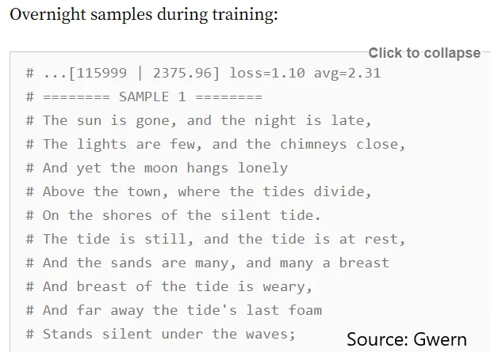
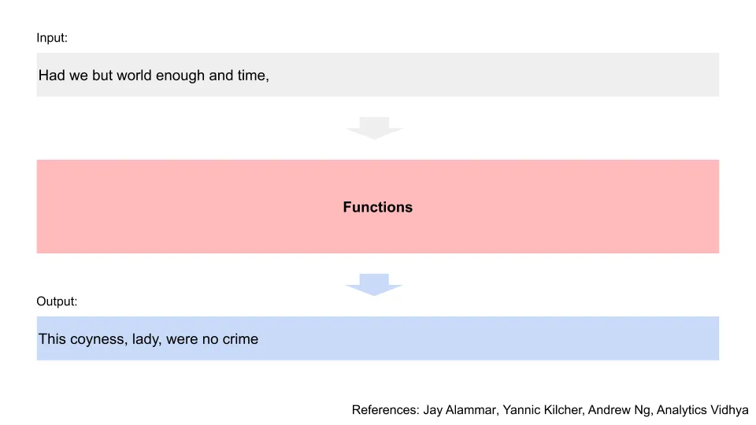
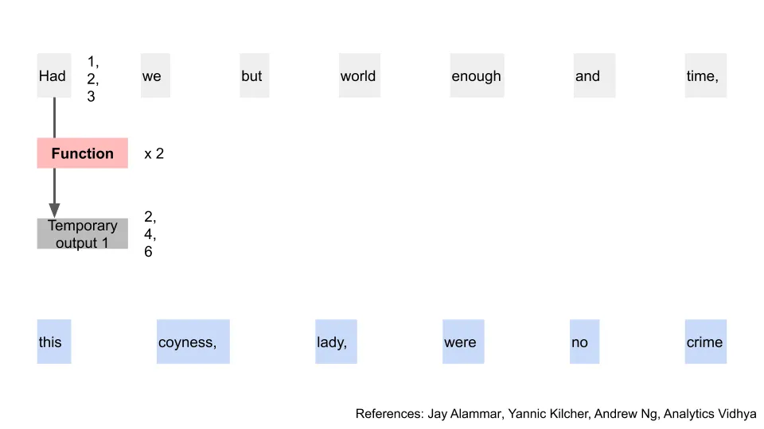
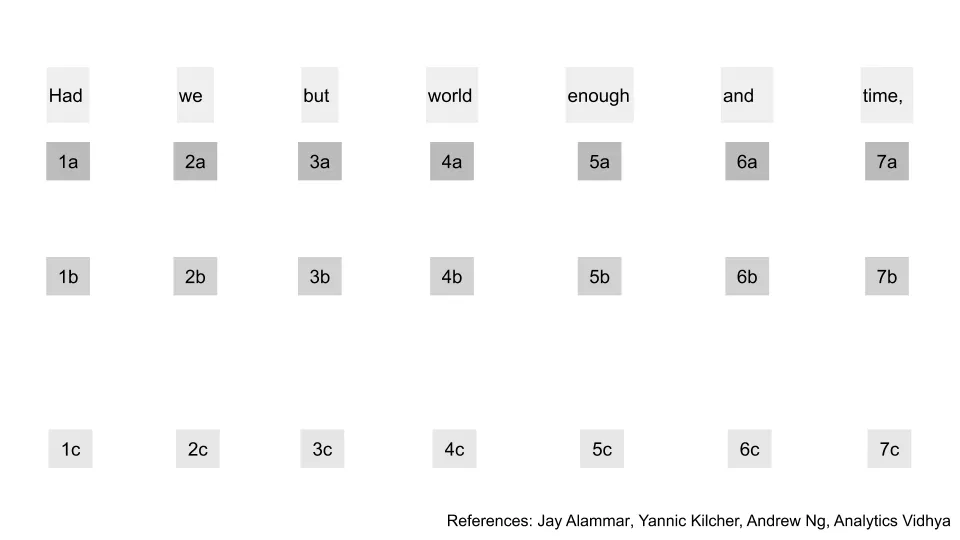
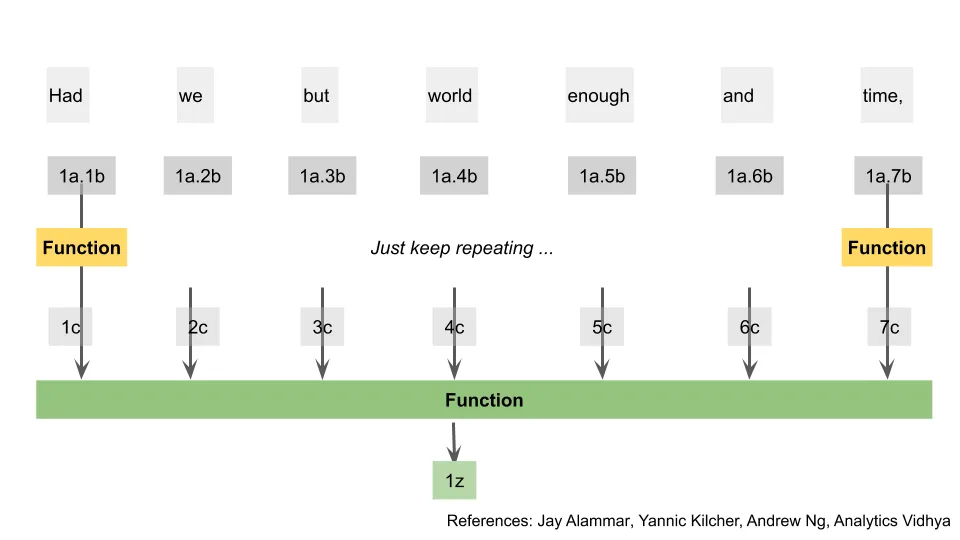
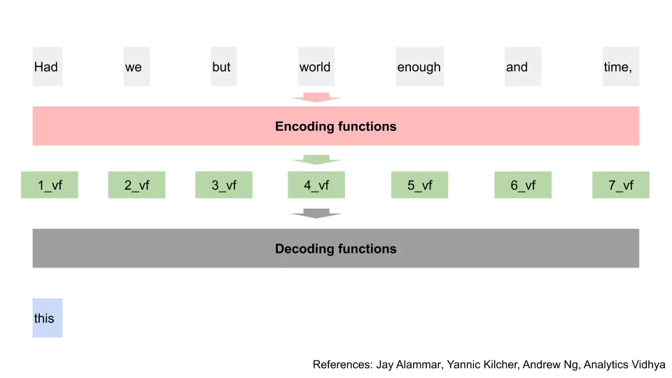

## テイクアウト

GPT-3は多くのユースケースに一般化できる印象的なテキスト予測モデルです。私はその仕組み、その誇大宣伝が正当かどうか、GPTの検出方法、そしてそれが私たちの仕事を奪うかどうかを説明します。

## 結局のところ、ただの人間だ

約1週間前、シャリフ・シャミームが[この動画をTwitterで共有しました
新しいAIであるGPT-3](https://twitter.com/sharifshameem/status/1282676454690451457)の能力を実証しています。

そして。ツイッター。パニックになった。気を失った。

おそらく、自分たちの楽な仕事である[gossiping about startups](https://twitter.com/magdalenakala/status/1285597906892988417?s=20 'startup')[copying stack overflow answers](https://www.zdnet.com/article/the-most-copied-stackoverflow-java-code-snippet-contains-a-bug/ 'SO')自分たちの楽な仕事が危機に瀕していると気づいたのか、プログラマーやベンチャー[^1]、Twitter上でGPT-3のデモや最新の人工知能に対する熱い意見でフィードを埋め尽くし始めた。もし興味があれば、今もそういった投稿は続いている[take a look](https://twitter.com/hashtag/gpt3?lang=en 'gpt3')

そこで、私は自分の熱い見解を持って、AIに魅了された多くの人々の利益を得ようとしています。

なあ、俺も人間だ。

この記事は5つのセクションに分かれています。

1. GPT-3が何ができるのか、なぜそれが素晴らしいのか、そしてなぜ人々が懸念しているのかの説明
2. GPT-3以前の言語モデルの動作についての簡単な技術的な概要
3. GPT-3の動作について少し技術的な概要
4. GPT-3によって書かれたテキストの検出方法
5. GPT-3の示唆

始めましょう。

## 1.GPT-3は、多様なユースケースに対応した理解可能な出力を作成できるため、非常に印象的です

[GPT-3](https://arxiv.org/pdf/2005.14165.pdf 'GPT')は[OpenAI](https://openai.com/about/ 'Open')によって作られました。彼らは「人工汎用知能が人類全体に利益をもたらす」ことを目指す会社、つまりロボットが私たち全員を殺さないようにすることです。

GPT-3は汎用言語モデルで、入力として単語を取り、出力としてより多くの単語を生成します。**素晴らしい[autocomplete function](https://en.wikipedia.org/wiki/Autocomplete#:~:text=Autocomplete%2C%20or%20word%20completion%2C%20is,to%20accept%20one%20of%20several. 'auto')だと考えてください。** 汎用モデルなので、さまざまなタスクを解決できます。ユニコーンについての段落を書かせたり、文を翻訳したり、プログラミングコードを生成したりといったことも可能です。

これは便利なことです。なぜなら、通常はアルゴリズムが訓練されたことだけをやるはずだからです。エクセルに入力して詩を教えてくれるようなものではありません。長い間、プログラムは指示通りに動くことを期待してきましたが、設計されていない作業はうまくこなせません。

一般的なモデルなので、GPT-3はそのタスクに特化したモデルよりも劣ると思われるかもしれません。例えば、GPTの翻訳結果と翻訳だけに特化したアルゴリズムを比較すると、GPTはそれほど優れていないでしょう。

驚くべきことに、必ずしもそうとは限りません。以下は翻訳テストの結果を示すこの[GPT paper](https://arxiv.org/pdf/2005.14165.pdf 'GPT')の表です。簡単にするために、「最先端」モデルを表す最初の行と、最も性能を発揮するGPTモデル[^2]を表す最後の行を比較すればよいでしょう。ここでは数値が高いほど良いです。翻訳タスクのいくつか(特に翻訳_から英語への翻訳)では、**GPTは最先端モデルと同等かそれ以上に優れていることがわかります。**

OpenAIはGPTをテキスト予測やトリビア問題など、別のデータセットで検索させず、代名詞がどの単語を指しているのかを判別せずにテスト[^3]。GPTがすべてのケースで勝つわけではありませんが、ほとんどの場合で素晴らしい結果を出しています。**もしモデルを一つだけ選べるなら、おそらくGPTを使いたいでしょう。** AIコミュニティの最[Simone Biles](https://www.nytimes.com/2019/10/13/sports/simone-biles-worlds.html 'Simone')であり、多くのイベントでトップであり、他のイベントでも優れています。

いくつかの例を見てみましょう。

下の最初の画像では、モデルに上部にプロンプトが出され、その後下に残りのテキストが表示されます。テキストはさらに長く続きます。表示のために切り取っただけです。結果はかなり素晴らしいですよね?

この2枚目の画像では、モデルから生成された別のサンプルテキストが見られます。今回は詩も作成できることを示しています。おそらく私が自分で書くよりも良いでしょう。

すごい、つまりすべての話題は正当化されたのですか?これはAIの能力が人工的な境界を越えた画期的な瞬間だったのでしょうか?TwitterやGoogleのトレンドは確かにそう考えているようです。

ええと...はいでもあり、いいえでもあります。

さっき見せた2枚の画像?嘘をついた、あれはGPT-3のものじゃない。

実は2019年2月にリリースされた古いモデル、GPT-2からのものです。実際、このニュースレターの長年の読者は、当時私が書いた文章を覚えているかもしれません。[this article](/writing/moloch 'Moloch')[^4]モデルのすでに称賛すべき成果を強調していました。古いモデルから生成されたテキストはすでに素晴らしかったです。

では、今回は何が違うのでしょうか?ロボットはマーケティング部門が強化されたのでしょうか?

部分的にはそうです。GPT-3は[the end of May](https://minimaxir.com/2020/07/gpt3-expectations/ 'GPT')年にリリースされました。Googleの検索トレンドを振り返ってよく目を細めて見ると、グラフのわずかな上昇が、本格的に急増し始める2週間前のことです。それがバイラルツイートが出る前のGPT-3への世間の関心でした。プレゼンテーション形式が本当に違いを生むことを示しており、私はTikTok動画を作るために執筆をやめるべきです。

とはいえ、今回も実際に印象的な改善があります。GPT-3はGPT-2よりも良い結果を出し、より多くのシナリオに一般化できます。これは主に訓練に使われるデータ量の増加とモデルパラメータの増加によるものです。

以下で詳しく説明しますが、これらのモデルの仕組みはデータを取り込み、トレーニングし、トレーニングセットに応じてモデルの重み付けを変化させるというものです。

訓練データが多いほど[^5]が役立つことは以前から知られており、GPT-3の結果もそれが真実であることを示しています。GPT-3は古いバージョンが取り込んだ[~50x the amount of data](https://lambdalabs.com/blog/demystifying-gpt-3 'lambda')を取り込み、なぜこれほど多くの関連参照を出力[^6]に導くのか直感的に理解しています。

GPT-3のモデルには旧バージョンと比べて[~100x the amount of parameters](https://minimaxir.com/2020/07/gpt3-expectations/ 'params')も含まれています。1750億のパラメータを持つ[isn't unheard of](https://twitter.com/iamtrask/status/1285301017878441988?s=20 'params')ですが、GPT-3の回答にさらに差別化が[^7]されています。

マックス・ウルフは、GPT-3で改善された他の2つの点を指摘しています:[1) It allows for text generation twice as long, and 2) prompts to the model are even more helpful in steering the direction of text generated](https://minimaxir.com/2020/07/gpt3-expectations/ 'Max')。GPT-3は入力時に、サンプル回答の「プロンプト」を0回、1回、あるいは数回受け取ることができます。プロンプトは、GPT-3がどの答えを提示すべきかの理解を導き、プロンプトが多いほど良いのです。

全体として、MaxはGPT-3が古いGPT-2の約5倍の頻度で実用的な結果をもたらしたと推定しています。話題性に関しては、一般の人々の評価が0から100に増えたのに対し、視聴者は50から70に上昇しています。

これにより、[this, a plugin to pull GPT results to autofill google sheets](https://twitter.com/pavtalk/status/1285410751092416513?s=20 'twitter')のような結果が得られます(今回は本物のデモです、約束します):

GPTは一般化が得意なので、「知識作業」分野で使われることに大きな期待があります。プログラミングから銀行、医療に至るまで、GPTが最終的には専門家と同じ質の答えを提供できるのではないかという考えもあります。次に医師に診てもらうとき、診断はGPT博士から下されるかもしれません。

それはとても良い質問ですね。どんな懸念がありますか?

マックスはさらに詳しく[here](https://minimaxir.com/2020/07/gpt3-expectations/ 'expectations')こう指摘します。

- モデルの出力生成が遅い
- 公に示された例には多くの選りすぐりが見られます
- みんな同じ訓練済みモデルを使っていて、微調整できない
- 訓練における体系的バイアスの問題が進行中です。例:リコール[how Microsoft had to pull its chatbot after it turned racist](https://www.theverge.com/2016/3/24/11297050/tay-microsoft-chatbot-racist 'Tay')

もう一つの懸念は、そのようなモデルの訓練コストです。面白いことに、[Yannic on youtube](https://www.youtube.com/watch?v=SY5PvZrJhLE&feature=youtu.be 'Yannic')は研究者たちがデータ収集の一部でミスを犯し、それに気づいたのはすでにモデルを訓練した後だったと指摘しました。最初からやり直す代わりに、モデルの再訓練コストが高すぎたため、他の方法でその問題を調整しなければなりませんでした。

それは驚きです。人々はハードウェアがアルゴリズムの要件に追いつくにつれて、モデルトレーニングコストが下がることを期待しています。もしそうでなければ、大企業だけが自社の目的に合わせてモデルをカスタマイズできるでしょう。

最後に、これが私たちのすべての仕事を失い、人類の終焉をもたらすという終わりなき不安もあります。この軽い話題については、結びの発言で触れます。

では、モデルがどのように機能しているのかを詳しく見てみましょう。

## 2.GPT-3以前に使用されたseq2seqモデルの概要

_Disclaimer:次の2つのセクションでは、使用されているモデルについて説明します。もし気がつかない場合は、「GPT-3をどう検出できるか?」のセクションに進んでも構challenge._

_Further断りですが、私は機械学習の専門家ではなく、関わるモデルは複雑です。この記事の最後にリンクされている他の説明[this talk](https://www.youtube.com/watch?v=S0KakHcj_rs 'talk')を参考にします。ご意見があれば気軽に返信してくださいcorrections._

**GPT-3は従来の予測モデルとは異なるモデル**を使用しています。しかし、GPT-3を見る前に古いモデルの直感を理解することは依然に役立ちます。まず古いモデルを一つずつ見て、その後GPT-3を説明します。

まずは人気のある古いものから始めましょう[sequence to sequence model.](https://google.github.io/seq2seq/ 'seq')これは一般的に「seq2seq」と略されますが、分かりやすくするためにここでは「古いモデル」、GPT-3を「新しいモデル」と呼びます。

例えば、あるフレーズがあり、次のフレーズを予測したいとします。そのフレーズを一連の関数からなるアルゴリズムに通し、予測された出力を得ます。

すべての単語が重要なので、入力フレーズを分割して一語ずつ見ていく必要があります。例えば「Had we but world enough and time」は「Had we but world enough and time」と「Had we but world enough」と「limes」では異なる意味合いを持ちます。

図を切り離して、最初の単語だけを見てみましょう。その単語を関数に通し、一時的な出力を得ます。単語を数字として表現できることはわかっています。なぜなら、コンピュータが単語を数として処理する方法だから[^8]。つまり、単語をある数に変換し、数学を行ってからさらに別の数字の集合を得ると考えてください。例えば、(1, 2, 3) に 2 を掛けると (2, 4, 6) になります。

高校の数学を覚えているなら、これは行列掛け算または線形代数です。**以下の数学のほとんどは、このセクションと次のセクションの両方で何らかの行列掛け算形式でも表現可能です。**

使われている関数は[neural network, so it's more complicated than just multiplying by two.](https://towardsdatascience.com/learn-how-recurrent-neural-networks-work-84e975feaaf7 'neural')直感を以前に説明したので、その仕組みについては[here](/writing/ml 'ML')っと説明してしまうので、この解説を複雑にしてしまうでしょう。無料字幕の方はメールをください。転送します。

ここでより重要なのは、単語が別のものに変換されるということです。モデルは単語が最初に数字に変換される方法と、私たちが行う機能の両方を制御できます。例えば、(1, 2, 3)かける代わりに「Had」を(2, 3, 4)にし、さらに3を乗せて(6, 9, 12)に変えることができます。

最初のワードはこれで終わりなので、次に進みましょう。ここで違うのは、最初のワード[^9]の一時的な出力1があることです。それを2番目のワードと組み合わせて、関数を再度適用して新しい一時的な出力2を取得します。

この時点で、シーケンスの残りの部分がどこに向かっているのかを推測できます。実際、私たちはこの作業を繰り返し、入力の最後のワードにたどり着きます。一つのワードの一時的な出力を使い、次の単語の一時的な出力を繰り返し生成するのを助けます。

その一時的な出力を使って別の関数を適用し、2つの結果が得られます。出力の最初の単語(数値から元に戻した後)と、もう一つの一時的な出力(まだ数字のまま)が得られます。例では「this」という単語が得られます。素晴らしい、ついに具体的な進展が見つかりました!

これで一時的な出力、実際の出力、そして新しい関数ができた。ご想像の通り、同じ手順を繰り返して次の予測語ともう一時的な出力を得ることができる。また繰り返されるパターンだ。

そして、先ほどの入力シナリオと同様に、フレーズの最後まで繰り返します。

そして、古いモデルはこれで終わりです!かなりの説明で、明らかに単純化しすぎましたが、プロセスの高度な理解を得ることができました。詳細は元の論文をご覧ください[here](https://arxiv.org/abs/1409.3215 'paper')

さて、ここで重要な問いがあります。これは私たちの理解を試すものであり、新しいモデルの改善を示唆しています。古いモデルでは、前の部分を解く前にプロセスのどの部分も解決することは可能でしょうか?例えば、「私たち」を解かずに「時間」の一時的な出力を得ることは可能でしょうか?

**いいえ、すべてを順番に実行しなければならなかったので。** 単語の位置と文脈の両方が重要なので、私たちはすべてを一語ずつ処理したいのです。各ステップが前のステップに依存しているため、どの部分もスキップできません。これが古いモデルが[recurrent neural network](http://karpathy.github.io/2015/05/21/rnn-effectiveness/ 'RNN')と呼ばれる理由でもあります。そのため、入力テキストが大きくなると予測の計算も遅くなります。

そこでトランスモデルの登場です。

## 3.GPT-3はトランスフォーマーデコーダモデルを使用しており、これはトランスフォーマーモデルのバリエーションです

GPT-3はGenerative Pretrained Transformer 3の略です。名前のトランスフォーマーは「[transformer model, using an "attention" mechanism.](http://jalammar.github.io/illustrated-transformer/ 'transformer')」を表しています。GPT-2とGPT-3は同じタイプのモデルを使用しているため、前者の説明は一般化[^10]でしょう。

しかし、この投稿を投稿する直前に学んだのは、**実際には彼らは実際に[a variation of the transformer model.](https://s3-us-west-2.amazonaws.com/openai-assets/research-covers/language-unsupervised/language_understanding_paper.pdf 'variation')**を使っているということです。そこで、まずは新しいモデルの簡略版、つまり「注意」とは何かを説明し、その後GPT-3のバージョンがどう違うかを見てみましょう。通常のトランスフォーマーを離れ、GPT-3の調整を使うタイミングを説明します。

新しいモデルでは、入力語を使い、出力を取ろうと最初に戻ります。

しかし今は、すべての入力単語を同時に、並列に評価したいのです。これにより、行列演算で一発で計算できるため、結果を計算する時間を大幅に節約できます。

入力語を再び数字に変換します。いつも通りです。しかし今回は、それらの数字を3つの異なる関数に通し、各単語に対してa、b、cの3つの一時的な出力を得ます。単純化のために、単語と出力は3つの数字で構成されていることに注意してください。実際には数百桁の長さがあります。これら3つの出力がどのように使われるかは近いうちに見て[^11]。

図を整理して、すべての入力語について計算を行いましょう。これで入力語すべてに対してa、b、cが揃いました。

ここで、入力を順番に考慮しないときに直面する問題があります。新しいモデルが登場する前は、研究者たちは長い間この問題に縛られていました。前述の通り、**言葉の位置も文脈も重要です。順番に評価しないのに、どうやってそれを得られるのでしょうか?

例えば、「著者はニュースレターを完成させるためにさらに多くのコーヒーを飲んだ、なぜならまだ完成していなかったからだ」という文を考えてみましょう。「coffee」を「newsletter」に置き換えるのは意味がないので、コンピュータは何らかの形でそれを知る必要があります。さらに、ここでの「it」はニュースレターを指しており、コンピュータもその文脈を知る必要があります。古いモデルでは、一度に一語ずつ進めるため、その情報はすべて保持されます。新しいモデルでは、その情報を最初から取得するために別の方法が必要です。

図から、すべての一時的な出力を同時に計算しており、互いに依存しないことに気づいてください。次に行うのは、最初の単語の最初の一時的出力を取り、すべての単語の第二の一時的出力をその出力に関数を適用することです。図では、これらの結果を最初の一時的出力と二番目の一時的出力の「点」として表現しています。例えば1a.2b

最初の単語に関連するものを取り、他のすべての単語に関連するものと結びつけました。重要なのは、これらの計算を順番に行う必要はないということです。なぜなら、一方の結果がもう一方に流れ込まないからです。この方法を他の単語にも繰り返すことができます。ここでは、わかりやすくするために単語2についても同じ手順を示します。

最初の単語に戻りましょう。aとbの出力は終わりましたが、cはまだ残っています。誰も驚かないことですが、これらすべての一時的なドット出力とすべてのc出力にさらに別の関数を適用します。その後、さらに別の関数を使って、これらすべての独立した出力を一つの出力に変換します。例えば、この場合、7つの出力から1つの単一出力1zに増えました。

さて、かなり大変でしたね。これは考えた人たちには意味が通じていると誓います。私たちが今やったことは[the steps of calculating "attention" for our words](http://jalammar.github.io/illustrated-gpt2/ 'attention') [^12]を経験しました。単語Aが他の単語に対してどれだけ「注意を引く」かは、Aがどれだけその単語に集中すべきか、つまりどれだけの文脈を持たせるべきかを示します。単語の構成要素を他のすべての単語と関連付けることで、文脈の問題を先に解決できます。位置の問題の解き方は簡略化のために省きます。単に、単語の位置[^13]に基づいて元の単語に数字を追加すると考えてください。

新しい出力zができ、その単語からの情報と入力中の他の単語の文脈も含まれています。これを別の関数(フィードフォワードニューラルネットワーク)に通し、さらに別の出力を生成します。これをz\*と呼びます。もう少しで終わります。

**今行ったすべての手順をまとめて「エンコーディング」ステップと呼びます。** 「エンコーディング」中は、単語の初期数値を新しい数字に変換し、周囲の単語からの文脈をさらに含みます。例えば (1, 2, 3) は (5, 7, 0) になります。各単語は実際には3つではなく数百の数字であることを思い出してください。

出力のz\*は、単語を最初に数値に変換した時と同じ要素数を持ちます。新しいモデルはこの結果を受け取り、エンコーディングプロセス全体に繰り返し通します。複数のエンコーディングレイヤー、例えば96回のエンコーディングを行うと考えてください。

この訓練を経て、エンコーディングからの最終出力が得られます。これをvfと呼びましょう。あるワードのvfの計算は、別のワードのvfの計算には依然として独立しています。この並列化により多くの時間を節約できました。例えば、1_vfを知らずに7_vfを計算できます。

これらの最終出力を使って単語の予測を始めることができます。これらすべての最終出力を別の「デコード関数」に通し、最初のワード[^14]を得ます。デコード関数とエンコーディング関数の動作には違いがありますが、手順は十分に似ているので、もう一度は繰り返し説明しません。**デコード関数は、すべてのエンコーディングステップを行いながら、「エンコーディング関数」プロセスの出力も[^15]取っていると考えてください。**

ここに「デコード関数」用の大きなブロックを一つだけ入れましたが、新しいモデルはエンコーディングプロセスと同じ回数でこのプロセスを繰り返します。例えば、96層のエンコーディング層があった場合、96層のデコード層になります。

最初の予測ワードができたので、そのワードと最終出力を組み合わせて、再度デコード関数に通します。よく見ると、これは前の古いモデルセクションのプロセスに非常によく似ています。

そして、すべての単語でこのプロセスを繰り返すと、最終的なフレーズが出ます。ついに。

さて、以上が_general_トランスモデルでした。では、それらをすべて脇に置いて、GPT-3のバージョンを一から作り直しましょう。

冗談だよ、慌てないで[^16]。

GPT-3はエンコーディングとデコードのプロセスを組み合わせて、[Transformer Decoder](https://arxiv.org/pdf/1801.10198.pdf 'TD')を得ます。入力と期待される出力のシーケンスを一つの「文」にまとめ、それをデコード層に通します。GPT-3にはこれらのデコードレイヤーが96[^17]あります。このモデルは次の入力と次の出力を予測するために使われます。

もしこれが少し曖昧に聞こえるなら、それは実際そうだからです。オンラインでステップを組み合わせている説明は、[original paper,](https://arxiv.org/pdf/1801.10198.pdf 'paper') [this post](http://jalammar.github.io/illustrated-gpt2/ 'Jay')とこのランダムな[github comment as confused as I am](https://github.com/openai/gpt-2/issues/157 'github')以外に見つかりません。彼らが一度に一語ずつ予測する方法は、テキストを順番に処理する再帰的な問題に戻ったことを示唆しているようにも思えます。もしかすると、問題に十分な計算能力を投入しただけだったのかもしれません。もし詳しい方がいれば、ぜひメールで教えてください。

オンラインで投稿している多くの人は、GPT-3は従来のトランスフォーマー、つまりトランスフォーマーのエンコーダ-デコーダモデルを使っていると言っています。そして、GPT-3で何が起きているのかを説明するために、従来のトランスフォーマーモデルを説明しています。**そう、あの人たちはみんな間違っています**、私もこれを投稿する直前に訂正されるまでは間違っていました。

もしまだ私の話を聞いているなら、このアルゴリズムにはもう二つの重要な特徴があります。

まず、昔にワードを3つの特徴、a、b、cに分割したのを覚えていますか?新しいモデルは実際に最初に96回もそれを[^18]します。そのたびに異なる関数を使い、96種類の異なる三つ組が生成されます。これらは独立しているため、すべての入力単語に対して同時にエンコーディング/デコードレイヤーを通します。これらの結果は符号化/復号関数zの出力を得る際に統合されます。これを「複数の注意ヘッドを持つ」と呼ばれます。

次に、このセクションで関数について言及するたびに、それはある数字の重みやパラメータとして考えてください。**すべての重みを合計すると、新しいモデルは1750億個の重みを持っています。** いいえ、それはタイプミスではありません。GPT-3が使うパラメータの数や、以前のモデルよりはるかに多いという話をしているとき、彼らが指しているのはこれです。

例えば、各単語が1000個の数字のリストで表されている場合、上記の全プロセスで1つの関数を通過するだけでそれだけのパラメータが必要になります。96層と各レイヤー内に96の代替手段があるプロセスが、膨大なパラメータ数になってしまうことが簡単に理解できます。

これは長い脱線でしたが、今ではGPT-3が何をしているのか直感的に理解できるようになりました。GPT-3は単語入力を受け取り、行列数学による複数回の変換を行い、それを使って単語を予測または翻訳しています。

もしそれが少し複雑すぎるなら、このもっと単純な例を考えてみてください。物語の結末を決める[choose your own adventure game](https://en.wikipedia.org/wiki/Choose_Your_Own_Adventure 'choose your own')を想像してください。**GPT-3はそれに似ていますが、何十億もの選択肢が重なってあります。** ほんの少しでも言い方の違いが、あなたの選択を別の方向に導きます。そして可能な道筋はほぼ無限です。

これらすべてを進めた上で、元の論文に掲載されたトランスフォーマーアーキテクチャを参考に以下に示します。その一部が先ほど考えた簡略化された図とどのように対応しているか、簡易化のために省いたいくつかのボックスを[^19]しています。GPT-3はこの図の右側のみを使用しています。もっと知りたい方は、この記事の最後に追加の参考文献があります。

## 4.GPT-3はどのように検出できますか?

GPT-3が優れていること、そして一部のサンプルは人間の文章と区別がつきにくいことも分かっています。では自然な疑問は、テキストが機械によって書かれたかどうかを検出できる他の方法があるかどうかということです。

意外と簡単な方法があることが判明しました。

まず、生成される単語の頻度は通常の人間の分布に追随しない[because of the hyperparameters used in GPT-3,](https://medium.com/analytics-vidhya/understanding-the-gpt-2-source-code-part-1-4481328ee10b 'temp')。以下のスクリーンショットでグウェルンは、これが一般的な単語が予想以上に多く現れ、珍しい単語は全く現れない結果になると説明しています。温度がランダム性を制御し、トップkのハイパーパラメータは選択された単語の頻度カットオフポイントを制御します。

ジップの法則に馴染みのない方のために説明すると、以前エイリアン(はい、エイリアン)を探す際に[here](/writing/zipf 'Zipf')に触れました。無料のサブをメールで送ってください。転送します。本質的には、大量のテキストサンプルにおいて、任意の単語の頻度は出現頻度でランク付けした場合の順位に反比例するというものです。例えば、最も一般的な単語は2番目に多い単語の約2倍の頻度です。

以前、ニュースレターのためにZipfの法則をプロットしたことがありますが、上のグラフのようです。もしGPT-3が私の記事を書くなら、下の方が(もちろん単語数は増えていて、例はあくまで説明用)を期待するでしょう。

次に、別のモデルを使ってテキストを検証することもできます。Analytics Vidhyaは以前、[how to detect computer generated articles.](https://www.analyticsvidhya.com/blog/2019/12/detect-fight-neural-fake-news-nlp/ 'Vidhya')について投稿しました。彼らは、GPT-2検出モデルや[Grover,](https://grover.allenai.org/detect 'Grover')のようなツールを提供しており、サンプルテキストを取得して、それが機械生成[^20]かどうか判断できます。これらのツールはGPT-3より前にリリースされ、まだ調整されていませんが、それでも良好に機能しています。これらが機能するのは、**モデルが他のモデルがテキスト生成に使う特徴に精通しているからです。**

こちらがデモです。[GPT 3 paper (page 49)](https://arxiv.org/pdf/2005.14165.pdf 'GPT')の付録の最初のサンプルに行き、機械生成の詩をコピーしました。それをグローバーのサイトに接続すると、グローバーはそれが機械生成だと思っているようです。おそらく正しくは予想できなかったでしょう。

もちろん、これらの方法のどちらも完璧ではありません。十分なサンプルサイズのテキストがなければ、頻度分析やチェックモデルによる検証は難しいです。もし誰かが一度だけ定型文の法律的な長文を送ってきたら、確実に知るにはデータが足りないかもしれません。ボットかどうかを尋ねるのがどれほど侮辱的か気になっています...

グローバーはまた、アレン・ギンズバーグの詩[Howl](https://www.poetryfoundation.org/poems/49303/howl 'Howl')が機械[^21]によって書かれたと誤って主張するなど、偽陽性も受けます。また、GPT-3が生成したテキストが人間によって作られたと誤認する偽陰性も得られます。[You can try playing around with it and see what works for you](https://grover.allenai.org/detect 'Grover')

とはいえ、こうした手法がまだ利用可能であることで、偽の機械生成テキストの危険性に対する恐怖は少し和らぎます。上記のツールはモデルの構造的特徴に依存しているため、モデルに調整可能なハイパーパラメータがあれば、生成されたテキストは識別可能である可能性が高いと考えられます。

最悪の場合、誰もがページをスキャンし、テキストが偽物だと判断した場合に警告するブラウザ拡張機能をインストールしなければなりません。例えば、今の広告ブロッカーのようなものがいいかもしれません。しかしその時点で、私たちは気にするべきでしょうか?

## 5.生きていること

OpenAIはモデルの悪用に注意するため、GPT-3 APIへのアクセスは現在[subject to a waitlist,](https://openai.com/blog/openai-api/ 'waitlist')されています。ただし、このコンセプトに興味があるなら、いくつかの回避策があります。

- OpenAIはGPT-2(GPT-3の旧バージョン)[here](https://openai.com/blog/better-language-models/ '2')のコードを公開しているので、設定方法を知っていれば自分で実行できます。
- Hugging Faceのチームは、GPT-2や他のトランスフォーマーベースのモデル向けに、より使いやすいインターフェースを構築しました。ぜひご覧ください[here](https://transformer.huggingface.co/ 'transformer')
- [Aaron Tay](https://musingsaboutlibrarianship.blogspot.com 'Aaron')また、GPTを使ったテキスト生成ゲーム「Dragon」版[AI Dungeon](https://play.aidungeon.io/ 'AI')を使ったことについても投稿しました[supposedly gets you access to GPT-3 within the game](https://musingsaboutlibrarianship.blogspot.com/2020/07/playing-with-gpt-3-via-ai-dungeon.html 'AI')

今後、より多くの人がGPT-3のような機能にアクセスできるようになり、一般的な言語モデルの進化も続くことが期待されます。モデルはまだ1[Turing Test](https://plato.stanford.edu/entries/turing-test/ 'Turing')を通過しないかもしれません[Kevn Lacker shows.](http://lacker.io/ai/2020/07/06/giving-gpt-3-a-turing-test.html 'Lacker')しかし、私たちは日々近づいているようです。人間だけで何かが機械で作られているかどうかを見分けるのはますます難しくなるでしょう。

GPTの最終的なユースケースは、私たちが思っている以上に創造的なものになるでしょう。医療診断や治療法[Tyler Cowen gives some thoughts here](https://marginalrevolution.com/marginalrevolution/2020/07/the-case-for-gpt-3.html 'Cowen')、GPTや類似モデルで大規模に何が可能かはまだ理解し始めたばかりでしょう。デモは私たちを驚かせ続けるでしょう。私たちは知的であることとは何を意味するのかを考えるでしょう。

同時に、プログラマーからは銀行やコンサルティングの仕事が奪われるとツイートされ、VCからはプログラミングの仕事が奪われると言われ、他の業界に押し付けようとするあらゆるグループからも投稿されています。現時点ではこれらの議論に納得力はないと思いますが、納得してもらう姿勢は変わらないと思います。もし効率的なツールの導入が大きな雇用の原因なら、Excelは数年前にオフィスの仕事の半分を潰していたでしょう。

代わりに、キャリアにおいて専門化することにはさらに大きな報酬が期待されるかもしれません。GPTはテンプレートを提供してくれ、必要に応じて記入や編集を行うことができます。面倒な定型文書やスライドは、あまり努力せずに作成でき、その後、専門知識を活かしてプロジェクトに合わせてカスタマイズできます。ジュニアバンカーやコンサルタントは、ロゴを入れ替えて別の会社のために同じデッキを作るのではなく、時間を使って生産的なことができるようになるかもしれません[^22]。

こう考えてみてください。子どもが成長するにつれて宿題を直すのに、より多くの専門知識が必要か、それとも少なくなっているか?最初はスペルミスを編集し、最終的には微積分を知る必要が出てくる。

さらに、多くの人は私たちのすべての入力データと出力データがきれいで使いやすいと思い込んでいるようです。[Vicki Boykis](https://vicki.substack.com/p/were-still-in-the-steam-powered-days 'Vicki')が繰り返し指摘しているように、これは大規模なデータセットを扱ったことがない人の見方です。もし自分専用のGPTモデルを持っていたら、ほとんどの時間をデータのクレンジングに費やすでしょう。持っていなければ、出力のクレンジングにほとんどの時間を費やすことになるでしょう。

どちらにせよ、まだやるべき仕事はある。今のところ安全だ。

私は議論を呼ぶに、GPT-3はコンピュータよりも人間としての私たち自身について多くを語っていると提案します。** これは、私たちが散文、詩、音楽など、受け取る入力の変動に対して驚くほど幅広い耐性があることを示しています。コンピュータが機械生成と判断するテキストは、私たちの本能的なテストを通過し、私たちがより柔軟であることを示唆しています。

おそらく、曖昧さへのその理解、奇妙なものを歓迎する姿勢こそが、私たちのシナプス信号をビットやバイトから分けているのでしょう。

あるいは、その意味を再考しなければならないかもしれません。[being alive](https://www.youtube.com/watch?v=eBBPKedba5o 'alive')。

この記事_This GPT-3によって書かれたものではありません。GPTに関する質問にTwitterで答えてくれた[Gwern](https://twitter.com/gwern?ref_src=twsrc%5Egoogle%7Ctwcamp%5Eserp%7Ctwgr%5Eauthor 'Gwern')と[Jay Alammar](https://twitter.com/JayAlammar?ref_src=twsrc%5Egoogle%7Ctwcamp%5Eserp%7Ctwgr%5Eauthor 'Jay')に感謝します。また、ご支援[Nathan](https://mobile.twitter.com/nbashaw 'Nathan')edits._

## その他の興味深いコメント

1. [Gwern showcases creative writing by OpenAI’s GPT-3 model, demonstrating poetry, dialogue, puns, literary parodies, and storytelling](https://www.gwern.net/GPT-3 'Gwern')
2. [Max Woolf on Tempering Expectations for GPT-3 and OpenAI’s API](https://minimaxir.com/2020/07/gpt3-expectations/ 'Max')
3. [Kevin Lacker on Giving GPT-3 a Turing Test](http://lacker.io/ai/2020/07/06/giving-gpt-3-a-turing-test.html 'Lacker')
4. [Michael Nielsen twitter thread](https://twitter.com/michael_nielsen/status/1284937254666768384?s=20 'Nielsen')
5. [Manuel Araoz on how OpenAI's GPT-3 may be the biggest thing since bitcoin](https://maraoz.com/2020/07/18/openai-gpt3/ 'Maraoz')
6. [Exxact with other GPT-3 applications, such as summaries, code, and spreadsheets](https://blog.exxactcorp.com/what-can-you-do-with-the-openai-gpt-3-language-model/ 'GPT')

## より詳細な説明

1. [Yannic's youtube video explaining the GPT 3 paper](https://www.youtube.com/watch?v=SY5PvZrJhLE&feature=youtu.be 'Yannic')。さらにGPT3の論文自体["Language Models are Few-Shot Learners"](https://arxiv.org/pdf/2005.14165.pdf 'GPT3')。[Yannic's youtube video explaining the GPT 2 paper, which GPT 3 bases itself on.](https://www.youtube.com/watch?v=u1_qMdb0kYU 'Yannic') さらにGPT2の論文自体も["Language Models are Unsupervised Multitask Learners"](https://d4mucfpksywv.cloudfront.net/better-language-models/language_models_are_unsupervised_multitask_learners.pdf 'GPT2')
2. デッサ[Joseph Palermo](https://twitter.com/j_w_palermo 'Joseph')[speaking at Insight on Transformers.](https://www.youtube.com/watch?v=S0KakHcj_rs 'youtube')の 聴衆からの質問が私と同じくらい混乱していたため、この点が役立ちました。
3. [Andrew Ng on attention models](https://www.youtube.com/watch?v=SysgYptB198 'Ng')
4. [How do Transformers Work in NLP? A Guide to the Latest State-of-the-Art Models](https://www.analyticsvidhya.com/blog/2019/06/understanding-transformers-nlp-state-of-the-art-models/ 'Vidhya')
5. [Jay Alammar on the illustrated transformer](http://jalammar.github.io/illustrated-transformer/ 'transformer')

[^1]:冗談だよ、冗談だよ。たまに卓球をするんだ。

[^2]:結果を直接比較することには問題があるようです。詳細は詳しくありませんが、使用されるプライムドデータの標準化に関係しているようです。論文には「しかし、私たちのワンショット/少数ショット設定は、少数のペア例(1または64)を使うため、以前の教師なしの作業と厳密に比較できるわけではありません。これは文脈内でのトレーニングデータが1ページか2ページ分相当します。」

[^3]: コンテキスト - 「LAMBADAデータセットはテキスト中の長距離依存関係のモデリングをテストします。モデルは文の最後の単語を予測するよう求められ、文脈の段落を読む必要があります」;トリビア - 「TriviaQAでは、ゼロショット設定で64.3%、ワンショット設定で68.0%、少ショット設定で71.2%を達成しました」;代名詞 - 「ウィノグラッドスキーマチャレンジはNLPの古典的な課題で、代名詞が文法的に曖昧だが意味的には曖昧さがない場合に、代名詞がどの単語を指すかを判定することを指します」

[^4]:リンクの一つは、slate star codexが彼のブログを削除したため壊れています。しかし、GPT-2が[here](https://antinegationism.tumblr.com/post/182901133106/an-eternal-howl 'Moloch')保存した詩のサンプルの一部は見つけることができ、[Gwen's site](https://www.gwern.net/GPT-2 'Gwern')には他にも多くのものがあります。

[^5]:[Banko and Brill showed way back in 2001 that more data can make a bad algorithm perform better than a good one.](https://dl.acm.org/doi/10.3115/1073012.1073017 'Banko')

[^6]:[GPT-3 paper](https://arxiv.org/pdf/2005.14165.pdf 'paper')の8ページと9ページでは、CommonCrawl、WebText、Books、Wikipediaのデータセットをどのようにトレーニングに活用したかが説明されています。

[^7]:彼が言及しているのは1600億のパラメータモデルだと思います[here](https://dl.acm.org/doi/abs/10.5555/3045118.3045359 'model')

[^8]:もしそう考えていたなら、ここで単語を二進表現に変換しているわけではありません。代わりに、今後のアルゴリズムで使える単語の数値表現を変化させる[using a word embedding such as word2vec](https://towardsdatascience.com/learn-how-recurrent-neural-networks-work-84e975feaaf7 'word2')です。確かに、最終的にはすべてがバイナリに変換されますが、現時点ではまだそうではありません。

[^9]:なるほど、最初の関数には実際に[bias unit](https://ayearofai.com/rohan-5-what-are-bias-units-828d942b4f52 'bias')があるので、別の入力も受け付けていると思います。しかし、それはメインテキストの説明を複雑にしてしまうので、ここでは省きます。

[^10]:[GPT-3 paper page 8,](https://arxiv.org/pdf/2005.14165.pdf 'paper')で確認できます。彼らは「GPT-2と同じモデルとアーキテクチャを使用しています。修正された初期化、事前正規化、可逆トークン化を含めていますが、トランスフォーマーの層に交互に密集したバンド状のスパースアテンションパターンを用いており、これはスパーストランスフォーマーに似ています」と述べられています。

[^11]:トランスフォーマーモデルの中で、クエリやキー、値が何を表しているのか[they embed the word, and then calculate smaller query, key, and value vectors by mapping the embedded word vector on to a pre-trained weighted matrix.](https://youtu.be/S0KakHcj_rs?t=1083 'youtube')、これまでの読書や動画を見た後でもまだ完全には理解できていない部分です。より詳細を自分で確かめるために、追加のリソースもぜひご覧ください。私の直感では、これは単語を分解して、その単語の重み、他の単語と比較したときの重み、そしてルックアップマッチにできるものにすることです。

[^12]: 最初のステップはクエリ、キー、値のベクトルを取得することでした。次にクエリベクトルと他の単語のキーベクトルのドット積を取って、どの程度他の単語にどれだけ焦点を当てるべきかを判断します。次にキーベクトルの次元の平方根で割ります。次に、[softmax function](https://towardsdatascience.com/softmax-function-simplified-714068bf8156 'soft')を行います。結果に値ベクトルを掛けます。最後にそれらすべての合計を取り、次のプロセスで使う最後のベクトルを得ます。

[^13]:彼らは正弦関数と余弦関数を使っています。参照[page 6 of the original paper](https://arxiv.org/pdf/1706.03762.pdf 'sin')。モデルが異なる区間長に拡張できるように、周期的な何かが必要でした。

[^14]: 技術的にはもう一つの線形層ニューラルネットワークとソフトマックス層[after the decoding layers](http://jalammar.github.io/illustrated-transformer/ 'linear')がありますが、単純化のために省いています。

[^15]:デコーダでは、出力は出力シーケンス全体ではなく、前に来る出力ワードだけに注意を払うことができます。これを「マスキング」と呼びます

[^16]:でも、GPTが標準的なトランスフォーマーモデルを使っていないと気づいたとき、私も同じ気持ちになりました。本当にあの図を全部作り直さなければならないと思っていました。

[^17]:[page 8 of the paper (n layers)](https://arxiv.org/pdf/2005.14165.pdf 'gpt')

[^18]:偶然にも上記の繰り返しレイヤーの数と同じですが、必ずしも同じ必要はありません。論文の8ページも同じです。

[^19]:
    これは怖そうに見えますし、何が起きているのか理解するまでに動画を長時間読み、見ました。これを私たちが歩いたモデルにマッピングするために、左から始めましょう。入力があり、それらは埋め込まれます。これまでのところ、最初に言葉が数字に変換されたのと同じです。次に「位置符号化」があり、これは私が飛ばした位置番号の追加です。次に「multi-head attention」で始まるこのボックスに入ります。これは分かっていますし、そのプロセスを全部経験しました。「加算とノルム」というボックスがあり、数値のスケーリングを指す[layer normalisation](https://mlexplained.com/2018/11/30/an-overview-of-normalization-methods-in-deep-learning/ 'norm')を指しています。次に「フィードフォワード」ボックスに入ります。これはz\*に到達するために言及されているニューラルネットワークです。そして再び正規化します。この大きなボックスの外側にはNxがあり、これを望む通りN回繰り返すことを示しています。右側では出力が表示され、埋め込みとエンコーディングを行い、大きなボックスに入ります。その手順は左側と似ていますが、「マスクされた」マルチヘッドアテンションを行い、左のボックスから出力も取ります。望むようにN回繰り返します。この過程は線形レイヤーとソフトマックス関数を経て、どの単語を出力するかの確率を算出します。ふう。繰り返しますが、これは通常のトランスフォーマーモデルの場合です。GPT-3は右側だけを使っています。
    [^20]:この投稿には統計分析ツールへのリンクもあり、[GLTR,](https://gltr.io/ 'GLTR')これは先に述べたジップフの法則分析に似たものを行っているはずです。
    [^21]:正直に言うと、確かにその見た目に合っています。
    [^22]:冗談ですよ、グラフの色も入れ替えてるのは知っています。
