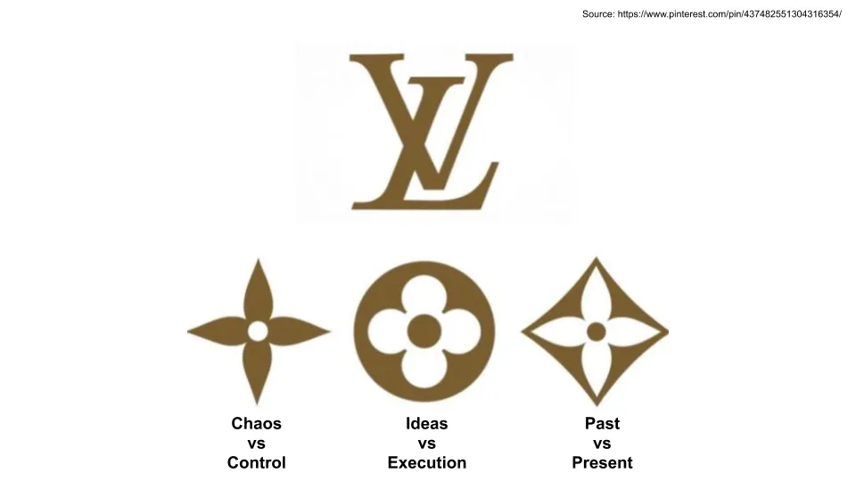

## テイクアウト

LVMHのCEOであるベルナール・アルノーは、スターブランドにはアイデアの創造性と実行のコントロールが必要であり、過去と現在の融合を組み合わせると信じています

## ラグジュアリーチェーンのトップ

[LVMH](https://en.wikipedia.org/wiki/LVMH 'LVMH')は私たちがよく知る多くのラグジュアリーブランドの親会社です。[Formed in 1987](https://www.thefashionlaw.com/lvmh-a-timeline-behind-the-building-of-a-conglomerate/ '1987')「ルイ・ヴィトン」と「モエ・エ・シャンドン&ヘネシー」の合併により、現在ではワイン、ファッション、ジュエリーなど70以上のブランドを展開しています。最も近い競合であるケリング[^1]と比べると、[LVMH makes more than 2x the amount of revenue.](https://www.themds.com/companies/kering-versus-lvmh-it-bags-and-influencers-vs-heritage-and-size.html 'rev')

そしてその頂点にいるのが[Bernard Arnault](https://en.wikipedia.org/wiki/Bernard_Arnault 'Bernard')で、彼は1990年からずっとグループのトップを務めている。それは彼にとって大きな成果を上げ、世界で最も裕福な人物の一人となった。

[Brett Bivens tweeted this HBR interview of Bernard a while back](https://twitter.com/brettbivens/status/1251505408960794624?s=20 'Brett')、そして今日はその記事をさらにいくつかの情報源で発展させたいと思います。バーナードが創造性をどのように捉えているのか、混沌を許容し、どこでコントロールを制限するかをよりよく理解できるでしょう。**

バーナールはしばしば初めてアメリカを訪れた時の話を語ります。彼はタクシー運転手にフランスについて何を知っているか尋ねました。[The driver couldn't name France's president, but could name Dior.](https://www.ft.com/content/21f64410-9117-11e9-aea1-2b1d33ac3271 'FT')それ以来、バーナールは常に「ブランドが持つ力」を覚えています。

バーナードは買い手によってブランドを築きました。[first takeover of the textile company Boussac](https://www.forbes.com/sites/susanadams/2019/10/31/the-100-billion-man-how-bernard-arnault-stitched-together-the-worlds-third-biggest-fortune-with-louis-vuitton-dior-and-77-other-brandsand-why-hes-not-done-yet/#22a97e114efb 'Boussac')から[the many deals done since taking over LVMH,](https://www.thefashionlaw.com/lvmh-a-timeline-behind-the-building-of-a-conglomerate/ 'LVMH')まで、バーナードは一連の買収を通じてLVMHを現在の地位に押し上げました。時には物議を醸す[^2]もあります。彼が「カシミヤの狼」として知られるのには理由があります。

しかし、フランス人は単なる金融家ではありません。ベルナールは創造性についても強い意見を持っており、主にファッション業界に応用されています。私の読書ではいくつかの繰り返し登場するテーマが見つかり、順に説明します。

1. 混沌 vs 支配
2. アイデアと実行の違い
3. 過去と現在の違い

### 1.デザインプロセスで創造性を妥協しないでください

バーナードはデザイナーに自由に仕事をさせ、アイデア段階で自由に創造性を発揮させることの重要性を理解しています。

> 私たちのビジネス全体は、アーティストやデザイナーに制限なく発明できる完全な自由を提供することに基づいています。

> 重要なのは、創造性は誕生時に妥協してはいけないということです。

これは、今日多くのテック企業が行っている[A/B testing](https://www.crazyegg.com/blog/ab-testing/ 'AB')とは対照的で、バーナードはそれが自分のビジネスには適切ではないと主張しています。

> 一部の会社は非常にマーケティング重視です。彼らは消費者を追いかけています。そしてその戦略で成功しています。彼らは人々が求めるものを試し、それを作り出します。しかし、そのアプローチはイノベーションとは全く関係ありません。人々が期待するものを提供して高額な価格を請求することはできませんし、そうしたブレイク作品は決して生まれません。人々が列を作って待つような商品は決してありません。私たちはそういったものを持っていますが、それはアーティストに自由を与えているからに過ぎません。

>、テストで明らかに失敗が示された場合は製品を発売しませんが、製品を改良するためにテストを使うこともありません。

これはスティーブ・ジョブズの言葉を思い起こさせます。「顧客は、[^3]に見せるまで自分が何を求めているのか分からない」と。ファッションが[the pace layer diagram](/writing/pace 'pace')の頂点に位置していることを思い出すなら、業界の変化の速さを考えればバーナードがそう考えるのも納得できます。彼は常に季節に合った新しいものを探しており、消費者の嗜好を支配すべきで、それに導かれるべきではありません。

しかし、バーナールは制作と運営のプロセスにおいて線引きをしています。ここでは、彼はできるだけ多くのアクションをコントロールしようとしています。アイデアは創造的であっても、実行では無理です:

> \[LVMH\]は創造的なプロセスを尊重し、その必要な混沌に耐えられるマネージャーしか雇わない。しかし、創造性を棚に並べる際には、混沌は追い払われる。同社は製造プロセスに厳格な規律を課している。

> 私たちの製品は信じられないほど高品質です。そうでなければなりません。しかし、生産は信じられないほど高い生産性を持つように組織されています。

そして彼は文字通り、言行通りに行動を起こします。[Bernard does weekly store visits, and will flag concerns to his brand CEOs:](https://www.forbes.com/sites/susanadams/2019/10/31/the-100-billion-man-how-bernard-arnault-stitched-together-the-worlds-third-biggest-fortune-with-louis-vuitton-dior-and-77-other-brandsand-why-hes-not-done-yet/#22a97e114efb 'Bernard')

>毎週土曜日、彼は小売店をうろつき、バッグの陳列を並べ替え、店員に提案をしています。

これが最初の二重性、すなわちコントロールと創造性です。ここでバーナードは、イノベーションが必要な初期段階で創造性を認め、後期の一貫性が必要な段階でコントロールしています。

### 2.機能的創造性を重視する

上記の部分で、LVMHが自分を表現する場を必要とする苦悩し誤解されたアーティストのための避難所だと誤解しないでください。バーナードはアーティストに自由を与えつつも、創造性はLVMHにとって目的ではないとも信じています。バーナードは今もビジネスマンであり、自分の作品を売ってほしいと思っています。

彼は、最高のクリエイティブな人々は、自分の作品を博物館の展示品としてだけでなく、身につけてほしいと信じています。

> 最も成功したクリエイティブな人たちは、自分の作品を街で見たいと思っています。彼らはただ発明するためだけに発明するわけではありません。確かに、彼らは多くのワクワクするアイデアを思いつき、その多くは衝撃的です。最初は完全に狂っているように見えます。しかし、LVMHを成功に導く真のアーティストたちは、プロセスがそこで終わることを望んでいません。彼らは人々に自分のドレスを着てほしい、香水をスプレーしてほしい、自分がデザインしたスーツケースを持ち歩いてほしいのです。

>成長は高い欲求の関数です。顧客はその製品を欲しがらなければなりません

バーナードは創造性を機能させるのが自分の仕事であり、狂ったアイデアを狂った熱い商品に変えています:

> 私が楽しんでいるのは、世界中の創造性をビジネスの現実に変えようとすることです。そのためには、イノベーターやデザイナーとつながる必要がありますが、同時に彼らのアイデアを実用的で具体的なものにする必要があります

> 創造性 - はい、しかし人々が好んで使える形で実行されること

そしてこれは、実行が重要だという彼の信念に基づいています。

> アイデアは必要ですが、アイデアは20%です。実行は80%です。

これが第二の二元性、すなわちアイデアと実行の違いです。バーナードはアイデアの重要性を明確に認識しています。上記の創造的自由に関する話がそれを明確に示しています。さらに、バーナードはLVMHがアートを作っているものの、アート業界には属していないことも認識しています。売れないアートは歓迎されません。

### 3.伝統と現代性を融合させる

バーナードはまた、創造性には過去を参照しつつ未来を見据える必要があると信じています。彼の見解では、最良の製品は両方の側面を同時に訴えることができるものです。

>LVMHのプロセスには一つの目標があります:スターブランドです。アルノーによれば、スターブランドは「時代を語りかけ」つつも非常に現代的な感覚を持つ製品を作った企業にのみ生まれます。そのような製品は速く、そして激しく売れ、利益を上げています。

> 私たちの最高のブランドの製品を見るとき、それは時代を超えているものであり、同時に極めて現代的な要素も含めなければなりません。

> では、スターブランドの主な特徴は遺産なのでしょうか?私は4つの特徴が必要だと言いたいです。スターブランドは時代を超え、現代的で、急速に成長し、非常に収益性の高い[^4]

その結果、収益の大部分はクラシック製品から生まれており、LVMHは新製品の市場投入頻度を調整しています。これはやや矛盾しているように思えますし、多くの消費者向け企業、例えば飲料会社が常に新フレーバーを出しながらも元のフレーバーから収益を上げているのと似ているのかもしれません。彼の創造性が重要だという考えと、この考えをうまく結びつけるのに苦労しています。おそらく新製品を試す機会が非常に少ないからでしょう?

> 常に新製品ばかりを出し続けることで、会社全体を危険にさらすことはありません。実際、毎年、私たちのビジネスのわずか15%しか新しい製品からは得られません。残りは伝統的で実績のある製品、つまりクラシックな製品から来ています。

彼が伝統を重視するのは、上記の統計と、ブランドをゼロから立ち上げようとした経験の両方から来ているのでしょう。

>最初は「クリスチャン・ラクロワという天才がいる」と思っていましたが、天才だけでは成功には不十分だと学びました。正直なところ、偉大な才能でさえブランドをゼロから立ち上げられないと知って、少しショックでした。ブランドには伝統が必要です。近道はありません。

だからこそ、買収時に人材を残そうとするのです。これは驚くべきことです。なぜなら、買収後のコスト削減の大きな理由の一つが、買収したばかりの会社から人を解雇することだからです。

>品質は、非常に献身的な人材を採用し、長期間維持することからも生まれます。私たちはブランドの人材、特に職人たちを残そうと努めています。ほとんどの企業は新しいブランドを買収する際に一掃します。しかし私たちはそうしません。なぜなら、それが品質を大きく損なうことに気づいたからです。一掃すると、ブランドを最も尊重し、その持続性、時代を超えた本物らしさに貢献している人たちを追い出すことになります。

これが第三の二元性、すなわち過去と現在です。バーナードは、消費者は過去を見つめつも、現在に生きたいと考えています。

## 長期的なブランド構築

私たちは、バーナードがブランド構築の経験から生じた3つの二面性について触れました。創造性とコントロール、アイデアの実行、伝統と現代性の融合を許すことで、バーナードはLVMHを長期的に築いていると考えています。

> [When we discuss a brand, I always tell them my real concern is what the brand will be in five or ten years, not the profitability in the next six months.](https://www.forbes.com/sites/luisakroll/2017/09/26/business-icon-bernard-arnault-reveals-his-most-important-mentor-biggest-mistake-in-qa/#4e8836af2ccc 'Forbes')

そして、少なくともLVMHの株価や市場シェアから見れば、これまでのところ彼にはうまくいっています。

彼のフレームワークのどれだけが他のビジネスにも当てはまるのでしょうか?私は主に創造性の重視に賛成ですが、同時にオペレーションの卓越性も重視しています。ただ、最近の[why companies are bad at innovating](/writing/turtle 'turtle')指摘によると、多くの企業がより多くの創造性を受け入れることに伴う変動性を受け入れるかどうかはわかりません。過去と現在の二重性が簡単に実装できるのかはわかりません。単なる見せかけのマーケティングキャンペーン以外に。

バーナードが成し遂げてきたことを考えれば、引退の準備ができていると思うだろう。だが、彼は帝国の築き上げを終えていない。今でもバーナードは[it's day 1:](https://www.forbes.com/sites/quora/2017/04/21/what-is-jeff-bezos-day-1-philosophy/#1867a2be1052 'Day')

> まだ小さい。まだ始まったばかりだ。とても楽しい。私たちはナンバーワンだが、もっと進める。

## 出典

1. [HBR interview](https://hbr.org/2001/10/the-perfect-paradox-of-star-brands-an-interview-with-bernard-arnault-of-lvmh 'HBR')
2. [FT interview](https://www.ft.com/content/21f64410-9117-11e9-aea1-2b1d33ac3271 'FT')
3. [Forbes interview](https://www.forbes.com/sites/luisakroll/2017/09/26/business-icon-bernard-arnault-reveals-his-most-important-mentor-biggest-mistake-in-qa/#4e8836af2ccc 'Forbes')
4. [NYT interview](https://www.nytimes.com/2019/11/25/fashion/bernard-arnault-tiffany-lvmh.html 'NYT')
5. [Reuters coverage of LVMH/Tiffany deal](https://www.reuters.com/article/us-tiffany-m-a-lvmh-deal/how-lvmhs-whirlwind-courtship-sealed-16-billion-tiffany-deal-idUSKBN1XZ2F7 'LVMH')

[^1]:[Kering owns Gucci, Saint Laurent, Bottega Veneta, Balenciaga, Alexander McQueen, Brioni, and more](https://www.kering.com/en/talent/who-we-are/our-houses/ 'Kering')

[^2]:彼の[firing of workers at Boussac](https://www.nytimes.com/1989/12/17/magazine/a-luxury-fight-to-the-finish.html 'Bossac')、[ouster of LVMH leadership](https://www.forbes.com/sites/susanadams/2019/10/31/the-100-billion-man-how-bernard-arnault-stitched-together-the-worlds-third-biggest-fortune-with-louis-vuitton-dior-and-77-other-brandsand-why-hes-not-done-yet/#22a97e114efb 'LVMH')、そしてヘルメスに対する敵対的な入札は、多くの批判を浴びています。

[^3]:誤解されていると言われている[this article](https://www.businessinsider.com/steve-jobs-quote-misunderstood-katie-dill-2019-4 'katie')

[^4]:バーナードはまた、時には説明のつかない何かがあるとも言っています。「多くのブランドはスターになる可能性を持っているのに、管理が不十分です。それは彼らにとって残念なことです。しかし、可能な限りよく管理されているブランドはもっと多く存在し、彼らは決してスターにはなれません。世界中で成功することは決してありません。彼らには説明できない何か――あの魔法のようなものがありません。」
