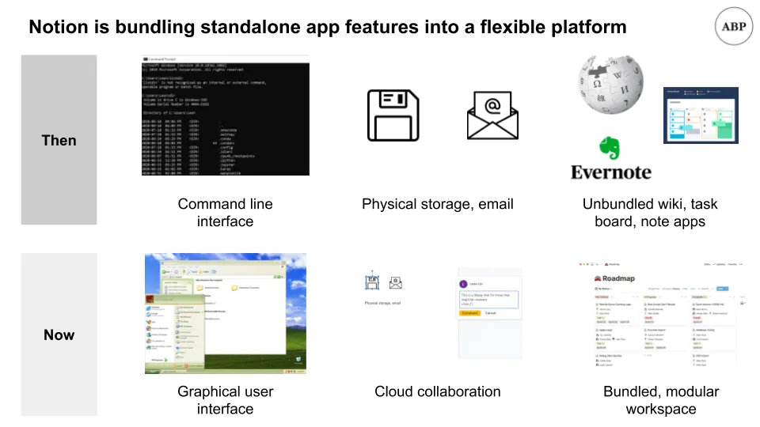
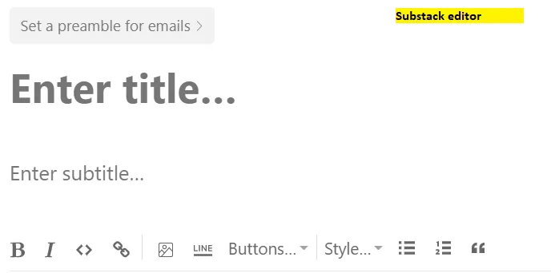
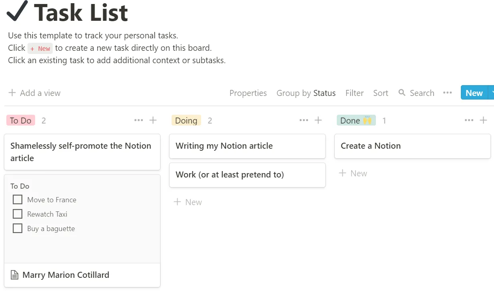
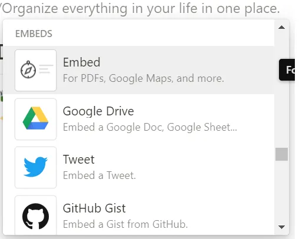

## テイクアウト

1. Notionは、情報整理と協働における視覚的なアプローチです
2. Notionの最大の強みは、柔軟なフォーム、視覚的なビルド、テンプレートのオプションです
3. Notionの最大の問題はおそらく品質に関するものであり、それらを解決するためのマーケティングや製品アイデアをいくつか提示します

## Notionの職場向けワークスペース

映画[Inception by Christopher Nolan,](https://en.wikipedia.org/wiki/Inception 'Inception')では、主人公たちが夢の重層をさまよいながら、ある課題を遂行します。その層内での彼らの行動は、その層自体だけでなく、その上や下の層にも影響を与えます。時にはその層で起きていることに興味を持ち、時には他の層に影響を与えたいと考えます。

その枠組みを心に留めておいてほしい――**層の中の相互作用、そして層間の相互作用の** すぐに[^1]に戻ってきます。

最近では、Notion、Coda、Roamのような生産性向上のスタートアップが、規模に対して高い評価額でラウンドを調達しています。[The hustle has Notion at a $2bn valuation, Coda at $600mm, and Roam at $200mm](https://thehustle.co/09142020-roam-research/ 'Hustle')。これらの企業[^2]がまだ若いことを考えると、これらの企業の可能性に対する楽観的なベンチャー評価です。

今日は[Notion](https://www.notion.so/ 'Notion')をもっと詳しく見ていきたいと思います。[^3]について詳しく見ていきます。

1. Notionの目的とは何か
2. サンプル特徴のウォークスルー
3. Notionチームへの提案

こうして、これらのスタートアップがなぜ存在し、どのような姿をしているのか、そして将来どのように変わるのかのイメージがつくでしょう。

始めましょう。

## 1.Notionは情報の組織化とコラボレーションにおける視覚的なアプローチです

Notionをよりよく理解するためには、情報との相互作用の歴史やコンピューティングの進化についての文脈をもっと理解する必要があります。

人間を大まかに機能として考えることができます。私たちはデータを入力として受け取り、処理し、出力として応答を出します。その出力データは、それを処理し反応する他の人々に影響を与えます。

かつてはデータを物理的に保存しており、真実を伝えるための巻物を手に入れるには図書館や専門家に直接行かなければ[how likely Jack Sparrow would have visited Singapore](https://www.reddit.com/r/AskHistorians/comments/gd7cww/in_pirates_of_carribbean_jack_sparrow_says_youve/ 'Reddit') [^4]。

コンピューターの普及により、データをデジタル保存する方向に移行し、複数の共同作業者が同時に文書に取り組めるようになりました。**データや人物の物理的な場所に縛られることなく、グローバルな規模で情報と関わる機会が生まれました。** 以前は情報転送の速さからウガンダの誰かと仕事をする可能性はほとんどありませんでした。今では、一緒に作業できるだけでなく、同じ文書を同時に扱うことも可能です。

しかし、現在の働き方を可能にするためには考え方、技術、デザインの変化が必要だったため、ここに至るまでには時間がかかりました。

大きな変更点の一つが**[graphical user interface](https://www.youtube.com/watch?time_continue=39&v=BFlop4sP8Os&feature=emb_title 'GUI')。それ以前は、以下のものと非常によく似たもの[people were interacting with computers via a command line interface,](https://www.wired.com/1997/12/web-101-a-history-of-the-gui/#:~:text=In%201979%2C%20the%20Xerox%20Palo,first%20prototype%20for%20a%20GUI.&text=When%20Jobs%20saw%20this%20prototype,expensive%3B%20no%20one%20bought%20it. 'CLI')。

ご覧の通り、コンピュータを扱うには最も直感的な方法ではありません。そのミスは教訓の機会として残したと言えますが、実際のところ、正しい構文を忘れてしまいました。コマンドラインのやり取りは強力かもしれませんが、多くのユーザーにとって参入障壁は高いです。視覚的な体験を中心に使い方を再設計することで、コンピューティングを大衆市場で成長させる[Apple achieved a breakthrough](https://en.wikipedia.org/wiki/History_of_the_graphical_user_interface 'Apple')[^5]。もしコマンドラインだけで作業していたら、コンピューティングの進歩は大きく遅れていたでしょう。

二つ目の大きな変化はインターネットで、二つの波に分かれて登場しました。それ以前は、フロッピーディスクのような物理メディアに作品を保存していました[^6]。何かを共有したい場合、一時的な記憶を物理的に相手に運ぶ必要がありました。

**メールはハードウェアの必要性を徐々になくし、データ転送の利便性と速度を向上させることで、その状況を変えました。提案書の最終編集版を1本のUSBメモリで送る代わりに、上司は脚注のサイズのフォーマットに関するコメントを10通のリンクなしメールで送ることができます。

過去10年間で、インターネットの帯域幅の向上により、私たちの**クラウドへの移行も可能になりました。**メールのやり取りの代わりに、全員がリアルタイムで同じドキュメントで協力できるようになり、利便性がさらに高まり、バージョン管理の問題も軽減されました。今ではパジャマ姿で[Dark](<https://en.wikipedia.org/wiki/Dark_(TV_series)> 'Dark')を見ながら、Googleドキュメントのコメントに半ば気のない返信をすることもできるようになりました。もちろん、私が返信するつもりはありませんが。

インターネットとクラウドは、今日私たちが目にするすべての[Software as a Service (SaaS)](https://www.bmc.com/blogs/saas-vs-paas-vs-iaas-whats-the-difference-and-how-to-choose/ 'SaaS')ビジネスの成長の基盤を提供しました。他者がインフラ(IaaS)やプラットフォーム(PaaS)を提供すると当然のことと考えることで、ソフトウェア企業は特定のセグメントのニーズに応えることに集中できます。

[low cost of capital](/writing/capital 'low')、高い潜在利益率、そして安定した収益基盤を考えれば、多くのソフトウェア企業がかつて物理的だった機能をデジタル化しようとするのも無理はありません。会社のウィキがコンペンディウムに代わり、カンバンボードが付箋に代わり、ノートアプリがジャーナルに代わります。私たちの多くは仕事をしながら少なくとも10以上の異なるソフトウェアプラットフォームを扱わなければなりません。

ここでNotionの出番です。**[Notion wants to be your all-in-one workspace,](https://www.notion.so/product 'Notion')**あなたが執筆、計画、整理を行う主な場所です。先ほど挙げたすべての別々のソフトウェアですか?Notionはそれらすべてをバンドルし、一貫したユーザー体験を提供しつつ、ほとんどのタスクに柔軟に対応したいと考えています。

会社のウィキが欲しいですか?Notionで作成できます。

タスクボードが欲しいですか?Notionで作成できます。

メモ取りページ欲しい?イメージはわかるだろう。

もし私が作り話だと思っているなら、[here's a quote from cofounder Ivan Zhou:](https://www.invisionapp.com/inside-design/ivan-zhou-notion-interview/ 'ivan')

>、私たちはMicrosoft Officeという一つの製品から、あまりにも多くのSaaS製品へと振り子のように揺れ動いています。そして今、その振り子は再びより束ねられたものへと揺れています。私はNotionがその波に乗ってほしいと思っています。それは、あの5つの異なるSaaSツールと同じくらい強力な製品になれます。

この市場はすでに大きく実現可能な市場ですが、Notionの可能性とさらに成長の可能性を推測しましょう。Inceptionのアナロジーを最初から持ち込み、企業におけるデータレイヤーの存在に当てはめる時です。

企業はデータを収集し、保存しなければなりません。これを**データストレージ層**と呼び、ここではインフラ関連の企業をまとめて簡略化します。例えば、あなたが小売業者の場合、取引記録を保存して後で注文を処理できるようにし、Amazon Web Services(AWS)を使って[^7]対応します。

企業は収集したデータを分析しなければなりません。これを**データ分析層**と呼び、計算を行うためにデータベースと連携できるすべてのツールをまとめます。例えば、今月の顧客数を調べたい場合は、データベースからSQLでその情報を照会し、さらに調査を精査するためにExcelを使うとよいでしょう。

企業もその分析結果を見る必要があります。これを**データ可視化層**と呼び、プレゼンテーション関連のソフトウェアをまとめます。例えば、Googleスライドを使って、そのデータをグラフに表示し、顧客が週比で50%成長したことを示すことができます。

その上にもう一つの主要なレイヤーがあります。これを**データ同期層**と呼びます。ここで情報の調整が行われます。もしあなたのチームだけがビジネスの状況を把握しているなら意味がありません。だからこそ、その情報を伝え、全員が同じ認識を持つ方法が必要です。例えば、会社全体のSlackメッセージで最近の財務指標のまとめを送ることができます。

これらの層を通じてデータが会社内を流れることで、**より視覚的かつ可視化されるようになり、より多くの人が関わることができるようになります。データ同期層のツールは、最も「エンドユーザー向け」であるため、通常はより視覚的なデザインアプローチを採用しており、一般の人でも理解しやすいです。例えば、メールは簡単ですが、[hadoop](https://en.wikipedia.org/wiki/Apache_Hadoop 'hadoop')難しいです。

上記のフレームワークは、Notionの付加価値がどこにあるのかをより明確に示してくれます。**Notionは現在データ同期レイヤーに位置し、途中でデータ可視化レイヤーに移行しています。** 以前、これは大きな市場だと主張していたので、拡大の可能性を探る前にその理由を説明しましょう。

データ同期層は、社内の小規模グループから外部ステークホルダーまで、あらゆる規模で**情報調整の問題**を解決しようとしています。目的は、全員が同じ方向にいることを確実にすることです。メッセージングアプリを持つことでチームが次のステップについて合意でき、公開ウェブサイトを持つことで顧客があなたのビジネスに関する情報を得られます。Slackはメッセージングに特化した150億ドル規模の規模キャップ企業です。Wixは130億ドル規模の規模キャップ企業でウェブサイト構築を行っています。ウィキ、タスクボード、ノート取りなどで他にも企業を挙げられますが、それだけで数十億ドル規模のチャンスがあることを示すのに十分だと思います。

データ可視化については[Tableau was bought for $15bn](https://techcrunch.com/2019/06/10/salesforce-is-buying-data-visualization-company-tableau-for-15-7b-in-all-stock-deal/ 'Tableau')なので、ここにも数十億ドルのチャンスがあると言えるでしょう。ただし、Notionはこの層の半分に過ぎないと考えています。なぜなら、現在の機能は同等の競合他社と十分に並んでいないからです。これは後のウォークスルーで示す通りです。

上記のレイヤーについて話す際に、OfficeとG Suiteを省いたことに気づいた方もいるかもしれません。それは、OfficeやG Suiteの大多数のユーザーにとって、データに対して計算能力を持つことが仕事に必要だと考えているからです。したがって、データ分析層の機能を習得することは、これらのツールが現在のように労働力に根付くために不可欠です。Notionのこの分野でのパフォーマンスは低いですが、それは拡張の可能性が高いことを意味します。

それはどれほど大きな市場を切り開くのでしょうか?

マイクロソフトはOffice収益を「生産性およびビジネスプロセス」セグメントの一部として報告しており、Office Commercial、Office Consumer、その他の小規模事業をまとめています。[recent annual report](https://www.microsoft.com/investor/reports/ar19/index.html 'ar')では、セグメント全体で410億ドルの収益を上げ、営業利益は160億ドル、マージンは39%でした。もちろんこれはOfficeの収益すべてではありませんが、おそらく最大のサブセグメント[^8]でしょう。

GoogleはG Suiteの収益を「Google Cloud」セグメントの一部として報告しており、Google Cloudや他のエンタープライズサービスもこの項目に含まれています。最近の彼らの[10K](https://abc.xyz/investor/static/pdf/20200204_alphabet_10K.pdf?cache=cdd6dbf 'Google')では、このセグメントで90億ドルと表示されています。Google Cloudはおそらく収益の大部分を占めており、G Suiteは10億ドル以上あると思われます。

明らかに、「Word、PowerPoint、Excel」市場は収益で数十億規模であり、おそらくそれ以上に大きいでしょう。市場の規模こそが、Notionに時間をかけてより多くの分析能力を持たせるべきだと主張する理由です。できるだけ多くの顧客のユースケースをカバーしたいのです。

例えば、仕事の始まりにまずタスクボードを確認し、提案書のコメントを確認し、さらに同僚に割り当てる新しいタスクを一般案内ページに更新したと想像してみてください。**これらはすべてNotionで今やできます。**

午後には顧客の離脱データを抽出し、必要なものを絞り込み、それをグラフにまとめてチームと共有します。基本的には、これは今のNotionではできませんが、もしできたらどうでしょう?その時はほぼすべての時間を一つのアプリに集中させることができます。Notionが大きなヒットとなる一つの方法は、OfficeやG Suiteを単一のソフトウェアに置き換えることです。もし私がMicrosoftやGoogleの企業開発に就いていたら、Notionを注意深く観察し、投資か買収を検討しているでしょう。

Inceptionの例えを振り返ると、Notionが現在のレイヤー内でどれだけのスペースを占めるかだけでなく、他のレイヤーとどのように相互作用したり、さらには乗っ取ったりするのかも関心があります。もしデータ分析、可視化、同期がすべてNotionで実現できれば、今使っている多くのソフトウェアは不要になるでしょう。

ここでも比較できる[pace layer](/writing/pace 'pace')があるでしょう。上層で速い視覚層がより速く動き、注意のサイクルを支配しているのです。

この記事を考えていたとき、私は最初はNotionの財務モデルを作ろうと思っていました[like the one I did for newsletters](/writing/community 'news')。しかし、データが不足しているため、あまりにも多くの仮定を立ててしまうでしょう。すでに収益率[$30mm](https://www.forbes.com/sites/davidjeans/2020/04/01/buzzy-work-app-notion-hits-2-billion-valuation/#15da831578ec '30')で利益を上げていると読んだことがありますし、40%の利益率でその10倍の収益を上げつつ、二桁成長を続ける可能性も見込まれています。さらなるデータが出るまで待つ必要がありますが、[^9]人々が興奮しているのも当然です。

以上でNotionの評価の正当化は十分で、後回はターゲット市場を増やすためのもっと大胆なアイデアに戻ります。まずは製品の特徴の概要を述べましょう。

## 2.Notionの最大の強みは柔軟なフォーム、視覚的なビルド、テンプレートのオプションです

Notionへのサインインは簡単ですが、始めるのは難しく、この問題については後ほど提案セクションで触れます。Googleアカウントでサインインし、自分用かチーム用かを選べます。

その先には「始め方」ページがあり、中央にNotionでの作業のコツが記載されています。左側には、やることリストや読書リストなどのプリセットテンプレートから始めることができます。

**Notionの基本単位はブロックです。**Excelのセルが作業の基本であるかを考えてみてください。Notionのブロックもそれに似ていますが、はるかに多くの機能が備えられています。ブロックは表示内容や表示方法の両方をカスタマイズ可能です。覚えておくべき重要なのは、Notionは視覚的でデザイン重視のアプリケーションであるので、ブロックを配置したり必要に応じて変更したりできるということです。

ブロックをやることリスト、カレンダー、テーブルなど多くのものに変換できます。これら自体がブロックなので、作成したリンクを元のページで移動させることができます。

**一つのブロックやページを別のブロックの下に入れ子にでき、**すべての作品をリンクしたネットワークを作りやすくします。マインドマップや関わるすべてのものをつなげるのが好きな方には、このデザインスタイルがぴったりです。

ブロックから独立したページを作成できる機能以外に、私が気に入ったのは**トグルブロック**です。Excel[^10]で行のグループ化やアングルーピングが好きな方には、この要約表示と詳細ビュー表示の機能が気に入るでしょう。

Notionには、作成したページと視覚的にインタラクションできるモジュールブロックがあることについて話しました。過去には、ウェブページの見た目を変えたい場合、ウェブエディターが提供する機能に制限されていました。例えば、Substackはテキストのフォーマット設定に制限があります。それ以上の設定を得るには、自分でHTML/JavaScript/CSSをコーディングする必要があります。

Notionを使えば、膨大な機能性と柔軟性が得られ、非フロントエンドのプログラマーでもより多くの作り上げができるようになります。**これにより、ユーザーは自分が取り組んだものを共有することに誇りを持つため、豊富なテンプレートの選択肢も生まれました。** 例えば、学校に戻る場合、既存のテンプレートを使ってすべてのコースワークを計画できます。

**Notionテンプレートは現在大きな強みであると同時に、潜在的な弱点でもあります。**まず強みについて、そして提案セクションで弱点について触れます。テンプレートを持つ強みは、誰かが何を望むかを決めてテンプレートを選べば、すぐに慣れられることです。なぜなら、必要な機能の多くはすでに作成されているからです。例えば、タスクボードを作りたいなら、すでにテンプレートがあるので、ページやセクションを一から作る必要はありません。

以下にNotionのタスクリストテンプレートがあります:

そして自分のタスクを素早く追加できます。タスク内でネストされたサブタスクを作成でき、整理に役立ちます。

以上でNotionの概要は終わりで、Notionで何を作れるかについては[youtube page](https://www.youtube.com/c/Notion/featured 'youtube')でさらにご覧いただけます。次にNotionの問題点について触れ、最後に会社へのいくつかの大きな提案で締めくくりたいと思います。

## 3.Notionは選択品質の問題に直面する可能性が高く、それを防ぐためにエコシステムに投資すべきです

ここでは、私がNotionで感じる問題点をいくつか挙げます。大きな戦略から小さなデザインの細かい指摘まで幅広く。

### 問題1:テンプレートは導入や始める際の障壁でもあります

テンプレートがNotionの強みなら、テンプレートが多ければ多いほど良いでしょう。すでに多くの人が自分でテンプレートを宣伝し、中には料金を取る人もいます。Notionがここでフライホイールを始めたと仮定しましょう。そうすれば[the quantity of templates is not going to be a problem](https://www.notion.so/Notion-Template-Gallery-181e961aeb5c4ee6915307c0dfd5156d#90f6a0e426e1403093bb2a54ea33140d 'Notion')

**その場合、問題になるのはテンプレートの選択です。** これはウォークスルーの冒頭で指摘した「始め方の問題」とも関係しています。今のところ、人々は1) 自分が何を求めているのかを見つけ、2) 自分のニーズに合った適切なテンプレートを見つける必要があります。現状のNotionでは、どちらもまだ難しく、利用を妨げるでしょう。

**まず、何が可能かを理解すること自体が一つの課題です。** Notionを使って自分の使い方を計画し、最適なデザインを探そうとしながらも実際の作業をせずに生産性の悪循環に陥る人がいるのではないかと私は思います。

**後者については、利用可能なテンプレートの品質をフィルタリングする作業も課題です。** 新規ユーザーにとって、あまり文脈がない良い選択肢を見つけるのは難しいです。選択が多すぎる方が少なすぎるよりは問題ですが、それには何らかのキュレーションが必要になるでしょう。[You're already seeing unofficial template directories](https://templates.notion.vip/ 'vip')これを証明しています。

また興味深いのは、私たちの多くが現在のWordやExcel、PowerPointのツールでテンプレートをあまり多く使っていないことです。選択肢が少ないわけではありません。これらのツールには標準テンプレートがあります。むしろ、ゼロから始める柔軟性の方が好みだと気づきました。時間が経つにつれて、Notionに慣れるにつれてテンプレートの使用量が減り、自分でページを作成する人が増えるかもしれません。

これはアートのように、最初は参考資料(テンプレート)から描くのです。スキルが上がったら、自分で構図を作り始めたいと思います。Notionはその全過程でユースケースをサポートできる必要があります。

### 問題2:ビジュアルデザインは、人々が「理解する」前に実際にそれを見なければならない

私たちはすでにNotionが視覚的なツールであることを主張しています。つまり、説明するのではなく、**人々に見せて初めて可能性を理解してもらう必要があるということです。もしこの記事がビジュアルなしで書かれていたらどうでしょうか;おそらくNotionが何についてのものか、あなたは今でも全く分からなかったでしょう。

コミュニケーションの面では、画像は最低限必要であり、GIFや動画はプレーンテキストよりはるかに優れています。私はどうかわかりませんが、私は同じ問題について複数の動画を見なければならないことに苛立ちを感じています。単に読むのと比べて。この問題は致命的な問題ではありませんが、大衆への普及を遅らせるでしょう。

### 問題3:コアデータ分析機能の欠如

以前にも言いましたが、Notionは機能面でExcelには及びません。[RadReads](https://radreads.co/notion-formulas/ 'Rad')が指摘しているように、Notionはデータベースのような役割を果たします。Excelを意図しておらず、セクション全体の関数ビューしか提供しません。例えば、2つのセルだけで計算することはできず、列全体に適用しなければなりません[^11]

上の画像で私が2つの数字を加えようとしているところを見ると、その数式がいかに洗練されていないかもわかります。Notionの数式は、関数が長い線の変数を入力として受け取るプログラミングの考え方から生まれたように見えます。これはNotionのビジュアルデザインアプローチとはまったく対照的で、私には驚きでした。

ただし、Excelの機能に近づくのは非常に難しいと言っておきます。Notionチームがこれを優先するとは思いませんが、先ほどのセクションで述べられた点からも、彼らが持つ大きなチャンスがあることがわかります。もしデータ分析、プレゼンテーション、コラボレーションを同じツール内で行えるなら、それは非常に大きなことです。サードパーティが[chart plugins](https://www.notion.vip/charts/ 'charts')を作成しているという事実は、市場が存在することを示しています。

この問題はまた、Notionが成長するにつれて、よりカジュアルなユーザーを対象にすべきか、それともパワーユーザーにサービスを提供すべきかというトレードオフを示しています。パワーユーザーはより高い料金を払う意欲がありますが、より多くのカジュアルユーザーを支払う必要があります。

### その他の問題

以下は細かい点なので、まとめて挙げます。その名前は[used to have a feature roadmap](https://twitter.com/NotionHQ/status/766137732980613120?s=20 'Road')ですが、今は消えてしまったので、そのままそう思います[they're prioritising their top feature requests](https://www.notion.so/How-do-I-request-features-19830881751e4f68bcd674212c6c317c 'feature')

**検索が遅い:** なぜか検索機能が本当に遅いです。何が原因かわかりませんが、「接続ネットワーク」設計全体に足を引っ張ります

**無数のクリック:**これは私が新規ユーザーで、欲しいものの多くをクリックしなければならないことに気づいたからかもしれません。ショートカットやキーボード操作がもっとあれば嬉しいです。

**変な空白:** これは個人的なデザインの好みです。Notionのすべてのページやブロックは、ブロックの左右に十分な空白があります。ユーザーはそこをクリックしても何も起こらないと考えるべきです。結局は空なので。代わりに、ブロックの選択範囲は視覚領域を超えて広がっているため、下のGIF通りブロックをクリックしてしまいます。

いくつかの問題を扱いましたので、いくつかのアイデアを見てみましょう。これらを、より実践的なコミュニティやマーケティングのアイデアと、より突飛なプロダクトのアイデアに分けます。

### マーケティングアイデア1:テンプレートの品質に投資する

もしテンプレートが今Notionにとって重要なら、企業はその品質を確保するべきです。いくつかの戦術:

- 評価システムを持つこと、ただし多くの注意点があります
- [Kaggle](https://www.kaggle.com/ 'Kaggle')や[ProductHunt](https://www.producthunt.com/ 'PH')のようなテンプレートコンペティションを開催し、トップテンプレートに報酬を与える
- 最高のテンプレートをオンラインで購入し、誰でも利用できるようにする

### マーケティングアイデア2:コミュニティコンテンツに投資する

Notionは主に口コミで広まりましたが、いくつかの記事を見る限り、マーケティングもすでに同様の活動をしているのではないかと思います。とはいえ、テンプレート作成やイベントの企画、Notionについて書く人々に引き続き投資するのは検討する価値があります。

もしNotionがアドボケリストに投資したりスポンサーしたりできれば、比較的少ないコストで多くのリーチを得られます。言い換えれば、もし人々が他の人にNotionの使い方を教えて生計を立てられる状況になれば、それはプロダクトマーケットフィットがあると確信できるということです。

### マーケティングアイデア3:トレーニングへの投資

AWS認定、SQLトレーニング、Excelでの財務モデル構築方法を基盤とした業界も存在します。同様に、Notionは製品の専門家になるための認定資格の創設を始めるべきです。彼らは認定資格に加えて、教育、セミナー、オフィスアワーなどを活用できます。これらの取り組みの一部はすでにコミュニティによって非公式に行われており、「Notionプロフェッショナル」の職務仕様を拡大するために、Notionがさらに資金と支援を提供することは理にかなっています。最終目標としては、企業がNotionのセットアップを管理する専門の社内チャンピオンを採用し始めることも考えられます。

さて、もっと突飛なアイデアに移ります。

### プロダクトアイデア1:データ分析

Excelについて説明した際にはすでに触れました。

もっと一般的に言えば、もし私がNotionでプロダクトを運営していたら、組み込み可能なすべての機能を調べます。それらをNotionの失敗点と、拡大の機会の両方と考えています。それをグランドビジョンのプロダクトロードマップとして使うことも可能です。例えば、Google Driveのすべての機能をいつか複製できるかもしれません。これには何年もかかりますが、最終的な目標はNotionを離れる必要がなくなることです。

### プロダクトアイデア2:メール

手紙を送るという物理的な概念のため、郵便物が行き来しなければならないという概念に縛られてきました。すべてのコミュニケーションがこの方法で行われる必要はありません。もしNotionがメールやチャットの必要性を減らし、それらをすべてNotionのページにまとめられるなら、それは仕事の習慣に大きな変化をもたらし、良い方向に進むことを願っています。

### プロダクトアイデア3:さらにコードを増やす

Notionは現在ビジュアルベースですが、SQLデータプルやMachine Learning Jupyter Labsなど、書かれたコードの世界は広大です。こうした機能を統合すれば、製品の利用範囲は大きく広がるでしょう。

データレイヤーフレームワークに戻ると、ストレージ以外のデータフローのあらゆる部分に関わるものを提供できれば、何十億ものユーザーがアクセスできる高可視性と高いタッチを持つ製品が手に入ります。このようなSaaS製品をクラウド上でホストすれば、OSすら必要ありません。はい、それはMicrosoftの460億ドルの個人コンピューティング収益やAppleの市場シェアに対する脅威になる可能性があることを意味します。もし仕事で使うツールにアクセスするのにインターネットブラウザだけで済むなら、OS層全体が商品化されてしまいます。

## アイデアのアイデア;アイデアのアイデア

Notionは、私たちの働き方を再考するための視覚的でデザインベースのアプローチです。現在は主に組織の「データ同期」層に位置し、「データ可視化」層で進展を遂げています。いつかは「データ分析」層にも移行し、私たちは一日中Notion [^12]だけに専念するかもしれません。

Notionのトレードオフについて考えるのも興味深いです。企業は成長、収益性、品質の三つ難しさに直面します。Notionの場合、すでに収益性に達しているとされており、早期採用の強さから今後3年間は成長が問題になる可能性は低いでしょう。**レートを決定するステップは製品の品質**であり、これがNotionの機能が競合他社より遅い理由を説明できます。

Notionは何を作れるのか、どのようなカスタマイズが可能で、最終デザインにどれだけコントロールできるのか?これらの問いの限界を押し広げることで、Notionの働き方が私たちの生活のより多くの領域に浸透していくことが可能になります。

Notionは現在、情報共有のコスト削減を目指しており、将来的にはもっと多くのことができる可能性があります。まずは、私たちの働き方が変わるという考えを推進することから始めています。

『インセプション』のアイデアについての引用があります:

> 最もしぶりのある寄生虫は何だ?細菌?ウイルス?腸の寄生虫?あるアイデアだ。しなやかさがある...非常に感染力がある。一度アイデアが脳に根付くと、ほぼ根絶不可能だ。完全に形作られ、完全に理解され、定着したアイデア;どこかの中に。

それと、Notionがどうなるかというアイデアをお伝えします。それが定着するか見てみましょう。

Notionのリソースについては、[Hadar Dor](http://hadardor.com/ 'Hadar')、[Ryan Rodenbaugh (who also writes an Asia tech newsletter)](https://eastmeetswest.substack.com/ 'Ryan')、[Valentin Hernandez](https://www.linkedin.com/in/valentinhernandez/ 'Valentin')、[Nathan Lui](http://nathanlui.com/ 'Nathan')、[Theodore Wu](https://www.linkedin.com/in/theo/ 'Theo')、[Nadia Eldeib](https://twitter.com/nseldeib 'Nadia')_Credit[Packy McCormick for corrections](https://notboring.substack.com/ 'packy')。はい、[I’ve recreated this article in Notion as well](https://www.notion.so/Inception-Nolan-and-Notion-3478471a315945a9a0f87a79974714e1 'Notion')_

[^1]:正直に言うと、この例えを挙げる理由の半分はマリオン・コティヤールのポスターを挿入するためだけど、後でわかるだろうけど、この例えは実は意味があるんだ。少なくとも私にはね。

[^2]:[Notion founded in 2013, ](https://www.crunchbase.com/organization/notion-so 'Notion') [Coda in 2014](https://www.crunchbase.com/organization/coda-add7 'Coda')も[Roam in 2017](https://pitchbook.com/profiles/company/343764-28#funding 'Roam')もありますが、それらの日より前に初期ベータ版がリリースされたと聞いたこともあります。

[^3]:私はインターネットビジネスとソフトウェアの分析の方が得意ですが、今後どこまで進むか見てみましょう。いつも通り、特に意見が異なればコメントしてください。また、時間の制約のため、この文章を書く前にRoamやCodaの完全なレビューは行っていません。

[^4]: ちなみに一番上のコメントは可能性は低いと言っています。

[^5]:はい、彼らはゼロックスからアイデアを盗みました。ここで彼らにアイデアの実行力を認めさせてください。アップルはアイデアをうまく実行しました;ゼロックスもそのアイデアを実行しました。はい、私は自分で退出します。

[^6]:父がくれたこの[zip drive](https://en.wikipedia.org/wiki/Zip_drive 'zip')をとても誇りに思っていたのを不思議な記憶があります。なぜなら、それは新しくて豪華で、収納も_moreかったからです!!_ 他の人よりも。あるいは、人々がUSBメモリのサイズを比べていたときも。

[^7]:他のすべての層と同様に、これは現実の簡略化されたバージョンです。多くの企業は複数の層にまたがり、複数の製品を提供しています。

[^8]:具体的な項目の詳細は見つかりませんでしたが、提出書類のどこかに実際に存在しているかもしれません。もしご存知があれば教えてください。MSFTは決算電話会[here](https://view.officeapps.live.com/op/view.aspx?src=https://c.s-microsoft.com/en-us/CMSFiles/TranscriptFY20Q4.docx?version=0d57e08d-7bdf-419e-da08-e83b4800706a 'MSF')で43mmのOffice Consumer加入者を発表しています。[$100 per year](https://www.microsoft.com/en-us/microsoft-365/buy/compare-all-microsoft-365-products?tab=1 'pricing')では、これはConsumerからの売上高が4億ドルに相当し、Office Commercialならおそらくその何倍もの収益になるでしょう。

[^9]:Notionの[pricing page](https://www.notion.so/pricing 'pricing')にはエンタープライズ向け価格表示はありませんが、[G suite is charging](https://support.google.com/a/answer/1247360?hl=en 'GOOG')に近い価格帯なので、ユーザー1人あたり月額20ドル程度だと思います。ほとんどのソフトウェア事業と同様に、企業向けの販売という大きな初期ハードルを乗り越えれば、その後は収益が安定するはずです。なぜなら、切り替えが面倒だからです。つまり、Notionは特定の顧客ごとに数年ごとに価格を引き上げることができるということです。現時点で成長率の仮定をモデル化するのは難しいと思います。最終的な評価額で、低値と高値の大きな差を受け入れる覚悟があるなら別ですが。

[^10]:ちなみに、ほとんどの場合、スプレッドシートの行や列を「非表示」にしないでください。グループ化とアングループ化を繰り返しましょう。隠すことで追加のデータがあることに気づきにくくなり、次の人の使いやすさが減ります。投資銀行のアナリストの皆さん、話しています。

[^11]:この点ではSQLに少し似ています。

[^12]:はっきりさせておくと、それはあまり考えにくいと思います。詳しくは触れていませんが、専門的なソフトウェアが多数存在しているため、それらすべてを作れる汎用ツールを作るということは、結局プログラミング言語を作ることになると思います。しかし、それが目的ではありません。
