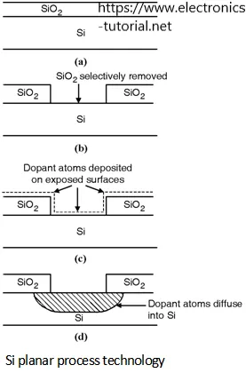

## テイクアウト

マイケル・フィラーとマシュー・リアルフは、すべてのプロセスが8つの異なるステップから成り立っていると提案しています。利用可能なステップを理解することで、それらを再配置してプロセス改善を実現できます。プロセス改善はその無形の性質ゆえに過小評価されています。

## プロセスと製品

もし左側の物体と右側の物体を比較するように言われたら、どんなポイントを挙げますか?

最初に気づくのは素材です。左は石で、右は青銅でできています。

また、石の矢じりは青銅ほど鋭くなく、耐久性も劣り、非対称であることも指摘してもいいでしょう。

あなたが推測したけれどおそらく明示は言っていなかったのは、製造工程も異なるということです。石は切断が必要ですが、青銅は精錬が必要です。

このプロセスの話題に焦点を当てて、[Michael Filler and Matthew Realff propose that Fundamental Manufacturing Process Innovation (FMPI) is central to progress.](https://medium.com/@processinnovation/fundamental-manufacturing-process-innovation-changes-the-world-471adcc77c48 'FMPI') FMPIとは何を指すのか、なぜ重要なのか、そしていくつかの例を見てみましょう。

著者らは、人類にとって大きな目に見える進歩をもたらしたプロセスの改善があると提案しています。しかし、人々は無形のプロセスの変化を見落とし、物理的な製品の変化に過度に注目しがちです。上記の矢じりの例では、人々は石と青銅の結果に注目し、切削と精錬のプロセス改善[^1]を見ていません。これらの高インパクトのプロセス革新を、いわゆるFMPIと呼びます。

プロセスの改善に気づくのは難しいです。なぜならそれらは目に見えないものであり、状況を別の視点から見る必要があるからです。細部から抽象化し、自分のやっていることを表現する高次の関係性を探そうとしているのです。これは数学の群論が実用的な応用から抽象化しようとするのと似ています。

FMPIの研究は重要です。なぜなら、人類の進歩をもたらしたさまざまな手法を定量化できれば、改善のための別の枠組みが得られるからです。例えば、組立ラインがプロセスを連続した部分に分解することで効率が上がることを知っておくと、同じ技術を他に適用できる場所を見つけるのに役立ちます。

日常生活における実用的な影響は、自分が参加しているすべての繰り返しのプロセスを見直すことです。仕事でも趣味でも、プロセスをより効果的にするためにステップを組み替える方法がないか試してみてください。

- あるソフトウェアから別のソフトウェアへのデータ転送に繰り返しのプロセスがある場合、[zapier](https://zapier.com/ 'zapier')それを自動化できるかもしれません
- もしいつも他人にやり方を教えなければならないなら、[scribe](https://cursive.io/scribe 'scribe')負担を減らせるかもしれません
- もしいつも何かをデフォルトでやってきたなら、自分自身を撮影してプロセスのすべてのステップを視覚的に振り返るのが役立つかもしれません

以下では、プロセス改善のさまざまなステップを見て、FMPIによって実現されたイノベーションの事例を紹介します。

### FMPIは8つのスキーマを通じて発生します

彼らはプロセスを、初期の状態を別の状態に変換する一連の連結したステップと定義します。ステップの再配置はプロセスの改善につながることがあります。「ステップ」はプロセスの構成要素であり、ステップの配置を変えることでより効果的なプロセスが可能になります。

著者らは、プロセス改善の8つのタイプ(スキーマ)を提案しています。

並列化(タイプ1)とは、同じステップの複数のインスタンスを同時に実行することを指します。

並列化があるということは、ステップを分割(タイプ2)とステップをマージ(タイプ3)できることを意味します

ステップを分割して部品を下流の異なるステップに送る場合、それは分離(タイプ4)と呼ばれます

複数のステップを組み合わせる(タイプ5)も、ステップを複数のステップに因数分解することもできます(タイプ6)[^2]

最後に、減法(タイプ7)で物を除去したり、加法(タイプ8)で物を加算したりすることができます

上記の8つのタイプのさまざまなバリエーションを使うことで、より良い方向に物事のやり方を変えることができます。もっと具体的な例を見てみましょう。

### 集積回路の製造には並列化、減算、加算が必要です

1950年代後半のフェアチャイルド半導体でのジャン・ホルニとロバート・ノイスの研究は、そのことを示[a transistor could be made within silicon, and that circuitry could be built on top of the surface](https://www.computerhistory.org/revolution/digital-logic/12/329 'wafer') [^3]。表面上に複数のトランジスタを配置できることは、並列化(タイプ1)の一例でした

製造プロセスには多くの減算(タイプ7)と加算(タイプ8)の工程も含まれます。[Electronics Tutorial](https://www.electronics-tutorial.net/CMOS-Processing-Technology/planar-process-technology/ 'Elec')の下の図では、シリコン(SiO2)の除去とドーピング材料の追加が見て取れます。

### DNA配列決定は並列化によって改良されました

1970年代には、DNAシーケンスは全鎖を順番に処理しなければならないと考えられていたため、時間がかかり作業集約的でした。ヨアヒム・メッシングとペーター・ゼーブルグは、DNAをランダムな断片に分解してより速いシーケンスを可能にする[shotgun approach](https://en.wikipedia.org/wiki/Joachim_Messing 'DNA')を開発しました。複数の重なり合う断片を行うことで、シーケンス過程における並列化(タイプ1)が可能となり、速度が大幅に向上しコストを抑え、[^4]に必要なDNA量も減少しました。

### 3Dプリンティングは、引き算から加算への考え方の変化です

ほとんどの従来の製造技術では、原材料の原材料から(タイプ7)を差し引く方法があります。例えば、テーブルを作りたい場合、木を切り倒して不要な部品を切り落とします。

ご想像の通り、これが無駄な素材を生み出します。多くの企業にとって、原材料から中間製品の量を最適化することは収益性に不可欠です。例えば、衣料品業界での [fabric optimisation](https://www.resourceefficient.eu/en/technology/design-efficiency-%E2%80%93-zero-waste-patterns 'shirt') は[30% cost savings](https://fashioninsiders.co/toolkit/how-to/cutting-fabric-for-production-versus-sampling/#:~:text=In%20clothing%20manufacturing%20fabric%2C%20costs,%2D30%25%20in%20a%20fabric. 'fabric') [^5]

対照的に、[3D printing](https://3dprintingindustry.com/3d-printing-basics-free-beginners-guide '3D')は加算式(タイプ8)です。つまり、生産時の無駄はずっと少なく、ほぼ正確に下から印刷できるからです。[Besides the cost savings, this also allows creation of more complicated structures in fewer steps.](https://bitfab.io/blog/additive-manufacturing/ 'bit')

### FMPIで質問解除

著者らは、上記のプロセス改善がこれらの産業におけるコスト削減に不可欠であると主張しています。

技術のスケーリング経路を可能にすることに加え、FMPIは以下の特徴を持っています。

- S曲線の挙動は初期の普及が遅いが、問題点が解消されれば広く採用され、その後市場が飽和化する
- 従来の改良を基盤にして利益を複合的に拡大すること。例えば、集積回路チップにさらなる層を追加することは、以前のプロセス改良によって可能でした
- 生産における異なるバイアスの導入。例えば、集積回路の生産における最適化と高い固定コストのため、他の選択肢を模索するのではなく、シリコンを基材として使うことに「固定」されています

最後にいくつかの未解決の質問で締めくくります。

- FMPIはどのくらいの頻度で、その影響範囲はどのくらいですか?
- どの分野がFMPIの恩恵を受け、どの分野があまり恩恵を受けないか?
- 彼らは8種類のFMPIを提案しましたが、もっとある可能性はありますか?
- FMPIをどうやって予測できる?
- FMPIをどのようにインセンティブできるでしょうか?

[^1]: 彼らは3つの理由を挙げています。a) プロセスは一時的な性質を持ち、製品よりも一時的であること b) プロセス改善は応用範囲が広く、専門の実務者には見落とされやすい(ここで何を意味しているのかは不明) c) プロセスは単なるステップの再配列、つまり些細な活動と考えられている

[^2]:ファクタリングは私には非常に分離のように思えますし、彼らが見たい違いは、分離が異なる下流のステップに分かれることだと思います。ファクタリングは同じステップに進むのです

[^3]:半導体チップの製造の詳細については完全には把握していませんが、詳細は[here](https://www.mepits.com/tutorial/384/vlsi/steps-for-ic-manufacturing 'IC')または[this youtube video](https://www.youtube.com/watch?v=oBKhN4n-EGI 'yout')を参照してください。シリコンウェハーは平らでなければならず、その上に回路を重ねてシリコン酸化物層を作り、フォトレジスト層を加え、マスクを重ね、紫外線曝露でマスクを選択的に除去し、酸化物をエッチングし、露出したシリコンを選択的にドープする方法を用いるため、製造工程全体は平面プロセスと呼ばれていると思います。

[^4]:詳細は論文[here](https://academic.oup.com/nar/article-abstract/9/2/309/2359970 'paper')でご覧いただけます。私の知る範囲を超えているため、ここでは詳しくは触れません。ショットガンのプロセスのわかりやすいバージョンは[here](https://www.yourgenome.org/facts/what-is-shotgun-sequencing 'genome')

[^5]:これはコンピューター(あるいは人間)を使って、生地の最大限の使い方を活かすように配置し、布のパターンを「覆う」ように配置し、隙間をあまり作らない形で作る方法です。
