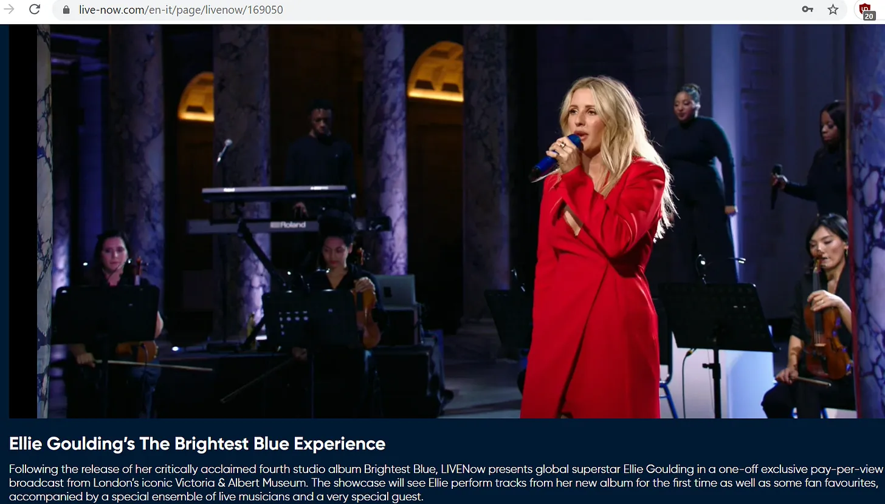
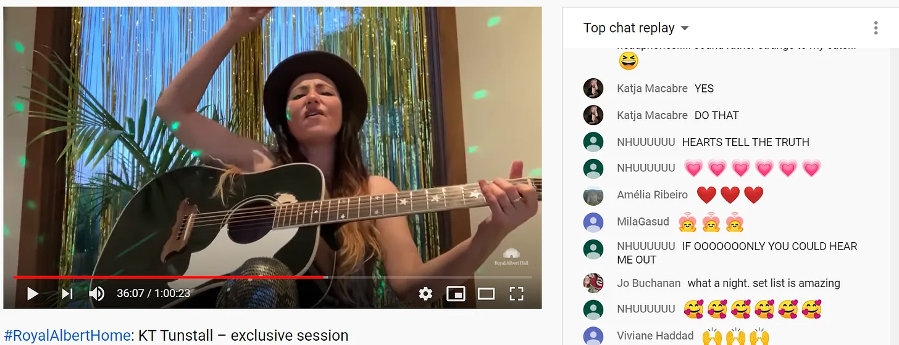
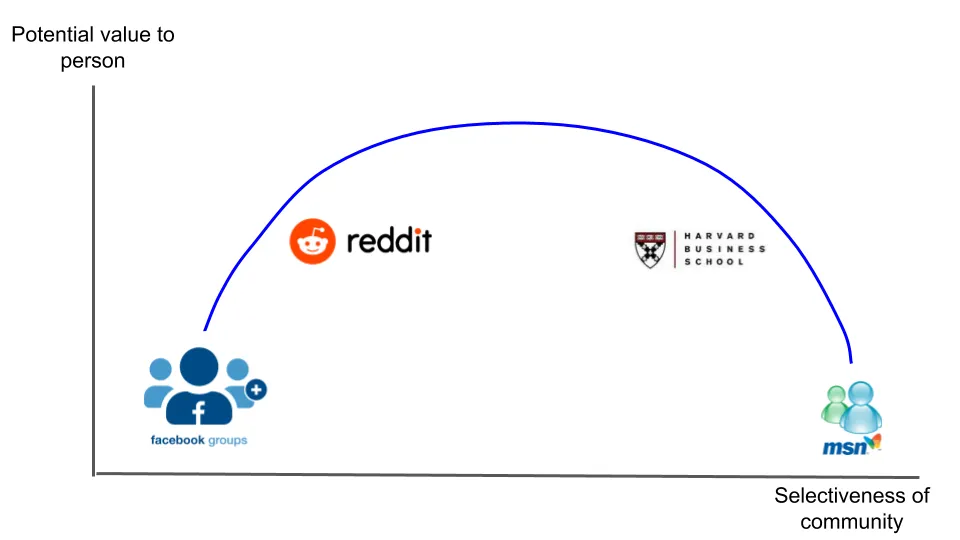

## 要点

1. バーチャルイベントやグループは、交流の機会を増やすことでコミュニティを築くことを目指しるべきです。もしコミュニティにいない、あるいはコミュニティを作っていないなら、おそらく何かを逃しているでしょう。
2. ニュースレターはコスト、利便性、そして管理力のためにトレンドとなっています。私はビジネスの経済性を枠組みとして遊べる財務モデルを共有します
3. 個人は個人投資家として、またシンジケートの小額小切手として、プライベートマーケット投資においてますます重要になっています

---

仕事でトロントに出張していたこともあります。

私がよく訪れるレストランがあり、料理や飲み物、スタッフが素晴らしかったです [^1]\.私は半ば常連になりたいと思っていた。メニューのすべての料理を味見し、バーテンダーとカクテルの雑談を交わすのに。

もうやめて。

以前カクテルナイトを主催していました。

飲み物を出しながら、ゲストをアパートに招いたりしていました。時にはカクテルレッスンも行いました。それは持続可能で繰り返しのイベントになり、古い友人と再会したり新しい友人を作ったりできるようになりました。

もうやめて。

以前は毎月のグループディナーをやっていました。

マンハッタンのレストランを選び、数週間前にデートを予約して、食べ物や話を共有しました。グループディナーは素晴らしいです。それはもっと多くの料理を試せることを意味します。

[No more no more no more.](https://youtu.be/a8HoZlhenZ4?t=141 'Dr Who')

今年は運が良かった、いろいろ考えれば。まだ生きていて、健康で、仕事も続けている。大きな損失もない。

それでも、不吉な予感がある _何か_ 消えた。

私だけの問題ではないと思います。最近、元気がないという投稿をよく見かけます。話したことのないジムの仲間、ちょっと会う時間にいつも来るジムの仲間、ちょっとナンパしていると思っていたバーテンダー、あるいは四半期に一度話せるけれどそれ以上はない友人\;彼ら全員が、あなたの街でのコミュニティ感に少しでも貢献していたのです。

それは今のところなくなってしまい、人々はそれぞれ異なる反応を示しています。バーチャルな手段でコミュニティを探す人もいれば、何もないまま過ごそうとする人もいます。他者を見つけるのがこれまでになく簡単になりましたし、一人でいることもかつてないほど楽になりました。

今日はそのテーマを探求したいと思います。 **共同体と個性の、** いくつかの異なる視点から。まずは、個人探しコミュニティに適応したイベントやグループを見ていきます。次に、メディア、特にニュースレタービジネスにおける個人の台頭を見ていきます。最後に、投資における個人、特にソロベンチャーキャピタリストの概要で締めくくります [^2]\.

### 1\. バーチャルイベントやグループはコミュニティ構築を目指すべきです

バーチャルイベントやグループは新しいものではありません。この記事は _2009_ その方法について論じています\:

> 多くの企業が出張予算を削減せざるを得なくなった厳しい経済状況と、「グリーン」への注力が高まる中で、バーチャルショーは会議ビジネスにとって現実的な試みとなっています。

そして私たちの多くは、 [MSN messenger, ](https://www.hulldailymail.co.uk/news/hull-east-yorkshire-news/msn-messenger-logged-back-in-3393323 'msn') [online forums](https://www.makeuseof.com/tag/how-we-talk-online-a-history-of-online-forums-from-cavemen-days-to-the-present/ 'forum')そして今日のソーシャルメディアも、これらはすべて人々がオンラインで互いを見つける手段となっています。

主なアイデア自体は新しいものではありませんが、技術の進歩と社会規範の変化により、コンセプトの実行はより強化されました。まずはイベントがどのように適応してきたかを見てから、グループについて見てみましょう。

#### インタラクティブな活動としてのバーチャルイベント

私のような人なら、今の日々は在宅勤務、家で寝ること、そして『バフィー 〜恋する十字架〜』の全7シーズンを一気見せずに自分を楽しむ何かを見つけることの混合になっているでしょう [^3]\.

ここ数ヶ月で、さまざまなバーチャルイベントに参加し、ボランティアをし、主催してきました。ほとんどは平凡なものでしたが、いくつかは特別なものでした。私のハイライトは以下の通りです\:

多くのイベント主催者は、すべてのイベントセッションをZoom通話に変換すればいいと考えているようです。カレンダー招待リンクをメールで送り、「ホスト権限を付与して画面を共有できるか」という数分間のプレイをし、スピーカーに対面イベントのように話してもらうだけです。これはまあまあ機能しますが、2020年に期待すべき最低限のことだと感じます。

イベントに付加価値の高いシンプルで大きな要素の一つは **聴衆による質疑応答\(Q\&A\)を許可してください。** イベント中の交流を増やし、より効果的にする便利な方法です。また、ライブ参加とリプレイ視聴には大きな違いがあるという意味もあります。ほとんどの主催者はこれを理解していますが、Q\&Aに割り当てられる時間はまだ短めの場合があります。特に聴衆との関係構築を目的とするイベントなら、講演イベントの約半分の時間をQ\&Aに充てることをおすすめします [^4]\.

もう一つの付加価値は **提示された資料を含めてください。** これはセッションの前後で、驚きの要素を持たせたいかどうかで可能です。私が参加した多くのイベントでは、動画のリプレイリンクを送ってくるだけでした。それは良いことですし、もっと良い方法ができます。後であなたの専門知識を引用したい場合、動画内容を解析するのに時間がかかるため、動的な素材よりも静的な素材にリンクする方が便利です。基本的に無料で簡単にできるので、スライドも送ることで視聴者の時間を節約できます。

他のアイデアは状況に応じたものです。

少人数のグループで、1対1でつなげたい場合、私が見つけたことがあります [Icebreaker](https://icebreaker.video/ 'Icebreaker') その用途に最適です。アイスブレイカーは全員をメインルームに集め、ランダムに1対1のチャットに分けます。1対1のチャットには、話すことがわからない場合にガイド付きプロンプトもあります。5分後、チャットは自動的に終了し、全員がメインルームに戻されます。この操作は好きなだけ繰り返せます。

大人数のグループで、それでも人それぞれが交流してほしいなら、 [2020 Nebula Awards](https://events.sfwa.org/ 'SFWA') した。星雲は [one of the most prestigious Sci Fi awards,](https://en.wikipedia.org/wiki/Nebula_Award 'Nebula') そして今年は、会議全体をオンラインで開催しました。彼らは1つのリンクから、さまざまなサイズのZoomブレイクアウトルームを大量に開催しました。そして、参加者全員に共同ホストの権限を与え、参加者がブレイクアウトルーム内を自由に移動し、興味のあるものに参加できるようにしました。メインスピーカールームのほかに、バーテンダーがレシピを教えるバー、ライティングルーム、子犬のライブ配信など、ランダムな部屋もありました。以下では、有名なSF作家と一緒にブレイクアウトルームにいる私の姿が映っています [Lois Bujold](https://en.wikipedia.org/wiki/Lois_McMaster_Bujold 'Lois') \(プライバシーのために他の人たちはブラックアウトしています\)。

もっと実験的なアイデアとして、複雑な気持ちを抱いていました。 [Online Town](https://theonline.town/ 'Online')、 [Long Now Foundation](https://longnow.org/seminars/ 'Long') セミナーの後に試してみました。Online Townでは、画面上のアバターで表現され、現実のように部屋の中を歩き回ることができます。聞ける会話は近接に基づいており、現実をさらにシミュレートしています。このアイデアは興味深く、よりユニークな体験を得るためには、より高度なユーザー教育が必要です。

これまで「仕事」関連のイベントを取り上げてきましたが、エンターテイナーもバーチャルに適応しています。

例えば、私は [Ellie Goulding live virtual concert recently.](https://inews.co.uk/culture/music/ellie-goulding-live-review-victoria-and-albert-museum-london-brightest-blue-613122 'Ellie') 彼女はそれを [Victoria and Albert Museum](https://www.vam.ac.uk/ 'VAM') ロンドンで、美術館内で動き回る素晴らしいショーを開催しました。制作のクオリティは素晴らしく、SNSでも素晴らしい反応を得ました。

別の例は [Tomorrowland](https://www.tomorrowland.com/global/ 'TMR')、最高のDJフェスティバル。また、プロダクションの質も引き上げました。 [creating visual experiences](https://www.youtube.com/watch?v=BinQqIX3aig 'alan') コンサート参加者がDJがライブで演奏するのを楽しみながら楽しめるように。私は参加しませんでしたが、参加した人が楽しんだと言っていました。

しかし、もっと良いものができると思います。エリーのコンサートは素晴らしく、トゥモローランドも楽しそうでしたが、どちらもファンとの関わりが足りませんでした [^5]\.ライブイベントを開催するなら、その機会を最大限に活かすべきです。デジタル体験はコミュニケーションを簡素化します。私はそれを強くお勧めします **エンターテインメントイベントは、上記の「プロフェッショナル」イベントと同様に、交流を目指すべきです。** もしライブイベントの強みが制作価値だけなら、自分の時間にリプレイを見たほうがいいと思います。

KTタンスタルはこれを例として示しました。 [her live session with the Royal Albert Hall](https://www.youtube.com/watch?v=T_FHtCvpTOI 'KT')\.上記の2つの例と比べて制作のクオリティが劣っているのがわかりますが、本当に違いを生んだのはライブチャットでした。これによりファン同士が、そして彼女と交流でき、特別な親密なセッションが生まれました。ライブ配信は\.\.\.主流になりました。

もしそれが大規模に持続可能だとは思えないなら、 [what KPop groups such as Super Junior are doing.](https://www.youtube.com/watch?v=3H_MiOghwJw&fbclid=IwAR3nFY0s2ccu6tXA4dig9_e37jvNC3QGxCNOL9WE9E-DyJeRMrWtoMAQUIo 'Kpop') \(ガブリエル・タン 提供\)彼らはコンサート体験を再構築し、特にファンとの交流を計画しています。今ではファンを特別に感じさせるのがずっと簡単で、エンターテイナーはそこから学ぶべきです。アジアの企業が消費者体験の革新をリードしているとますます感じられ、これは西洋企業のケーススタディの一つのように感じられます [^6]\.

これは対面イベント市場にとって何を意味するのでしょうか\? [Rafat Ali of Skift believes that this is a watershed moment for the industry](https://skift.com/2020/08/26/the-event-industry-is-being-confronted-by-its-napster-moment/ 'Skift')音楽のNapsterのように。彼はビジネス出張の10\%が市場から永久に離れる可能性があると考えており、またバーチャルイベントは対面イベントの約4分の1の収益を上げると推定しているため、市場は新しい経済状況に適応しなければならないと述べています。

対面イベントについてはあまり悲観的ではなく、コロナが過ぎれば再び成長すると考えています。ほとんどのビジネスカンファレンスは効率性よりもネットワーキングや上司からの有給休暇を取ることが重視されてきました。しかし、イベントはハイブリッドモデルを採用し、利益率を少しでも増やす可能性もあります。対面体験は贅沢として、バーチャル体験は予算の代替として売り込むべきです。つまり、良いバーチャルイベントの開催方法を知ることは今後も重要だということです。

まとめると、バーチャルイベントはより多くの交流を目指し、コミュニティを築くべきです。今はそれがさらに簡単になり、さらに熱狂的なフォロワーを生み出すでしょう。

#### バーチャルコミュニティをキュレーションされたクラブとして

コミュニティ構築も個人や企業にとって重要性を高めています。個人にとってはネットワーキングが常に重要であり、バーチャルグループはその延長線上にあります。企業にとって、エンゲージメントの高いコミュニティは忠実な顧客を意味し、離職率や顧客獲得コスト\(CAC\)を削減します。企業版の [1,000 true fans for creators.](https://kk.org/thetechnium/1000-true-fans/ '1000')

個人レベルでは、コミュニティの問題はこうです **選択性の問題です。** 選択的すぎると、ランダムエンカウントが十分にありません。選択的でなければ、すべてが無関係に感じられます。コミュニティの一員であることは、 [signalling,](<https://en.wikipedia.org/wiki/Signalling_(economics)> 'signal') その信号の強さや弱さは、あなたのクラブのクールさによります。

例えば、あなたのMSNの連絡先はグループを選り好みしすぎましたが、Facebookのグループはそれほど選り好みが足りません。ビジネススクールは選択性によって示されるブランド価値がすべてです。Redditの軽いモデレーションはある程度の選抜性を生み出します。平均すると、親しい友人の日曜ブランチグループよりも学校のネットワークからより多くのプロフェッショナルな価値を得たり、Redditのスレッドからより多くの情報を得る価値があります [180,000 member Facebook group about genuinely stoked goats](https://www.facebook.com/genuinelystokedgoats/ 'goat') 入隊したことすら覚えてない [^7]\.

この問題を解決しようとする試みとして、キュレーションされたコミュニティの人気が高まっているのを私たちは見ています。こうしたコミュニティの目標は、価値と選抜性のバランスを取る最適な位置を見つけることです。通常、メンバーを審査するための何らかの入会プロセスがあります。活動している間には、優れたメンバーがいることでコミュニティへの関心が高まり、質の高いメンバーが増えるというフィードバックループが生まれます。特にコミュニティが小さい場合は、みんながうまくいくよう動機付けがあり、自分のメンバーであることに誇りを持つことができます。

そのようなコミュニティの例としては以下の通りです\:

- [Renaissance Collective](https://www.renaissancecollective.co/for-smart-generalists 'Renco') これは「スマート・ジェネラリスト」と呼ばれるオペレーターのコミュニティです
- [On Deck](https://www.beondeck.com/ 'On Deck') それは「トップの才能が次に何を探求する場所」か
- [The Progress Studies slack group](https://patrickcollison.com/progress 'Progress') 「進歩の科学」に興味がある方へ
- [Soho House](https://www.sohohouse.com/about 'Soho') そのメンバーは「志を同じくする創造的な魂を持つ人々」です
- [The Interintellect](https://www.interintellect.com/ 'inter') それは「21世紀において多作で成功した知識人となる新たな道を築くこと」です

会社レベルでは、 **コミュニティを築くことは、自分のオーディエンスを所有することに似ています。** これは後でニュースレターやメディアについて話す際にまた触れます。新規顧客獲得は既存顧客に売るよりもコストが高いため、より忠実なファン層を築くことはビジネスの成長に直接影響します。 [Gavin Baker elaborates on loyalty here](https://medium.com/@gavin_baker/scale-and-loyalty-are-more-important-online-than-offline-which-drives-much-of-the-winner-take-992345be93a9 'Loyalty')そして、主なポイントは、顧客ロイヤルティを通じて顧客獲得コストを回避することで、ビジネスが競争優位性を得られるということです。

この点をよく理解している業界の一つがゲーム市場です。Minecraft、Fortnite、Robloxの背後にある企業がどのようにターゲット顧客を固定しているかを見てみましょう。 [Minecraft has 126mm monthly active users](https://www.theverge.com/2020/5/18/21262045/minecraft-sales-monthly-players-statistics-youtube 'Minecraft')\. [Fortnite is still breaking attendance records for its in game concerts](https://www.gamesradar.com/how-many-people-play-fortnite/ 'Fortnite')\. [Roblox makes >$1bn in rev and is played by half of all children in the US](https://www.thegamer.com/roblox-played-by-most-american-kids/ 'Roblox')\.多くのゲームでは、友人がそこにいるから人々がそこに向かっています。彼らは2020年の新しいMSNです [^8]\.

価値や選択性以外に、バーチャルグループで最後に考える要素は **成長の可能性。** 成長は通常、選択性を犠牲にします。グループが成長するにつれて、次のメンバーによる付加価値は平均的に低くなります。

これを回避する方法として、定期的にバッチ入りを行う方法もあります。これは大学やスタートアップアクセラレーター、オンラインコースコミュニティが採用しているモデルです。もう一つの選択肢は、定員数を固定し、誰かが辞めてからのみ新規入団を受け入れる方法です。RenCoやThe Interintellectのように常青を目指すグループについては、他の競合要因とどのように成長を管理するかを見るのが興味深いでしょう。

まとめると、グループはこれまでもこれからも強力であり続けるでしょうが、その組織の仕方は時代とともに変化しています。もしまだコミュニティを築いていない、あるいはコミュニティの一員でなければ、そこにあるものを探る価値があります。コミュニティを作りたいと思っていて、どこから始めればいいかわからないなら、 [there's also a community for that.](https://www.community.club/ 'club')

さらに、言ったことから行動を起こすために、Avoid Boring Peopleのコミュニティを立ち上げることを検討しています。来月アンケートを送る予定ですが、その間も興味があればこのメールに返信してください。

### 2\. ニュースレターは持続可能で収益性の高い小規模事業にはなり得ますが、規模を拡大するのは難しいです

コンテンツの世界では、個人が自分自身で影響力を持ち、稼ぐ機会を選んでいます。独立することで、プラットフォームからの安定や支援を手放し、より高い報酬と責任を得ることになります。今日の個人運営のメールニュースレター業界に焦点を当てたいと思いますが、この傾向は業界に特有ではありません。YouTube、Twitch、TikTok、Tencent Video、OnlyFansなどが、今日成功を収めている個人の例です。 [unbundling the value of their personal content.](https://hbr.org/2014/06/how-to-succeed-in-business-by-bundling-and-unbundling 'bundle')

見てみましょう\:

- ニュースレター作成のトレンドを推進している要因
- ニュースレターの大規模なビジネスモデルと経済性について
- メディアの未来はどのようなものになるか

#### コスト、利便性、管理を重視するニュースレター

李晋は情熱経済について書いています [here](https://li-jin.co/2019/10/22/the-passion-economy-and-the-future-of-work/ 'Li Jin')、次のように提案します\:

> かつては最大のオンライン労働マーケットプレイスが労働者の個性を平坦化していましたが、新しいプラットフォームは誰でも独自のスキルを収益化できるようにしています。ギグワークは消えませんが、創造性を活かす方法が増えました。ユーザーは今や大規模にオーディエンスを築き、ビデオゲームをプレイしたり動画コンテンツ制作をしたりと、情熱を生計に変えることができます。これは起業家精神や将来私たちが「仕事」と考えるものに大きな影響を与えます。

すべてのビジネスモデルは以下のように簡略化できます\:

1. 人を探す
2. 彼らに物を売れ [^9]

これらのいずれかを単一企業が行うのがコストがかかる場合、企業がそのギャップを埋めるために参入します。これらのアグリゲーター、プラットフォーム、仲介業者、バンドラー、ディストリビューターなどと呼んでください。彼らが行っているのは、大規模な顧客基盤に大きな固定費を分散させる必要があることを認識しているのです。

**インターネットはこれら両方の作業のコストを大幅に下げました。** そして今後もそうなる可能性が高いです。顧客を見つけて注文を完了しつつ、固定コストを低く抑えることは可能です。トーロジー的に参入障壁を下げることで、より多くの参入者が来ます。すべての人にとってレバレッジが高まります。

ニュースレターを例に挙げると、20年前よりも今の方が読者を集めやすいです。想像もしなかった場所や生活の状況にいる人からランダムな読者メールが届きます\(これからも送り続けてください\!\)、ましてやマーケティングのターゲットを絞り始めることはなおさらです。また、ニュースレター号を送りたい時も、すべてが印刷物である場合よりもはるかに低い料金を支払っています。

コストの削減に加え、 **利便性の向上** また、ニュースレターの流行を促進しました。間違っているかもしれませんが、ニュースレターのブームはその後に盛り上がり始めたと感じます [substack announced their funding round.](https://techcrunch.com/2019/07/16/substack-series-a/ 'substack') Substackがしたのは、私が説明したように、始めるのが格段に簡単になったことです。 [older post](/writing/substack 'substack')\.心配を減らすことで [cname record](https://support.dnsimple.com/articles/differences-a-cname-records/ 'cname') しかし、すぐに書き始められるようになったSubstackは多くの人々を試すきっかけとなりました。

ニュースレターがもたらすもう一つの重要なことは、 **聴衆のコントロール強化**\; [a direct relationship with readers.](https://www.protocol.com/substack-ceo-newsletter-obsession 'substack') 現状のところ、メールは人々が開いて確認するちょうど良い場所にあります。これを、賃貸アパートの売却広告が半分は郵便で受け取るのと、フィードベースのコンテンツプラットフォームでは半分は人気があるはずのものを見て、私は気にしないのと比べてみてください。オーディエンスを持つことで、自分だけのコミュニティを大切にできるのです。

上記の一つ微妙な点です。読者獲得のコストは低く、ニュースレターを送る利便性が高いと述べました。しかし、読者を得るのは便利ではありません。読者基盤を築くには努力が必要です。 [unless you're Bella Thorne and trying to scam sex workers.](https://reddit.com/r/ChoosingBeggars/comments/ikotvd/can_celebs_be_choosing_beggars_edited_for_sub/ 'Bella') 一部のクリエイターは、実際にコンテンツを作るよりも、自分の作品のマーケティングに半分以上の時間を費やしています。読者を獲得し、読者がメールアドレスを渡すという摩擦が増すことが、関係性を深めているのです。私はこれに参加したので、良いもので読むべきだと思われます。顧客獲得コスト\(と労力\)を前倒しに積み込んでいるので、そのグループに売るのは後々ずっと楽になります。

#### 個別ニュースレターを大規模に扱うと、30万ドル規模のビジネスになる可能性が高いです

コンテンツの世界を3つの主要なタイプに分けましょう。一度に3つ以上覚えていないので。

1. 楽しませるために
2. 教育のために
3. 感情を呼び起こすために

ニュースレターのライターなら、3つの組み合わせを自分だけのものにしたいです。どこに投稿するかが価格設定に影響します。 [Byrne Hobart has written about newsletter pricing before](https://diff.substack.com/p/whats-next-for-the-diff 'Diff')、そして結局は次のようになります\: **これは法人カードで費用を負担できるものでしょうか\?**

ニュースレターが仕事をより良くし、もっと稼ぐための教育を与えてくれるなら [^10]価格を上げることも可能です。個人的な娯楽や感情のためなら、それは難しいです。試してみることもできますが、私の文章を読んだ後で同じ気持ちを抱かせるのはほぼ不可能です [after watching Arrival.](https://www.reddit.com/r/movies/comments/8z720w/movies_that_destroy_you_emotionally/ 'Arrival')

ニュースレターが稼げる合理的な上限はどれくらいでしょうか\? [This post by Andreas Stegmann](https://medium.com/hyperlinked/ben-thompsons-stratechery-should-be-crossing-3-million-in-profits-this-year-c146433f0458 'andreas') ベン・トンプソンの推定 [Stratechery](https://stratechery.com/ 'Strat') 年間約300万ドルの収入です。より良い情報がないため、これを最高のニュースレターの上限として使います [^11]\.

それは多いように聞こえますが、もう一度考えてみてください。世界最高クラスに入っているということは、100万ドル程度の価値に過ぎません。 [Compare this to being the best in the world at a sport](https://www.forbes.com/athletes/#2c6842d155ae 'Forbes')トップアスリートが年間約1億ドルを稼ぐ場所。あるいは、世界一のビジネス運営者で、収益が数十億ドルで測られる場合。最大の利益を求めるなら、ニュースレターを書くのは適切ではありません。

しかし、小規模ビジネスを運営することに抵抗がなければ、ニュースレターの執筆は信頼できる選択肢となり得ます。 **私は5年間のニュースレターの財務モデルを作成しました [here](https://docs.google.com/spreadsheets/d/1QS2lKHhDDCe5vwHiJPd7QpDjQRxJ3mHl4VgCq6e8Q6M/edit?usp=sharing 'model')** 経済的な形を試してみてみてはどうでしょうか。もしそうしたら、必ずコピーを作って、元の編集はしないでください。感謝の言葉 [Jacob Donnelly](https://www.amediaoperator.com/ 'Jacob') および [Josh Constine](https://constine.substack.com/ 'Josh') モデルに関する意見を求めてください。

モデルはシートに記載されている仮定に非常に敏感で、この脚注で簡単に説明します [^12]\.現在はサブスクリプションと広告のビジネスモデルを前提としていますが、それを変えることは可能です。5年で30万ドルの評価額を得るのは難しいですが妥当であり、ニュースレター作成者にとって目指すべき目標かもしれません。

もちろん、年間\>\$100kを稼ぐ優れたクリエイターもいますが、それにはモデル内でより積極的な仮定が必要で、それに合わせて調整できます。年間\$100\,000は [1000 true fans](https://kk.org/thetechnium/1000-true-fans/ '1000') 年間100ドルを支払い、無料から有料へのコンバージョン率が5〜10\%の場合、無料購読者数は約1万から2万ドル必要です。可能ですが難しいです。

#### ニュースレターには出口の選択肢があまりないかもしれません

最近のRedditのスレッドで話題になりました [how huge a star Michael Jackson was, and how we don't see celebrities like that anymore](https://www.reddit.com/r/todayilearned/comments/ikuuhu/til_michael_jacksons_super_bowl_half_time_show/ 'MJ')\.インターネットのコストデフレによりコンテンツの世界は断片化され、想像を絶するほど多くの新しいクリエイターが生まれました。集中度は減り、多様化が進んでいます。次は何でしょうか\?

簡単な予測の一つは、これらすべてのコンテンツを支援する業界のことです。ニュースレターについては、 [paid courses](https://www.journalism.cuny.edu/centers/tow-knight-center-entrepreneurial-journalism/entrepreneurial-journalism-creators-program/ 'paid')\, [support groups](https://www.indiehackers.com/group/newsletter-crew 'support')そして、始める方法についてアドバイスする人も増えています。

もう一つの簡単な予測は、個々のクリエイターがバンドルすることです。ニュースレターについては、 [Nathan Baschez and Dan Shipper put together the Everything Substack bundle](https://everything.substack.com/ 'Everything')そして、他の人もそれに倣う経済的に理にかなっています。ニュースレターだけでなく、ポッドキャストやコンサルティングなど他のメディアもバンドルするかもしれません。

また、多くのクリエイターがコミュニティを築くと信じています。これはセクション1で述べたように。ニュースレターにとっては、メールからSlackのような他のサービスへの移行率が非常に高いため、より難しいでしょう。成長と品質の問題にも直面し、優先順位を決めなければなりません。

ニュースレターの出口機会についてはよくわかりません。規模のため、上場はほとんど、あるいはすべてのニュースレターにとって手の届かないものです。つまり、買収やさらなるロールアップバンドルが正しい方向です。しかし、著者を維持するのは難しく、価値の大部分は著者自身にある可能性が高いです。リスクを考慮すると、取引倍率は低めの方になる可能性が高いです [^13]\.もし選択肢を求めているなら、大きな出口は、あなたの執筆によって生まれるコンサルティングや他の機会に比べて、給料日にはなりにくいです。

### 3\. 投資における個人の台頭

[Nikhil Basu Trivedi did a post about solo capitalists recently.](https://nbt.substack.com/p/the-rise-of-the-solo-capitalists 'NBT') 次の条件を満たすと [SEC news about relaxing accredited investor rules](https://www.sec.gov/news/press-release/2020-191 'SEC')私は簡単に、投資における個人の重要性の高まりについて触れたいと思います。

ニキルは次のように指摘しています\:

> エンジェル投資家は長い間、資金調達のエコシステムにおいて非常に重要なメンバーでした。しかしここ数年で、企業の初期段階だけでなく、シリーズA以降でも投資する個人が増加しています。これらの人々は自分の資本だけでなく、専用資金を調達し、単にVC企業と共に参加するだけでなく、しばしばVCと競合し、創業者がVCよりもVCと協力することを選んでいます

個人はより迅速に意思決定でき、VCよりも柔軟で集中力が高い可能性があるため、創業者に対してより安価または便利な資本を提供する機会があります。今の資本がいかに安価で、私以外の誰もが膨大な利益を得ているかを考えれば、この分野でより多くのレバレッジを求める人が増えているのは驚くことではありません。

VCファームもまたバンドルです。創業者で、有名な人物の経験やネットワークを理由に一緒に働くことを選んだ場合、その人物から直接資金を得るか、VCファームから資金を得るかにあまり関心がないでしょう [^14]\.いずれその個人は、自分の価値を企業から分離し、別の商品として提供することでより多くの利益を得られると気づくかもしれません。の立ち上げ [rolling funds by angellist](https://angel.co/blog/rolling-venture-fund-launch 'rolling') さらに彼らが自立しやすくなります。

弱気のケースとは、これまでにも公開市場で同様の状況が起きており、多くの有名な投資家が単独でこれを試みた際に失敗したことです。 [Bill Gross leaving PIMCO for Janus](https://en.wikipedia.org/wiki/Bill_H._Gross 'Janus') はその一例であり、おそらく同じくらい多いでしょう [Tiger Cubs](https://en.wikipedia.org/wiki/Tiger_Management 'Tiger') 彼らは新たなファンドを調達しようとするタイガー・カブスのようにファミリーオフィスに変わっています。すべてのことと同様に、レバレッジは双方向であり、高いリスクと期待される高いリターンが得られます。

また、ソロキャピタリストモデルがスケールできるかどうかも気になります。これらはプライベートマーケットの投資家で、通常は初期のシリーズA側にいます。ソロキャピタリストが非常に成功し、現在の10倍の資本を得たとします。その資金で何をするのでしょうか\?後期段階の企業に移るのでしょうか\?もしそうでなければ、すべてを管理している会社が一社だけの場合、どれだけの企業に資本を投入できるのでしょうか\?

裕福な投資から投資で富を目指す人々へと移行し、新しいSECの規則は多くの小口小切手エンジェル投資家を認めるはずです。 [Charles Rubenfeld pointed out that the Series 65 qualifies you to angel invest](https://twitter.com/Crubenfeld/status/1298666723806257161?s=20 'angel')スポンサー金融機関がなくても受け取ることができます。エンジェル投資は半分ステータスシグナルのようなため、ルールの緩和は多くのエンジェルシンジケートの台頭と創業者にとってさらに安価な資本をもたらす可能性があります。

私は、人々が好きなようにお金を失う自由があるという考え方から、この緩和を支持しています。初期段階の企業に投資することには、社会的資本とドル資本の両方のメリットがあります。その場合へのアクセスが増えるのは、おそらく良いことです。投資するすべての人がリスクを理解し、十分な情報が開示されている限り、私は人々がより多くの選択肢で資金を投入できるようにすべきだと支持します。

## その他

1. [Math and physics guide to animation](http://acko.net/blog/animate-your-way-to-glory/ 'Acko')今年の私の最高の読書の一つです
2. [Reining in the Banking as a Service Euphoria](https://medium.com/@nikilkonduru/reining-in-the-baas-euphoria-1cc90469bcc4 'Baas')
3. [Revenue breakdown of big tech companies](https://www.visualcapitalist.com/how-big-tech-makes-their-billions-2020/ 'Tech')\.Visual Capitalistというサイトを紹介してくれたジン・ヨンに感謝します
4. ["It’s impossible to delete and control all of \[your data,\] logs are a liability, and they’re growing exponentially.](https://vicki.substack.com/p/the-data-lake-overfloweth 'vicki')
5. [Introduction to knot theory using rational tangles](https://www.mathteacherscircle.org/assets/session-materials/JTantonRationalTangles.pdf 'Knot')\.必要な数学は難しくありませんが、概念を理解するには努力が必要です。

[^1]: [Aloette](https://aloetterestaurant.com/ 'Aloette') 興味のある方のために。

[^2]: はっきりさせておくと、私はコロナのせいだと主張しているわけではありません _原因_ これらの傾向です。一部の人は加速したかもしれませんが、他の人には影響がなかったかもしれません。私はむしろ、コミュニティという一般的なテーマを異なる解釈から探求しようとしています

[^3]: 初めて観たばかりで、その素晴らしいエピソードの多くが今でも通用することに驚きました。それに、スパイクとバフィーの関係はどちらの意味も本当に不気味です。

[^4]: Q\&Aがあるということは、より効果的にモデレーションを行う必要があるということですが、ほとんどの場合はそれほど大きな問題ではありません。

[^5]: それが私がトゥモローランドのチケットを買わなかった主な理由で、個人的には価値を感じられなかったからです。

[^6]: 例えば、中国の配信者にとってはチップや登録が大きな市場であり、西洋の配信者にも後に盛り上がってきました

[^7]: 個人的な友情に価値がないと言っているわけではありません。これは「プロフェッショナル」な視点からの話です。

[^8]: 私はまだどちらも読んでいませんが、マシュー・ボールによるゲームに関する詳細な記事があります [here](https://www.matthewball.vc/all/digitalthemeparkplatforms 'ball') そしてジョン・ライのもの [here](https://a16z.com/2020/09/01/tabletop-games-go-digital/ 'Jon')

[^9]: 理想的には利益を出したいですが、最近は価値より安く売るのが流行っています。量で埋め合わせるのでしょうね\.\.\.

[^10]: 「得る」を4つ目の要素にしようかとも考えましたが、全体をまとめるために教育という大きなバケットの下にまとめます。

[^11]: 感謝の件 [Lenny Rachitsky](https://www.lennyrachitsky.com/ 'Lenny') 記事のために。ニュースレターのようなもので、それ以上の収益を上げている企業も多いと主張できるでしょう。例えば、株式リサーチを高価なニュースレターと考えるなら、市場規模は大きいです。私は分析の多くで、より個人ベースのニュースレターに絞っています。

[^12]: このモデルの最大の問題は、5年しか経過せず、その後の終端価値を仮定していることです。もし以前に財務モデルを経験したことがあれば、それは良くないアイデアだとわかるでしょう。なぜなら、5年目と最終成長率は大きく異なるからです。次に大きな問題は終端価値の仮定です。合理的な最終成長率と自己資本コストを仮定して得られる暗黙評価倍数は、実際の買収倍数が3〜5倍のEBITDAであることを考えると、あまりにも高すぎます。このモデルには切り替え可能なケースが2つあり、1つはすぐに収益化して成長に影響を及ぼす場合、もう1つは注目を集めた後に収益化する場合です。モデルを再確認して誤りがあれば教えてください。

[^13]: ネイサンに感謝します [Highlighter call](https://blog.highlighter.com/ 'highlighter')

[^14]: これは大きな一般化であり、もちろんVC会社が個人に対して提供できる他の多くの利点もあります。
