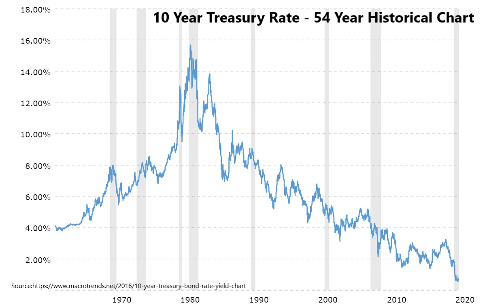

## テイクアウト

資本コストの低下は、貯蓄者から借り手への資産移転を意味し、今の人が以前よりもリスクを取るのが最適であることを示しています。

## 低コスト資本の影響

今日は**資本コスト**について見てみたいと思います。現在の低コスト環境がどのような影響を与えるのか気になっていましたし、[Michael Pettis](https://carnegieendowment.org/chinafinancialmarkets/82610 'Pettis')最近金利と成長について良い記事を書いたので、このテーマを詳しく見ていきましょう。すべての答えは私も持っているわけではないので、コメントはぜひ歓迎します。直接返信するか、投稿のコメント欄に投稿してください。

資本コストが何かを知らない方のために、ご安心ください。以下のポイントを述べる前に、この概念を簡単に説明します。

1. 資本コストは歴史よりも低くなっています
2. その結果、貯蓄者から借り手への資産移転が行われる
3. これはまた、より多くのリスクテイクが行われるべきであることも意味します

### 資本コストとは、アイデアを資金調達するための混合コストです

もしアイデアがあったとしたらどうでしょうか。それは新しいビジネスアイデアかもしれませんし、拡張計画かもしれませんし、あるいはあなたが考えていた投資かもしれません。重要なのは、それが資金(資本)を必要とし、投資した金額よりも多くのリターンが得られることです。

この資金はどのようにして得るのですか?資本の主な源泉は二つあります:債務と株式[^1]です。

借金と引き換えに現金を受け取る場合、あなたは一定額の債務を時間をかけて返済することに同意します。最終的なリターン率に基づいて、そのコストを計算できます。例えば、100ドルに10ドルを支払った場合、それは10%のコスト[^2]となります。

株式と引き換えに現金を受け取る場合、返金は義務付けられませんが、所有権を放棄することになります。手放す金額は、投資家が期待するリターンに依存します。その暗黙のコストを計算できます。例えば、投資家が20%のリターンを期待して資金を投入した場合、それは20%のコスト[^3]となります。

これら二つの主要な資本源の混合コストが組み合わさって、あなたの資本コストとなります。これが、アイデアを試す際にかかる平均的なコストです。例えば、資本コストが5%なら、毎年5%を「失っている」ことになります。

また、資本コスト以上の利益を得たいという意味も導かれます。年間5%の損失があるなら、プラスのリターンを得るためには5%以上の利益が必要です。もしビジネスが年間1%のリターンで5%のコストを上げているなら、時間とともに損失を出します。

これは簡略化した説明ですが、記事の残りの部分に十分な直感を与えるはずです。もっと読みたい方は、評価の王者であるNYUのダモダラン教授[has a paper explaining this in detail](http://people.stern.nyu.edu/adamodar/pdfiles/papers/costofcapital.pdf 'Cost')を参考にしてください。以下の図例は、上で述べた枠組みを厳密に拡張しています。

言い換えれば、私たちはお金を稼ぎたいのです。お金が必要です。そのお金にはコストが伴います。それが資本のコストです。

### 1.資本コストは今は低くなっています

まず、今の方が以前よりも資金調達コストが低いという主張を確立しましょう。そのために、いくつかの時間経過したレートグラフを見ていきます。

これは10年TIPS利回りのうち過去10年間のこと[pulled from the Fed](https://fred.stlouisfed.org/series/DFII10 'Fed') [^4]です。TIPSをご存じない方のために説明すると、これは一[inflation linked, "safe" type of debt](https://www.investopedia.com/terms/t/tips.asp 'tips')です。ご覧の通り、利回りは現在マイナスで、時間とともに減少傾向にあります。

これは30年固定金利住宅ローンの過去10年間の費用です[also pulled from the Fed](https://fred.stlouisfed.org/graph/?g=NUh 'Fed') [^5]。住宅ローンの借入コストも下がっているのが見て取れます。

もし私が10年だけを見ているだけで選りすぐりだと思うなら、過去54年を遡って10年物の国債金利を見てみましょう。[Volcker killed inflation](https://en.wikipedia.org/wiki/Paul_Volcker 'Volcker')前の金利の急騰と、その後も続く下落傾向が見て取れます。

この時点で、**債務**のコストが下がったことは示していると思います。では、株式のコストはどうでしょうか?

平均的な自己資本コストの見つけ方がより苦労しましたが、資本コストは負債コストと自己資本[^6]に伴うリスクに対する追加リターンに関連していることがわかっています。債務コストが下がったことは示しているので、追加リターンの傾向(自己資本リスクプレミアム)を見つけられれば、その傾向をよりよく理解できます。

[Damodaran has a table in pg 142 of this report](https://poseidon01.ssrn.com/delivery.php?ID=425124115112025116020118020011112064052051040011030092064114074119081098025103109118097012061055040113125093125106096026106103051022049037045010068078022028103006044010102031118000094024104112069074071073106074113116005029084117013074087122064008&EXT=pdf 'Damodaran')時間とともにリスクプレミアムがわずかに上昇している様子が示されています。より視覚的なバージョンとしては、[KPMG has the numbers below.](https://assets.kpmg/content/dam/kpmg/nl/pdf/2020/services/equitiy-market-risk-premium-research-summary-march-2020.pdf 'KPMG')完全に一致するわけではありませんが、比較的一貫しています。

ここ数ヶ月でわずかな増加はありますが、全体的な株式リスクプレミアムは債務コストの減少ほど大きくは上がりていません。これは、純資産のコストが横ばいか減少しているか、減少していることを意味します。

以上から、資本コストが低下していることが示されました。これは、今、借金や株式を通じて資金を調達することが以前よりも安価であることを意味しています。

### 2.資本コストの低下は貯蓄者から借り手への富の移転を意味する

ここで複雑な話を紹介しましょう。前述で、企業はコスト以上の成長を目指すべきだと述べました。人々はこの概念を国々に拡大し、GDPの成長率(リターン)が金利(資本コスト)を上回る場合に債務は持続可能であると主張しています。そのために、彼らはしばしば有名な経済学者トマ・ピケティの著作『[Capital in the Twenty-First Century](https://en.wikipedia.org/wiki/Capital_in_the_Twenty-First_Century 'Capital')』を引用します。

[Michael Pettis argues here](https://carnegieendowment.org/chinafinancialmarkets/82610 'int')、枠組みを国々に拡大することは理にかなっていないということです。代わりに:

> マクロ経済レベルでは、金利とGDPの関係は、経済全体の債務の持続可能性よりも、所得移転や所得の分配について多くを明らかにします。この点で、国ごとには個人や企業の状況が大きく異なります

彼の言いたいことを分解して説明しましょう。これはすぐには明白ではないので。ペティスは、コストが成長よりも低いことの含意として、経済が資本を提供する人々から借り入りする人々へお金を移動させることを意味します。

もしお金を持っていて貸し出すなら、それは市場原価で貸していることになります。もしそれを広範な経済に投資すれば、市場の成長を得ています。もしそのコストが平均成長率(リターン)より低い場合、以前の高利回り資産に比べて利回りが低い資産を手に入れたことになります。逆に、コストが成長率より高い場合は逆です。

これは将来の成長や富の格差に異なる影響をもたらします。富裕層はより多くの貯蓄をし、コストの低下は富裕層から貧困層への富の移転をもたらします。これは資産投機の増加によって相殺され、富は逆方向にシフトされます。この純効果はそれぞれの相対的な規模に依存します。ペティスはこの点を述べていませんが、私は投機の部分が前者の効果を十分に相殺しており、それが富の格差拡大の原因だと考えます。**

### 3.資本コストの低下は、より多くのリスクテイクが行われることを意味します

ここからはより推測的になります。資本コストが成長に対して下がることは、**すべての人のリスク許容度が高まるべきだという意味も示します。** 物事を行う機会費用が低ければ、最適なリスクの量も高くなります。例えば、以前はビジネスのために年間5%の費用がかかったのに、今は1%かかるなら、もっと借りてもっとビジネスを始めるべきです。

実際のデータはよりノイズが多いです。[Fed data on business applications](https://fred.stlouisfed.org/series/BUSAPPSAUS 'Biz')は私の仮定を裏付けているようですが、[^7][that the quality of businesses has declined](https://www.census.gov/newsroom/blogs/research-matters/2018/02/bfs.html 'decline')も読んだことがあります。[inflation of valuations for private companies trying to raise money](https://news.crunchbase.com/news/its-not-just-you-seed-rounds-are-actually-getting-bigger/ 'inflatoin')に基づくと、より多くの人が低コストでリスクを取っていると私は考えていますが、もし異論があれば教えてください。

リスク許容度の向上は、投資可能資産への投機の増加も意味します。** これが、人々がリターンを求めて株式市場をさらに押し上げる中で、公開株式の価格が上昇し続けている理由の一つだと思います。

すべての資産が連動しているため、この傾向は公開株式に限らない。すべての資産クラスで価格が上昇し、コストが下がるにつれてリターンは減少する。エンジェルファンド、ベンチャー投資、プライベート・エクイティの買収が増えるはずだ。現在のニュースもこれを裏付けているようだ。

これは素晴らしいですね。結局のところ、誰もが物事が上がるのを好むものですから。少なくとも二つの注意点は思い浮かびますが、まだもっと考えているところです。

まず一つは、リスク許容度の向上には**詐欺が増えるというトレードオフが伴うということです。** もし誰もが資金を調達できれば、詐欺の可能性は高まるはずです。人々が何かに低いデメリットと高いメリットがあると気づくとき、最適な選択はそれをもっとやることです。この状況を利用して他人を騙そうとする人が増えるでしょう。だからこそ、ラッキンコーヒーやニコラ、あるいは今月コダックがやっている何かのような詐欺的なビジネスが増えているのだと思います。

二つ目は、資本コストの低下がセクターごとに不均等に分散していると聞いたことです。** 小規模事業のローンは依然として高額だと言われています。私は専門家ではなく、最初に見[here](https://cdcloans.com/lender/504-rate-history/ 'rate')たデータではそうはならないようですが、これはもっともらしい現象だと考えています。例えば、個人ローンの金利が依然としてプラスであることにずっと苛立ちを感じてきました。平均[^8]の全体的なマイナス金利と比べて。

つまり、すべての人が今や**リスク許容度を高め、よりリスクの高い活動に参加すべきだということです。基礎コストが下がったからです。それが株式への投資を増やすのか、代替資産クラスへの投資を増やすのか、それとも友人の新しいビジネスに投資するのかは、あなた次第です。いつものように、これは投資アドバイスではなく、上記の意見に対する反論も興味があります。

[^1]:債務、株式、そして転換社債のようなハイブリッド証券(部分的に債務、部分的に株式)には多くのバリエーションがあります。議論を容易にするために、この2つに絞りましょう

[^2]:簡単にするために利回りと金利の比較には触れません。まずは[here](https://www.fidelity.com/learning-center/investment-products/fixed-income-bonds/bond-prices-rates-yields 'fidelity')を読んで詳しく学んでください。

[^3]:そのリターンが得られるかどうかは別の問題です。ここで扱っているのは期待値であり、実際のリターンではありません。より具体的に例を挙げると、投資家が株式リターンコストのハードルが高いとします。例えば100%です。もし投資家がまだ投資したいなら、より高いエグジット倍率を得るために低い評価額を要求しなければなりません。あるいは同じ金額の現金でより多くの所有権を要求するか、

[^4]:米国連邦準備制度理事会、10年物国債インフレ指数証券、満期一定 \[DFII10\]、FREDより取得、セントルイス連邦準備銀行;2020年9月14日https://fred.stlouisfed.org/series/DFII10,日。

[^5]:フレディマック、アメリカ合衆国の30年固定金利住宅ローン平均 \[MORTGAGE30US\]、FREDより取得、セントルイス連邦準備銀行;2020年9月14日、https://fred.stlouisfed.org/series/MORTGAGE30US,。

[^6]:もっと正確に言えば、[the risk free rate plus beta times the equity risk premium](http://pages.stern.nyu.edu/~igiddy/articles/wacc_tutorial.pdf 'ERP')

[^7]:米国国勢調査局、米国ビジネス申請 \[BUSAPPSAUS\]、FRED、セントルイス連邦準備銀行より取得;2020年9月14日https://fred.stlouisfed.org/series/BUSAPPSAUS,日。

[^8]:なぜそうなるのかはわかります。個人のリスクを考慮しなければならない、などなど。まだイライラしています。無料のお金が欲しいからです。
