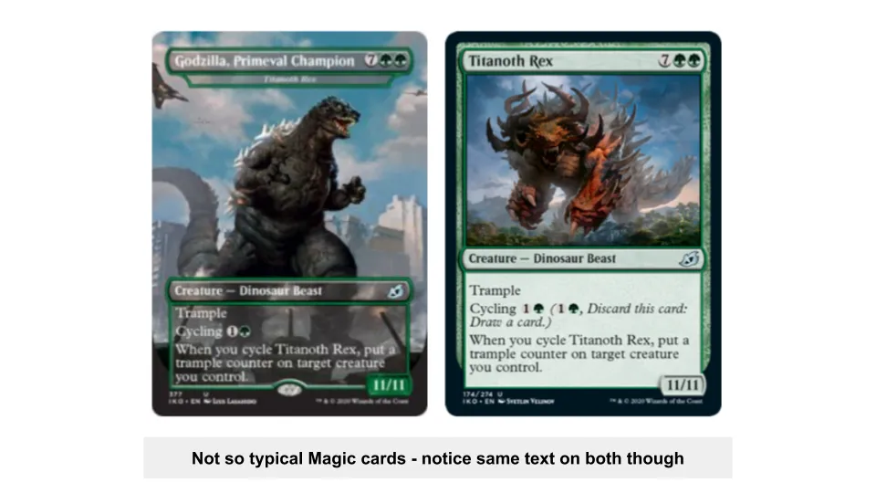
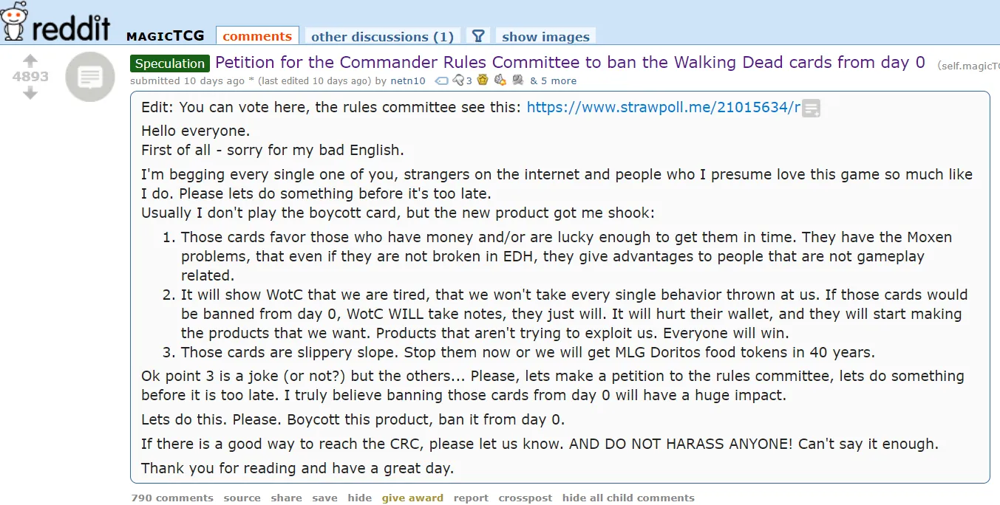

## テイクアウト

マジック:ザ・ギャザリングは収益性の高いカードゲームビジネスですが、過度な収益化のために自ら招いた論争に巻き込まれています

## カード、司令官、段ボールの割れ

段ボールはどれくらいかかるのでしょうか?

もしトレーディングカードゲームのカード[Black Lotus](https://mtg.gamepedia.com/Black_Lotus 'black')なら、27,000ドルで買えるかもしれません[Magic: The Gathering,](https://en.wikipedia.org/wiki/Magic:_The_Gathering 'MTG')。

しかも、[$166,000 at auction](https://www.ebay.com/itm/1993-Magic-The-Gathering-MTG-Alpha-Black-Lotus-R-A-BGS-9-5-GEM-MINT-PWCC-/143136537077?_trksid=p2047675.m43663.l10137&nordt=true&rt=nc&orig_cvip=true 'ebay') [^1]で売られているコピーを考えれば、それはお得かもしれません。トランプほどの大きさの段ボールが166,000ドルもするのです。

昔、私はよくマジックをプレイしていました。これは中毒性のある性質から、時に皮肉もなく「Cardboard Crack」と呼ばれるコレクタブルカードゲーム[^2]。このシーンは10年ほど追っていませんでしたが、最近の論争が私の興味を引きました。

バーン・ホバートの最近の[games vs metagames](https://diff.substack.com/p/the-gamerarbitrageur-to-generalist? 'Diff') [^3]の重要性に関する投稿と相まって、今月はそれについて書く運命かもしれません。今日は詳しく見ていきます:

1. 魔法の紹介とコミュニティの苦情に関する文脈
2. メタゲーミングとは何か、そしてマジックにおけるその関連性
3. 人気のマジックメタゲーム「コマンダー」における現在の論争

カード、[Commander,](https://magic.wizards.com/en/content/commander-format 'Commander')、[cardboard crack.](https://cardboard-crack.com/ 'crack')を見ていきましょう

## 1.マジック入門

論争を理解するには、もっと背景が必要です。マジックはトレーディングカードゲーム[^4]で、プレイヤーがカードのデッキを作り、互いに決闘します。カードには効果があり、相手のポイントをゼロにする[^5]が目的です。交互にカードを引き、出して、その効果を発動して目標を達成します[^6]。

カードは上場企業[Hasbro](https://investor.hasbro.com/investor-relations 'Hasbro')の子会社である[Wizards](https://magic.wizards.com/en 'Wizards')が**プライマリーマーケット**で発売します。ウィザーズは定期的に新しいカードを「セット」としてデザイン、印刷、販売します。ほとんどのカードは「ブースターパック」という形で地元の店舗で販売されています。これらのパックには新セットのランダムなカードが含まれており、開封する前に何が手に入るか分からない[^7]。

例えば、レアカード["Uro, Titan of Nature's Wrath"](https://scryfall.com/card/thb/229/uro-titan-of-natures-wrath 'Uro')を狙ってパックを買ったのに、代わりに["Bronzehide Lion."](https://gatherer.wizards.com/Pages/Card/Details.aspx?multiverseid=476461 'Lion')を手に入れてしまうかもしれません

多くの人が運に頼らずカードを購入することを好むため、**二次市場*も存在します。トレーダーはカードを購入し、マークアップで再販します。時間が経つにつれて、それは実質的に[stock market for the cards](https://www.mtgstocks.com/news 'MTG')となり、独自の投機家クラブを持つようになりました。前述の通り、これらのカードの中には非常に高価なものもあります。

特に、ウィザーズは単独で単発カードを販売することはほとんどありません。なぜなら、市場を操作できる[predatory.](https://mtg.gamepedia.com/Predator 'predator')と思われるのを避けるためです。なぜなら、彼らは単に紙を印刷するだけでいいからです。しかし、彼らは通常そうしません。コミュニティが崩壊するのを恐れているからです。例えば、ウィザーズが良いカードを直接500ドルで売った場合、どれほどの苦情があるか想像してみてください。これを覚えておいてください;後ほどこの話に戻ります。

**カードの需要は、デッキに使いたいプレイヤーから生まれます。公式の競技シーン(賞金付き)と、単に楽しむためのカジュアルなシーンがあります。競技でのカードの人気は、カジュアルプレイでの利用を促す要因の一つです。例えば、ウロが競技で人気を博し強力なカードとして知られれば、より多くの人がデッキに使いたがるかもしれません[^8]。ほとんどの市場と同様に、これによりカードの価格は上昇します。

**カードの価格が上がるもう一つの理由は供給不足です**(なんて大[shock](https://gatherer.wizards.com/pages/card/details.aspx?name=Shock 'shock')でしょう)。ウィザーズは定期的にセットでカードを印刷すると述べました。セットは一定期間印刷され、その後次のセットが引き継がれる時間になります。これにより、あるセットに入っていて二度と登場しないカードが希少性が生じます。

例えば、あるカードがセットAlphaに入っていても、セットBeta [^9]に入っていない場合があります。先ほどのブラックロータスカードは、二次市場で高価格になった[printed early on but never again,](https://mtg.gamepedia.com/Reserved_List 'mtg')カードの一つです。

「ランニング」スポーツに100m、200m、400mなどの「種目」があるのと同様に、マジックのゲームもウィザーズが[different formats](https://mtg.gamepedia.com/DCI#Tournament_formats 'format')を決めています。詳細を知る必要はありませんが、大きな違いは使えるカードの種類です。これは通常、最近リリースされたかどうかや「禁止」されているかどうかによります。

例えば、あるフォーマットでは最新の8セットと60枚のデッキでプレイし、別のフォーマットでは100枚のデッキの任意のカードを使うことができます。これはゲームのマッチングに影響するため、同じフォーマットのデッキ同士が対戦することになります。相手に知らせずに異なるフォーマットのデッキを使うのはマナー違反とされ、公式トーナメントでは期待されるフォーマットが明示されています。これがそのフォーマットの*メタゲーム**を決定し、この概念については後ほど詳しく説明します。

カジュアルシーンでも「ファンに人気」なフォーマットが生まれ、最も人気があったのは「コマンダー」です。** 繰り返しますが、コマンダーの詳細は重要ではなく、デッキ作りや対戦時に人々が選ぶ「メタ」ルールのセットだと考えてください[^10]。あなたのお父さんがモノポリーで最年長のプレイヤーが銀行のお金を使うというハウスルールを設けたように、プレイヤーコミュニティはフォーマットのルールを決めました。

コマンダーのルールはコミュニティ["rules committee,"](https://mtgcommander.net/index.php/faq/ 'RC')によって管理されており、ウィザーズとは独立しているとされています。委員会は、新たに印刷されるたびにどのカードをコマンダーに許可するかを決める際にプレイヤーのフィードバックを考慮しています。問題を引き起こすのはたいてい新しいカードで、古いカードは定義上、人々が使うための時間が長く存在しているため、ゲームを壊すような相互作用は発見されるべきです。

委員会はルールを厳格に強制しません。カジュアルゲームではそれは不可能だからです。しかし、プレイヤーが従う標準的なガイドラインとして機能しています。例えば、「ウロ」は禁止されていると記載されているかもしれません。もし見知らぬ人とコマンダーをプレイしてウロを使ったら、彼女は続けたくないでしょう。しかし、好きなカードで遊ぶことに同意することも可能です。ウロも含めて。

これでマジックとは何かがわかりました。新しいカードが定期的に印刷され、市場によってカード価格は決まり、異なるフォーマットの制限によって異なるメタゲームが生まれるトレーディングカードゲームです。その最後の概念をさらに掘り下げてみましょう。

## 2.メタゲーミング・マジック

あなたがウィザードでカードを作っていると想像してください。カードをプレイし、望ましくするためには、[balance](https://gatherer.wizards.com/Pages/Card/Details.aspx?multiverseid=413544 'balance')を打たなければなりません。効果を弱すぎると誰も欲しがりません。強すぎると、みんなが使ってしまいます。

極端な例として、「このカードを引くとゲームに勝つ」と書かれたカードを作ったと想像してください。みんながプレイしますが、ゲーム自体はもう楽しくなくなります。

だからこそ、かっこいいカードを作る必要がありますが、そのカードがプレイされるフォーマットを「壊す」ほどかっこよくないものが必要です。もしすべてのデッキにカードが現れるのに気づき始めたら、それはやりすぎたサイン[^11]。

最適なデッキとカードがマジックフォーマットの「メタゲーム」を形成します。競技的にプレイするなら、勝率が最も高いカードを選びたいものです。プレイヤーは理論構築や実験を通じてそれらを発見します。どのカードが良いかだけでなく、[^12]でプレイしているフォーマットに合ったカードがどれかを知ることができます。

バランスの取れたメタでは、他のデッキより「強い」デッキがいくつか存在しますが、単一の支配的なデッキはありません。例えば、あなたのリスデッキは私のゴブリンデッキに勝っても、平均的には妖精デッキに負けます。

バランスの悪いメタでは、他のデッキより「優れている」デッキは一つだけ存在します。例えば、あなたのエレメンタルデッキが他のデッキに対して有利な勝率を持っている場合もあります。そうなると、それは合理的です[everyone to start playing that deck if they want to win.](https://magic.gg/news/2020-season-grand-finals-metagame-breakdown 'mtg')想像できるように、**すぐに飽きてしまいます。**

その場合、一つの解決策は「強すぎる」カードを禁止することです。前述の通り、公式フォーマットではウィザーズが使用不能なカードを指定します。非公式フォーマット「コマンダー」では、コミュニティルール委員会がカードを選びます。**禁止はバランスを取るための手段です。**

ここから現在の論争が始まる。

## 3.友情は魔法です

ほとんどの場合、新たに印刷されたカードはマジックのマルチバースの一部であり、マジックのIPであり、もともとはマジックのために作られたものです。マジックは主にファンタジーを基盤としており、天使やドラゴンのようなカードがあります。

最近では[^13]、ウィザーズは外部との提携を増やしています。これは通常、他のIPを基にしたカスタムカードを作成することを指します。例えば、チャリティのための資金調達[a My Little Pony series](https://magic.wizards.com/en/articles/archive/news/magic-extra-life-2019-10-03 'pony'):

あるいは[Godzilla themed series as alternate art for some cards:](https://articles.starcitygames.com/news/all-19-godzilla-series-monster-cards-revealed/ 'zilla')

さて、司令官ルール委員会の立場になってみて。これらのカードが公開されたとき、フォーマットで許可すべきか?

美的な議論は[^14]別として、簡単に「はい」と言えない理由は、これらの特殊カードにはしばしば**ゲームのバランスを崩す特殊効果*が付いているからです。** 例えば、その能力[Princess Twilight Sparkle](https://shop.tcgplayer.com/magic/ponies-the-galloping/princess-twilight-sparkle 'pony')[one powerful pony.](https://www.reddit.com/r/CompetitiveEDH/comments/dczkyh/twilight_sparkles_metarending_magic/ 'pony')

歴史的に、ウィザーズは曖昧さを避けるためにいくつかのことをしました:

1. 特別な「楽しい」カードを銀色の枠付きで作ること。銀色の縁取りカードは「通常」プレイでは禁止されるという一律ルールを設けたことで、ウィザードはメタゲームに影響を与えずに好きなカードを印刷できました
2. 特殊カードは黒枠で「合法」なカードと同じ効果を持つが、アートが異なる。これらのカードは通常セットの一部として印刷され、ゲーム内でバランス調整されているため、メタゲームに大きな影響はないはずだ

**ここで論争があります。**ウィザーズは最近[limited edition set of new cards in partnership with TV show The Walking Dead.](https://secretlair.wizards.com/us/product/612738/secret-lair-x-the-walking-dead 'dead')をリリースしました。これらのユニークなカードは、ウィザーズが印刷を終了するまでの期間しか入手できません。重要なのは、これらは黒い縁取り(「合法的」)で、このボックスセット以外では入手できません。ご想像の通り、このボックスセットは高額な価格で販売されています。

**これらのカードは合法であるべきでしょうか?** ウィザーズ公式サイトによると:

>注:これらは新品カードであり、再版やメインセットの一部ではありません。したがって、スタンダードでは合法ではありませんが、コマンダーには完璧です!

上記を明確にするために言うと、ウィザーズはカジュアルな「コマンダー」フォーマットを明確に指摘し、それに合わせてカードをデザインし、限定生産でプレミアム価格で直接販売しています。

なぜこれがそうなったのか、ご想像いただけるでしょう[made many players upset, ](https://twitter.com/wizards_magic/status/1312987380115148805?s=20 'twitter') [calling for the cards to be banned immediately.](https://www.reddit.com/r/magicTCG/comments/j1glk8/petition_for_the_commander_rules_committee_to_ban/ 'ban')

ちょっと待って、_Rules Committee_がどのカードを許可するか決めるんじゃなかったの?実際、一部のプレイヤーは委員会が独自に行動し、『コマンダー』でカードを犯罪者と宣言することを期待していました。

[Unfortunately not.](https://mtgcommander.net/index.php/2020/10/02/rc-statement-on-secret-lair-the-walking-dead/ 'dead')

おそらく、ここで矛盾する動機があることのヒントがあるでしょう。[main complaints first](https://twitter.com/ghirapurigears/status/1313145100319494145?s=20 'twitter') [^15]を詳しく見てみましょう。

**1.カードの入手可能性。** これらのカードはライセンスの問題により再版されることはありません。これは将来のセットで再版される他のカードとは異なります。これにより供給やカードを入手できる人々の制限が人工的に制限されます。

**2.露骨な搾取的な販売です。** カードは公式フォーマットでは「合法」ではなく、カジュアルなコマンダーフォーマットでのみ有効です。カードを使いたい場合は、供給が限られているためプレミアムで購入する必要があります。

**3.これがトレンドの始まりではないかと心配してください。** 人々はウィザードが利益を上げる必要があると理解しているのでブースターパックには問題ありません。しかし、もしウィザーズが直接高値でカードを販売し始めたらどうなるでしょうか?もし「強力な」カードを500ドルで売って禁止しなければ、プレイヤーは競争力を維持するためにそのカードを買わなければなりません。メタゲームは台無しになります。

では、ウィザードの理由を見てみましょう。

あ、違いました、画像が違いました:

はい、何もわかりません。かなり露骨な金儲けです。ハズブロ(ウィザーズの親会社)の目標を考えれば、ウィザーズチームがより多くのカードをより高い価格で売る方法を模索する動機があるのも無理は[doubling Wizards revenue over the next five years,](https://investor.hasbro.com/static-files/88b2a83b-2368-463a-9489-6cf31dc209ac 'wizards')[^16]。より多くのボリューム、高い価格、より高い価値倍率。もし人々がカードに100ドルの市場価格を払う覚悟があるなら、なぜブースターパックではなく直接カードを印刷して販売しないのでしょうか?

ウィザーズは1) カードを銀色の枠付きで「違法」にするか、2) 他の「合法」カードの別アートバージョンを作ることもできたはずです。1) 銀色の縁取りカードは黒い縁取りカードよりも売れないし、2) 何か魔法的な理由で(おそらくお金のため)やらなかった

さらに悪いことに、カードはコマンダーフォーマットをターゲットにしています。なぜなら、それがコマンダーの人気の大きな要因の一つ、あるいは[most popular format.](https://www.dicebreaker.com/categories/trading-card-game/how-to/magic-the-gathering-popular-formats 'mtg')になっているからです。コマンダーの人気の大きな要因?ウィザーズは「公式」フォーマットのメタゲームを壊し、バランスが悪すぎるカードを印刷し、ゲームを退屈にしました。

ルール委員会の立場は羨ましくありません。カードを禁止することもできましたが、それはウィザーズの明白な[betrayal](https://gatherer.wizards.com/pages/card/Details.aspx?multiverseid=3633 'betrayal')です。最悪の場合、ウィザーズがそれを覆してコマンダーの支配権を取り戻し、ファン向けの[^17]ではなく「公式」フォーマットにすることも可能です。

選手たちはこれを黙って受け入れておらず、[complaining vocally on public threads,](https://www.reddit.com/r/magicTCG/comments/j204ww/has_anyone_completely_lost_confidence_in_wotc_and/g73xmqe/?context=1 'complain') [listing demands to be met before they return to the game](https://www.reddit.com/r/magicTCG/comments/j67brt/for_those_who_are_choosing_to_no_longer_spend/ 'game')、[creating a new format, "Captain."](https://twitter.com/PlayCaptainMTG/status/1313164508068810752?s=20 'captain')これらの要素が実際にマネープリンターであるマジック[^18]に影響を与えるかどうかはまだ分かりません。

実は[selling paper is hard work.](https://www.youtube.com/watch?v=1QQBB3cwNM0 'prices')この論争は、より一般的に当てはまるいくつかの事柄を浮き彫りにしています。

1. ユーザーは収益化すれば理解しますが、あまりにも攻撃的すぎると怒ります。考えてみてください[a rake too far](http://abovethecrowd.com/2013/04/18/a-rake-too-far-optimal-platformpricing-strategy/ 'rake')
2. 間違いに対する返答は、間違いを避けようとするよりも重要かもしれません。実際の謝罪と口先だけの謝罪を考えてみてください
3. 公式組織と連携するコミュニティ運営のグループは、組織に従わざるを得なくなります。責任と権威、そして実際に誰が何を持っているかを考えてみてください

もしかしたら本当の魔法は、道中でできたすべての友人たちかもしれない。

## その他のリソースで詳しく知ることができます

1. ケンドラ・スミスが、なぜこれが物議を醸すのかについて、MTGの歴史について素晴らしい記事を書いています[here](https://www.coolstuffinc.com/a/kendrasmith-09302020-the-problem-with-the-walking-dead-secret-lair 'kendra')
2. @ghirapurigears苦情の詳細を掲載したスレッドをツイートしました[here](https://twitter.com/ghirapurigears/status/1313145100319494145?s=20 'twitter')
3. YouTuberのミッチがウィザーズが他の主張に良い反論をしています[here](https://www.youtube.com/watch?v=degV1Masii8 'commander')

[^1]: 本文を簡略化していますが、カードの状態が価格差の一因かもしれません。トレーディングカードは、その状態や[Beckett Grading Services](https://www.cardboardconnection.com/collectopedia/card-grading-companies/beckett-grading-services-bgs#:~:text=Fees%20for%20BGS%20and%20BVG,card%20for%20especially%20large%20batches. 'beckett')のようなサービスによる「使用」状況で評価されます。16万6千ドルのロータスは初期の印刷時からほぼ完璧な状態でした。

[^2]:[here](https://cardboard-crack.com/ 'crack')というフレーズにちなんだ名前のウェブコミックもあります。あと、念のため言っておくと、私はマジックがあまり得意ではありませんでした。数年経ってからはリミテッドドラフトの方が楽しくなりました。その時も構築デッキは私には高価だったので。

[^3]:「ゲーム自体は限られていますが、メタゲーム自体はそうではありません。しかし、コアゲームが得意でなければ、メタについての知識はほとんど役に立ちません。」

[^4]:実はこれは最初のトレーディングカードゲームで、フォーマットを作り出したものです。いわばオリジナルのゲームです。

[^5]:これは明らかに簡略化した説明であり、ルールについてはもっと詳しく[here](https://magic.wizards.com/en/game-info/gameplay/rules-and-formats/rules 'rules')読むことができます。カードの種類はいくつかあり、一時的なものもあれば永続的なものもあります。すべてが相手のポイント(ライフ総量)に直接影響するわけではありません。2005年には少なくとも[28 ways to win a game of Magic](https://magic.wizards.com/en/articles/archive/arcana/let-me-count-ways-2005-08-15 'MTG')種類がありました

[^6]:エッグデッキと対戦している場合を除いて、相手が何時間も動くのをただ見ているだけで、もう何[walk away while they're playing](https://www.reddit.com/r/spikes/comments/1ai0my/modern_lets_talk_about_eggs/ 'eggs')

[^7]:ウィザーズは多くの既成デッキも販売していますが、簡潔に説明しました。また、私の勘違いかもしれませんし、ジット/ラッツのデッキ大失敗以降、カードを一枚手に入れるためにデッキを買うことはなくなったと思います。ただ、Nexus of Fateのプロモーションも問題がありました。ただ、私はしばらくマジックを追っていません。

[^8]:この場合の実際の例です。ウロはその後、強力すぎるとして[been banned](https://gamerant.com/magic-the-gathering-uro-ban/ 'ban')されています。具体的に何から禁止されたのですか?競技会からカードを禁止するのは理にかなっていますが、カジュアルなフォーマットで誰かが使うのをどうやって止めるのでしょうか?これは論争に関連する質問なので、ぜひ読み進めてください。

[^9]:アルファとベータはマジックの実際のセットですが、今回は偽の例です。アルファのカードはベータ版でも印刷されていたと思いますし、[some new cards were actually added in Beta](https://mtg.gamepedia.com/Beta 'beta')

[^10]:変更点には、複数のプレイヤーと対戦できる可能性、デッキにより多くのカードを持つこと、特定の種類のカードに制限すること、そして特別なカード「コマンダー」を用意することが含まれます。コマンダーは、特定のドラゴンカードをコマンダーとして使う起源から「エルダードラゴンハイランダー」とも呼ばれていました。

[^11]:ウィザーズは公に、[FIRE philosophy](https://magic.wizards.com/en/articles/archive/card-preview/fire-it-2019-06-21 'mtg')マジックを楽しく、魅力的で、リプレイ性があり、ワクワクさせるものにしたいと主張しています。

[^12]:覚えているなら、これは以前書いた[relative vs absolute skill](/writing/relative_billionaire 'relative')のポイントに似ています。あなたのデッキが絶対的に良いデッキかどうかは重要ではなく、競技でよく対峙する典型的なデッキ、つまり「メタ」と比べてどうなるかが重要です

[^13]:実はウィザーズが外部IPを導入するのはこれが初めてではなく、アラビアンナイトや三国志のようなセットは、名前の由来を基にしています。簡潔さのために本文ではその点は省いています。

[^14]:[alters](https://magicalter.com/ 'alter')が存在し、[harmless offering](http://www.mtgmintcard.com/articles/writers/freyalise/holistic-wisdom-10-cutest-cards-ever 'harm')合法カードであることを考えると、異なるIPがゲームを台無しにするという不満は、後で詳しく述べる議論ほど強くは感じません。ただし、声高なプレイヤーグループには重要です。

[^15]:多くの苦情がありましたが、より強い主張があり、より多くの人が意見を述べたものに焦点を当てたいと思います。

[^16]:感謝、redditスレッド[here](https://www.reddit.com/r/magicTCG/comments/j6rwjc/hasbro_goal_double_wotc_revenue_will_this_destroy/ 'reddit')

[^17]:前述の通り、プレイヤーがルール委員会を無視して友人同士でカードを禁止することに何の障害もありません。この騒動は、プレイヤーがルール委員会がプレイヤーの利益に反していることに気づき、発表で重要な問題を回避して無視していることが一因です。誰もがこれが金儲けを狙ったものだと知っています

[^18]:はっきりさせておくと、私はハズブロを空売りすることを勧めているわけではありません。私には十分な専門知識がないので予測できませんし、マジックがこの状況を乗り越えて成長し続け、複数の人気IPに拡大し続ける可能性はおそらく80%あると思います。紙にお金を払う裕福な人たちも多いです。
