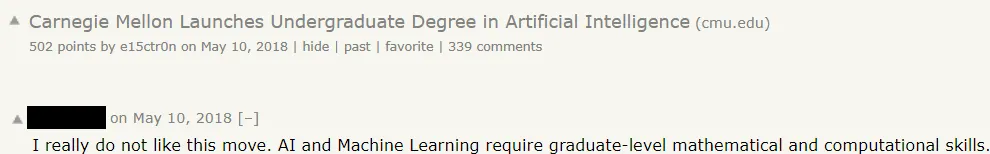
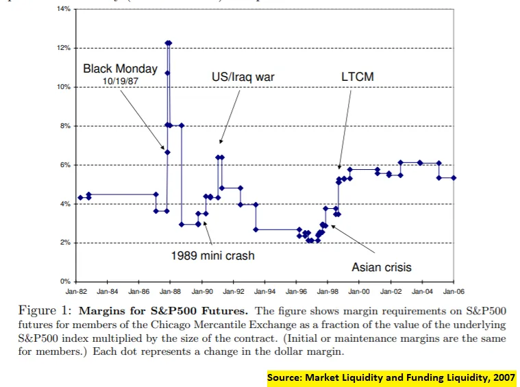
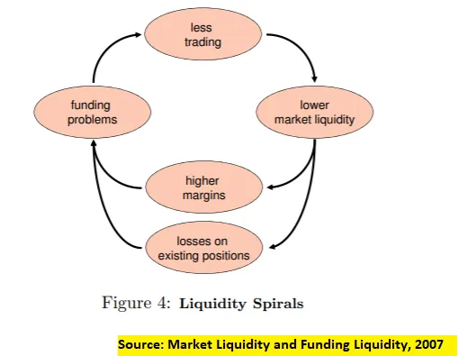

## テイクアウェイ

1. ゲートキーピングは通常、集団の地位ではなく個人の地位を守るために行われ、避けるべきです
2. 資本コストと流動性の低下スパイラルはフィードバックループで結びついています

## 1.グループと個人の地位のゲートキーピング

これを見たことがあるでしょう。

初心者で、目を見輝き、気持ちが高ぶる人は、その分野の始め方についてアドバイスを求めて来るでしょう。

そして多くの専門家は、それは不可能だと言い、何年もかけて前提条件を学ぶべきだと言い、そもそも質問をしたことを恥ずかしく思うべきだと言[emerge from the depths](https://youtu.be/Y2fwe0rnHak?t=118 'balrog')。_「学費を払わずに済むと思った人たちの厚かましさ。」_

一部の「専門家」は、初心者向けのコースを始める際に不満の理由を見つけ出します。

ゲートキーピングはいつも見られますが、それは主に地位を守るために行われています。正当なゲートキーピングの形態もいくつかあり、それについては後ほど触れます。しかしほとんどの場合、それは人を排除し意地悪をするために行われます。面白いことに、ゲートキーパーたちは自分たちも排除される可能性があることに気づいていないようです。

例えば、微積分、統計学、線形代数を学ばなければ機械学習を始められないと言えるでしょう。これは上のコメントにもあるように。

また、線形代数を始めるには群論を学ばないと言えるかもしれませんが、[matrices are a ring](https://www.youtube.com/watch?v=_RTHvweHlhE 'ring')や、[when to work with linear groups or not](https://www.youtube.com/watch?v=AJTRwhSZJWw 'group') [^1]

さらに言えば、上記のことは学[set theory](https://plato.stanford.edu/entries/set-theory/ 'set')、[Peano axioms](https://en.wikipedia.org/wiki/Peano_axioms 'Peano')、[philosophy](https://plato.stanford.edu/entries/philosophy-mathematics/ 'philo')によって異なると言えるでしょう。コメント投稿者は学部時代にどれだけ勉強したのか気になりますね。

望めば、何でもゲートキープできる。

**それに、始められないからどこにも進まないだろう。**

ゲートキーピングには正当な形があります。コミュニティに害を及ぼすから誰かを除外するなら、それは合理的です。例えば、あなたがビデオゲーマーのグループを作っていて、ビデオゲームを禁止したいという人から会員登録のリクエストが来たら、その人を受け入れるのはおそらく意味がないでしょう。

しかし多くの場合、ゲートキーピングは「イングループ」の個人が自分の地位を維持しようとする試みであり、人々が知っていることを知れば知るほど損をしているかのように扱われます。それは不安から来ています。自分の行動を他人にもできることを他人に気づかせることを恐れている人たちから来ています。先月書いたように、それは宝くじに当たるようなもので、おそらく悪い考えです。例えば、印象派の画家たちは最初はゲートキープされていましたが、今の彼らの芸術への影響を見[^2]。

ただし、門番たちの言うことは完全に間違っているわけではありません。**実際、彼らの提案はしばしば理にかなっています。** 例えば、機械学習を学ぶ際に線形代数を知っておくと非常に役立ちます。そして専門家になりたいなら、必要な数学をすべて習得しなければなりません[^3]。しかし、人為的に科目を始めるのを妨げることは誰の助けにもなりません。より良い対応は「はい、始めるにはもっと簡単なコースがあります。後で基礎を見直しに戻ってきてください」というものだったでしょう。無効にするのではなく、有効にする。

もしゲートキーピングに偏っているなら、コミュニティのためになっているのか、それとも自分自身を助けているのかを考え[^4]。もし自分でこのニュースレターを読むことを選んだなら、もっと良い選択肢が出せるはずです。

分野は十分に大きいので、多くの人が追い求めるほど良いのです。ゼロサムゲームであることはほとんどなく、むしろ[infinite game](https://fs.blog/2020/02/finite-and-infinite-games-two-ways-to-play-the-game-of-life/ 'infinite')です。初心者を受け入れ、心を開くことで、私たちはパイ全体を成長させ、自分たちのためにより多くのものを手に入れることができます。それが個人として進歩を推進する方法であり、ケーキを食べながらも手に入れる方法です。

もっと門を開ければ、[be kind.](https://www.youtube.com/watch?v=xnouj9Yz-Gs&feature=youtu.be&t=23 'who')

## 2.流動性スパイラル

これも以前に見たことがあるでしょう。

市場は順調に動き、市場の均衡を行い、買い手と売り手をマッチングしています。突然ショックが起こると、市場は凍結し、「流動性の低い」状態になります。

例えば、[how flour was in short supply a while back](https://www.theatlantic.com/health/archive/2020/05/why-theres-no-flour-during-coronavirus/611527/ 'flour') [^5]。

また、08年の危機が銀行機関に取り付け騒ぎを引き起こし、一部の機関を破産に追い込んだことについても。

そして今年初めに、危機の原因は資本ではなく流動性であると議論したことを思い出してください。

今日はマルクス・ブルンナーマイヤーとラッセ・ペダーセンによる論文のハイライト["Market Liquidity and Funding Liquidity"](https://www.nber.org/system/files/working_papers/w12939/w12939.pdf 'Markus')見ていきます。論文は長く、主に数学的な[^6]ですが、結論を振り返ることは可能です。

マルクスとラッセは、これらの流動性の低下のスパイラルの原因を調査し、資本コスト[^7]流動性とフィードバックループで働くことを明らかにしました。資金調達が難しく、流動性は低く、ボラティリティが高い。

まずマージン要件[^8]を見て、危機に応じてどのように変化するかを観察します。予想通り、(ここでコストの役割を担う)マージンは不確実性が高いほど流動性が低くなり、不確実性が低いほど流動性が高くなります。

流動性を減らすもう一つの方法は、参加者の資本を減らすことです:

>重要なのは、いかなる均衡選択も、小さな投機家の損失が市場の流動性の断続的な低下を引き起こすという性質を持っていることです。この「突然の枯渇」や市場流動性の脆弱性は、投機家資本が高額であれば市場が流動均衡にある必要があり、投機家資本が十分に減少すれば、市場は最終的に低流動性・高利益率均衡に切り替える必要があるためです

これが流動性の低下の悪循環を二通りに引き起こす可能性があります。

>まず、市場の流動性不足でマージンが増加する場合、「マージンスパイラル」が発生します。投機家の富の減少が市場の流動性を低下させ、マージンが上昇し、投機家の資金調達の制約がさらに厳しくなる、という具合です

> 第二に、「損失スパイラル」は、投機家が顧客の需要ショックと負の相関を持つ大きな初期ポジションを保有する場合に発生します

前者は説明不要のようです。二つ目は、強制販売者であれば価格が大幅に下がり、さらに売らなければならないということです。

これにより、投資家と中央銀行の双方にとって結論が出ます。

投資家にとっては、安全圏の重要性を提起しており、これは明白に思えます。

>最後に、資金調達の制約が拘束力を持つリスク自体が、投機家の市場流動性提供を制限します。私たちの分析は、投機家の最適な(資金調達)リスク管理方針は「安全バッファ」を維持することであることを示しています。

より興味深いのは、中央銀行と金融政策について彼らが結論づけていることです。

>中央銀行は資金流動性を管理することで市場の流動性問題を緩和することができます。もし中央銀行が典型的な投機家の金融業者よりも流動性ショックとファンダメンタルショックの区別が優れているなら、その情報を伝え、資金提供者に資金調達要件の緩和を促すことができます

>中央銀行は流動性危機時に投機家の資金調達条件を改善したり、危機時に追加資金を提供する意向を表明したりすることで市場の流動性を向上させることもできます

**それが今日の市場で見られる現象です。**ここで中央銀行ができることは3つあります:1) 情報を伝達すること、2) 資金提供、3) 単に「資金を提供するかもしれない」と言うこと;最終的には必ずしも資金を提供する必要がないかもしれません。現在の危機では、[markets recovered after (3), even though the actual funding provided was small.](https://www.ft.com/content/a1fba7cd-5329-46e6-82a8-57149e409f6c 'fed')

連邦準備制度でさえ、最後の手段の門番ではないことに気づいています。

## その他

1. [A brief history of graphics (youtube video)](https://www.youtube.com/watch?v=QyjyWUrHsFc&list=WL&index=8 'gfx')
2. ["Colour blindness is an inaccurate term"](https://commandcenter.blogspot.com/2020/09/color-blindness-is-inaccurate-term.html 'colour')。色覚異常の私にとっては、特に新しい情報があったので面白かったです
3. ["The long tail turns out toe be a major cause of the economic challenges of building AI businesses"](https://a16z.com/2020/08/12/taming-the-tail-adventures-in-improving-ai-economics/ 'a16z')
4. [Intro to abstract algebra and group theory by Socratica (youtube series)](https://www.youtube.com/watch?v=IP7nW_hKB7I 'aa')。初心者に適している推奨。
5. ["Fusion reactor very likely to work"](https://futurism.com/mit-researchers-fusion-reactor-very-likely-work 'fusion')

[^1]:今年まで群論を知らなかったので、今年学んだ中で最も興味深いことだと言わざるを得ません。代数の「物」や「演算」をあのように定義する理由を直感的に理解するのに大いに役立ちました。例えば、なぜ行列の乗算は可換ではないのでしょうか?

[^2]:印象派は最初にその名前を得た[from critics ridiculing them for their "unfinished" artwork that were mere "impressions"](https://smarthistory.org/how-the-impressionists-got-their-name/ 'art')

[^3]:はっきりさせておくと、機械学習が上達するには微積分、統計、線形代数などが得意であるべきだという点には同意します。コメント主の言う通りです。必要なことをすべて学んでいないからといって、何年もゲートキープするべきだという意見には賛成です

[^4]:安全面の問題については議論を省略しています。例えば、登ったことがない人にフリーソロを制限すべきだという話です。読者の皆さんには常識があると信じています。あまり無理なお願いでなければいいのですが

[^5]:例としてトイレットペーパーは使っていません。それは、以前バイラルになった人気のTPメディアの記事に対して強い意見を持っているからで、その記事はほとんど不正確だと私は思っています。それについて書く予定で、そういった「直感に反する説明をする」ような記事は直感に反するわけではなく、ただ間違っているだけです。まだ時間が取れていません。

[^6]:また、論文の数学的構造を完全には理解していないことを正直にお伝えします。特に、投機家による偏ったリターンの結論について、私はあまり理解できません。

[^7]:資本コストが何を意味するかを知らない読者のために説明すると、資金調達のコストと考えてください。以前にも詳しく書いています[here](/writing/capital 'sub')

[^8]:「トレーダー、例えばディーラー、ヘッジファンド、投資銀行が証券を購入する際、その証券を担保として借り入れはできますが、全額を借りることはできません。証券の価格と担保価値の差額(マージンと表記)は、トレーダー自身の資本で賄われなければなりません。」
