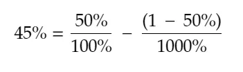
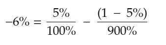
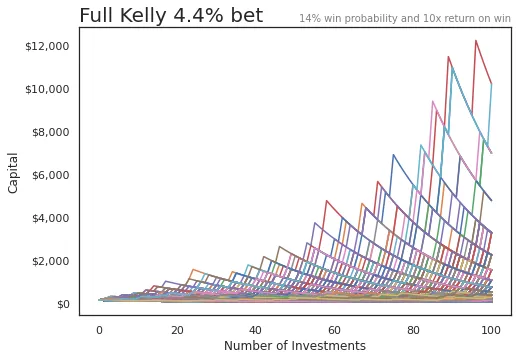
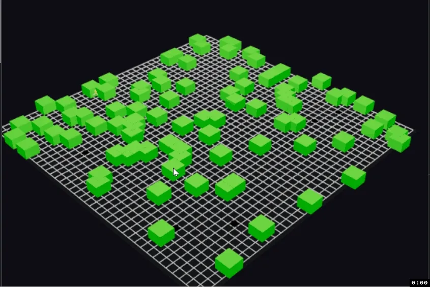
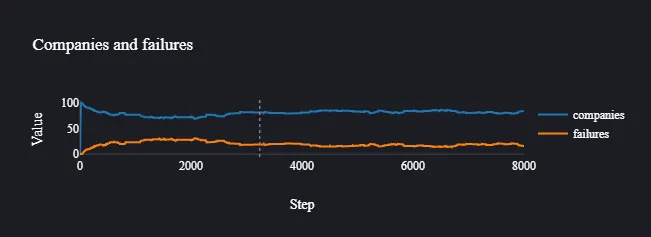

## 要点

1. ケリー基準はポートフォリオのサイズを数学的に決める方法ですが、前提には注意が必要です
2. HASH\.ai エージェントベースのシミュレーションを容易にしています。私は起動失敗率をモデル化しようとしています

## 1\. ポートフォリオサイズのケリー基準

サラはエンジェル投資家志望です。彼女の友人ニコラス、アリソン、チェイスは害虫駆除に関する魔法のようなビジネスアイデアを思いつき、サラはそれが大ヒットすると考えています。

サラはこのビジネスに生涯分の貯金を3回分投資しようとしていたが、彼女の他の友人グループがいた [^1] セス、マーク、エマ、アンバーもウサギを使った同じくワクワクするアイデアを提案します。

サラは自分に複数の選択肢があることに気づき、どうすればいいのか分からない。彼女は年上の友人アンソニーに相談しに行く。アンソニーは投資分野を注意深く見守っている。アンソニーは、彼女は正しい道を歩んでいると言い、ポートフォリオ配分とリスク\/リターンのペイオフこそが成功する投資家になる鍵だと言う。また、彼女に [Kelly criterion,](https://www.princeton.edu/~wbialek/rome/refs/kelly_56.pdf 'Kelly') 賭けのサイズ計算の公式。

ケリー公式はベル研究所のジョン・ケリーによって開発されました。いくつかの入力を受けて、 **何かに賭けるための資本の最適割合、** 長期的なリターンを最大化したいと仮定して。私は付録に簡略化された導出を投稿しており、それも見つけられます [here](https://blogs.cfainstitute.org/investor/2018/06/14/the-kelly-criterion-you-dont-know-the-half-of-it/ 'derive') あるいは元の論文に記載されている。

数学は怖いと承知していますが、例を挙げてみましょう。コイントスでいくら賭けるべきか知りたいです。コイントスでは、お金を倍にするか負けるかのどちらかです。数字を入力すると\:

そう、正しく読んだよ。ケリーは、何もリスクを取らない方がいいって言ってる。なぜ\?

あなたには優位性がなく、リスクとリターンのバランスも正しいので、最善の選択肢は賭けないことです。

では、同じコイントスで賭けに11倍\(1000\%\)のリターンが与えられ、他のすべては変わらないと想像してください。数字を代入すると\:

ケリーは、総資本の45\%を賭けるべきだと言っています。これほど魅力的なオッズでも、全てのお金を賭けているわけではないことに注意してください [^2]\.また、賭けを全部失う可能性があるゲームでは、100\%勝つ確率があると信じない限りオールインしないこともわかります。

[Michael Mauboussin and Ed Thorp elaborate on the attractive features of the Kelly system:](http://www.capatcolumbia.com/MM%20LMCM%20reports/Size%20Matters.pdf 'Michael')

1. 破産の可能性は「小さい」です。ケリーシステムは比例賭けに基づいているため、理論上は資本を失うことは不可能ですが、それでもボラティリティの急増は起こります
2. ケリーシステムは他のシステムよりも資金を速く増やす可能性が高いです
3. 通常、最も短い平均時間で指定されたレベルの当選金に到達する傾向があります

これがエンジェル投資の面でどのように役立つのでしょうか\?非常に単純化した仮定をいくつかしなければなりません [^3]しかし、ケリーが投資あたりの配分額の目安を教えてくれます。

ケリーは3つの入力を取ることがわかっています――勝利確率の信念、損失の割合、そして利益の割合です。 [Correlation Ventures and Seth Levine](https://www.sethlevine.com/archives/2020/10/vc-fund-returns-are-more-skewed-than-you-think.html 'Seth') 下にVCのリターンを時間経過で示した良いチャートがありますので、それを私の仮定の基礎として使います。

簡単に言うと、10倍\(900\%\)以上のリターンは勝ちとみなし、それ以外はすべて損失とみなします。グラフからすると、約5\%の確率で勝つことになります。さらに単純化すると、負けた時は賭けの100\%を失い、勝った時は900\%の利益を得ると仮定します。これらの初期仮定の下で、次のようになります\:

うーん。それは良くないね。今の前提では、ケリーはVC投資は悪い取引だと言っている。これを最初に見たときは二度見して、このニュースレター号をどうやって書き終えるのか考えた [^4]\.私が出た答えは、ズルすることだった。たくさん。

5\%の勝率の代わりに、エンジェル投資家が自分が平均以上だと信じて投資に臨み、少なくとも投資が回収できると仮定しましょう。彼らは自分の勝率が基準レートより高いと信じています。オッズに対して有利だと信じなければ、何かに賭けることはありません。

つまり、グラフ上の\<1xの部分はすべて無視し、私たちの宇宙は残りだと仮定します。その5\%の勝率は約14\%に跳ね上がります [^5]\.その他の条件は一定に保ちます。これらの新しい仮定の下で、次のようになります\:

少なくともそれで私たちは対応できる。今は仮定を受け入れて、後でまた見直す。

リターンがどのようなものかを見るために、100件連続してそのような投資を行ったと仮定しましょう。1\,000回のシミュレーションを行います。つまり、上記の仮定のもとで100社の企業に投資する1\,000の宇宙を想像します。 [I'm using this Colab file here if you want to follow along](https://colab.research.google.com/drive/1YeMnl2QOQdCAGGxCDr2pfDk_HFgCh02D?usp=sharing 'Colab')

予想通り、私たちの仕組まれたゲームでは大金を稼いでいます\:

ただし、いくつか注意すべき点があります。大きな下落\(すべての下落\)を見てください。多くのポートフォリオは最終的に半分以上を失います。リターンは大きなボラティリティの急増を伴います。

それに、私たちは走りました _千_ シミュレーション。大きなリターンはグラフ上で目立つが、実際にはそれほど多くはない。ほとんどのケースは下部近くにぎりついに集まっている。

リスクを減らすために、多くの人は「フラクショナル・ケリー」方式を採用し、ケリー推奨サイズのごく一部を賭ける方法を選びます。ここでは、推奨額の半分\(2\%\)だけ賭けるシナリオをシミュレーションします。

これら両方のリターン分布を詳しく見てみましょう。はっきりとは見えにくいですが、ボックスプロットは典型的な25パーセンタイル、中央値、75パーセンタイルの範囲を示しています。私たちは100ドルから始めました\:

例外的なケースを除外すると、すべてのシミュレーションのリターンの25パーセンタイルから75パーセンタイルははるかに小さい範囲にあります。

そして「より安全な」ハーフケリーのアプローチに目を向けると、ほとんどの場合、5倍未満のリターンしか得られないことがわかります。

**要するに、エンジェル投資をする場合は強い信念が必要で、多くの投資を行い、資本の一部だけを一度に投資するのが良いでしょう。** それでも、伝説上の100倍のリターンの可能性は低いです。これは最適な賭け戦略のもとであり、すでに複数の方法でゲームを操作しています。

- 私たちは大量の敗者を排除しました
- 私たちは二項結果を仮定しました
- 私たちは固定勝負支払いを前提としていました
- 賭けは連続して行われるものだと思っていました
- 私たちは多くの賭けができると思っていました

これらは現実の生活とは違います。上記は大幅な単純化に過ぎません。とはいえ、 **少なくともケリーを使って破滅のリスクを減らすことはできる。**

さらに調べたいなら、ヴァシリー・ネクラーソフの論文があります [here](https://papers.ssrn.com/sol3/papers.cfm?abstract_id=2259133 'paper') その方がずっと良いモデルですが、数学的には私には分かりません。Python Colabファイルは [here](https://colab.research.google.com/drive/1YeMnl2QOQdCAGGxCDr2pfDk_HFgCh02D?usp=sharing 'colab') 基本シミュレーションの仮定をいじりたいなら [^6]\.

### ケリー基準の詳細については\:

1. [The Kelly Criterion: Multiple Investment Opportunities by Christian Aichinger](https://greek0.net/blog/2018/04/17/kelly_criterion2/)
2. [The Kelly Criterion: You Don’t Know the Half of It by Alon Bochman](https://blogs.cfainstitute.org/investor/2018/06/14/the-kelly-criterion-you-dont-know-the-half-of-it/)
3. [Python Risk Management: Kelly Criterion by Lester Leong](https://towardsdatascience.com/python-risk-management-kelly-criterion-526e8fb6d6fd)
4. [Practical Implementation of the Kelly Criterion by Andrea Carta and Claudio Conversano](https://www.frontiersin.org/articles/10.3389/fams.2020.577050/full)
5. [What AngelList Data Says About Power-Law Returns In Venture Capital by AngelList](https://angel.co/blog/what-angellist-data-says-about-power-law-returns-in-venture-capital)

## 2\. 企業の生存率をシミュレートするための HASH\.ai の活用

仮定に満ちたモデルから、仮定に満ちた別のモデルへと進みましょう。最近、その会社のことを聞きました [HASH.ai](https://hash.ai/ 'hash')これにより「マルチエージェントシミュレーションを数分で構築できる」ことができます。つまり、複数のオブジェクトを作って互いに相互作用し、その後何が起こるかを見るという意味です。エージェントベースのモデリングについてはさらに読むことができます [here](https://hash.ai/blog/what-is-agent-based-modeling 'hash')

このツールでいろいろ試してみたかったのです [^7]、これは前述の前提をシミュレートしたものです。VC投資が難しい理由の一つは、多くの企業が失敗したり、期待に対して成長が遅いことです。経済状況で成長している企業をモデル化してみましょう。

繰り返しますが、簡略化した仮定をします。

- 私たちは年間の平均企業生存率を知っています。私は確率を乱用して、日々の生存率を仮定しています
- それから、日々の故障率も推測しています
- また、企業の年間平均収益成長率も把握しています。そこから、ハッキーな日々の成長率を推定しています

それらをすべて HASH\.ai プロジェクトにまとめ、彼らのテンプレートの一つを修正しました。多くのファイルがJavaScriptで書かれているので、かなりいじりましたし\.\.\.私はJavascriptを知りません。でも最終的にはほとんど動作させることができたと思います [^8]\.

このモデルは、会社を緑色の箱としてシミュレートし、毎日高さが増え、その高さは会社の規模を表しています。どの時点でも、その会社が失敗する可能性があり、箱が炎に包まれて燃え尽きるのです [^9]\.長期間にわたり多くの企業が存続している様子がわかります。以下はサンプルです\:

現在の仮定では、生存者が思っていたよりもずっと多かったですが、100倍の中隊が登場するまでにはかなり時間がかかりました。仮定を戻して調整できるかもしれません。

HASH\.ai また、時間経過による統計をグラフ化することもできます。私の現在のモデルでは、生存者と失敗者の一定状態を示しています。

繰り返しますが、これはあくまで遊びのためであり、ほとんどの前提は調整が必要です。最終モデルは [here](https://core.hash.ai/@leonlinsx/wildfires-regrowth-3/main 'model') もし遊びたいなら、誰かがより洗練されたスタートアップ成長モデルを作るのを見てみたいです。

## その他

1. [Unit economics of vending machines](https://thehustle.co/the-economics-of-vending-machines/ 'econs')
2. [Online game networking explained](https://www.pcgamer.com/netcode-explained/ 'netcode')
3. [What we can learn from War and Peace and a napkin about risk.](https://refractor.substack.com/p/the-story-range? 'refractor')
4. [American PhDs are failing at start-ups](https://marginalrevolution.com/marginalrevolution/2020/12/american-ph-ds-are-failing-at-start-ups.html 'phd')
5. [This isn't Sparta](https://acoup.blog/2019/08/16/collections-this-isnt-sparta-part-i-spartan-school/ 'sparta')

## 付録

[^1]: サラは友達関係で絶好調だよ

[^2]: また、もしそんな魅力的なオッズを見かけたら、おそらく詐欺に遭っている可能性が高いという点もあります

[^3]: ここでどれだけ単純化しているかを改めて強調したいです。まず、エンジェル投資の流動性の低さは大きな問題です。なぜなら、シミュレーションの後半で繰り返される連続的な賭けの性質がないからです。また、数学的に間違えた可能性は十分にあるので、もし間違いがあれば訂正してください。

[^4]: 先を見越して計画しろと言う\.\.\.

[^5]: 5\%を\(100\%から64\%\)で割った

[^6]: 現在の勝率をわずかに調整すると、推奨される賭け率や予測リターンが劇的に変わることに気づくでしょう

[^7]: 遊びに重点を置く。最終モデルはとても不安定だ。

[^8]: コードには木や火災などの言及があり、これは山火事をシミュレートした元のモデルの名残です。

[^9]: これは意図的だったと思います。多くの機能を変える方法がわかりませんでした。
