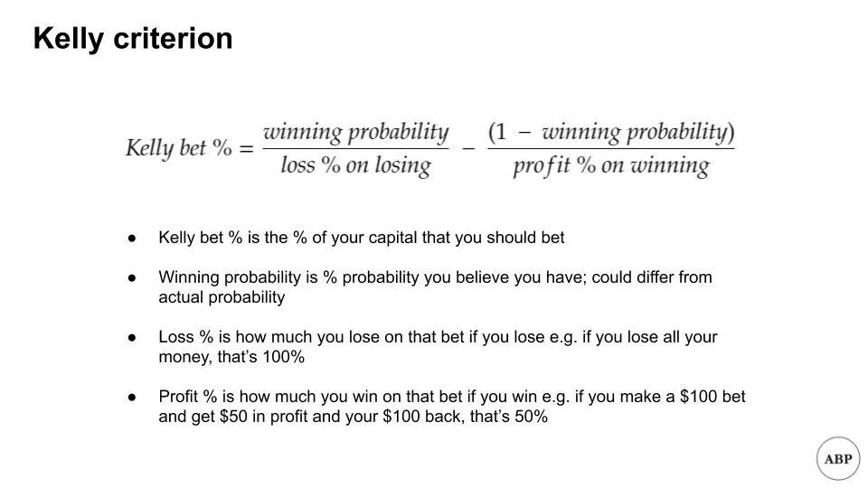
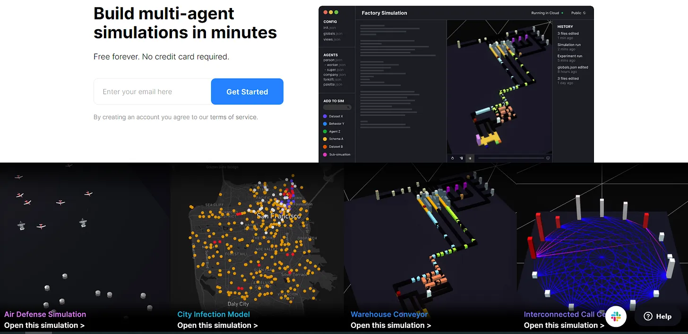

## テイクアウェイ

1. ケリー基準はポートフォリオのサイズを数学的に決める方法ですが、前提には注意が必要です
2. HASH.ai はエージェントベースのシミュレーションをより簡単にしています。私は起動失敗率をモデル化しようとしています。

## 1.ポートフォリオサイズのケリー基準

サラはエンジェル投資家志望です。彼女の友人ニコラス、アリソン、チェイスは害虫駆除に関する魔法のようなビジネスアイデアを思いつき、サラはそれが大ヒットすると考えています。

サラはこのビジネスに3年分の貯金を投資しようとしていたが、セス、マーク、エマ、アンバー[^1]友人たちがウサギを使った同じく刺激的なアイデアを提案した。

サラは自分に複数の選択肢があることに気づき、どうすればいいのか分からなくなります。彼女は年上の友人アンソニーに相談しに行く。アンソニーは投資分野を注意深く見守っています。アンソニーは、彼女は正しい道を歩んでいると言います。ポートフォリオの配分とリスクとリターンの利得が成功する投資家になる鍵だと。また、彼は彼女に賭け金の大きさの計算式である[ケリー基準](https://www.princeton.edu/~wbialek/rome/refs/kelly_56.pdf「ケリー」)についても読んでみるといいかもしれないと付け加えます。

ケリーの公式はベル研究所のジョン・ケリーによって開発されました。数回の入力で、長期的なリターンを最大化したい場合に、何かに賭けるための最適な資本割合を返してくれます。私は付録に簡略化された導出を掲載しており、[ここ](https://blogs.cfainstitute.org/investor/2018/06/14/the-kelly-criterion-you-dont-know-the-half-of-it/ '導出」)や元の論文でも見つけることができます。

数学は怖いと承知していますが、例を挙げてみましょう。コイントスでいくら賭けるべきか知りたいです。コイントスでは、お金を倍にするか負けるかのどちらかです。数字を入力すると:

そう、正しく読んだよ。ケリーは、何もリスクを取らない方がいいって言ってる。なぜ?

あなたには優位性がなく、リスクとリターンのバランスも正しいので、最善の選択肢は賭けないことです。

では、同じコイントスで賭けに11倍(1000%)のリターンが与えられ、他のすべては変わらないと想像してください。数字を代入すると:

ケリーは、総資本の45%を賭けるべきだと言っています。これほど魅力的なオッズがあっても、全てのお金を[^2]に賭けているわけではないことに注目してください。また、全ての賭けを失う可能性があるゲームでは、100%勝つ確率があると信じない限り、決してオールインしないこともわかります。

[マイケル・モーブッシンとエド・ソープがケリーシステムの魅力的特徴について詳述しています:](http://www.capatcolumbia.com/MM%20LMCM%20reports/Size%20Matters.pdf「マイケル」)

1. 破産の可能性は「小さい」こと。ケリーシステムは比例賭けに基づいているため、理論的には資本を失うことは不可能ですが、それでもボラティリティの急増は起こります
2. ケリーシステムは他のシステムよりも資金を速く増やす可能性が高いです
3. 特定の当選額に最も短い平均時間で到達する傾向があります

これがエンジェル投資の面でどのような助けになるのでしょうか?[^3]は非常に単純化した仮定をする必要がありますが、ケリーが投資あたりどれくらいの配分をすればよいかの目安を教えてくれます。

ケリーは3つの入力を取っています――勝率の信念、損失率、そして利益の割合です。【Correlation VenturesとSeth Levine】(https://www.sethlevine.com/archives/2020/10/vc-fund-returns-are-more-skewed-than-you-think.html「セス」)は、VCのリターンを時間経過で示した良いチャートを下に示しています。これを私の仮定の基礎として使います。

簡単に言うと、10倍(900%)以上のリターンは勝ちとみなし、それ以外はすべて損失とみなします。グラフからすると、約5%の確率で勝つことになります。さらに単純化すると、負けた時は賭けの100%を失い、勝った時は900%の利益を得ると仮定します。これらの初期仮定の下で、次のようになります:

うーん。それは良くないね。今の前提では、ケリーはVC投資は悪い取引だと言っている。これを初めて見たとき、二度見して、このニュースレター号をどうやって書き終えるのか[^4]考えた。答えはズルをすることだった。たくさん。5%の勝率の代わりに、エンジェル投資家が自分が平均以上だと信じて投資に臨み、少なくとも投資が回収できると仮定しましょう。彼らは自分の勝率が基準レートより高いと信じています。オッズに対して有利だと信じなければ、何かに賭けることはありません。

つまり、グラフ上の<1xの部分はすべて無視し、宇宙は残りと仮定します。その5%の勝率は約14%[^5]に跳ね上がります。その他のすべては一定に保ちます。これらの新しい仮定の下で、次のようになります:

少なくともそれで私たちは対応できる。今は仮定を受け入れて、後でまた見直す。

リターンがどのようなものかを見るために、100件連続してそのような投資を行ったと仮定しましょう。1,000回のシミュレーションを実行します。つまり、上記の仮定のもとで100社の企業に投資する1,000の宇宙を想像します。[こちらのColabファイルを使っていますので、ご覧ください](https://colab.research.google.com/drive/1YeMnl2QOQdCAGGxCDr2pfDk_HFgCh02D?usp=sharing「Colab」)

予想通り、私たちの仕組まれたゲームでは大金を稼いでいます:

ただし、いくつか注意すべき点があります。大きな下落(すべての下落)を見てください。多くのポートフォリオは最終的に半分以上を失います。リターンは大きなボラティリティの急増を伴います。

また、シミュレーション_one thousand_行いました。グラフ上で大きなリターンは目立っていますが、実際にはそれほど多くはありません。ほとんどのケースは下部近くでぎゅうぎゅうに詰まっています。

リスクを減らすために、多くの人は「フラクショナル・ケリー」方式を採用し、ケリー推奨サイズのごく一部を賭ける方法を選びます。ここでは、推奨額の半分(2%)だけ賭けるシナリオをシミュレーションします。

これら両方のリターン分布を詳しく見てみましょう。はっきりとは見えにくいですが、ボックスプロットは典型的な25パーセンタイル、中央値、75パーセンタイルの範囲を示しています。私たちは100ドルから始めました:

例外的なケースを除外すると、すべてのシミュレーションのリターンの25パーセンタイルから75パーセンタイルははるかに小さい範囲にあります。

そして「より安全な」ハーフケリーのアプローチに目を向けると、ほとんどの場合、5倍未満のリターンしか得られないことがわかります。

**要するに、エンジェル投資をするなら強い信念が必要で、多くの投資を行い、資本のごく一部だけに投資したいと思うでしょう。**それでも、神話上の100倍のリターンの可能性は低いです。これは最適な賭け戦略のもとであり、私たちはすでに複数の方法でゲームを操作しています。

- 大量の敗者を排除した
- 二項結果を仮定した
- 固定勝敗配当を仮定していました
- 賭けは連続して行われると仮定していました
- たくさん賭けられると思ってた

これらは現実の生活とは違います。上記は単純化しすぎです。とはいえ、**少なくともケリーを使って破滅のリスクを減らすことはできます。**

さらに詳しく知りたい場合は、Vasily Nekrasovによる論文があります(https://papers.ssrn.com/sol3/papers.cfm?abstract_id=2259133 'paper')で、はるかに優れたモデルがありますが、数学的な部分は私には難解です。Python colabファイルは[here](https://colab.research.google.com/drive/1YeMnl2QOQdCAGGxCDr2pfDk_HFgCh02D?usp=sharing 'colab')にあります。[^6]の基本シミュレーション仮定をいじりたいなら。

### ケリー基準の詳細はこちら:

1. [ケリー基準:クリスチャン・アイチンガー著『マルチプル・インベストメント・オポチュニス』](https://greek0.net/blog/2018/04/17/kelly_criterion2/年)
2. [ケリー・クライテリオン:アロン・ボックマン著『You Don't Know the half of It』](https://blogs.cfainstitute.org/investor/2018/06/14/the-kelly-criterion-you-dont-know-the-half-of-it/)
3. [Pythonリスクマネジメント:ケリー基準 レスター・リョン著](https://towardsdatascience.com/python-risk-management-kelly-criterion-526e8fb6d6fd年)
4. [アンドレア・カルタとクラウディオ・コンヴェルサーノによるケリー基準の実践的実装](https://www.frontiersin.org/articles/10.3389/fams.2020.577050/full年)
5. [AngelListによるベンチャーキャピタルにおけるべき法則リターンに関するAngelList Dataの見解](https://angel.co/blog/what-angellist-data-says-about-power-law-returns-in-venture-capital)

## 2.HASH.ai を使った企業の生存率をシミュレートする仮定に満ちたモデルから、仮定に満ちた別のモデルへと進みましょう。最近、[HASH.ai](https://hash.ai/ 'hash')という会社を聞きました。これは「マルチエージェントシミュレーションを数分で構築できる」というものです。つまり、互いに相互作用できる複数のオブジェクトを作成し、その後どうなるかを見るという意味です。エージェントベースのモデリングについては[こちら](https://hash.ai/blog/what-is-agent-based-modeling 'hash')についてもっと読むことができます。

ツール[^7]を試してみたくなり、先ほどのセクションで仮定したいくつかの仮定をシミュレートしました。VC投資が難しい理由の一つは、多くの企業が失敗したり、期待に対して成長が遅いからです。いくつかの企業が経済状況で成長している様子をモデル化してみましょう。

繰り返しますが、簡略化した仮定をします。

- 私たちは年間の平均企業生存率を知っています。私は確率を乱用して、日々の生存率を仮定しています
- それに基づいて、日々の故障率も推測します
- また、会社の年間平均収益成長率も把握しています。そこから私はハッキーな日々の成長率を推定します

それらをすべて HASH.ai プロジェクトにまとめ、彼らのテンプレートの一つを修正しました。多くのファイルがJavaScriptで書かれているので、かなりいじりましたし...私はJavascriptを知りません。でも最終的にはほとんど動作するようになったと思います[^8]。

このモデルは、企業を緑色の箱としてシミュレートし、毎日高さが増え、その高さが企業の規模を表しています。どの時期でも、その会社が失敗する可能性があり、箱が炎に包まれて燃え尽きる[^9]で表現されます。長期間にわたってどれだけ多くの企業が生き残っているかがわかります。以下はサンプル例です:

現在の仮定では、生存者が思っていたよりもずっと多かったですが、100倍の中隊が登場するまでにはかなり時間がかかりました。仮定を戻して調整できるかもしれません。

HASH.ai また、時間経過による統計をグラフ化することもできます。私の現在のモデルでは、生存者と失敗者の一定状態を示しています。

繰り返しますが、これはあくまで遊びで、ほとんどの前提は調整が必要です。最終モデルは[ここ](https://core.hash.ai/@leonlinsx/wildfires-regrowth-3/main "model")で試してみてください。誰かがより洗練されたスタートアップ成長モデルを作るのを見てみたいです。

## その他

1. [自動販売機の単位経済学](https://thehustle.co/the-economics-of-vending-machines/「経済学」)
2. [オンラインゲームのネットワーキング解説](https://www.pcgamer.com/netcode-explained/「ネットコード」)
3. [『戦争と平和』とナプキンからリスクについて学べること。](https://refractor.substack.com/p/the-story-range?「屈折者」)
4. [アメリカの博士号取得者がスタートアップで失敗している](https://marginalrevolution.com/marginalrevolution/2020/12/american-ph-ds-are-failing-at-start-ups.html 'Phd')
5. [これはスパルタではありません](https://acoup.blog/2019/08/16/collections-this-isnt-sparta-part-i-spartan-school/「スパルタ」)

## 付録

[^1]:サラは友達関係で絶好調だよ

[^2]:また、もしそんな魅力的なオッズを見かけたら、おそらく詐欺に遭っている可能性が高いという点もあります

[^3]:ここでどれだけ単純化しているか改めて強調したいです。まず、エンジェル投資の流動性の低さは大きな問題です。なぜなら、シミュレーションの後半で繰り返し継続した賭けができないからです。また、数学的に間違えた可能性は十分にありますので、もし間違いがあれば訂正してください。

[^4]:先を見越して計画しろと言う...

[^5]:5%を割った(100%から64%)

[^6]:現在の勝率をわずかに調整すると、推奨される賭け率や予想リターンが劇的に変わることに気づくでしょう

[^7]:遊びに重点を置くことです。私の最終モデルはとても不安定です。

[^8]:コードには木や火災などに関する言及があり、これは山火事をシミュレートした元のモデルの名残です。

[^9]:これは意図的だったと思います。多くの機能を変える方法がわかりませんでした。