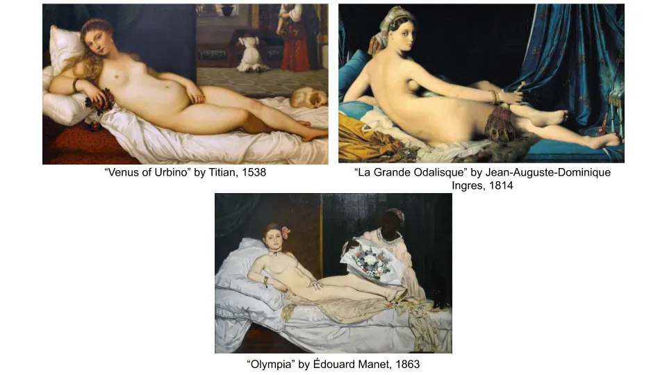
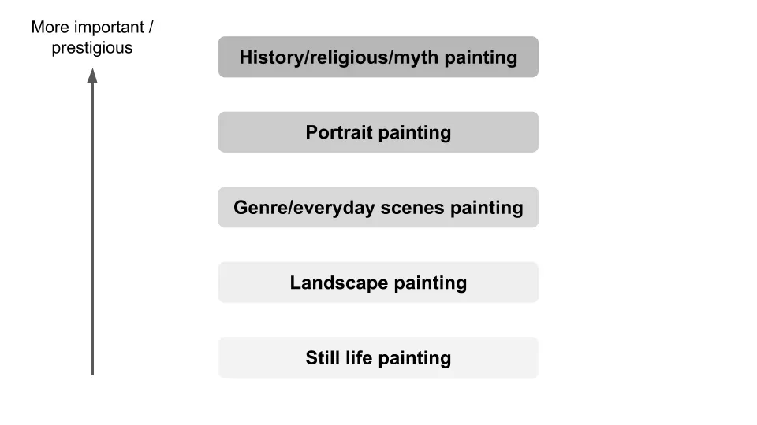
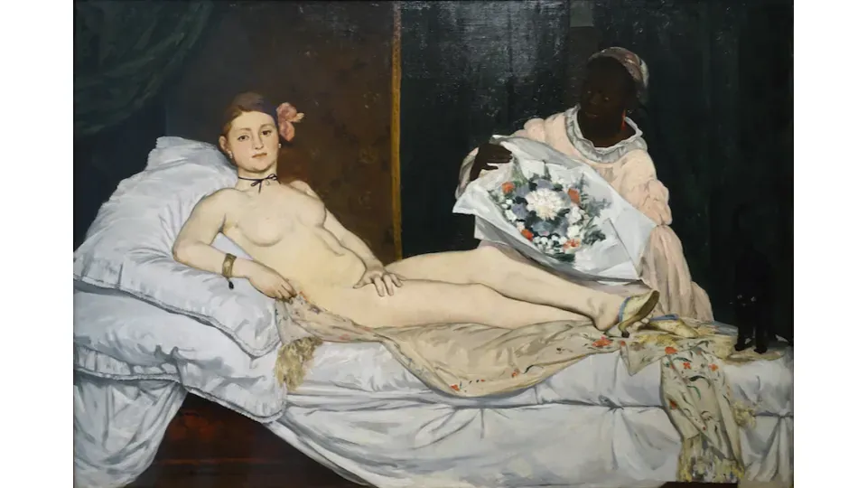

## 要点

ティツィアーノ、ドミニク・アングル、マネの作品を比較することで、芸術家たちが互いに影響し合い、伝統に反抗してきたことがわかります。

## ティツィアーノ、アングル、マネを見ている

12月は振り返りをするのに便利な時期です。例年同様、月刊投稿で今年のより包括的な振り返りを行います。週刊誌では今年学んだ新しいトピックを強調します。

まずは美術史です。今年はいくつかの理由で、より多くの時間を美術について学ぶようになりました。

- コロナの影響で多くの趣味がキャンセルされました
- 私はずっと芸術に興味があり、今でも芸術は意味があると信じています
- 作品の文脈があると、アートはずっと良いです

見つけた [Smarthistory](https://smarthistory.org/) 親しみやすく、かつ包括的なウェブサイトにするために、多くのページを読み進めてきました。有名な作品の背後にある意図について読むことで、作品の理解がより簡単で楽しくなりました。例えば、ピカソが何を意味しているのかをようやく理解できるようになったことです [in an earlier article I wrote](/writing/picasso 'picasso')

それを踏まえて、似たテーマを持つ3点を見てみましょう。歴史の文脈が、アーティストが何をしようとしていたのかをよりよく理解できる方法を考えてみましょう。

上の写真には、長らくアーティストに人気の題材であった3枚の横たわるヌード像が写っています [^1]\.時計回りには1500年代のティツィアーノ、1800年代初頭のドミニク・アングル、そして1800年代後半のマネがいます。これらの画家は当時も今も有名でした。「ヴィーナス」は当時は比較的論争の的ではありませんでしたが、他の二作の「ラ・グランド・オダリスク」と「オリンピア」ははるかに多くの批判を浴びました。なぜでしょうか\?

その質問に答えるために、 [hierarchy of art genres](http://www.visual-arts-cork.com/history-of-art/hierarchy-of-genres.htm 'hierarchy') 何世紀にもわたって人々が守ってきたもの\:

長い間、作品の種類には一定の「ランク」があり、人々は静物画の方が宗教的な場面の絵画よりも重要度が低いと自動的に判断されてきました。歴史的に教会が芸術の大きな後援者であったことを考えれば、これは驚くことではありません。

ヴィーナスとティツィアーノがこの構図に込めた考えを詳しく見てみましょう。 [Venus was probably intended as a marriage gift](https://smarthistory.org/titian-venus-of-urbino/ 'venus') カップルのプライベートなお見合いのために [^2]髪型は当時の花嫁に典型的なものであり、バラは愛を象徴していました。『ヴィーナス』というタイトルのこの作品は、神話的な絵画としても意図されており、当時としては芸術の最上位の「ランク」にしっかりと位置づけられていました。

絵画をより視覚的に興味深いものにするために、ティツィアーノは体の曲線を背景の直線と対比させています。また、黒い線が私たちの注意を人物に向けさせることにも注目してください。背景の赤い線は意図的に完全に平行ではなく、それが創造します [perspective](https://www.tate.org.uk/art/art-terms/p/perspective 'perspective') 画像をより立体的に見せるために。

では、オダリスク\(側室を意味する\)を見て、何が変わらず何が変わったのかを見てみましょう。ポーズは似ており、オダリスクとヴィーナスの肌の色合いがどちらも生き生きと感じさせます。

ドミニク・アングルは前景に孔雀の羽や宝石など、より多くのディテールを加えています。また、コントラストや遠近感のために直線をあまり使っていないことにも注目してください。代わりに、この絵は曲線に焦点を当てています\:

体をじっと見つめ続けると、何か変な感じがし始める。確かにポーズを通じて体が伸びているが、かなり長く感じる _も_ 長い\?フィギュアのプロポーションが完全に合っていない。左脚を見ると、体のどこに付着しているかもずれていることに気づくだろう。アングルは意図的にこれを行ったのは、鑑賞者にフィギュアの形をより強く感じさせるためであり、「リアル」な体では得られるものとは違う。

最後に、アングルはこの作品に「ラ・グランド・オダリスク」と題し、神話上の人物にちなんでいたわけではありません。これにより絵画は「重要性が薄れ」となり、当時の厳格な芸術階層に対する彼の声明を表明する手段でした。

さて、最後にマネの作品を見てみましょう。ここには、似たポーズやクッション、さらには背景の縦線でコントラストや注意を引き出すために、ヴィーナスへの言及が簡単に見て取れます。

同時に、これは全く異なる絵画でもあります。多くの人はヴィーナスもオダリスクも「完成」していて「写実的」に見えると言うでしょうが、オリンピアは未完成に見えます。ひどくはないですが、以前の絵ほど「美しく」はありません。

図の曲線はオダリスクほど長く優雅ではなく、3D遠近法を示す線もないため、画像が平面的に見えます。ヴィーナスが女神の名前で、オダリスクはファンタジーランドの風景を示しましたが、オリンピアは非常にリアルで現代的に見えます。

実際、その現実性こそが ["Sticks and umbrellas were brandished in \[her\] face," and criticism that the painting was “a degraded model picked up I know not where.”](https://www.artforum.com/print/197503/manet-a-radicalized-female-imagery-36081 'art') アングルと同様に、マネは今や伝統に完全に反抗し、芸術の階層はナンセンスであり、現代世界の時代だと主張しています。もはや芸術は歴史を描くことに集中するのではなく、今を描くのです。

マネの作品は過去から影響を受けましたが、多くの核心的な側面を否定し、美術界をスキャンダル化しました。しかしその結果、彼は一連の運動に影響を与え、現在では印象派や写実主義などにインスピレーションを与えた最初の真のモダンアーティストの一人として知られています。

投稿のタイトルはマネについてですが、実際には芸術全般についての内容です。芸術は常に進化し続ける分野であり、かつて人気だったものは人気が薄れてから再び復活することもあります。アーティストがなぜそのような決断をしたのかの歴史を理解することで、異なる作品をよりよく評価し、時代を超えた類似点を見出すのに役立ちました。少なくとも、それによって私はより心を開かれたのです。

## 脚注

[^1]: なぜそうなるのか、不思議に思う。

[^2]: 「眠るヴィーナスの主題は、ギリシャ・ローマ古代に人気があり、ルネサンス期のイタリアで復活したエピタラミア\(結婚を祝う歌や詩\)の中心でした。」Smarthistoryより
