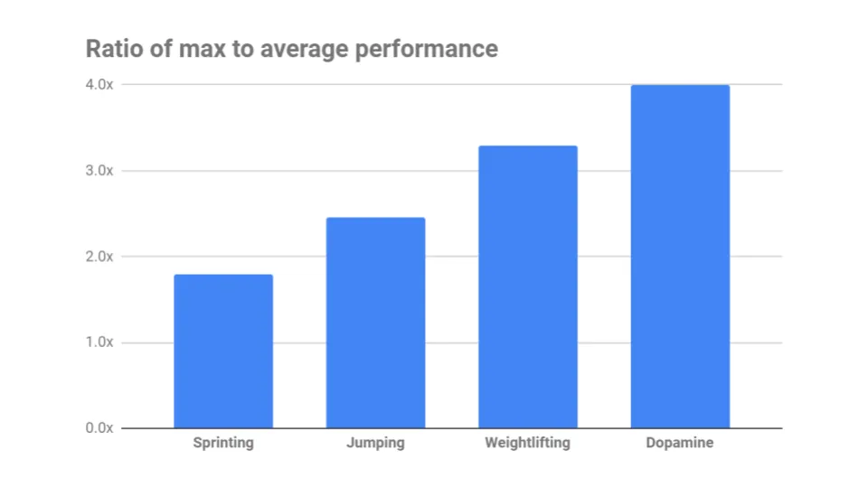
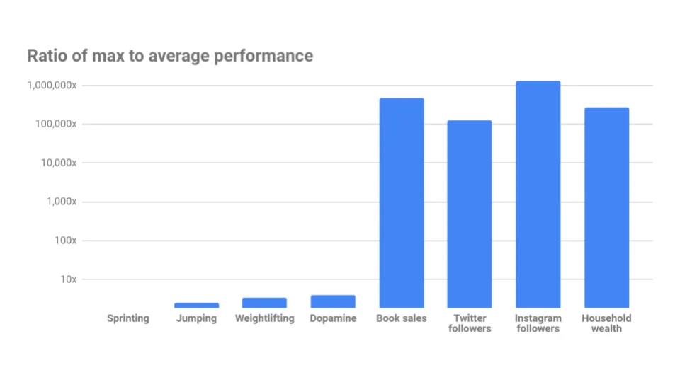

## テイクアウェイ

人生のスキルによっては、他よりも大きなばらつきがあり、その差を知るとマージンにどれだけ努力を注ぐかを判断するのに役立ちます。

## 人生のスキルの天井

私は若い頃、PCで多くのロールプレイングゲーム(RPG)をプレイしていました[^1]。RPGでは、クエストをクリアするにつれてキャラクターが強くなるキャラクターを操作します。人気のあるものには[Final Fantasy, World of Warcraft, or Guild Wars](https://vgsales.fandom.com/wiki/Best_selling_RPG_games 'rpg') [^2]があります。

「[min-maxing](https://tvtropes.org/pmwiki/pmwiki.php/Main/MinMaxing 'min')」と呼ばれる一般的なゲームプレイスタイルがあり、プレイヤーは最小限のコストで最大のパフォーマンスを得るためにキャラクターをカスタマイズします。「最適な」プレイ方法についてのガイド、例えばベスト[pokemon team](https://gamefaqs.gamespot.com/gameboy/198314-pokemon-yellow-version-special-pikachu-edition/faqs 'pokemon')や[the right time to level up your Diablo skills](https://gamefaqs.gamespot.com/pc/238750-diablo-ii-includes-expansion-set/faqs/18357 'diablo') [^3]など、さまざまなガイドを読むことになります。私は実際にゲームをプレイするよりも、ガイドを読む時間の方が長かったかもしれません。

これを現実世界にどう応用すればよいでしょうか?もし人生を最大化したいなら、どの分野に時間を費やす価値があり、どの分野に費やすべきでないかを考えます。

問題の定義にはさまざまな方法があります。

- 何らかの形で幸福を最大化すること[utilitarianism](https://en.wikipedia.org/wiki/Utilitarianism 'utility')
- 他者への影響を最大化し、何らかの[effective altruism](https://www.effectivealtruism.org/ 'ea')で最小限のコストで支援を最大化すること
- 報酬と努力の比率が高いスキルを最大化する

今日はその最後の選択肢について探りたいと思います。

テクノロジー[the 10x engineer](https://www.7pace.com/blog/10x-engineers '10')には、誰に話すかによって風刺か真剣なビジネスかという人気のある概念があります。伝説的な言い方で言えば、10倍エンジニアとは、同僚の10倍優れている人のことです。

神話であれ現実であれ、私はその枠組みを最大化の問題に使いたいと思っています。平均の10倍、あるいは1,000倍も優れている場所を見つけましょう。トップパフォーマーが圧倒的に優れていれば、成長の余地が広がり、報酬と努力の比率も高くなるでしょう。

シンプルにするために、まずはより主観的に測定される分野を除外します。いとこは私のニュースレターが他のニュースレターより10倍良いと思っているかもしれませんが、なぜか偏っている気がします。アート、パフォーマンス、食べ物のような広い分野は、他の誰かに分析してもらう[^4]にします。

まずは身体スポーツの領域から始めましょう。ウサイン・ボルトは世界最速の男であり、比喩的に私たちの誰よりも10倍も優れています。しかし、彼の速度を平均的な人間と比べると、結局はわずか2~倍速いだけです。彼ほどの腕を上げるにははるかに多くの努力と運が必要で、その分十分に報われますが、客観的な差はそれほど大きくなく、努力の限界的なリターンは小さいことを示唆しています。

走高跳の記録2.45mは[Javier Sotomayor](https://www.topendsports.com/sport/athletics/record-high-jump.htm 'jump')によって樹立されました。平均的な数字は持っていませんが、ベッドに飛び乗ってみて、保守的に1mを推定します。それでも10倍ではありません。

デッドリフトの世界記録は、『ゲーム・オブ・スローンズ』のマウンテンとして知られる[Hafthor Bjornsson](https://www.espn.com/video/clip/_/id/29126803 'hafthor')が保持しており、1,104ポンドを持ち上げました。これはかなりの量のように聞こえますが、平均的なトレーニング男性の3~倍の重さに過ぎません。

[faster, higher, stronger](https://en.wikipedia.org/wiki/Olympic_symbols#:~:text=The%20Olympic%20motto%20is%20the,who%20was%20an%20athletics%20enthusiast. 'wiki')はこれで終わりだ。

ただの遊びで、生物学的または化学的に10倍の幸せをもたらす体験を見つけられるかどうか試してみたかったのです。

幸福を客観的に測るのは難しいので、[dopamine](https://www.healthline.com/health/dopamine-effects#definition 'dope')を客観的な指標として使います。ドーパミンは快楽に関連する化学物質です。ドーパミンが多く放出されるほど、快楽はより強く感じ[^5]。

薬物によるドーパミンの急上昇を引き起こすイベントを探しました。人間にドラッグがもたらす快感の可能性をオンラインで見つけるのは難しく、まるで薬物をやってほしくないかのように感じました。結局見つけたのは、[heroin](https://onlinelibrary.wiley.com/doi/abs/10.1002/syn.890210207 'heroin')を摂取したラットの研究で、ドーピング[^6]時にドーパミンが4倍増加したことが示されました。これは高い数値ですが、予想より低く、私たちが望む10倍の量には達[^7]。

私たちは物理学、化学、生物学の領域を離れ、より抽象的な[^8]分野に進まざるを得なくなります。

誰かが他の人より10倍の影響力を持つことはあるのでしょうか?

私は本の売上、Twitterのフォロワー数、Instagramのフォロワー数を影響力を定量化する方法として見ました。これらは完璧な指標ではありませんが、規模の感覚を与えるはずです。

『ハリー・ポッターと賢者の石』は120mmの販売を行っており、平均的な作家の販売数は約250mmと比べて高いです。

オバマのTwitterフォロワー数は129mmで、平均的なTwitterユーザーのフォロワー数は約1,000人です。

ロナウドのインスタグラムフォロワー数は264mmで、平均的なインスタグラムユーザーのフォロワー数は約200人です。

これは大幅に割り下げても確実に10倍以上の数字です。私はこれらの新しい領域を物理的な領域とプロットし、大きな大きさの違いを考慮して対数スケールでプロットしました。各線は10倍の増加を示しています。出典については脚注を参照してください[^9]。

私たちは、努力を拡大できる道を見つけ、限界収益の逓減がそれほど早く減らなくなることはありません。このような分野では天井がはるかに高く、平均と比べて差別化の可能性も高まります。

インフルエンサーになりたいと願う人々は、暗黙のうちに以下を認識しています:

1. 平均とは大きく異なることが現実的に可能だ。[relative differences, not absolutes, mattering more](/writing/relative_billionaire 'relative')について話したことを思い出すと、これは他者に高い地位を示す一つの方法だ。
2. 確率は小さいですが、「成功」したときの報酬はコストに比べて桁違いに大きいです。ギャンブルですが、ギャンブルが嫌いな人なんていませんよね?だからみんな中毒なのも無理はありません。

また、最も裕福な人の富と平均的な世帯資産をプロットしましたが、ほぼ10万倍の差があります。金銭的報酬にも上限はありません。

多くの「スケーラブル」分野は技術によって支援されてきました。テクノロジーは多くのものから物理的な作業層を抽象化し、かつては変動費だったものを固定費へと変えました。コストの成長を平坦化することで、テクノロジーは報酬の成長を可能にしました。

昔は、新しいアイデアを広めたいとすれば、訪れる場所の数に制限がありました。[the printing press](https://www.history.com/news/printing-press-renaissance)の発明で生活は楽になりましたが、印刷されるすべての物理的な作品ごとにコストがかかり、届く範囲は制限されていました。今では、誰にでも無料でアイデアを瞬時に送ることができます。以前よりも暴走する成長を得るのがはるかに簡単になりました。

より速い流通、より高い成長、より強い成果。

これをべき法則や、ネットワークには他よりも劇的に重要な部分が存在することがあると考える方もいるでしょう。[There's some debate over whether power laws exist in real life](https://www.quantamagazine.org/scant-evidence-of-power-laws-found-in-real-world-networks-20180215/ 'real')ですが、実際には同じ概念です。人や物、部品がはるかに重要なシステムが存在する[^10]。

はっきりさせておくと、人生のすべてが影響力や富を最小限に絞ることだけだと言っているわけではありません。しかし、ある分野の潜在的な上限を知ることは、どれだけ努力を注ぎたいか、どこで止めるかを見極めるのに役立ちます。10倍の優れを目指すには、物理的なものから技術的なものへと移行することが通常伴います。

## その他

1. [The first 10 years of Stripe payment APIs](https://stripe.com/blog/payment-api-design 'api')
2. [How to read economics papers: randomised controlled trials](https://www.youtube.com/watch?v=s-_3s3OMeqs&feature=emb_title 'rct')
3. [Learn your attachment style to become a better parent](https://aeon.co/essays/learn-your-own-attachment-style-to-become-a-better-parent 'attachment')
4. [Introducing 'Food Grammar,' the unspoken rules of every cuisine](https://www.atlasobscura.com/articles/do-italians-eat-spaghetti-and-meatballs 'food')
5. [Salastina’s Happy Hour brings you live musical performance every Tuesday](https://www.salastina.org/concerts 'salastina');ディズニー作曲家アラン・メンケンによる今後のセッションが含まれています。彼は世界[EGOT](https://en.wikipedia.org/wiki/List_of_people_who_have_won_Academy,_Emmy,_Grammy,_and_Tony_Awards 'EGOT')でも数少ない受賞者の一人です

[^1]:驚いたことに、この投稿は[Diablo 2 remaster news](https://diablo2.blizzard.com/en-us/ 'd2')に触発されたものではありません。このコンセプトについてしばらく考えていました。

[^2]:ここでは多くのRPGスタイルをまとめて話しています。はい、WoWがMMORPGで、それは全く違うタイプのゲームで、まとまって話したなんて信じられないと思います。もう私の芝生から出て行ってください。

[^3]: D2でそうした理由はいくつかありました[given the skill tree](http://classic.battle.net/diablo2exp/skills/skillplanning.shtml 'd2');ブレークポイントも理由の一つだったと思います。

[^4]:確かに平均の10倍は良いアートを見たり、パフォーマンスを見たり、食事を食べたりしたことはあると思いますが、ここでは範囲を限定しなければならず、記事を書かなければなりません。

[^5]:これはいつも通り単純化しすぎています。[Research](https://www.ncbi.nlm.nih.gov/pmc/articles/PMC5820768/ 'paper')はドーパミンが行動の動機付けと動機付けの両面に関与していると考えるようになっています。「これらのデータや他の報告は、多パミンニューロン機能について、より微妙な見解を支持しており、定着ドーパミンの放出は正的・負の感情刺激によって異なる調節され、適応行動を促進するというものです。」

[^6]:ラットを[coke](https://www.pnas.org/content/102/29/10023 'rat')した研究も見つけましたが、結果を解釈できません。もしよければ、私が求めている数字は図4にあると思います。

[^7]:薬が快感を100倍に増やすという数字を頭の中で考えていましたが、正確な数字や情報源がどこにも見つかりません。また、ここで私はピークをカウントしているだけで、10倍の持続時間が10倍良い出来事だと考えているわけではありません。

[^8]:世代の生物学的成長は10倍以上のスケールに従うと言えるでしょう。例えば、一人の子孫は何百万人もの数にのぼる可能性があります。ここでは単一の生涯の出来事に限定しています。

[^9]:
    [Sprints](https://trackspikes.co.uk/average-sprinting-speed/ 'sprint')、[high jump](https://www.topendsports.com/sport/athletics/record-high-jump.htm 'jump')、デッドリフト[here](https://www.espn.com/olympics/weightlifting/story/_/id/29126863/hafthor-bjornsson-breaks-world-record-501-kilogram-deadlift 'lift')と[here](https://strengthlevel.com/strength-standards/deadlift/lb 'lift')、書籍販売[here](https://nonfictionauthorsassociation.com/how-many-books-can-you-expect-to-sell-the-truth-about-book-sales-and-the-keys-to-generating-income-from-publishing/ 'book')と[here](https://en.wikipedia.org/wiki/List_of_best-selling_books#List_of_best-selling_regularly_updated_books 'book')、Twitterの販売[here](https://kickfactory.com/blog/average-twitter-followers-updated-2016/ 'tw')と[here](https://en.wikipedia.org/wiki/List_of_most-followed_Twitter_accounts 'tw')(記事の日付に合わせてフォロワー数を切り上げました)、Instagramのインスタグラム[here](https://www.hashtagsforlikes.co/blog/instagram-followers-how-many-does-the-average-person-have/ 'insta')と[here](https://en.wikipedia.org/wiki/List_of_most-followed_Instagram_accounts 'insta')、資産の管理[here](https://www.marketwatch.com/story/whats-your-net-worth-and-how-do-you-compare-to-others-2018-09-24 'wealth')と[here](https://en.wikipedia.org/wiki/List_of_Americans_by_net_worth 'wealth')です。TikTokのカウントもやりたかったのですが、良いデータ源が見つかりませんでした。
    [^10]:べき乗則であれ、対数正規分布であれ、他の分布であれ、他よりもはるかに大きなデータ点が存在する。それが私が伝えたい主なポイントだ。
