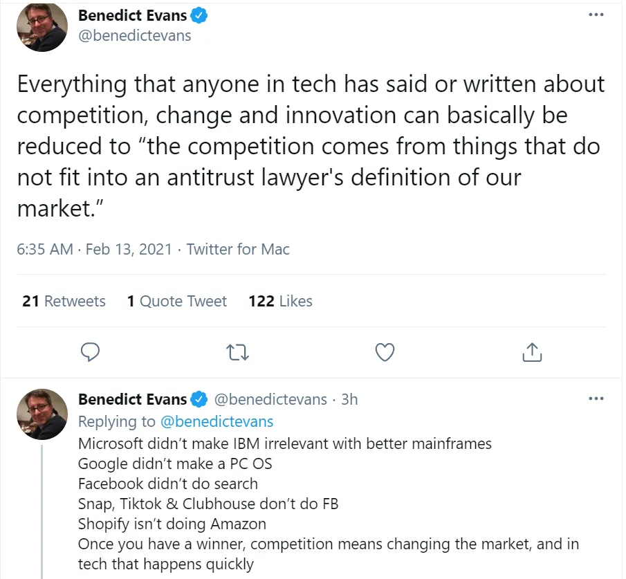

## テイクアウト

自然独占は稀であり、規制はそれを解決するどころか害になることが多いです

## 勝者がすべてを手に入れる?

Turtle VenturesのVCであるジョシュ・ブラインリンガーは、自身のサイトで[how most marketplaces are not "winner takes all":](https://acrowdedspace.com/post/642666403989684224/winner-take-all-or-not 'win')について短い投稿をしています

私も同意する傾向があります。「勝者総取り」という言葉はよく耳にします。では、なぜ独占がもっと増えないのかという疑問が生まれます。

「でも待って、独占はたくさんあるんじゃないの?」

1人のプレイヤーが全てのシェアを持つという定義では、そういうものがあるのかはわかりません。

数人のプレイヤーが多くのシェアを持つことで定義される―確かにそうですが、その定義は大きく変わっているのではないでしょうか?

「それはただの言葉遊びだ。独占というのは、実は複数のプレイヤーがいて、市場全体よりも少ないが、もっと大きな数を指している」

では、その定義を使うか、例えば米国連邦取引委員会(FTC)が主張する堅実な["with significant and durable market power"](https://www.ftc.gov/tips-advice/competition-guidance/guide-antitrust-laws/single-firm-conduct/monopolization-defined 'monopoly') [^1]のようなものを使おう。独占 - [I know it when I see it](https://en.wikipedia.org/wiki/I_know_it_when_I_see_it 'wiki')。

曖昧な定義の問題は、異なる仮定や結論を生むことです。あなたにとって明らかに正しいことが、他の誰かにとっては明らかに間違っているのです。問題が何であるかすら合意できなければ、どうやってそれを解決すればいいのでしょうか?

ベン・エヴァンスがこの件について述べています:

スタートが難しいほど、既存企業が成長し市場シェアを維持するのが容易になります。

歴史的に、物理的な障壁が主な制約でした。鉄道に乗り込むのは?線路を敷設しなければなりません。海運に参入するには?船が必要です。中世で交易路を確立しようとすると?馬車や傭兵、[maps](https://www.visualcapitalist.com/medieval-trade-route-map/ 'map')が必要です。

最近では、その多くは抽象化されてしまい、[abstraction in computing](/writing/plaid 'abstract')についての議論のように。多くの企業は物理層を当たり前と考え、より速く低コストでスケールできます。

変わっていないのは規制の障壁です。私たちは自然を克服しましたが、人間には乗り越えていません。また、規則は常に社会の一部であり続けるので、これからも乗り越えられるとは思いません。

独占の例を調べていたら、「独占の危険性を暴く」[Open Markets Institute,](https://www.openmarketsinstitute.org/learn/monopoly-by-the-numbers 'omi')に出会いました。ここにいくつかの独占がある[their list:](https://www.openmarketsinstitute.org/learn/monopoly-by-the-numbers 'monopoly')

1. 製薬会社
2. アルコール
3. 眼鏡
4. インターネット広告
5. 書籍

製薬、アルコール、眼鏡はすべて厳しく規制された業界であり、競争のスタートを促す要因となっています。

広告に関しては、今やトップ企業が圧倒的なリードを持っていると誰もが言いますが、もし10年[we'd have been wrong on 3 out of 5 names.](https://www.emarketer.com/Article/US-Digital-Ad-Spending-Top-37-Billion-2012-Market-Consolidates/1009362 'ad')前にトップ5企業のうちそう言っていたら、今の「独占」が将来も同じものになるとは断言しにくいと思います。

オンライン書籍販売にはもっと強い反論があるかもしれません。しかし、それだけが本を買う方法ではありません。一見すると、これは物理学の世界が再び働き始めているように思えます。無限のコンテンツのための限られたスペースです。

今日の私の言いたいのは、規制が悪いということではありません。そうでなければ児童労働は存在し続けているでしょう。しかし、直面している問題はすべて複雑であり、明確なガイドラインや知識なしの規制は、むしろ助けになるどころか害になることが多いのです。規制は必要ですが、それは複雑さを理解している人々によるものであり、[wonder how Facebook makes money](https://www.youtube.com/watch?v=n2H8wx1aBiQ 'ads')ではありません。

より具体的な例を挙げると、ヨーロッパのデータプライバシー規制であるGDPRや、現在のウェブ閲覧時に発生する迷惑なクッキー通知の原因を考えてみてください。データプライバシーは良い概念であり、さらに多くのことができる可能性があります。

GDPRの最大の恩恵を受けるのは?

[Google and Facebook.](https://www.wsj.com/articles/gdpr-has-been-a-boon-for-google-and-facebook-11560789219 'goog')

一番の敗者?

規制に従うための法的費用を負担できない小規模事業者。さらに、あなたも私も、そして今やポップアップに対処しなければならないすべての人たちもいます。

問題を理解し、それに対処するための解決策を考え出す必要があります。今のところ、多くの人が問題を実際に定義せずに解決策に飛び込んでしまっていると思います。もしそれに合意しなければ、これほど悪い結果が出るのも無理はありません。

[^1]:実際には、市場シェアが<50%の独占案件を追及するのは難しいと考えており、それを基準にしています。
