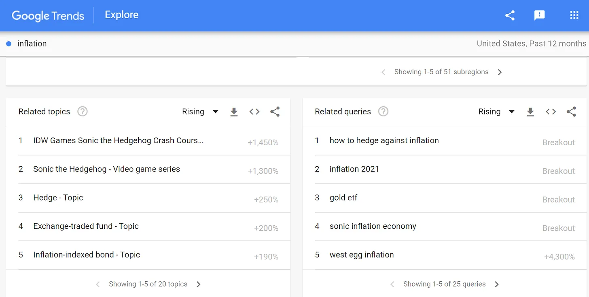
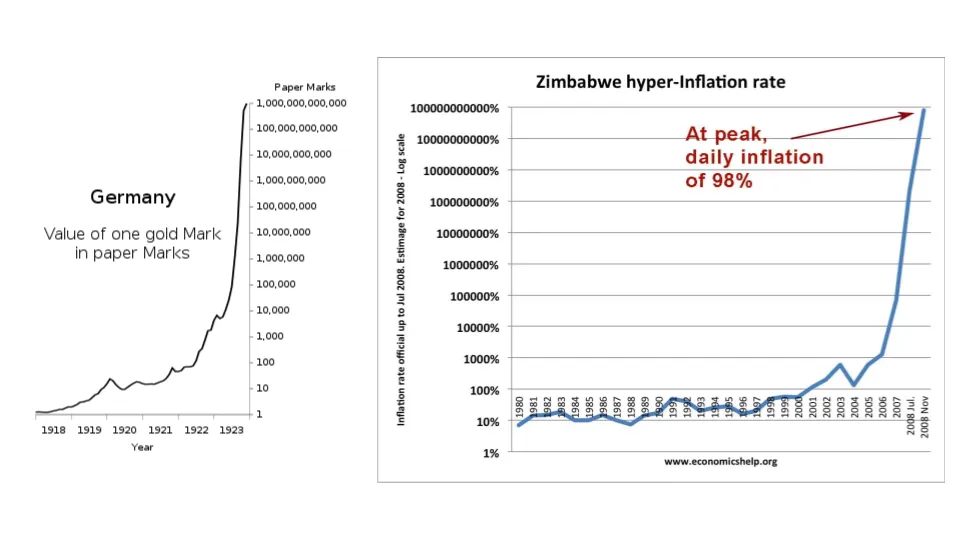

## テイクアウト

私たちはおそらく、私たちが思っているほどインフレについて知らないのでしょう。

## インフレについて私が理解できないこと

インフレが理解できません。

物価が上がるという概念は理解できます。しかし長い間、インフレの原因やインフレの測定方法、そしてインフレの調整方法が理解できませんでした。

**それに、誰も本当のところは知らない気がする。**

馬鹿げていると言うかもしれません。[making policy based on inflation targets](https://www.federalreserve.gov/faqs/economy_14400.htm 'fed')、[hedging against inverted yield curves](https://www.chathamfinancial.com/insights/hedging-in-an-inverted-yield-curve-environment 'yield')について話している人たちがたくさんいて、Googleのトレンドを信じるなら、ソニック・ザ・ヘッジホッグのゲームが[(apparently some weird nsfw meme).](https://tvtropes.org/pmwiki/pmwiki.php/VideoGame/SonicInflationAdventure 'sonic')

はい、でもそれが彼らが物事の仕組みを知っているという意味ではありません。私の職務経験から学んだことがあるとすれば、人は自分が何をしているのか理解せずに膨大な量の仕事をこなすことがある[^1]。ナッシム・タレブは以前、グリーンランバーの取引で成功した金融トレーダーの話でこのことについて書いています[without understanding what it was.](https://fs.blog/2016/11/green-lumber-fallacy/ 'taleb')

インフレの大きな問題は、まず何がインフレにカウントされるかを決めることです。これは簡単なことではありません。もしそう思うなら、次の質問を自分に投げかけてください。

- どのような大まかな「もの」のカテゴリーを含めたいですか?物理的な財産だけですか?サービスについてはどうですか?
- 何を含めるにしても、その価格をどう測るつもりだ?
- トイレットペーパーの価格が急騰するような異常なデータポイントはどのように説明しますか?
- どのくらいの頻度で測定していますか?
- それらの商品の品質改善はどのように説明しますか?品質が上がり価格が変わらなければ、それはデフレになるのでしょうか?

ご覧の通り、「消費者物価指数(CPI)を取って終わり」というだけではありません。実際、米連邦準備制度(FRB)は公式にはCPIを使わず、別の個人消費支出(PCE)物価指数を[^2]っています。それでも、[they acknowledge its imperfect nature:](https://www.federalreserve.gov/econres/notes/feds-notes/comparing-two-measures-of-core-inflation-20190802.htm 'fed')

>PCE物価インフレ率は、年次ベースでも非常に変動が大きいです。そのため、経済学者や政策立案者は、測定されたインフレの分散を減らし、一時的な変動と持続的な変動をより明確に区別し、最終的にはインフレの将来の動向をよりよく予測するために、指数の構成要素の重み付けの代替手法を提案しています

最近、定義が[monopolies](/writing/monopoly 'monopoly')を扱う際に重要であることについて話し合いました。規制は定義に依存しています。

同様に、あなたがインフレと定義するものは公共政策に大きな影響を与え、ひいては経済にも影響を与えます。もしFRBが都市のコスト上昇だけを見て郊外地域を除外したらどうでしょうか。あるいはエネルギーコストだけを見て、住宅費を除外した場合もどうでしょうか。

インフレのもう一つの大きな問題は、期待に影響されていることです。数学的な法則に従うことを期待するのは、株式市場が将来のキャッシュフローの現在価値を完全に反映することを期待するようなものです。だからこそ、インフレ目標を目指すのは非常に難しいのです。

米国連邦準備制度は2%の目標を掲げているため、上記の最初の文は1) FRBが仕事がひどいか、2) 本当に難しいことだと解釈できます。私はシステムの複雑さを考えると後者を信じる傾向[^3]。

期待のゲームであることを知っているからこそ、金融政策(金利)に関する[interpreting Fed statements](https://www.stlouisfed.org/open-vault/2019/may/how-read-fomc-statement 'Fed')に常に不確実性がある理由も説明できます[even though the Fed is trying to speak more plainly in recent years](https://www.bankrate.com/banking/federal-reserve/fed-simple-communication-may-be-confusing-markets/ 'Fed')

そうすることで、経済には完全に理解されていない多くの部分があるため、柔軟性が生まれます。**曖昧さは未知の未知に対する緩衝の余地を与えます。** そしてそれが最初からの計画だったかのように装い、信頼を高め、期待をコントロールし続けることができます。もし人々がFRBが何をしているのか理解しているという信頼を失うと、それは負のフィードバックループを生みます。まるで銀行が取り付け騒ぎに苦しみながら、顧客に取り付け騒ぎではないと納得させようとするようなものです。

そして、自信を失うと、次のような状況が生まれます。

インフレについて私が言いやすいのはこれだけだと思います。

1. 価格は一般的に時間とともにわずかに上昇し、複利すると名目価値は長期間にわたって大きくなります
2. 価格は短期間に大幅に上昇することもありますが、その原因は明確ではありません
3. 価格の小さな値上げを狙うのは難しく、大きな値上げを狙うのは簡単です。しかし、誰も大きな値上げを望みません
4. 多くの価格変動は期待に基づいているため、本質的に予測不可能かもしれません

ちなみに、私だけがそう考えているわけではありません。[Economist John Cochrane wrote about inflation recently](https://johnhcochrane.blogspot.com/2021/02/inflation-issues.html 'john') [^4]、そして私たちが本当にどれほど知っているのかも疑問に思っています。彼は、サービス業が時間とともにインフレの大きな要素になる可能性があると結論づけています。サービス業のインフレと商品のデフレの傾向が続くのです。

もしかしたらインフレは潮の満ち引きのようなものかもしれない[it goes in, it goes out, you can't explain that.](https://www.newser.com/story/109164/bill-oreilly-to-atheists-you-cant-explain-the-tides.html 'tide')

[^1]:私自身も含めて、何度もそうしてきました。

[^2]:["While the CPI and PCE price index both provide measures of how prices are changing over time, they are not constructed in the same way. One difference is the smaller number of items in the basket of the CPI. The CPI reflects out-of-pocket expenditures of all urban households, while the PCE price index also includes goods and services purchased on behalf of households. Another difference is the expenditure weights assigned to each of the CPI and PCE categories of items"](https://www.clevelandfed.org/en/our-research/center-for-inflation-research/consumer-price-data.aspx 'fed')

[^3]:本体の流れにこれを収める方法は見つかりませんでしたが、測定誤差という問題もあります。例えば、センチメートル単位で測定できる普通の定規があると想像してください(アメリカ人を見てください)。もしミリメートル単位のものを測るように言われたら(アメリカではセンチメートルより小さい)、それができますか?あなたの測定ツールの精度を考えると、それは不可能です。同様に、特に低いインフレ率を目標にしている場合、信頼区間がどれほど広いのか疑問に思わざるを得ません。

[^4]:彼の記事がこのテーマについて私の考えを書き留めるきっかけになりました。
