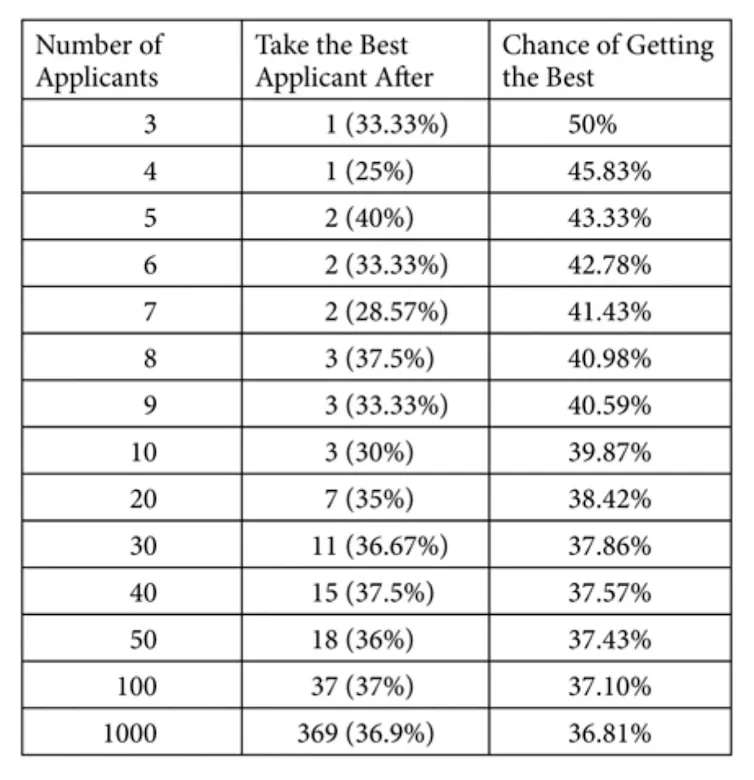

## テイクアウト

アルゴリズムとは、望ましい結果を得るためにたどるべき定義されたプロセスです。私たちの生活の多くはアルゴリズムによって決まります。どのアルゴリズムに従うべきかを知ることで、より効率的で効果的な意思決定が可能になります。

## 人生におけるアルゴリズム

最近、ブライアン・クリスチャンとトム・グリフィスによる『[Algorithms to Live By](https://algorithmstoliveby.com/ 'algo')』という本を再読しました。この本は、アルゴリズムが私たちの生活をより効果的にする助けになる方法についてです。昨年プログラミングを始めてから、今回はより多くのことを得ました。

アルゴリズムはプロセスであり、あるタスクを完了するために従うべき指示と考えることができます。例えば、数字を足し算する方法を学ぶのは簡単なアルゴリズム[^1]です。

より複雑な指示は、人生の他の問題に対しても結果を計算できます。金利、ウェブ検索ランキング、ソーシャルメディアのフィードはすべてアルゴリズムの出力に基づいています。本書は多くのそのようなアルゴリズムを紹介し、あなたが個人的に直面するかもしれない問題と関連付けています。

[^2]言及されているすべてのアルゴリズムを説明するのは難しいので、代わりにいくつかのアルゴリズムの短いハイライトを紹介し、通常は定量的なポイントではなく質的なポイントに集中します。

また、ほとんどのアルゴリズムは特定の前提に依存しています。毎回それを指定するのではなく、読む際にはそれを前提としてください。興味のある方のために脚注にいくつかの仮定を追加します。

議論されている問題のいくつかは以下の通りです:

- 最良の結果を得るために面接をいつやめるか
- 新しい選択肢を探るのをやめて、すでに知っている選択肢を楽しむべき時は
- 目標に基づいてタスクをスケジュールする方法

最初のアルゴリズムを見てみましょう。問題の取り組みをいつやめるべきかについてです。

## 最適な停止

選択肢(求職者、住宅のオファー、駐車スペースなど)を評価する場合、どれだけ時間をかけて選ぶかと、「最良の」選択肢を選ぶチャンスとの間にトレードオフがあります。これを「[secretary problem](https://en.wikipedia.org/wiki/Secretary_problem 'prob')」と呼びます。例えば秘書を雇う場合、最適な人を見つけるために何回面接すべきでしょうか?

この場合、使うべき正確なパーセンテージがあります。応募者の37%を見たら待ってから、次に良い応募者を選び[^3]。例えば、100人の応募者がいた場合、最初の37人を見終えた後、これまで見た応募者よりも優れた次の応募者を選ぶと良いでしょう。

それが数学的に最適なポイントであり、最適な人材を選ぶ可能性が最も高いです。早すぎると、後で面接を受ける人を見逃すかもしれません。遅すぎると時間を無駄に[^4]しまいます。

## エクスプロイトを探る

最適な停止状況と同様に、情報収集(探索)と楽しむ(エクスプロイト)の間にトレードオフがあります。例えば、カジノにいてどのマシンをプレイするか決めたいとします。勝ち金を最大化したいけれど、正確なマシンのオッズがわからなくても(もし知っていれば、最高のマシンをプレイするでしょう)。

この場合、[Gittins Index](https://www.cs.cornell.edu/courses/cs6840/2017sp/lecnotes/6840sp17R_Kleinberg.pdf 'gittins')と呼ばれる数字があり、最適なマシンを[^5]します。勝ち数や敗北数、将来の利益の価値が分かれば、各選択肢の正確な値を計算できます。興味深い性質:

- 最適なマシンをプレイして再び勝てるなら、そのマシンを続けるのが理にかなっています
- 最適なマシンをプレイして一度負けた場合、そのマシンを続けるのは理にかなっているかもしれません
- 全く未知のマシンは、よく勝つことが知られているマシンよりも好ましく、未知のマシンは将来の利益を重視するほど価値が高まる

その他の関連する含意:

- 探検は幼い頃に大きな影響を与える;赤ちゃんがすべてを口に入れることは彼らの立場から見れば理にかなっている
- 搾取は人生の後半により大きな影響を与えること;そのため、高齢者は社会的ネットワークを縮小し、お気に入りのレストランに戻ることを好みます

## 組分け

本書にはプログラミングでよく使われるソートアルゴリズムのいくつかの例が紹介されています。例えば、検索結果を返すには、あなたにとって最も関連性の高いものを並べ替える必要があります。

アルゴリズムの詳細な議論は理解が必要なので、また別の機会に取っておきます[time complexity](https://www.bigocheatsheet.com/ 'time')。以下は定性的に得られるポイントです:

- ソート方法によっては他よりもはるかに効率的(>10倍速さ)場合もあります。
- 一部のシナリオでは、ソート効率だけを求めない場合があります。例えば、スポーツシーズンの対戦カレンダーを組む際には、シーズンの興奮度も考慮する必要があります。ソート効率を最適化することはできますが、シーズン自体があまり刺激的でないように感じられます
- ソートが効率的であればあるほど、偶発的なミスに対して脆弱になる可能性があります。例えば、「最強」のチームがワールドカップ[^6]のようなシングルエリミネーショントーナメント(本質的にはソートアルゴリズム)で誤って敗退することがあります。

## キャッシュとメモリ

キャッシュの考え方は、1) 小さくて高速なメモリ(ストレージ)セクション、2) 大きくて遅いメモリセクションを持つことです。その後、意図に応じてこの2つを交互に使います。これにより、望む活動に対してある程度の速度とサイズの両方を得ることができます。

例えば、お気に入りの服はクローゼットにあり、使っていない服は屋根裏に置いておくかもしれません。よく使ったものにすぐ取り出せますが、もし望めばあの醜いクリスマスセーターを入れるスペースも確保できます。キャッシュは複雑に聞こえますが、私たちは日常生活のほとんどで自然にそれを行っていることに気づくでしょう。

どのアイテムを速いセクションに入れ、どのアイテムを遅いセクションに入れるかはどう決めていますか?ランダムなアイテム、最新のアイテム、最大のアイテムなどを入れることができます。

この場合、最近使ったアイテムを小さくて速いセクションに置くのが最適です。これは「[temporal locality](https://www.geeksforgeeks.org/difference-between-spatial-locality-and-temporal-locality/ 'temp')」と呼ばれる機能があるためです。最近使ったものは再び必要になる可能性が高いです。例えば、Googleドライブは頻繁に使うファイルをハイライトして素早くアクセスできます。

## スケジューリング

ほとんどの人は、やることリストの優先順位を決めなければなりません。これは通常、レスポンシブネス(対応の速さ)とスループット(どれだけの作業量を達成できるか)とのトレードオフを要求します。

スケジューリングと優先順位付けの重要なポイントは、目標指標の定義です。なぜなら、それがどのアルゴリズムを使うかを決めるからです[^7]。レスポンシブ性を最大化するには、どれだけ多くのことを成し遂げられるかが犠牲になります:

すべての[^8]プロジェクトの最大遅延を最小限に抑えたい場合は、[Earliest Due Date](https://en.wikipedia.org/wiki/Single-machine_scheduling 'EDT')アルゴリズムは最も早い締め切りから始めるように指示します。

総完成時間を最小限にしたいなら、[Shortest Processing Time](https://en.wikipedia.org/wiki/Single-machine_scheduling 'spt')アルゴリズムは最も早いタスクを優先するように指示します。

タスクの重要度が同じでない場合は、各タスクに重みを付け、必要な時間の重み比率を計算することで、どのタスクをやるべきか決めやすくなります。時間の重みが最も大きいプロジェクトを選びましょう。

実際には、チームがこのトレードオフについてどう考えているか、そしてどの方法を採用してほしいかをマネージャーと話し合う価値があるでしょう。

スケジューリングにはもう一つ重要な概念があります。それは「[context switching](https://blog.doist.com/context-switching/ 'switch')」という考え方です。タスクを切り替えるたびに。コンテキスト切り替えは実際の作業ではないので時間の無駄ですが、時間と労力を要します。

例えば、メールを書いているときにSlackのメッセージで中断された場合、返信するのと、メールで何をしたいかを思い出すのに時間がかかります。

最悪の場合、コンテキスト切り替えがスラッシュに変わり、スイッチだけに忙しくて生産的な作業ができないことがあります。スラッシュを避ける方法には以下があります:

- 課題にノーと言うこと、著者たちはしばしばそれができないことを認めています
- より愚かで非効率的に働くこと。タスクをどうやってこなすかを考えるよりも、何かに取り組み始めてやり遂げること

## ベイズの規則と分配

ベイズの法則を説明するには記事一本分の記事が必要になるので、単に何かが起こる可能性を予測するのに役立つルールとして捉え[^9]。著者たちが強調したいのは、これはあなたの事象がどの分布から来ているかによって異なるということです。主に考慮すべき分布は3つあります:

- べき乗則:ある事業が長く続いているほど、その成長が続くと予想されます。例えば、ある会社が長期間成長してきた場合、成長が続くと予想されます
- ノーマル:初期の出来事は驚き、遅い出来事は予想されます。例えば、若くして亡くなる人には驚き、晩年に亡くなる人には驚かされません。
- エルラン:出来事は決して驚きが増したり少なかったりします。例えば、ルーレットのホイールや[the coin flips we discussed last week](/writing/ergodicity 'sub')の記憶のない分布

## ゲーム理論

多くの人はおそらくゲーム理論を聞いたことがあるでしょう。これはゲームをプレイする際の最適な戦略を考える方法の一つです。いくつかのハイライト:

- 相手より何レベルも上にプレイすると、相手が実際には持っていない情報を持っていると思い込み、相手はあなたが思ってほしいことを考えられなくなります。言い換えれば、戦略であまりにも賢くなりすぎないようにしましょう
- すべての2人プレイゲームには、少なくとも1つの[Nash Equilibrium,](https://en.wikipedia.org/wiki/Nash_equilibrium 'nash')があり、両プレイヤーが自分にとって最適な戦略を選ぶ場面があります。
- しかし、ナッシュ均衡の求定は解決困難であり、ゲーム理論の実用性には限界があります
- 均衡がすべてのプレイヤーにとって最良の結果であるとは限らない。[It may be optimal for an individual to compete, but optimal for the group to cooperate.](https://en.wikipedia.org/wiki/Prisoner%27s_dilemma#:~:text=The%20prisoner's%20dilemma%20is%20a,working%20at%20RAND%20in%201950. 'wiki') これを「無秩序の代償」として定量化でき、協力と競争のギャップを測る。
- また、[mechanism design](https://en.wikipedia.org/wiki/Mechanism_design 'mech')という直感に反する概念があり、これはすべての結果を悪化させることが、均衡をシフトさせることで実際には全員をより良くする可能性があることを示しています

上記のアルゴリズムに加え、著者たちは以下の点も検討しています:

- 意思決定プロセスを過剰に学習しているかもしれない時と、それに対してできること
- 現実の問題が理論ほど楽しくないときにどうすべきか、そしてなぜ制約を緩めるべきか
- 情報ネットワーキングとインターネットの仕組みについて考える方法

全体的に、アルゴリズムが人生にどのように現れるのかを概観するために読む価値があると思いました。ただ、コンピュータサイエンスを少し学んでからより理解しやすくなったので、その点は覚えておいてください。また、もっと実践的な例[^10]入れてほしかったです。なぜなら、異なる前提に基づいて研究結果を生活に応用しようとするのは難しいからです。

[^1]:子どもたちに計算を覚え、いつ数字を入れるかを教えれば簡単に教えられますが、コンピュータで実装しようとすると意外にもわかりにくいです。参照[full adder logic gate](https://www.electronics-tutorials.ws/combination/comb_7.html 'full')

[^2]:説明する頃には、もう終わったと言えるかもしれません[written the entire book](https://en.wikipedia.org/wiki/P_versus_NP_problem 'p np')

[^3]:[The percentage is 1 divided by e, euler's number.](https://projecteuclid.org/journals/statistical-science/volume-4/issue-3/Who-Solved-the-Secretary-Problem/10.1214/ss/1177012493.full 'problem') 応募者の数が増えても確率は変わりませんが、得られる情報州によって変わります

[^4]:基地書記の問題は、見送った候補者に戻れないという前提ですが、現実に近いバリエーションもあります。

[^5]:この問題は、機械での報酬の確率が時間とともに変化する場合、解決困難と言えます。つまり、本質的に解決不可能であることを意味します。解決困難な問題もあります。このような場合、いくつかの制約を緩和し、「十分に近い」解決策を受け入れることで、問題の構造化に大いに役立ちます。

[^6]:アメリカ人にとってはマーチマッドネス

[^7]:スケジューリング問題のうち効率的に解決できるのはわずか9%です。

[^8]:つまり、遅延しているプロジェクトをすべて、その最大値を取るということです。それが最小限に抑えたい指標です。

[^9]:ベイズについて説明している記事は[here](https://betterexplained.com/articles/an-intuitive-and-short-explanation-of-bayes-theorem/ 'bayes')を参照してください。ベイズは直感的ではありません(少なくとも私にとっては)ので、知っておくと良いことです

[^10]:公平に言えば、脚注にはさらに詳述する情報がかなりあります
