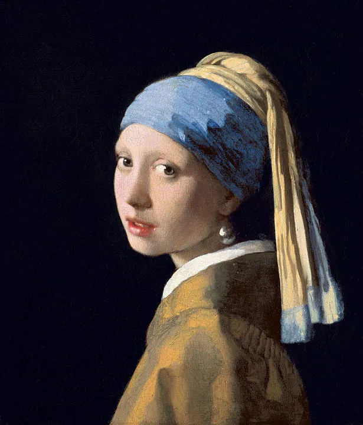
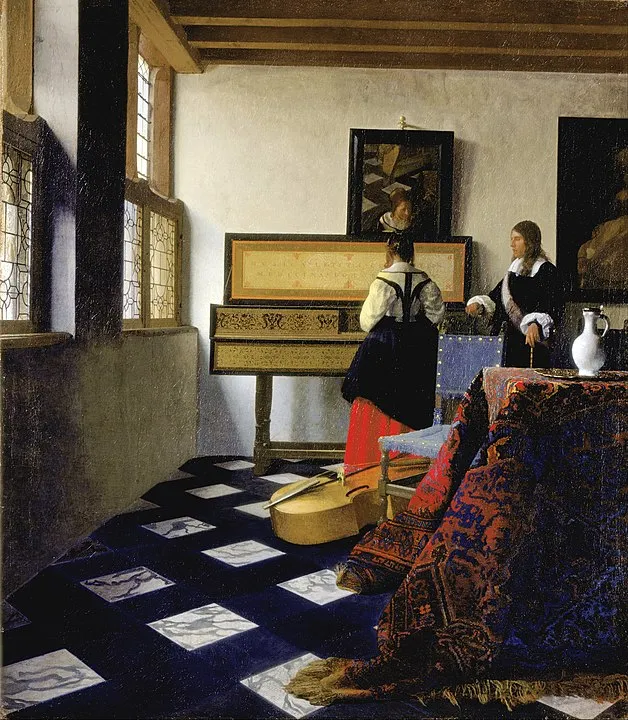

방금 알게 됐어요 [Tim's Vermeer](https://sonyclassics.com/timsvermeer/ 'website')펜 앤 텔러가 제작한 다큐멘터리\, [inventor Tim Jenison's attempt to reproduce a Vermeer using technology advanced for Vermeer's time](https://en.wikipedia.org/wiki/Tim%27s_Vermeer 'wiki link')\. 설정이 흥미로워 보여서 온라인에서 영화를 찾아봤고\, 그 논란에 대해 알게 되면서 더욱 흥미를 느꼈습니다\. 저는 아직 영화를 못했는데\, 논란과 그것이 내포하는 바를 파고드는 것이 흥미로웠기 때문입니다\.

저처럼 미술에 대해 잘 모르는 분들을 위해 배경 설명을 드리겠습니다\: [Johannes Vermeer](https://en.wikipedia.org/wiki/Johannes_Vermeer 'wiki') 1632년부터 1675년까지 살았던 네덜란드 화가였다\. 그는 특히 그의 시대 최고의 화가 중 한 명으로 인정받고 있다\. [realistic paintings and usage of light.](https://www.artble.com/artists/johannes_vermeer/more_information/style_and_technique 'vermeer style') [^1] 유명한 그림들로는 다음과 같은 것들이 있습니다 [^2]\:

얼마 전\, 데이비드 호크니와 필립 스티드먼이 다음과 같이 제안했습니다 **베르메르와 다른 예술가들도 그럴 수 있었을 것이다 [used lenses and mirrors to achieve the realism in their paintings.](https://www.vanityfair.com/culture/2013/11/vermeer-secret-tool-mirrors-lenses 'Vanity Fair link')** 이 논란은 가설을 세우는 사람들과 가설을 세운 과정 모두에 의문을 제기하게 만들었습니다\:

> 주요 미술사학자들은 설득되지 않았다\. 사람들은 호크니가 옛 거장들의 기량이 부족해서 질투하는 것뿐이라고 말했다\.

> 시카고 미술학교의 부정적인 역사가 제임스 엘킨스가 2001년에 지적했듯이\, \"호크니의 책에서 제시된 광학 절차들은 모두 근본적으로 충분히 검증되지 않았으며\,\" \"나를 포함해 아무도 카메라 오브스큐라 안에 들어가 그림을 그린 것이 어떤 것인지 진짜로 알지 못한다\"—방의 한쪽 면을 완벽하게 비추는 렌즈—그리고 \"그림을 그린다\.\"

여기서 팀 제니슨이 등장합니다\. 그는 스테드먼과 호크니의 아이디어를 믿었고\, **아이디어를 시험하기 위해 과정을 재현하세요\.** 다큐멘터리 \'팀의 베르메르\'는 그가 위 음악 수업 그림을 재현하는 시행착오를 따라가며\, 원작 그림에 나온 방의 실제 재현도 포함되어 있다\. 뉴욕 타임스 리뷰에 따르면\:

> 그가 그림 그리기에 보낸 130일 동안\(테이블로를 만드는 데 필요한 213일 이후\)\, 제니슨 씨는 여러 예상치 못한 장애물에 부딪혔습니다\. 카메라 옵스큐라가 그림을 그리기에 충분히 밝거나 선명한 이미지를 생성하지 못한다는 사실\(이 문제는 곡면거울을 추가해 해결됨\)이나\, 고된 작업의 지루함 등이 있었습니다\.

그가 성공했는지 스스로 판단할 수 있습니다 [^3]\. 일부 비평가들의 반응은 그들이 얼마나 불쾌해했는지를 특히 흥미롭게 보여준다\.

[From a Guardian review:](https://www.theguardian.com/artanddesign/jonathanjonesblog/2014/jan/28/tims-vermeer-fails 'guardian')

> 공포 영화 『더 플라이』와 비슷하다\. 제니슨이 의존하는 기술은 예술을 복제할 수 있지만\, 예술의 내면을 이해하지 못한 채 합성적으로 그렇다\. 그것이 뱉어내는 \'베르메르\'는 사산된 모조품이다\.

> 그렇다면 무엇이 부족할까요\? 이 영화는 과학을 올바르게 적용하면 누구나 아름다운 예술 작품을 만들 수 있음을 암시합니다\. 천재성 같은 신비로운 개념은 필요 없습니다\.

> 팀의 베르메르는 마치 누군가가 명작의 수치화를 벽난로 위에 걸고 진품만큼 좋다고 주장하는 것과 같다\. 마침내 속물을 위한 예술 영화가 나왔다\.

[From a NYT review:](https://www.nytimes.com/2014/01/31/movies/tims-vermeer-chronicles-an-attempt-to-make-one.html 'NYT')

> 그는 베르메르의 방식을 재현하려는 모든 노력을 기울이지만—빛을 연구하고\, 직접 안료를 갈고\, 정교한 세트를 만들지만—베르메르의 예술에는 전혀 관심이 없는 듯하다\. 그가 차이를 느끼지 못한다는 점은\, 폴록의 작품을 보며 혁명 대신 손가락 그림으로 보는 진부한 갤러리 관람객보다 더 열심히 일하고 자금이 더 풍부한 버전으로 만든다\.

[From an art history news site:](https://www.arthistorynews.com/articles/2614_Tims_notVermeer 'AHN')

> 요즘은 전통적인 방식으로 그림을 그리는 사람이 너무 적기 때문에\, 우리는 사실 베르메르 같은 위대한 예술가들도 할 수 없다고 스스로를 속이려 하며\, 그가 단지 속임수를 쓴 것뿐이라고 생각하게 됩니다\. 그렇게 생각하면 우리도\, 그리고 현대 예술가들도 더 위로가 됩니다

> 영화는 처음부터 모순과 역사적 오류로 가득 차 있었다

[And someone even thought the moview was an intentional hoax:](https://digitopoly.org/2014/06/15/10-reasons-to-doubt-tims-vermeer/ '10 reasons to doubt')

여기에는 두 가지 별도 반대가 있는 것 같습니다\. 하나는 **아이디어** 그리고 1은 **과정\.**

이 아이디어에 반대하는 사람들은 예술적 천재성이 기술 혁신과 노력으로 \'축소\'될 수 있다는 생각을 단순화하고 신성모독이라고 생각합니다\.

이 과정에 대한 비평가들은 사실들이 그림이 다른 방식으로 제작되었음을 암시한다고 생각한다 [^4]\.

이 아이디어에 대한 비평가들은 아무도 실제로 하지 않는 주장\, 즉 베르메르가 주장하는 것에 분노하는 것 같습니다 _꼭_ 이 기법을 사용했으며\, 암묵적으로 베르메르가 _덜_ 천재의 말이야\.

그게 영화의 요점이 아니야\. 중요한 건 베르메르가 _할 수 있어_ 이 기법을 써봤는데\, 설령 그랬다 해도 그의 작품을 바라보는 방식이 달라지지 않습니다\.

\'기술\'의 잠재적 사용이 비평가들을 그렇게 충격에 빠뜨린 것은 이상한 일입니다\. 만약 우리가 예술에서 기술을 사용하지 않는다면\, 현대 붓\, 물감\, 기법 등을 사용한 모든 예술 작품은 그로 인해 감소한다고 간주되어야 하지 않을까요\? 피카소가 동굴 벽화에 대해 말했다는 소문과는 달리 [^5]예술이 발전하고 기법이 발전한 것을 사람들이 높이 평가할 거라 확신합니다\.

[Neither Penn and Teller nor Tim himself are claiming anything else:](https://www.nytimes.com/2013/12/01/movies/tim-jenison-an-inventor-paints-the-music-lesson.html 'NYT article')

> \"우리는 절대 \'팀 제니슨이 베르메르가 어떻게 그림을 그리는지 발견했다\'고 말한 적이 없습니다\,\" \\\[펜\]이 말했습니다\. \"그리고\,\" 그는 덧붙였다\, \"관객이 스스로 판단하도록 내버려 두는 게 아닙니다\. 그건 항상 거짓말입니다\. 우리는 팀이 저에게 제시한 대로 정확히 제시합니다\. 즉\, \'음\, 이거 괜찮을 것 같네\.\'라는 뜻이죠\. ”

> 제니슨 씨는 영화에서 그린 그림이 반드시 예술 작품으로 간주되어야 한다고 주장하지 않았다\. \"베르메르가 예술을 창조했다\"고 그는 말했다\. \"내가 할 수 있는 최선은 똑같이 생긴 것을 생각해낸 것뿐이었다\. 왜 또 다른 \'음악 수업\'이 필요한가\? 그저 얼마나 가까이 다가갈 수 있는지 보고 싶었을 뿐이다\.\"

**이는 가디언과 2014년 뉴욕타임스 리뷰가 영화에 대해 제기한 주장을 완전히 반박한다** \'그림이 똑같이 좋다고 주장한다\'거나 \'차이를 못 느낀다\'는 의도입니다\. 두 리뷰의 주요 요점이 \'영혼 없는 창백한 모방물이며 진정한 예술이 아니다\'라는 점이 아니라\, \'이게 그럴듯하고 흥미로운 방식으로 그려졌다\'는 점은\, 리뷰어들이 영화가 비난하는 것보다 더 편협하다는 것을 보여줍니다\.

저도 동의합니다\. [Teller's thoughts](https://www.npr.org/2013/12/02/248190117/teller-breaks-his-silence-to-talk-tims-vermeer 'teller') 그거 _가정해_ 베르메르는 이 방법을 사용했는데\, 그가 더 나은 예술가가 되게 해줍니다\:

> 예술은 한 인간의 마음이 다른 사람의 마음과 소통하는 활동입니다\. 만약 베르메르가 이 방법을 사용했다면\, 팀이 꽤 강하게 믿는 이 방법을 썼다면\, 그것은 베르메르를 더 나은 작품으로 만듭니다\. 이는 베르메르가 단순히 멋지고 아름다운 아이디어를 가진 사람이었으며\, 기적적인 구성을 할 수 있었던 사람이었을 뿐만 아니라\, 그 아이디어를 캔버스에 옮기기 위해 엄청난 노력을 기울일 준비가 되어 있었다는 뜻입니다

[Or as another review put it:](http://www.howtotalkaboutarthistory.com/reader-questions/tims-vermeer-artistic-genius/ 'how to talk')

> 그 이론을 진지하게 받아들인다고 해서 베르메르가 덜 재능적이라는 뜻도 아니고\, 그의 작품이 덜 의미 있는 것도 아니다\. 단지 미술사가로서 우리는 \'천재\'라는 개념을 버리고 전 세계와 역사 전반에 걸쳐 존재하는 다양한 예술적 실천을 기꺼이 바라봐야 한다는 뜻이다\.

저는 이 과정을 비판하는 분들에 대해 더 높이 평가하게 됩니다\. 예술을 잘 알지 못하는 저는 그 비판이 타당한지 판단할 수 없지만\, 만약 타당하다면\, 위에서 언급한 호크니와 스테드먼 이론을 반박하는 것 같습니다 [^4]\. 이 영화는 \'기술이 예술이 아니다\'보다는 \'이 다른 사실들을 고려할 때 베르메르가 한 일 가능성이 더 높다\'는 점에 초점을 맞춘 좀 더 공정한 해석이다\.

**베르메르가 정말로 팀의 기법을 사용했는지는 중요한 것이 아니다\;** 베르메르가 _할 수 있어_ 팀의 기법을 사용했다\. 이 점을 고려하지 않고 팀 작품의 \'예술성\'을 공격하는 비평가들은 설명 가능한 것에 대한 비합리적인 두려움을 가진 듯하다\. 모든 좋은 예술이 분석되는 것은 아니지만\, 그렇게 하려는 시도는 우리가 격려해야 할 일이지 막아야 할 일이다\. [^6]

이와 관련된 또 다른 심층 기사는 다음을 참고하세요 [this link](http://www.davidbordwell.net/blog/2014/02/03/i-am-a-camera-sometimes-tims-vermeer/ 'david bordwell')

[^1]: 참고 ["What makes Vermeer a great artist? Some would say that Vermeer’s use of color sets him apart, that his unabashed use of expensive and natural pigments resulted in rich expressions of everyday life, more beautiful and perfect than the thing itself. Some say that it was his innate capacity to achieve uncanny realism without any formal training, whatsoever. Others will argue that his poetic use of light and shadow to highlight certain compositional elements makes him unique."](https://www.santafe.edu/events/painting-and-optics-17th-century-discussion-and-sc 'santa fe vermeer')

[^2]: 사진 출처\: [By Johannes Vermeer - Copied from Mauritshuis website, resampled and uploaded by Crisco 1492 (talk · contribs), October 2014, Public Domain, ](https://commons.wikimedia.org/w/index.php?curid=36351343) 그리고 [By Johannes Vermeer - CwFxCw3kUr-Lrw at Google Cultural Institute maximum zoom level, Public Domain, ](https://commons.wikimedia.org/w/index.php?curid=22127311)

[^3]: [This link](http://www.howtotalkaboutarthistory.com/wp-content/uploads/2016/11/vermeer-big.png 'comps') 왼쪽에는 팀의 버전\, 오른쪽에는 베르메르의 버전이 있으며\, 출처에서 가져왔습니다 [this site](http://www.howtotalkaboutarthistory.com/reader-questions/tims-vermeer-artistic-genius/ 'vermeer review')

[^4]: 미술사 뉴스 사이트에는 밑그림과 유약 사용이 호크니와 스테드먼의 이론이 틀렸다는 여러 징후라고 언급한 댓글이 있습니다\. 또한 내셔널 갤러리의 기사도 참고합니다\. [Vermeer's painting techniques](https://www.nationalgallery.org.uk/paintings/research/meaning-of-making/vermeer-and-technique/paint-application 'Nat Gallery') 그 말이 그 말을 뒷받침합니다

[^5]: 하지만 그들을 보고 나서 \'우리는 아무것도 발명하지 않았다\'고 주장한다 [this paper](http://www.euskomedia.org/PDFAnlt/munibe/aa/200503217223.pdf 'quote source') 이 인용문들은 발명되었을 수도 있다는 뜻입니다\.

[^6]: 예술에 대해 잘 모르는 저라면 이 글에 대해 더 경험 많은 사람에게 욕설을 받을 수도 있지만\, 제가 아는 한 제 주장은 고수합니다\.
