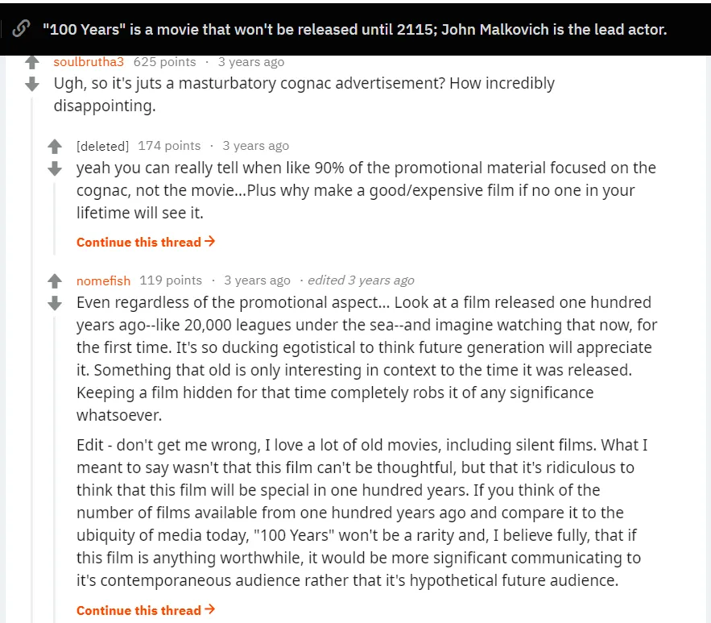

시간과 관련된 것들에 매료되어 있습니다\. 실험에서 어떻게 되는지 보여줍니다 [memory and time are linked](/writing/time_illusion 'time illusions')\, 로 [organisations that aim to last 10,000 years](http://longnow.org/ 'long now')사람들이 시간의 흐름을 어떻게 이해하고 시간과 상호작용하는지 보는 것은 생각을 자극합니다\. [Time travel with a machine](https://en.wikipedia.org/wiki/Time_travel_in_fiction 'wiki') H\. G\. 웰스가 그의 \"타임머신\" 이야기에서 대중화했으며\, [some cultures have old stories about time dilation](http://www.openculture.com/2018/02/whats-the-origin-of-time-travel-fiction.html 'origin?')\, 이는 우리가 시간의 신비로운 특성에 대해 한동안 생각해왔음을 보여줍니다\.

그래서 제가 관심을 가졌던 거예요\. [this reddit post](https://www.reddit.com/r/movies/comments/4ke64j/100_years_is_a_movie_that_wont_be_released_until/ 'reddit') 그것이 저에게 새로운 것을 소개해 주었습니다 [100 years](<https://en.wikipedia.org/wiki/100_Years_(film)> 'wiki')존 말코비치와 로버트 로드리게스가 제작한 영화로\, 2115년에 개봉할 예정이었다\. 2015년 팀이 홍보 캠페인의 일환으로 금고에 봉인한 지 100년이 지난 후였다 [Louis XIII Cognac](<https://en.wikipedia.org/wiki/Louis_XIII_(cognac)> 'wiki')이 작품은 최대 100년 된 영혼을 사용한다\. 이 작품이 광고의 일부임에도 불구하고\, 정말 훌륭한 아이디어다\. 자신의 작품이 100년 후에도 의미 있을 것이라고 자신 있게 말할 수 있는 사람이 얼마나 될까\? 인위적으로 시스템을 만들어 말코비치와 로드리게스는 영화의 질과 상관없이 흥미로운 이야기를 만들어냈다\. 나는 흥미로운 이야기를 사랑한다\.

하지만 일반 대중의 평가는 그리 긍정적이지 않았습니다\:

영화가 아마 별로일 거라는 말\, 자위 광고라는 말\, 혹은 100년 후 관객들이 이 영화를 좋아하길 기대하는 게 자기중심적이라는 말까지 다양했다\.

이 중 일부는 사실일 수도 있어요\! 이 영화가 좋을지 아닐지는 전혀 모르겠어요\. 확실히 광고예요 \[\^1\]\. 그건 _이야\._ 100년 후에 사람들이 관심을 가질 거라고 기대하는 건 자아도취적이에요 \[\^2\]\.

하지만 스스로에게 물어보세요\: 만약 당신이 2115년에 초연에 초대된다면\(그때까지 산다고 가정한다면\)\, 가겠습니까\?

그 질문에 대한 답이 이 대작의 의미를 이해하는 사람과 전혀 이해하지 못하는 사람들을 구분한다고 생각한다\. 영화가 좋든 나쁘든\, 광고라는 사실이 중요하지 않고\, 이 모험 전체가 자아도취적이라는 점도 분명히 중요하지 않다\. _그게 바로 요점입니다_\. 팀이 100년 후\, 아마도 오래전에 죽었을 때에도 자신들의 중요성을 드러낼 수 있다는 사실은 놀랍습니다\.

다음은 팀과 다른 이들의 생각입니다\:

> [Rodriguez told Indiewire last year that he had never done anything like this: “I was intrigued by the whole concept of working on a film that would be locked away for a hundred years. They even gave me silver tickets for my descendants to be at the premiere in Cognac in 2115. How cool is that? What John and I wanted it to be was a work of timeless art that can be enjoyed in 100 years. I’m very proud of it even if only my great grandkids and hopefully my clone will be around to watch.”](https://www.indiewire.com/2016/05/john-malkovich-robert-rodriguezs-film-100-years-will-be-displayed-at-cannes-before-2115-release-291273/ 'indiewire')

> [“When this idea was proposed to me, I just thought it was a very clever and fascinating concept to do something which essentially certainly I will never see,” he says. “But I like that. The truth is if you act in a play you never see it. I’ve certainly acted in a lot of movies I’ve never seen and a number of them I wouldn’t particularly be tempted to.”](https://people.com/celebrity/john-malkovich-explains-why-he-made-a-movie-no-one-will-see/ 'people.com')

> [In terms of time, "100 Years" looks to be the most ambitious film in history since last year's "Boyhood," which chronicled the life of a young man from age 6 to age 18. The film was shot over a 12-year period by director Richard Linklater, whose brilliant concept for such a simple story made waves among film fanatics.](https://www.theodysseyonline.com/100-years-the-movie-you-will-never-see 'theodyssey')

만약 이 실험이 실패한다면\? 만약 금고가 사라지거나\, 필름이 시간이 지나면서 손상되거나\, 사람들이 완전히 잊어버린다면\? 그럼에도 이 프로젝트는 여전히 흥미로울 것이다\. 실패의 원인이 무엇이었는지\, 그리고 그것을 어떻게 막을 수 있었는지 알고 싶다\. 오늘날에도 1900년대 영화가 남아 있다면\, 미래에 근본적으로 변화가 있어 100년 전의 역사와 연결되지 않을까\? 비슷한 [other long dated experiments,](https://en.wikipedia.org/wiki/As_Slow_as_Possible 'ASAP') 오래 남을 작품을 만들려는 시도는 박수를 받아야 합니다\.

이 영화가 모두에게 맞지 않을 수도 있다는 점은 이해합니다\. 심지어 코믹하게 형편없을 수도 있습니다\. 하지만 이 광고를 속임수라고 생각하는 관점은 핵심을 놓치고 있습니다\. 말코비치\, 로드리게스\, 그리고 팀은 특별한 무언가를 만들어냈습니다\. 이 영화가 개봉할 때 살아 있길 바라지만\, 어쨌든 시사회에 참석할 수 있는 분들을 기쁘게 생각합니다\.

\[\^1\] 자위든 아니든\, 결정은 여러분이 하게 하겠습니다\. 
\[\^2\] 하지만 영화 제작은 모두 자아도취적이지 않나요\? 또는 예를 들어 글쓰기처럼 관심을 끌려는 모든 형태의 창작물도 마찬가지입니다\.
