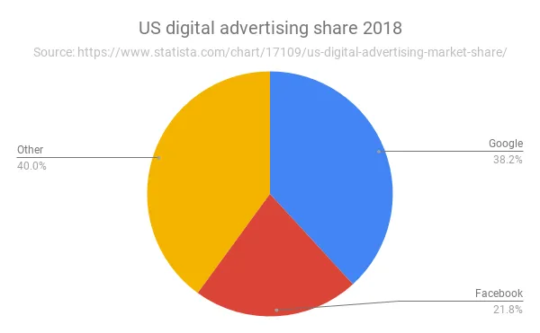

## 뉴스레터가 인기를 얻는 이유는 무엇이며\, 이 추세는 어디로 향하고 있을까요\?

지난달 뉴스레터를 발행한 후\, [a16z led a $15mm funding round in Substack](https://on.substack.com/p/the-future-of-substack 'substack site')\, 제가 현재 이 글을 보내는 데 사용하는 플랫폼입니다 [^6]\. 저는 왜 a16z가 Substack에 관심을 가졌는지\, 그리고 이 트렌드가 어디로 향하고 있다고 생각하는지 이야기하려고 합니다\.

출처 [a16z's press release](https://a16z.com/2019/07/16/substack/ 'a16z')\:

> 그 이후로 인터넷은 미디어 제작자들에게 새로운 기회를 열어주었습니다\. 작가\, 스트리머\, 팟캐스터가 이제 수백만 명의 청중에게 다가갈 수 있습니다\. 어떤 형식의 콘텐츠를 자가 출판하기를 더 쉽게 만들어주는 강력한 도구들이 만들어졌습니다\. \\\[\.\.\.\\\] 하지만 이 대부분은 1800년대 광고 기반 비즈니스 모델에 의해 주도되고 있습니다 — 기술은 변했지만 경제 모델은 대체로 동일합니다\.

스트라테커리는 [written before](https://stratechery.com/2015/why-web-pages-suck/ 'ads') 광고 네트워크가 인터넷 광고 성장을 어떻게 촉진했는지에 관한 이야기입니다\. 인쇄 매체에서 디지털 매체로의 전환은 소비자에게 서비스를 제공하는 한계 비용이 0임을 의미했습니다\. 이러한 진입 장벽 감소는 온라인 무료 콘텐츠의 급증으로 이어졌으며\, 이 추세는 여전히 지속되었지만 다양한 형태로 진화했습니다 [^1]\.

**제작 비용이 낮고\, 대체 가능성이 높으며\, 콘텐츠 공급자의 분열이 심하기 때문에 콘텐츠 제작자들은 다음과 같이 가정했습니다 [people wouldn't pay for content](https://www.cnbc.com/2018/11/17/subscription-news-services-flourish-as-google-facebook-dominate-ads.html 'cnbc')광고를 판매하는 것이 더 나은 비즈니스 모델이라는 점도 알게 되었습니다\.**

As [the CNBC article](https://www.cnbc.com/2018/11/17/subscription-news-services-flourish-as-google-facebook-dominate-ads.html 'cnbc') 참고로\, 몇 가지 요인이 대안적이고 구독 기반 모델의 등장을 이끌었습니다\. **구글과 페이스북이 디지털 광고에서 지배적이고 효과적이면서\, 뉴스 사이트와 같은 전통적인 콘텐츠 제작자에서의 광고는 점점 덜 효과적이게 되었습니다\.** 광고주로서 저는 광고 예산의 60\%가 통과할 곳에 더 많은 광고 예산을 쓰고 광고 투자 대비 수익률을 높이고 싶습니다\.

구글과 페이스북이 트래픽을 장악하는 것은 또한 한계 사용자 확보 비용을 초래할 수 있어\, 서비스 제공 한계 비용이 더 이상 0이 아님을 의미합니다\. 일반 미디어 사이트에서는 유기적 트래픽이 감소하고 고객과의 관계가 약화되면서도\, 경쟁사의 무료 콘텐츠 과잉 문제로 차별화하기 어려운 상황에 직면해 있습니다\.

그 결과\, 광고에 의존하는 대부분의 콘텐츠 제작자들이 어려움을 겪는 것을 보았고\, 디지털 시장은 계속 성장하고 있습니다\. 이에 대응해 일부 기업들은 틈새 기술 뉴스 사이트와 같은 구독 서비스로 전환했습니다 [The Information](https://digiday.com/podcast/the-informations-jessica-lessin-on-five-years-of-subscription-journalism/ 'Info')\. WSJ\, 워싱턴 포스트\, 뉴욕 타임스 등도 이 추세에 동참했습니다 [^2]그들의 양질의 콘텐츠가 사람들이 돈을 지불하도록 설득하기에 충분하길 바라는 것입니다\. 어떤 사람들은 이렇게 말할 것입니다 [their supposed success](https://digiday.com/podcast/inside-wall-street-journals-subscription-strategy/ 'WSJ') 구독이 앞으로 수익을 창출하는 방법임을 보여주세요\. **구독이 계속 늘어날 것이라는 데는 동의하지만\, 확장성이 얼마나 될지는 좀 더 불확실합니다\.**

> 오늘날 창작자와 관객 간의 직접적인 관계는 새로운 세대의 전문 작가와 콘텐츠 창작자를 열어줄 수 있습니다\. 바로 그 점에서 독립 작가들이 뉴스레터\, 팟캐스트 등을 출판할 수 있는 선도적인 구독 플랫폼을 구축하는 Substack이 등장합니다\.

수익화의 핵심은 그 점이 있다는 것입니다 **청중과의 직접적인 관계\.** 만약 그것을 구글이나 페이스북에 아웃소싱한다면\, 당신은 중개자가 되기로 선택하는 것입니다\. 뉴스레터 트렌드는 이메일 제공업체가 서비스에 요금을 부과하지 않는 한 중개자가 될 가능성이 전혀 없다는 점에서 흥미롭습니다 [^3]\. 작가로서 웹사이트\, 링크드인\, 매체에 공개적으로 글을 올리는 것보다 더 친밀하게 느껴집니다\. 독자들이 서비스에 참여했기 때문에 기분이 좋아지고\, 이는 사람들이 실제로 당신의 잡담을 읽고 싶어 한다는 뜻입니다 [^4]

> 무엇보다도\, Substack은 작가들이 독자와 소통하고 성장할 수 있도록 구독 기반 플랫폼을 지원하는 모든 기술을 담당합니다\.

[I've written before](/writing/substack 'substack') 왜 제가 Substack을 선택했는지에 대해서요\. 저는 ~~스팸~~ 수년간 친구들에게 무작위로 생각을 이메일로 보내면\, 가끔은 친절하게 답장을 보내 제가 그냥 쓸쓸 수 없는 허공에 글을 쓰는 게 아니라는 걸 알려주었습니다\. 하지만 이메일 리스트가 늘어나면서 더 확장 가능하고 전문적인 솔루션이 필요했습니다\. 뉴스레터 서비스는 이메일 가입을 더 쉽게 관리할 수 있게 해주었고\, 사람들이 구독을 취소하는 것도 더 쉬웠습니다 [^5]웹과 모바일에서 전반적으로 더 나은 그래픽 경험을 제공합니다\. 완벽하지는 않고\, 제안할 만한 것도 많지만 지금까지는 이 움직임이 마음에 듭니다\.

이 추세는 어디로 가는가\? [Substack grew from 11k paying subscribers in 2018 to 50k paying subs now](https://www.vanityfair.com/style/2019/07/peak-personal-newsletter-and-i-feel-fine-substack-tinyletter 'peak?')구독하는 뉴스레터 수도 해가 갈수록 늘어났습니다 [^6]\. 아직 뉴스레터 최고조에 도달하지 않았다고 80\% 확신하며\, Substack은 유료 구독자 수를 두 배로 늘릴 수 있습니다\. [millions of people still paying for dial-up internet](https://www.digitaltrends.com/cool-tech/aol-dial-up-a-relic-of-the-past/ 'aol')저는 틈새 주제에 대해 콘텐츠에 비용을 지불할 의향이 있는 사람들의 시장 규모가 계속 커질 것이라고 확신합니다\.

내용이 반드시 그래야 한다고 생각합니다 [focused on a niche](https://on.substack.com/p/the-future-of-substack 'substack success niche') 하지만 사람들이 Matt Levine이나 Morgan Housel이 금융에 대해 글을 쓸 것이라 기대하고\, 주제가 바뀌면 구독을 취소하는 것과 비관합니다\. WSJ 같은 몇몇 주류 출판물만이 유료 장벽을 부과할 수 있어\, 1\) 대형 주류 출판사가 광고를 해야 하고 2\) 틈새 품질의 출판물이 구독을 하는 조합을 볼 수 있습니다\.

사람들은 자신이 관심 있는 문제에 대한 좋은 분석을 읽고 싶어 하며\, 그 중 일부만이 창작자를 지원하기 위해 비용을 지불할 의향이 있습니다\. [Looking at the average Patreon earnings](https://www.crowdcrux.com/patreon-statistics-and-demographics-average-patreon-earnings/ 'Patreon')\, 평균 월 납부액은 약 \$10 정도 정도입니다\. 평균 납부액은 크게 증가하지 않겠지만\, 유료 사용자 수는 증가할 것이라고 생각합니다\. 재무 모델을 만들고 싶다면 ARPU 플랫과 DAU가 가속화되고 있습니다\.

그동안 이 모든 것을 내가 글쓰기를 얼마나 좋아하는지 실험하는 일로 삼고 있다\. 잠재력을 고려할 때 [high upside and relatively low downside, I agree with others](https://www.perell.com/blog/why-you-should-write 'write') 자신의 생각을 쓰고 출판하는 것이 가치 있다고 생각했습니다\. 글쓰기는 개념을 더 잘 이해하는 데 도움을 주었고\, 흥미로운 사람들과 연결해 주었으며\, 일을 하는 대신 미룰 무언가를 주었습니다\. 앞으로도 꽤 오랫동안 그렇게 하고 싶습니다\. 언제나 그렇듯\, 피드백을 환영합니다\!

[^1]: 제가 서브스택과 카메오가 라운드를 올린 공로를 차지하고 싶지만\, 제가 실제로 그렇게 영향력이 있다고 생각하지는 않습니다\.

[^2]: 예를 들어\, 블로깅 물결\, 페이스북 물결\, 인스타그램 물결\, 틱톡 물결 등이 있습니다\. 사람들은 명성이나 지위를 얻기 위해 \(희망컨대\) 전 세계가 볼 수 있도록 자신의 콘텐츠를 만들고 게시할 수 있다고 느끼는 것입니다\.

[^3]: 프리미엄 모델\, 제한된 유료 장벽\, 하드 유료 장벽 등 다양한 방식으로 진행됩니다

[^4]: 가능성은 낮지만\, 주어진 [Superhuman's](https://a16z.com/2019/06/27/superhuman/ 'a16z') 인기도\, 0이 아니라도 확률이 있을까요\?

[^5]: 순전히 연민 때문인지\, 진심 어린 관심 때문인지는 별개의 문제입니다

[^6]: 예전에는 이 얘기를 더 자주 했는데\, 관심 없으면 구독 취소해도 괜찮아요\! 스팸 보내는 거 싫어요

[^7]: 제가 구독하는 뉴스레터 중 일부는 다음과 같습니다 [Movements for micromobility](https://movements.substack.com/ 'movements')\, [The Profile](https://theprofile.substack.com/ 'profile') 장편 인물 이야기를 위한 것\, 그리고 [The Diff](https://medium.com/@byrnehobart/about-best-of-faq-25df97a74467 'Diff') 흥미로운 비합의 의견을 위한 자료
